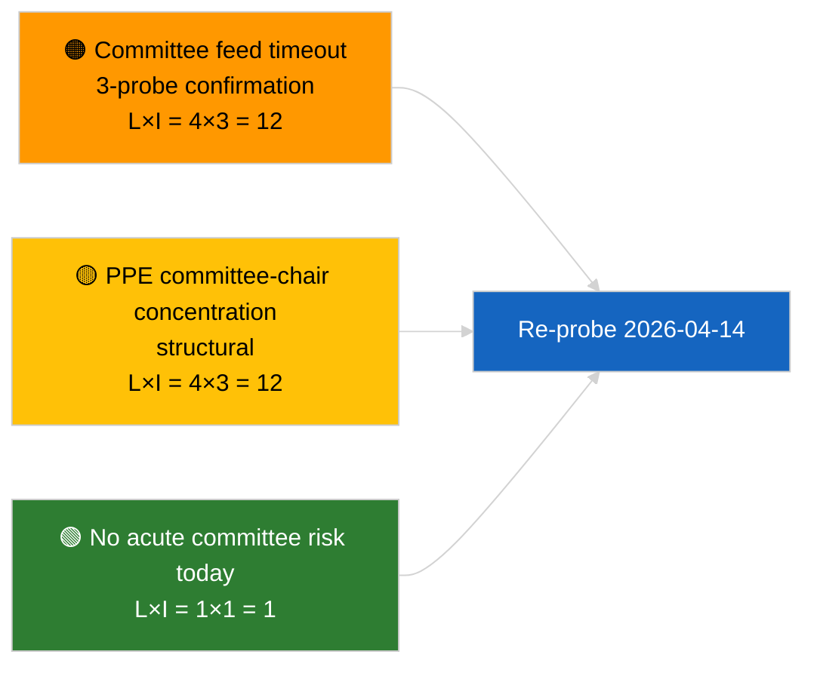

<!-- SPDX-FileCopyrightText: 2026 Hack23 AB -->
<!-- SPDX-License-Identifier: Apache-2.0 -->

# תדריך מנהלים — דוחות ועדות | 2026-04-03

**סיווג:** OSINT | רשומה פרלמנטרית ציבורית
**רמת ביטחון:** 🟢 גבוהה (הערכה מבנית בהפסקת מושב, מצב API מדורדר)
**תאריך הנפקה:** 2026-04-03T00:00:00Z (תדריך רטרואקטיבי)
**סוג מאמר:** דוחות ועדות
**מזהה ריצה:** `5568290b-7656-4c6e-ae61-b57740690541`
**מקור:** פורטל נתוני הפרלמנט האירופי

---

## 🎯 BLUF

**לא אוחסנה אף מסמך ועדה ב-2026-04-03; ה-API של פיד הפרלמנט האירופי נמצאת במצב מדורדר מאומת (ראו הערכה נלווית `breaking-2`).** הריצה `5568290b-7656-4c6e-ae61-b57740690541` החזירה: **"רישום כמותי של סיכונים על פני 0 ממדים פוליטיים שזוהו"** — אפס שחקנים מדורגים, מובהקות שגרתית. `get_committee_documents_feed` נמצא ברשימת נקודות הקצה הכושלות (פסק זמן בשלוש בדיקות יומיות). בהתאם לכך, בסיס הנתונים המהותי של הוועדות זהה לנתונים המסורגים בחבילת רפורמת המאבק בשחיתות שזוהתה ב-2026-04-03/breaking-3 (ECON סגן נשיא ה-ECB, TRAN/ENVI פליטות HDV, JURI מאבק בשחיתות + ברון, INTA מכסי ארה"ב, AFET גאורגיה). **🟢 ביטחון גבוה** שהמצב הריק היום נובע מתדרדרות הפיד בצירוף סוף שבוע המושב.

---

## 🧭 שלושה החלטות שהתדריך מסייע להן

| # | החלטה | מקבל ההחלטה | מועד אחרון | ראיות |
|:-:|--------|-------------|:----------:|-------|
| 1 | **עריכה:** דלג על סיקור יומי של ועדות | עורך | +24 שעות | ריצה ריקה + פידים מדורדרים מאומתים |
| 2 | **ניטור:** כלול בסבב השחזור של 2026-04-14 לאחר החג | צינור נתונים | 2026-04-14 | יום העסקים הראשון לאחר פסחא |
| 3 | **מעקב עתידי:** שבוע עבודת ועדות 13–17 אפריל לדוחות Q2 מהותיים ראשונים | ראש אנליזה | 2026-04-13 | מחזור קדם-מליאה |

---

## 📰 קריאה של 60 שניות

- 🔴 **אין מסמכי ועדות** היום; פסק זמן `get_committee_documents_feed` ב-3 בדיקות. (🟢 גבוהה)
- 🟠 **0 שחקנים מדורגים**; מובהקות שגרתית. (🟢 גבוהה)
- 🟢 **מלאי ועדות מרץ–Q2** מגבש רשימת מעקב (מאבק בשחיתות JURI, HDV TRAN/ENVI, ECB ECON, מכסי ארה"ב INTA, גאורגיה AFET). (🟢 גבוהה)
- 🟡 **כל ממדי הסיכון** "ריקים" היום. (🟢 גבוהה)
- 🔵 **הקשר כלכלי:** העברת הנחיית המאבק בשחיתות היא האות המוסדי-כלכלי הדומיננטי ב-Q2. (🟡 בינונית)
- 🟣 **הפניה השוואתית:** התדריך האחי `breaking-2` מסמל רשמית את מצב ה-API המדורדר; `breaking-3` מסווג את חבילת הרפורמה. (🟢 גבוהה)
- 🩷 **וקטור שיבוש:** הפסק זמן המתמשך בפיד הוועדות עלול לפגוע בבינת המודיעין של ה-Q2 שלפני-המליאה. (🟡 בינונית)
- ⚪ **המשך מעקב:** וודא שחזור שירות ב-2026-04-14.

---

## 🗂️ מסמכים / הליכים בולטים

| דירוג | מפנה פרלמנט | כותרת (קצר) | מובהקות | ביטחון | סטטוס |
|:-----:|------------|-------------|:-------:|:------:|-------|
| 1 | — | אין דוחות ועדות ב-2026-04-03 | 0.0 | 🟢 גבוהה | הפסקה + פידים מדורדרים |
| 2 | TA-10-2026-0094 | JURI — הנחיית מאבק בשחיתות (מעקב מתמשך) | 9.0 | 🟢 גבוהה | אושר 26 מרץ; עוקב אחר ההעברה |
| 3 | TA-10-2026-0060 | ECON — סגן נשיא ECB (מעקב מתמשך) | 7.5 | 🟢 גבוהה | בסיס נתונים Q2 |

---

## ⚠️ תמונת סיכון ואיומים

| סיכון | L | I | ציון | טריגר | מקור | קנה מידה ביטחון |
|-------|:-:|:-:|:---:|--------|------|:--------------:|
| אמינות פיד ועדות (מדורדר) | 4 | 3 | 12 | פסק זמן מתמשך לאחר 14 אפריל | אחי `breaking-2` | A1 |
| ריכוז יושבי-ראש ועדות PPE | 4 | 3 | 12 | מינויי מדווח Q2 | מבני | A2 |
| חיכוך בהעברת הנחיית מאבק בשחיתות | 3 | 4 | 12 | אי-ציות לאומי | TA-10-2026-0094 | A1 |

---

## 🔮 טריגרים עתידיים מרכזיים

**שבוע עבודת ועדות 13–17 אפריל 2026.** מחזור ועדות Q2 המהותי הראשון; שחזור פיד ועדות הוא דרישה תפעולית קריטית לבינת מודיעין קדם-מליאה בחלון זה.

---

## 🛡️ הערכת איכות מקורות

- **מקורות ראשוניים:** ריצה `5568290b-7656-4c6e-ae61-b57740690541`; אחי `breaking-2` — בדיקת API רשמית.
- **מגבלות נתונים:** פסק זמן `get_committee_documents_feed` — אימות עצמאי אינו זמין היום.
- **רמת ביטחון:** 🟢 גבוהה לכיול + סיבת פיד מדורדר; 🟡 בינונית לטענת היעדר פעילות.

---

## 📎 קישורים

| קישור | נתיב |
|-------|------|
| מאמר | `./article.md` |
| ריצות אחיות | `analysis/daily/2026-04-03/breaking/`, `breaking-2/`, `breaking-3/`, `motions/`, `propositions/`, `week-ahead/` |
| קובץ מניפסט | `./manifest.json` |

---

**בקרת מסמך**
- **תבנית:** `/analysis/templates/executive-brief.md`
- **נתיב עצם:** `analysis/daily/2026-04-03/committee-reports/executive-brief.md`
- **סיווג:** ציבורי
- **יצירה רטרואקטיבית:** סשן מילוי רטרואקטיבי.
