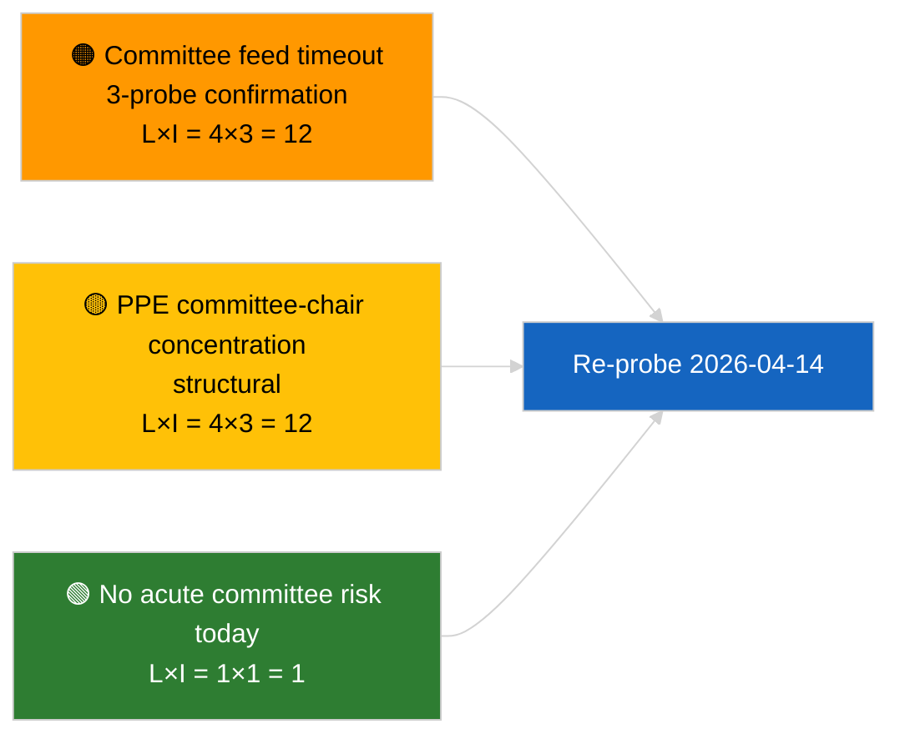

<!-- SPDX-FileCopyrightText: 2026 Hack23 AB -->
<!-- SPDX-License-Identifier: Apache-2.0 -->

# エグゼクティブ・ブリーフ — 委員会報告 | 2026-04-03

**分類:** OSINT | 公開議会記録
**信頼度:** 🟢 高（会期休会中の構造的評価、API 劣化状態）
**発行日時:** 2026-04-03T00:00:00Z（遡及ブリーフ）
**記事種別:** 委員会報告
**実行 ID:** `5568290b-7656-4c6e-ae61-b57740690541`
**出典:** 欧州議会オープンデータポータル

---

## 🎯 BLUF

**2026-04-03 に委員会文書はインデックス登録されず。欧州議会フィード API は確認済みの劣化状態にある（関連評価 `breaking-2` 参照）。** 実行 `5568290b-7656-4c6e-ae61-b57740690541` は「**識別されたゼロの政治次元にわたるリスクの定量的記録**」を返し、ランク付け済みアクターはゼロ、重要度はルーティン。`get_committee_documents_feed` は失敗エンドポイントに分類されており（3 回の日次プローブすべてでタイムアウト）、実質的な委員会ベースラインは 2026-04-03/breaking-3 で特定された汚職対策改革パッケージのデータと一致する（ECON ECB 副総裁、TRAN/ENVI HDV 排気ガス、JURI 汚職対策 + ブラウン、INTA 米国関税、AFET ジョージア）。**🟢 高信頼度**：本日の空データ状態はフィード劣化と会期週終了の複合に起因する。

---

## 🧭 本ブリーフが支援する 3 つの意思決定

| # | 意思決定 | 決定者 | 期限 | 根拠 |
|:-:|----------|--------|:----:|------|
| 1 | **編集:** 日次委員会報告をスキップ | 編集長 | +24 時間 | 空実行 + 確認済み劣化フィード |
| 2 | **監視:** 2026-04-14 復旧ラウンドに含める | データパイプライン | 2026-04-14 | 復活祭後の最初の営業日 |
| 3 | **将来監視:** 4 月 13–17 日委員会作業週（Q2 最初の実質的報告） | 分析責任者 | 2026-04-13 | 本会議前サイクル |

---

## 📰 60 秒リード

- 🔴 **委員会文書なし** — `get_committee_documents_feed` が 3 回のプローブでタイムアウト。（🟢 高）
- 🟠 **ランク付き組織ゼロ件**; ルーティン重要度。（🟢 高）
- 🟢 **3 月–Q2 委員会台帳**がウォッチリストを確定（汚職対策 JURI、HDV TRAN/ENVI、ECB ECON、米国関税 INTA、ジョージア AFET）。（🟢 高）
- 🟡 **全リスク次元**が本日「なし」。（🟢 高）
- 🔵 **経済的文脈:** 汚職対策指令の転置が Q2 の支配的な制度・経済的シグナル。（🟡 中）
- 🟣 **比較参照:** 姉妹 `breaking-2` が API 劣化状態を公式化; `breaking-3` が改革パッケージを分類。（🟢 高）
- 🩷 **混乱ベクター:** 委員会フィードのタイムアウトが継続すると Q2 本会議前インテリジェンスが阻害される恐れ。（🟡 中）
- ⚪ **継続監視:** 2026-04-14 にサービス復旧を確認。

---

## 🗂️ 注目文書・手続き

| 順位 | EP 参照 | タイトル（略） | 重要度 | 信頼度 | 状態 |
|:---:|---------|--------------|:------:|:------:|------|
| 1 | — | 2026-04-03 委員会報告なし | 0.0 | 🟢 高 | 休会 + 劣化フィード |
| 2 | TA-10-2026-0094 | JURI — 汚職対策指令（継続追跡） | 9.0 | 🟢 高 | 3 月 26 日採択; 転置監視中 |
| 3 | TA-10-2026-0060 | ECON — ECB 副総裁（継続追跡） | 7.5 | 🟢 高 | Q2 ベースライン |

---

## ⚠️ リスク・脅威スナップショット

| リスク | L | I | スコア | トリガー | 出典 | 信頼スケール |
|--------|:-:|:-:|:-----:|---------|------|:-----------:|
| 委員会フィード信頼性（劣化） | 4 | 3 | 12 | 4 月 14 日以降も継続タイムアウト | 姉妹 `breaking-2` | A1 |
| EPP 委員会委員長集中 | 4 | 3 | 12 | Q2 報告者任命 | 構造的 | A2 |
| 汚職対策指令転置摩擦 | 3 | 4 | 12 | 国家不遵守 | TA-10-2026-0094 | A1 |

---

## 🔮 主要な将来トリガー

**2026 年 4 月 13–17 日委員会作業週。** Q2 最初の実質的な委員会サイクル; 委員会フィードの復旧はこの期間の本会議前インテリジェンスに不可欠な運用要件。

---

## 🛡️ 情報源品質評価

- **一次情報源:** 実行 `5568290b-7656-4c6e-ae61-b57740690541`; 姉妹 `breaking-2` — 公式 API テスト。
- **データ制限:** `get_committee_documents_feed` タイムアウト — 独立検証は本日利用不可。
- **信頼度評価:** 🟢 高（暦 + 劣化フィード原因); 🟡 中（活動不在の主張）。

---

## 📎 リンク

| リンク | パス |
|--------|------|
| 記事 | `./article.md` |
| 姉妹実行 | `analysis/daily/2026-04-03/breaking/`, `breaking-2/`, `breaking-3/`, `motions/`, `propositions/`, `week-ahead/` |
| マニフェストファイル | `./manifest.json` |

---

**文書管理**
- **テンプレート:** `/analysis/templates/executive-brief.md`
- **アーティファクトパス:** `analysis/daily/2026-04-03/committee-reports/executive-brief.md`
- **分類:** 公開
- **遡及作成:** 遡及記入セッション。
