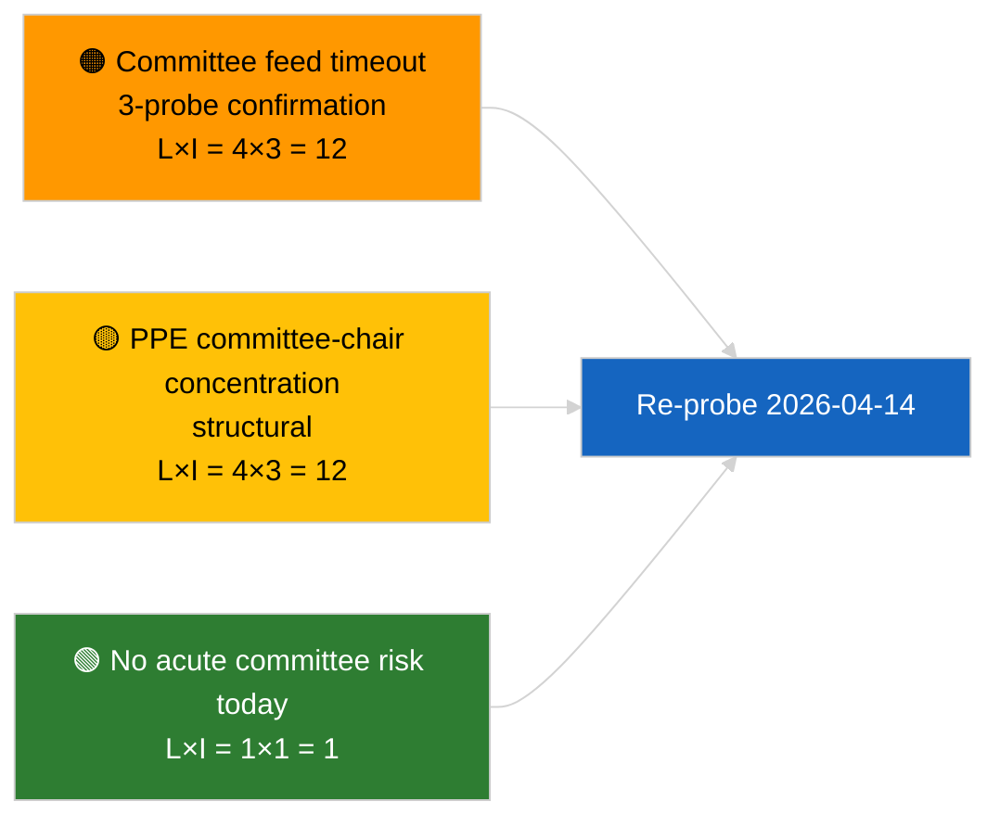

<!-- SPDX-FileCopyrightText: 2026 Hack23 AB -->
<!-- SPDX-License-Identifier: Apache-2.0 -->

# 집행 브리핑 — 위원회 보고서 | 2026-04-03

**분류:** OSINT | 공개 의회 기록
**신뢰 수준:** 🟢 높음 (회기 휴회 중 구조적 평가, API 성능 저하 상태)
**발행 일시:** 2026-04-03T00:00:00Z (소급 브리핑)
**기사 유형:** 위원회 보고서
**실행 ID:** `5568290b-7656-4c6e-ae61-b57740690541`
**출처:** 유럽의회 공개 데이터 포털

---

## 🎯 BLUF

**2026-04-03에 위원회 문서가 색인되지 않았습니다. 유럽의회 피드 API는 확인된 성능 저하 상태에 있습니다(관련 평가 `breaking-2` 참조).** 실행 `5568290b-7656-4c6e-ae61-b57740690541`은 **"0개의 식별된 정치적 차원에 걸친 위험의 정량적 기록"**을 반환했으며, 순위 지정 행위자는 제로이고 중요도는 일상적입니다. `get_committee_documents_feed`는 실패 엔드포인트로 분류됩니다(3회 일일 프로브 모두 타임아웃). 따라서 실질적인 위원회 기준선은 2026-04-03/breaking-3에서 식별된 반부패 개혁 패키지 데이터와 일치합니다(ECON ECB 부총재, TRAN/ENVI HDV 배기가스, JURI 반부패 + 브라운, INTA 미국 관세, AFET 조지아). **🟢 높은 신뢰도**: 오늘 빈 상태는 피드 성능 저하와 회기 주 종료의 결합으로 인한 것입니다.

---

## 🧭 본 브리핑이 지원하는 3가지 의사결정

| # | 의사결정 | 의사결정자 | 기한 | 근거 |
|:-:|----------|-----------|:----:|------|
| 1 | **편집:** 일간 위원회 보도 건너뜀 | 편집장 | +24시간 | 빈 실행 + 확인된 저하 피드 |
| 2 | **모니터링:** 2026-04-14 복구 라운드에 포함 | 데이터 파이프라인 | 2026-04-14 | 부활절 이후 첫 영업일 |
| 3 | **향후 모니터링:** 4월 13–17일 위원회 작업 주 (Q2 첫 번째 실질적 보고서) | 분석 책임자 | 2026-04-13 | 본회의 이전 사이클 |

---

## 📰 60초 요약

- 🔴 **위원회 문서 없음** — `get_committee_documents_feed`가 3회 프로브에서 타임아웃. (🟢 높음)
- 🟠 **순위 지정 조직 0건**; 일상적 중요도. (🟢 높음)
- 🟢 **3월–Q2 위원회 재고**가 감시 목록 확정 (반부패 JURI, HDV TRAN/ENVI, ECB ECON, 미국 관세 INTA, 조지아 AFET). (🟢 높음)
- 🟡 **모든 위험 차원**이 오늘 "없음". (🟢 높음)
- 🔵 **경제적 맥락:** 반부패 지침 전환이 Q2의 지배적인 제도·경제적 신호. (🟡 중간)
- 🟣 **비교 참조:** 자매 `breaking-2`가 API 저하 상태 공식화; `breaking-3`이 개혁 패키지 분류. (🟢 높음)
- 🩷 **혼란 벡터:** 위원회 피드 타임아웃 지속 시 Q2 본회의 전 인텔리전스 저해 가능성. (🟡 중간)
- ⚪ **지속 모니터링:** 2026-04-14에 서비스 복구 확인.

---

## 🗂️ 주목 문서 / 절차

| 순위 | EP 참조 | 제목 (약) | 중요도 | 신뢰도 | 상태 |
|:---:|---------|----------|:------:|:------:|------|
| 1 | — | 2026-04-03 위원회 보고서 없음 | 0.0 | 🟢 높음 | 휴회 + 저하 피드 |
| 2 | TA-10-2026-0094 | JURI — 반부패 지침 (지속 추적) | 9.0 | 🟢 높음 | 3월 26일 채택; 전환 모니터링 중 |
| 3 | TA-10-2026-0060 | ECON — ECB 부총재 (지속 추적) | 7.5 | 🟢 높음 | Q2 기준선 |

---

## ⚠️ 위험·위협 스냅샷

| 위험 | L | I | 점수 | 트리거 | 출처 | 신뢰 척도 |
|------|:-:|:-:|:---:|--------|------|:---------:|
| 위원회 피드 신뢰성 (저하) | 4 | 3 | 12 | 4월 14일 이후 타임아웃 지속 | 자매 `breaking-2` | A1 |
| EPP 위원회 위원장 집중 | 4 | 3 | 12 | Q2 보고자 임명 | 구조적 | A2 |
| 반부패 지침 전환 마찰 | 3 | 4 | 12 | 국가 미준수 | TA-10-2026-0094 | A1 |

---

## 🔮 주요 미래 트리거

**2026년 4월 13–17일 위원회 작업 주.** Q2 첫 번째 실질적인 위원회 사이클; 위원회 피드 복구는 이 기간 본회의 전 인텔리전스를 위한 핵심 운영 요건.

---

## 🛡️ 소스 품질 평가

- **1차 소스:** 실행 `5568290b-7656-4c6e-ae61-b57740690541`; 자매 `breaking-2` — 공식 API 테스트.
- **데이터 제한:** `get_committee_documents_feed` 타임아웃 — 독립 검증 오늘 불가.
- **신뢰도:** 🟢 높음 (역법 + 저하 피드 원인); 🟡 중간 (활동 부재 주장).

---

## 📎 링크

| 링크 | 경로 |
|------|------|
| 기사 | `./article.md` |
| 자매 실행 | `analysis/daily/2026-04-03/breaking/`, `breaking-2/`, `breaking-3/`, `motions/`, `propositions/`, `week-ahead/` |
| 매니페스트 파일 | `./manifest.json` |

---

**문서 관리**
- **템플릿:** `/analysis/templates/executive-brief.md`
- **아티팩트 경로:** `analysis/daily/2026-04-03/committee-reports/executive-brief.md`
- **분류:** 공개
- **소급 작성:** 소급 기입 세션.
