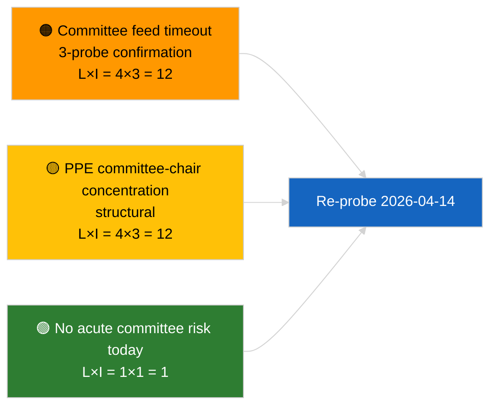

<!-- SPDX-FileCopyrightText: 2026 Hack23 AB -->
<!-- SPDX-License-Identifier: Apache-2.0 -->

# Uitvoerende samenvatting — Commissierapporten | 2026-04-03

**Classificatie:** OSINT | Openbare parlementaire registratie
**Betrouwbaarheidsniveau:** 🟢 Hoog (structurele beoordeling tijdens reces, GEDEGRADEERDE API-status)
**Gegenereerd:** 2026-04-03T00:00:00Z (retrospectieve samenvatting)
**Artikeltype:** Commissierapporten
**Uitvoerings-ID:** `5568290b-7656-4c6e-ae61-b57740690541`
**Bron:** Open dataportaal van het Europees Parlement

---

## 🎯 BLUF

**Op 2026-04-03 werden geen commissiedocumenten geïndexeerd; de EP-feed-API bevindt zich in een bevestigde GEDEGRADEERDE status (zie aanvullende beoordeling `breaking-2`).** Uitvoering `5568290b-7656-4c6e-ae61-b57740690541` gaf **"Kwantitatieve risicoscoring over 0 geïdentificeerde politieke dimensies"** terug — nul geclassificeerde actoren, ROUTINEMATIGE betekenis. `get_committee_documents_feed` behoort tot de defecte eindpunten (time-out bij alle 3 dagelijkse sonderingen). De substantiële commissiebasislijn correspondeert daarom met de doorrolgegevens van het anticorruptie-hervormingscluster geïdentificeerd in 2026-04-03/breaking-3 (ECON ECB-vicevoorzitter, TRAN/ENVI HDV-emissies, JURI anticorruptie + Braun, INTA Amerikaanse tarieven, AFET Georgië). **🟢 HOGE betrouwbaarheid** dat de lege status van vandaag wordt veroorzaakt door feed-degradatie bovenop de recessweek.

---

## 🧭 3 beslissingen die deze samenvatting ondersteunt

| # | Beslissing | Beslisser | Deadline | Bewijs |
|:-:|------------|-----------|:--------:|--------|
| 1 | **Redactioneel:** commissierapporten dagelijks OVERSLAAN | Redacteur | +24u | Lege uitvoering + bevestigde GEDEGRADEERDE feeds |
| 2 | **Monitoring:** opnemen in het herstelsonderingsonderzoek van 2026-04-14 na reces | Datapijplijn | 2026-04-14 | Eerste werkdag na Pasen |
| 3 | **Vooruitblik:** commissiewerkweek 13–17 april voor de eerste substantiële Q2-commissierapporten | Analyseleider | 2026-04-13 | Pre-plenumcyclus |

---

## 📰 60-secondenlectuur

- 🔴 **Geen commissiedocumenten** vandaag; `get_committee_documents_feed`-time-out bij 3 sonderingen. (🟢 Hoog)
- 🟠 **0 actoren geclassificeerd**; ROUTINEMATIGE betekenis. (🟢 Hoog)
- 🟢 **Commissie-inventaris maart–Q2** verankert de bewakingslijst (anticorruptie JURI, HDV TRAN/ENVI, ECB ECON, Amerikaanse tarieven INTA, Georgië AFET). (🟢 Hoog)
- 🟡 **Risico-dimensies alle "geen"** vandaag. (🟢 Hoog)
- 🔵 **Economische context:** de omzetting van de anticorruptierichtlijn is het dominante institutionele en economische signaal van Q2. (🟡 Gemiddeld)
- 🟣 **Kruisverwijzing:** zuster-samenvatting `breaking-2` formaliseert de GEDEGRADEERDE API-status; `breaking-3` synthetiseert het hervormingscluster. (🟢 Hoog)
- 🩷 **Verstoringsvektor:** aanhoudende commissie-feed-time-out kan Q2-preplenary-inlichtingen blokkeren. (🟡 Gemiddeld)
- ⚪ **Doorrol:** herstel valideren op 2026-04-14.

---

## 🗂️ Belangrijkste documenten / procedures

| Rang | EP-referentie | Titel (kort) | Betekenis | Betrouwbaarheid | Status |
|:----:|---------------|--------------|:---------:|:---------------:|--------|
| 1 | — | Geen commissierapporten op 2026-04-03 | 0,0 | 🟢 HOOG | Reces + GEDEGRADEERDE feeds |
| 2 | TA-10-2026-0094 | JURI — Anticorruptierichtlijn (doorrol) | 9,0 | 🟢 HOOG | Aangenomen 26 maart; omzettingsmonitoring |
| 3 | TA-10-2026-0060 | ECON — ECB-vicevoorzitter (doorrol) | 7,5 | 🟢 HOOG | Q2-basislijn |

---

## ⚠️ Risico- en dreigingsoverzicht

| Risico | L | I | Score | Trigger | Bron | Admiraliteit |
|--------|:-:|:-:|:-----:|---------|------|:------------:|
| Betrouwbaarheid commissie-feed (GEDEGRADEERD) | 4 | 3 | 12 | Aanhoudende time-out na 14 april | Zuster `breaking-2` | A1 |
| PPE commissievoorzittersconcentratie | 4 | 3 | 12 | Q2-rapporteursbenoemingen | Structureel | A2 |
| Wrijving bij omzetting anticorruptierichtlijn | 3 | 4 | 12 | Nationale niet-naleving | TA-10-2026-0094 | A1 |

---

## 🔮 Belangrijkste voorwaartse trigger

**Commissiewerkweek 13–17 april 2026.** Eerste substantiële Q2-commissiecyclus; herstel van de commissie-feed is operationeel kritiek voor pre-plenary-inlichtingen in dit tijdvenster.

---

## 🛡️ Beoordeling van de bronkwaliteit

- **Primaire bronnen:** Uitvoering `5568290b-7656-4c6e-ae61-b57740690541`; zuster `breaking-2` — formele EP-API-sondering.
- **Gegevensbeperkingen:** `get_committee_documents_feed`-time-out — onafhankelijke bevestiging vandaag niet beschikbaar.
- **Betrouwbaarheid:** 🟢 HOOG voor kalender + GEDEGRADEERDE feed-driver; 🟡 GEMIDDELD voor de bewering over activiteitsafwezigheid.

---

## 📎 Links

| Link | Pad |
|------|-----|
| Artikel | `./article.md` |
| Zuster-uitvoeringen | `analysis/daily/2026-04-03/breaking/`, `breaking-2/`, `breaking-3/`, `motions/`, `propositions/`, `week-ahead/` |
| Manifest | `./manifest.json` |

---

**Documentbeheer**
- **Sjabloon:** `/analysis/templates/executive-brief.md`
- **Artefactpad:** `analysis/daily/2026-04-03/committee-reports/executive-brief.md`
- **Classificatie:** Openbaar
- **Retrospectieve generatie:** Terugvullende sessie.
