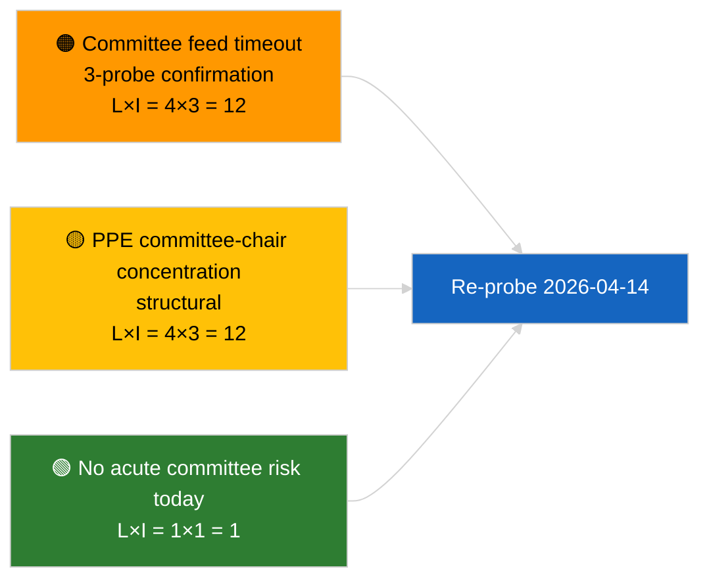

<!-- SPDX-FileCopyrightText: 2026 Hack23 AB -->
<!-- SPDX-License-Identifier: Apache-2.0 -->

# Ledersammendraget — Komitérapporter | 2026-04-03

**Klassifisering:** OSINT | Offentlig parlamentarisk protokoll
**Konfidans:** 🟢 Høy (strukturell vurdering i sessionspauser, DEGRADERT API-tilstand)
**Generert:** 2026-04-03T00:00:00Z (retrospektiv sammendrag)
**Artikkeltype:** Komitérapporter
**Kjøringsnummer:** `5568290b-7656-4c6e-ae61-b57740690541`
**Kilde:** Europaparlamentets åpne dataportal

---

## 🎯 BLUF

**Ingen komitédokumenter ble indeksert 2026-04-03; EP-feed-API-en befinner seg i bekreftet DEGRADERT tilstand (se supplerende vurdering `breaking-2`).** Kjøring `5568290b-7656-4c6e-ae61-b57740690541` returnerte **"Kvantitativ risikovurdering over 0 identifiserte politiske dimensjoner"** — null klassifiserte aktører, RUTINMESSIG betydning. `get_committee_documents_feed` er blant de defekte endepunktene (tidsavbrudd ved alle 3 daglige sonderinger). Den substansielle komitébasislinjen er derfor den videreføringen som ble identifisert i anti-korrupsjonsreformklyngen i 2026-04-03/breaking-3 (ECON ECB-nestformann, TRAN/ENVI HDV-utslipp, JURI anti-korrupsjon + Braun, INTA USA-tariffer, AFET Georgia). **🟢 HØY konfidans** for at dagens tomme tilstand drives av feed-degradering kombinert med sessionspauser.

---

## 🧭 3 beslutninger denne sammenfatningen støtter

| # | Beslutning | Beslutningstaker | Frist | Bevis |
|:-:|------------|------------------|:-----:|-------|
| 1 | **Redaksjonell:** HOPP OVER komitérapporter daglig | Redaktør | +24t | Tom kjøring + bekreftede DEGRADERTE feeder |
| 2 | **Overvåking:** inkluder i gjenopprettelsessonderingen 2026-04-14 etter sessionspauser | Datapipeline | 2026-04-14 | Første virkedag etter påske |
| 3 | **Fremtidsovervåking:** komitéarbeidsuke 13.–17. april for de første substansielle Q2-komitérapportene | Analyseleder | 2026-04-13 | Forhåndsplenarsyklus |

---

## 📰 60-sekunders lesning

- 🔴 **Ingen komitédokumenter** i dag; `get_committee_documents_feed`-tidsavbrudd ved 3 sonderinger. (🟢 Høy)
- 🟠 **0 aktører klassifisert**; RUTINMESSIG betydning. (🟢 Høy)
- 🟢 **Mars-til-Q2-komitéinventar** forankrer overvåkingslisten (anti-korrupsjon JURI, HDV TRAN/ENVI, ECB ECON, USA-tariffer INTA, Georgia AFET). (🟢 Høy)
- 🟡 **Risikodimensjoner alle "ingen"** i dag. (🟢 Høy)
- 🔵 **Økonomisk kontekst:** gjennomføring av anti-korrupsjonsdirektivet er det dominerende institusjonelle og økonomiske signalet i Q2. (🟡 Middels)
- 🟣 **Kryssreferanse:** søsterbriefing `breaking-2` formaliserer DEGRADERT API-tilstand; `breaking-3` syntetiserer reformklyngen. (🟢 Høy)
- 🩷 **Forstyrrelsesvektoren:** vedvarende komité-feed-tidsavbrudd kan blokkere Q2 forhåndsplenars etterretning. (🟡 Middels)
- ⚪ **Videreføring:** valider gjenoppretting 2026-04-14.

---

## 🗂️ Viktigste dokumenter / prosedyrer

| Rang | EP-referanse | Tittel (kort) | Viktighet | Konfidans | Status |
|:----:|--------------|---------------|:---------:|:---------:|--------|
| 1 | — | Ingen komitérapporter 2026-04-03 | 0,0 | 🟢 HØY | Sesjonspause + DEGRADERTE feeder |
| 2 | TA-10-2026-0094 | JURI — Anti-korrupsjonsdirektiv (videreføring) | 9,0 | 🟢 HØY | Vedtatt 26. mars; gjennomføringsovervåking |
| 3 | TA-10-2026-0060 | ECON — ECB-nestformann (videreføring) | 7,5 | 🟢 HØY | Q2-baslinje |

---

## ⚠️ Risiko- og trusselsoverblikk

| Risiko | L | I | Score | Utløser | Kilde | Admiralitet |
|--------|:-:|:-:|:-----:|---------|-------|:-----------:|
| Komité-feed-pålitelighet (DEGRADERT) | 4 | 3 | 12 | Vedvarende tidsavbrudd etter 14. april | Søster `breaking-2` | A1 |
| PPE komitélederkonsentrasjon | 4 | 3 | 12 | Q2 ordførerutnevnelser | Strukturell | A2 |
| Friksjon ved gjennomføring av anti-korrupsjonsdirektivet | 3 | 4 | 12 | Nasjonal manglende overholdelse | TA-10-2026-0094 | A1 |

---

## 🔮 Viktigste fremtidsuløser

**Komitéarbeidsuke 13.–17. april 2026.** Første substansielle Q2-komitésyklus; gjenoppretting av komité-feed er operativt kritisk for forhåndsplenar-etterretning i dette tidsvinduet.

---

## 🛡️ Vurdering av kildekvalitet

- **Primærkilder:** Kjøring `5568290b-7656-4c6e-ae61-b57740690541`; søster `breaking-2` — formell EP API-sondering.
- **Databegrensninger:** `get_committee_documents_feed`-tidsavbrudd — uavhengig bekreftelse ikke tilgjengelig i dag.
- **Konfidans:** 🟢 HØY for kalender + DEGRADERT feed-driver; 🟡 MIDDELS for fraværspåstanden.

---

## 📎 Lenker

| Lenke | Sti |
|-------|-----|
| Artikkel | `./article.md` |
| Søsterkjøringer | `analysis/daily/2026-04-03/breaking/`, `breaking-2/`, `breaking-3/`, `motions/`, `propositions/`, `week-ahead/` |
| Manifest | `./manifest.json` |

---

**Dokumentkontroll**
- **Mal:** `/analysis/templates/executive-brief.md`
- **Artefaktsti:** `analysis/daily/2026-04-03/committee-reports/executive-brief.md`
- **Klassifisering:** Offentlig
- **Retrospektiv generering:** Tilbakefyllingsøkt.
