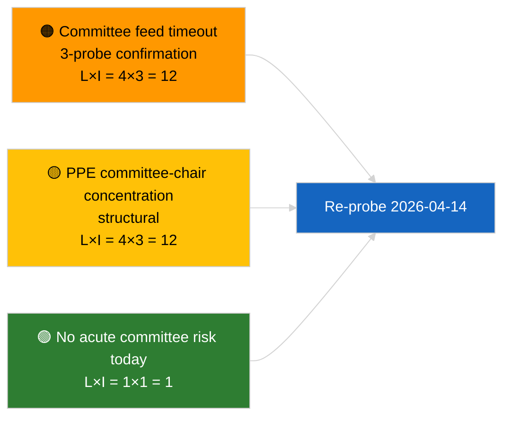

<!-- SPDX-FileCopyrightText: 2026 Hack23 AB -->
<!-- SPDX-License-Identifier: Apache-2.0 -->

# Verkställande sammanfattning — Utskottsrapporter | 2026-04-03

**Klassificering:** OSINT | Offentligt parlamentariskt protokoll
**Konfidens:** 🟢 Hög (strukturell bedömning under sessionsuppehåll, DEGRADERAT API-tillstånd)
**Genererad:** 2026-04-03T00:00:00Z (retrospektiv sammanfattning)
**Artikeltyp:** Utskottsrapporter
**Körnings-ID:** `5568290b-7656-4c6e-ae61-b57740690541`
**Källa:** Europaparlamentets öppna dataportal

---

## 🎯 BLUF

**Inga utskottsdokument indexerades 2026-04-03; EP:s feed-API befinner sig i bekräftat DEGRADERAT tillstånd (se kompletterande bedömning `breaking-2`).** Körning `5568290b-7656-4c6e-ae61-b57740690541` returnerade **"Kvantitativ riskpoängsättning över 0 identifierade politiska dimensioner"** — noll klassificerade aktörer, RUTINMÄSSIG betydelse. `get_committee_documents_feed` tillhör de felande slutpunkterna (timeout vid samtliga 3 dagliga sonderingar). Den substantiella utskottsbaslinjen motsvarar därför den som identifierades i anti-korruptionsreformklustret i 2026-04-03/breaking-3 (ECON ECB-viceordförande, TRAN/ENVI HDV-utsläpp, JURI anti-korruption + Braun, INTA US-tariffer, AFET Georgien). **🟢 HÖG konfidens** att dagens tomma tillstånd drivs av feed-degradering i kombination med sessionsuppehåll.

---

## 🧭 3 beslut som denna sammanfattning stödjer

| # | Beslut | Beslutsfattare | Tidsgräns | Bevis |
|:-:|--------|----------------|:---------:|-------|
| 1 | **Redaktionell:** HOPPA ÖVER utskottsrapporter dagligen | Redaktör | +24h | Tom körning + bekräftade DEGRADERADE flöden |
| 2 | **Övervakning:** inkludera i återhämtningssonderingen 2026-04-14 efter sessionsuppehåll | Datapipeline | 2026-04-14 | Första vardagen efter påsk |
| 3 | **Framåtbevakning:** utskottsarbetsvecka 13–17 april för de första substantiella Q2-utskottsrapporterna | Analysansvarig | 2026-04-13 | Inför plenarperiod |

---

## 📰 60-sekunders läsning

- 🔴 **Inga utskottsdokument** idag; `get_committee_documents_feed`-timeout vid 3 sonderingar. (🟢 Hög)
- 🟠 **0 aktörer klassificerade**; RUTINMÄSSIG betydelse. (🟢 Hög)
- 🟢 **Mars-till-Q2 utskottsinventering** förankrar bevakningslistan (anti-korruption JURI, HDV TRAN/ENVI, ECB ECON, US-tariffer INTA, Georgien AFET). (🟢 Hög)
- 🟡 **Riskdimensioner alla "inga"** idag. (🟢 Hög)
- 🔵 **Ekonomisk kontext:** anti-korruptionsdirektivets genomförande är det dominerande institutionella och ekonomiska signalet i Q2. (🟡 Medel)
- 🟣 **Korsreferens:** syskonbriefing `breaking-2` formaliserar det DEGRADERADE API-tillståndet; `breaking-3` syntetiserar reformklustret. (🟢 Hög)
- 🩷 **Störvektor:** ihållande utskottsflödes-timeout kan blockera Q2 pre-plenar-underrättelser. (🟡 Medel)
- ⚪ **Vidareföring:** validera återhämtning 2026-04-14.

---

## 🗂️ Viktigaste dokument / förfarandena

| Rank | EP-referens | Titel (kort) | Vikt | Konfidens | Status |
|:----:|-------------|--------------|:----:|:---------:|--------|
| 1 | — | Inga utskottsrapporter 2026-04-03 | 0,0 | 🟢 HÖG | Sessionsuppehåll + DEGRADERADE flöden |
| 2 | TA-10-2026-0094 | JURI — Anti-korruptionsdirektiv (vidareföring) | 9,0 | 🟢 HÖG | Antaget 26 mars; genomförandeövervakning |
| 3 | TA-10-2026-0060 | ECON — ECB-viceordförande (vidareföring) | 7,5 | 🟢 HÖG | Q2-baslinje |

---

## ⚠️ Risk- och hotbild

| Risk | L | I | Poäng | Utlösare | Källa | Admiralitet |
|------|:-:|:-:|:-----:|----------|-------|:-----------:|
| Utskottsflödets tillförlitlighet (DEGRADERAT) | 4 | 3 | 12 | Ihållande timeout efter 14 april | Syskon `breaking-2` | A1 |
| PPE utskottsordförandekoncentration | 4 | 3 | 12 | Q2 föredragandeutnämningar | Strukturell | A2 |
| Friktion vid anti-korruptionsdirektivets genomförande | 3 | 4 | 12 | Nationell bristande efterlevnad | TA-10-2026-0094 | A1 |

---

## 🔮 Viktigaste framåtriktat utlösaren

**Utskottsarbetsvecka 13–17 april 2026.** Första substantiella Q2-utskottscykeln; återhämtningen av utskottsflödet är operativt avgörande för pre-plenar-underrättelser i detta tidsfönster.

---

## 🛡️ Bedömning av källkvalitet

- **Primärkällor:** Körning `5568290b-7656-4c6e-ae61-b57740690541`; syskon `breaking-2` — formell EP API-sondering.
- **Databegränsningar:** `get_committee_documents_feed`-timeout — oberoende bekräftelse ej tillgänglig idag.
- **Konfidens:** 🟢 HÖG för kalender + DEGRADERAD flödesdrivare; 🟡 MEDEL för påståendet om frånvaro av aktivitet.

---

## 📎 Länkar

| Länk | Sökväg |
|------|--------|
| Artikel | `./article.md` |
| Syskokörningar | `analysis/daily/2026-04-03/breaking/`, `breaking-2/`, `breaking-3/`, `motions/`, `propositions/`, `week-ahead/` |
| Manifest | `./manifest.json` |

---

**Dokumentkontroll**
- **Mall:** `/analysis/templates/executive-brief.md`
- **Artefaktsökväg:** `analysis/daily/2026-04-03/committee-reports/executive-brief.md`
- **Klassificering:** Offentlig
- **Retrospektiv generering:** Bakåtfyllnadssession.
