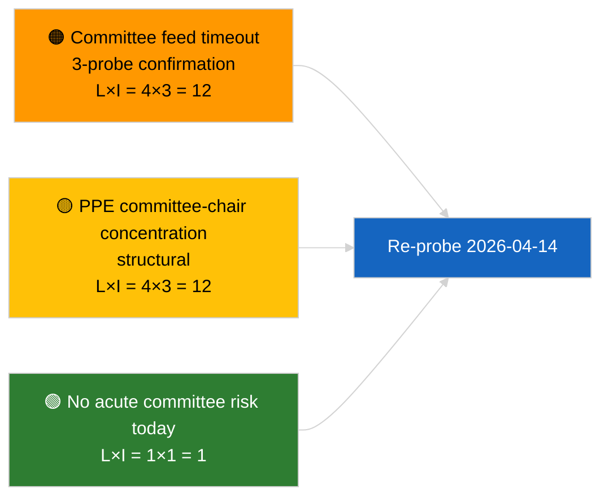

<!-- SPDX-FileCopyrightText: 2026 Hack23 AB -->
<!-- SPDX-License-Identifier: Apache-2.0 -->

# 执行简报 — 委员会报告 | 2026-04-03

**分类:** OSINT | 公开议会记录
**置信度:** 🟢 高（会期休会期间结构性评估，API 性能下降状态）
**发布时间:** 2026-04-03T00:00:00Z（追溯简报）
**文章类型:** 委员会报告
**运行 ID:** `5568290b-7656-4c6e-ae61-b57740690541`
**来源:** 欧洲议会开放数据门户

---

## 🎯 BLUF

**2026-04-03 未索引任何委员会文件；欧洲议会信息流 API 处于已确认的性能下降状态（参见配套评估 `breaking-2`）。** 运行 `5568290b-7656-4c6e-ae61-b57740690541` 返回结果：**"0 个已识别政治维度的风险定量记录"**——排名行为者为零，重要性为常规级别。`get_committee_documents_feed` 属于失败端点（三次日常探测均超时）。因此，实质性委员会基线与 2026-04-03/breaking-3 中识别的反腐改革数据包一致（ECON 欧洲央行副行长、TRAN/ENVI 重型车辆排放、JURI 反腐 + 布劳恩、INTA 美国关税、AFET 格鲁吉亚）。**🟢 高置信度**：今日空状态源于信息流性能下降叠加会期结束。

---

## 🧭 本简报支持的三项决策

| # | 决策 | 决策者 | 截止日期 | 依据 |
|:-:|------|--------|:-------:|------|
| 1 | **编辑:** 跳过每日委员会报道 | 编辑 | +24小时 | 空运行 + 已确认降级信息流 |
| 2 | **监控:** 纳入 2026-04-14 节后恢复轮次 | 数据管道 | 2026-04-14 | 复活节后首个工作日 |
| 3 | **未来监控:** 4月13–17日委员会工作周（Q2 首批实质性报告） | 分析负责人 | 2026-04-13 | 全体会议前周期 |

---

## 📰 60秒速览

- 🔴 **无委员会文件** — `get_committee_documents_feed` 在 3 次探测中超时。（🟢 高）
- 🟠 **0 个已排名实体**；常规重要性。（🟢 高）
- 🟢 **三月至 Q2 委员会清单**确立监控名单（反腐 JURI、HDV TRAN/ENVI、欧洲央行 ECON、美国关税 INTA、格鲁吉亚 AFET）。（🟢 高）
- 🟡 **所有风险维度**今日"无"。（🟢 高）
- 🔵 **经济背景:** 反腐指令转化是 Q2 主导的制度与经济信号。（🟡 中）
- 🟣 **比较参考:** 姐妹 `breaking-2` 正式确认 API 降级状态；`breaking-3` 对改革数据包进行分类。（🟢 高）
- 🩷 **破坏向量:** 委员会信息流超时持续将阻碍 Q2 全体会议前情报获取。（🟡 中）
- ⚪ **持续监控:** 2026-04-14 确认服务恢复。

---

## 🗂️ 重点文件 / 程序

| 排名 | EP 参考 | 标题（缩） | 重要性 | 置信度 | 状态 |
|:---:|---------|----------|:------:|:------:|------|
| 1 | — | 2026-04-03 无委员会报告 | 0.0 | 🟢 高 | 休会 + 降级信息流 |
| 2 | TA-10-2026-0094 | JURI — 反腐指令（持续追踪） | 9.0 | 🟢 高 | 3月26日通过；转化监控中 |
| 3 | TA-10-2026-0060 | ECON — 欧洲央行副行长（持续追踪） | 7.5 | 🟢 高 | Q2 基线 |

---

## ⚠️ 风险与威胁快照

| 风险 | L | I | 得分 | 触发因素 | 来源 | 置信等级 |
|------|:-:|:-:|:---:|---------|------|:-------:|
| 委员会信息流可靠性（降级） | 4 | 3 | 12 | 4月14日后持续超时 | 姐妹 `breaking-2` | A1 |
| EPP 委员会主席集中度 | 4 | 3 | 12 | Q2 报告员任命 | 结构性 | A2 |
| 反腐指令转化摩擦 | 3 | 4 | 12 | 国家不合规 | TA-10-2026-0094 | A1 |

---

## 🔮 主要未来触发因素

**2026年4月13–17日委员会工作周。** Q2 首个实质性委员会周期；委员会信息流恢复是该窗口全体会议前情报的关键运营要求。

---

## 🛡️ 来源质量评估

- **主要来源:** 运行 `5568290b-7656-4c6e-ae61-b57740690541`；姐妹 `breaking-2` — 正式 API 测试。
- **数据局限:** `get_committee_documents_feed` 超时 — 独立验证今日不可用。
- **置信度评级:** 🟢 高（历法 + 降级信息流原因）；🟡 中（无活动主张）。

---

## 📎 链接

| 链接 | 路径 |
|------|------|
| 文章 | `./article.md` |
| 姐妹运行 | `analysis/daily/2026-04-03/breaking/`, `breaking-2/`, `breaking-3/`, `motions/`, `propositions/`, `week-ahead/` |
| 清单文件 | `./manifest.json` |

---

**文档控制**
- **模板:** `/analysis/templates/executive-brief.md`
- **工件路径:** `analysis/daily/2026-04-03/committee-reports/executive-brief.md`
- **分类:** 公开
- **追溯创建:** 追溯填充会话。
