# Motions — 2026-04-03

<h2 id="section-executive-brief">Executive Brief</h2>

### 🎯 BLUF

**No new motions tabled on 2026-04-03; recess week 2 of 4, DEGRADED feed state confirmed by sibling `breaking-2`.** Run `ddaeac0a-0829-43fb-8588-46bf89f410a4` returned **"Quantitative risk scoring across 0 identified political dimensions"** — zero classified actors, ROUTINE significance. First April motion tabling not expected before ~17-20 April. The March carry-over motions inventory dominates the April watch list: Georgia political prisoners (TA-10-2026-0083), HDV emission credits (TA-10-2026-0084), US customs tariff (TA-10-2026-0096), Braun-precedent immunity follow-on, anti-corruption (TA-10-2026-0094). **🟢 HIGH confidence** empty state is calendar- and feed-degradation-driven.

---

### 🧭 3 Decisions This Brief Supports

| # | Decision | Who Decides | Deadline | Evidence |
|:-:|----------|-------------|:--------:|----------|
| 1 | **Editorial:** SKIP motions daily | Editor | +24h | Empty run + DEGRADED feeds |
| 2 | **Monitoring:** flag first April motion-tabling wave 17-20 April | Analyst | 2026-04-17 | EP tabling pattern |
| 3 | **Forward-watch:** track motion mix for Scenario A (trade) vs B (RoL) vs C (economic) | Analysis lead | 2026-04-20 | Pre-plenary calibration |

---

### 📰 60-Second Read

- 🔴 **No new motions tabled** on 2026-04-03; recess. (🟢 High)
- 🟠 **0 actors classified**; "Quantitative risk scoring across 0 identified political dimensions" template state. (🟢 High)
- 🟢 **March carry-over motions** anchor April watch list. (🟢 High)
- 🟡 **Risk dimensions all "none"** today. (🟢 High)
- 🔵 **Economic context:** US tariff retaliation and anti-corruption transposition dominate. (🟢 High)
- 🟣 **Cross-reference:** sibling `breaking-3` covers the anti-corruption-reform cluster that will generate follow-on motions in April. (🟢 High)
- 🩷 **Disruption vector:** none acute today. (🟢 High)
- ⚪ **Carry-forward:** Mercosur ECJ opinion likely to spawn motion(s) once published.

---

### 🗂️ Top Documents / Procedures — Motions Watch

| Rank | EP reference | Title (short) | Significance | Confidence | Status |
|:----:|--------------|---------------|:------------:|:----------:|--------|
| 1 | — | No new motions on 2026-04-03 | 0.0 | 🟢 HIGH | Recess + DEGRADED feeds |
| 2 | TA-10-2026-0094 | Anti-corruption directive follow-on motions | 8.0 | 🟢 HIGH | Adopted 26 March |
| 3 | TA-10-2026-0083 | Georgia political prisoners (carry-over) | 7.0 | 🟢 HIGH | Implementation watch |

---

### ⚠️ Risk & Threat Snapshot

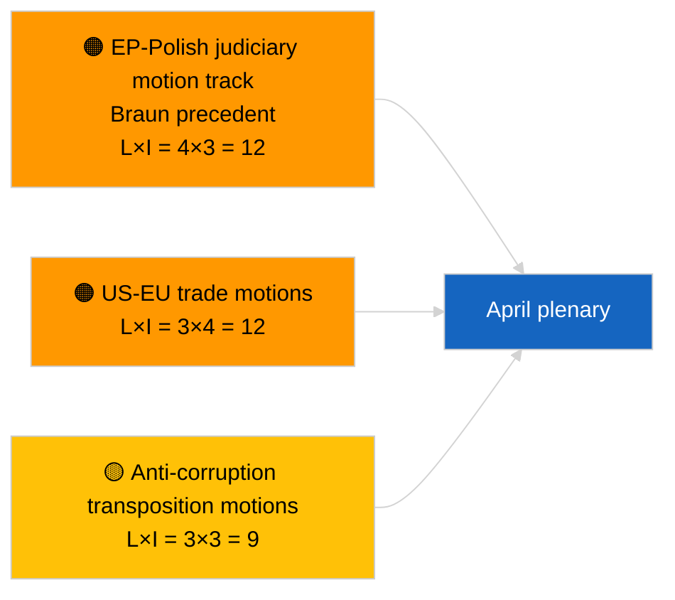
```mermaid
%%{init: {"theme":"dark"}}%%
graph LR
    R1["🟠 EP-Polish judiciary motion track<br/>Braun precedent<br/>L×I = 4×3 = 12"] --> CONS["April plenary"]
    R2["🟠 US-EU trade motions<br/>L×I = 3×4 = 12"] --> CONS
    R3["🟡 Anti-corruption transposition motions<br/>L×I = 3×3 = 9"] --> CONS
    style R1 fill:#FF9800,color:#000000
    style R2 fill:#FF9800,color:#000000
    style R3 fill:#FFC107,color:#000000
    style CONS fill:#1565C0,color:#FFFFFF
```

| Risk | L | I | Score | Trigger | Source | Admiralty |
|------|:-:|:-:|:-----:|---------|--------|:---------:|
| EP-Polish judiciary motion track | 4 | 3 | 12 | New immunity case | TA-10-2026-0088 | A1 |
| US-EU trade motions | 3 | 4 | 12 | US action | TA-10-2026-0096 | A1 |
| Anti-corruption follow-on motions | 3 | 3 | 9 | National transposition friction | TA-10-2026-0094 | A2 |

---

### 🔮 Top Forward Trigger

**First April motion-tabling wave ~17-20 April 2026.** Topic mix calibrates April-plenary scenario.

---

### 🛡️ Source Quality Assessment

- **Primary sources:** Run `ddaeac0a-0829-43fb-8588-46bf89f410a4`; sibling `breaking-2` confirms DEGRADED feed state.
- **Confidence:** 🟢 HIGH on calendar driver.

---

### 📎 Links

| Link | Path |
|------|------|
| Article | `./article.md` |
| Sibling runs | `analysis/daily/2026-04-03/breaking/`, `breaking-2/`, `breaking-3/`, `committee-reports/`, `propositions/`, `week-ahead/` |
| Manifest | `./manifest.json` |

---

**Document Control**
- **Template:** `/analysis/templates/executive-brief.md`
- **Artifact path:** `analysis/daily/2026-04-03/motions/executive-brief.md`
- **Classification:** Public
- **Retrospective generation:** Back-fill session.

<h2 id="reader-intelligence-guide">Reader Intelligence Guide</h2>

Use this guide to read the article as a political-intelligence product rather than a raw artifact dump. High-value reader lenses appear first; technical provenance remains available in the audit appendices.

| Reader need | What you'll get | Source artifact |
|---|---|---|
| [BLUF and editorial decisions](#section-executive-brief) | fast answer to what happened, why it matters, who is accountable, and the next dated trigger | `executive-brief.md` |
| [Actors and forces](#section-actors-forces) | who is driving the story, what political forces line up behind them, and which institutional levers they can pull | `classification/actor-mapping.md` |
| [Coalitions and voting](#section-coalitions-voting) | political group alignment, voting evidence, and coalition pressure points | `existing/voting-patterns.md` |
| [Risk assessment](#section-risk) | policy, institutional, coalition, communications, and implementation risk register | `risk-scoring/risk-matrix.md` |
| [Threat landscape](#section-threat) | hostile actors, attack vectors, consequence trees, and legislative-disruption pathways | `threat-assessment/actor-threat-profiles.md` |
| [Cross-run continuity](#section-continuity) | what changed since prior sessions and how confidence shifted between runs | `existing/cross-session-intelligence.md` |
| [Deep analysis](#section-deep-analysis) | long-form Economist-style explanation for readers who want the full argument | `existing/deep-analysis.md` |
| [Supplementary intelligence](#section-supplementary-intelligence) | additional markdown discovered in the run that has not yet been assigned to a canonical section | `executive-brief_ar.md` |

<h2 id="section-actors-forces">Actors & Forces</h2>

### Actor Mapping

### Actors Identified: 0

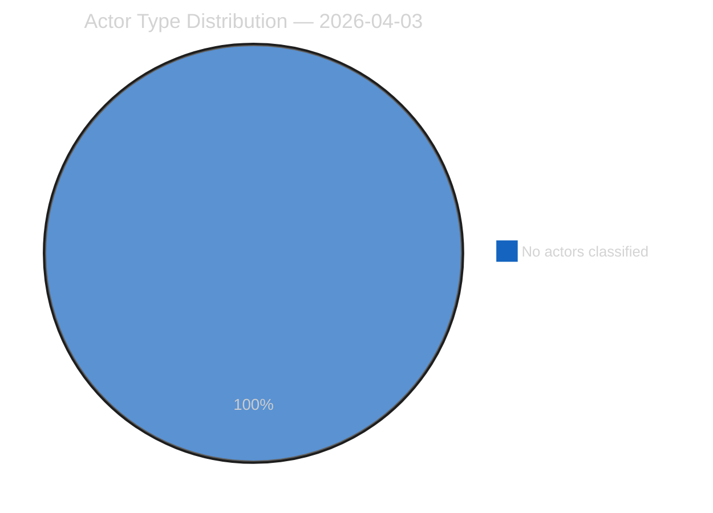
```mermaid
%%{init: {"theme":"dark","themeVariables":{"primaryColor":"#1565C0","primaryTextColor":"#ffffff","primaryBorderColor":"#0A3F7F","lineColor":"#90CAF9","secondaryColor":"#2E7D32","secondaryTextColor":"#ffffff","secondaryBorderColor":"#0F3F00","tertiaryColor":"#FF9800","tertiaryTextColor":"#000000","tertiaryBorderColor":"#7F4F00","mainBkg":"#1565C0","secondBkg":"#2E7D32","tertiaryBkg":"#FF9800","noteBkgColor":"#FFC107","noteTextColor":"#000000","noteBorderColor":"#7F6000","errorBkgColor":"#D32F2F","errorTextColor":"#ffffff","fontFamily":"Inter, Helvetica, Arial, sans-serif","pie1":"#1565C0","pie2":"#2E7D32","pie3":"#FF9800","pie4":"#D32F2F","pie5":"#FFC107","pie6":"#7B1FA2","pie7":"#9E9E9E","pie8":"#0288D1","pie9":"#388E3C","pie10":"#F57C00","pie11":"#C62828","pie12":"#FBC02D","pieTitleTextSize":"18px","pieSectionTextSize":"14px","pieLegendTextSize":"13px","pieStrokeColor":"#1e1e1e","pieOuterStrokeColor":"#1e1e1e","git0":"#1565C0","git1":"#2E7D32","git2":"#FF9800","git3":"#D32F2F","gitBranchLabel0":"#ffffff","gitBranchLabel1":"#ffffff","gitBranchLabel2":"#000000","gitBranchLabel3":"#ffffff","cScale0":"#1565C0","cScale1":"#2E7D32","cScale2":"#FF9800","cScale3":"#D32F2F","cScale4":"#FFC107","cScale5":"#7B1FA2","cScale6":"#9E9E9E","cScale7":"#0288D1","xyChart":{"backgroundColor":"#1e1e1e","plotColorPalette":"#1565C0,#2E7D32,#FF9800,#D32F2F,#FFC107,#7B1FA2,#9E9E9E"}}}}%%
pie title Actor Type Distribution — 2026-04-03
    "No actors classified" : 1
```

### Actor Classification

| Actor | Type | Influence | Position | Role |
|-------|------|-----------|----------|------|
| — | — | — | — | — |

### Type Counts

| Type | Count |
|------|-------|
| — | 0 |

### Date: 2026-04-03

### Forces Analysis

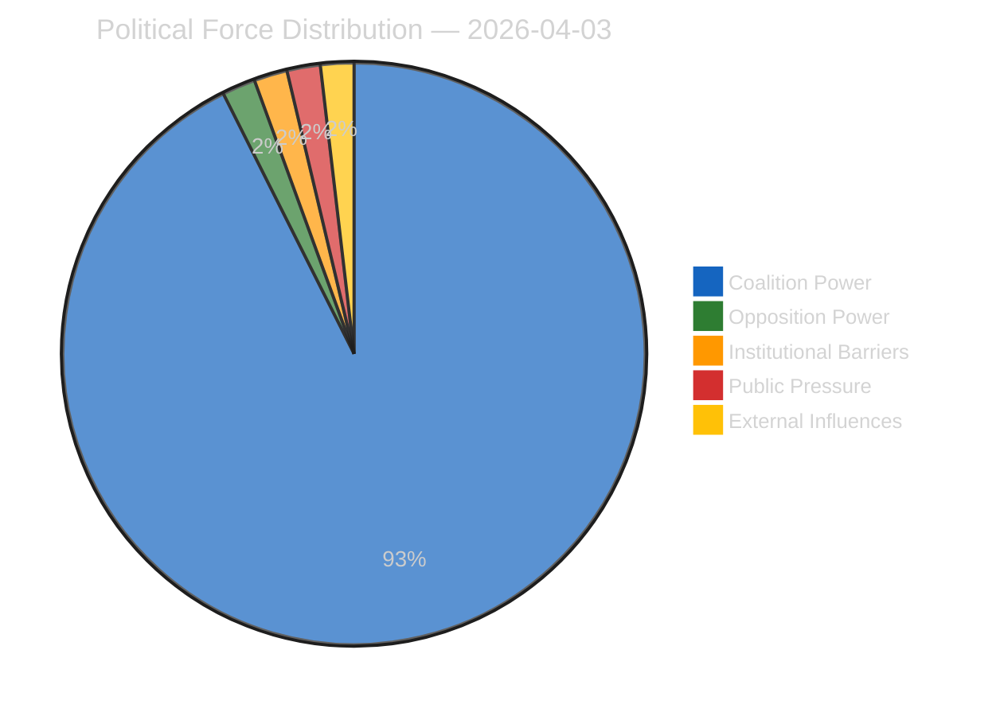
```mermaid
%%{init: {"theme":"dark","themeVariables":{"primaryColor":"#1565C0","primaryTextColor":"#ffffff","primaryBorderColor":"#0A3F7F","lineColor":"#90CAF9","secondaryColor":"#2E7D32","secondaryTextColor":"#ffffff","secondaryBorderColor":"#0F3F00","tertiaryColor":"#FF9800","tertiaryTextColor":"#000000","tertiaryBorderColor":"#7F4F00","mainBkg":"#1565C0","secondBkg":"#2E7D32","tertiaryBkg":"#FF9800","noteBkgColor":"#FFC107","noteTextColor":"#000000","noteBorderColor":"#7F6000","errorBkgColor":"#D32F2F","errorTextColor":"#ffffff","fontFamily":"Inter, Helvetica, Arial, sans-serif","pie1":"#1565C0","pie2":"#2E7D32","pie3":"#FF9800","pie4":"#D32F2F","pie5":"#FFC107","pie6":"#7B1FA2","pie7":"#9E9E9E","pie8":"#0288D1","pie9":"#388E3C","pie10":"#F57C00","pie11":"#C62828","pie12":"#FBC02D","pieTitleTextSize":"18px","pieSectionTextSize":"14px","pieLegendTextSize":"13px","pieStrokeColor":"#1e1e1e","pieOuterStrokeColor":"#1e1e1e","git0":"#1565C0","git1":"#2E7D32","git2":"#FF9800","git3":"#D32F2F","gitBranchLabel0":"#ffffff","gitBranchLabel1":"#ffffff","gitBranchLabel2":"#000000","gitBranchLabel3":"#ffffff","cScale0":"#1565C0","cScale1":"#2E7D32","cScale2":"#FF9800","cScale3":"#D32F2F","cScale4":"#FFC107","cScale5":"#7B1FA2","cScale6":"#9E9E9E","cScale7":"#0288D1","xyChart":{"backgroundColor":"#1e1e1e","plotColorPalette":"#1565C0,#2E7D32,#FF9800,#D32F2F,#FFC107,#7B1FA2,#9E9E9E"}}}}%%
pie title Political Force Distribution — 2026-04-03
    "Coalition Power" : 50
    "Opposition Power" : 1
    "Institutional Barriers" : 1
    "Public Pressure" : 1
    "External Influences" : 1
```

### Forces Data

| Force | Trend | Strength | Key Actors | Confidence |
|-------|-------|----------|------------|------------|
| Coalition Power | stable | 50% | — | low |
| Opposition Power | stable | 0% | — | low |
| Institutional Barriers | stable | 0% | — | low |
| Public Pressure | stable | 0% | — | low |
| External Influences | stable | 0% | — | low |

### Balance

| Metric | Value |
|--------|-------|
| Coalition vs Opposition | 50% vs 1% |
| Dominant force | Coalition |
| Date | 2026-04-03 |

### Date: 2026-04-03

### Impact Matrix

### Overall Significance: **ROUTINE**

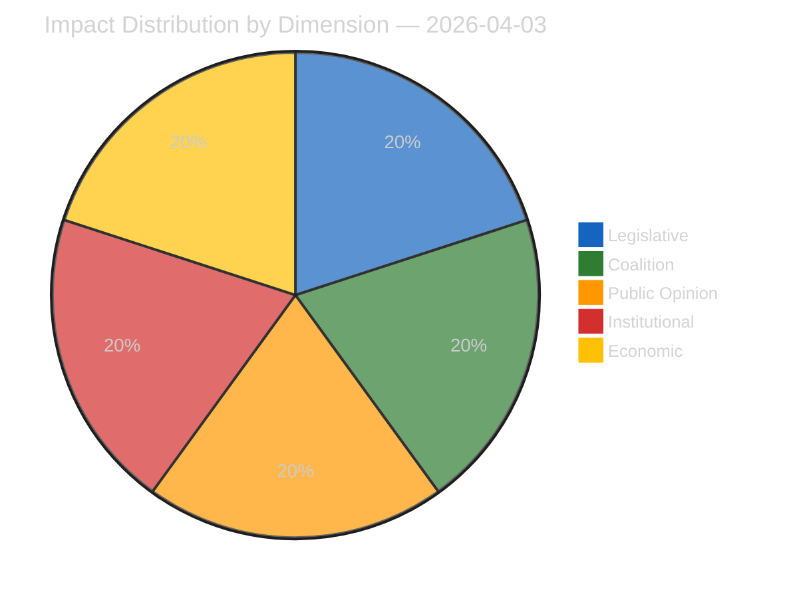
```mermaid
%%{init: {"theme":"dark","themeVariables":{"primaryColor":"#1565C0","primaryTextColor":"#ffffff","primaryBorderColor":"#0A3F7F","lineColor":"#90CAF9","secondaryColor":"#2E7D32","secondaryTextColor":"#ffffff","secondaryBorderColor":"#0F3F00","tertiaryColor":"#FF9800","tertiaryTextColor":"#000000","tertiaryBorderColor":"#7F4F00","mainBkg":"#1565C0","secondBkg":"#2E7D32","tertiaryBkg":"#FF9800","noteBkgColor":"#FFC107","noteTextColor":"#000000","noteBorderColor":"#7F6000","errorBkgColor":"#D32F2F","errorTextColor":"#ffffff","fontFamily":"Inter, Helvetica, Arial, sans-serif","pie1":"#1565C0","pie2":"#2E7D32","pie3":"#FF9800","pie4":"#D32F2F","pie5":"#FFC107","pie6":"#7B1FA2","pie7":"#9E9E9E","pie8":"#0288D1","pie9":"#388E3C","pie10":"#F57C00","pie11":"#C62828","pie12":"#FBC02D","pieTitleTextSize":"18px","pieSectionTextSize":"14px","pieLegendTextSize":"13px","pieStrokeColor":"#1e1e1e","pieOuterStrokeColor":"#1e1e1e","git0":"#1565C0","git1":"#2E7D32","git2":"#FF9800","git3":"#D32F2F","gitBranchLabel0":"#ffffff","gitBranchLabel1":"#ffffff","gitBranchLabel2":"#000000","gitBranchLabel3":"#ffffff","cScale0":"#1565C0","cScale1":"#2E7D32","cScale2":"#FF9800","cScale3":"#D32F2F","cScale4":"#FFC107","cScale5":"#7B1FA2","cScale6":"#9E9E9E","cScale7":"#0288D1","xyChart":{"backgroundColor":"#1e1e1e","plotColorPalette":"#1565C0,#2E7D32,#FF9800,#D32F2F,#FFC107,#7B1FA2,#9E9E9E"}}}}%%
pie title Impact Distribution by Dimension — 2026-04-03
    "Legislative" : 5
    "Coalition" : 5
    "Public Opinion" : 5
    "Institutional" : 5
    "Economic" : 5
```

### Impact Dimensions

| Dimension | Level | Indicator | Numeric |
|-----------|-------|-----------|---------|
| Legislative | none | 🟢 | 5 |
| Coalition | none | 🟢 | 5 |
| Public Opinion | none | 🟢 | 5 |
| Institutional | none | 🟢 | 5 |
| Economic | none | 🟢 | 5 |

### Summary

| Metric | Value |
|--------|-------|
| Overall significance | ROUTINE |
| Highest impact | Legislative |
| Date | 2026-04-03 |

### Date: 2026-04-03

### Significance Assessment

### Overall Significance: **ROUTINE**

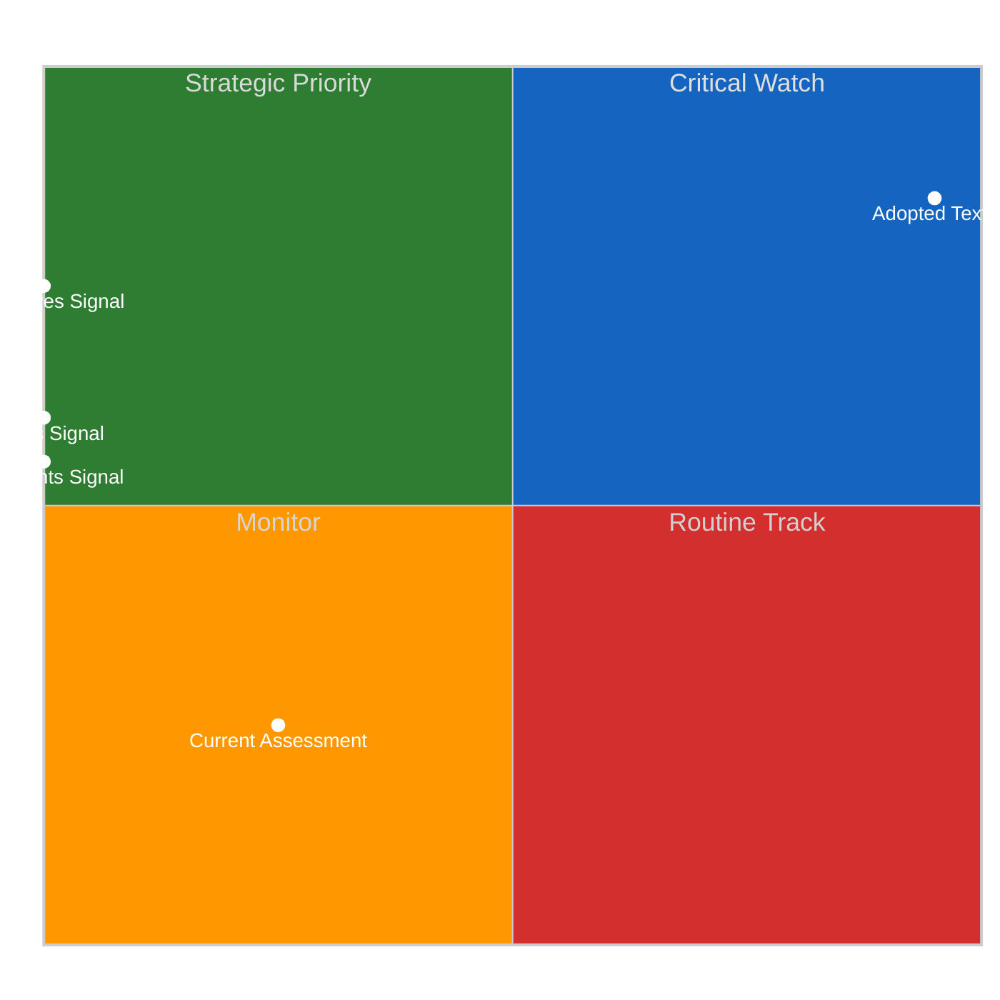
```mermaid
%%{init: {
  "theme": "dark",
  "themeVariables": {
    "quadrant1Fill": "#1565C0",
    "quadrant2Fill": "#2E7D32",
    "quadrant3Fill": "#FF9800",
    "quadrant4Fill": "#D32F2F",
    "quadrantTitleFill": "#ffffff",
    "quadrantPointFill": "#ffffff",
    "quadrantPointTextFill": "#ffffff",
    "quadrantXAxisTextFill": "#ffffff",
    "quadrantYAxisTextFill": "#ffffff"
  },
  "quadrantChart": {
    "chartWidth": 700,
    "chartHeight": 700,
    "pointLabelFontSize": 14,
    "titleFontSize": 22,
    "quadrantLabelFontSize": 18,
    "xAxisLabelFontSize": 16,
    "yAxisLabelFontSize": 16
  }
}}%%
quadrantChart
    title Political Significance Assessment — 2026-04-03
    x-axis Low Volume --> High Volume
    y-axis Low Impact --> High Impact
    quadrant-1 Critical Watch
    quadrant-2 Strategic Priority
    quadrant-3 Monitor
    quadrant-4 Routine Track
    Current Assessment: [0.25, 0.25]
    Events Signal: [0.00, 0.60]
    Documents Signal: [0.00, 0.55]
    Procedures Signal: [0.00, 0.75]
    Adopted Texts: [0.95, 0.85]
```

### 5-Signal Model Scores

| Signal | Raw Data | Score |
|--------|----------|-------|
| Volume | 0 events, 0 documents | 0.0/5 |
| Pipeline | 0 procedures | 0.0/5 |
| Output | 236 adopted texts | 5.0/5 |
| Anomalies | Pattern deviation detection | — |
| Coalition | Group alignment analysis | — |

### Data Summary

| Metric | Value |
|--------|-------|
| Computed significance | ROUTINE |
| Total data points | 236 |
| Events | 0 |
| Documents | 0 |
| Procedures | 0 |
| Adopted texts | 236 |
| Date | 2026-04-03 |

### Date: 2026-04-03

<h2 id="section-coalitions-voting">Coalitions & Voting</h2>

### Voting Patterns

### Detected Trends (Script-Generated Context)
| Trend ID | Direction | Confidence | Data Points |
|----------|-----------|------------|-------------|
| No trend data available from voting records | — | — | — |

### Computed Summary
- **Trends identified**: 0
- **Records analysed**: 0

### AI Analysis Prompt

> **Instructions for AI Agent (Opus 4.6):** Using the voting pattern data above and the adopted texts from EP MCP feeds, produce a voting pattern intelligence analysis. Your analysis MUST:
>
> 1. **Identify voting blocs**: Which groups consistently vote together on recent adopted texts?
> 2. **Detect anomalies**: Any unexpected votes, close margins (<50 vote difference), or high abstention rates?
> 3. **Analyse by policy domain**: Do voting patterns differ between economic, environmental, and social legislation?
> 4. **Group discipline assessment**: Rate each major group's internal cohesion (high/medium/low) with evidence
> 5. **Trend detection**: Compare recent voting patterns to historical trends — is the Parliament becoming more/less fragmented?
> 6. **Forward-looking**: Which upcoming votes are likely to be contested based on current alignment patterns?
>
> If voting records are limited, analyse the adopted texts' policy positions to infer likely voting alignments and coalition patterns.

### AI-Produced Voting Intelligence

[TO BE FILLED BY AI AGENT — Substantive voting pattern analysis with specific vote references, group cohesion ratings, and anomaly detection. Quality gate: minimum 300 words.]

### Date: 2026-04-03

<h2 id="section-risk">Risk Assessment</h2>

### Risk Matrix

### Overview

Quantitative risk scoring across 0 identified political dimensions.
This matrix uses a standardized likelihood × impact framework to quantify and
prioritize political risks affecting the European Parliament legislative process.

### Risk Heat Map

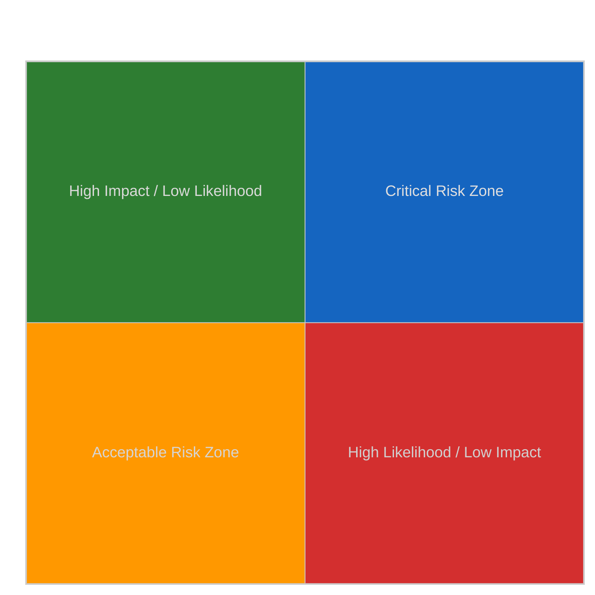
```mermaid
%%{init: {
  "theme": "dark",
  "themeVariables": {
    "quadrant1Fill": "#1565C0",
    "quadrant2Fill": "#2E7D32",
    "quadrant3Fill": "#FF9800",
    "quadrant4Fill": "#D32F2F",
    "quadrantTitleFill": "#ffffff",
    "quadrantPointFill": "#ffffff",
    "quadrantPointTextFill": "#ffffff",
    "quadrantXAxisTextFill": "#ffffff",
    "quadrantYAxisTextFill": "#ffffff"
  },
  "quadrantChart": {
    "chartWidth": 700,
    "chartHeight": 700,
    "pointLabelFontSize": 14,
    "titleFontSize": 22,
    "quadrantLabelFontSize": 18,
    "xAxisLabelFontSize": 16,
    "yAxisLabelFontSize": 16
  }
}}%%
quadrantChart
    title Political Risk Heat Map — 2026-04-03
    x-axis Low Likelihood --> High Likelihood
    y-axis Low Impact --> High Impact
    quadrant-1 Critical Risk Zone
    quadrant-2 High Impact / Low Likelihood
    quadrant-3 Acceptable Risk Zone
    quadrant-4 High Likelihood / Low Impact

```

### Risk Matrix

| Risk ID | Description | Likelihood | Impact | Score | Level |
|---------|-------------|------------|--------|-------|-------|
| — | — | — | — | — | — |

> **Risk Score** = Likelihood × Impact. **Levels**: 🟢 LOW (≤1.0), 🟡 MEDIUM (≤2.0), 🟠 HIGH (≤3.5), 🔴 CRITICAL (>3.5)

### Risk Assessment Details

| — | — | — | — | — | — |

### Risk Mitigation Framework

| Risk Level | Count | Tolerance | Action Required |
|------------|-------|-----------|-----------------|
| 🔴 CRITICAL | 0 | Zero tolerance | Immediate escalation |
| 🟠 HIGH | 0 | Low tolerance | Active mitigation |
| 🟡 MEDIUM | 0 | Moderate | Enhanced monitoring |
| 🟢 LOW | 0 | Acceptable | Routine tracking |

### Date: 2026-04-03

### Quantitative Swot

### Executive Summary

**Strategic Position Score**: 3.4/10
**Overall Assessment**: Weak strategic position: weaknesses and threats dominate — urgent mitigation needed.
**Analysis Date**: 2026-04-03

> This SWOT analysis is derived from 0 procedures, 0 events, 236 adopted texts, 0 documents, 0 voting records, and 0 coalition data points fetched from the European Parliament.

### SWOT Quadrant Chart

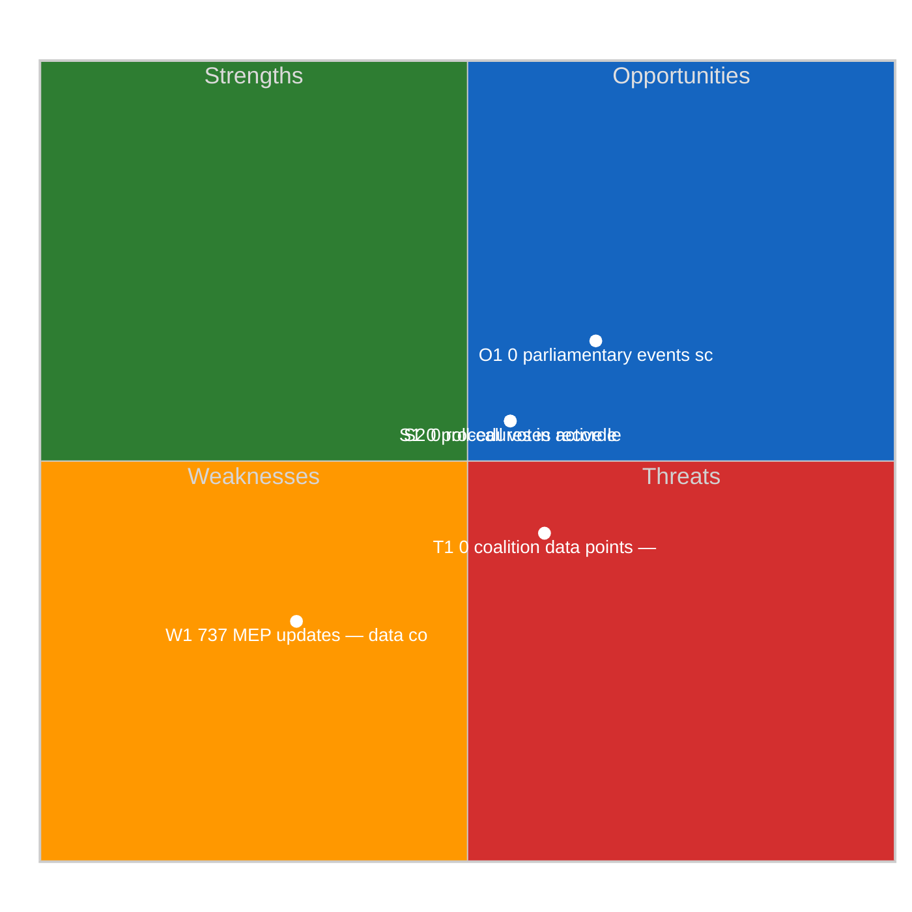
```mermaid
%%{init: {
  "theme": "dark",
  "themeVariables": {
    "quadrant1Fill": "#1565C0",
    "quadrant2Fill": "#2E7D32",
    "quadrant3Fill": "#FF9800",
    "quadrant4Fill": "#D32F2F",
    "quadrantTitleFill": "#ffffff",
    "quadrantPointFill": "#ffffff",
    "quadrantPointTextFill": "#ffffff",
    "quadrantXAxisTextFill": "#ffffff",
    "quadrantYAxisTextFill": "#ffffff"
  },
  "quadrantChart": {
    "chartWidth": 700,
    "chartHeight": 700,
    "pointLabelFontSize": 14,
    "titleFontSize": 22,
    "quadrantLabelFontSize": 18,
    "xAxisLabelFontSize": 16,
    "yAxisLabelFontSize": 16
  }
}}%%
quadrantChart
    title Political SWOT — Strategic Position (2026-04-03)
    x-axis Low Impact --> High Impact
    y-axis Low Priority --> High Priority
    quadrant-1 Opportunities
    quadrant-2 Strengths
    quadrant-3 Weaknesses
    quadrant-4 Threats
    S1 0 procedures in active le: [0.55, 0.55]
    S2 0 roll-call votes recorde: [0.55, 0.55]
    W1 737 MEP updates — data co: [0.30, 0.30]
    O1 0 parliamentary events sc: [0.65, 0.65]
    T1 0 coalition data points —: [0.59, 0.41]
```

### SWOT Overview

| Category | Items | Avg Score | Trend |
|----------|-------|-----------|-------|
| 🟢 Strengths | 2 | 0.0 | stable |
| 🔴 Weaknesses | 1 | 2.0 | stable |
| 🔵 Opportunities | 1 | 1.5 | stable |
| 🟠 Threats | 1 | 0.9 | stable |

### 🟢 Strengths

#### S1: 0 procedures in active legislative pipeline
- **Score**: 0.0/5
- **Confidence**: low
- **Trend**: stable
- **Evidence**:
  - 0 procedures tracked in current period
  - 236 texts adopted
  - 0 documents published

#### S2: 0 roll-call votes recorded with 0 questions
- **Score**: 0.0/5
- **Confidence**: low
- **Trend**: stable
- **Evidence**:
  - 0 voting records available
  - 0 parliamentary questions filed
  - 737 MEP activity updates

### 🔴 Weaknesses

#### W1: 737 MEP updates — data coverage gap assessment
- **Score**: 2.0/5
- **Confidence**: medium
- **Trend**: stable
- **Evidence**:
  - 737 MEP updates in current period
  - 0 documents vs 0 procedures ratio
  - Data freshness depends on EP feed update frequency

### 🔵 Opportunities

#### O1: 0 parliamentary events scheduled
- **Score**: 1.5/5
- **Confidence**: medium
- **Trend**: stable
- **Evidence**:
  - 0 events in analysis period
  - 236 texts adopted indicates legislative throughput
  - 0 procedures in various stages

### 🟠 Threats

#### T1: 0 coalition data points — cohesion monitoring
- **Score**: 0.9/5
- **Confidence**: low
- **Trend**: stable
- **Evidence**:
  - 0 coalition observations recorded
  - Cross-reference with 0 voting records
  - 0 procedures may be affected by coalition shifts

### Cross-Impact Matrix

| Interaction | Net Effect | Rationale |
|-------------|-----------|----------|
| strength #1 × threat #1 | 0.00 | Strength "0 procedures in active legislative pipeline" partially mitigates threat "0 coalition data points — cohesion monitoring" |
| strength #2 × threat #1 | 0.00 | Strength "0 roll-call votes recorded with 0 questions" partially mitigates threat "0 coalition data points — cohesion monitoring" |
| weakness #1 × threat #1 | 0.30 | Weakness "737 MEP updates — data coverage gap assessment" amplifies threat "0 coalition data points — cohesion monitoring" |

### Strategic Priorities Matrix

### Data Summary

| Data Source | Count |
|-------------|-------|
| Procedures | 0 |
| Events | 0 |
| Documents | 0 |
| Voting Records | 0 |
| Adopted Texts | 236 |
| Coalitions | 0 |
| Questions | 0 |
| MEP Updates | 737 |
| **Total Data Points** | **236** |

### Date: 2026-04-03

### Political Capital Risk

### Data Inventory for Capital Risk Assessment
| Data Source | Count | Relevance |
|-------------|-------|-----------|
| Coalition data points | 0 | Group cohesion indicators |
| Voting records | 0 | Voting alignment metrics |
| Voting patterns | 0 | Trend and anomaly data |
| Active procedures | 0 | Legislative engagement |

### Date: 2026-04-03

### Legislative Velocity Risk

### Overview
Risk assessment based on legislative processing speed for 0 procedures.

### Top Velocity Risks
| Procedure | Title | Stage | Days (actual/expected) | Risk Score | Level |
|-----------|-------|-------|----------------------|------------|-------|
| — | — | — | — | — | — |

### Summary
- **Procedures analysed**: 0
- **High/Critical risks**: 0
- **Date**: 2026-04-03

### Agent Risk Workflow

### Risk Heat Map

| Impact ↓ / Likelihood → | Rare | Unlikely | Possible | Likely | Almost Certain |
|--------------------------|------|----------|----------|--------|----------------|
| **Severe** | 🟢 | 🟡 | 🟠 | 🟠 | 🔴 |
| **Major** | 🟢 | 🟡 | 🟡 | 🟠 | 🔴 |
| **Moderate** | 🟢 | 🟢 | 🟡 | 🟠 | 🟠 |
| **Minor** | 🟢 | 🟢 | 🟢 | 🟡 | 🟡 |
| **Negligible** | 🟢 | 🟢 | 🟢 | 🟢 | 🟢 |

### Identified Risks

#### RISK-W00: Baseline political risk
- **Likelihood**: rare (0.1) | **Impact**: minor (2) | **Score**: 0.2 (LOW) | **Confidence**: low
- **Evidence**: Routine parliamentary activity
- **Mitigating Factors**: Stable institutional framework

### Risk Evaluation Matrix

| Rank | Risk ID | Description | Score | Level | Confidence |
|------|---------|-------------|-------|-------|------------|
| 1 | RISK-W00 | Baseline political risk | 0.2 | LOW | low |

### Risk Treatment Plan

- Monitor legislative velocity indicators
- Track coalition voting patterns

### Recommendations

- Monitor legislative velocity indicators
- Track coalition voting patterns

<h2 id="section-threat">Threat Landscape</h2>

### Actor Threat Profiles

### Overview
Individual threat profiles for 0 political actors.

### Actor Threat Matrix
| Actor | Type | Capability | Motivation | Opportunity | Threat Level |
|-------|------|------------|------------|-------------|--------------|
| — | — | — | — | — | — |

### Date: 2026-04-03

### Consequence Trees

### Overview
Structured analysis of action-consequence chains for 0 legislative procedures.

### No procedures available for consequence analysis

### Date: 2026-04-03

### Legislative Disruption

### Overview
Identification of factors disrupting the normal legislative process.

### Disruption Assessment
| Procedure ID | Title | Stage | Resilience | Disruption Points |
|-------------|-------|-------|-----------|-------------------|
| — | — | — | — | — |

### Date: 2026-04-03

### Political Threat Landscape

### Political Threat Landscape Analysis

#### Coalition Shifts
**Threat Level**: 🟢 Low

Coalition stability appears maintained. No significant realignment signals.

**Evidence:**
- No coalition shift signals detected in available data

#### Transparency Deficit
**Threat Level**: ⚠️ Moderate

Transparency concerns at moderate level. Review committee meeting records and public documentation.

**Evidence:**
- No committee activity data available — potential information gap

#### Policy Reversal
**Threat Level**: 🟢 Low

Legislative trajectory appears stable. No major reversal signals.

**Evidence:**
- No significant policy reversal signals detected

#### Institutional Pressure
**Threat Level**: 🟢 Low

Institutional balance appears maintained. Power distribution within normal parameters.

**Evidence:**
- No institutional threat signals detected

#### Legislative Obstruction
**Threat Level**: 🟢 Low

Legislative pace within normal parameters. No obstruction signals.

**Evidence:**
- No significant legislative delay signals detected

#### Democratic Erosion
**Threat Level**: 🟢 Low

Democratic norms appear stable. Institutional processes functioning within expected parameters.

**Evidence:**
- Democratic norms appear stable. No systematic erosion signals.

### Actor Threat Profiles

*No actor threat profiles generated from available data.*

### Consequence Trees

#### Consequence Tree: Standard legislative activity assessment

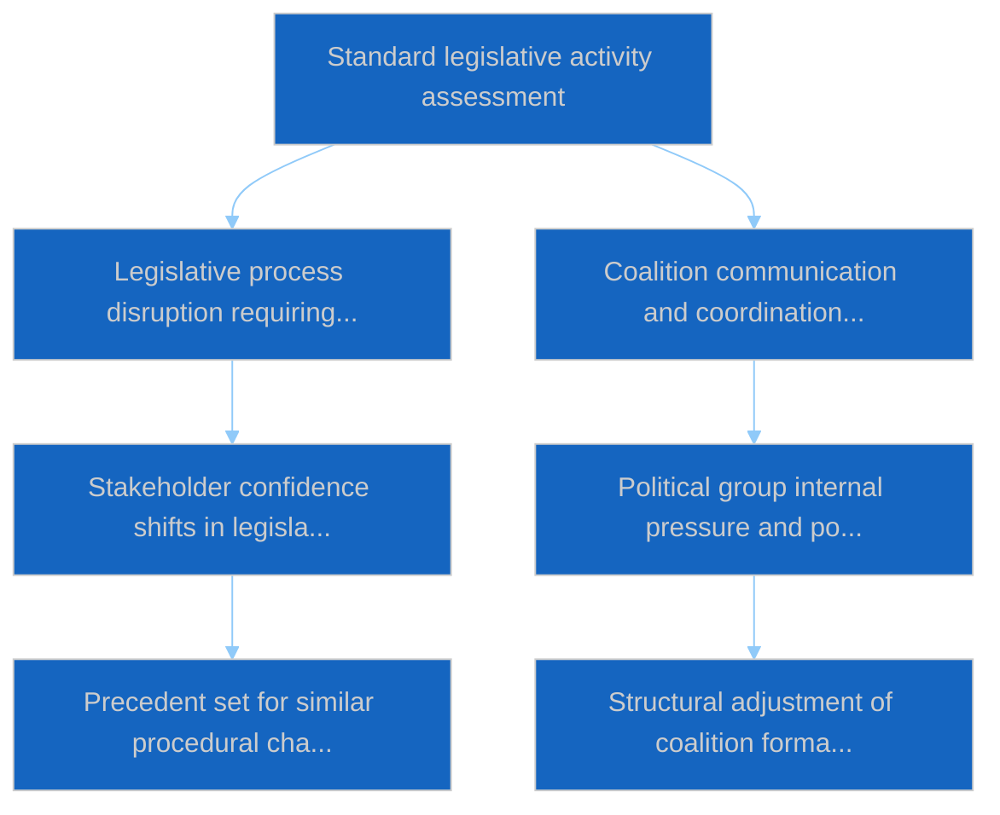
```mermaid
%%{init: {"theme":"dark","themeVariables":{"primaryColor":"#1565C0","primaryTextColor":"#ffffff","primaryBorderColor":"#0A3F7F","lineColor":"#90CAF9","secondaryColor":"#2E7D32","secondaryTextColor":"#ffffff","secondaryBorderColor":"#0F3F00","tertiaryColor":"#FF9800","tertiaryTextColor":"#000000","tertiaryBorderColor":"#7F4F00","mainBkg":"#1565C0","secondBkg":"#2E7D32","tertiaryBkg":"#FF9800","noteBkgColor":"#FFC107","noteTextColor":"#000000","noteBorderColor":"#7F6000","errorBkgColor":"#D32F2F","errorTextColor":"#ffffff","fontFamily":"Inter, Helvetica, Arial, sans-serif","pie1":"#1565C0","pie2":"#2E7D32","pie3":"#FF9800","pie4":"#D32F2F","pie5":"#FFC107","pie6":"#7B1FA2","pie7":"#9E9E9E","pie8":"#0288D1","pie9":"#388E3C","pie10":"#F57C00","pie11":"#C62828","pie12":"#FBC02D","pieTitleTextSize":"18px","pieSectionTextSize":"14px","pieLegendTextSize":"13px","pieStrokeColor":"#1e1e1e","pieOuterStrokeColor":"#1e1e1e","git0":"#1565C0","git1":"#2E7D32","git2":"#FF9800","git3":"#D32F2F","gitBranchLabel0":"#ffffff","gitBranchLabel1":"#ffffff","gitBranchLabel2":"#000000","gitBranchLabel3":"#ffffff","cScale0":"#1565C0","cScale1":"#2E7D32","cScale2":"#FF9800","cScale3":"#D32F2F","cScale4":"#FFC107","cScale5":"#7B1FA2","cScale6":"#9E9E9E","cScale7":"#0288D1","xyChart":{"backgroundColor":"#1e1e1e","plotColorPalette":"#1565C0,#2E7D32,#FF9800,#D32F2F,#FFC107,#7B1FA2,#9E9E9E"}}}}%%
graph TD
    A["Standard legislative activity assessment"]
    B0["Legislative process disruption requiring..."]
    A --> B0
    B1["Coalition communication and coordination..."]
    A --> B1
    C0["Stakeholder confidence shifts in legisla..."]
    B0 --> C0
    C1["Political group internal pressure and po..."]
    B1 --> C1
    D0["Precedent set for similar procedural cha..."]
    C0 --> D0
    D1["Structural adjustment of coalition forma..."]
    C1 --> D1
```

**Mitigating Factors:**
- Institutional resilience mechanisms
- Cross-party dialogue channels

**Amplifying Factors:**
- No significant amplifying factors identified

### Legislative Disruption Analysis

#### Procedure: General legislative pipeline

**Current Stage**: proposal | **Resilience**: high

| Stage | Threat Category | Likelihood | Risk Level |
|-------|----------------|------------|------------|
| proposal | delay | 8% | 🟢 Low |
| committee | transparency | 18% | 🟢 Low |
| plenary first reading | shift | 22% | 🟢 Low |
| council position | delay | 12% | 🟢 Low |
| plenary second reading | shift | 21% | 🟢 Low |
| conciliation | reversal | 17% | 🟢 Low |
| adoption | delay | 5% | 🟢 Low |

**Alternative Pathways:**
- Commission resubmission with revised proposal
- Enhanced informal trilogue engagement
- Interim resolution as procedural bridge

### Key Findings

- No high-priority threats detected across threat landscape dimensions

### Recommendations

- Continue routine monitoring of parliamentary activity

---
*Assessment generated by EU Parliament Monitor Political Threat Assessment Pipeline.*  
*Based on public European Parliament data. GDPR-compliant.*

<h2 id="section-continuity">Cross-Run Continuity</h2>

### Cross Session Intelligence

### Computed Stability Metrics (Script-Generated Context)
- **Overall Stability**: 0.0%
- **Forecast**: volatile
- **Patterns Analysed**: 0
- **Stable Groups**: None identified from voting data
- **Declining Groups**: None identified from voting data

### AI Analysis Prompt

> **Instructions for AI Agent (Opus 4.6):** Using the cross-session stability metrics above and the adopted texts/voting records from recent plenary sessions, produce a cross-session intelligence synthesis. Your analysis MUST:
>
> 1. **Compare coalition patterns** across the last 3-5 plenary sessions — are alliances strengthening or fragmenting?
> 2. **Identify session-over-session trends**: Which policy areas show increasing/decreasing consensus?
> 3. **Detect coalition realignment signals**: Are new voting blocs forming? Is the Grand Coalition showing stress?
> 4. **Institutional dynamics**: How are EP-Council-Commission dynamics evolving based on recent legislative outcomes?
> 5. **Predictive assessment**: Based on cross-session patterns, forecast likely coalition behavior for upcoming votes
> 6. **Confidence levels**: Rate each finding as 🟢 High / 🟡 Medium / 🔴 Low
>
> Cross-reference with adopted texts from the most recent plenary session to ground the analysis in specific legislative outcomes.

### AI-Produced Cross-Session Intelligence

[TO BE FILLED BY AI AGENT — Cross-session trend analysis with specific plenary session references, coalition evolution assessment, and predictive indicators. Quality gate: minimum 400 words.]

### Date: 2026-04-03

<h2 id="section-deep-analysis">Deep Analysis</h2>

### Raw Data Inventory (Script-Generated Context for AI)
| Data Source | Count |
|-------------|-------|
| Events | 0 |
| Procedures | 0 |
| Documents | 0 |
| Adopted Texts | 236 |
| Questions | 0 |
| MEP Updates | 737 |
| **Total** | **973** |

### Stakeholder Groups — Data Points Available
| Stakeholder Group | Data Points Available |
|-------------------|---------------------|
| Political Groups | 236 (procedures + adopted texts) |
| Civil Society | 0 (documents + questions) |
| Industry | 0 (procedures) |
| National Governments | 236 (adopted texts) |
| Citizens | 737 (questions + MEP updates) |
| EU Institutions | 0 (events + procedures) |

### AI Analysis Prompt

> **Instructions for AI Agent (Opus 4.6):** Using the data inventory above and the raw EP MCP data files, produce a deep multi-perspective analysis following the political-style-guide.md depth Level 3 format. Your analysis MUST:
>
> 1. **Identify the 3-5 most politically significant items** from the available data, citing specific document IDs
> 2. **Analyse each from ≥3 stakeholder perspectives** (Political Groups, Civil Society, Industry, National Governments, Citizens, EU Institutions)
> 3. **Apply the SWOT framework** to the overall parliamentary activity pattern for this date
> 4. **Assess coalition dynamics** — which groups are aligning/diverging based on the adopted texts?
> 5. **Rate confidence** for each analytical claim: 🟢 High / 🟡 Medium / 🔴 Low
> 6. **Provide forward-looking indicators** — what should be monitored in the next 7-14 days?
> 7. **Include a Mermaid diagram** showing key actor relationships or policy connection mapping
>
> Evidence requirement: ≥3 citations per section from EP MCP data (document IDs, vote references, procedure numbers).

### AI-Produced Analysis

[TO BE FILLED BY AI AGENT — This section must contain substantive political intelligence analysis, not data summaries. Quality gate: minimum 500 words of original analytical prose with evidence citations.]

### Date: 2026-04-03

<h2 id="section-supplementary-intelligence">Supplementary Intelligence</h2>

### Executive Brief Ar

**التصنيف:** OSINT | سجل برلماني عام  
**مستوى الثقة:** 🟢 مرتفع (تقييم هيكلي في فترة العطلة، حالة API متدهورة)  
**تاريخ الإنشاء:** 2026-04-03T00:00:00Z (موجز استعادي)  
**نوع المقال:** مقترحات القرارات  
**رقم التشغيل:** `ddaeac0a-0829-43fb-8588-46bf89f410a4`  
**المصدر:** بوابة البيانات المفتوحة للبرلمان الأوروبي

---

### 🎯 BLUF

**لم تُقدَّم أي مقترحات قرارات جديدة في 2026-04-03؛ أسبوع العطلة 2 من أصل 4، الحالة المتدهورة لتغذية البيانات مؤكَّدة من المقال الشقيق `breaking-2`.** أعاد التشغيل `ddaeac0a-0829-43fb-8588-46bf89f410a4` نتيجة **"تقييم المخاطر الكمي عبر 0 بُعد سياسي محدَّد"** — صفر جهات فاعلة مصنَّفة، أهمية روتينية. لا يُتوقع أول تقديم لمقترحات القرارات في أبريل قبل نحو 17-20 أبريل. ترسيخ مخزون المقترحات المنقولة من مارس قائمة مراقبة أبريل: السجناء السياسيون الجورجيون (TA-10-2026-0083)، اعتمادات انبعاثات HDV (TA-10-2026-0084)، الرسوم الجمركية الأمريكية (TA-10-2026-0096)، متابعة الحصانة في سابقة براون، مكافحة الفساد (TA-10-2026-0094). **🟢 ثقة عالية** بأن الحالة الفارغة مدفوعة بالتقويم وتدهور تغذية البيانات.

---

### 🧭 3 قرارات يدعمها هذا الموجز

| # | القرار | من يتخذ القرار | الموعد النهائي | الدليل |
|:-:|--------|----------------|:--------------:|--------|
| 1 | **تحريري:** تخطّي مقترحات القرارات اليومية | المحرر | +24 ساعة | تشغيل فارغ + تغذيات متدهورة |
| 2 | **المراقبة:** تحديد الموجة الأولى لتقديم مقترحات أبريل في 17-20 أبريل | المحلل | 2026-04-17 | نمط تقديم البرلمان الأوروبي |
| 3 | **استشرافي:** تتبع مزيج المقترحات للسيناريو أ (التجارة) مقابل ب (سيادة القانون) مقابل ج (الاقتصاد) | مسؤول التحليل | 2026-04-20 | المعايرة قبل الجلسة العامة |

---

### 📰 قراءة 60 ثانية

- 🔴 **لم تُقدَّم مقترحات قرارات جديدة** في 2026-04-03؛ عطلة. (🟢 مرتفع)
- 🟠 **0 جهة فاعلة مصنَّفة**؛ حالة القالب "تقييم المخاطر الكمي عبر 0 بُعد سياسي محدَّد". (🟢 مرتفع)
- 🟢 **المقترحات المنقولة من مارس** تهيمن على قائمة مراقبة أبريل. (🟢 مرتفع)
- 🟡 **جميع أبعاد المخاطر "لا شيء"** اليوم. (🟢 مرتفع)
- 🔵 **السياق الاقتصادي:** الانتقام الجمركي الأمريكي وتنفيذ مكافحة الفساد يهيمنان. (🟢 مرتفع)
- 🟣 **الإشارة المرجعية المتقاطعة:** يغطي المقال الشقيق `breaking-3` مجموعة إصلاح مكافحة الفساد التي ستولّد مقترحات متابعة في أبريل. (🟢 مرتفع)
- 🩷 **ناقل الاضطراب:** لا حاد اليوم. (🟢 مرتفع)
- ⚪ **استشرافي:** من المتوقع أن يُثير رأي محكمة العدل الأوروبية بشأن ميركوسور مقترحات قرارات عند نشره.

---

### 🗂️ أبرز الوثائق / الإجراءات — مراقبة مقترحات القرارات

| الترتيب | مرجع البرلمان الأوروبي | العنوان (مختصر) | الأهمية | الثقة | الحالة |
|:-------:|------------------------|-----------------|:-------:|:-----:|--------|
| 1 | — | لا توجد مقترحات قرارات جديدة 2026-04-03 | 0.0 | 🟢 مرتفع | عطلة + تغذيات متدهورة |
| 2 | TA-10-2026-0094 | مقترحات متابعة توجيه مكافحة الفساد | 8.0 | 🟢 مرتفع | اعتُمدت في 26 مارس |
| 3 | TA-10-2026-0083 | السجناء السياسيون الجورجيون (منقول) | 7.0 | 🟢 مرتفع | مراقبة التنفيذ |

---

### ⚠️ لمحة عن المخاطر والتهديدات

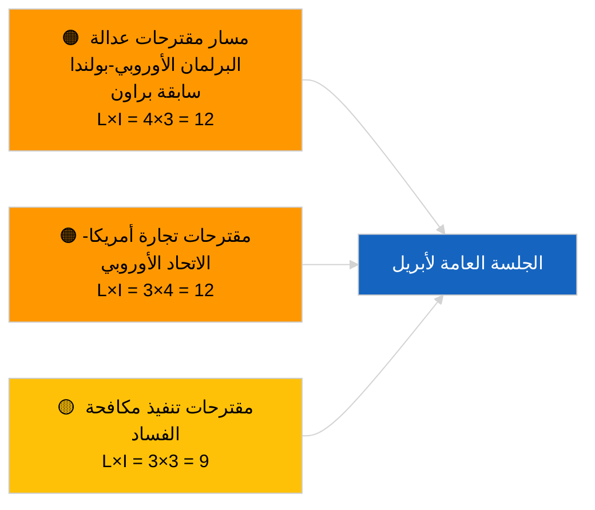
```mermaid
%%{init: {"theme":"dark"}}%%
graph LR
    R1["🟠 مسار مقترحات عدالة البرلمان الأوروبي-بولندا<br/>سابقة براون<br/>L×I = 4×3 = 12"] --> CONS["الجلسة العامة لأبريل"]
    R2["🟠 مقترحات تجارة أمريكا-الاتحاد الأوروبي<br/>L×I = 3×4 = 12"] --> CONS
    R3["🟡 مقترحات تنفيذ مكافحة الفساد<br/>L×I = 3×3 = 9"] --> CONS
    style R1 fill:#FF9800,color:#000000
    style R2 fill:#FF9800,color:#000000
    style R3 fill:#FFC107,color:#000000
    style CONS fill:#1565C0,color:#FFFFFF
```

| المخاطرة | L | I | الدرجة | المحفّز | المصدر | الأميرالية |
|----------|:-:|:-:|:------:|---------|--------|:----------:|
| مسار عدالة البرلمان الأوروبي-بولندا | 4 | 3 | 12 | قضية حصانة جديدة | TA-10-2026-0088 | A1 |
| مقترحات التجارة بين أمريكا والاتحاد الأوروبي | 3 | 4 | 12 | إجراء أمريكي | TA-10-2026-0096 | A1 |
| مقترحات متابعة مكافحة الفساد | 3 | 3 | 9 | احتكاك نقل وطني | TA-10-2026-0094 | A2 |

---

### 🔮 أبرز المحفّزات الاستشرافية

**الموجة الأولى لتقديم مقترحات القرارات في أبريل ~17-20 أبريل 2026.** يضبط مزيج الموضوعات سيناريو الجلسة العامة لأبريل.

---

### 🛡️ تقييم جودة المصادر

- **المصادر الأولية:** التشغيل `ddaeac0a-0829-43fb-8588-46bf89f410a4`؛ يؤكد المقال الشقيق `breaking-2` حالة تغذية البيانات المتدهورة.
- **مستوى الثقة:** 🟢 مرتفع فيما يخص المحفّز التقويمي.

---

### 📎 الروابط

| الرابط | المسار |
|--------|--------|
| المقال | `./article.md` |
| المقالات الشقيقة | `analysis/daily/2026-04-03/breaking/`, `breaking-2/`, `breaking-3/`, `committee-reports/`, `propositions/`, `week-ahead/` |
| البيان | `./manifest.json` |

---

**التحكم في الوثيقة**
- **القالب:** `/analysis/templates/executive-brief.md`
- **مسار القطعة الأثرية:** `analysis/daily/2026-04-03/motions/executive-brief.md`
- **التصنيف:** عام
- **التوليد الاستعادي:** جلسة الملء التراجعي.

### Executive Brief Da

### 🎯 BLUF

**Ingen nye beslutningsforslag stillet den 2026-04-03; recessuge 2 af 4, DEGRADERET feedtilstand bekræftet af søskenartiklen `breaking-2`.** Kørsel `ddaeac0a-0829-43fb-8588-46bf89f410a4` returnerede **"Kvantitativ risikovurdering over 0 identificerede politiske dimensioner"** — nul klassificerede aktører, RUTINEMÆSSIG betydning. Første april-indstilling af forslag til beslutning forventes ikke før ~17-20 april. Marts-overførte beslutningsforslagsbeholdning dominerer april-overvågningslisten: Georgiens politiske fanger (TA-10-2026-0083), HDV-emissionskreditter (TA-10-2026-0084), amerikanske toldsatser (TA-10-2026-0096), Braun-præcedens immunitetsopfølgning, antikorruption (TA-10-2026-0094). **🟢 HØJ konfidensgrad** at tom tilstand skyldes kalender- og feed-degradering.

---

### 🧭 3 Beslutninger denne briefing understøtter

| # | Beslutning | Hvem beslutter | Tidsfrist | Bevis |
|:-:|------------|----------------|:---------:|-------|
| 1 | **Redaktionelt:** SPRING daglige beslutningsforslag over | Redaktør | +24t | Tom kørsel + DEGRADEREDE feeds |
| 2 | **Overvågning:** markér første april-beslutningsforslagsbølge 17–20 april | Analytiker | 2026-04-17 | EP's indstillingsmønster |
| 3 | **Fremadrettet:** spor forslagsblanding for Scenarie A (handel) vs B (retsstat) vs C (økonomi) | Analyseleder | 2026-04-20 | Kalibrering forud for plenum |

---

### 📰 60-sekunders læsning

- 🔴 **Ingen nye beslutningsforslag indstillet** den 2026-04-03; recess. (🟢 Høj)
- 🟠 **0 aktører klassificeret**; skabelontilstand "Kvantitativ risikovurdering over 0 identificerede politiske dimensioner". (🟢 Høj)
- 🟢 **Marts-overførselsforslag** dominerer april-overvågningslisten. (🟢 Høj)
- 🟡 **Alle risikodimensioner "ingen"** i dag. (🟢 Høj)
- 🔵 **Økonomisk kontekst:** Amerikansk toldgengældelse og antikorruptionsimplementering dominerer. (🟢 Høj)
- 🟣 **Krydshenvisning:** Søskenartiklen `breaking-3` dækker antikorruptionsreformklyngen, der vil generere opfølgende beslutningsforslag i april. (🟢 Høj)
- 🩷 **Forstyrrelsesvektor:** ingen akut i dag. (🟢 Høj)
- ⚪ **Fremadrettet:** Mercosur ECJ-udtalelse ventes at udløse beslutningsforslag ved offentliggørelse.

---

### 🗂️ Topdokumenter / Procedurer — Beslutningsforslagsovervågning

| Rang | EP-reference | Titel (kort) | Betydning | Konfidensgrad | Status |
|:----:|--------------|--------------|:---------:|:-------------:|--------|
| 1 | — | Ingen nye beslutningsforslag 2026-04-03 | 0.0 | 🟢 HØJ | Recess + DEGRADEREDE feeds |
| 2 | TA-10-2026-0094 | Antikorruptionsdirektivets opfølgningsbeslutningsforslag | 8.0 | 🟢 HØJ | Vedtaget 26. marts |
| 3 | TA-10-2026-0083 | Georgiens politiske fanger (overførsels) | 7.0 | 🟢 HØJ | Implementeringsovervågning |

---

### ⚠️ Risiko- og trusseloversigt

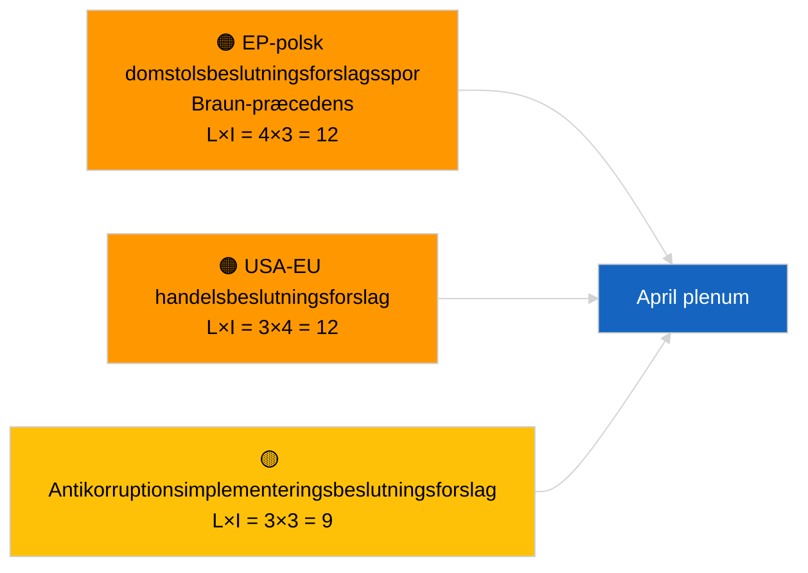
```mermaid
%%{init: {"theme":"dark"}}%%
graph LR
    R1["🟠 EP-polsk domstolsbeslutningsforslagsspor<br/>Braun-præcedens<br/>L×I = 4×3 = 12"] --> CONS["April plenum"]
    R2["🟠 USA-EU handelsbeslutningsforslag<br/>L×I = 3×4 = 12"] --> CONS
    R3["🟡 Antikorruptionsimplementeringsbeslutningsforslag<br/>L×I = 3×3 = 9"] --> CONS
    style R1 fill:#FF9800,color:#000000
    style R2 fill:#FF9800,color:#000000
    style R3 fill:#FFC107,color:#000000
    style CONS fill:#1565C0,color:#FFFFFF
```

| Risiko | L | I | Score | Udløser | Kilde | Admiralitet |
|--------|:-:|:-:|:-----:|---------|-------|:-----------:|
| EP-polsk domstolsbeslutningsforslagsspor | 4 | 3 | 12 | Ny immunitetssag | TA-10-2026-0088 | A1 |
| USA-EU handelsbeslutningsforslag | 3 | 4 | 12 | Amerikansk handling | TA-10-2026-0096 | A1 |
| Antikorruptionsopfølgningsbeslutningsforslag | 3 | 3 | 9 | National implementeringsfrikt | TA-10-2026-0094 | A2 |

---

### 🔮 Fremste fremadrettede udløser

**Første april-beslutningsforslagsbølge ~17–20 april 2026.** Emneblanding kalibrerer april-plenarscenarie.

---

### 🛡️ Vurdering af kildekvalitet

- **Primærkilder:** Kørsel `ddaeac0a-0829-43fb-8588-46bf89f410a4`; søskenartiklen `breaking-2` bekræfter DEGRADERET feedtilstand.
- **Konfidensgrad:** 🟢 HØJ vedrørende kalenderdriveren.

---

### 📎 Links

| Link | Sti |
|------|-----|
| Artikel | `./article.md` |
| Søskenartikler | `analysis/daily/2026-04-03/breaking/`, `breaking-2/`, `breaking-3/`, `committee-reports/`, `propositions/`, `week-ahead/` |
| Manifest | `./manifest.json` |

---

**Dokumentkontrol**
- **Skabelon:** `/analysis/templates/executive-brief.md`
- **Artefaktsti:** `analysis/daily/2026-04-03/motions/executive-brief.md`
- **Klassificering:** Offentlig
- **Retrospektiv generering:** Tilbagefyldningssession.

### Executive Brief De

### 🎯 BLUF

**Keine neuen Entschließungsanträge am 2026-04-03 eingebracht; Sitzungspause Woche 2 von 4, DEGRADIERTER Feed-Zustand durch Geschwisterartikel `breaking-2` bestätigt.** Ausführung `ddaeac0a-0829-43fb-8588-46bf89f410a4` lieferte **„Quantitative Risikobewertung über 0 identifizierte politische Dimensionen"** — null klassifizierte Akteure, ROUTINEMÄSSIGE Bedeutung. Die erste April-Einreichung von Entschließungsanträgen wird nicht vor ~17.–20. April erwartet. Das aus dem März übertragene Entschließungsantragsbestand dominiert die April-Beobachtungsliste: Georgiens politische Gefangene (TA-10-2026-0083), HDV-Emissionsgutschriften (TA-10-2026-0084), US-Zölle (TA-10-2026-0096), Braun-Präzedenz-Immunitätsnachverfolgung, Antikorruption (TA-10-2026-0094). **🟢 HOHER Konfidenzgrad**, dass der leere Zustand kalender- und feed-degradierungsbedingt ist.

---

### 🧭 3 Entscheidungen, die diese Kurzinformation unterstützt

| # | Entscheidung | Wer entscheidet | Frist | Nachweis |
|:-:|--------------|-----------------|:-----:|----------|
| 1 | **Redaktionell:** Tägliche Entschließungsanträge ÜBERSPRINGEN | Redakteur | +24h | Leere Ausführung + DEGRADIERTE Feeds |
| 2 | **Monitoring:** Erste April-Entschließungsantrags-Welle 17.–20. April kennzeichnen | Analyst | 2026-04-17 | Einreichungsmuster des EP |
| 3 | **Vorausblickend:** Antragsgemisch für Szenario A (Handel) vs. B (Rechtsstaat) vs. C (Wirtschaft) verfolgen | Analyseleiter | 2026-04-20 | Kalibrierung vor Plenum |

---

### 📰 60-Sekunden-Lektüre

- 🔴 **Keine neuen Entschließungsanträge eingebracht** am 2026-04-03; Sitzungspause. (🟢 Hoch)
- 🟠 **0 Akteure klassifiziert**; Vorlagenstatus „Quantitative Risikobewertung über 0 identifizierte politische Dimensionen". (🟢 Hoch)
- 🟢 **Aus März übertragene Anträge** dominieren die April-Beobachtungsliste. (🟢 Hoch)
- 🟡 **Alle Risikodimensionen „keine"** heute. (🟢 Hoch)
- 🔵 **Wirtschaftlicher Kontext:** US-Zollvergeltung und Antikorruptionsumsetzung dominieren. (🟢 Hoch)
- 🟣 **Querverweise:** Geschwisterartikel `breaking-3` deckt das Antikorruptionsreformcluster ab, das im April Folgeanträge generieren wird. (🟢 Hoch)
- 🩷 **Störungsvektor:** heute nicht akut. (🟢 Hoch)
- ⚪ **Vorausblickend:** Mercosur-EuGH-Gutachten dürfte bei Veröffentlichung Entschließungsanträge auslösen.

---

### 🗂️ Top-Dokumente / Verfahren — Entschließungsantrags-Beobachtung

| Rang | EP-Referenz | Titel (kurz) | Bedeutung | Konfidenz | Status |
|:----:|-------------|--------------|:---------:|:---------:|--------|
| 1 | — | Keine neuen Entschließungsanträge 2026-04-03 | 0.0 | 🟢 HOCH | Sitzungspause + DEGRADIERTE Feeds |
| 2 | TA-10-2026-0094 | Folgeanträge zur Antikorruptionsrichtlinie | 8.0 | 🟢 HOCH | Am 26. März angenommen |
| 3 | TA-10-2026-0083 | Georgiens politische Gefangene (übertragen) | 7.0 | 🟢 HOCH | Umsetzungsbeobachtung |

---

### ⚠️ Risiko- und Bedrohungsüberblick

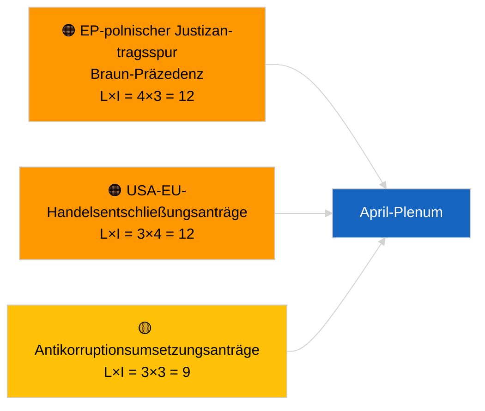
```mermaid
%%{init: {"theme":"dark"}}%%
graph LR
    R1["🟠 EP-polnischer Justizan­trags­spur<br/>Braun-Präzedenz<br/>L×I = 4×3 = 12"] --> CONS["April-Plenum"]
    R2["🟠 USA-EU-Handelsentschließungsanträge<br/>L×I = 3×4 = 12"] --> CONS
    R3["🟡 Antikorruptionsumsetzungsanträge<br/>L×I = 3×3 = 9"] --> CONS
    style R1 fill:#FF9800,color:#000000
    style R2 fill:#FF9800,color:#000000
    style R3 fill:#FFC107,color:#000000
    style CONS fill:#1565C0,color:#FFFFFF
```

| Risiko | L | I | Wert | Auslöser | Quelle | Admiralität |
|--------|:-:|:-:|:----:|---------|--------|:-----------:|
| EP-polnischer Justizantragsspur | 4 | 3 | 12 | Neuer Immunitätsfall | TA-10-2026-0088 | A1 |
| USA-EU-Handelsentschließungsanträge | 3 | 4 | 12 | US-Maßnahme | TA-10-2026-0096 | A1 |
| Antikorruptions-Folgeanträge | 3 | 3 | 9 | Nationales Umsetzungsreibung | TA-10-2026-0094 | A2 |

---

### 🔮 Wichtigster vorausblickender Auslöser

**Erste April-Entschließungsantrags-Welle ~17.–20. April 2026.** Themengemisch kalibriert April-Plenarszenario.

---

### 🛡️ Bewertung der Quellenqualität

- **Primärquellen:** Ausführung `ddaeac0a-0829-43fb-8588-46bf89f410a4`; Geschwisterartikel `breaking-2` bestätigt DEGRADIERTEN Feed-Zustand.
- **Konfidenzgrad:** 🟢 HOCH bezüglich des Kalendertreibers.

---

### 📎 Links

| Link | Pfad |
|------|------|
| Artikel | `./article.md` |
| Geschwisterartikel | `analysis/daily/2026-04-03/breaking/`, `breaking-2/`, `breaking-3/`, `committee-reports/`, `propositions/`, `week-ahead/` |
| Manifest | `./manifest.json` |

---

**Dokumentenkontrolle**
- **Vorlage:** `/analysis/templates/executive-brief.md`
- **Artefaktpfad:** `analysis/daily/2026-04-03/motions/executive-brief.md`
- **Klassifizierung:** Öffentlich
- **Retrospektive Erstellung:** Auffüllungssitzung.

### Executive Brief Es

### 🎯 BLUF

**No se presentaron nuevas propuestas de resolución el 2026-04-03; semana de receso 2 de 4, estado de flujo DEGRADADO confirmado por el artículo hermano `breaking-2`.** La ejecución `ddaeac0a-0829-43fb-8588-46bf89f410a4` devolvió **«Puntuación cuantitativa de riesgos en 0 dimensiones políticas identificadas»** — cero actores clasificados, importancia RUTINARIA. No se espera la primera presentación de propuestas de resolución de abril antes del ~17-20 de abril. El inventario de propuestas arrastradas de marzo domina la lista de vigilancia de abril: presos políticos georgianos (TA-10-2026-0083), créditos de emisiones HDV (TA-10-2026-0084), aranceles estadounidenses (TA-10-2026-0096), seguimiento de inmunidad del precedente Braun, anticorrupción (TA-10-2026-0094). **🟢 CONFIANZA ALTA** de que el estado vacío obedece al calendario y a la degradación del flujo.

---

### 🧭 3 Decisiones que apoya este informe

| # | Decisión | Quién decide | Plazo | Evidencia |
|:-:|----------|--------------|:-----:|-----------|
| 1 | **Editorial:** OMITIR propuestas de resolución diarias | Editor | +24h | Ejecución vacía + flujos DEGRADADOS |
| 2 | **Seguimiento:** marcar la primera ola de presentaciones de abril del 17 al 20 de abril | Analista | 2026-04-17 | Patrón de presentación del PE |
| 3 | **Prospectivo:** rastrear la mezcla de propuestas para el Escenario A (comercio) vs B (Estado de derecho) vs C (economía) | Jefe de análisis | 2026-04-20 | Calibración previa al plenario |

---

### 📰 Lectura de 60 segundos

- 🔴 **No se presentaron nuevas propuestas de resolución** el 2026-04-03; receso. (🟢 Alto)
- 🟠 **0 actores clasificados**; estado de plantilla «Puntuación cuantitativa de riesgos en 0 dimensiones políticas identificadas». (🟢 Alto)
- 🟢 **Propuestas arrastradas de marzo** dominan la lista de vigilancia de abril. (🟢 Alto)
- 🟡 **Todas las dimensiones de riesgo «ninguna»** hoy. (🟢 Alto)
- 🔵 **Contexto económico:** Las represalias arancelarias estadounidenses y la transposición anticorrupción dominan. (🟢 Alto)
- 🟣 **Referencia cruzada:** El artículo hermano `breaking-3` cubre el clúster de reforma anticorrupción que generará propuestas de seguimiento en abril. (🟢 Alto)
- 🩷 **Vector de perturbación:** ninguno agudo hoy. (🟢 Alto)
- ⚪ **Prospectivo:** El dictamen del TJUE sobre Mercosur probablemente generará propuestas cuando se publique.

---

### 🗂️ Principales documentos / Procedimientos — Vigilancia de propuestas de resolución

| Rango | Referencia PE | Título (corto) | Importancia | Confianza | Estado |
|:-----:|---------------|----------------|:-----------:|:---------:|--------|
| 1 | — | No hay nuevas propuestas de resolución 2026-04-03 | 0.0 | 🟢 ALTO | Receso + flujos DEGRADADOS |
| 2 | TA-10-2026-0094 | Propuestas de seguimiento de la directiva anticorrupción | 8.0 | 🟢 ALTO | Adoptada el 26 de marzo |
| 3 | TA-10-2026-0083 | Presos políticos georgianos (arrastrado) | 7.0 | 🟢 ALTO | Seguimiento de implementación |

---

### ⚠️ Panorama de riesgos y amenazas

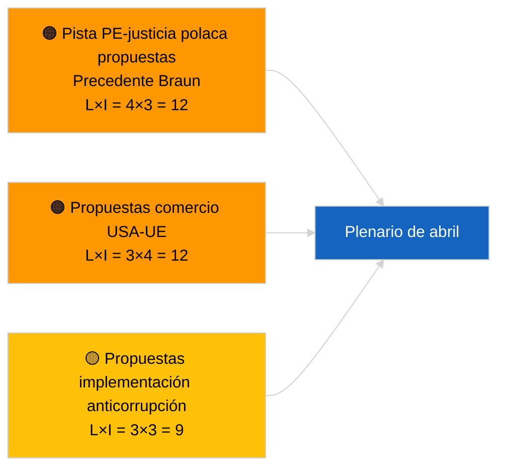
```mermaid
%%{init: {"theme":"dark"}}%%
graph LR
    R1["🟠 Pista PE-justicia polaca propuestas<br/>Precedente Braun<br/>L×I = 4×3 = 12"] --> CONS["Plenario de abril"]
    R2["🟠 Propuestas comercio USA-UE<br/>L×I = 3×4 = 12"] --> CONS
    R3["🟡 Propuestas implementación anticorrupción<br/>L×I = 3×3 = 9"] --> CONS
    style R1 fill:#FF9800,color:#000000
    style R2 fill:#FF9800,color:#000000
    style R3 fill:#FFC107,color:#000000
    style CONS fill:#1565C0,color:#FFFFFF
```

| Riesgo | L | I | Puntuación | Disparador | Fuente | Almirantazgo |
|--------|:-:|:-:|:----------:|------------|--------|:------------:|
| Pista PE-justicia polaca | 4 | 3 | 12 | Nuevo caso de inmunidad | TA-10-2026-0088 | A1 |
| Propuestas comercio USA-UE | 3 | 4 | 12 | Acción estadounidense | TA-10-2026-0096 | A1 |
| Propuestas de seguimiento anticorrupción | 3 | 3 | 9 | Fricción de transposición nacional | TA-10-2026-0094 | A2 |

---

### 🔮 Principal disparador prospectivo

**Primera ola de presentaciones de propuestas de resolución de abril ~17-20 de abril de 2026.** La mezcla temática calibra el escenario del plenario de abril.

---

### 🛡️ Evaluación de la calidad de las fuentes

- **Fuentes primarias:** Ejecución `ddaeac0a-0829-43fb-8588-46bf89f410a4`; el artículo hermano `breaking-2` confirma el estado de flujo DEGRADADO.
- **Nivel de confianza:** 🟢 ALTO en cuanto al motor del calendario.

---

### 📎 Enlaces

| Enlace | Ruta |
|--------|------|
| Artículo | `./article.md` |
| Artículos hermanos | `analysis/daily/2026-04-03/breaking/`, `breaking-2/`, `breaking-3/`, `committee-reports/`, `propositions/`, `week-ahead/` |
| Manifiesto | `./manifest.json` |

---

**Control del documento**
- **Plantilla:** `/analysis/templates/executive-brief.md`
- **Ruta del artefacto:** `analysis/daily/2026-04-03/motions/executive-brief.md`
- **Clasificación:** Público
- **Generación retrospectiva:** Sesión de relleno.

### Executive Brief Fi

### 🎯 BLUF

**Uusia päätöslauselmaesityksiä ei tehty 2.4.2026; istuntotauko viikko 2/4, HEIKENTYNYT syötetila vahvistettu rinnakkaisartikkelilla `breaking-2`.** Ajo `ddaeac0a-0829-43fb-8588-46bf89f410a4` palautti **"Kvantitatiivinen riskipisteytys 0 tunnistetun poliittisen dimension yli"** — nolla luokiteltua toimijaa, RUTIINITASOINEN merkitys. Huhtikuun ensimmäisiä päätöslauselmaesityksiä ei odoteta ennen ~17.–20. huhtikuuta. Maaliskuulta siirretyt päätöslauselmaesitykset hallitsevat huhtikuun seurantalistan: Georgian poliittiset vangit (TA-10-2026-0083), HDV-päästöhyvitykset (TA-10-2026-0084), Yhdysvaltojen tullit (TA-10-2026-0096), Braun-ennakkotapauksen immuniteettiasian jatko, korruptionvastainen toiminta (TA-10-2026-0094). **🟢 KORKEA luotettavuus** tyhjän tilan kalenteriperusteisesta ja syöttöhäiriöistä johtuvasta luonteesta.

---

### 🧭 3 Päätöstä, joita tämä katsaus tukee

| # | Päätös | Kuka päättää | Määräaika | Näyttö |
|:-:|--------|--------------|:---------:|--------|
| 1 | **Toimituksellinen:** OHITA päivittäiset päätöslauselmaesitykset | Toimittaja | +24h | Tyhjä ajo + HEIKENTYNEET syötteet |
| 2 | **Seuranta:** merkitse ensimmäinen huhtikuun päätöslauselmaesitysaalto 17.–20. huhtikuuta | Analyytikko | 2026-04-17 | EP:n esittämismalli |
| 3 | **Eteenpäinkatsova:** seuraa esitysten yhdistelmää Skenaariolle A (kauppa) vs B (oikeusvaltioperiaate) vs C (talous) | Analyysipäällikkö | 2026-04-20 | Täysistuntoa edeltävä kalibrointi |

---

### 📰 60 sekunnin lukeminen

- 🔴 **Uusia päätöslauselmaesityksiä ei tehty** 2.4.2026; istuntotauko. (🟢 Korkea)
- 🟠 **0 toimijaa luokiteltu**; mallin tila "Kvantitatiivinen riskipisteytys 0 tunnistetun poliittisen dimension yli". (🟢 Korkea)
- 🟢 **Maaliskuulta siirretyt esitykset** hallitsevat huhtikuun seurantalistaa. (🟢 Korkea)
- 🟡 **Kaikki riskin ulottuvuudet "ei mitään"** tänään. (🟢 Korkea)
- 🔵 **Taloudellinen konteksti:** Yhdysvaltojen tullivastatoimet ja korruptionvastainen täytäntöönpano hallitsevat. (🟢 Korkea)
- 🟣 **Ristiviittaus:** Rinnakkaisartikkeli `breaking-3` kattaa korruptionvastaiseen uudistukseen liittyvän kokonaisuuden, josta syntyy jatkoesityksiä huhtikuussa. (🟢 Korkea)
- 🩷 **Häiriötekijä:** ei akuuttia tänään. (🟢 Korkea)
- ⚪ **Eteenpäinkatsova:** Mercosur EUT:n lausunnon odotetaan laukaisevan päätöslauselmaesityksiä julkistamisen yhteydessä.

---

### 🗂️ Tärkeimmät asiakirjat / Menettelyt — Päätöslauselmaesitysten seuranta

| Sija | EP-viite | Otsikko (lyhyt) | Merkittävyys | Luotettavuus | Tila |
|:----:|----------|-----------------|:------------:|:------------:|------|
| 1 | — | Ei uusia päätöslauselmaesityksiä 2.4.2026 | 0.0 | 🟢 KORKEA | Istuntotauko + HEIKENTYNEET syötteet |
| 2 | TA-10-2026-0094 | Korruptionvastaisen direktiivin jatkoesitykset | 8.0 | 🟢 KORKEA | Hyväksytty 26. maaliskuuta |
| 3 | TA-10-2026-0083 | Georgian poliittiset vangit (siirretty) | 7.0 | 🟢 KORKEA | Täytäntöönpanoseuranta |

---

### ⚠️ Riski- ja uhkakatsaus

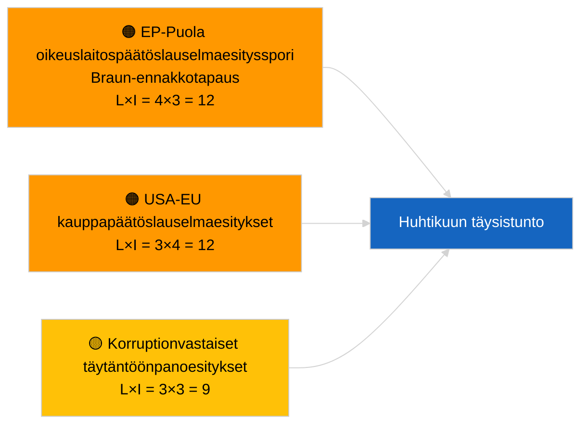
```mermaid
%%{init: {"theme":"dark"}}%%
graph LR
    R1["🟠 EP-Puola oikeuslaitospäätöslauselmaesitysspori<br/>Braun-ennakkotapaus<br/>L×I = 4×3 = 12"] --> CONS["Huhtikuun täysistunto"]
    R2["🟠 USA-EU kauppapäätöslauselmaesitykset<br/>L×I = 3×4 = 12"] --> CONS
    R3["🟡 Korruptionvastaiset täytäntöönpanoesitykset<br/>L×I = 3×3 = 9"] --> CONS
    style R1 fill:#FF9800,color:#000000
    style R2 fill:#FF9800,color:#000000
    style R3 fill:#FFC107,color:#000000
    style CONS fill:#1565C0,color:#FFFFFF
```

| Riski | L | I | Pisteet | Laukaisija | Lähde | Admiraliteetti |
|-------|:-:|:-:|:-------:|------------|-------|:--------------:|
| EP-Puola oikeuslaitospäätöslauselmaesitysspori | 4 | 3 | 12 | Uusi immuniteettiasian tapaus | TA-10-2026-0088 | A1 |
| USA-EU kauppapäätöslauselmaesitykset | 3 | 4 | 12 | Yhdysvaltojen toimenpide | TA-10-2026-0096 | A1 |
| Korruptionvastaisten jatkoesitysten seuranta | 3 | 3 | 9 | Kansallinen täytäntöönpanohankaus | TA-10-2026-0094 | A2 |

---

### 🔮 Tärkein eteenpäinkatsova laukaisija

**Ensimmäinen huhtikuun päätöslauselmaesitysaalto ~17.–20. huhtikuuta 2026.** Aiheyhdistelmä kalibroi huhtikuun täysistuntoskenaarion.

---

### 🛡️ Lähteiden laadun arviointi

- **Ensisijaiset lähteet:** Ajo `ddaeac0a-0829-43fb-8588-46bf89f410a4`; rinnakkaisartikkeli `breaking-2` vahvistaa HEIKENTYNEEN syötetilan.
- **Luotettavuus:** 🟢 KORKEA kalenterivaikuttimen osalta.

---

### 📎 Linkit

| Linkki | Polku |
|--------|-------|
| Artikkeli | `./article.md` |
| Rinnakkaisartikkelit | `analysis/daily/2026-04-03/breaking/`, `breaking-2/`, `breaking-3/`, `committee-reports/`, `propositions/`, `week-ahead/` |
| Manifesti | `./manifest.json` |

---

**Asiakirjan hallinta**
- **Malli:** `/analysis/templates/executive-brief.md`
- **Artefaktin polku:** `analysis/daily/2026-04-03/motions/executive-brief.md`
- **Luokitus:** Julkinen
- **Takautuva luonti:** Täydennysistunto.

### Executive Brief Fr

### 🎯 BLUF

**Aucune nouvelle proposition de résolution déposée le 2026-04-03 ; semaine de recess 2 sur 4, état de flux DÉGRADÉ confirmé par l'article jumeau `breaking-2`.** L'exécution `ddaeac0a-0829-43fb-8588-46bf89f410a4` a retourné **« Évaluation quantitative des risques sur 0 dimension politique identifiée »** — zéro acteur classifié, importance ROUTINIÈRE. Le premier dépôt de propositions de résolution d'avril n'est pas attendu avant le ~17-20 avril. L'inventaire des propositions reportées de mars domine la liste de surveillance d'avril : prisonniers politiques géorgiens (TA-10-2026-0083), crédits d'émissions HDV (TA-10-2026-0084), tarifs douaniers américains (TA-10-2026-0096), suivi immunité précédent Braun, anticorruption (TA-10-2026-0094). **🟢 CONFIANCE ÉLEVÉE** que l'état vide est lié au calendrier et à la dégradation des flux.

---

### 🧭 3 Décisions que cette note soutient

| # | Décision | Qui décide | Échéance | Preuve |
|:-:|----------|------------|:--------:|--------|
| 1 | **Éditorial :** PASSER les propositions de résolution quotidiennes | Rédacteur | +24h | Exécution vide + flux DÉGRADÉS |
| 2 | **Surveillance :** signaler la première vague de dépôts d'avril du 17 au 20 avril | Analyste | 2026-04-17 | Modèle de dépôt du PE |
| 3 | **Prospectif :** suivre le mélange de propositions pour le Scénario A (commerce) vs B (État de droit) vs C (économie) | Responsable analyse | 2026-04-20 | Calibrage avant plénière |

---

### 📰 Lecture en 60 secondes

- 🔴 **Aucune nouvelle proposition de résolution déposée** le 2026-04-03 ; recess. (🟢 Élevé)
- 🟠 **0 acteur classifié** ; état modèle « Évaluation quantitative des risques sur 0 dimension politique identifiée ». (🟢 Élevé)
- 🟢 **Propositions reportées de mars** dominent la liste de surveillance d'avril. (🟢 Élevé)
- 🟡 **Toutes les dimensions de risque « aucune »** aujourd'hui. (🟢 Élevé)
- 🔵 **Contexte économique :** Représailles tarifaires américaines et mise en œuvre anticorruption dominent. (🟢 Élevé)
- 🟣 **Référence croisée :** L'article jumeau `breaking-3` couvre le cluster de réforme anticorruption qui générera des propositions de suivi en avril. (🟢 Élevé)
- 🩷 **Vecteur de perturbation :** aucun actuel aujourd'hui. (🟢 Élevé)
- ⚪ **Prospectif :** L'avis CJE sur Mercosur devrait susciter des propositions lors de sa publication.

---

### 🗂️ Documents principaux / Procédures — Surveillance des propositions de résolution

| Rang | Référence PE | Titre (court) | Importance | Confiance | Statut |
|:----:|--------------|---------------|:----------:|:---------:|--------|
| 1 | — | Aucune nouvelle proposition de résolution 2026-04-03 | 0.0 | 🟢 ÉLEVÉ | Recess + flux DÉGRADÉS |
| 2 | TA-10-2026-0094 | Propositions de suivi de la directive anticorruption | 8.0 | 🟢 ÉLEVÉ | Adoptée le 26 mars |
| 3 | TA-10-2026-0083 | Prisonniers politiques géorgiens (reportée) | 7.0 | 🟢 ÉLEVÉ | Surveillance de la mise en œuvre |

---

### ⚠️ Aperçu des risques et menaces

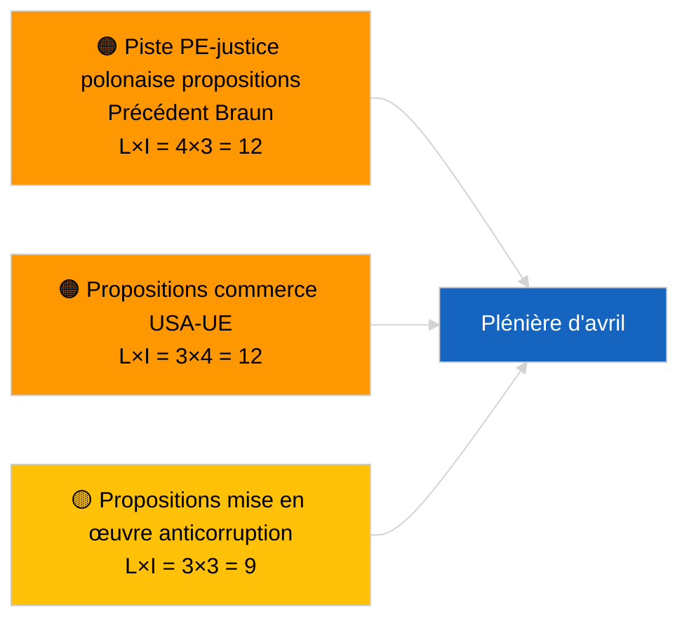
```mermaid
%%{init: {"theme":"dark"}}%%
graph LR
    R1["🟠 Piste PE-justice polonaise propositions<br/>Précédent Braun<br/>L×I = 4×3 = 12"] --> CONS["Plénière d'avril"]
    R2["🟠 Propositions commerce USA-UE<br/>L×I = 3×4 = 12"] --> CONS
    R3["🟡 Propositions mise en œuvre anticorruption<br/>L×I = 3×3 = 9"] --> CONS
    style R1 fill:#FF9800,color:#000000
    style R2 fill:#FF9800,color:#000000
    style R3 fill:#FFC107,color:#000000
    style CONS fill:#1565C0,color:#FFFFFF
```

| Risque | L | I | Score | Déclencheur | Source | Amirauté |
|--------|:-:|:-:|:-----:|-------------|--------|:--------:|
| Piste PE-justice polonaise | 4 | 3 | 12 | Nouveau cas d'immunité | TA-10-2026-0088 | A1 |
| Propositions commerce USA-UE | 3 | 4 | 12 | Action américaine | TA-10-2026-0096 | A1 |
| Propositions de suivi anticorruption | 3 | 3 | 9 | Friction nationale de transposition | TA-10-2026-0094 | A2 |

---

### 🔮 Principal déclencheur prospectif

**Première vague de dépôts de propositions de résolution d'avril ~17-20 avril 2026.** La composition thématique calibre le scénario de la plénière d'avril.

---

### 🛡️ Évaluation de la qualité des sources

- **Sources primaires :** Exécution `ddaeac0a-0829-43fb-8588-46bf89f410a4` ; l'article jumeau `breaking-2` confirme l'état de flux DÉGRADÉ.
- **Niveau de confiance :** 🟢 ÉLEVÉ concernant le facteur calendrier.

---

### 📎 Liens

| Lien | Chemin |
|------|--------|
| Article | `./article.md` |
| Articles jumeaux | `analysis/daily/2026-04-03/breaking/`, `breaking-2/`, `breaking-3/`, `committee-reports/`, `propositions/`, `week-ahead/` |
| Manifeste | `./manifest.json` |

---

**Contrôle du document**
- **Modèle :** `/analysis/templates/executive-brief.md`
- **Chemin de l'artefact :** `analysis/daily/2026-04-03/motions/executive-brief.md`
- **Classification :** Public
- **Génération rétrospective :** Session de remplissage rétroactif.

### Executive Brief He

**סיווג:** OSINT | רשומה פרלמנטרית ציבורית  
**רמת ביטחון:** 🟢 גבוה (הערכה מבנית בתקופת הפגרה, מצב API מושפל)  
**נוצר:** 2026-04-03T00:00:00Z (תמצית רטרוספקטיבית)  
**סוג מאמר:** הצעות החלטה  
**מזהה ריצה:** `ddaeac0a-0829-43fb-8588-46bf89f410a4`  
**מקור:** פורטל הנתונים הפתוח של הפרלמנט האירופי

---

### 🎯 BLUF

**לא הוגשו הצעות החלטה חדשות ב-2026-04-03; שבוע פגרה 2 מתוך 4, מצב הזנה מושפל אושר על ידי המאמר-אח `breaking-2`.** הריצה `ddaeac0a-0829-43fb-8588-46bf89f410a4` החזירה **"ניקוד סיכון כמותי על 0 ממדים פוליטיים שזוהו"** — אפס שחקנים מסווגים, חשיבות שגרתית. לא צפוי הגשה ראשונה של הצעות החלטה לאפריל לפני ~17-20 באפריל. מלאי ההצעות הנגרר ממרץ שולט ברשימת המעקב של אפריל: אסירים פוליטיים גאורגיים (TA-10-2026-0083), קרדיטים לפליטות HDV (TA-10-2026-0084), מכסי ארה"ב (TA-10-2026-0096), מעקב חסינות תקדים ברון, אנטי-שחיתות (TA-10-2026-0094). **🟢 ביטחון גבוה** שהמצב הריק נובע מלוח זמנים ושחיקת ההזנה.

---

### 🧭 3 החלטות שתמצית זו תומכת בהן

| # | החלטה | מי מחליט | מועד אחרון | ראיה |
|:-:|--------|-----------|:-----------:|------|
| 1 | **עריכה:** דלג על הצעות החלטה יומיות | עורך | +24 שעות | ריצה ריקה + הזנות מושפלות |
| 2 | **מעקב:** סמן את גל הגשת הצעות אפריל הראשון 17-20 באפריל | אנליסט | 2026-04-17 | דפוס הגשה של הפרלמנט האירופי |
| 3 | **צופה קדימה:** עקוב אחר תמהיל ההצעות לתרחיש א (סחר) מול ב (שלטון חוק) מול ג (כלכלה) | ראש אנליזה | 2026-04-20 | כיול לפני מליאה |

---

### 📰 קריאה של 60 שניות

- 🔴 **לא הוגשו הצעות החלטה חדשות** ב-2026-04-03; פגרה. (🟢 גבוה)
- 🟠 **0 שחקנים מסווגים**; מצב תבנית "ניקוד סיכון כמותי על 0 ממדים פוליטיים שזוהו". (🟢 גבוה)
- 🟢 **הצעות נגררות ממרץ** שולטות ברשימת המעקב של אפריל. (🟢 גבוה)
- 🟡 **כל ממדי הסיכון "אין"** היום. (🟢 גבוה)
- 🔵 **הקשר כלכלי:** גמול מכסי ארה"ב ויישום אנטי-שחיתות שולטים. (🟢 גבוה)
- 🟣 **הפניה צולבת:** המאמר-אח `breaking-3` מכסה את אשכול רפורמת האנטי-שחיתות שייצר הצעות המשך באפריל. (🟢 גבוה)
- 🩷 **וקטור שיבוש:** אין חריף היום. (🟢 גבוה)
- ⚪ **צופה קדימה:** חוות דעת בית המשפט האירופי בנושא מרקוסור צפויה לעורר הצעות עם פרסומה.

---

### 🗂️ מסמכים מובילים / הליכים — מעקב הצעות החלטה

| דירוג | אסמכתא פרלמנטרית | כותרת (קצרה) | חשיבות | ביטחון | סטטוס |
|:-----:|-------------------|--------------|:------:|:------:|-------|
| 1 | — | אין הצעות החלטה חדשות 2026-04-03 | 0.0 | 🟢 גבוה | פגרה + הזנות מושפלות |
| 2 | TA-10-2026-0094 | הצעות המשך לדירקטיבת אנטי-שחיתות | 8.0 | 🟢 גבוה | אומצה 26 במרץ |
| 3 | TA-10-2026-0083 | אסירים פוליטיים גאורגיים (נגרר) | 7.0 | 🟢 גבוה | מעקב יישום |

---

### ⚠️ תמונת סיכונים ואיומים

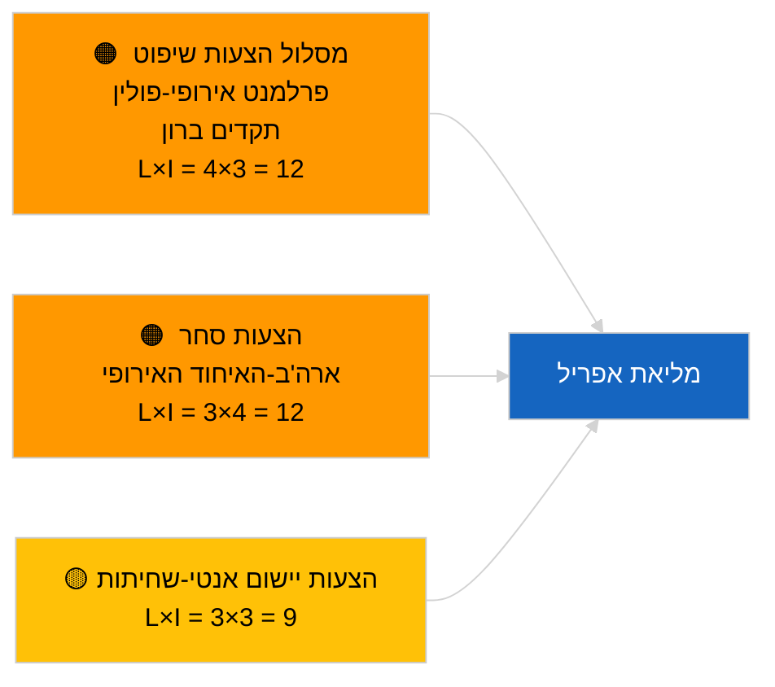
```mermaid
%%{init: {"theme":"dark"}}%%
graph LR
    R1["🟠 מסלול הצעות שיפוט פרלמנט אירופי-פולין<br/>תקדים ברון<br/>L×I = 4×3 = 12"] --> CONS["מליאת אפריל"]
    R2["🟠 הצעות סחר ארה'ב-האיחוד האירופי<br/>L×I = 3×4 = 12"] --> CONS
    R3["🟡 הצעות יישום אנטי-שחיתות<br/>L×I = 3×3 = 9"] --> CONS
    style R1 fill:#FF9800,color:#000000
    style R2 fill:#FF9800,color:#000000
    style R3 fill:#FFC107,color:#000000
    style CONS fill:#1565C0,color:#FFFFFF
```

| סיכון | L | I | ניקוד | טריגר | מקור | אדמירליות |
|-------|:-:|:-:|:-----:|--------|------|:---------:|
| מסלול שיפוט פרלמנט אירופי-פולין | 4 | 3 | 12 | תיק חסינות חדש | TA-10-2026-0088 | A1 |
| הצעות סחר ארה"ב-האיחוד האירופי | 3 | 4 | 12 | פעולה אמריקאית | TA-10-2026-0096 | A1 |
| הצעות המשך אנטי-שחיתות | 3 | 3 | 9 | חיכוך שילוב לאומי | TA-10-2026-0094 | A2 |

---

### 🔮 הטריגר הצופה-קדימה המוביל

**גל ראשון של הגשת הצעות החלטה לאפריל ~17-20 באפריל 2026.** תמהיל הנושאים מכייל את תרחיש מליאת אפריל.

---

### 🛡️ הערכת איכות מקורות

- **מקורות ראשוניים:** ריצה `ddaeac0a-0829-43fb-8588-46bf89f410a4`; המאמר-אח `breaking-2` מאשר מצב הזנה מושפל.
- **רמת ביטחון:** 🟢 גבוה לגבי מניע לוח הזמנים.

---

### 📎 קישורים

| קישור | נתיב |
|-------|------|
| מאמר | `./article.md` |
| מאמרים-אחים | `analysis/daily/2026-04-03/breaking/`, `breaking-2/`, `breaking-3/`, `committee-reports/`, `propositions/`, `week-ahead/` |
| מניפסט | `./manifest.json` |

---

**בקרת מסמכים**
- **תבנית:** `/analysis/templates/executive-brief.md`
- **נתיב פריט:** `analysis/daily/2026-04-03/motions/executive-brief.md`
- **סיווג:** ציבורי
- **יצירה רטרוספקטיבית:** ריצת מילוי לאחור.

### Executive Brief Ja

**分類：** OSINT | 公開議会記録  
**信頼度：** 🟢 高（休会期間の構造的評価、API 状態劣化）  
**作成日：** 2026-04-03T00:00:00Z（遡及ブリーフ）  
**記事種別：** 決議案  
**実行 ID：** `ddaeac0a-0829-43fb-8588-46bf89f410a4`  
**出典：** 欧州議会オープンデータポータル

---

### 🎯 BLUF

**2026-04-03 に新規決議案の提出なし；休会第 2 週（全 4 週）、姉妹記事 `breaking-2` により DEGRADED フィード状態を確認済み。** 実行 `ddaeac0a-0829-43fb-8588-46bf89f410a4` は **「0 件の政治的次元にわたる定量的リスクスコアリング」** を返却——分類済みアクターはゼロ、ROUTINE 重要度。4 月の決議案提出の第一波は 4 月 17〜20 日頃まで予想されない。3 月からの繰越決議案在庫が 4 月の監視リストを支配：ジョージアの政治囚（TA-10-2026-0083）、HDV 排出クレジット（TA-10-2026-0084）、米国関税（TA-10-2026-0096）、ブラウン先例の免責フォローアップ、汚職防止（TA-10-2026-0094）。**🟢 高信頼度** にて、空状態はカレンダーおよびフィード劣化によるものと判断。

---

### 🧭 このブリーフが支援する 3 つの意思決定

| # | 意思決定 | 決定者 | 期限 | 根拠 |
|:-:|----------|--------|:----:|------|
| 1 | **編集上：** 日次決議案をスキップ | 編集者 | +24h | 空実行 + DEGRADED フィード |
| 2 | **監視：** 4 月 17〜20 日の第一波決議案提出にフラグ設定 | アナリスト | 2026-04-17 | EP 提出パターン |
| 3 | **先読み：** シナリオ A（貿易）vs B（法の支配）vs C（経済）の提案構成をトラッキング | 分析リード | 2026-04-20 | 本会議前のキャリブレーション |

---

### 📰 60 秒で読む

- 🔴 **新規決議案の提出なし** 2026-04-03；休会中。（🟢 高）
- 🟠 **0 件のアクターを分類**；テンプレート状態「0 件の政治的次元にわたる定量的リスクスコアリング」。（🟢 高）
- 🟢 **3 月繰越提案**が 4 月監視リストを支配。（🟢 高）
- 🟡 **本日のリスク次元はすべて「なし」。**（🟢 高）
- 🔵 **経済的文脈：** 米国関税報復と汚職防止移行が中心課題。（🟢 高）
- 🟣 **相互参照：** 姉妹記事 `breaking-3` は 4 月にフォローアップ決議案を生む汚職防止改革クラスターを網羅。（🟢 高）
- 🩷 **混乱ベクトル：** 本日は急性なし。（🟢 高）
- ⚪ **先読み：** メルコスールの欧州司法裁判所意見書は公開時に決議案を引き起こす見込み。

---

### 🗂️ 主要文書 / 手続き — 決議案監視

| 順位 | EP 参照 | タイトル（短縮） | 重要度 | 信頼度 | 状態 |
|:---:|---------|-----------------|:------:|:------:|------|
| 1 | — | 2026-04-03 新規決議案なし | 0.0 | 🟢 HIGH | 休会 + DEGRADED フィード |
| 2 | TA-10-2026-0094 | 汚職防止指令フォローアップ決議案 | 8.0 | 🟢 HIGH | 3 月 26 日採択 |
| 3 | TA-10-2026-0083 | ジョージア政治囚（繰越） | 7.0 | 🟢 HIGH | 実施状況監視 |

---

### ⚠️ リスク・脅威スナップショット

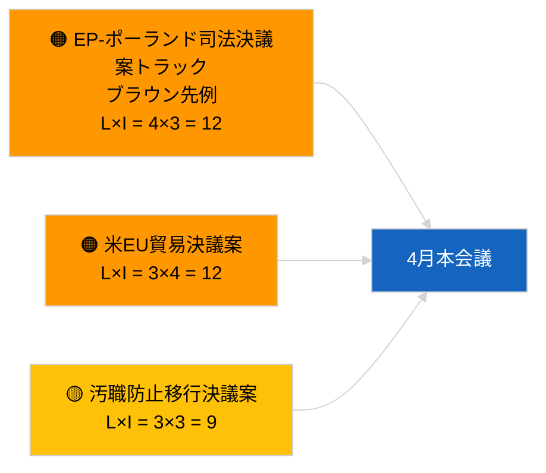
```mermaid
%%{init: {"theme":"dark"}}%%
graph LR
    R1["🟠 EP-ポーランド司法決議案トラック<br/>ブラウン先例<br/>L×I = 4×3 = 12"] --> CONS["4月本会議"]
    R2["🟠 米EU貿易決議案<br/>L×I = 3×4 = 12"] --> CONS
    R3["🟡 汚職防止移行決議案<br/>L×I = 3×3 = 9"] --> CONS
    style R1 fill:#FF9800,color:#000000
    style R2 fill:#FF9800,color:#000000
    style R3 fill:#FFC107,color:#000000
    style CONS fill:#1565C0,color:#FFFFFF
```

| リスク | L | I | スコア | トリガー | 出典 | 海軍評価 |
|--------|:-:|:-:|:------:|---------|------|:-------:|
| EP-ポーランド司法決議案トラック | 4 | 3 | 12 | 新規免責事案 | TA-10-2026-0088 | A1 |
| 米 EU 貿易決議案 | 3 | 4 | 12 | 米国の行動 | TA-10-2026-0096 | A1 |
| 汚職防止フォローアップ決議案 | 3 | 3 | 9 | 国内移行摩擦 | TA-10-2026-0094 | A2 |

---

### 🔮 最重要先読みトリガー

**4 月の決議案提出第一波 〜4 月 17〜20 日 2026 年。** テーマ構成が 4 月本会議シナリオを較正する。

---

### 🛡️ 情報源品質評価

- **一次情報源：** 実行 `ddaeac0a-0829-43fb-8588-46bf89f410a4`；姉妹記事 `breaking-2` が DEGRADED フィード状態を確認。
- **信頼度：** 🟢 HIGH（カレンダー要因について）。

---

### 📎 リンク

| リンク | パス |
|--------|------|
| 記事 | `./article.md` |
| 姉妹記事 | `analysis/daily/2026-04-03/breaking/`, `breaking-2/`, `breaking-3/`, `committee-reports/`, `propositions/`, `week-ahead/` |
| マニフェスト | `./manifest.json` |

---

**文書管理**
- **テンプレート：** `/analysis/templates/executive-brief.md`
- **成果物パス：** `analysis/daily/2026-04-03/motions/executive-brief.md`
- **分類：** 公開
- **遡及生成：** バックフィルセッション。

### Executive Brief Ko

**분류:** OSINT | 공개 의회 기록  
**신뢰도:** 🟢 높음 (휴회 기간 구조적 평가, API 상태 저하)  
**작성일:** 2026-04-03T00:00:00Z (소급 브리핑)  
**기사 유형:** 결의안  
**실행 ID:** `ddaeac0a-0829-43fb-8588-46bf89f410a4`  
**출처:** 유럽의회 공개 데이터 포털

---

### 🎯 BLUF

**2026-04-03에 새로운 결의안 없음; 휴회 2주차(전체 4주), 자매 기사 `breaking-2`에 의해 저하된 피드 상태 확인됨.** 실행 `ddaeac0a-0829-43fb-8588-46bf89f410a4`는 **"0개의 식별된 정치적 차원에 걸친 정량적 위험 점수화"** 를 반환했습니다 — 분류된 행위자 없음, 일상적 중요도. 4월 첫 결의안 제출은 ~4월 17-20일 이전에는 예상되지 않습니다. 3월에서 이월된 결의안 재고가 4월 감시 목록을 지배합니다: 조지아 정치범 (TA-10-2026-0083), HDV 배출 크레딧 (TA-10-2026-0084), 미국 관세 (TA-10-2026-0096), 브라운 선례 면책 후속, 반부패 (TA-10-2026-0094). **🟢 높은 신뢰도** 로 공백 상태는 일정 및 피드 저하에 기인합니다.

---

### 🧭 이 브리핑이 지원하는 3가지 결정

| # | 결정 | 결정자 | 마감 | 근거 |
|:-:|------|--------|:----:|------|
| 1 | **편집:** 일일 결의안 건너뛰기 | 편집자 | +24시간 | 빈 실행 + 저하된 피드 |
| 2 | **모니터링:** 4월 17-20일 첫 번째 결의안 제출 물결 플래그 설정 | 분석가 | 2026-04-17 | EP 제출 패턴 |
| 3 | **선행 감시:** 시나리오 A(무역) vs B(법치주의) vs C(경제)에 대한 제안 구성 추적 | 분석 책임자 | 2026-04-20 | 본회의 전 보정 |

---

### 📰 60초 요약

- 🔴 **새로운 결의안 제출 없음** 2026-04-03; 휴회. (🟢 높음)
- 🟠 **0명의 행위자 분류**; 템플릿 상태 "0개의 식별된 정치적 차원에 걸친 정량적 위험 점수화". (🟢 높음)
- 🟢 **3월 이월 제안**이 4월 감시 목록 지배. (🟢 높음)
- 🟡 **오늘 모든 위험 차원 "없음".** (🟢 높음)
- 🔵 **경제적 맥락:** 미국 관세 보복과 반부패 이행이 지배. (🟢 높음)
- 🟣 **교차 참조:** 자매 기사 `breaking-3`은 4월에 후속 결의안을 생성할 반부패 개혁 클러스터를 다룸. (🟢 높음)
- 🩷 **혼란 벡터:** 오늘은 급박한 것 없음. (🟢 높음)
- ⚪ **선행 감시:** 메르코수르에 대한 유럽사법재판소 의견이 발표 시 결의안을 유발할 것으로 예상.

---

### 🗂️ 주요 문서 / 절차 — 결의안 감시

| 순위 | EP 참조 | 제목(약식) | 중요도 | 신뢰도 | 상태 |
|:---:|---------|-----------|:------:|:------:|------|
| 1 | — | 2026-04-03 새로운 결의안 없음 | 0.0 | 🟢 HIGH | 휴회 + 저하된 피드 |
| 2 | TA-10-2026-0094 | 반부패 지침 후속 결의안 | 8.0 | 🟢 HIGH | 3월 26일 채택 |
| 3 | TA-10-2026-0083 | 조지아 정치범 (이월) | 7.0 | 🟢 HIGH | 이행 모니터링 |

---

### ⚠️ 위험 및 위협 스냅샷

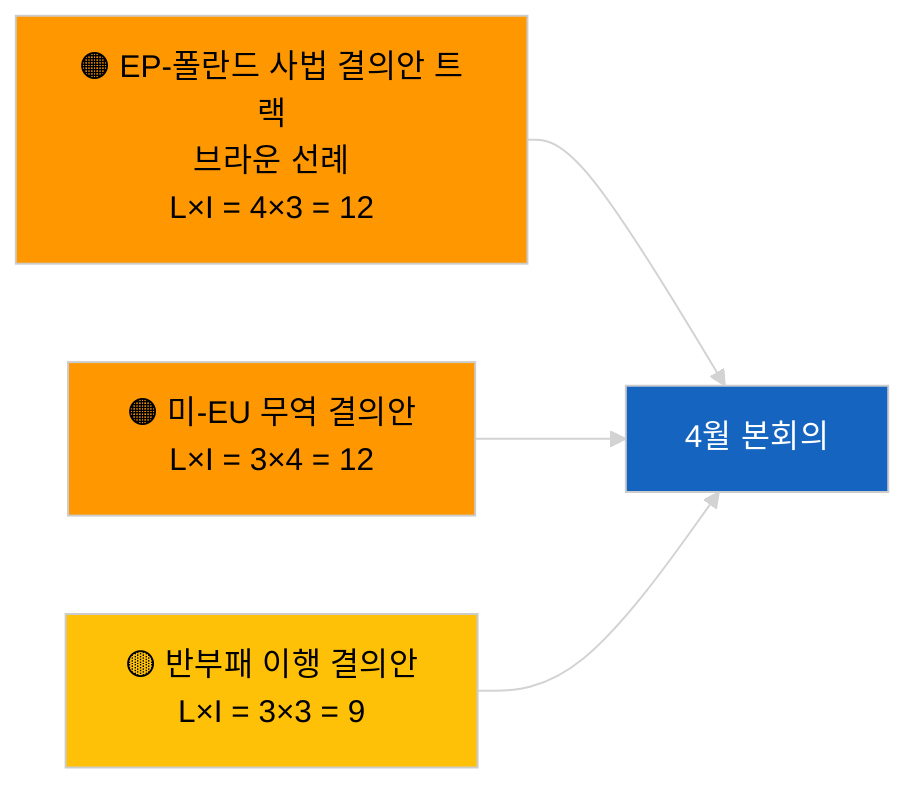
```mermaid
%%{init: {"theme":"dark"}}%%
graph LR
    R1["🟠 EP-폴란드 사법 결의안 트랙<br/>브라운 선례<br/>L×I = 4×3 = 12"] --> CONS["4월 본회의"]
    R2["🟠 미-EU 무역 결의안<br/>L×I = 3×4 = 12"] --> CONS
    R3["🟡 반부패 이행 결의안<br/>L×I = 3×3 = 9"] --> CONS
    style R1 fill:#FF9800,color:#000000
    style R2 fill:#FF9800,color:#000000
    style R3 fill:#FFC107,color:#000000
    style CONS fill:#1565C0,color:#FFFFFF
```

| 위험 | L | I | 점수 | 트리거 | 출처 | 해군 등급 |
|------|:-:|:-:|:----:|--------|------|:--------:|
| EP-폴란드 사법 결의안 트랙 | 4 | 3 | 12 | 새로운 면책 사례 | TA-10-2026-0088 | A1 |
| 미-EU 무역 결의안 | 3 | 4 | 12 | 미국 조치 | TA-10-2026-0096 | A1 |
| 반부패 후속 결의안 | 3 | 3 | 9 | 국내 전치 마찰 | TA-10-2026-0094 | A2 |

---

### 🔮 주요 선행 트리거

**4월 결의안 제출 첫 번째 물결 ~2026년 4월 17-20일.** 주제 구성이 4월 본회의 시나리오를 보정합니다.

---

### 🛡️ 정보 출처 품질 평가

- **1차 출처:** 실행 `ddaeac0a-0829-43fb-8588-46bf89f410a4`; 자매 기사 `breaking-2`가 저하된 피드 상태 확인.
- **신뢰도:** 🟢 HIGH (일정 요인에 대해).

---

### 📎 링크

| 링크 | 경로 |
|------|------|
| 기사 | `./article.md` |
| 자매 기사 | `analysis/daily/2026-04-03/breaking/`, `breaking-2/`, `breaking-3/`, `committee-reports/`, `propositions/`, `week-ahead/` |
| 매니페스트 | `./manifest.json` |

---

**문서 관리**
- **템플릿:** `/analysis/templates/executive-brief.md`
- **산출물 경로:** `analysis/daily/2026-04-03/motions/executive-brief.md`
- **분류:** 공개
- **소급 생성:** 백필 세션.

### Executive Brief Nl

### 🎯 BLUF

**Geen nieuwe resolutievoorstellen ingediend op 2026-04-03; recessweek 2 van 4, GEDEGRADEERDE feedstatus bevestigd door zusterartikel `breaking-2`.** Uitvoering `ddaeac0a-0829-43fb-8588-46bf89f410a4` retourneerde **"Kwantitatieve risicobeoordeling over 0 geïdentificeerde politieke dimensies"** — nul geclassificeerde actoren, ROUTINEMATIGE betekenis. Eerste indiening van resolutievoorstellen in april wordt niet verwacht vóór ~17-20 april. De overgedragen resolutievoorstellen uit maart domineren de april-bewakingslijst: Georgische politieke gevangenen (TA-10-2026-0083), HDV-emissiekredieten (TA-10-2026-0084), Amerikaanse douanetarieven (TA-10-2026-0096), Braun-precedent immuniteitsnazorg, antikorruptie (TA-10-2026-0094). **🟢 HOOG betrouwbaarheidsniveau** dat de lege status kalender- en feed-degradatiegerelateerd is.

---

### 🧭 3 Beslissingen die deze briefing ondersteunt

| # | Beslissing | Wie beslist | Deadline | Bewijs |
|:-:|------------|-------------|:--------:|--------|
| 1 | **Redactioneel:** Dagelijkse resolutievoorstellen OVERSLAAN | Redacteur | +24u | Lege uitvoering + GEDEGRADEERDE feeds |
| 2 | **Monitoring:** Eerste golf van april-indieningsresolutievoorstellen 17–20 april markeren | Analist | 2026-04-17 | Indieningspatroon EP |
| 3 | **Vooruitblikkend:** Voorstelmenging volgen voor Scenario A (handel) vs B (rechtsstaat) vs C (economie) | Analyseleider | 2026-04-20 | Kalibrering voor plenaire |

---

### 📰 Lezing van 60 seconden

- 🔴 **Geen nieuwe resolutievoorstellen ingediend** op 2026-04-03; reces. (🟢 Hoog)
- 🟠 **0 actoren geclassificeerd**; sjabloonstatus "Kwantitatieve risicobeoordeling over 0 geïdentificeerde politieke dimensies". (🟢 Hoog)
- 🟢 **Overgedragen voorstellen uit maart** domineren de april-bewakingslijst. (🟢 Hoog)
- 🟡 **Alle risicodynamieken "geen"** vandaag. (🟢 Hoog)
- 🔵 **Economische context:** Amerikaanse handelsvergeldingstarieven en antikorruptie-implementatie domineren. (🟢 Hoog)
- 🟣 **Kruisverwijzing:** Zusterartikel `breaking-3` behandelt het antikorruptie-hervormingscluster dat in april vervolgresolutievoorstellen genereert. (🟢 Hoog)
- 🩷 **Verstoringsvektor:** geen acuut vandaag. (🟢 Hoog)
- ⚪ **Vooruitblikkend:** Mercosur HvJ-advies zal naar verwachting resolutievoorstellen uitlokken bij publicatie.

---

### 🗂️ Topdocumenten / Procedures — Resolutievoorstellen-bewaking

| Rang | EP-referentie | Titel (kort) | Betekenis | Betrouwbaarheid | Status |
|:----:|---------------|--------------|:---------:|:---------------:|--------|
| 1 | — | Geen nieuwe resolutievoorstellen 2026-04-03 | 0.0 | 🟢 HOOG | Reces + GEDEGRADEERDE feeds |
| 2 | TA-10-2026-0094 | Vervolgresolutievoorstellen antikorruptierichtlijn | 8.0 | 🟢 HOOG | Aangenomen 26 maart |
| 3 | TA-10-2026-0083 | Georgische politieke gevangenen (overgedragen) | 7.0 | 🟢 HOOG | Implementatiebewaking |

---

### ⚠️ Risico- en dreigingsoverzicht

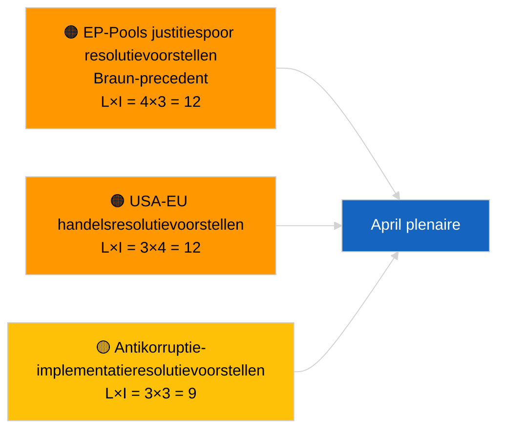
```mermaid
%%{init: {"theme":"dark"}}%%
graph LR
    R1["🟠 EP-Pools justitiespoor resolutievoorstellen<br/>Braun-precedent<br/>L×I = 4×3 = 12"] --> CONS["April plenaire"]
    R2["🟠 USA-EU handelsresolutievoorstellen<br/>L×I = 3×4 = 12"] --> CONS
    R3["🟡 Antikorruptie-implementatieresolutievoorstellen<br/>L×I = 3×3 = 9"] --> CONS
    style R1 fill:#FF9800,color:#000000
    style R2 fill:#FF9800,color:#000000
    style R3 fill:#FFC107,color:#000000
    style CONS fill:#1565C0,color:#FFFFFF
```

| Risico | L | I | Score | Trigger | Bron | Admiraliteit |
|--------|:-:|:-:|:-----:|---------|------|:------------:|
| EP-Pools justitiespoor | 4 | 3 | 12 | Nieuwe immuniteitszaak | TA-10-2026-0088 | A1 |
| USA-EU handelsresolutievoorstellen | 3 | 4 | 12 | Amerikaanse actie | TA-10-2026-0096 | A1 |
| Antikorruptie vervolgresolutievoorstellen | 3 | 3 | 9 | Nationale transpostiefrictie | TA-10-2026-0094 | A2 |

---

### 🔮 Voornaamste vooruitblikkende trigger

**Eerste april-indieningsgolf van resolutievoorstellen ~17-20 april 2026.** Themenmenging kalibreeert het april-plenaire scenario.

---

### 🛡️ Beoordeling van bronkwaliteit

- **Primaire bronnen:** Uitvoering `ddaeac0a-0829-43fb-8588-46bf89f410a4`; zusterartikel `breaking-2` bevestigt GEDEGRADEERDE feedstatus.
- **Betrouwbaarheidsniveau:** 🟢 HOOG betreffende de kalenderdriver.

---

### 📎 Links

| Link | Pad |
|------|-----|
| Artikel | `./article.md` |
| Zusterartikelen | `analysis/daily/2026-04-03/breaking/`, `breaking-2/`, `breaking-3/`, `committee-reports/`, `propositions/`, `week-ahead/` |
| Manifest | `./manifest.json` |

---

**Documentbeheer**
- **Sjabloon:** `/analysis/templates/executive-brief.md`
- **Artefactpad:** `analysis/daily/2026-04-03/motions/executive-brief.md`
- **Classificatie:** Openbaar
- **Retrospectieve generatie:** Backfill-sessie.

### Executive Brief No

### 🎯 BLUF

**Ingen nye resolusjonsforslag fremmet 2026-04-03; resesseuke 2 av 4, DEGRADERT feedtilstand bekreftet av søskenartikkel `breaking-2`.** Kjøring `ddaeac0a-0829-43fb-8588-46bf89f410a4` returnerte **"Kvantitativ risikovurdering over 0 identifiserte politiske dimensjoner"** — null klassifiserte aktører, RUTINEMESSIG betydning. Første april-innlevering av resolusjonsforslag forventes ikke før ~17-20 april. Mars-overførte resolusjonsforslagsbeholdning dominerer april-overvåkingslisten: Georgias politiske fanger (TA-10-2026-0083), HDV-utslippskreditter (TA-10-2026-0084), amerikanske toldsatser (TA-10-2026-0096), Braun-presedens immunitetsoppfølging, antikorrupsjon (TA-10-2026-0094). **🟢 HØY konfidensnivå** at tom tilstand skyldes kalender- og feed-degradering.

---

### 🧭 3 Beslutninger dette sammendraget støtter

| # | Beslutning | Hvem bestemmer | Frist | Bevis |
|:-:|------------|----------------|:-----:|-------|
| 1 | **Redaksjonelt:** HOPP OVER daglige resolusjonsforslag | Redaktør | +24t | Tom kjøring + DEGRADERTE feeder |
| 2 | **Overvåking:** merk første april-resolusjonsforslagsbølge 17–20 april | Analytiker | 2026-04-17 | EPs innleveringsmønster |
| 3 | **Fremtidsrettet:** spor forslagsblanding for Scenario A (handel) vs B (rettsstat) vs C (økonomi) | Analyseleder | 2026-04-20 | Kalibrering før plenum |

---

### 📰 60-sekunders lesning

- 🔴 **Ingen nye resolusjonsforslag fremmet** 2026-04-03; resess. (🟢 Høy)
- 🟠 **0 aktører klassifisert**; maltilstand "Kvantitativ risikovurdering over 0 identifiserte politiske dimensjoner". (🟢 Høy)
- 🟢 **Mars-overføringsforslag** dominerer april-overvåkingslisten. (🟢 Høy)
- 🟡 **Alle risikodimensjoner "ingen"** i dag. (🟢 Høy)
- 🔵 **Økonomisk kontekst:** Amerikansk tollgjengjeldelse og antikorrupsjonsimplementering dominerer. (🟢 Høy)
- 🟣 **Kryssreferanse:** Søskenartikkelen `breaking-3` dekker antikorrupsjonsreformklyngen som vil generere oppfølgende resolusjonsforslag i april. (🟢 Høy)
- 🩷 **Forstyrrelsesvektor:** ingen akutt i dag. (🟢 Høy)
- ⚪ **Fremtidsrettet:** Mercosur ECJ-uttalelse ventes å utløse resolusjonsforslag ved publisering.

---

### 🗂️ Topdokumenter / Prosedyrer — Resolusjonsforslagsovervåking

| Rang | EP-referanse | Tittel (kort) | Betydning | Konfidensnivå | Status |
|:----:|--------------|---------------|:---------:|:-------------:|--------|
| 1 | — | Ingen nye resolusjonsforslag 2026-04-03 | 0.0 | 🟢 HØY | Resess + DEGRADERTE feeder |
| 2 | TA-10-2026-0094 | Antikorrupsjonsdirektivets oppfølgingsresolusjonsforslag | 8.0 | 🟢 HØY | Vedtatt 26. mars |
| 3 | TA-10-2026-0083 | Georgias politiske fanger (overføring) | 7.0 | 🟢 HØY | Implementeringsovervåking |

---

### ⚠️ Risiko- og trusseloversikt

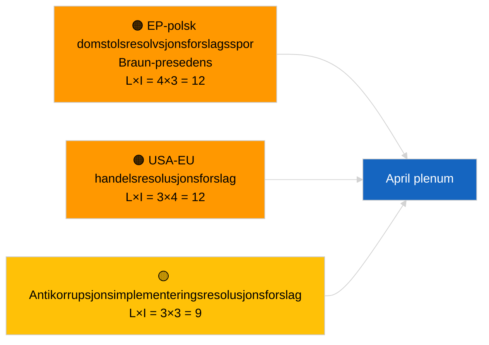
```mermaid
%%{init: {"theme":"dark"}}%%
graph LR
    R1["🟠 EP-polsk domstolsresolvsjonsforslagsspor<br/>Braun-presedens<br/>L×I = 4×3 = 12"] --> CONS["April plenum"]
    R2["🟠 USA-EU handelsresolusjonsforslag<br/>L×I = 3×4 = 12"] --> CONS
    R3["🟡 Antikorrupsjonsimplementeringsresolusjonsforslag<br/>L×I = 3×3 = 9"] --> CONS
    style R1 fill:#FF9800,color:#000000
    style R2 fill:#FF9800,color:#000000
    style R3 fill:#FFC107,color:#000000
    style CONS fill:#1565C0,color:#FFFFFF
```

| Risiko | L | I | Poeng | Utløser | Kilde | Admiralitet |
|--------|:-:|:-:|:-----:|---------|-------|:-----------:|
| EP-polsk domstolsresolvsjonsforslagsspor | 4 | 3 | 12 | Ny immunitetssak | TA-10-2026-0088 | A1 |
| USA-EU handelsresolusjonsforslag | 3 | 4 | 12 | Amerikansk handling | TA-10-2026-0096 | A1 |
| Antikorrupsjonsoppfølgingsresolusjonsforslag | 3 | 3 | 9 | Nasjonal implementeringsfriksjon | TA-10-2026-0094 | A2 |

---

### 🔮 Fremste fremtidsrettede utløser

**Første april-resolusjonsforslagsbølge ~17–20 april 2026.** Emneblanding kalibrerer april-plenarscenario.

---

### 🛡️ Vurdering av kildekvalitet

- **Primærkilder:** Kjøring `ddaeac0a-0829-43fb-8588-46bf89f410a4`; søskenartikkelen `breaking-2` bekrefter DEGRADERT feedtilstand.
- **Konfidensnivå:** 🟢 HØY vedrørende kalenderdriver.

---

### 📎 Lenker

| Lenke | Sti |
|-------|-----|
| Artikkel | `./article.md` |
| Søskenartikler | `analysis/daily/2026-04-03/breaking/`, `breaking-2/`, `breaking-3/`, `committee-reports/`, `propositions/`, `week-ahead/` |
| Manifest | `./manifest.json` |

---

**Dokumentkontroll**
- **Mal:** `/analysis/templates/executive-brief.md`
- **Artefaktsti:** `analysis/daily/2026-04-03/motions/executive-brief.md`
- **Klassifisering:** Offentlig
- **Retrospektiv generering:** Tilbakefyllingssesjon.

### Executive Brief Sv

### 🎯 BLUF

**Inga nya resolutioner lades fram 2026-04-03; recessvecka 2 av 4, DEGRADERAT flödestillstånd bekräftat av syskonartikel `breaking-2`.** Körning `ddaeac0a-0829-43fb-8588-46bf89f410a4` returnerade **"Kvantitativ riskbedömning över 0 identifierade politiska dimensioner"** — noll klassificerade aktörer, RUTINMÄSSIG betydelse. Första april-tabling av resolutioner förväntas inte förrän ~17-20 april. Mars-resolutioners överfört inventarium dominerar april-bevakningslistan: Georgiens politiska fångar (TA-10-2026-0083), HDV-utsläppskrediter (TA-10-2026-0084), USA:s tullar (TA-10-2026-0096), Braun-prejudikatets immunitetsuppföljning, antikorruption (TA-10-2026-0094). **🟢 HÖG konfidensgrad** att tomt tillstånd beror på kalender- och flödesnedgradering.

---

### 🧭 3 Beslut som denna sammanfattning stöder

| # | Beslut | Vem beslutar | Tidsgräns | Bevis |
|:-:|--------|--------------|:---------:|-------|
| 1 | **Redaktionellt:** HOPPA ÖVER dagliga resolutioner | Redaktör | +24h | Tom körning + DEGRADERADE flöden |
| 2 | **Bevakning:** markera första april-resolutionsvågen 17–20 april | Analytiker | 2026-04-17 | EP:s tablingsmönster |
| 3 | **Framåtblickande:** spåra resolutionsmix för Scenario A (handel) vs B (rättsstat) vs C (ekonomi) | Analysledare | 2026-04-20 | Kalibrering inför plenum |

---

### 📰 60-sekunders läsning

- 🔴 **Inga nya resolutioner lagda** den 2026-04-03; recess. (🟢 Hög)
- 🟠 **0 aktörer klassificerade**; mallstatus "Kvantitativ riskbedömning över 0 identifierade politiska dimensioner". (🟢 Hög)
- 🟢 **Mars-resolutioner i överföring** dominerar april-bevakningslistan. (🟢 Hög)
- 🟡 **Alla riskdimensioner "inga"** idag. (🟢 Hög)
- 🔵 **Ekonomisk kontext:** USA:s tullretaliering och antikorruptionsimplementering dominerar. (🟢 Hög)
- 🟣 **Korsreferens:** Syskonartikeln `breaking-3` täcker antikorruptionsreformklustret som genererar uppföljningsresolutioner i april. (🟢 Hög)
- 🩷 **Störningsfaktor:** ingen akut idag. (🟢 Hög)
- ⚪ **Framåtfört:** Mercosur ECJ-yttrande väntas utlösa resolutioner vid publicering.

---

### 🗂️ Toppdokument / Förfaranden — Resolutionsbevakning

| Rang | EP-referens | Titel (kort) | Betydelse | Konfidensgrad | Status |
|:----:|-------------|--------------|:---------:|:-------------:|--------|
| 1 | — | Inga nya resolutioner 2026-04-03 | 0.0 | 🟢 HÖG | Recess + DEGRADERADE flöden |
| 2 | TA-10-2026-0094 | Antikorruptionsdirektivets uppföljningsresolutioner | 8.0 | 🟢 HÖG | Antagen 26 mars |
| 3 | TA-10-2026-0083 | Georgiens politiska fångar (överfört) | 7.0 | 🟢 HÖG | Implementeringsbevakning |

---

### ⚠️ Risk- och hotöversikt

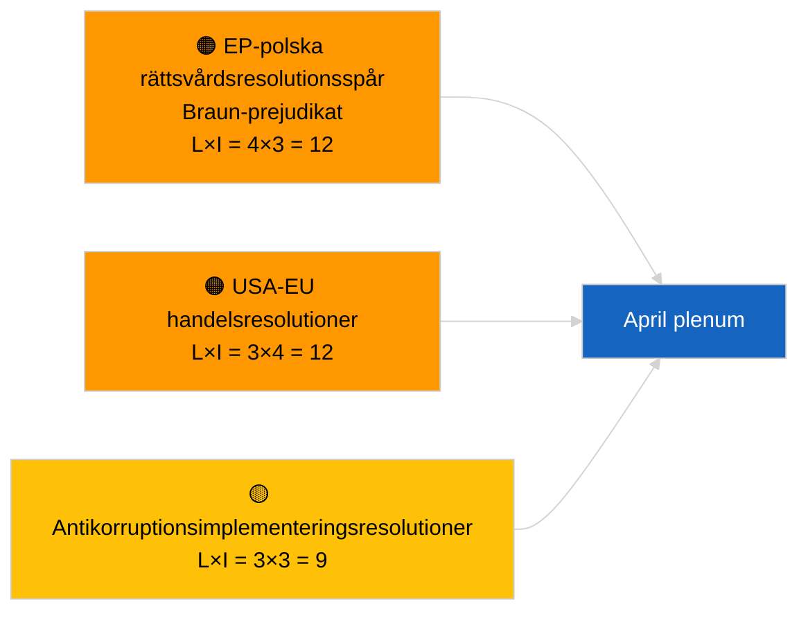
```mermaid
%%{init: {"theme":"dark"}}%%
graph LR
    R1["🟠 EP-polska rättsvårdsresolutionsspår<br/>Braun-prejudikat<br/>L×I = 4×3 = 12"] --> CONS["April plenum"]
    R2["🟠 USA-EU handelsresolutioner<br/>L×I = 3×4 = 12"] --> CONS
    R3["🟡 Antikorruptionsimplementeringsresolutioner<br/>L×I = 3×3 = 9"] --> CONS
    style R1 fill:#FF9800,color:#000000
    style R2 fill:#FF9800,color:#000000
    style R3 fill:#FFC107,color:#000000
    style CONS fill:#1565C0,color:#FFFFFF
```

| Risk | L | I | Poäng | Utlösare | Källa | Admiralitet |
|------|:-:|:-:|:-----:|----------|-------|:-----------:|
| EP-polska rättsvårdsresolutionsspår | 4 | 3 | 12 | Nytt immunitetsärende | TA-10-2026-0088 | A1 |
| USA-EU handelsresolutioner | 3 | 4 | 12 | USA:s åtgärd | TA-10-2026-0096 | A1 |
| Antikorruptionsuppföljningsresolutioner | 3 | 3 | 9 | Nationell implementeringsfrikt | TA-10-2026-0094 | A2 |

---

### 🔮 Främsta framåtblickande utlösare

**Första april-resolutionsvågen ~17–20 april 2026.** Ämnesfördelningen kalibrerar april-plenarscenario.

---

### 🛡️ Bedömning av källkvalitet

- **Primärkällor:** Körning `ddaeac0a-0829-43fb-8588-46bf89f410a4`; syskonartikeln `breaking-2` bekräftar DEGRADERAT flödestillstånd.
- **Konfidensgrad:** 🟢 HÖG beträffande kalenderdrivaren.

---

### 📎 Länkar

| Länk | Sökväg |
|------|--------|
| Artikel | `./article.md` |
| Syskonartikel | `analysis/daily/2026-04-03/breaking/`, `breaking-2/`, `breaking-3/`, `committee-reports/`, `propositions/`, `week-ahead/` |
| Manifest | `./manifest.json` |

---

**Dokumentkontroll**
- **Mall:** `/analysis/templates/executive-brief.md`
- **Artefaktsökväg:** `analysis/daily/2026-04-03/motions/executive-brief.md`
- **Klassificering:** Offentlig
- **Retroaktiv generering:** Bakåtfyllningssession.

### Executive Brief Zh

**分类：** OSINT | 公开议会档案  
**置信度：** 🟢 高（休会期结构性评估，API状态降级）  
**生成日期：** 2026-04-03T00:00:00Z（回溯性简报）  
**文章类型：** 决议动议  
**运行ID：** `ddaeac0a-0829-43fb-8588-46bf89f410a4`  
**数据来源：** 欧洲议会开放数据门户

---

### 🎯 BLUF

**2026-04-03无新决议动议提交；休会第2周（共4周），姊妹文章`breaking-2`确认数据馈送状态降级。** 运行`ddaeac0a-0829-43fb-8588-46bf89f410a4`返回**"0个已识别政治维度的定量风险评分"**——零个分类参与者，例行重要性。首批4月决议动议预计最早在4月17-20日左右提交。3月结转的决议动议库存主导4月监控名单：格鲁吉亚政治犯（TA-10-2026-0083）、HDV排放信用（TA-10-2026-0084）、美国关税（TA-10-2026-0096）、布劳恩先例豁免后续、反腐败（TA-10-2026-0094）。**🟢 高置信度**：空白状态由日历安排和数据馈送降级驱动。

---

### 🧭 本简报支持的3项决策

| # | 决策 | 决策者 | 截止时间 | 依据 |
|:-:|------|--------|:--------:|------|
| 1 | **编辑：** 跳过每日决议动议 | 编辑 | +24小时 | 空白运行 + 降级馈送 |
| 2 | **监控：** 标记4月17-20日首批4月动议提交浪潮 | 分析师 | 2026-04-17 | 欧洲议会提交规律 |
| 3 | **前瞻性：** 追踪情景A（贸易）vs B（法治）vs C（经济）的提案构成 | 分析负责人 | 2026-04-20 | 全体会议前校准 |

---

### 📰 60秒速览

- 🔴 **2026-04-03无新决议动议提交**；休会期。（🟢 高）
- 🟠 **0个参与者分类**；模板状态"0个已识别政治维度的定量风险评分"。（🟢 高）
- 🟢 **3月结转动议**主导4月监控名单。（🟢 高）
- 🟡 **今日所有风险维度均为"无"。**（🟢 高）
- 🔵 **经济背景：** 美国关税报复与反腐败立法落地主导议程。（🟢 高）
- 🟣 **交叉参考：** 姊妹文章`breaking-3`涵盖将在4月产生后续决议动议的反腐改革集群。（🟢 高）
- 🩷 **破坏性因素：** 今日无紧急情况。（🟢 高）
- ⚪ **前瞻性：** 梅卡多南方欧盟法院意见预计在发布时引发决议动议。

---

### 🗂️ 重点文件 / 程序 — 决议动议监控

| 排名 | 欧洲议会参考 | 标题（简短） | 重要性 | 置信度 | 状态 |
|:---:|-------------|------------|:------:|:------:|------|
| 1 | — | 2026-04-03无新决议动议 | 0.0 | 🟢 HIGH | 休会 + 降级馈送 |
| 2 | TA-10-2026-0094 | 反腐败指令后续动议 | 8.0 | 🟢 HIGH | 3月26日通过 |
| 3 | TA-10-2026-0083 | 格鲁吉亚政治犯（结转） | 7.0 | 🟢 HIGH | 实施监控 |

---

### ⚠️ 风险与威胁快照

```mermaid
%%{init: {"theme":"dark"}}%%
graph LR
    R1["🟠 欧洲议会-波兰司法动议轨迹<br/>布劳恩先例<br/>L×I = 4×3 = 12"] --> CONS["4月全体会议"]
    R2["🟠 美欧贸易决议动议<br/>L×I = 3×4 = 12"] --> CONS
    R3["🟡 反腐败落地决议动议<br/>L×I = 3×3 = 9"] --> CONS
    style R1 fill:#FF9800,color:#000000
    style R2 fill:#FF9800,color:#000000
    style R3 fill:#FFC107,color:#000000
    style CONS fill:#1565C0,color:#FFFFFF
```

| 风险 | L | I | 评分 | 触发因素 | 来源 | 海军评级 |
|------|:-:|:-:|:---:|---------|------|:-------:|
| 欧洲议会-波兰司法动议轨迹 | 4 | 3 | 12 | 新豁免案件 | TA-10-2026-0088 | A1 |
| 美欧贸易决议动议 | 3 | 4 | 12 | 美方行动 | TA-10-2026-0096 | A1 |
| 反腐败后续动议 | 3 | 3 | 9 | 国内移植摩擦 | TA-10-2026-0094 | A2 |

---

### 🔮 首要前瞻性触发因素

**首批4月决议动议提交浪潮 ~2026年4月17-20日。** 主题构成校准4月全体会议情景。

---

### 🛡️ 信息来源质量评估

- **主要来源：** 运行`ddaeac0a-0829-43fb-8588-46bf89f410a4`；姊妹文章`breaking-2`确认降级馈送状态。
- **置信度：** 🟢 HIGH（关于日历驱动因素）。

---

### 📎 链接

| 链接 | 路径 |
|------|------|
| 文章 | `./article.md` |
| 姊妹文章 | `analysis/daily/2026-04-03/breaking/`, `breaking-2/`, `breaking-3/`, `committee-reports/`, `propositions/`, `week-ahead/` |
| 清单 | `./manifest.json` |

---

**文档控制**
- **模板：** `/analysis/templates/executive-brief.md`
- **制品路径：** `analysis/daily/2026-04-03/motions/executive-brief.md`
- **分类：** 公开
- **回溯性生成：** 补充数据会话。

### Coalition Analysis

### Computed Metrics (Script-Generated Context)
- **Overall Stability**: 0.0%
- **Forecast**: volatile
- **Patterns Analysed**: 0
- **Stable Groups**: No stable groups identified from voting data
- **Declining Groups**: No declining groups identified from voting data
- **Raw Patterns Evaluated**: 0

### AI Analysis Prompt

> **Instructions for AI Agent (Opus 4.6):** Using the political-risk-methodology.md coalition risk framework and the computed metrics above, produce a coalition intelligence analysis. Your analysis MUST:
>
> 1. **Assess the Grand Coalition** (EPP + S&D + Renew): Is it holding? What are the stress points?
> 2. **Identify emerging alliances**: Are ECR, PfE, or Greens/EFA forming tactical voting blocs?
> 3. **Analyse abstention patterns**: High abstention rates signal internal group conflicts — identify which groups and why
> 4. **Cross-party voting**: Identify any cases where MEPs voted against their group line on recent adopted texts
> 5. **Predict coalition evolution**: Based on current patterns, which coalitions will strengthen/weaken in the next month?
> 6. **Include a Mermaid diagram** showing group-to-group voting alignment strength
> 7. **Confidence levels**: Rate each coalition assessment as 🟢 High / 🟡 Medium / 🔴 Low
>
> If voting data is limited (patterns analysed = 0), use adopted texts and political landscape data to infer coalition dynamics from the policy positions embedded in recent legislation.

### AI-Produced Coalition Intelligence

[TO BE FILLED BY AI AGENT — Substantive coalition dynamics analysis with evidence citations, confidence levels, and forward-looking predictions. Quality gate: minimum 400 words.]

### Date: 2026-04-03

### Stakeholder Analysis

### Data Available for Stakeholder Assessment (Script-Generated Context)
| Stakeholder Group | Primary Data Sources | Data Points |
|-------------------|---------------------|-------------|
| Political Groups | Procedures, Adopted Texts, Voting Records, Coalitions | 236 |
| Civil Society | Documents, Questions, Events | 0 |
| Industry | Procedures, Adopted Texts | 236 |
| National Governments | Adopted Texts, Procedures, Coalitions | 236 |
| Citizens | Questions, MEP Updates, Events | 737 |
| EU Institutions | Events, Procedures, Adopted Texts, Voting Records | 236 |

### Data Source Summary
| Source | Count |
|--------|-------|
| patterns | 0 |
| votingRecords | 0 |
| events | 0 |
| documents | 0 |
| adoptedTexts | 236 |
| procedures | 0 |
| mepUpdates | 737 |
| plenaryDocuments | 0 |
| committeeDocuments | 0 |
| plenarySessionDocuments | 0 |
| externalDocuments | 30 |
| questions | 0 |
| declarations | 498 |
| corporateBodies | 0 |

### AI Analysis Prompt

> **Instructions for AI Agent (Opus 4.6):** Using the stakeholder-impact.md template and the data inventory above, produce a stakeholder impact analysis for each of the 6 stakeholder groups. For each group:
>
> 1. **Impact direction**: positive / negative / neutral / mixed
> 2. **Impact severity**: high / medium / low
> 3. **Specific evidence**: Cite ≥2 specific EP documents, votes, or procedures that affect this stakeholder
> 4. **Reasoning**: 2-3 sentences explaining WHY this stakeholder is affected and HOW
> 5. **Action items**: What should this stakeholder watch or do in response?
> 6. **Confidence level**: 🟢 High / 🟡 Medium / 🔴 Low
>
> Focus on the MOST RECENT adopted texts and procedures. Do not produce generic stakeholder descriptions — every assessment must be grounded in specific EP data from this date period.

### AI-Produced Stakeholder Assessment

[TO BE FILLED BY AI AGENT — Each stakeholder group must have impact direction, severity, evidence citations, and reasoning. Quality gate: minimum 300 words of original analytical prose.]

### Date: 2026-04-03

> **Provenance & Audit**
>
> - **Article type:** `motions`
> - **Run date:** 2026-04-03
> - **Run id:** `ddaeac0a-0829-43fb-8588-46bf89f410a4`
> - **Gate result:** `PENDING`
> - **Analysis tree:** [analysis/daily/2026-04-03/motions](https://github.com/Hack23/euparliamentmonitor/tree/main/analysis/daily/2026-04-03/motions)
> - **Manifest:** [manifest.json](https://github.com/Hack23/euparliamentmonitor/blob/main/analysis/daily/2026-04-03/motions/manifest.json)

<h2 id="aggregator-tradecraft-references">Tradecraft References</h2>

This article is produced under the [Hack23 AB](https://hack23.com) intelligence tradecraft library. Every methodology and artifact template applied to this run is linked below.

### Artifact templates

- [README](https://github.com/Hack23/euparliamentmonitor/blob/main/analysis/templates/README.md)
- [Actor Mapping](https://github.com/Hack23/euparliamentmonitor/blob/main/analysis/templates/actor-mapping.md)
- [Actor Threat Profiles](https://github.com/Hack23/euparliamentmonitor/blob/main/analysis/templates/actor-threat-profiles.md)
- [Analysis Index](https://github.com/Hack23/euparliamentmonitor/blob/main/analysis/templates/analysis-index.md)
- [Coalition Dynamics](https://github.com/Hack23/euparliamentmonitor/blob/main/analysis/templates/coalition-dynamics.md)
- [Coalition Mathematics](https://github.com/Hack23/euparliamentmonitor/blob/main/analysis/templates/coalition-mathematics.md)
- [Commission Wp Alignment](https://github.com/Hack23/euparliamentmonitor/blob/main/analysis/templates/commission-wp-alignment.md)
- [Comparative International](https://github.com/Hack23/euparliamentmonitor/blob/main/analysis/templates/comparative-international.md)
- [Consequence Trees](https://github.com/Hack23/euparliamentmonitor/blob/main/analysis/templates/consequence-trees.md)
- [Cross Reference Map](https://github.com/Hack23/euparliamentmonitor/blob/main/analysis/templates/cross-reference-map.md)
- [Cross Run Diff](https://github.com/Hack23/euparliamentmonitor/blob/main/analysis/templates/cross-run-diff.md)
- [Cross Session Intelligence](https://github.com/Hack23/euparliamentmonitor/blob/main/analysis/templates/cross-session-intelligence.md)
- [Data Availability Assessment](https://github.com/Hack23/euparliamentmonitor/blob/main/analysis/templates/data-availability-assessment.md)
- [Data Download Manifest](https://github.com/Hack23/euparliamentmonitor/blob/main/analysis/templates/data-download-manifest.md)
- [Deep Analysis](https://github.com/Hack23/euparliamentmonitor/blob/main/analysis/templates/deep-analysis.md)
- [Devils Advocate Analysis](https://github.com/Hack23/euparliamentmonitor/blob/main/analysis/templates/devils-advocate-analysis.md)
- [Economic Context](https://github.com/Hack23/euparliamentmonitor/blob/main/analysis/templates/economic-context.md)
- [Executive Brief](https://github.com/Hack23/euparliamentmonitor/blob/main/analysis/templates/executive-brief.md)
- [Forces Analysis](https://github.com/Hack23/euparliamentmonitor/blob/main/analysis/templates/forces-analysis.md)
- [Forward Indicators](https://github.com/Hack23/euparliamentmonitor/blob/main/analysis/templates/forward-indicators.md)
- [Forward Projection](https://github.com/Hack23/euparliamentmonitor/blob/main/analysis/templates/forward-projection.md)
- [Historical Baseline](https://github.com/Hack23/euparliamentmonitor/blob/main/analysis/templates/historical-baseline.md)
- [Historical Parallels](https://github.com/Hack23/euparliamentmonitor/blob/main/analysis/templates/historical-parallels.md)
- [Imf Vintage Audit](https://github.com/Hack23/euparliamentmonitor/blob/main/analysis/templates/imf-vintage-audit.md)
- [Impact Matrix](https://github.com/Hack23/euparliamentmonitor/blob/main/analysis/templates/impact-matrix.md)
- [Implementation Feasibility](https://github.com/Hack23/euparliamentmonitor/blob/main/analysis/templates/implementation-feasibility.md)
- [Intelligence Assessment](https://github.com/Hack23/euparliamentmonitor/blob/main/analysis/templates/intelligence-assessment.md)
- [Legislative Disruption](https://github.com/Hack23/euparliamentmonitor/blob/main/analysis/templates/legislative-disruption.md)
- [Legislative Pipeline Forecast](https://github.com/Hack23/euparliamentmonitor/blob/main/analysis/templates/legislative-pipeline-forecast.md)
- [Legislative Velocity Risk](https://github.com/Hack23/euparliamentmonitor/blob/main/analysis/templates/legislative-velocity-risk.md)
- [Mandate Fulfilment Scorecard](https://github.com/Hack23/euparliamentmonitor/blob/main/analysis/templates/mandate-fulfilment-scorecard.md)
- [Mcp Reliability Audit](https://github.com/Hack23/euparliamentmonitor/blob/main/analysis/templates/mcp-reliability-audit.md)
- [Media Framing Analysis](https://github.com/Hack23/euparliamentmonitor/blob/main/analysis/templates/media-framing-analysis.md)
- [Methodology Reflection](https://github.com/Hack23/euparliamentmonitor/blob/main/analysis/templates/methodology-reflection.md)
- [Parliamentary Calendar Projection](https://github.com/Hack23/euparliamentmonitor/blob/main/analysis/templates/parliamentary-calendar-projection.md)
- [Per File Political Intelligence](https://github.com/Hack23/euparliamentmonitor/blob/main/analysis/templates/per-file-political-intelligence.md)
- [Pestle Analysis](https://github.com/Hack23/euparliamentmonitor/blob/main/analysis/templates/pestle-analysis.md)
- [Political Capital Risk](https://github.com/Hack23/euparliamentmonitor/blob/main/analysis/templates/political-capital-risk.md)
- [Political Classification](https://github.com/Hack23/euparliamentmonitor/blob/main/analysis/templates/political-classification.md)
- [Political Threat Landscape](https://github.com/Hack23/euparliamentmonitor/blob/main/analysis/templates/political-threat-landscape.md)
- [Presidency Trio Context](https://github.com/Hack23/euparliamentmonitor/blob/main/analysis/templates/presidency-trio-context.md)
- [Quantitative Swot](https://github.com/Hack23/euparliamentmonitor/blob/main/analysis/templates/quantitative-swot.md)
- [Reference Analysis Quality](https://github.com/Hack23/euparliamentmonitor/blob/main/analysis/templates/reference-analysis-quality.md)
- [Risk Assessment](https://github.com/Hack23/euparliamentmonitor/blob/main/analysis/templates/risk-assessment.md)
- [Risk Matrix](https://github.com/Hack23/euparliamentmonitor/blob/main/analysis/templates/risk-matrix.md)
- [Scenario Forecast](https://github.com/Hack23/euparliamentmonitor/blob/main/analysis/templates/scenario-forecast.md)
- [Seat Projection](https://github.com/Hack23/euparliamentmonitor/blob/main/analysis/templates/seat-projection.md)
- [Session Baseline](https://github.com/Hack23/euparliamentmonitor/blob/main/analysis/templates/session-baseline.md)
- [Significance Classification](https://github.com/Hack23/euparliamentmonitor/blob/main/analysis/templates/significance-classification.md)
- [Significance Scoring](https://github.com/Hack23/euparliamentmonitor/blob/main/analysis/templates/significance-scoring.md)
- [Stakeholder Impact](https://github.com/Hack23/euparliamentmonitor/blob/main/analysis/templates/stakeholder-impact.md)
- [Stakeholder Map](https://github.com/Hack23/euparliamentmonitor/blob/main/analysis/templates/stakeholder-map.md)
- [Swot Analysis](https://github.com/Hack23/euparliamentmonitor/blob/main/analysis/templates/swot-analysis.md)
- [Synthesis Summary](https://github.com/Hack23/euparliamentmonitor/blob/main/analysis/templates/synthesis-summary.md)
- [Term Arc](https://github.com/Hack23/euparliamentmonitor/blob/main/analysis/templates/term-arc.md)
- [Threat Analysis](https://github.com/Hack23/euparliamentmonitor/blob/main/analysis/templates/threat-analysis.md)
- [Threat Model](https://github.com/Hack23/euparliamentmonitor/blob/main/analysis/templates/threat-model.md)
- [Voter Segmentation](https://github.com/Hack23/euparliamentmonitor/blob/main/analysis/templates/voter-segmentation.md)
- [Voting Patterns](https://github.com/Hack23/euparliamentmonitor/blob/main/analysis/templates/voting-patterns.md)
- [Wildcards Blackswans](https://github.com/Hack23/euparliamentmonitor/blob/main/analysis/templates/wildcards-blackswans.md)
- [Workflow Audit](https://github.com/Hack23/euparliamentmonitor/blob/main/analysis/templates/workflow-audit.md)

### Methodologies

- [README](https://github.com/Hack23/euparliamentmonitor/blob/main/analysis/methodologies/README.md)
- [Ai Driven Analysis Guide](https://github.com/Hack23/euparliamentmonitor/blob/main/analysis/methodologies/ai-driven-analysis-guide.md)
- [Analytical Supplementary Methodology](https://github.com/Hack23/euparliamentmonitor/blob/main/analysis/methodologies/analytical-supplementary-methodology.md)
- [Artifact Catalog](https://github.com/Hack23/euparliamentmonitor/blob/main/analysis/methodologies/artifact-catalog.md)
- [Confidence Calibration](https://github.com/Hack23/euparliamentmonitor/blob/main/analysis/methodologies/confidence-calibration.md)
- [Electoral Cycle Methodology](https://github.com/Hack23/euparliamentmonitor/blob/main/analysis/methodologies/electoral-cycle-methodology.md)
- [Electoral Domain Methodology](https://github.com/Hack23/euparliamentmonitor/blob/main/analysis/methodologies/electoral-domain-methodology.md)
- [Forward Projection Methodology](https://github.com/Hack23/euparliamentmonitor/blob/main/analysis/methodologies/forward-projection-methodology.md)
- [Imf Indicator Mapping](https://github.com/Hack23/euparliamentmonitor/blob/main/analysis/methodologies/imf-indicator-mapping.md)
- [Osint Tradecraft Standards](https://github.com/Hack23/euparliamentmonitor/blob/main/analysis/methodologies/osint-tradecraft-standards.md)
- [Per Artifact Methodologies](https://github.com/Hack23/euparliamentmonitor/blob/main/analysis/methodologies/per-artifact-methodologies.md)
- [Per Document Methodology](https://github.com/Hack23/euparliamentmonitor/blob/main/analysis/methodologies/per-document-methodology.md)
- [Political Classification Guide](https://github.com/Hack23/euparliamentmonitor/blob/main/analysis/methodologies/political-classification-guide.md)
- [Political Risk Methodology](https://github.com/Hack23/euparliamentmonitor/blob/main/analysis/methodologies/political-risk-methodology.md)
- [Political Style Guide](https://github.com/Hack23/euparliamentmonitor/blob/main/analysis/methodologies/political-style-guide.md)
- [Political Swot Framework](https://github.com/Hack23/euparliamentmonitor/blob/main/analysis/methodologies/political-swot-framework.md)
- [Political Threat Framework](https://github.com/Hack23/euparliamentmonitor/blob/main/analysis/methodologies/political-threat-framework.md)
- [Seo Headers Policy](https://github.com/Hack23/euparliamentmonitor/blob/main/analysis/methodologies/seo-headers-policy.md)
- [Source Triangulation](https://github.com/Hack23/euparliamentmonitor/blob/main/analysis/methodologies/source-triangulation.md)
- [Strategic Extensions Methodology](https://github.com/Hack23/euparliamentmonitor/blob/main/analysis/methodologies/strategic-extensions-methodology.md)
- [Structural Metadata Methodology](https://github.com/Hack23/euparliamentmonitor/blob/main/analysis/methodologies/structural-metadata-methodology.md)
- [Synthesis Methodology](https://github.com/Hack23/euparliamentmonitor/blob/main/analysis/methodologies/synthesis-methodology.md)
- [Voter Segmentation Methodology](https://github.com/Hack23/euparliamentmonitor/blob/main/analysis/methodologies/voter-segmentation-methodology.md)
- [Worldbank Indicator Mapping](https://github.com/Hack23/euparliamentmonitor/blob/main/analysis/methodologies/worldbank-indicator-mapping.md)

<h2 id="aggregator-analysis-index">Analysis Index</h2>

Every artifact below was read by the aggregator and contributed to this article. The raw [manifest.json](https://github.com/Hack23/euparliamentmonitor/blob/main/analysis/daily/2026-04-03/motions/manifest.json) carries the full machine-readable list, including gate-result history.

| Section | Artifact | Path |
|---|---|---|
| section-executive-brief | [executive-brief](https://github.com/Hack23/euparliamentmonitor/blob/main/analysis/daily/2026-04-03/motions/executive-brief.md) | `executive-brief.md` |
| section-actors-forces | [actor-mapping](https://github.com/Hack23/euparliamentmonitor/blob/main/analysis/daily/2026-04-03/motions/classification/actor-mapping.md) | `classification/actor-mapping.md` |
| section-actors-forces | [forces-analysis](https://github.com/Hack23/euparliamentmonitor/blob/main/analysis/daily/2026-04-03/motions/classification/forces-analysis.md) | `classification/forces-analysis.md` |
| section-actors-forces | [impact-matrix](https://github.com/Hack23/euparliamentmonitor/blob/main/analysis/daily/2026-04-03/motions/classification/impact-matrix.md) | `classification/impact-matrix.md` |
| section-actors-forces | [significance-assessment](https://github.com/Hack23/euparliamentmonitor/blob/main/analysis/daily/2026-04-03/motions/classification/significance-assessment.md) | `classification/significance-assessment.md` |
| section-coalitions-voting | [voting-patterns](https://github.com/Hack23/euparliamentmonitor/blob/main/analysis/daily/2026-04-03/motions/existing/voting-patterns.md) | `existing/voting-patterns.md` |
| section-risk | [risk-matrix](https://github.com/Hack23/euparliamentmonitor/blob/main/analysis/daily/2026-04-03/motions/risk-scoring/risk-matrix.md) | `risk-scoring/risk-matrix.md` |
| section-risk | [quantitative-swot](https://github.com/Hack23/euparliamentmonitor/blob/main/analysis/daily/2026-04-03/motions/risk-scoring/quantitative-swot.md) | `risk-scoring/quantitative-swot.md` |
| section-risk | [political-capital-risk](https://github.com/Hack23/euparliamentmonitor/blob/main/analysis/daily/2026-04-03/motions/risk-scoring/political-capital-risk.md) | `risk-scoring/political-capital-risk.md` |
| section-risk | [legislative-velocity-risk](https://github.com/Hack23/euparliamentmonitor/blob/main/analysis/daily/2026-04-03/motions/risk-scoring/legislative-velocity-risk.md) | `risk-scoring/legislative-velocity-risk.md` |
| section-risk | [agent-risk-workflow](https://github.com/Hack23/euparliamentmonitor/blob/main/analysis/daily/2026-04-03/motions/risk-scoring/agent-risk-workflow.md) | `risk-scoring/agent-risk-workflow.md` |
| section-threat | [actor-threat-profiles](https://github.com/Hack23/euparliamentmonitor/blob/main/analysis/daily/2026-04-03/motions/threat-assessment/actor-threat-profiles.md) | `threat-assessment/actor-threat-profiles.md` |
| section-threat | [consequence-trees](https://github.com/Hack23/euparliamentmonitor/blob/main/analysis/daily/2026-04-03/motions/threat-assessment/consequence-trees.md) | `threat-assessment/consequence-trees.md` |
| section-threat | [legislative-disruption](https://github.com/Hack23/euparliamentmonitor/blob/main/analysis/daily/2026-04-03/motions/threat-assessment/legislative-disruption.md) | `threat-assessment/legislative-disruption.md` |
| section-threat | [political-threat-landscape](https://github.com/Hack23/euparliamentmonitor/blob/main/analysis/daily/2026-04-03/motions/threat-assessment/political-threat-landscape.md) | `threat-assessment/political-threat-landscape.md` |
| section-continuity | [cross-session-intelligence](https://github.com/Hack23/euparliamentmonitor/blob/main/analysis/daily/2026-04-03/motions/existing/cross-session-intelligence.md) | `existing/cross-session-intelligence.md` |
| section-deep-analysis | [deep-analysis](https://github.com/Hack23/euparliamentmonitor/blob/main/analysis/daily/2026-04-03/motions/existing/deep-analysis.md) | `existing/deep-analysis.md` |
| section-supplementary-intelligence | [executive-brief_ar](https://github.com/Hack23/euparliamentmonitor/blob/main/analysis/daily/2026-04-03/motions/executive-brief_ar.md) | `executive-brief_ar.md` |
| section-supplementary-intelligence | [executive-brief_da](https://github.com/Hack23/euparliamentmonitor/blob/main/analysis/daily/2026-04-03/motions/executive-brief_da.md) | `executive-brief_da.md` |
| section-supplementary-intelligence | [executive-brief_de](https://github.com/Hack23/euparliamentmonitor/blob/main/analysis/daily/2026-04-03/motions/executive-brief_de.md) | `executive-brief_de.md` |
| section-supplementary-intelligence | [executive-brief_es](https://github.com/Hack23/euparliamentmonitor/blob/main/analysis/daily/2026-04-03/motions/executive-brief_es.md) | `executive-brief_es.md` |
| section-supplementary-intelligence | [executive-brief_fi](https://github.com/Hack23/euparliamentmonitor/blob/main/analysis/daily/2026-04-03/motions/executive-brief_fi.md) | `executive-brief_fi.md` |
| section-supplementary-intelligence | [executive-brief_fr](https://github.com/Hack23/euparliamentmonitor/blob/main/analysis/daily/2026-04-03/motions/executive-brief_fr.md) | `executive-brief_fr.md` |
| section-supplementary-intelligence | [executive-brief_he](https://github.com/Hack23/euparliamentmonitor/blob/main/analysis/daily/2026-04-03/motions/executive-brief_he.md) | `executive-brief_he.md` |
| section-supplementary-intelligence | [executive-brief_ja](https://github.com/Hack23/euparliamentmonitor/blob/main/analysis/daily/2026-04-03/motions/executive-brief_ja.md) | `executive-brief_ja.md` |
| section-supplementary-intelligence | [executive-brief_ko](https://github.com/Hack23/euparliamentmonitor/blob/main/analysis/daily/2026-04-03/motions/executive-brief_ko.md) | `executive-brief_ko.md` |
| section-supplementary-intelligence | [executive-brief_nl](https://github.com/Hack23/euparliamentmonitor/blob/main/analysis/daily/2026-04-03/motions/executive-brief_nl.md) | `executive-brief_nl.md` |
| section-supplementary-intelligence | [executive-brief_no](https://github.com/Hack23/euparliamentmonitor/blob/main/analysis/daily/2026-04-03/motions/executive-brief_no.md) | `executive-brief_no.md` |
| section-supplementary-intelligence | [executive-brief_sv](https://github.com/Hack23/euparliamentmonitor/blob/main/analysis/daily/2026-04-03/motions/executive-brief_sv.md) | `executive-brief_sv.md` |
| section-supplementary-intelligence | [executive-brief_zh](https://github.com/Hack23/euparliamentmonitor/blob/main/analysis/daily/2026-04-03/motions/executive-brief_zh.md) | `executive-brief_zh.md` |
| section-supplementary-intelligence | [coalition-analysis](https://github.com/Hack23/euparliamentmonitor/blob/main/analysis/daily/2026-04-03/motions/existing/coalition-analysis.md) | `existing/coalition-analysis.md` |
| section-supplementary-intelligence | [stakeholder-analysis](https://github.com/Hack23/euparliamentmonitor/blob/main/analysis/daily/2026-04-03/motions/existing/stakeholder-analysis.md) | `existing/stakeholder-analysis.md` |

