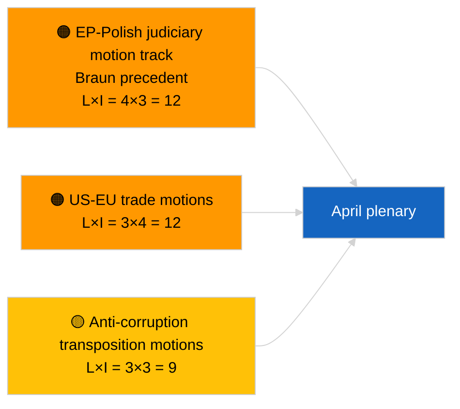

<!-- SPDX-FileCopyrightText: 2026 Hack23 AB -->
<!-- SPDX-License-Identifier: Apache-2.0 -->

# Executive Brief — Motions | 2026-04-03

**Classification:** OSINT | Public Parliamentary Record
**Confidence:** 🟢 High (recess-period structural assessment, DEGRADED API state)
**Generated:** 2026-04-03T00:00:00Z (retrospective brief)
**Article Type:** Motions
**Run ID:** `ddaeac0a-0829-43fb-8588-46bf89f410a4`
**Source:** European Parliament Open Data Portal

---

## 🎯 BLUF

**No new motions tabled on 2026-04-03; recess week 2 of 4, DEGRADED feed state confirmed by sibling `breaking-2`.** Run `ddaeac0a-0829-43fb-8588-46bf89f410a4` returned **"Quantitative risk scoring across 0 identified political dimensions"** — zero classified actors, ROUTINE significance. First April motion tabling not expected before ~17-20 April. The March carry-over motions inventory dominates the April watch list: Georgia political prisoners (TA-10-2026-0083), HDV emission credits (TA-10-2026-0084), US customs tariff (TA-10-2026-0096), Braun-precedent immunity follow-on, anti-corruption (TA-10-2026-0094). **🟢 HIGH confidence** empty state is calendar- and feed-degradation-driven.

---

## 🧭 3 Decisions This Brief Supports

| # | Decision | Who Decides | Deadline | Evidence |
|:-:|----------|-------------|:--------:|----------|
| 1 | **Editorial:** SKIP motions daily | Editor | +24h | Empty run + DEGRADED feeds |
| 2 | **Monitoring:** flag first April motion-tabling wave 17-20 April | Analyst | 2026-04-17 | EP tabling pattern |
| 3 | **Forward-watch:** track motion mix for Scenario A (trade) vs B (RoL) vs C (economic) | Analysis lead | 2026-04-20 | Pre-plenary calibration |

---

## 📰 60-Second Read

- 🔴 **No new motions tabled** on 2026-04-03; recess. (🟢 High)
- 🟠 **0 actors classified**; "Quantitative risk scoring across 0 identified political dimensions" template state. (🟢 High)
- 🟢 **March carry-over motions** anchor April watch list. (🟢 High)
- 🟡 **Risk dimensions all "none"** today. (🟢 High)
- 🔵 **Economic context:** US tariff retaliation and anti-corruption transposition dominate. (🟢 High)
- 🟣 **Cross-reference:** sibling `breaking-3` covers the anti-corruption-reform cluster that will generate follow-on motions in April. (🟢 High)
- 🩷 **Disruption vector:** none acute today. (🟢 High)
- ⚪ **Carry-forward:** Mercosur ECJ opinion likely to spawn motion(s) once published.

---

## 🗂️ Top Documents / Procedures — Motions Watch

| Rank | EP reference | Title (short) | Significance | Confidence | Status |
|:----:|--------------|---------------|:------------:|:----------:|--------|
| 1 | — | No new motions on 2026-04-03 | 0.0 | 🟢 HIGH | Recess + DEGRADED feeds |
| 2 | TA-10-2026-0094 | Anti-corruption directive follow-on motions | 8.0 | 🟢 HIGH | Adopted 26 March |
| 3 | TA-10-2026-0083 | Georgia political prisoners (carry-over) | 7.0 | 🟢 HIGH | Implementation watch |

---

## ⚠️ Risk & Threat Snapshot

| Risk | L | I | Score | Trigger | Source | Admiralty |
|------|:-:|:-:|:-----:|---------|--------|:---------:|
| EP-Polish judiciary motion track | 4 | 3 | 12 | New immunity case | TA-10-2026-0088 | A1 |
| US-EU trade motions | 3 | 4 | 12 | US action | TA-10-2026-0096 | A1 |
| Anti-corruption follow-on motions | 3 | 3 | 9 | National transposition friction | TA-10-2026-0094 | A2 |

---

## 🔮 Top Forward Trigger

**First April motion-tabling wave ~17-20 April 2026.** Topic mix calibrates April-plenary scenario.

---

## 🛡️ Source Quality Assessment

- **Primary sources:** Run `ddaeac0a-0829-43fb-8588-46bf89f410a4`; sibling `breaking-2` confirms DEGRADED feed state.
- **Confidence:** 🟢 HIGH on calendar driver.

---

## 📎 Links

| Link | Path |
|------|------|
| Article | `./article.md` |
| Sibling runs | `analysis/daily/2026-04-03/breaking/`, `breaking-2/`, `breaking-3/`, `committee-reports/`, `propositions/`, `week-ahead/` |
| Manifest | `./manifest.json` |

---

**Document Control**
- **Template:** `/analysis/templates/executive-brief.md`
- **Artifact path:** `analysis/daily/2026-04-03/motions/executive-brief.md`
- **Classification:** Public
- **Retrospective generation:** Back-fill session.
