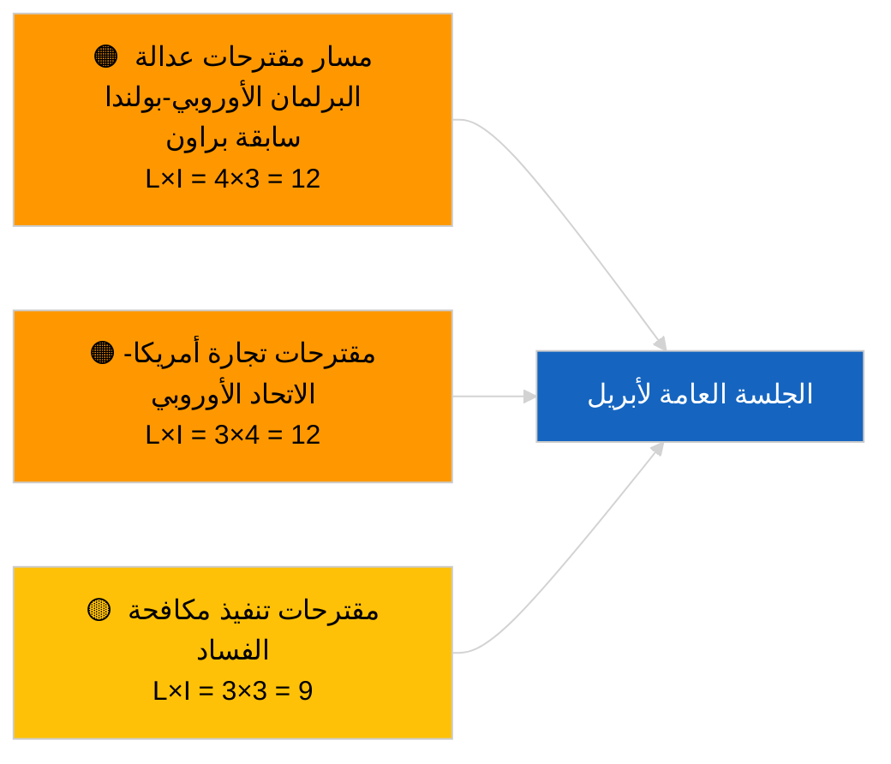

<!-- SPDX-FileCopyrightText: 2026 Hack23 AB -->
<!-- SPDX-License-Identifier: Apache-2.0 -->

# موجز تنفيذي — مقترحات القرارات | 2026-04-03

**التصنيف:** OSINT | سجل برلماني عام  
**مستوى الثقة:** 🟢 مرتفع (تقييم هيكلي في فترة العطلة، حالة API متدهورة)  
**تاريخ الإنشاء:** 2026-04-03T00:00:00Z (موجز استعادي)  
**نوع المقال:** مقترحات القرارات  
**رقم التشغيل:** `ddaeac0a-0829-43fb-8588-46bf89f410a4`  
**المصدر:** بوابة البيانات المفتوحة للبرلمان الأوروبي

---

## 🎯 BLUF

**لم تُقدَّم أي مقترحات قرارات جديدة في 2026-04-03؛ أسبوع العطلة 2 من أصل 4، الحالة المتدهورة لتغذية البيانات مؤكَّدة من المقال الشقيق `breaking-2`.** أعاد التشغيل `ddaeac0a-0829-43fb-8588-46bf89f410a4` نتيجة **"تقييم المخاطر الكمي عبر 0 بُعد سياسي محدَّد"** — صفر جهات فاعلة مصنَّفة، أهمية روتينية. لا يُتوقع أول تقديم لمقترحات القرارات في أبريل قبل نحو 17-20 أبريل. ترسيخ مخزون المقترحات المنقولة من مارس قائمة مراقبة أبريل: السجناء السياسيون الجورجيون (TA-10-2026-0083)، اعتمادات انبعاثات HDV (TA-10-2026-0084)، الرسوم الجمركية الأمريكية (TA-10-2026-0096)، متابعة الحصانة في سابقة براون، مكافحة الفساد (TA-10-2026-0094). **🟢 ثقة عالية** بأن الحالة الفارغة مدفوعة بالتقويم وتدهور تغذية البيانات.

---

## 🧭 3 قرارات يدعمها هذا الموجز

| # | القرار | من يتخذ القرار | الموعد النهائي | الدليل |
|:-:|--------|----------------|:--------------:|--------|
| 1 | **تحريري:** تخطّي مقترحات القرارات اليومية | المحرر | +24 ساعة | تشغيل فارغ + تغذيات متدهورة |
| 2 | **المراقبة:** تحديد الموجة الأولى لتقديم مقترحات أبريل في 17-20 أبريل | المحلل | 2026-04-17 | نمط تقديم البرلمان الأوروبي |
| 3 | **استشرافي:** تتبع مزيج المقترحات للسيناريو أ (التجارة) مقابل ب (سيادة القانون) مقابل ج (الاقتصاد) | مسؤول التحليل | 2026-04-20 | المعايرة قبل الجلسة العامة |

---

## 📰 قراءة 60 ثانية

- 🔴 **لم تُقدَّم مقترحات قرارات جديدة** في 2026-04-03؛ عطلة. (🟢 مرتفع)
- 🟠 **0 جهة فاعلة مصنَّفة**؛ حالة القالب "تقييم المخاطر الكمي عبر 0 بُعد سياسي محدَّد". (🟢 مرتفع)
- 🟢 **المقترحات المنقولة من مارس** تهيمن على قائمة مراقبة أبريل. (🟢 مرتفع)
- 🟡 **جميع أبعاد المخاطر "لا شيء"** اليوم. (🟢 مرتفع)
- 🔵 **السياق الاقتصادي:** الانتقام الجمركي الأمريكي وتنفيذ مكافحة الفساد يهيمنان. (🟢 مرتفع)
- 🟣 **الإشارة المرجعية المتقاطعة:** يغطي المقال الشقيق `breaking-3` مجموعة إصلاح مكافحة الفساد التي ستولّد مقترحات متابعة في أبريل. (🟢 مرتفع)
- 🩷 **ناقل الاضطراب:** لا حاد اليوم. (🟢 مرتفع)
- ⚪ **استشرافي:** من المتوقع أن يُثير رأي محكمة العدل الأوروبية بشأن ميركوسور مقترحات قرارات عند نشره.

---

## 🗂️ أبرز الوثائق / الإجراءات — مراقبة مقترحات القرارات

| الترتيب | مرجع البرلمان الأوروبي | العنوان (مختصر) | الأهمية | الثقة | الحالة |
|:-------:|------------------------|-----------------|:-------:|:-----:|--------|
| 1 | — | لا توجد مقترحات قرارات جديدة 2026-04-03 | 0.0 | 🟢 مرتفع | عطلة + تغذيات متدهورة |
| 2 | TA-10-2026-0094 | مقترحات متابعة توجيه مكافحة الفساد | 8.0 | 🟢 مرتفع | اعتُمدت في 26 مارس |
| 3 | TA-10-2026-0083 | السجناء السياسيون الجورجيون (منقول) | 7.0 | 🟢 مرتفع | مراقبة التنفيذ |

---

## ⚠️ لمحة عن المخاطر والتهديدات

| المخاطرة | L | I | الدرجة | المحفّز | المصدر | الأميرالية |
|----------|:-:|:-:|:------:|---------|--------|:----------:|
| مسار عدالة البرلمان الأوروبي-بولندا | 4 | 3 | 12 | قضية حصانة جديدة | TA-10-2026-0088 | A1 |
| مقترحات التجارة بين أمريكا والاتحاد الأوروبي | 3 | 4 | 12 | إجراء أمريكي | TA-10-2026-0096 | A1 |
| مقترحات متابعة مكافحة الفساد | 3 | 3 | 9 | احتكاك نقل وطني | TA-10-2026-0094 | A2 |

---

## 🔮 أبرز المحفّزات الاستشرافية

**الموجة الأولى لتقديم مقترحات القرارات في أبريل ~17-20 أبريل 2026.** يضبط مزيج الموضوعات سيناريو الجلسة العامة لأبريل.

---

## 🛡️ تقييم جودة المصادر

- **المصادر الأولية:** التشغيل `ddaeac0a-0829-43fb-8588-46bf89f410a4`؛ يؤكد المقال الشقيق `breaking-2` حالة تغذية البيانات المتدهورة.
- **مستوى الثقة:** 🟢 مرتفع فيما يخص المحفّز التقويمي.

---

## 📎 الروابط

| الرابط | المسار |
|--------|--------|
| المقال | `./article.md` |
| المقالات الشقيقة | `analysis/daily/2026-04-03/breaking/`, `breaking-2/`, `breaking-3/`, `committee-reports/`, `propositions/`, `week-ahead/` |
| البيان | `./manifest.json` |

---

**التحكم في الوثيقة**
- **القالب:** `/analysis/templates/executive-brief.md`
- **مسار القطعة الأثرية:** `analysis/daily/2026-04-03/motions/executive-brief.md`
- **التصنيف:** عام
- **التوليد الاستعادي:** جلسة الملء التراجعي.
