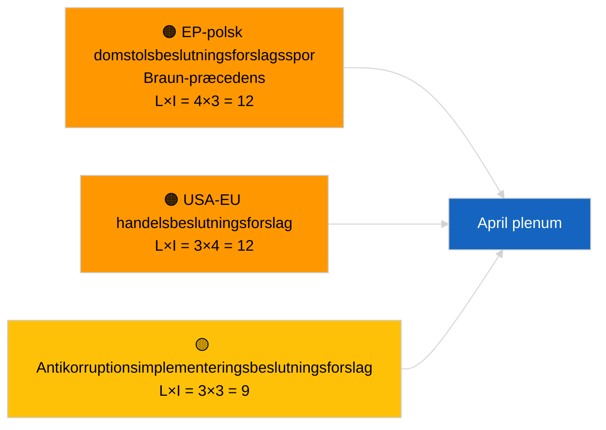

<!-- SPDX-FileCopyrightText: 2026 Hack23 AB -->
<!-- SPDX-License-Identifier: Apache-2.0 -->

# Ledelsesbriefing — Forslag til beslutning | 2026-04-03

**Klassificering:** OSINT | Offentlig parlamentarisk protokol  
**Konfidensgrad:** 🟢 Høj (strukturel vurdering i recessperiode, DEGRADERET API-tilstand)  
**Genereret:** 2026-04-03T00:00:00Z (retrospektiv briefing)  
**Artikeltype:** Forslag til beslutning  
**Kørsels-ID:** `ddaeac0a-0829-43fb-8588-46bf89f410a4`  
**Kilde:** Den Europæiske Parlamentets åbne dataportal

---

## 🎯 BLUF

**Ingen nye beslutningsforslag stillet den 2026-04-03; recessuge 2 af 4, DEGRADERET feedtilstand bekræftet af søskenartiklen `breaking-2`.** Kørsel `ddaeac0a-0829-43fb-8588-46bf89f410a4` returnerede **"Kvantitativ risikovurdering over 0 identificerede politiske dimensioner"** — nul klassificerede aktører, RUTINEMÆSSIG betydning. Første april-indstilling af forslag til beslutning forventes ikke før ~17-20 april. Marts-overførte beslutningsforslagsbeholdning dominerer april-overvågningslisten: Georgiens politiske fanger (TA-10-2026-0083), HDV-emissionskreditter (TA-10-2026-0084), amerikanske toldsatser (TA-10-2026-0096), Braun-præcedens immunitetsopfølgning, antikorruption (TA-10-2026-0094). **🟢 HØJ konfidensgrad** at tom tilstand skyldes kalender- og feed-degradering.

---

## 🧭 3 Beslutninger denne briefing understøtter

| # | Beslutning | Hvem beslutter | Tidsfrist | Bevis |
|:-:|------------|----------------|:---------:|-------|
| 1 | **Redaktionelt:** SPRING daglige beslutningsforslag over | Redaktør | +24t | Tom kørsel + DEGRADEREDE feeds |
| 2 | **Overvågning:** markér første april-beslutningsforslagsbølge 17–20 april | Analytiker | 2026-04-17 | EP's indstillingsmønster |
| 3 | **Fremadrettet:** spor forslagsblanding for Scenarie A (handel) vs B (retsstat) vs C (økonomi) | Analyseleder | 2026-04-20 | Kalibrering forud for plenum |

---

## 📰 60-sekunders læsning

- 🔴 **Ingen nye beslutningsforslag indstillet** den 2026-04-03; recess. (🟢 Høj)
- 🟠 **0 aktører klassificeret**; skabelontilstand "Kvantitativ risikovurdering over 0 identificerede politiske dimensioner". (🟢 Høj)
- 🟢 **Marts-overførselsforslag** dominerer april-overvågningslisten. (🟢 Høj)
- 🟡 **Alle risikodimensioner "ingen"** i dag. (🟢 Høj)
- 🔵 **Økonomisk kontekst:** Amerikansk toldgengældelse og antikorruptionsimplementering dominerer. (🟢 Høj)
- 🟣 **Krydshenvisning:** Søskenartiklen `breaking-3` dækker antikorruptionsreformklyngen, der vil generere opfølgende beslutningsforslag i april. (🟢 Høj)
- 🩷 **Forstyrrelsesvektor:** ingen akut i dag. (🟢 Høj)
- ⚪ **Fremadrettet:** Mercosur ECJ-udtalelse ventes at udløse beslutningsforslag ved offentliggørelse.

---

## 🗂️ Topdokumenter / Procedurer — Beslutningsforslagsovervågning

| Rang | EP-reference | Titel (kort) | Betydning | Konfidensgrad | Status |
|:----:|--------------|--------------|:---------:|:-------------:|--------|
| 1 | — | Ingen nye beslutningsforslag 2026-04-03 | 0.0 | 🟢 HØJ | Recess + DEGRADEREDE feeds |
| 2 | TA-10-2026-0094 | Antikorruptionsdirektivets opfølgningsbeslutningsforslag | 8.0 | 🟢 HØJ | Vedtaget 26. marts |
| 3 | TA-10-2026-0083 | Georgiens politiske fanger (overførsels) | 7.0 | 🟢 HØJ | Implementeringsovervågning |

---

## ⚠️ Risiko- og trusseloversigt

| Risiko | L | I | Score | Udløser | Kilde | Admiralitet |
|--------|:-:|:-:|:-----:|---------|-------|:-----------:|
| EP-polsk domstolsbeslutningsforslagsspor | 4 | 3 | 12 | Ny immunitetssag | TA-10-2026-0088 | A1 |
| USA-EU handelsbeslutningsforslag | 3 | 4 | 12 | Amerikansk handling | TA-10-2026-0096 | A1 |
| Antikorruptionsopfølgningsbeslutningsforslag | 3 | 3 | 9 | National implementeringsfrikt | TA-10-2026-0094 | A2 |

---

## 🔮 Fremste fremadrettede udløser

**Første april-beslutningsforslagsbølge ~17–20 april 2026.** Emneblanding kalibrerer april-plenarscenarie.

---

## 🛡️ Vurdering af kildekvalitet

- **Primærkilder:** Kørsel `ddaeac0a-0829-43fb-8588-46bf89f410a4`; søskenartiklen `breaking-2` bekræfter DEGRADERET feedtilstand.
- **Konfidensgrad:** 🟢 HØJ vedrørende kalenderdriveren.

---

## 📎 Links

| Link | Sti |
|------|-----|
| Artikel | `./article.md` |
| Søskenartikler | `analysis/daily/2026-04-03/breaking/`, `breaking-2/`, `breaking-3/`, `committee-reports/`, `propositions/`, `week-ahead/` |
| Manifest | `./manifest.json` |

---

**Dokumentkontrol**
- **Skabelon:** `/analysis/templates/executive-brief.md`
- **Artefaktsti:** `analysis/daily/2026-04-03/motions/executive-brief.md`
- **Klassificering:** Offentlig
- **Retrospektiv generering:** Tilbagefyldningssession.
