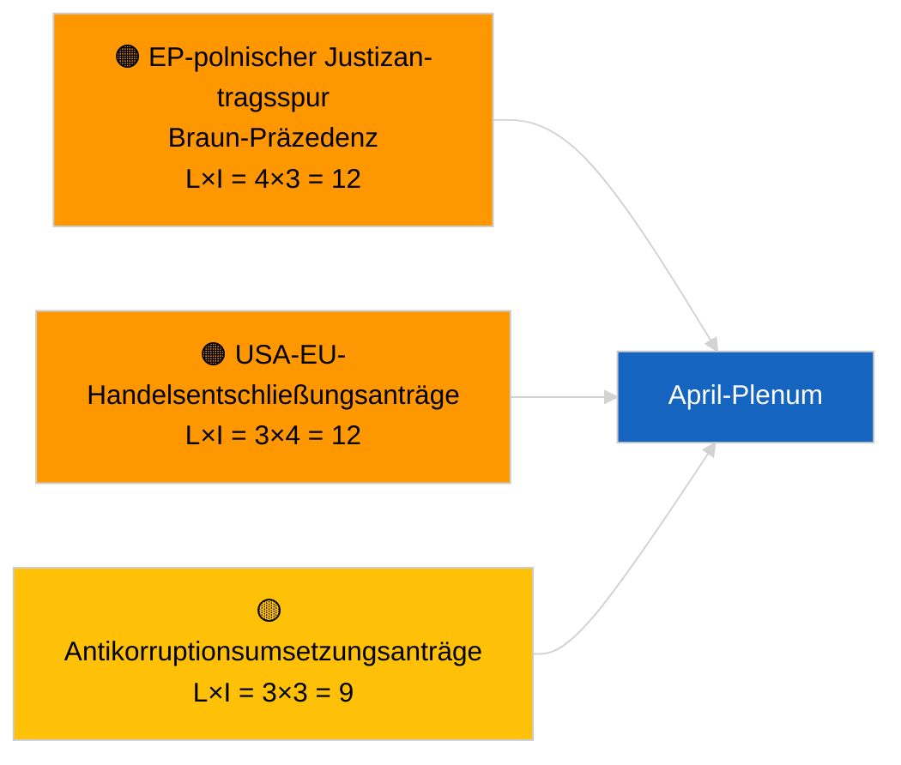

<!-- SPDX-FileCopyrightText: 2026 Hack23 AB -->
<!-- SPDX-License-Identifier: Apache-2.0 -->

# Führungskurzinformation — Entschließungsanträge | 2026-04-03

**Klassifizierung:** OSINT | Öffentliche parlamentarische Aufzeichnung  
**Konfidenzgrad:** 🟢 Hoch (strukturelle Bewertung in der Sitzungspause, DEGRADIERTER API-Zustand)  
**Erstellt:** 2026-04-03T00:00:00Z (retrospektive Kurzinformation)  
**Artikeltyp:** Entschließungsanträge  
**Ausführungs-ID:** `ddaeac0a-0829-43fb-8588-46bf89f410a4`  
**Quelle:** Offenes Datenportal des Europäischen Parlaments

---

## 🎯 BLUF

**Keine neuen Entschließungsanträge am 2026-04-03 eingebracht; Sitzungspause Woche 2 von 4, DEGRADIERTER Feed-Zustand durch Geschwisterartikel `breaking-2` bestätigt.** Ausführung `ddaeac0a-0829-43fb-8588-46bf89f410a4` lieferte **„Quantitative Risikobewertung über 0 identifizierte politische Dimensionen"** — null klassifizierte Akteure, ROUTINEMÄSSIGE Bedeutung. Die erste April-Einreichung von Entschließungsanträgen wird nicht vor ~17.–20. April erwartet. Das aus dem März übertragene Entschließungsantragsbestand dominiert die April-Beobachtungsliste: Georgiens politische Gefangene (TA-10-2026-0083), HDV-Emissionsgutschriften (TA-10-2026-0084), US-Zölle (TA-10-2026-0096), Braun-Präzedenz-Immunitätsnachverfolgung, Antikorruption (TA-10-2026-0094). **🟢 HOHER Konfidenzgrad**, dass der leere Zustand kalender- und feed-degradierungsbedingt ist.

---

## 🧭 3 Entscheidungen, die diese Kurzinformation unterstützt

| # | Entscheidung | Wer entscheidet | Frist | Nachweis |
|:-:|--------------|-----------------|:-----:|----------|
| 1 | **Redaktionell:** Tägliche Entschließungsanträge ÜBERSPRINGEN | Redakteur | +24h | Leere Ausführung + DEGRADIERTE Feeds |
| 2 | **Monitoring:** Erste April-Entschließungsantrags-Welle 17.–20. April kennzeichnen | Analyst | 2026-04-17 | Einreichungsmuster des EP |
| 3 | **Vorausblickend:** Antragsgemisch für Szenario A (Handel) vs. B (Rechtsstaat) vs. C (Wirtschaft) verfolgen | Analyseleiter | 2026-04-20 | Kalibrierung vor Plenum |

---

## 📰 60-Sekunden-Lektüre

- 🔴 **Keine neuen Entschließungsanträge eingebracht** am 2026-04-03; Sitzungspause. (🟢 Hoch)
- 🟠 **0 Akteure klassifiziert**; Vorlagenstatus „Quantitative Risikobewertung über 0 identifizierte politische Dimensionen". (🟢 Hoch)
- 🟢 **Aus März übertragene Anträge** dominieren die April-Beobachtungsliste. (🟢 Hoch)
- 🟡 **Alle Risikodimensionen „keine"** heute. (🟢 Hoch)
- 🔵 **Wirtschaftlicher Kontext:** US-Zollvergeltung und Antikorruptionsumsetzung dominieren. (🟢 Hoch)
- 🟣 **Querverweise:** Geschwisterartikel `breaking-3` deckt das Antikorruptionsreformcluster ab, das im April Folgeanträge generieren wird. (🟢 Hoch)
- 🩷 **Störungsvektor:** heute nicht akut. (🟢 Hoch)
- ⚪ **Vorausblickend:** Mercosur-EuGH-Gutachten dürfte bei Veröffentlichung Entschließungsanträge auslösen.

---

## 🗂️ Top-Dokumente / Verfahren — Entschließungsantrags-Beobachtung

| Rang | EP-Referenz | Titel (kurz) | Bedeutung | Konfidenz | Status |
|:----:|-------------|--------------|:---------:|:---------:|--------|
| 1 | — | Keine neuen Entschließungsanträge 2026-04-03 | 0.0 | 🟢 HOCH | Sitzungspause + DEGRADIERTE Feeds |
| 2 | TA-10-2026-0094 | Folgeanträge zur Antikorruptionsrichtlinie | 8.0 | 🟢 HOCH | Am 26. März angenommen |
| 3 | TA-10-2026-0083 | Georgiens politische Gefangene (übertragen) | 7.0 | 🟢 HOCH | Umsetzungsbeobachtung |

---

## ⚠️ Risiko- und Bedrohungsüberblick

| Risiko | L | I | Wert | Auslöser | Quelle | Admiralität |
|--------|:-:|:-:|:----:|---------|--------|:-----------:|
| EP-polnischer Justizantragsspur | 4 | 3 | 12 | Neuer Immunitätsfall | TA-10-2026-0088 | A1 |
| USA-EU-Handelsentschließungsanträge | 3 | 4 | 12 | US-Maßnahme | TA-10-2026-0096 | A1 |
| Antikorruptions-Folgeanträge | 3 | 3 | 9 | Nationales Umsetzungsreibung | TA-10-2026-0094 | A2 |

---

## 🔮 Wichtigster vorausblickender Auslöser

**Erste April-Entschließungsantrags-Welle ~17.–20. April 2026.** Themengemisch kalibriert April-Plenarszenario.

---

## 🛡️ Bewertung der Quellenqualität

- **Primärquellen:** Ausführung `ddaeac0a-0829-43fb-8588-46bf89f410a4`; Geschwisterartikel `breaking-2` bestätigt DEGRADIERTEN Feed-Zustand.
- **Konfidenzgrad:** 🟢 HOCH bezüglich des Kalendertreibers.

---

## 📎 Links

| Link | Pfad |
|------|------|
| Artikel | `./article.md` |
| Geschwisterartikel | `analysis/daily/2026-04-03/breaking/`, `breaking-2/`, `breaking-3/`, `committee-reports/`, `propositions/`, `week-ahead/` |
| Manifest | `./manifest.json` |

---

**Dokumentenkontrolle**
- **Vorlage:** `/analysis/templates/executive-brief.md`
- **Artefaktpfad:** `analysis/daily/2026-04-03/motions/executive-brief.md`
- **Klassifizierung:** Öffentlich
- **Retrospektive Erstellung:** Auffüllungssitzung.
