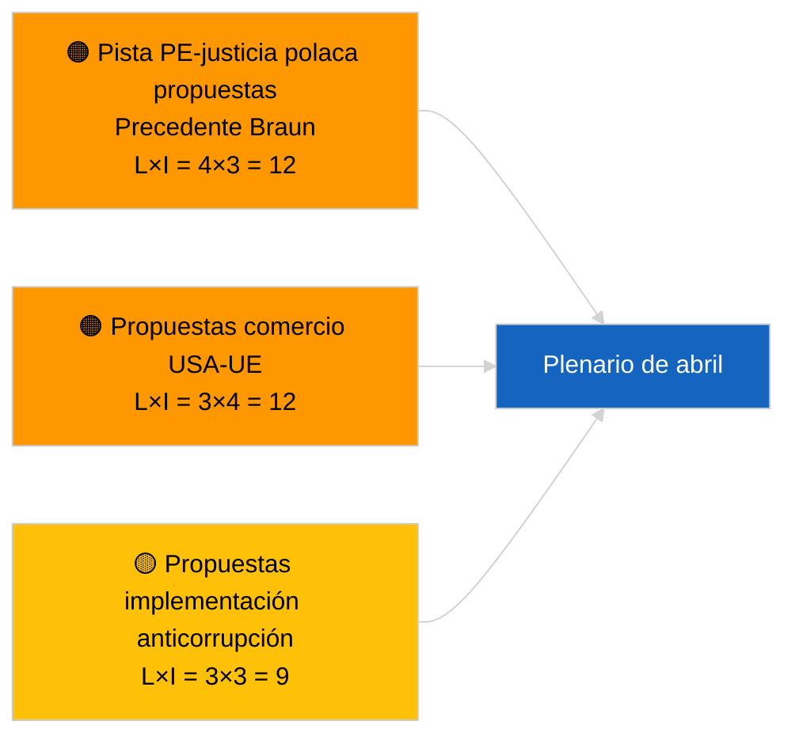

<!-- SPDX-FileCopyrightText: 2026 Hack23 AB -->
<!-- SPDX-License-Identifier: Apache-2.0 -->

# Informe ejecutivo — Propuestas de resolución | 2026-04-03

**Clasificación:** OSINT | Registro parlamentario público  
**Nivel de confianza:** 🟢 Alto (evaluación estructural en período de receso, estado de API DEGRADADO)  
**Generado:** 2026-04-03T00:00:00Z (informe retrospectivo)  
**Tipo de artículo:** Propuestas de resolución  
**ID de ejecución:** `ddaeac0a-0829-43fb-8588-46bf89f410a4`  
**Fuente:** Portal de datos abiertos del Parlamento Europeo

---

## 🎯 BLUF

**No se presentaron nuevas propuestas de resolución el 2026-04-03; semana de receso 2 de 4, estado de flujo DEGRADADO confirmado por el artículo hermano `breaking-2`.** La ejecución `ddaeac0a-0829-43fb-8588-46bf89f410a4` devolvió **«Puntuación cuantitativa de riesgos en 0 dimensiones políticas identificadas»** — cero actores clasificados, importancia RUTINARIA. No se espera la primera presentación de propuestas de resolución de abril antes del ~17-20 de abril. El inventario de propuestas arrastradas de marzo domina la lista de vigilancia de abril: presos políticos georgianos (TA-10-2026-0083), créditos de emisiones HDV (TA-10-2026-0084), aranceles estadounidenses (TA-10-2026-0096), seguimiento de inmunidad del precedente Braun, anticorrupción (TA-10-2026-0094). **🟢 CONFIANZA ALTA** de que el estado vacío obedece al calendario y a la degradación del flujo.

---

## 🧭 3 Decisiones que apoya este informe

| # | Decisión | Quién decide | Plazo | Evidencia |
|:-:|----------|--------------|:-----:|-----------|
| 1 | **Editorial:** OMITIR propuestas de resolución diarias | Editor | +24h | Ejecución vacía + flujos DEGRADADOS |
| 2 | **Seguimiento:** marcar la primera ola de presentaciones de abril del 17 al 20 de abril | Analista | 2026-04-17 | Patrón de presentación del PE |
| 3 | **Prospectivo:** rastrear la mezcla de propuestas para el Escenario A (comercio) vs B (Estado de derecho) vs C (economía) | Jefe de análisis | 2026-04-20 | Calibración previa al plenario |

---

## 📰 Lectura de 60 segundos

- 🔴 **No se presentaron nuevas propuestas de resolución** el 2026-04-03; receso. (🟢 Alto)
- 🟠 **0 actores clasificados**; estado de plantilla «Puntuación cuantitativa de riesgos en 0 dimensiones políticas identificadas». (🟢 Alto)
- 🟢 **Propuestas arrastradas de marzo** dominan la lista de vigilancia de abril. (🟢 Alto)
- 🟡 **Todas las dimensiones de riesgo «ninguna»** hoy. (🟢 Alto)
- 🔵 **Contexto económico:** Las represalias arancelarias estadounidenses y la transposición anticorrupción dominan. (🟢 Alto)
- 🟣 **Referencia cruzada:** El artículo hermano `breaking-3` cubre el clúster de reforma anticorrupción que generará propuestas de seguimiento en abril. (🟢 Alto)
- 🩷 **Vector de perturbación:** ninguno agudo hoy. (🟢 Alto)
- ⚪ **Prospectivo:** El dictamen del TJUE sobre Mercosur probablemente generará propuestas cuando se publique.

---

## 🗂️ Principales documentos / Procedimientos — Vigilancia de propuestas de resolución

| Rango | Referencia PE | Título (corto) | Importancia | Confianza | Estado |
|:-----:|---------------|----------------|:-----------:|:---------:|--------|
| 1 | — | No hay nuevas propuestas de resolución 2026-04-03 | 0.0 | 🟢 ALTO | Receso + flujos DEGRADADOS |
| 2 | TA-10-2026-0094 | Propuestas de seguimiento de la directiva anticorrupción | 8.0 | 🟢 ALTO | Adoptada el 26 de marzo |
| 3 | TA-10-2026-0083 | Presos políticos georgianos (arrastrado) | 7.0 | 🟢 ALTO | Seguimiento de implementación |

---

## ⚠️ Panorama de riesgos y amenazas

| Riesgo | L | I | Puntuación | Disparador | Fuente | Almirantazgo |
|--------|:-:|:-:|:----------:|------------|--------|:------------:|
| Pista PE-justicia polaca | 4 | 3 | 12 | Nuevo caso de inmunidad | TA-10-2026-0088 | A1 |
| Propuestas comercio USA-UE | 3 | 4 | 12 | Acción estadounidense | TA-10-2026-0096 | A1 |
| Propuestas de seguimiento anticorrupción | 3 | 3 | 9 | Fricción de transposición nacional | TA-10-2026-0094 | A2 |

---

## 🔮 Principal disparador prospectivo

**Primera ola de presentaciones de propuestas de resolución de abril ~17-20 de abril de 2026.** La mezcla temática calibra el escenario del plenario de abril.

---

## 🛡️ Evaluación de la calidad de las fuentes

- **Fuentes primarias:** Ejecución `ddaeac0a-0829-43fb-8588-46bf89f410a4`; el artículo hermano `breaking-2` confirma el estado de flujo DEGRADADO.
- **Nivel de confianza:** 🟢 ALTO en cuanto al motor del calendario.

---

## 📎 Enlaces

| Enlace | Ruta |
|--------|------|
| Artículo | `./article.md` |
| Artículos hermanos | `analysis/daily/2026-04-03/breaking/`, `breaking-2/`, `breaking-3/`, `committee-reports/`, `propositions/`, `week-ahead/` |
| Manifiesto | `./manifest.json` |

---

**Control del documento**
- **Plantilla:** `/analysis/templates/executive-brief.md`
- **Ruta del artefacto:** `analysis/daily/2026-04-03/motions/executive-brief.md`
- **Clasificación:** Público
- **Generación retrospectiva:** Sesión de relleno.
