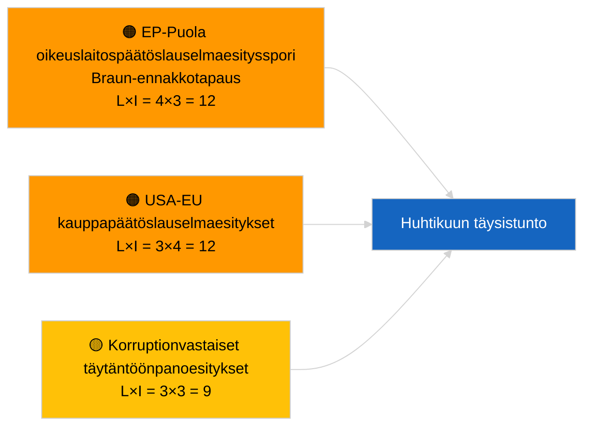

<!-- SPDX-FileCopyrightText: 2026 Hack23 AB -->
<!-- SPDX-License-Identifier: Apache-2.0 -->

# Johdon tiivis katsaus — Päätöslauselmaesitykset | 2026-04-03

**Luokitus:** OSINT | Julkinen parlamentaarinen asiakirja  
**Luotettavuus:** 🟢 Korkea (rakenteellinen arvio istuntotauolla, HEIKENTYNYT API-tila)  
**Luotu:** 2026-04-03T00:00:00Z (takautuva katsaus)  
**Artikkelityyppi:** Päätöslauselmaesitykset  
**Ajon tunnus:** `ddaeac0a-0829-43fb-8588-46bf89f410a4`  
**Lähde:** Euroopan parlamentin avoin dataporttali

---

## 🎯 BLUF

**Uusia päätöslauselmaesityksiä ei tehty 2.4.2026; istuntotauko viikko 2/4, HEIKENTYNYT syötetila vahvistettu rinnakkaisartikkelilla `breaking-2`.** Ajo `ddaeac0a-0829-43fb-8588-46bf89f410a4` palautti **"Kvantitatiivinen riskipisteytys 0 tunnistetun poliittisen dimension yli"** — nolla luokiteltua toimijaa, RUTIINITASOINEN merkitys. Huhtikuun ensimmäisiä päätöslauselmaesityksiä ei odoteta ennen ~17.–20. huhtikuuta. Maaliskuulta siirretyt päätöslauselmaesitykset hallitsevat huhtikuun seurantalistan: Georgian poliittiset vangit (TA-10-2026-0083), HDV-päästöhyvitykset (TA-10-2026-0084), Yhdysvaltojen tullit (TA-10-2026-0096), Braun-ennakkotapauksen immuniteettiasian jatko, korruptionvastainen toiminta (TA-10-2026-0094). **🟢 KORKEA luotettavuus** tyhjän tilan kalenteriperusteisesta ja syöttöhäiriöistä johtuvasta luonteesta.

---

## 🧭 3 Päätöstä, joita tämä katsaus tukee

| # | Päätös | Kuka päättää | Määräaika | Näyttö |
|:-:|--------|--------------|:---------:|--------|
| 1 | **Toimituksellinen:** OHITA päivittäiset päätöslauselmaesitykset | Toimittaja | +24h | Tyhjä ajo + HEIKENTYNEET syötteet |
| 2 | **Seuranta:** merkitse ensimmäinen huhtikuun päätöslauselmaesitysaalto 17.–20. huhtikuuta | Analyytikko | 2026-04-17 | EP:n esittämismalli |
| 3 | **Eteenpäinkatsova:** seuraa esitysten yhdistelmää Skenaariolle A (kauppa) vs B (oikeusvaltioperiaate) vs C (talous) | Analyysipäällikkö | 2026-04-20 | Täysistuntoa edeltävä kalibrointi |

---

## 📰 60 sekunnin lukeminen

- 🔴 **Uusia päätöslauselmaesityksiä ei tehty** 2.4.2026; istuntotauko. (🟢 Korkea)
- 🟠 **0 toimijaa luokiteltu**; mallin tila "Kvantitatiivinen riskipisteytys 0 tunnistetun poliittisen dimension yli". (🟢 Korkea)
- 🟢 **Maaliskuulta siirretyt esitykset** hallitsevat huhtikuun seurantalistaa. (🟢 Korkea)
- 🟡 **Kaikki riskin ulottuvuudet "ei mitään"** tänään. (🟢 Korkea)
- 🔵 **Taloudellinen konteksti:** Yhdysvaltojen tullivastatoimet ja korruptionvastainen täytäntöönpano hallitsevat. (🟢 Korkea)
- 🟣 **Ristiviittaus:** Rinnakkaisartikkeli `breaking-3` kattaa korruptionvastaiseen uudistukseen liittyvän kokonaisuuden, josta syntyy jatkoesityksiä huhtikuussa. (🟢 Korkea)
- 🩷 **Häiriötekijä:** ei akuuttia tänään. (🟢 Korkea)
- ⚪ **Eteenpäinkatsova:** Mercosur EUT:n lausunnon odotetaan laukaisevan päätöslauselmaesityksiä julkistamisen yhteydessä.

---

## 🗂️ Tärkeimmät asiakirjat / Menettelyt — Päätöslauselmaesitysten seuranta

| Sija | EP-viite | Otsikko (lyhyt) | Merkittävyys | Luotettavuus | Tila |
|:----:|----------|-----------------|:------------:|:------------:|------|
| 1 | — | Ei uusia päätöslauselmaesityksiä 2.4.2026 | 0.0 | 🟢 KORKEA | Istuntotauko + HEIKENTYNEET syötteet |
| 2 | TA-10-2026-0094 | Korruptionvastaisen direktiivin jatkoesitykset | 8.0 | 🟢 KORKEA | Hyväksytty 26. maaliskuuta |
| 3 | TA-10-2026-0083 | Georgian poliittiset vangit (siirretty) | 7.0 | 🟢 KORKEA | Täytäntöönpanoseuranta |

---

## ⚠️ Riski- ja uhkakatsaus

| Riski | L | I | Pisteet | Laukaisija | Lähde | Admiraliteetti |
|-------|:-:|:-:|:-------:|------------|-------|:--------------:|
| EP-Puola oikeuslaitospäätöslauselmaesitysspori | 4 | 3 | 12 | Uusi immuniteettiasian tapaus | TA-10-2026-0088 | A1 |
| USA-EU kauppapäätöslauselmaesitykset | 3 | 4 | 12 | Yhdysvaltojen toimenpide | TA-10-2026-0096 | A1 |
| Korruptionvastaisten jatkoesitysten seuranta | 3 | 3 | 9 | Kansallinen täytäntöönpanohankaus | TA-10-2026-0094 | A2 |

---

## 🔮 Tärkein eteenpäinkatsova laukaisija

**Ensimmäinen huhtikuun päätöslauselmaesitysaalto ~17.–20. huhtikuuta 2026.** Aiheyhdistelmä kalibroi huhtikuun täysistuntoskenaarion.

---

## 🛡️ Lähteiden laadun arviointi

- **Ensisijaiset lähteet:** Ajo `ddaeac0a-0829-43fb-8588-46bf89f410a4`; rinnakkaisartikkeli `breaking-2` vahvistaa HEIKENTYNEEN syötetilan.
- **Luotettavuus:** 🟢 KORKEA kalenterivaikuttimen osalta.

---

## 📎 Linkit

| Linkki | Polku |
|--------|-------|
| Artikkeli | `./article.md` |
| Rinnakkaisartikkelit | `analysis/daily/2026-04-03/breaking/`, `breaking-2/`, `breaking-3/`, `committee-reports/`, `propositions/`, `week-ahead/` |
| Manifesti | `./manifest.json` |

---

**Asiakirjan hallinta**
- **Malli:** `/analysis/templates/executive-brief.md`
- **Artefaktin polku:** `analysis/daily/2026-04-03/motions/executive-brief.md`
- **Luokitus:** Julkinen
- **Takautuva luonti:** Täydennysistunto.
