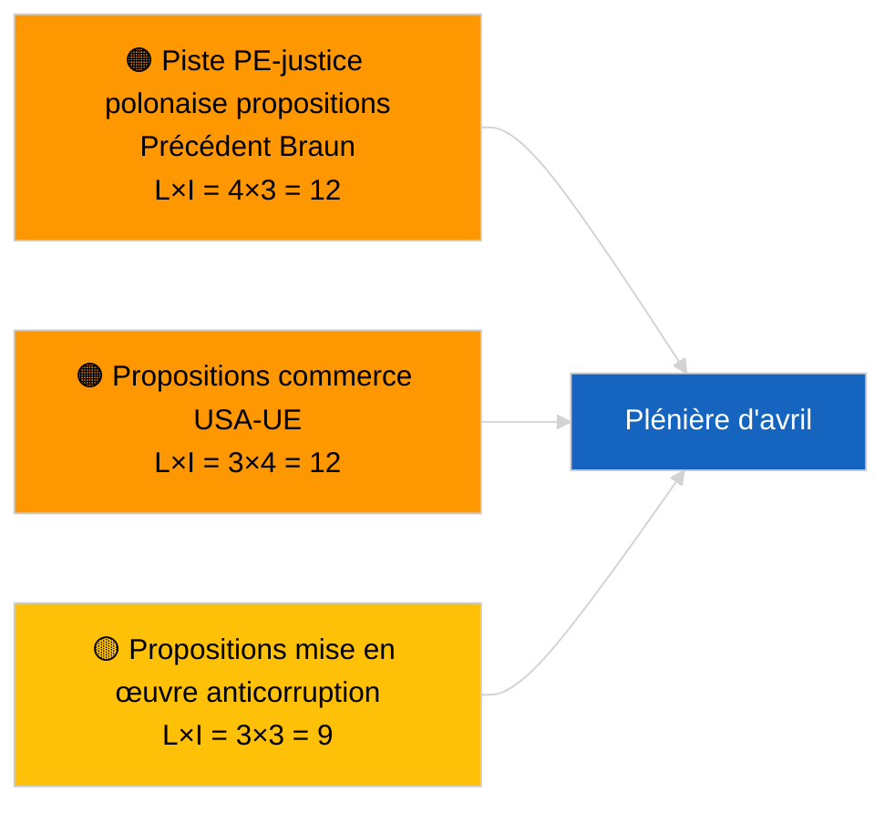

<!-- SPDX-FileCopyrightText: 2026 Hack23 AB -->
<!-- SPDX-License-Identifier: Apache-2.0 -->

# Note de synthèse — Propositions de résolution | 2026-04-03

**Classification :** OSINT | Document parlementaire public  
**Niveau de confiance :** 🟢 Élevé (évaluation structurelle en période de recess, état API DÉGRADÉ)  
**Généré :** 2026-04-03T00:00:00Z (note rétrospective)  
**Type d'article :** Propositions de résolution  
**ID d'exécution :** `ddaeac0a-0829-43fb-8588-46bf89f410a4`  
**Source :** Portail de données ouvertes du Parlement européen

---

## 🎯 BLUF

**Aucune nouvelle proposition de résolution déposée le 2026-04-03 ; semaine de recess 2 sur 4, état de flux DÉGRADÉ confirmé par l'article jumeau `breaking-2`.** L'exécution `ddaeac0a-0829-43fb-8588-46bf89f410a4` a retourné **« Évaluation quantitative des risques sur 0 dimension politique identifiée »** — zéro acteur classifié, importance ROUTINIÈRE. Le premier dépôt de propositions de résolution d'avril n'est pas attendu avant le ~17-20 avril. L'inventaire des propositions reportées de mars domine la liste de surveillance d'avril : prisonniers politiques géorgiens (TA-10-2026-0083), crédits d'émissions HDV (TA-10-2026-0084), tarifs douaniers américains (TA-10-2026-0096), suivi immunité précédent Braun, anticorruption (TA-10-2026-0094). **🟢 CONFIANCE ÉLEVÉE** que l'état vide est lié au calendrier et à la dégradation des flux.

---

## 🧭 3 Décisions que cette note soutient

| # | Décision | Qui décide | Échéance | Preuve |
|:-:|----------|------------|:--------:|--------|
| 1 | **Éditorial :** PASSER les propositions de résolution quotidiennes | Rédacteur | +24h | Exécution vide + flux DÉGRADÉS |
| 2 | **Surveillance :** signaler la première vague de dépôts d'avril du 17 au 20 avril | Analyste | 2026-04-17 | Modèle de dépôt du PE |
| 3 | **Prospectif :** suivre le mélange de propositions pour le Scénario A (commerce) vs B (État de droit) vs C (économie) | Responsable analyse | 2026-04-20 | Calibrage avant plénière |

---

## 📰 Lecture en 60 secondes

- 🔴 **Aucune nouvelle proposition de résolution déposée** le 2026-04-03 ; recess. (🟢 Élevé)
- 🟠 **0 acteur classifié** ; état modèle « Évaluation quantitative des risques sur 0 dimension politique identifiée ». (🟢 Élevé)
- 🟢 **Propositions reportées de mars** dominent la liste de surveillance d'avril. (🟢 Élevé)
- 🟡 **Toutes les dimensions de risque « aucune »** aujourd'hui. (🟢 Élevé)
- 🔵 **Contexte économique :** Représailles tarifaires américaines et mise en œuvre anticorruption dominent. (🟢 Élevé)
- 🟣 **Référence croisée :** L'article jumeau `breaking-3` couvre le cluster de réforme anticorruption qui générera des propositions de suivi en avril. (🟢 Élevé)
- 🩷 **Vecteur de perturbation :** aucun actuel aujourd'hui. (🟢 Élevé)
- ⚪ **Prospectif :** L'avis CJE sur Mercosur devrait susciter des propositions lors de sa publication.

---

## 🗂️ Documents principaux / Procédures — Surveillance des propositions de résolution

| Rang | Référence PE | Titre (court) | Importance | Confiance | Statut |
|:----:|--------------|---------------|:----------:|:---------:|--------|
| 1 | — | Aucune nouvelle proposition de résolution 2026-04-03 | 0.0 | 🟢 ÉLEVÉ | Recess + flux DÉGRADÉS |
| 2 | TA-10-2026-0094 | Propositions de suivi de la directive anticorruption | 8.0 | 🟢 ÉLEVÉ | Adoptée le 26 mars |
| 3 | TA-10-2026-0083 | Prisonniers politiques géorgiens (reportée) | 7.0 | 🟢 ÉLEVÉ | Surveillance de la mise en œuvre |

---

## ⚠️ Aperçu des risques et menaces

| Risque | L | I | Score | Déclencheur | Source | Amirauté |
|--------|:-:|:-:|:-----:|-------------|--------|:--------:|
| Piste PE-justice polonaise | 4 | 3 | 12 | Nouveau cas d'immunité | TA-10-2026-0088 | A1 |
| Propositions commerce USA-UE | 3 | 4 | 12 | Action américaine | TA-10-2026-0096 | A1 |
| Propositions de suivi anticorruption | 3 | 3 | 9 | Friction nationale de transposition | TA-10-2026-0094 | A2 |

---

## 🔮 Principal déclencheur prospectif

**Première vague de dépôts de propositions de résolution d'avril ~17-20 avril 2026.** La composition thématique calibre le scénario de la plénière d'avril.

---

## 🛡️ Évaluation de la qualité des sources

- **Sources primaires :** Exécution `ddaeac0a-0829-43fb-8588-46bf89f410a4` ; l'article jumeau `breaking-2` confirme l'état de flux DÉGRADÉ.
- **Niveau de confiance :** 🟢 ÉLEVÉ concernant le facteur calendrier.

---

## 📎 Liens

| Lien | Chemin |
|------|--------|
| Article | `./article.md` |
| Articles jumeaux | `analysis/daily/2026-04-03/breaking/`, `breaking-2/`, `breaking-3/`, `committee-reports/`, `propositions/`, `week-ahead/` |
| Manifeste | `./manifest.json` |

---

**Contrôle du document**
- **Modèle :** `/analysis/templates/executive-brief.md`
- **Chemin de l'artefact :** `analysis/daily/2026-04-03/motions/executive-brief.md`
- **Classification :** Public
- **Génération rétrospective :** Session de remplissage rétroactif.
