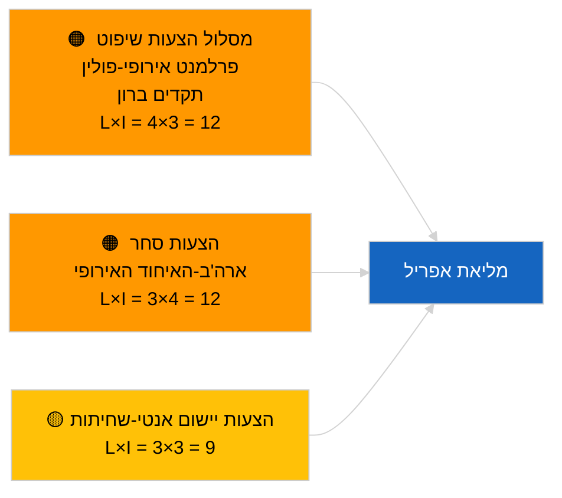

<!-- SPDX-FileCopyrightText: 2026 Hack23 AB -->
<!-- SPDX-License-Identifier: Apache-2.0 -->

# תמצית מנהלים — הצעות החלטה | 2026-04-03

**סיווג:** OSINT | רשומה פרלמנטרית ציבורית  
**רמת ביטחון:** 🟢 גבוה (הערכה מבנית בתקופת הפגרה, מצב API מושפל)  
**נוצר:** 2026-04-03T00:00:00Z (תמצית רטרוספקטיבית)  
**סוג מאמר:** הצעות החלטה  
**מזהה ריצה:** `ddaeac0a-0829-43fb-8588-46bf89f410a4`  
**מקור:** פורטל הנתונים הפתוח של הפרלמנט האירופי

---

## 🎯 BLUF

**לא הוגשו הצעות החלטה חדשות ב-2026-04-03; שבוע פגרה 2 מתוך 4, מצב הזנה מושפל אושר על ידי המאמר-אח `breaking-2`.** הריצה `ddaeac0a-0829-43fb-8588-46bf89f410a4` החזירה **"ניקוד סיכון כמותי על 0 ממדים פוליטיים שזוהו"** — אפס שחקנים מסווגים, חשיבות שגרתית. לא צפוי הגשה ראשונה של הצעות החלטה לאפריל לפני ~17-20 באפריל. מלאי ההצעות הנגרר ממרץ שולט ברשימת המעקב של אפריל: אסירים פוליטיים גאורגיים (TA-10-2026-0083), קרדיטים לפליטות HDV (TA-10-2026-0084), מכסי ארה"ב (TA-10-2026-0096), מעקב חסינות תקדים ברון, אנטי-שחיתות (TA-10-2026-0094). **🟢 ביטחון גבוה** שהמצב הריק נובע מלוח זמנים ושחיקת ההזנה.

---

## 🧭 3 החלטות שתמצית זו תומכת בהן

| # | החלטה | מי מחליט | מועד אחרון | ראיה |
|:-:|--------|-----------|:-----------:|------|
| 1 | **עריכה:** דלג על הצעות החלטה יומיות | עורך | +24 שעות | ריצה ריקה + הזנות מושפלות |
| 2 | **מעקב:** סמן את גל הגשת הצעות אפריל הראשון 17-20 באפריל | אנליסט | 2026-04-17 | דפוס הגשה של הפרלמנט האירופי |
| 3 | **צופה קדימה:** עקוב אחר תמהיל ההצעות לתרחיש א (סחר) מול ב (שלטון חוק) מול ג (כלכלה) | ראש אנליזה | 2026-04-20 | כיול לפני מליאה |

---

## 📰 קריאה של 60 שניות

- 🔴 **לא הוגשו הצעות החלטה חדשות** ב-2026-04-03; פגרה. (🟢 גבוה)
- 🟠 **0 שחקנים מסווגים**; מצב תבנית "ניקוד סיכון כמותי על 0 ממדים פוליטיים שזוהו". (🟢 גבוה)
- 🟢 **הצעות נגררות ממרץ** שולטות ברשימת המעקב של אפריל. (🟢 גבוה)
- 🟡 **כל ממדי הסיכון "אין"** היום. (🟢 גבוה)
- 🔵 **הקשר כלכלי:** גמול מכסי ארה"ב ויישום אנטי-שחיתות שולטים. (🟢 גבוה)
- 🟣 **הפניה צולבת:** המאמר-אח `breaking-3` מכסה את אשכול רפורמת האנטי-שחיתות שייצר הצעות המשך באפריל. (🟢 גבוה)
- 🩷 **וקטור שיבוש:** אין חריף היום. (🟢 גבוה)
- ⚪ **צופה קדימה:** חוות דעת בית המשפט האירופי בנושא מרקוסור צפויה לעורר הצעות עם פרסומה.

---

## 🗂️ מסמכים מובילים / הליכים — מעקב הצעות החלטה

| דירוג | אסמכתא פרלמנטרית | כותרת (קצרה) | חשיבות | ביטחון | סטטוס |
|:-----:|-------------------|--------------|:------:|:------:|-------|
| 1 | — | אין הצעות החלטה חדשות 2026-04-03 | 0.0 | 🟢 גבוה | פגרה + הזנות מושפלות |
| 2 | TA-10-2026-0094 | הצעות המשך לדירקטיבת אנטי-שחיתות | 8.0 | 🟢 גבוה | אומצה 26 במרץ |
| 3 | TA-10-2026-0083 | אסירים פוליטיים גאורגיים (נגרר) | 7.0 | 🟢 גבוה | מעקב יישום |

---

## ⚠️ תמונת סיכונים ואיומים

| סיכון | L | I | ניקוד | טריגר | מקור | אדמירליות |
|-------|:-:|:-:|:-----:|--------|------|:---------:|
| מסלול שיפוט פרלמנט אירופי-פולין | 4 | 3 | 12 | תיק חסינות חדש | TA-10-2026-0088 | A1 |
| הצעות סחר ארה"ב-האיחוד האירופי | 3 | 4 | 12 | פעולה אמריקאית | TA-10-2026-0096 | A1 |
| הצעות המשך אנטי-שחיתות | 3 | 3 | 9 | חיכוך שילוב לאומי | TA-10-2026-0094 | A2 |

---

## 🔮 הטריגר הצופה-קדימה המוביל

**גל ראשון של הגשת הצעות החלטה לאפריל ~17-20 באפריל 2026.** תמהיל הנושאים מכייל את תרחיש מליאת אפריל.

---

## 🛡️ הערכת איכות מקורות

- **מקורות ראשוניים:** ריצה `ddaeac0a-0829-43fb-8588-46bf89f410a4`; המאמר-אח `breaking-2` מאשר מצב הזנה מושפל.
- **רמת ביטחון:** 🟢 גבוה לגבי מניע לוח הזמנים.

---

## 📎 קישורים

| קישור | נתיב |
|-------|------|
| מאמר | `./article.md` |
| מאמרים-אחים | `analysis/daily/2026-04-03/breaking/`, `breaking-2/`, `breaking-3/`, `committee-reports/`, `propositions/`, `week-ahead/` |
| מניפסט | `./manifest.json` |

---

**בקרת מסמכים**
- **תבנית:** `/analysis/templates/executive-brief.md`
- **נתיב פריט:** `analysis/daily/2026-04-03/motions/executive-brief.md`
- **סיווג:** ציבורי
- **יצירה רטרוספקטיבית:** ריצת מילוי לאחור.
