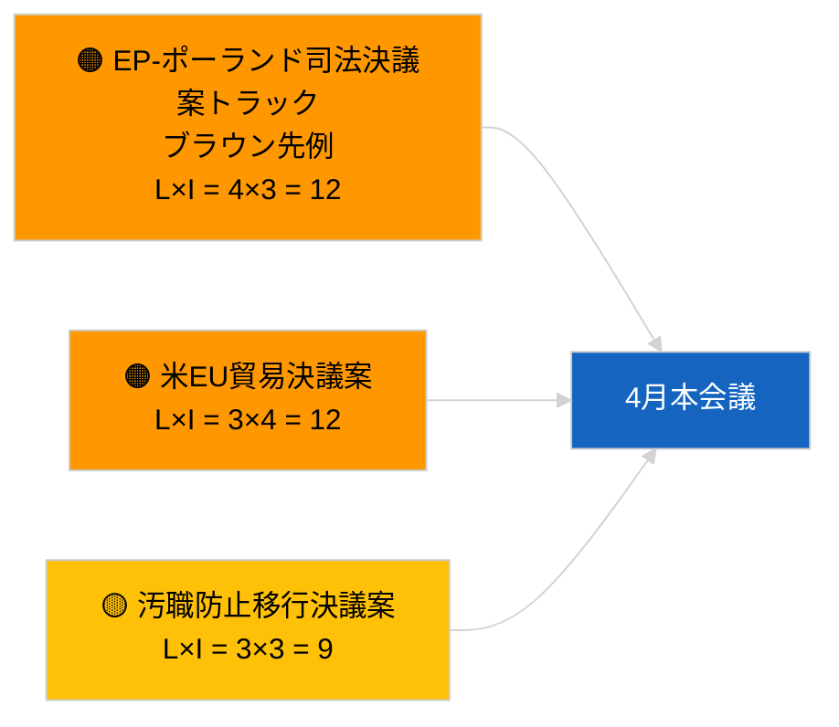

<!-- SPDX-FileCopyrightText: 2026 Hack23 AB -->
<!-- SPDX-License-Identifier: Apache-2.0 -->

# エグゼクティブ・ブリーフ — 決議案 | 2026-04-03

**分類：** OSINT | 公開議会記録  
**信頼度：** 🟢 高（休会期間の構造的評価、API 状態劣化）  
**作成日：** 2026-04-03T00:00:00Z（遡及ブリーフ）  
**記事種別：** 決議案  
**実行 ID：** `ddaeac0a-0829-43fb-8588-46bf89f410a4`  
**出典：** 欧州議会オープンデータポータル

---

## 🎯 BLUF

**2026-04-03 に新規決議案の提出なし；休会第 2 週（全 4 週）、姉妹記事 `breaking-2` により DEGRADED フィード状態を確認済み。** 実行 `ddaeac0a-0829-43fb-8588-46bf89f410a4` は **「0 件の政治的次元にわたる定量的リスクスコアリング」** を返却——分類済みアクターはゼロ、ROUTINE 重要度。4 月の決議案提出の第一波は 4 月 17〜20 日頃まで予想されない。3 月からの繰越決議案在庫が 4 月の監視リストを支配：ジョージアの政治囚（TA-10-2026-0083）、HDV 排出クレジット（TA-10-2026-0084）、米国関税（TA-10-2026-0096）、ブラウン先例の免責フォローアップ、汚職防止（TA-10-2026-0094）。**🟢 高信頼度** にて、空状態はカレンダーおよびフィード劣化によるものと判断。

---

## 🧭 このブリーフが支援する 3 つの意思決定

| # | 意思決定 | 決定者 | 期限 | 根拠 |
|:-:|----------|--------|:----:|------|
| 1 | **編集上：** 日次決議案をスキップ | 編集者 | +24h | 空実行 + DEGRADED フィード |
| 2 | **監視：** 4 月 17〜20 日の第一波決議案提出にフラグ設定 | アナリスト | 2026-04-17 | EP 提出パターン |
| 3 | **先読み：** シナリオ A（貿易）vs B（法の支配）vs C（経済）の提案構成をトラッキング | 分析リード | 2026-04-20 | 本会議前のキャリブレーション |

---

## 📰 60 秒で読む

- 🔴 **新規決議案の提出なし** 2026-04-03；休会中。（🟢 高）
- 🟠 **0 件のアクターを分類**；テンプレート状態「0 件の政治的次元にわたる定量的リスクスコアリング」。（🟢 高）
- 🟢 **3 月繰越提案**が 4 月監視リストを支配。（🟢 高）
- 🟡 **本日のリスク次元はすべて「なし」。**（🟢 高）
- 🔵 **経済的文脈：** 米国関税報復と汚職防止移行が中心課題。（🟢 高）
- 🟣 **相互参照：** 姉妹記事 `breaking-3` は 4 月にフォローアップ決議案を生む汚職防止改革クラスターを網羅。（🟢 高）
- 🩷 **混乱ベクトル：** 本日は急性なし。（🟢 高）
- ⚪ **先読み：** メルコスールの欧州司法裁判所意見書は公開時に決議案を引き起こす見込み。

---

## 🗂️ 主要文書 / 手続き — 決議案監視

| 順位 | EP 参照 | タイトル（短縮） | 重要度 | 信頼度 | 状態 |
|:---:|---------|-----------------|:------:|:------:|------|
| 1 | — | 2026-04-03 新規決議案なし | 0.0 | 🟢 HIGH | 休会 + DEGRADED フィード |
| 2 | TA-10-2026-0094 | 汚職防止指令フォローアップ決議案 | 8.0 | 🟢 HIGH | 3 月 26 日採択 |
| 3 | TA-10-2026-0083 | ジョージア政治囚（繰越） | 7.0 | 🟢 HIGH | 実施状況監視 |

---

## ⚠️ リスク・脅威スナップショット

| リスク | L | I | スコア | トリガー | 出典 | 海軍評価 |
|--------|:-:|:-:|:------:|---------|------|:-------:|
| EP-ポーランド司法決議案トラック | 4 | 3 | 12 | 新規免責事案 | TA-10-2026-0088 | A1 |
| 米 EU 貿易決議案 | 3 | 4 | 12 | 米国の行動 | TA-10-2026-0096 | A1 |
| 汚職防止フォローアップ決議案 | 3 | 3 | 9 | 国内移行摩擦 | TA-10-2026-0094 | A2 |

---

## 🔮 最重要先読みトリガー

**4 月の決議案提出第一波 〜4 月 17〜20 日 2026 年。** テーマ構成が 4 月本会議シナリオを較正する。

---

## 🛡️ 情報源品質評価

- **一次情報源：** 実行 `ddaeac0a-0829-43fb-8588-46bf89f410a4`；姉妹記事 `breaking-2` が DEGRADED フィード状態を確認。
- **信頼度：** 🟢 HIGH（カレンダー要因について）。

---

## 📎 リンク

| リンク | パス |
|--------|------|
| 記事 | `./article.md` |
| 姉妹記事 | `analysis/daily/2026-04-03/breaking/`, `breaking-2/`, `breaking-3/`, `committee-reports/`, `propositions/`, `week-ahead/` |
| マニフェスト | `./manifest.json` |

---

**文書管理**
- **テンプレート：** `/analysis/templates/executive-brief.md`
- **成果物パス：** `analysis/daily/2026-04-03/motions/executive-brief.md`
- **分類：** 公開
- **遡及生成：** バックフィルセッション。
