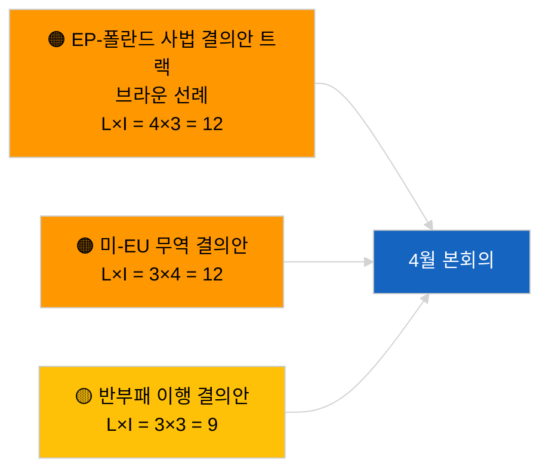

<!-- SPDX-FileCopyrightText: 2026 Hack23 AB -->
<!-- SPDX-License-Identifier: Apache-2.0 -->

# 집행 브리핑 — 결의안 | 2026-04-03

**분류:** OSINT | 공개 의회 기록  
**신뢰도:** 🟢 높음 (휴회 기간 구조적 평가, API 상태 저하)  
**작성일:** 2026-04-03T00:00:00Z (소급 브리핑)  
**기사 유형:** 결의안  
**실행 ID:** `ddaeac0a-0829-43fb-8588-46bf89f410a4`  
**출처:** 유럽의회 공개 데이터 포털

---

## 🎯 BLUF

**2026-04-03에 새로운 결의안 없음; 휴회 2주차(전체 4주), 자매 기사 `breaking-2`에 의해 저하된 피드 상태 확인됨.** 실행 `ddaeac0a-0829-43fb-8588-46bf89f410a4`는 **"0개의 식별된 정치적 차원에 걸친 정량적 위험 점수화"** 를 반환했습니다 — 분류된 행위자 없음, 일상적 중요도. 4월 첫 결의안 제출은 ~4월 17-20일 이전에는 예상되지 않습니다. 3월에서 이월된 결의안 재고가 4월 감시 목록을 지배합니다: 조지아 정치범 (TA-10-2026-0083), HDV 배출 크레딧 (TA-10-2026-0084), 미국 관세 (TA-10-2026-0096), 브라운 선례 면책 후속, 반부패 (TA-10-2026-0094). **🟢 높은 신뢰도** 로 공백 상태는 일정 및 피드 저하에 기인합니다.

---

## 🧭 이 브리핑이 지원하는 3가지 결정

| # | 결정 | 결정자 | 마감 | 근거 |
|:-:|------|--------|:----:|------|
| 1 | **편집:** 일일 결의안 건너뛰기 | 편집자 | +24시간 | 빈 실행 + 저하된 피드 |
| 2 | **모니터링:** 4월 17-20일 첫 번째 결의안 제출 물결 플래그 설정 | 분석가 | 2026-04-17 | EP 제출 패턴 |
| 3 | **선행 감시:** 시나리오 A(무역) vs B(법치주의) vs C(경제)에 대한 제안 구성 추적 | 분석 책임자 | 2026-04-20 | 본회의 전 보정 |

---

## 📰 60초 요약

- 🔴 **새로운 결의안 제출 없음** 2026-04-03; 휴회. (🟢 높음)
- 🟠 **0명의 행위자 분류**; 템플릿 상태 "0개의 식별된 정치적 차원에 걸친 정량적 위험 점수화". (🟢 높음)
- 🟢 **3월 이월 제안**이 4월 감시 목록 지배. (🟢 높음)
- 🟡 **오늘 모든 위험 차원 "없음".** (🟢 높음)
- 🔵 **경제적 맥락:** 미국 관세 보복과 반부패 이행이 지배. (🟢 높음)
- 🟣 **교차 참조:** 자매 기사 `breaking-3`은 4월에 후속 결의안을 생성할 반부패 개혁 클러스터를 다룸. (🟢 높음)
- 🩷 **혼란 벡터:** 오늘은 급박한 것 없음. (🟢 높음)
- ⚪ **선행 감시:** 메르코수르에 대한 유럽사법재판소 의견이 발표 시 결의안을 유발할 것으로 예상.

---

## 🗂️ 주요 문서 / 절차 — 결의안 감시

| 순위 | EP 참조 | 제목(약식) | 중요도 | 신뢰도 | 상태 |
|:---:|---------|-----------|:------:|:------:|------|
| 1 | — | 2026-04-03 새로운 결의안 없음 | 0.0 | 🟢 HIGH | 휴회 + 저하된 피드 |
| 2 | TA-10-2026-0094 | 반부패 지침 후속 결의안 | 8.0 | 🟢 HIGH | 3월 26일 채택 |
| 3 | TA-10-2026-0083 | 조지아 정치범 (이월) | 7.0 | 🟢 HIGH | 이행 모니터링 |

---

## ⚠️ 위험 및 위협 스냅샷

| 위험 | L | I | 점수 | 트리거 | 출처 | 해군 등급 |
|------|:-:|:-:|:----:|--------|------|:--------:|
| EP-폴란드 사법 결의안 트랙 | 4 | 3 | 12 | 새로운 면책 사례 | TA-10-2026-0088 | A1 |
| 미-EU 무역 결의안 | 3 | 4 | 12 | 미국 조치 | TA-10-2026-0096 | A1 |
| 반부패 후속 결의안 | 3 | 3 | 9 | 국내 전치 마찰 | TA-10-2026-0094 | A2 |

---

## 🔮 주요 선행 트리거

**4월 결의안 제출 첫 번째 물결 ~2026년 4월 17-20일.** 주제 구성이 4월 본회의 시나리오를 보정합니다.

---

## 🛡️ 정보 출처 품질 평가

- **1차 출처:** 실행 `ddaeac0a-0829-43fb-8588-46bf89f410a4`; 자매 기사 `breaking-2`가 저하된 피드 상태 확인.
- **신뢰도:** 🟢 HIGH (일정 요인에 대해).

---

## 📎 링크

| 링크 | 경로 |
|------|------|
| 기사 | `./article.md` |
| 자매 기사 | `analysis/daily/2026-04-03/breaking/`, `breaking-2/`, `breaking-3/`, `committee-reports/`, `propositions/`, `week-ahead/` |
| 매니페스트 | `./manifest.json` |

---

**문서 관리**
- **템플릿:** `/analysis/templates/executive-brief.md`
- **산출물 경로:** `analysis/daily/2026-04-03/motions/executive-brief.md`
- **분류:** 공개
- **소급 생성:** 백필 세션.
