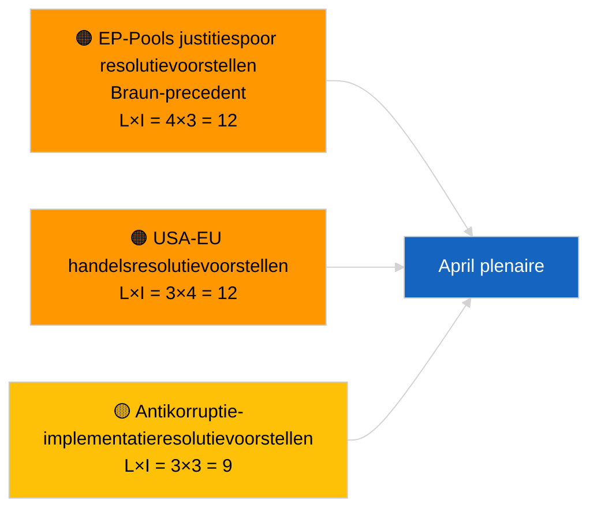

<!-- SPDX-FileCopyrightText: 2026 Hack23 AB -->
<!-- SPDX-License-Identifier: Apache-2.0 -->

# Uitvoerende briefing — Resolutievoorstellen | 2026-04-03

**Classificatie:** OSINT | Openbaar parlementair verslag  
**Betrouwbaarheidsniveau:** 🟢 Hoog (structurele beoordeling in recessperiode, GEDEGRADEERDE API-status)  
**Gegenereerd:** 2026-04-03T00:00:00Z (retrospectieve briefing)  
**Artikeltype:** Resolutievoorstellen  
**Uitvoering-ID:** `ddaeac0a-0829-43fb-8588-46bf89f410a4`  
**Bron:** Open dataportaal van het Europees Parlement

---

## 🎯 BLUF

**Geen nieuwe resolutievoorstellen ingediend op 2026-04-03; recessweek 2 van 4, GEDEGRADEERDE feedstatus bevestigd door zusterartikel `breaking-2`.** Uitvoering `ddaeac0a-0829-43fb-8588-46bf89f410a4` retourneerde **"Kwantitatieve risicobeoordeling over 0 geïdentificeerde politieke dimensies"** — nul geclassificeerde actoren, ROUTINEMATIGE betekenis. Eerste indiening van resolutievoorstellen in april wordt niet verwacht vóór ~17-20 april. De overgedragen resolutievoorstellen uit maart domineren de april-bewakingslijst: Georgische politieke gevangenen (TA-10-2026-0083), HDV-emissiekredieten (TA-10-2026-0084), Amerikaanse douanetarieven (TA-10-2026-0096), Braun-precedent immuniteitsnazorg, antikorruptie (TA-10-2026-0094). **🟢 HOOG betrouwbaarheidsniveau** dat de lege status kalender- en feed-degradatiegerelateerd is.

---

## 🧭 3 Beslissingen die deze briefing ondersteunt

| # | Beslissing | Wie beslist | Deadline | Bewijs |
|:-:|------------|-------------|:--------:|--------|
| 1 | **Redactioneel:** Dagelijkse resolutievoorstellen OVERSLAAN | Redacteur | +24u | Lege uitvoering + GEDEGRADEERDE feeds |
| 2 | **Monitoring:** Eerste golf van april-indieningsresolutievoorstellen 17–20 april markeren | Analist | 2026-04-17 | Indieningspatroon EP |
| 3 | **Vooruitblikkend:** Voorstelmenging volgen voor Scenario A (handel) vs B (rechtsstaat) vs C (economie) | Analyseleider | 2026-04-20 | Kalibrering voor plenaire |

---

## 📰 Lezing van 60 seconden

- 🔴 **Geen nieuwe resolutievoorstellen ingediend** op 2026-04-03; reces. (🟢 Hoog)
- 🟠 **0 actoren geclassificeerd**; sjabloonstatus "Kwantitatieve risicobeoordeling over 0 geïdentificeerde politieke dimensies". (🟢 Hoog)
- 🟢 **Overgedragen voorstellen uit maart** domineren de april-bewakingslijst. (🟢 Hoog)
- 🟡 **Alle risicodynamieken "geen"** vandaag. (🟢 Hoog)
- 🔵 **Economische context:** Amerikaanse handelsvergeldingstarieven en antikorruptie-implementatie domineren. (🟢 Hoog)
- 🟣 **Kruisverwijzing:** Zusterartikel `breaking-3` behandelt het antikorruptie-hervormingscluster dat in april vervolgresolutievoorstellen genereert. (🟢 Hoog)
- 🩷 **Verstoringsvektor:** geen acuut vandaag. (🟢 Hoog)
- ⚪ **Vooruitblikkend:** Mercosur HvJ-advies zal naar verwachting resolutievoorstellen uitlokken bij publicatie.

---

## 🗂️ Topdocumenten / Procedures — Resolutievoorstellen-bewaking

| Rang | EP-referentie | Titel (kort) | Betekenis | Betrouwbaarheid | Status |
|:----:|---------------|--------------|:---------:|:---------------:|--------|
| 1 | — | Geen nieuwe resolutievoorstellen 2026-04-03 | 0.0 | 🟢 HOOG | Reces + GEDEGRADEERDE feeds |
| 2 | TA-10-2026-0094 | Vervolgresolutievoorstellen antikorruptierichtlijn | 8.0 | 🟢 HOOG | Aangenomen 26 maart |
| 3 | TA-10-2026-0083 | Georgische politieke gevangenen (overgedragen) | 7.0 | 🟢 HOOG | Implementatiebewaking |

---

## ⚠️ Risico- en dreigingsoverzicht

| Risico | L | I | Score | Trigger | Bron | Admiraliteit |
|--------|:-:|:-:|:-----:|---------|------|:------------:|
| EP-Pools justitiespoor | 4 | 3 | 12 | Nieuwe immuniteitszaak | TA-10-2026-0088 | A1 |
| USA-EU handelsresolutievoorstellen | 3 | 4 | 12 | Amerikaanse actie | TA-10-2026-0096 | A1 |
| Antikorruptie vervolgresolutievoorstellen | 3 | 3 | 9 | Nationale transpostiefrictie | TA-10-2026-0094 | A2 |

---

## 🔮 Voornaamste vooruitblikkende trigger

**Eerste april-indieningsgolf van resolutievoorstellen ~17-20 april 2026.** Themenmenging kalibreeert het april-plenaire scenario.

---

## 🛡️ Beoordeling van bronkwaliteit

- **Primaire bronnen:** Uitvoering `ddaeac0a-0829-43fb-8588-46bf89f410a4`; zusterartikel `breaking-2` bevestigt GEDEGRADEERDE feedstatus.
- **Betrouwbaarheidsniveau:** 🟢 HOOG betreffende de kalenderdriver.

---

## 📎 Links

| Link | Pad |
|------|-----|
| Artikel | `./article.md` |
| Zusterartikelen | `analysis/daily/2026-04-03/breaking/`, `breaking-2/`, `breaking-3/`, `committee-reports/`, `propositions/`, `week-ahead/` |
| Manifest | `./manifest.json` |

---

**Documentbeheer**
- **Sjabloon:** `/analysis/templates/executive-brief.md`
- **Artefactpad:** `analysis/daily/2026-04-03/motions/executive-brief.md`
- **Classificatie:** Openbaar
- **Retrospectieve generatie:** Backfill-sessie.
