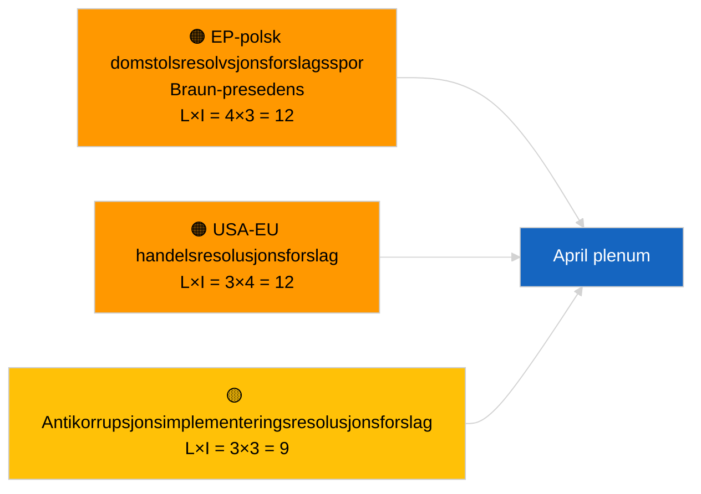

<!-- SPDX-FileCopyrightText: 2026 Hack23 AB -->
<!-- SPDX-License-Identifier: Apache-2.0 -->

# Ledersammendrag — Resolusjonsforslag | 2026-04-03

**Klassifisering:** OSINT | Offentlig parlamentarisk protokoll  
**Konfidensnivå:** 🟢 Høy (strukturell vurdering i resesseperiode, DEGRADERT API-tilstand)  
**Generert:** 2026-04-03T00:00:00Z (retrospektiv sammendrag)  
**Artikkeltype:** Resolusjonsforslag  
**Kjøring-ID:** `ddaeac0a-0829-43fb-8588-46bf89f410a4`  
**Kilde:** Europaparlamentets åpne dataportal

---

## 🎯 BLUF

**Ingen nye resolusjonsforslag fremmet 2026-04-03; resesseuke 2 av 4, DEGRADERT feedtilstand bekreftet av søskenartikkel `breaking-2`.** Kjøring `ddaeac0a-0829-43fb-8588-46bf89f410a4` returnerte **"Kvantitativ risikovurdering over 0 identifiserte politiske dimensjoner"** — null klassifiserte aktører, RUTINEMESSIG betydning. Første april-innlevering av resolusjonsforslag forventes ikke før ~17-20 april. Mars-overførte resolusjonsforslagsbeholdning dominerer april-overvåkingslisten: Georgias politiske fanger (TA-10-2026-0083), HDV-utslippskreditter (TA-10-2026-0084), amerikanske toldsatser (TA-10-2026-0096), Braun-presedens immunitetsoppfølging, antikorrupsjon (TA-10-2026-0094). **🟢 HØY konfidensnivå** at tom tilstand skyldes kalender- og feed-degradering.

---

## 🧭 3 Beslutninger dette sammendraget støtter

| # | Beslutning | Hvem bestemmer | Frist | Bevis |
|:-:|------------|----------------|:-----:|-------|
| 1 | **Redaksjonelt:** HOPP OVER daglige resolusjonsforslag | Redaktør | +24t | Tom kjøring + DEGRADERTE feeder |
| 2 | **Overvåking:** merk første april-resolusjonsforslagsbølge 17–20 april | Analytiker | 2026-04-17 | EPs innleveringsmønster |
| 3 | **Fremtidsrettet:** spor forslagsblanding for Scenario A (handel) vs B (rettsstat) vs C (økonomi) | Analyseleder | 2026-04-20 | Kalibrering før plenum |

---

## 📰 60-sekunders lesning

- 🔴 **Ingen nye resolusjonsforslag fremmet** 2026-04-03; resess. (🟢 Høy)
- 🟠 **0 aktører klassifisert**; maltilstand "Kvantitativ risikovurdering over 0 identifiserte politiske dimensjoner". (🟢 Høy)
- 🟢 **Mars-overføringsforslag** dominerer april-overvåkingslisten. (🟢 Høy)
- 🟡 **Alle risikodimensjoner "ingen"** i dag. (🟢 Høy)
- 🔵 **Økonomisk kontekst:** Amerikansk tollgjengjeldelse og antikorrupsjonsimplementering dominerer. (🟢 Høy)
- 🟣 **Kryssreferanse:** Søskenartikkelen `breaking-3` dekker antikorrupsjonsreformklyngen som vil generere oppfølgende resolusjonsforslag i april. (🟢 Høy)
- 🩷 **Forstyrrelsesvektor:** ingen akutt i dag. (🟢 Høy)
- ⚪ **Fremtidsrettet:** Mercosur ECJ-uttalelse ventes å utløse resolusjonsforslag ved publisering.

---

## 🗂️ Topdokumenter / Prosedyrer — Resolusjonsforslagsovervåking

| Rang | EP-referanse | Tittel (kort) | Betydning | Konfidensnivå | Status |
|:----:|--------------|---------------|:---------:|:-------------:|--------|
| 1 | — | Ingen nye resolusjonsforslag 2026-04-03 | 0.0 | 🟢 HØY | Resess + DEGRADERTE feeder |
| 2 | TA-10-2026-0094 | Antikorrupsjonsdirektivets oppfølgingsresolusjonsforslag | 8.0 | 🟢 HØY | Vedtatt 26. mars |
| 3 | TA-10-2026-0083 | Georgias politiske fanger (overføring) | 7.0 | 🟢 HØY | Implementeringsovervåking |

---

## ⚠️ Risiko- og trusseloversikt

| Risiko | L | I | Poeng | Utløser | Kilde | Admiralitet |
|--------|:-:|:-:|:-----:|---------|-------|:-----------:|
| EP-polsk domstolsresolvsjonsforslagsspor | 4 | 3 | 12 | Ny immunitetssak | TA-10-2026-0088 | A1 |
| USA-EU handelsresolusjonsforslag | 3 | 4 | 12 | Amerikansk handling | TA-10-2026-0096 | A1 |
| Antikorrupsjonsoppfølgingsresolusjonsforslag | 3 | 3 | 9 | Nasjonal implementeringsfriksjon | TA-10-2026-0094 | A2 |

---

## 🔮 Fremste fremtidsrettede utløser

**Første april-resolusjonsforslagsbølge ~17–20 april 2026.** Emneblanding kalibrerer april-plenarscenario.

---

## 🛡️ Vurdering av kildekvalitet

- **Primærkilder:** Kjøring `ddaeac0a-0829-43fb-8588-46bf89f410a4`; søskenartikkelen `breaking-2` bekrefter DEGRADERT feedtilstand.
- **Konfidensnivå:** 🟢 HØY vedrørende kalenderdriver.

---

## 📎 Lenker

| Lenke | Sti |
|-------|-----|
| Artikkel | `./article.md` |
| Søskenartikler | `analysis/daily/2026-04-03/breaking/`, `breaking-2/`, `breaking-3/`, `committee-reports/`, `propositions/`, `week-ahead/` |
| Manifest | `./manifest.json` |

---

**Dokumentkontroll**
- **Mal:** `/analysis/templates/executive-brief.md`
- **Artefaktsti:** `analysis/daily/2026-04-03/motions/executive-brief.md`
- **Klassifisering:** Offentlig
- **Retrospektiv generering:** Tilbakefyllingssesjon.
