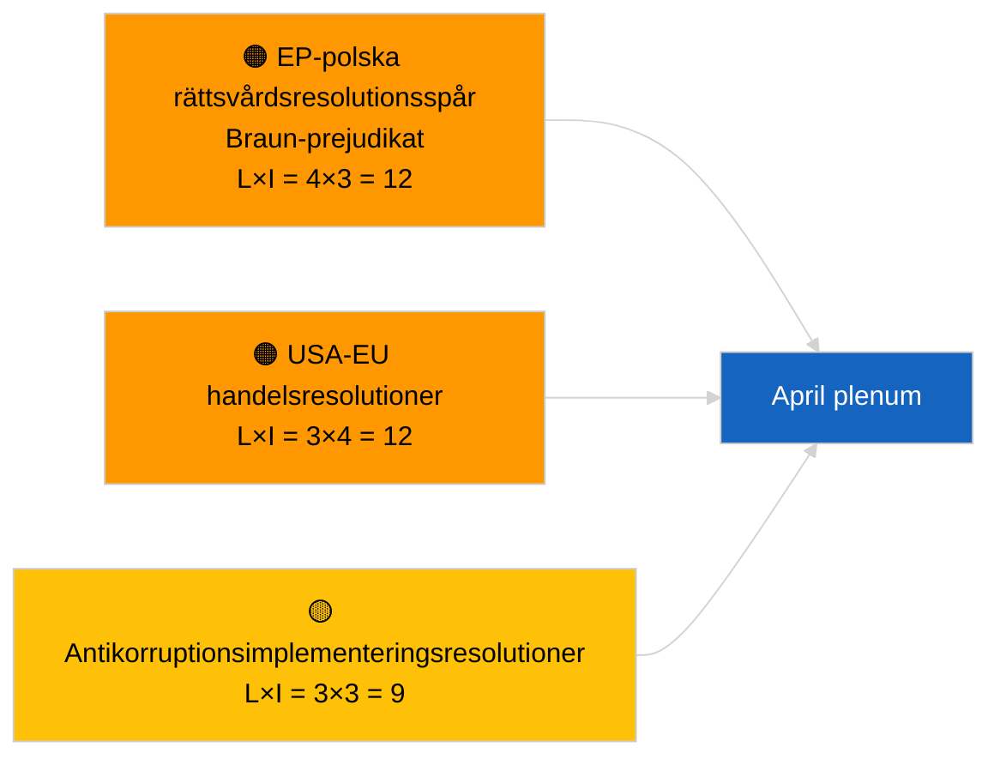

<!-- SPDX-FileCopyrightText: 2026 Hack23 AB -->
<!-- SPDX-License-Identifier: Apache-2.0 -->

# Exekutiv sammanfattning — Resolutioner | 2026-04-03

**Klassificering:** OSINT | Offentlig parlamentarisk handling  
**Konfidensgrad:** 🟢 Hög (strukturell bedömning under recessperiod, DEGRADERAT API-tillstånd)  
**Genererad:** 2026-04-03T00:00:00Z (retroaktiv sammanfattning)  
**Artikeltyp:** Resolutioner  
**Körnings-ID:** `ddaeac0a-0829-43fb-8588-46bf89f410a4`  
**Källa:** Europeiska parlamentets öppna dataportal

---

## 🎯 BLUF

**Inga nya resolutioner lades fram 2026-04-03; recessvecka 2 av 4, DEGRADERAT flödestillstånd bekräftat av syskonartikel `breaking-2`.** Körning `ddaeac0a-0829-43fb-8588-46bf89f410a4` returnerade **"Kvantitativ riskbedömning över 0 identifierade politiska dimensioner"** — noll klassificerade aktörer, RUTINMÄSSIG betydelse. Första april-tabling av resolutioner förväntas inte förrän ~17-20 april. Mars-resolutioners överfört inventarium dominerar april-bevakningslistan: Georgiens politiska fångar (TA-10-2026-0083), HDV-utsläppskrediter (TA-10-2026-0084), USA:s tullar (TA-10-2026-0096), Braun-prejudikatets immunitetsuppföljning, antikorruption (TA-10-2026-0094). **🟢 HÖG konfidensgrad** att tomt tillstånd beror på kalender- och flödesnedgradering.

---

## 🧭 3 Beslut som denna sammanfattning stöder

| # | Beslut | Vem beslutar | Tidsgräns | Bevis |
|:-:|--------|--------------|:---------:|-------|
| 1 | **Redaktionellt:** HOPPA ÖVER dagliga resolutioner | Redaktör | +24h | Tom körning + DEGRADERADE flöden |
| 2 | **Bevakning:** markera första april-resolutionsvågen 17–20 april | Analytiker | 2026-04-17 | EP:s tablingsmönster |
| 3 | **Framåtblickande:** spåra resolutionsmix för Scenario A (handel) vs B (rättsstat) vs C (ekonomi) | Analysledare | 2026-04-20 | Kalibrering inför plenum |

---

## 📰 60-sekunders läsning

- 🔴 **Inga nya resolutioner lagda** den 2026-04-03; recess. (🟢 Hög)
- 🟠 **0 aktörer klassificerade**; mallstatus "Kvantitativ riskbedömning över 0 identifierade politiska dimensioner". (🟢 Hög)
- 🟢 **Mars-resolutioner i överföring** dominerar april-bevakningslistan. (🟢 Hög)
- 🟡 **Alla riskdimensioner "inga"** idag. (🟢 Hög)
- 🔵 **Ekonomisk kontext:** USA:s tullretaliering och antikorruptionsimplementering dominerar. (🟢 Hög)
- 🟣 **Korsreferens:** Syskonartikeln `breaking-3` täcker antikorruptionsreformklustret som genererar uppföljningsresolutioner i april. (🟢 Hög)
- 🩷 **Störningsfaktor:** ingen akut idag. (🟢 Hög)
- ⚪ **Framåtfört:** Mercosur ECJ-yttrande väntas utlösa resolutioner vid publicering.

---

## 🗂️ Toppdokument / Förfaranden — Resolutionsbevakning

| Rang | EP-referens | Titel (kort) | Betydelse | Konfidensgrad | Status |
|:----:|-------------|--------------|:---------:|:-------------:|--------|
| 1 | — | Inga nya resolutioner 2026-04-03 | 0.0 | 🟢 HÖG | Recess + DEGRADERADE flöden |
| 2 | TA-10-2026-0094 | Antikorruptionsdirektivets uppföljningsresolutioner | 8.0 | 🟢 HÖG | Antagen 26 mars |
| 3 | TA-10-2026-0083 | Georgiens politiska fångar (överfört) | 7.0 | 🟢 HÖG | Implementeringsbevakning |

---

## ⚠️ Risk- och hotöversikt

| Risk | L | I | Poäng | Utlösare | Källa | Admiralitet |
|------|:-:|:-:|:-----:|----------|-------|:-----------:|
| EP-polska rättsvårdsresolutionsspår | 4 | 3 | 12 | Nytt immunitetsärende | TA-10-2026-0088 | A1 |
| USA-EU handelsresolutioner | 3 | 4 | 12 | USA:s åtgärd | TA-10-2026-0096 | A1 |
| Antikorruptionsuppföljningsresolutioner | 3 | 3 | 9 | Nationell implementeringsfrikt | TA-10-2026-0094 | A2 |

---

## 🔮 Främsta framåtblickande utlösare

**Första april-resolutionsvågen ~17–20 april 2026.** Ämnesfördelningen kalibrerar april-plenarscenario.

---

## 🛡️ Bedömning av källkvalitet

- **Primärkällor:** Körning `ddaeac0a-0829-43fb-8588-46bf89f410a4`; syskonartikeln `breaking-2` bekräftar DEGRADERAT flödestillstånd.
- **Konfidensgrad:** 🟢 HÖG beträffande kalenderdrivaren.

---

## 📎 Länkar

| Länk | Sökväg |
|------|--------|
| Artikel | `./article.md` |
| Syskonartikel | `analysis/daily/2026-04-03/breaking/`, `breaking-2/`, `breaking-3/`, `committee-reports/`, `propositions/`, `week-ahead/` |
| Manifest | `./manifest.json` |

---

**Dokumentkontroll**
- **Mall:** `/analysis/templates/executive-brief.md`
- **Artefaktsökväg:** `analysis/daily/2026-04-03/motions/executive-brief.md`
- **Klassificering:** Offentlig
- **Retroaktiv generering:** Bakåtfyllningssession.
