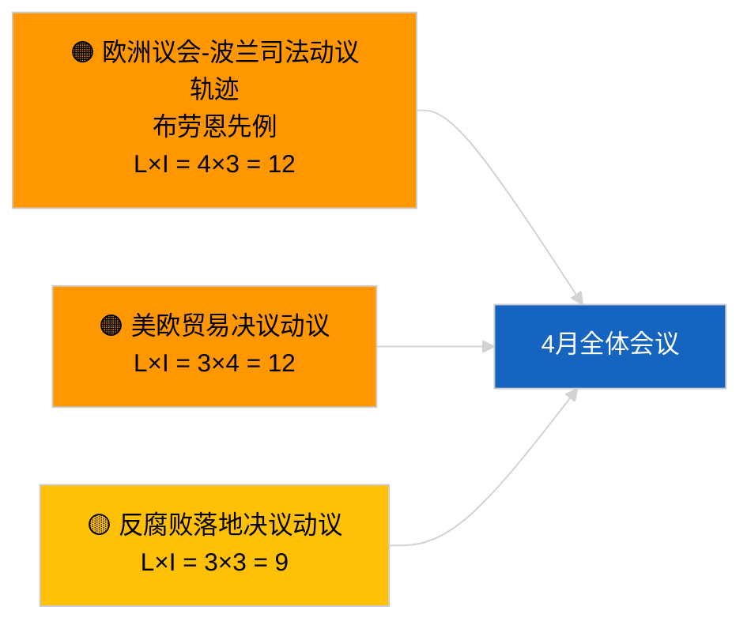

<!-- SPDX-FileCopyrightText: 2026 Hack23 AB -->
<!-- SPDX-License-Identifier: Apache-2.0 -->

# 执行简报 — 决议动议 | 2026-04-03

**分类：** OSINT | 公开议会档案  
**置信度：** 🟢 高（休会期结构性评估，API状态降级）  
**生成日期：** 2026-04-03T00:00:00Z（回溯性简报）  
**文章类型：** 决议动议  
**运行ID：** `ddaeac0a-0829-43fb-8588-46bf89f410a4`  
**数据来源：** 欧洲议会开放数据门户

---

## 🎯 BLUF

**2026-04-03无新决议动议提交；休会第2周（共4周），姊妹文章`breaking-2`确认数据馈送状态降级。** 运行`ddaeac0a-0829-43fb-8588-46bf89f410a4`返回**"0个已识别政治维度的定量风险评分"**——零个分类参与者，例行重要性。首批4月决议动议预计最早在4月17-20日左右提交。3月结转的决议动议库存主导4月监控名单：格鲁吉亚政治犯（TA-10-2026-0083）、HDV排放信用（TA-10-2026-0084）、美国关税（TA-10-2026-0096）、布劳恩先例豁免后续、反腐败（TA-10-2026-0094）。**🟢 高置信度**：空白状态由日历安排和数据馈送降级驱动。

---

## 🧭 本简报支持的3项决策

| # | 决策 | 决策者 | 截止时间 | 依据 |
|:-:|------|--------|:--------:|------|
| 1 | **编辑：** 跳过每日决议动议 | 编辑 | +24小时 | 空白运行 + 降级馈送 |
| 2 | **监控：** 标记4月17-20日首批4月动议提交浪潮 | 分析师 | 2026-04-17 | 欧洲议会提交规律 |
| 3 | **前瞻性：** 追踪情景A（贸易）vs B（法治）vs C（经济）的提案构成 | 分析负责人 | 2026-04-20 | 全体会议前校准 |

---

## 📰 60秒速览

- 🔴 **2026-04-03无新决议动议提交**；休会期。（🟢 高）
- 🟠 **0个参与者分类**；模板状态"0个已识别政治维度的定量风险评分"。（🟢 高）
- 🟢 **3月结转动议**主导4月监控名单。（🟢 高）
- 🟡 **今日所有风险维度均为"无"。**（🟢 高）
- 🔵 **经济背景：** 美国关税报复与反腐败立法落地主导议程。（🟢 高）
- 🟣 **交叉参考：** 姊妹文章`breaking-3`涵盖将在4月产生后续决议动议的反腐改革集群。（🟢 高）
- 🩷 **破坏性因素：** 今日无紧急情况。（🟢 高）
- ⚪ **前瞻性：** 梅卡多南方欧盟法院意见预计在发布时引发决议动议。

---

## 🗂️ 重点文件 / 程序 — 决议动议监控

| 排名 | 欧洲议会参考 | 标题（简短） | 重要性 | 置信度 | 状态 |
|:---:|-------------|------------|:------:|:------:|------|
| 1 | — | 2026-04-03无新决议动议 | 0.0 | 🟢 HIGH | 休会 + 降级馈送 |
| 2 | TA-10-2026-0094 | 反腐败指令后续动议 | 8.0 | 🟢 HIGH | 3月26日通过 |
| 3 | TA-10-2026-0083 | 格鲁吉亚政治犯（结转） | 7.0 | 🟢 HIGH | 实施监控 |

---

## ⚠️ 风险与威胁快照

| 风险 | L | I | 评分 | 触发因素 | 来源 | 海军评级 |
|------|:-:|:-:|:---:|---------|------|:-------:|
| 欧洲议会-波兰司法动议轨迹 | 4 | 3 | 12 | 新豁免案件 | TA-10-2026-0088 | A1 |
| 美欧贸易决议动议 | 3 | 4 | 12 | 美方行动 | TA-10-2026-0096 | A1 |
| 反腐败后续动议 | 3 | 3 | 9 | 国内移植摩擦 | TA-10-2026-0094 | A2 |

---

## 🔮 首要前瞻性触发因素

**首批4月决议动议提交浪潮 ~2026年4月17-20日。** 主题构成校准4月全体会议情景。

---

## 🛡️ 信息来源质量评估

- **主要来源：** 运行`ddaeac0a-0829-43fb-8588-46bf89f410a4`；姊妹文章`breaking-2`确认降级馈送状态。
- **置信度：** 🟢 HIGH（关于日历驱动因素）。

---

## 📎 链接

| 链接 | 路径 |
|------|------|
| 文章 | `./article.md` |
| 姊妹文章 | `analysis/daily/2026-04-03/breaking/`, `breaking-2/`, `breaking-3/`, `committee-reports/`, `propositions/`, `week-ahead/` |
| 清单 | `./manifest.json` |

---

**文档控制**
- **模板：** `/analysis/templates/executive-brief.md`
- **制品路径：** `analysis/daily/2026-04-03/motions/executive-brief.md`
- **分类：** 公开
- **回溯性生成：** 补充数据会话。
