# Propositions — 2026-04-03

<h2 id="section-executive-brief">Executive Brief</h2>

### 🎯 BLUF

**No new Commission propositions or EP own-initiative procedures opened on 2026-04-03.** Run `9be5bca6-de96-4303-80ff-33cb5f24b51b` returned **"Quantitative risk scoring across 0 identified political dimensions"** — zero classified actors, ROUTINE significance. `get_procedures_feed` is among the failed endpoints confirmed by sibling `breaking-2` (DEGRADED API state, 5/8 mandatory feeds failing). Substantive propositions inventory entering April is the inherited pipeline: anti-corruption directive transposition cycle (TA-10-2026-0094), HDV emissions framework (TA-10-2026-0084), ECB Vice-President procedure (TA-10-2026-0060), Better Law-Making baseline (TA-10-2026-0063), and the pending EU-Mercosur ECJ referral (TA-10-2026-0008). **🟢 HIGH confidence** empty state is calendar + DEGRADED feed driven.

---

### 🧭 3 Decisions This Brief Supports

| # | Decision | Who Decides | Deadline | Evidence |
|:-:|----------|-------------|:--------:|----------|
| 1 | **Editorial:** SKIP propositions daily | Editor | +24h | Empty run + DEGRADED feeds |
| 2 | **Monitoring:** include in 2026-04-14 post-recess restoration probe | Data pipeline | 2026-04-14 | First post-Easter weekday |
| 3 | **Forward-watch:** Commission Tuesday meeting 7 April 2026 — first post-Easter college tabling | Analysis lead | 2026-04-07 | Commission cadence |

---

### 📰 60-Second Read

- 🔴 **No new procedures** on 2026-04-03; `get_procedures_feed` timeout across 3 probes. (🟢 High)
- 🟠 **0 actors classified**; ROUTINE significance. (🟢 High)
- 🟢 **Pipeline carry-over** anchors watch list. (🟢 High)
- 🟡 **Risk dimensions all "none"** today. (🟢 High)
- 🔵 **Economic context:** anticipated Q2 propositions on AI Act implementing rules, Defence Industrial Strategy, MFF prep. (🟡 Medium)
- 🟣 **Cross-reference:** sibling `breaking-2` formalises DEGRADED API state. (🟢 High)
- 🩷 **Disruption vector:** US trade pressure may force a fast-track Commission proposition in April. (🟡 Medium)
- ⚪ **Carry-forward:** Mercosur ECJ opinion remains the highest-impact pending trigger.

---

### 🗂️ Top Documents / Procedures — Propositions Watch

| Rank | EP reference | Title (short) | Significance | Confidence | Status |
|:----:|--------------|---------------|:------------:|:----------:|--------|
| 1 | — | No new propositions on 2026-04-03 | 0.0 | 🟢 HIGH | DEGRADED feeds |
| 2 | TA-10-2026-0094 | Anti-corruption directive (transposition cycle) | 9.0 | 🟢 HIGH | Adopted 26 March |
| 3 | TA-10-2026-0008 | EU-Mercosur ECJ referral (pending) | 8.0 | 🟡 MEDIUM | Court opinion expected |

---

### ⚠️ Risk & Threat Snapshot

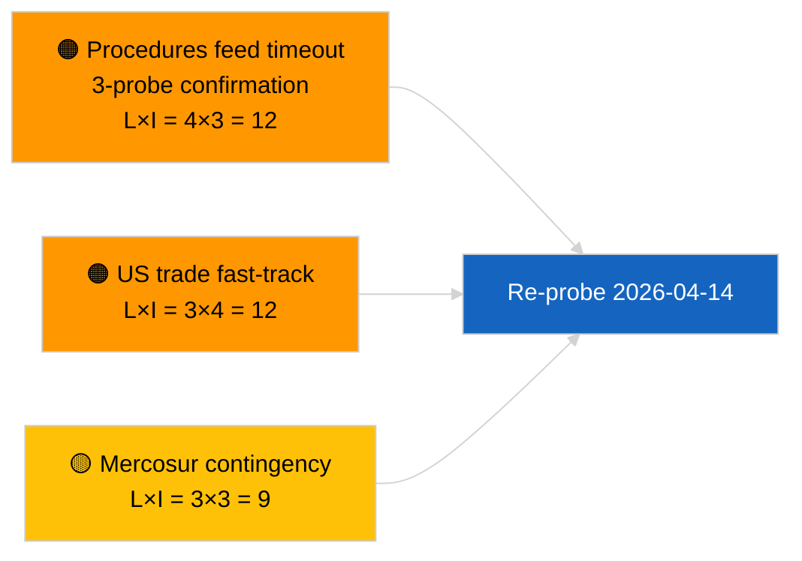
```mermaid
%%{init: {"theme":"dark"}}%%
graph LR
    R1["🟠 Procedures feed timeout<br/>3-probe confirmation<br/>L×I = 4×3 = 12"] --> CONS["Re-probe 2026-04-14"]
    R2["🟠 US trade fast-track<br/>L×I = 3×4 = 12"] --> CONS
    R3["🟡 Mercosur contingency<br/>L×I = 3×3 = 9"] --> CONS
    style R1 fill:#FF9800,color:#000000
    style R2 fill:#FF9800,color:#000000
    style R3 fill:#FFC107,color:#000000
    style CONS fill:#1565C0,color:#FFFFFF
```

| Risk | L | I | Score | Trigger | Source | Admiralty |
|------|:-:|:-:|:-----:|---------|--------|:---------:|
| Procedures-feed timeout | 4 | 3 | 12 | Persistence past 14 April | Sibling `breaking-2` | A1 |
| US trade fast-track proposition | 3 | 4 | 12 | US action | TA-10-2026-0096 | A1 |
| Mercosur opinion contingency | 3 | 3 | 9 | Court releases | TA-10-2026-0008 | A2 |

---

### 🔮 Top Forward Trigger

**Commission Tuesday meeting 7 April 2026** — first post-Easter college tabling.

---

### 🛡️ Source Quality Assessment

- **Primary sources:** Run `9be5bca6-de96-4303-80ff-33cb5f24b51b`; sibling `breaking-2`.
- **Confidence:** 🟢 HIGH on driver classification.

---

### 📎 Links

| Link | Path |
|------|------|
| Article | `./article.md` |
| Sibling runs | All 2026-04-03 runs (see folder) |
| Manifest | `./manifest.json` |

---

**Document Control**
- **Template:** `/analysis/templates/executive-brief.md`
- **Artifact path:** `analysis/daily/2026-04-03/propositions/executive-brief.md`
- **Classification:** Public
- **Retrospective generation:** Back-fill session.

<h2 id="reader-intelligence-guide">Reader Intelligence Guide</h2>

Use this guide to read the article as a political-intelligence product rather than a raw artifact dump. High-value reader lenses appear first; technical provenance remains available in the audit appendices.

| Reader need | What you'll get | Source artifact |
|---|---|---|
| [BLUF and editorial decisions](#section-executive-brief) | fast answer to what happened, why it matters, who is accountable, and the next dated trigger | `executive-brief.md` |
| [Actors and forces](#section-actors-forces) | who is driving the story, what political forces line up behind them, and which institutional levers they can pull | `classification/actor-mapping.md` |
| [Coalitions and voting](#section-coalitions-voting) | political group alignment, voting evidence, and coalition pressure points | `existing/voting-patterns.md` |
| [Risk assessment](#section-risk) | policy, institutional, coalition, communications, and implementation risk register | `risk-scoring/risk-matrix.md` |
| [Threat landscape](#section-threat) | hostile actors, attack vectors, consequence trees, and legislative-disruption pathways | `threat-assessment/actor-threat-profiles.md` |
| [Cross-run continuity](#section-continuity) | what changed since prior sessions and how confidence shifted between runs | `existing/cross-session-intelligence.md` |
| [Deep analysis](#section-deep-analysis) | long-form Economist-style explanation for readers who want the full argument | `existing/deep-analysis.md` |
| [Supplementary intelligence](#section-supplementary-intelligence) | additional markdown discovered in the run that has not yet been assigned to a canonical section | `executive-brief_ar.md` |

<h2 id="section-actors-forces">Actors & Forces</h2>

### Actor Mapping

### Actors Identified: 0

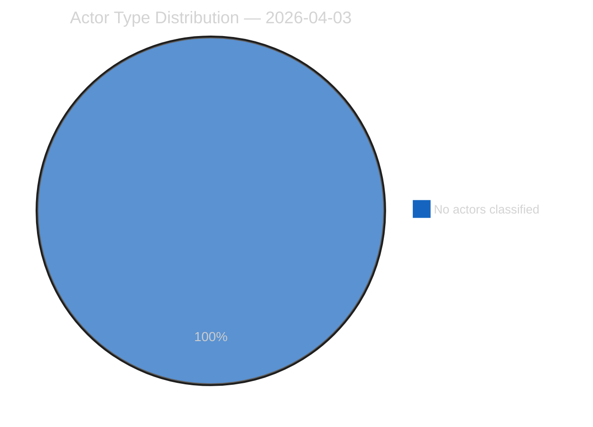
```mermaid
%%{init: {"theme":"dark","themeVariables":{"primaryColor":"#1565C0","primaryTextColor":"#ffffff","primaryBorderColor":"#0A3F7F","lineColor":"#90CAF9","secondaryColor":"#2E7D32","secondaryTextColor":"#ffffff","secondaryBorderColor":"#0F3F00","tertiaryColor":"#FF9800","tertiaryTextColor":"#000000","tertiaryBorderColor":"#7F4F00","mainBkg":"#1565C0","secondBkg":"#2E7D32","tertiaryBkg":"#FF9800","noteBkgColor":"#FFC107","noteTextColor":"#000000","noteBorderColor":"#7F6000","errorBkgColor":"#D32F2F","errorTextColor":"#ffffff","fontFamily":"Inter, Helvetica, Arial, sans-serif","pie1":"#1565C0","pie2":"#2E7D32","pie3":"#FF9800","pie4":"#D32F2F","pie5":"#FFC107","pie6":"#7B1FA2","pie7":"#9E9E9E","pie8":"#0288D1","pie9":"#388E3C","pie10":"#F57C00","pie11":"#C62828","pie12":"#FBC02D","pieTitleTextSize":"18px","pieSectionTextSize":"14px","pieLegendTextSize":"13px","pieStrokeColor":"#1e1e1e","pieOuterStrokeColor":"#1e1e1e","git0":"#1565C0","git1":"#2E7D32","git2":"#FF9800","git3":"#D32F2F","gitBranchLabel0":"#ffffff","gitBranchLabel1":"#ffffff","gitBranchLabel2":"#000000","gitBranchLabel3":"#ffffff","cScale0":"#1565C0","cScale1":"#2E7D32","cScale2":"#FF9800","cScale3":"#D32F2F","cScale4":"#FFC107","cScale5":"#7B1FA2","cScale6":"#9E9E9E","cScale7":"#0288D1","xyChart":{"backgroundColor":"#1e1e1e","plotColorPalette":"#1565C0,#2E7D32,#FF9800,#D32F2F,#FFC107,#7B1FA2,#9E9E9E"}}}}%%
pie title Actor Type Distribution — 2026-04-03
    "No actors classified" : 1
```

### Actor Classification

| Actor | Type | Influence | Position | Role |
|-------|------|-----------|----------|------|
| — | — | — | — | — |

### Type Counts

| Type | Count |
|------|-------|
| — | 0 |

### Date: 2026-04-03

### Forces Analysis

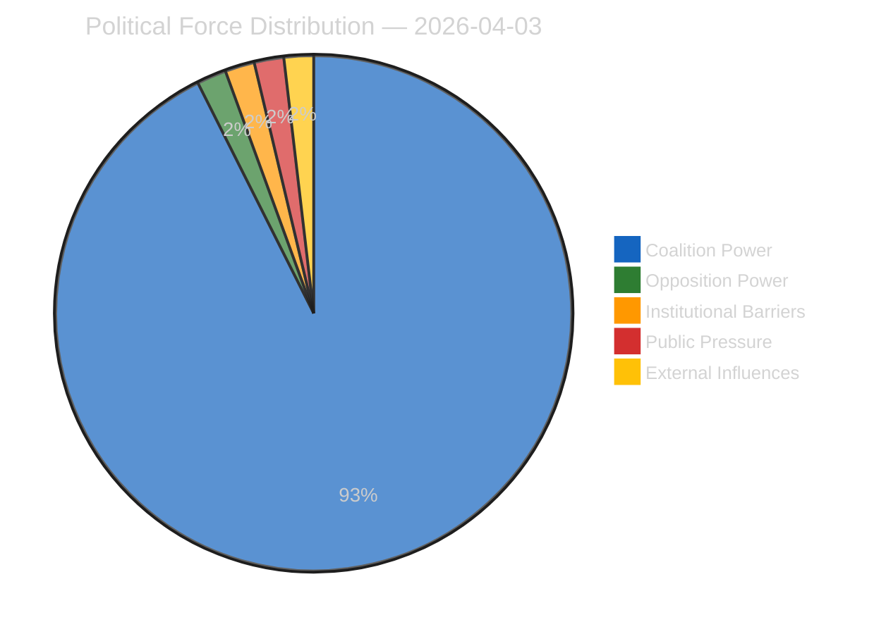
```mermaid
%%{init: {"theme":"dark","themeVariables":{"primaryColor":"#1565C0","primaryTextColor":"#ffffff","primaryBorderColor":"#0A3F7F","lineColor":"#90CAF9","secondaryColor":"#2E7D32","secondaryTextColor":"#ffffff","secondaryBorderColor":"#0F3F00","tertiaryColor":"#FF9800","tertiaryTextColor":"#000000","tertiaryBorderColor":"#7F4F00","mainBkg":"#1565C0","secondBkg":"#2E7D32","tertiaryBkg":"#FF9800","noteBkgColor":"#FFC107","noteTextColor":"#000000","noteBorderColor":"#7F6000","errorBkgColor":"#D32F2F","errorTextColor":"#ffffff","fontFamily":"Inter, Helvetica, Arial, sans-serif","pie1":"#1565C0","pie2":"#2E7D32","pie3":"#FF9800","pie4":"#D32F2F","pie5":"#FFC107","pie6":"#7B1FA2","pie7":"#9E9E9E","pie8":"#0288D1","pie9":"#388E3C","pie10":"#F57C00","pie11":"#C62828","pie12":"#FBC02D","pieTitleTextSize":"18px","pieSectionTextSize":"14px","pieLegendTextSize":"13px","pieStrokeColor":"#1e1e1e","pieOuterStrokeColor":"#1e1e1e","git0":"#1565C0","git1":"#2E7D32","git2":"#FF9800","git3":"#D32F2F","gitBranchLabel0":"#ffffff","gitBranchLabel1":"#ffffff","gitBranchLabel2":"#000000","gitBranchLabel3":"#ffffff","cScale0":"#1565C0","cScale1":"#2E7D32","cScale2":"#FF9800","cScale3":"#D32F2F","cScale4":"#FFC107","cScale5":"#7B1FA2","cScale6":"#9E9E9E","cScale7":"#0288D1","xyChart":{"backgroundColor":"#1e1e1e","plotColorPalette":"#1565C0,#2E7D32,#FF9800,#D32F2F,#FFC107,#7B1FA2,#9E9E9E"}}}}%%
pie title Political Force Distribution — 2026-04-03
    "Coalition Power" : 50
    "Opposition Power" : 1
    "Institutional Barriers" : 1
    "Public Pressure" : 1
    "External Influences" : 1
```

### Forces Data

| Force | Trend | Strength | Key Actors | Confidence |
|-------|-------|----------|------------|------------|
| Coalition Power | stable | 50% | — | low |
| Opposition Power | stable | 0% | — | low |
| Institutional Barriers | stable | 0% | — | low |
| Public Pressure | stable | 0% | — | low |
| External Influences | stable | 0% | — | low |

### Balance

| Metric | Value |
|--------|-------|
| Coalition vs Opposition | 50% vs 1% |
| Dominant force | Coalition |
| Date | 2026-04-03 |

### Date: 2026-04-03

### Impact Matrix

### Overall Significance: **ROUTINE**

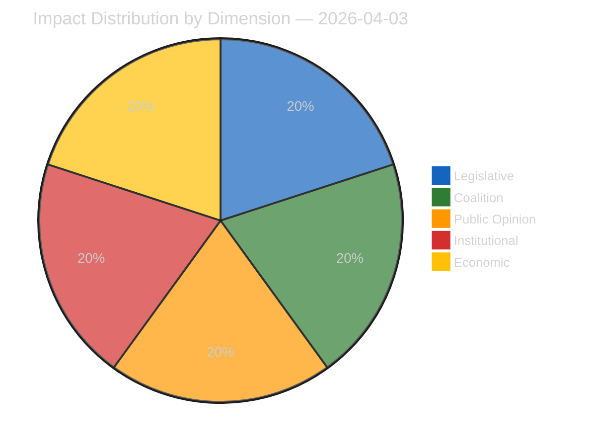
```mermaid
%%{init: {"theme":"dark","themeVariables":{"primaryColor":"#1565C0","primaryTextColor":"#ffffff","primaryBorderColor":"#0A3F7F","lineColor":"#90CAF9","secondaryColor":"#2E7D32","secondaryTextColor":"#ffffff","secondaryBorderColor":"#0F3F00","tertiaryColor":"#FF9800","tertiaryTextColor":"#000000","tertiaryBorderColor":"#7F4F00","mainBkg":"#1565C0","secondBkg":"#2E7D32","tertiaryBkg":"#FF9800","noteBkgColor":"#FFC107","noteTextColor":"#000000","noteBorderColor":"#7F6000","errorBkgColor":"#D32F2F","errorTextColor":"#ffffff","fontFamily":"Inter, Helvetica, Arial, sans-serif","pie1":"#1565C0","pie2":"#2E7D32","pie3":"#FF9800","pie4":"#D32F2F","pie5":"#FFC107","pie6":"#7B1FA2","pie7":"#9E9E9E","pie8":"#0288D1","pie9":"#388E3C","pie10":"#F57C00","pie11":"#C62828","pie12":"#FBC02D","pieTitleTextSize":"18px","pieSectionTextSize":"14px","pieLegendTextSize":"13px","pieStrokeColor":"#1e1e1e","pieOuterStrokeColor":"#1e1e1e","git0":"#1565C0","git1":"#2E7D32","git2":"#FF9800","git3":"#D32F2F","gitBranchLabel0":"#ffffff","gitBranchLabel1":"#ffffff","gitBranchLabel2":"#000000","gitBranchLabel3":"#ffffff","cScale0":"#1565C0","cScale1":"#2E7D32","cScale2":"#FF9800","cScale3":"#D32F2F","cScale4":"#FFC107","cScale5":"#7B1FA2","cScale6":"#9E9E9E","cScale7":"#0288D1","xyChart":{"backgroundColor":"#1e1e1e","plotColorPalette":"#1565C0,#2E7D32,#FF9800,#D32F2F,#FFC107,#7B1FA2,#9E9E9E"}}}}%%
pie title Impact Distribution by Dimension — 2026-04-03
    "Legislative" : 5
    "Coalition" : 5
    "Public Opinion" : 5
    "Institutional" : 5
    "Economic" : 5
```

### Impact Dimensions

| Dimension | Level | Indicator | Numeric |
|-----------|-------|-----------|---------|
| Legislative | none | 🟢 | 5 |
| Coalition | none | 🟢 | 5 |
| Public Opinion | none | 🟢 | 5 |
| Institutional | none | 🟢 | 5 |
| Economic | none | 🟢 | 5 |

### Summary

| Metric | Value |
|--------|-------|
| Overall significance | ROUTINE |
| Highest impact | Legislative |
| Date | 2026-04-03 |

### Date: 2026-04-03

### Significance Assessment

### Overall Significance: **ROUTINE**

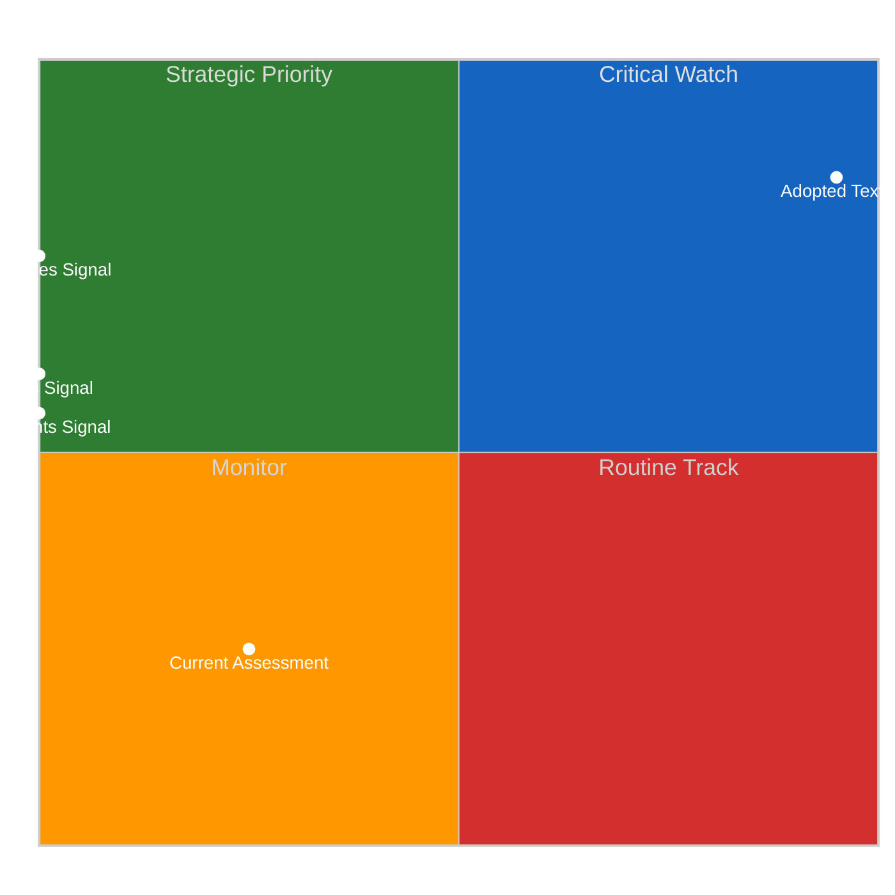
```mermaid
%%{init: {
  "theme": "dark",
  "themeVariables": {
    "quadrant1Fill": "#1565C0",
    "quadrant2Fill": "#2E7D32",
    "quadrant3Fill": "#FF9800",
    "quadrant4Fill": "#D32F2F",
    "quadrantTitleFill": "#ffffff",
    "quadrantPointFill": "#ffffff",
    "quadrantPointTextFill": "#ffffff",
    "quadrantXAxisTextFill": "#ffffff",
    "quadrantYAxisTextFill": "#ffffff"
  },
  "quadrantChart": {
    "chartWidth": 700,
    "chartHeight": 700,
    "pointLabelFontSize": 14,
    "titleFontSize": 22,
    "quadrantLabelFontSize": 18,
    "xAxisLabelFontSize": 16,
    "yAxisLabelFontSize": 16
  }
}}%%
quadrantChart
    title Political Significance Assessment — 2026-04-03
    x-axis Low Volume --> High Volume
    y-axis Low Impact --> High Impact
    quadrant-1 Critical Watch
    quadrant-2 Strategic Priority
    quadrant-3 Monitor
    quadrant-4 Routine Track
    Current Assessment: [0.25, 0.25]
    Events Signal: [0.00, 0.60]
    Documents Signal: [0.00, 0.55]
    Procedures Signal: [0.00, 0.75]
    Adopted Texts: [0.95, 0.85]
```

### 5-Signal Model Scores

| Signal | Raw Data | Score |
|--------|----------|-------|
| Volume | 0 events, 0 documents | 0.0/5 |
| Pipeline | 0 procedures | 0.0/5 |
| Output | 114 adopted texts | 5.0/5 |
| Anomalies | Pattern deviation detection | — |
| Coalition | Group alignment analysis | — |

### Data Summary

| Metric | Value |
|--------|-------|
| Computed significance | ROUTINE |
| Total data points | 114 |
| Events | 0 |
| Documents | 0 |
| Procedures | 0 |
| Adopted texts | 114 |
| Date | 2026-04-03 |

### Date: 2026-04-03

<h2 id="section-coalitions-voting">Coalitions & Voting</h2>

### Voting Patterns

### Detected Trends (Script-Generated Context)
| Trend ID | Direction | Confidence | Data Points |
|----------|-----------|------------|-------------|
| No trend data available from voting records | — | — | — |

### Computed Summary
- **Trends identified**: 0
- **Records analysed**: 0

### AI Analysis Prompt

> **Instructions for AI Agent (Opus 4.6):** Using the voting pattern data above and the adopted texts from EP MCP feeds, produce a voting pattern intelligence analysis. Your analysis MUST:
>
> 1. **Identify voting blocs**: Which groups consistently vote together on recent adopted texts?
> 2. **Detect anomalies**: Any unexpected votes, close margins (<50 vote difference), or high abstention rates?
> 3. **Analyse by policy domain**: Do voting patterns differ between economic, environmental, and social legislation?
> 4. **Group discipline assessment**: Rate each major group's internal cohesion (high/medium/low) with evidence
> 5. **Trend detection**: Compare recent voting patterns to historical trends — is the Parliament becoming more/less fragmented?
> 6. **Forward-looking**: Which upcoming votes are likely to be contested based on current alignment patterns?
>
> If voting records are limited, analyse the adopted texts' policy positions to infer likely voting alignments and coalition patterns.

### AI-Produced Voting Intelligence

[TO BE FILLED BY AI AGENT — Substantive voting pattern analysis with specific vote references, group cohesion ratings, and anomaly detection. Quality gate: minimum 300 words.]

### Date: 2026-04-03

<h2 id="section-risk">Risk Assessment</h2>

### Risk Matrix

### Overview

Quantitative risk scoring across 0 identified political dimensions.
This matrix uses a standardized likelihood × impact framework to quantify and
prioritize political risks affecting the European Parliament legislative process.

### Risk Heat Map

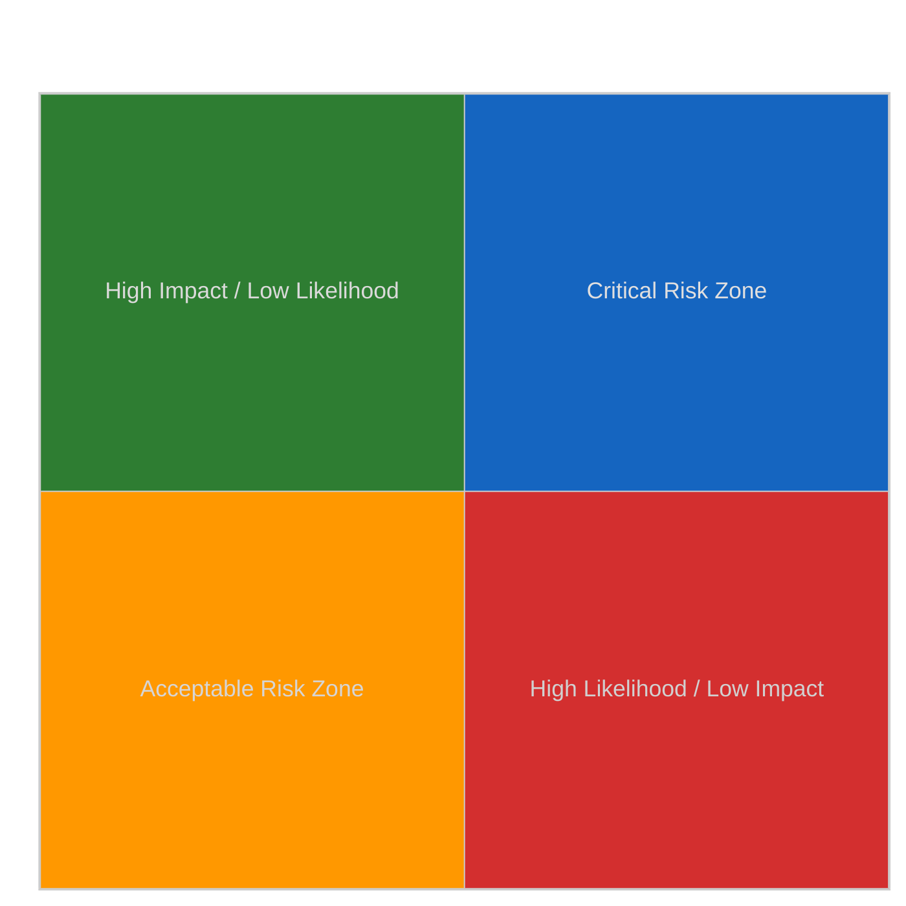
```mermaid
%%{init: {
  "theme": "dark",
  "themeVariables": {
    "quadrant1Fill": "#1565C0",
    "quadrant2Fill": "#2E7D32",
    "quadrant3Fill": "#FF9800",
    "quadrant4Fill": "#D32F2F",
    "quadrantTitleFill": "#ffffff",
    "quadrantPointFill": "#ffffff",
    "quadrantPointTextFill": "#ffffff",
    "quadrantXAxisTextFill": "#ffffff",
    "quadrantYAxisTextFill": "#ffffff"
  },
  "quadrantChart": {
    "chartWidth": 700,
    "chartHeight": 700,
    "pointLabelFontSize": 14,
    "titleFontSize": 22,
    "quadrantLabelFontSize": 18,
    "xAxisLabelFontSize": 16,
    "yAxisLabelFontSize": 16
  }
}}%%
quadrantChart
    title Political Risk Heat Map — 2026-04-03
    x-axis Low Likelihood --> High Likelihood
    y-axis Low Impact --> High Impact
    quadrant-1 Critical Risk Zone
    quadrant-2 High Impact / Low Likelihood
    quadrant-3 Acceptable Risk Zone
    quadrant-4 High Likelihood / Low Impact

```

### Risk Matrix

| Risk ID | Description | Likelihood | Impact | Score | Level |
|---------|-------------|------------|--------|-------|-------|
| — | — | — | — | — | — |

> **Risk Score** = Likelihood × Impact. **Levels**: 🟢 LOW (≤1.0), 🟡 MEDIUM (≤2.0), 🟠 HIGH (≤3.5), 🔴 CRITICAL (>3.5)

### Risk Assessment Details

| — | — | — | — | — | — |

### Risk Mitigation Framework

| Risk Level | Count | Tolerance | Action Required |
|------------|-------|-----------|-----------------|
| 🔴 CRITICAL | 0 | Zero tolerance | Immediate escalation |
| 🟠 HIGH | 0 | Low tolerance | Active mitigation |
| 🟡 MEDIUM | 0 | Moderate | Enhanced monitoring |
| 🟢 LOW | 0 | Acceptable | Routine tracking |

### Date: 2026-04-03

### Quantitative Swot

### Executive Summary

**Strategic Position Score**: 3.4/10
**Overall Assessment**: Weak strategic position: weaknesses and threats dominate — urgent mitigation needed.
**Analysis Date**: 2026-04-03

> This SWOT analysis is derived from 0 procedures, 0 events, 114 adopted texts, 0 documents, 0 voting records, and 0 coalition data points fetched from the European Parliament.

### SWOT Quadrant Chart

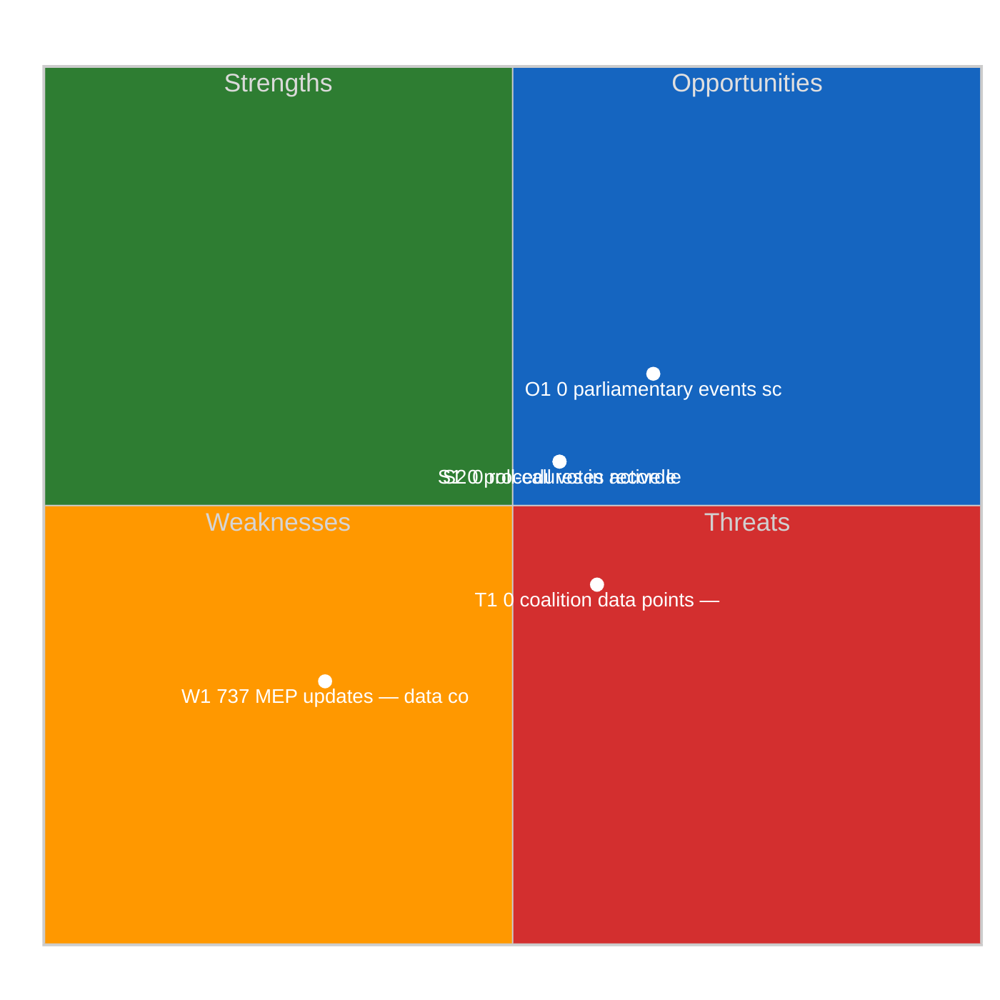
```mermaid
%%{init: {
  "theme": "dark",
  "themeVariables": {
    "quadrant1Fill": "#1565C0",
    "quadrant2Fill": "#2E7D32",
    "quadrant3Fill": "#FF9800",
    "quadrant4Fill": "#D32F2F",
    "quadrantTitleFill": "#ffffff",
    "quadrantPointFill": "#ffffff",
    "quadrantPointTextFill": "#ffffff",
    "quadrantXAxisTextFill": "#ffffff",
    "quadrantYAxisTextFill": "#ffffff"
  },
  "quadrantChart": {
    "chartWidth": 700,
    "chartHeight": 700,
    "pointLabelFontSize": 14,
    "titleFontSize": 22,
    "quadrantLabelFontSize": 18,
    "xAxisLabelFontSize": 16,
    "yAxisLabelFontSize": 16
  }
}}%%
quadrantChart
    title Political SWOT — Strategic Position (2026-04-03)
    x-axis Low Impact --> High Impact
    y-axis Low Priority --> High Priority
    quadrant-1 Opportunities
    quadrant-2 Strengths
    quadrant-3 Weaknesses
    quadrant-4 Threats
    S1 0 procedures in active le: [0.55, 0.55]
    S2 0 roll-call votes recorde: [0.55, 0.55]
    W1 737 MEP updates — data co: [0.30, 0.30]
    O1 0 parliamentary events sc: [0.65, 0.65]
    T1 0 coalition data points —: [0.59, 0.41]
```

### SWOT Overview

| Category | Items | Avg Score | Trend |
|----------|-------|-----------|-------|
| 🟢 Strengths | 2 | 0.0 | stable |
| 🔴 Weaknesses | 1 | 2.0 | stable |
| 🔵 Opportunities | 1 | 1.5 | stable |
| 🟠 Threats | 1 | 0.9 | stable |

### 🟢 Strengths

#### S1: 0 procedures in active legislative pipeline
- **Score**: 0.0/5
- **Confidence**: low
- **Trend**: stable
- **Evidence**:
  - 0 procedures tracked in current period
  - 114 texts adopted
  - 0 documents published

#### S2: 0 roll-call votes recorded with 0 questions
- **Score**: 0.0/5
- **Confidence**: low
- **Trend**: stable
- **Evidence**:
  - 0 voting records available
  - 0 parliamentary questions filed
  - 737 MEP activity updates

### 🔴 Weaknesses

#### W1: 737 MEP updates — data coverage gap assessment
- **Score**: 2.0/5
- **Confidence**: medium
- **Trend**: stable
- **Evidence**:
  - 737 MEP updates in current period
  - 0 documents vs 0 procedures ratio
  - Data freshness depends on EP feed update frequency

### 🔵 Opportunities

#### O1: 0 parliamentary events scheduled
- **Score**: 1.5/5
- **Confidence**: medium
- **Trend**: stable
- **Evidence**:
  - 0 events in analysis period
  - 114 texts adopted indicates legislative throughput
  - 0 procedures in various stages

### 🟠 Threats

#### T1: 0 coalition data points — cohesion monitoring
- **Score**: 0.9/5
- **Confidence**: low
- **Trend**: stable
- **Evidence**:
  - 0 coalition observations recorded
  - Cross-reference with 0 voting records
  - 0 procedures may be affected by coalition shifts

### Cross-Impact Matrix

| Interaction | Net Effect | Rationale |
|-------------|-----------|----------|
| strength #1 × threat #1 | 0.00 | Strength "0 procedures in active legislative pipeline" partially mitigates threat "0 coalition data points — cohesion monitoring" |
| strength #2 × threat #1 | 0.00 | Strength "0 roll-call votes recorded with 0 questions" partially mitigates threat "0 coalition data points — cohesion monitoring" |
| weakness #1 × threat #1 | 0.30 | Weakness "737 MEP updates — data coverage gap assessment" amplifies threat "0 coalition data points — cohesion monitoring" |

### Strategic Priorities Matrix

### Data Summary

| Data Source | Count |
|-------------|-------|
| Procedures | 0 |
| Events | 0 |
| Documents | 0 |
| Voting Records | 0 |
| Adopted Texts | 114 |
| Coalitions | 0 |
| Questions | 0 |
| MEP Updates | 737 |
| **Total Data Points** | **114** |

### Date: 2026-04-03

### Political Capital Risk

### Data Inventory for Capital Risk Assessment
| Data Source | Count | Relevance |
|-------------|-------|-----------|
| Coalition data points | 0 | Group cohesion indicators |
| Voting records | 0 | Voting alignment metrics |
| Voting patterns | 0 | Trend and anomaly data |
| Active procedures | 0 | Legislative engagement |

### Date: 2026-04-03

### Legislative Velocity Risk

### Overview
Risk assessment based on legislative processing speed for 0 procedures.

### Top Velocity Risks
| Procedure | Title | Stage | Days (actual/expected) | Risk Score | Level |
|-----------|-------|-------|----------------------|------------|-------|
| — | — | — | — | — | — |

### Summary
- **Procedures analysed**: 0
- **High/Critical risks**: 0
- **Date**: 2026-04-03

### Agent Risk Workflow

### Risk Heat Map

| Impact ↓ / Likelihood → | Rare | Unlikely | Possible | Likely | Almost Certain |
|--------------------------|------|----------|----------|--------|----------------|
| **Severe** | 🟢 | 🟡 | 🟠 | 🟠 | 🔴 |
| **Major** | 🟢 | 🟡 | 🟡 | 🟠 | 🔴 |
| **Moderate** | 🟢 | 🟢 | 🟡 | 🟠 | 🟠 |
| **Minor** | 🟢 | 🟢 | 🟢 | 🟡 | 🟡 |
| **Negligible** | 🟢 | 🟢 | 🟢 | 🟢 | 🟢 |

### Identified Risks

#### RISK-W00: Baseline political risk
- **Likelihood**: rare (0.1) | **Impact**: minor (2) | **Score**: 0.2 (LOW) | **Confidence**: low
- **Evidence**: Routine parliamentary activity
- **Mitigating Factors**: Stable institutional framework

### Risk Evaluation Matrix

| Rank | Risk ID | Description | Score | Level | Confidence |
|------|---------|-------------|-------|-------|------------|
| 1 | RISK-W00 | Baseline political risk | 0.2 | LOW | low |

### Risk Treatment Plan

- Monitor legislative velocity indicators
- Track coalition voting patterns

### Recommendations

- Monitor legislative velocity indicators
- Track coalition voting patterns

<h2 id="section-threat">Threat Landscape</h2>

### Actor Threat Profiles

### Overview
Individual threat profiles for 0 political actors.

### Actor Threat Matrix
| Actor | Type | Capability | Motivation | Opportunity | Threat Level |
|-------|------|------------|------------|-------------|--------------|
| — | — | — | — | — | — |

### Date: 2026-04-03

### Consequence Trees

### Overview
Structured analysis of action-consequence chains for 0 legislative procedures.

### No procedures available for consequence analysis

### Date: 2026-04-03

### Legislative Disruption

### Overview
Identification of factors disrupting the normal legislative process.

### Disruption Assessment
| Procedure ID | Title | Stage | Resilience | Disruption Points |
|-------------|-------|-------|-----------|-------------------|
| — | — | — | — | — |

### Date: 2026-04-03

### Political Threat Landscape

### Political Threat Landscape Analysis

#### Coalition Shifts
**Threat Level**: 🟢 Low

Coalition stability appears maintained. No significant realignment signals.

**Evidence:**
- No coalition shift signals detected in available data

#### Transparency Deficit
**Threat Level**: ⚠️ Moderate

Transparency concerns at moderate level. Review committee meeting records and public documentation.

**Evidence:**
- No committee activity data available — potential information gap

#### Policy Reversal
**Threat Level**: 🟢 Low

Legislative trajectory appears stable. No major reversal signals.

**Evidence:**
- No significant policy reversal signals detected

#### Institutional Pressure
**Threat Level**: 🟢 Low

Institutional balance appears maintained. Power distribution within normal parameters.

**Evidence:**
- No institutional threat signals detected

#### Legislative Obstruction
**Threat Level**: 🟢 Low

Legislative pace within normal parameters. No obstruction signals.

**Evidence:**
- No significant legislative delay signals detected

#### Democratic Erosion
**Threat Level**: 🟢 Low

Democratic norms appear stable. Institutional processes functioning within expected parameters.

**Evidence:**
- Democratic norms appear stable. No systematic erosion signals.

### Actor Threat Profiles

*No actor threat profiles generated from available data.*

### Consequence Trees

#### Consequence Tree: Standard legislative activity assessment

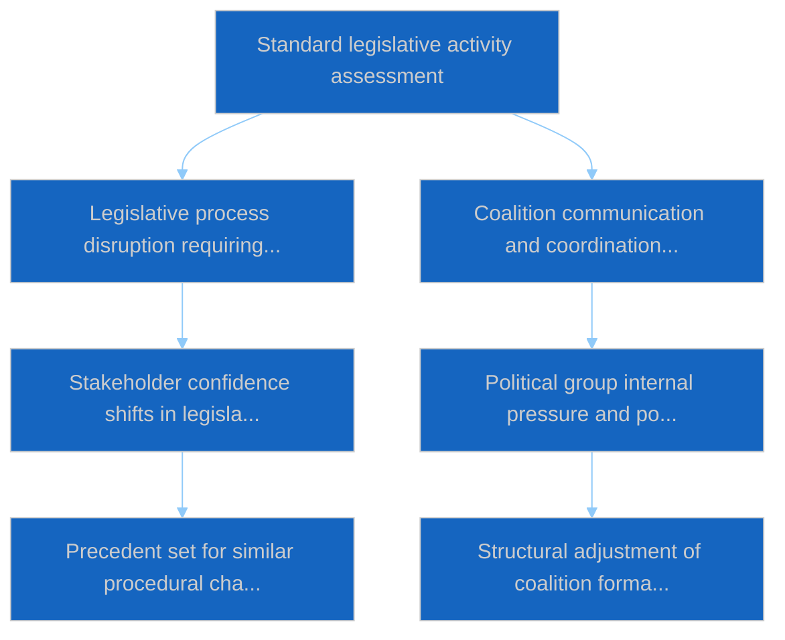
```mermaid
%%{init: {"theme":"dark","themeVariables":{"primaryColor":"#1565C0","primaryTextColor":"#ffffff","primaryBorderColor":"#0A3F7F","lineColor":"#90CAF9","secondaryColor":"#2E7D32","secondaryTextColor":"#ffffff","secondaryBorderColor":"#0F3F00","tertiaryColor":"#FF9800","tertiaryTextColor":"#000000","tertiaryBorderColor":"#7F4F00","mainBkg":"#1565C0","secondBkg":"#2E7D32","tertiaryBkg":"#FF9800","noteBkgColor":"#FFC107","noteTextColor":"#000000","noteBorderColor":"#7F6000","errorBkgColor":"#D32F2F","errorTextColor":"#ffffff","fontFamily":"Inter, Helvetica, Arial, sans-serif","pie1":"#1565C0","pie2":"#2E7D32","pie3":"#FF9800","pie4":"#D32F2F","pie5":"#FFC107","pie6":"#7B1FA2","pie7":"#9E9E9E","pie8":"#0288D1","pie9":"#388E3C","pie10":"#F57C00","pie11":"#C62828","pie12":"#FBC02D","pieTitleTextSize":"18px","pieSectionTextSize":"14px","pieLegendTextSize":"13px","pieStrokeColor":"#1e1e1e","pieOuterStrokeColor":"#1e1e1e","git0":"#1565C0","git1":"#2E7D32","git2":"#FF9800","git3":"#D32F2F","gitBranchLabel0":"#ffffff","gitBranchLabel1":"#ffffff","gitBranchLabel2":"#000000","gitBranchLabel3":"#ffffff","cScale0":"#1565C0","cScale1":"#2E7D32","cScale2":"#FF9800","cScale3":"#D32F2F","cScale4":"#FFC107","cScale5":"#7B1FA2","cScale6":"#9E9E9E","cScale7":"#0288D1","xyChart":{"backgroundColor":"#1e1e1e","plotColorPalette":"#1565C0,#2E7D32,#FF9800,#D32F2F,#FFC107,#7B1FA2,#9E9E9E"}}}}%%
graph TD
    A["Standard legislative activity assessment"]
    B0["Legislative process disruption requiring..."]
    A --> B0
    B1["Coalition communication and coordination..."]
    A --> B1
    C0["Stakeholder confidence shifts in legisla..."]
    B0 --> C0
    C1["Political group internal pressure and po..."]
    B1 --> C1
    D0["Precedent set for similar procedural cha..."]
    C0 --> D0
    D1["Structural adjustment of coalition forma..."]
    C1 --> D1
```

**Mitigating Factors:**
- Institutional resilience mechanisms
- Cross-party dialogue channels

**Amplifying Factors:**
- No significant amplifying factors identified

### Legislative Disruption Analysis

#### Procedure: General legislative pipeline

**Current Stage**: proposal | **Resilience**: high

| Stage | Threat Category | Likelihood | Risk Level |
|-------|----------------|------------|------------|
| proposal | delay | 8% | 🟢 Low |
| committee | transparency | 18% | 🟢 Low |
| plenary first reading | shift | 22% | 🟢 Low |
| council position | delay | 12% | 🟢 Low |
| plenary second reading | shift | 21% | 🟢 Low |
| conciliation | reversal | 17% | 🟢 Low |
| adoption | delay | 5% | 🟢 Low |

**Alternative Pathways:**
- Commission resubmission with revised proposal
- Enhanced informal trilogue engagement
- Interim resolution as procedural bridge

### Key Findings

- No high-priority threats detected across threat landscape dimensions

### Recommendations

- Continue routine monitoring of parliamentary activity

---
*Assessment generated by EU Parliament Monitor Political Threat Assessment Pipeline.*  
*Based on public European Parliament data. GDPR-compliant.*

<h2 id="section-continuity">Cross-Run Continuity</h2>

### Cross Session Intelligence

### Computed Stability Metrics (Script-Generated Context)
- **Overall Stability**: 0.0%
- **Forecast**: volatile
- **Patterns Analysed**: 0
- **Stable Groups**: None identified from voting data
- **Declining Groups**: None identified from voting data

### AI Analysis Prompt

> **Instructions for AI Agent (Opus 4.6):** Using the cross-session stability metrics above and the adopted texts/voting records from recent plenary sessions, produce a cross-session intelligence synthesis. Your analysis MUST:
>
> 1. **Compare coalition patterns** across the last 3-5 plenary sessions — are alliances strengthening or fragmenting?
> 2. **Identify session-over-session trends**: Which policy areas show increasing/decreasing consensus?
> 3. **Detect coalition realignment signals**: Are new voting blocs forming? Is the Grand Coalition showing stress?
> 4. **Institutional dynamics**: How are EP-Council-Commission dynamics evolving based on recent legislative outcomes?
> 5. **Predictive assessment**: Based on cross-session patterns, forecast likely coalition behavior for upcoming votes
> 6. **Confidence levels**: Rate each finding as 🟢 High / 🟡 Medium / 🔴 Low
>
> Cross-reference with adopted texts from the most recent plenary session to ground the analysis in specific legislative outcomes.

### AI-Produced Cross-Session Intelligence

[TO BE FILLED BY AI AGENT — Cross-session trend analysis with specific plenary session references, coalition evolution assessment, and predictive indicators. Quality gate: minimum 400 words.]

### Date: 2026-04-03

<h2 id="section-deep-analysis">Deep Analysis</h2>

### Raw Data Inventory (Script-Generated Context for AI)
| Data Source | Count |
|-------------|-------|
| Events | 0 |
| Procedures | 0 |
| Documents | 0 |
| Adopted Texts | 114 |
| Questions | 0 |
| MEP Updates | 737 |
| **Total** | **851** |

### Stakeholder Groups — Data Points Available
| Stakeholder Group | Data Points Available |
|-------------------|---------------------|
| Political Groups | 114 (procedures + adopted texts) |
| Civil Society | 0 (documents + questions) |
| Industry | 0 (procedures) |
| National Governments | 114 (adopted texts) |
| Citizens | 737 (questions + MEP updates) |
| EU Institutions | 0 (events + procedures) |

### AI Analysis Prompt

> **Instructions for AI Agent (Opus 4.6):** Using the data inventory above and the raw EP MCP data files, produce a deep multi-perspective analysis following the political-style-guide.md depth Level 3 format. Your analysis MUST:
>
> 1. **Identify the 3-5 most politically significant items** from the available data, citing specific document IDs
> 2. **Analyse each from ≥3 stakeholder perspectives** (Political Groups, Civil Society, Industry, National Governments, Citizens, EU Institutions)
> 3. **Apply the SWOT framework** to the overall parliamentary activity pattern for this date
> 4. **Assess coalition dynamics** — which groups are aligning/diverging based on the adopted texts?
> 5. **Rate confidence** for each analytical claim: 🟢 High / 🟡 Medium / 🔴 Low
> 6. **Provide forward-looking indicators** — what should be monitored in the next 7-14 days?
> 7. **Include a Mermaid diagram** showing key actor relationships or policy connection mapping
>
> Evidence requirement: ≥3 citations per section from EP MCP data (document IDs, vote references, procedure numbers).

### AI-Produced Analysis

[TO BE FILLED BY AI AGENT — This section must contain substantive political intelligence analysis, not data summaries. Quality gate: minimum 500 words of original analytical prose with evidence citations.]

### Date: 2026-04-03

<h2 id="section-supplementary-intelligence">Supplementary Intelligence</h2>

### Executive Brief Ar

**التصنيف:** OSINT | سجل برلماني عام
**الموثوقية:** 🟢 عالية (تقييم هيكلي خلال عطلة برلمانية، وضع API مُتدهور)
**التاريخ:** 2026-04-03T00:00:00Z (تقرير بأثر رجعي)
**نوع المقال:** مقترحات
**معرف التشغيل:** `9be5bca6-de96-4303-80ff-33cb5f24b51b`
**المصدر:** بوابة البيانات المفتوحة للبرلمان الأوروبي

---

### 🎯 BLUF

**لم تُفتتح أي مقترحات جديدة من المفوضية أو إجراءات مبادرة ذاتية للبرلمان الأوروبي في 2026-04-03.** أعادت عملية التشغيل `9be5bca6-de96-4303-80ff-33cb5f24b51b` **«تقييماً كمياً للمخاطر عبر 0 أبعاد سياسية محددة»** — صفر جهة فاعلة مُصنَّفة، أهمية روتينية. يُعدّ `get_procedures_feed` من نقاط النهاية الفاشلة التي أكدتها عملية التشغيل الشقيقة `breaking-2` (وضع API مُتدهور، 5/8 من التغذيات الإلزامية تفشل). محفظة المقترحات الجوهرية المُرحَّلة إلى أبريل هي خط الأنابيب الموروث: دورة نقل توجيه مكافحة الفساد (TA-10-2026-0094)، إطار انبعاثات المركبات الثقيلة (TA-10-2026-0084)، إجراء نائب رئيس البنك المركزي الأوروبي (TA-10-2026-0060)، خط الأساس لتحسين التشريعات (TA-10-2026-0063)، والإحالة المعلقة EU-Mercosur إلى محكمة العدل الأوروبية (TA-10-2026-0008). **🟢 ثقة عالية** في الحالة الفارغة مدفوعة بالتقويم والتغذيات المُتدهورة.

---

### 🧭 3 Decisions This Brief Supports

| # | القرار | من يقرر | الموعد النهائي | المبرر |
|:-:|--------|--------|:-------------:|--------|
| 1 | **تحريري:** تجاوز المقترحات يومياً | المحرر | +24 ساعة | تشغيل فارغ + تغذيات مُتدهورة |
| 2 | **المراقبة:** تضمينها في مسبار استعادة ما بعد الإجازة 2026-04-14 | خط بيانات | 2026-04-14 | أول يوم عمل بعد عيد الفصح |
| 3 | **المراقبة الاستشرافية:** اجتماع المفوضية يوم الثلاثاء 7 أبريل 2026 — أول تشكيل للهيئة بعد عيد الفصح | مسؤول التحليل | 2026-04-07 | إيقاع المفوضية |

---

### 📰 60-Second Read

- 🔴 **لا إجراءات جديدة** في 2026-04-03؛ `get_procedures_feed` انتهت مهلته بعد 3 محاولات تحقيق. (🟢 عالية)
- 🟠 **0 جهة فاعلة مُصنَّفة**؛ أهمية روتينية. (🟢 عالية)
- 🟢 **ترحيل خط الأنابيب** يُرسِّخ قائمة المراقبة. (🟢 عالية)
- 🟡 **أبعاد المخاطر جميعها «لا شيء»** اليوم. (🟢 عالية)
- 🔵 **السياق الاقتصادي:** مقترحات الربع الثاني المتوقعة بشأن قواعد تنفيذ قانون الذكاء الاصطناعي، الاستراتيجية الصناعية الدفاعية، إعداد الإطار المالي متعدد السنوات. (🟡 متوسط)
- 🟣 **مرجع متقاطع:** عملية التشغيل الشقيقة `breaking-2` تُرسِّم الوضع المُتدهور لواجهة برمجة التطبيقات. (🟢 عالية)
- 🩷 **ناقل الاضطراب:** الضغط التجاري الأمريكي قد يُرغم المفوضية على طرح مقترح في المسار السريع أبريل. (🟡 متوسط)
- ⚪ **الترحيل المستقبلي:** رأي محكمة العدل الأوروبية بشأن Mercosur لا يزال المُحفِّز ذا الأولوية الأعلى.

---

### 🗂️ Top Documents / Procedures — Propositions Watch

| الترتيب | مرجع البرلمان | العنوان (مختصر) | الوزن | الموثوقية | الحالة |
|:-------:|--------------|----------------|:-----:|:---------:|--------|
| 1 | — | لا مقترحات جديدة في 2026-04-03 | 0.0 | 🟢 عالية | تغذيات مُتدهورة |
| 2 | TA-10-2026-0094 | توجيه مكافحة الفساد (دورة النقل) | 9.0 | 🟢 عالية | مُعتمد 26 مارس |
| 3 | TA-10-2026-0008 | إحالة EU-Mercosur إلى محكمة العدل الأوروبية (معلقة) | 8.0 | 🟡 متوسطة | رأي المحكمة متوقع |

---

### ⚠️ Risk & Threat Snapshot

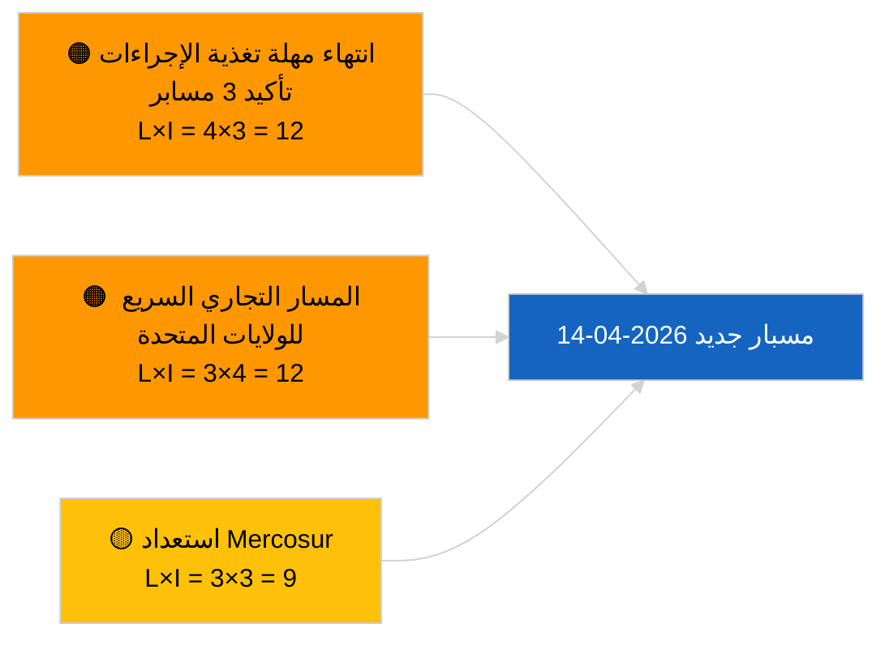
```mermaid
%%{init: {"theme":"dark"}}%%
graph LR
    R1["🟠 انتهاء مهلة تغذية الإجراءات<br/>تأكيد 3 مسابر<br/>L×I = 4×3 = 12"] --> CONS["مسبار جديد 2026-04-14"]
    R2["🟠 المسار التجاري السريع للولايات المتحدة<br/>L×I = 3×4 = 12"] --> CONS
    R3["🟡 استعداد Mercosur<br/>L×I = 3×3 = 9"] --> CONS
    style R1 fill:#FF9800,color:#000000
    style R2 fill:#FF9800,color:#000000
    style R3 fill:#FFC107,color:#000000
    style CONS fill:#1565C0,color:#FFFFFF
```

| المخاطر | L | I | الدرجة | المُحفِّز | المصدر | أدميرالية |
|---------|:-:|:-:|:------:|----------|--------|:---------:|
| انتهاء مهلة تغذية الإجراءات | 4 | 3 | 12 | يستمر بعد 14 أبريل | الشقيق `breaking-2` | A1 |
| المسار التجاري السريع للولايات المتحدة | 3 | 4 | 12 | إجراء أمريكي | TA-10-2026-0096 | A1 |
| استعداد لرأي Mercosur | 3 | 3 | 9 | نشر المحكمة | TA-10-2026-0008 | A2 |

---

### 🔮 Top Forward Trigger

**اجتماع المفوضية يوم الثلاثاء 7 أبريل 2026** — أول تشكيل للهيئة بعد عيد الفصح.

---

### 🛡️ Source Quality Assessment

- **المصادر الأولية:** عملية التشغيل `9be5bca6-de96-4303-80ff-33cb5f24b51b`؛ الشقيق `breaking-2`.
- **الموثوقية:** 🟢 عالية لتصنيف المحرك.

---

### 📎 Links

| الرابط | المسار |
|--------|--------|
| المقال | `./article.md` |
| عمليات التشغيل الشقيقة | جميع تشغيلات 2026-04-03 (انظر المجلد) |
| بيان المحتويات | `./manifest.json` |

---

**التحكم في الوثائق**
- **القالب:** `/analysis/templates/executive-brief.md`
- **مسار الأداة:** `analysis/daily/2026-04-03/propositions/executive-brief.md`
- **التصنيف:** عام
- **التوليد الرجعي:** جلسة التعبئة العكسية.

### Executive Brief Da

### 🎯 BLUF

**Ingen nye Kommissionspropositioner eller EP-eget-initiativprocedurer åbnede den 2026-04-03.** Kørsel `9be5bca6-de96-4303-80ff-33cb5f24b51b` returnerede **"Kvantitativ risikovurdering på tværs af 0 identificerede politiske dimensioner"** — nul klassificerede aktører, RUTINE-betydning. `get_procedures_feed` er blandt de mislykkede endepunkter bekræftet af søskendekørslen `breaking-2` (DEGRADERET API-tilstand, 5/8 obligatoriske feeds fejler). Den substantielle propositionsbeholdning der passerer ind i april er den nedarvede pipeline: antikorruptionsdirektivets transpositionscyklus (TA-10-2026-0094), HDV-emissionsrammen (TA-10-2026-0084), ECB's vicepræsidentprocedure (TA-10-2026-0060), Better Law-Making-basislinjen (TA-10-2026-0063), og den verserende EU-Mercosur ECJ-forelæggelse (TA-10-2026-0008). **🟢 HØJ tillid** til tomt tilstand er kalender + DEGRADERET feed drevet.

---

### 🧭 3 Decisions This Brief Supports

| # | Beslutning | Hvem beslutter | Frist | Dokumentation |
|:-:|-----------|---------------|:-----:|---------------|
| 1 | **Redaktionel:** SPRING OVER propositioner dagligt | Redaktør | +24h | Tom kørsel + DEGRADEREDE feeds |
| 2 | **Overvågning:** inkludér i 2026-04-14 gendannelsessonde efter ferie | Datapipeline | 2026-04-14 | Første post-påske hverdag |
| 3 | **Fremadrettet overvågning:** Kommissionens tirsdagsmøde 7. april 2026 — første post-påske kollegieopstilling | Analyseansvarlig | 2026-04-07 | Kommissionens kadence |

---

### 📰 60-Second Read

- 🔴 **Ingen nye procedurer** den 2026-04-03; `get_procedures_feed` timeout ved 3 sondeprøver. (🟢 Høj)
- 🟠 **0 aktører klassificeret**; RUTINE-betydning. (🟢 Høj)
- 🟢 **Pipeline-carry-over** forankrer bevakningslisten. (🟢 Høj)
- 🟡 **Risikodimensioner alle "ingen"** i dag. (🟢 Høj)
- 🔵 **Økonomisk kontekst:** forventede Q2-propositioner om AI-aktens gennemførelsesregler, Forsvarsindustriel strategi, MFF-forberedelse. (🟡 Middel)
- 🟣 **Krydsreference:** søskendekørslen `breaking-2` formaliserer DEGRADERET API-tilstand. (🟢 Høj)
- 🩷 **Forstyrelsesvektor:** USA's handelspres kan tvinge en hurtigspors-Kommissionsproposition i april. (🟡 Middel)
- ⚪ **Fremoverfører:** Mercosur ECJ-udtalelsen er stadig den højest prioriterede verserende udløser.

---

### 🗂️ Top Documents / Procedures — Propositions Watch

| Rang | EP-reference | Titel (kort) | Vigt | Tillid | Status |
|:----:|--------------|-------------|:----:|:------:|--------|
| 1 | — | Ingen nye propositioner den 2026-04-03 | 0.0 | 🟢 HØJ | DEGRADEREDE feeds |
| 2 | TA-10-2026-0094 | Antikorruptionsdirektiv (transpositionscyklus) | 9.0 | 🟢 HØJ | Vedtaget 26. marts |
| 3 | TA-10-2026-0008 | EU-Mercosur ECJ-forelæggelse (verserende) | 8.0 | 🟡 MIDDEL | Domstolsudtalelse forventet |

---

### ⚠️ Risk & Threat Snapshot

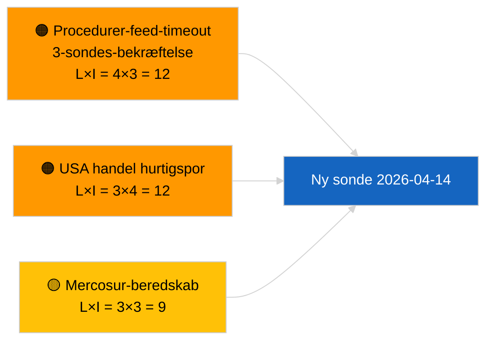
```mermaid
%%{init: {"theme":"dark"}}%%
graph LR
    R1["🟠 Procedurer-feed-timeout<br/>3-sondes-bekræftelse<br/>L×I = 4×3 = 12"] --> CONS["Ny sonde 2026-04-14"]
    R2["🟠 USA handel hurtigspor<br/>L×I = 3×4 = 12"] --> CONS
    R3["🟡 Mercosur-beredskab<br/>L×I = 3×3 = 9"] --> CONS
    style R1 fill:#FF9800,color:#000000
    style R2 fill:#FF9800,color:#000000
    style R3 fill:#FFC107,color:#000000
    style CONS fill:#1565C0,color:#FFFFFF
```

| Risiko | L | I | Score | Udløser | Kilde | Admiralitet |
|--------|:-:|:-:|:-----:|---------|-------|:-----------:|
| Procedurer-feed-timeout | 4 | 3 | 12 | Vedvarer efter 14. april | Søskende `breaking-2` | A1 |
| USA handel hurtigspor | 3 | 4 | 12 | USA-handling | TA-10-2026-0096 | A1 |
| Mercosur-udtalelse beredskab | 3 | 3 | 9 | Domstolen frigiver | TA-10-2026-0008 | A2 |

---

### 🔮 Top Forward Trigger

**Kommissionens tirsdagsmøde 7. april 2026** — første post-påske kollegieopstilling.

---

### 🛡️ Source Quality Assessment

- **Primære kilder:** Kørsel `9be5bca6-de96-4303-80ff-33cb5f24b51b`; søskende `breaking-2`.
- **Tillid:** 🟢 HØJ på drivklassificering.

---

### 📎 Links

| Link | Sti |
|------|-----|
| Artikel | `./article.md` |
| Søskendekørsler | Alle 2026-04-03-kørsler (se mappe) |
| Manifest | `./manifest.json` |

---

**Dokumentkontrol**
- **Skabelon:** `/analysis/templates/executive-brief.md`
- **Artefaktsti:** `analysis/daily/2026-04-03/propositions/executive-brief.md`
- **Klassificering:** Offentlig
- **Retroaktiv generering:** Back-fill session.

### Executive Brief De

### 🎯 BLUF

**Am 2026-04-03 wurden keine neuen Kommissionsvorschläge oder EP-Eigeninitiativ-Verfahren eröffnet.** Lauf `9be5bca6-de96-4303-80ff-33cb5f24b51b` lieferte **„Quantitative Risikobewertung über 0 identifizierte politische Dimensionen"** — null klassifizierte Akteure, ROUTINE-Bedeutung. `get_procedures_feed` gehört zu den gescheiterten Endpunkten, die durch den Geschwisterlauf `breaking-2` bestätigt wurden (DEGRADIERTER API-Modus, 5/8 der obligatorischen Feeds schlagen fehl). Das erhebliche Vorschlagsportfolio, das in den April übertragen wird, ist die geerbte Pipeline: Transpositionszyklus der Antikorruptionsrichtlinie (TA-10-2026-0094), HDV-Emissionsrahmen (TA-10-2026-0084), EZB-Vizepräsidentenverfahren (TA-10-2026-0060), Better-Law-Making-Basislinie (TA-10-2026-0063) und die anhängige EU-Mercosur-EuGH-Vorlage (TA-10-2026-0008). **🟢 HOHES Vertrauen** in den Leerstand wird durch Kalender + DEGRADIERTE Feeds angetrieben.

---

### 🧭 3 Decisions This Brief Supports

| # | Entscheidung | Wer entscheidet | Frist | Nachweis |
|:-:|-------------|----------------|:-----:|---------|
| 1 | **Redaktionell:** Vorschläge täglich ÜBERSPRINGEN | Redakteur | +24h | Leerer Lauf + DEGRADIERTE Feeds |
| 2 | **Überwachung:** In 2026-04-14 Post-Urlaub-Wiederherstellungssonde einbeziehen | Datenpipeline | 2026-04-14 | Erster Post-Ostern-Werktag |
| 3 | **Vorausüberwachung:** Kommissions-Dienstagssitzung 7. April 2026 — erste Post-Ostern-Kollegiumsaufstellung | Analysebeauftragter | 2026-04-07 | Kommissionskadenz |

---

### 📰 60-Second Read

- 🔴 **Keine neuen Verfahren** am 2026-04-03; `get_procedures_feed` Timeout bei 3 Sondierungsversuchen. (🟢 Hoch)
- 🟠 **0 Akteure klassifiziert**; ROUTINE-Bedeutung. (🟢 Hoch)
- 🟢 **Pipeline-Carryover** verankert die Überwachungsliste. (🟢 Hoch)
- 🟡 **Risikodimensionen alle „keine"** heute. (🟢 Hoch)
- 🔵 **Wirtschaftlicher Kontext:** Erwartete Q2-Vorschläge zu KI-Gesetz-Durchführungsregeln, Verteidigungsindus­trielle Strategie, MFR-Vorbereitung. (🟡 Mittel)
- 🟣 **Querverweis:** Geschwisterlauf `breaking-2` formalisiert DEGRADIERTEN API-Modus. (🟢 Hoch)
- 🩷 **Störungsvektor:** US-Handelsdruck könnte einen Eilverfahrens-Kommissionsvorschlag im April erzwingen. (🟡 Mittel)
- ⚪ **Weiterführend:** EuGH-Stellungnahme zum Mercosur-Abkommen bleibt der priorisierte ausstehende Auslöser.

---

### 🗂️ Top Documents / Procedures — Propositions Watch

| Rang | EP-Referenz | Titel (kurz) | Gewicht | Vertrauen | Status |
|:----:|-------------|-------------|:-------:|:---------:|--------|
| 1 | — | Keine neuen Vorschläge am 2026-04-03 | 0.0 | 🟢 HOCH | DEGRADIERTE Feeds |
| 2 | TA-10-2026-0094 | Antikorruptionsrichtlinie (Transpositionszyklus) | 9.0 | 🟢 HOCH | Angenommen 26. März |
| 3 | TA-10-2026-0008 | EU-Mercosur EuGH-Vorlage (anhängig) | 8.0 | 🟡 MITTEL | EuGH-Stellungnahme erwartet |

---

### ⚠️ Risk & Threat Snapshot

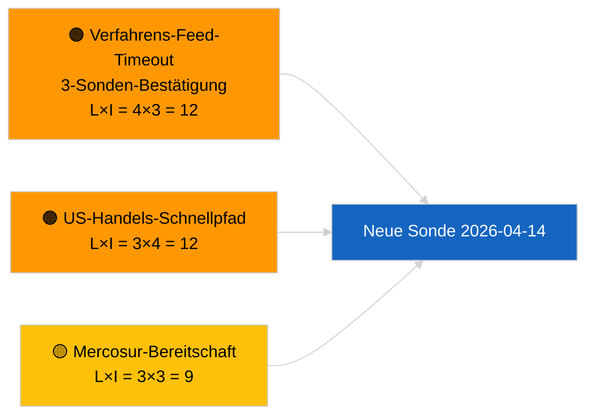
```mermaid
%%{init: {"theme":"dark"}}%%
graph LR
    R1["🟠 Verfahrens-Feed-Timeout<br/>3-Sonden-Bestätigung<br/>L×I = 4×3 = 12"] --> CONS["Neue Sonde 2026-04-14"]
    R2["🟠 US-Handels-Schnellpfad<br/>L×I = 3×4 = 12"] --> CONS
    R3["🟡 Mercosur-Bereitschaft<br/>L×I = 3×3 = 9"] --> CONS
    style R1 fill:#FF9800,color:#000000
    style R2 fill:#FF9800,color:#000000
    style R3 fill:#FFC107,color:#000000
    style CONS fill:#1565C0,color:#FFFFFF
```

| Risiko | L | I | Score | Auslöser | Quelle | Admiralität |
|--------|:-:|:-:|:-----:|----------|--------|:-----------:|
| Verfahrens-Feed-Timeout | 4 | 3 | 12 | Besteht nach 14. April | Geschwister `breaking-2` | A1 |
| US-Handels-Schnellpfad | 3 | 4 | 12 | US-Handeln | TA-10-2026-0096 | A1 |
| Mercosur-Stellungnahme-Bereitschaft | 3 | 3 | 9 | EuGH veröffentlicht | TA-10-2026-0008 | A2 |

---

### 🔮 Top Forward Trigger

**Kommissions-Dienstagssitzung 7. April 2026** — erste Post-Ostern-Kollegiumsaufstellung.

---

### 🛡️ Source Quality Assessment

- **Primärquellen:** Lauf `9be5bca6-de96-4303-80ff-33cb5f24b51b`; Geschwister `breaking-2`.
- **Vertrauen:** 🟢 HOCH bei Treiberklassifizierung.

---

### 📎 Links

| Link | Pfad |
|------|------|
| Artikel | `./article.md` |
| Geschwisterläufe | Alle 2026-04-03-Läufe (Ordner) |
| Manifest | `./manifest.json` |

---

**Dokumentkontrolle**
- **Vorlage:** `/analysis/templates/executive-brief.md`
- **Artefaktpfad:** `analysis/daily/2026-04-03/propositions/executive-brief.md`
- **Einstufung:** Öffentlich
- **Rückwirkende Erstellung:** Back-fill-Sitzung.

### Executive Brief Es

### 🎯 BLUF

**No se abrieron nuevas propuestas de la Comisión ni procedimientos de iniciativa propia del PE el 2026-04-03.** La ejecución `9be5bca6-de96-4303-80ff-33cb5f24b51b` devolvió **«Evaluación cuantitativa de riesgos sobre 0 dimensiones políticas identificadas»** — cero actores clasificados, importancia RUTINARIA. `get_procedures_feed` forma parte de los puntos de acceso fallidos confirmados por la ejecución hermana `breaking-2` (MODO API DEGRADADO, 5/8 de los flujos obligatorios fallan). La cartera sustancial de proposiciones que se traslada a abril es la canalización heredada: ciclo de transposición de la directiva anticorrupción (TA-10-2026-0094), marco de emisiones de vehículos pesados (TA-10-2026-0084), procedimiento de vicepresidencia del BCE (TA-10-2026-0060), línea base de Mejor Regulación (TA-10-2026-0063) y el reenvío pendiente EU-Mercosur al TJUE (TA-10-2026-0008). **🟢 ALTA confianza** en el estado vacío se debe al calendario + flujos DEGRADADOS.

---

### 🧭 3 Decisions This Brief Supports

| # | Decisión | Quién decide | Plazo | Justificación |
|:-:|---------|-------------|:-----:|--------------|
| 1 | **Editorial:** OMITIR proposiciones diariamente | Redactor | +24h | Ejecución vacía + flujos DEGRADADOS |
| 2 | **Supervisión:** incluir en la sonda de recuperación del 2026-04-14 tras el período vacacional | Canal de datos | 2026-04-14 | Primer día laborable post-Pascua |
| 3 | **Vigilancia prospectiva:** Reunión del martes de la Comisión 7 de abril de 2026 — primera reunión del colegio post-Pascua | Responsable de análisis | 2026-04-07 | Cadencia de la Comisión |

---

### 📰 60-Second Read

- 🔴 **Sin nuevos procedimientos** el 2026-04-03; `get_procedures_feed` se agotó tras 3 intentos de sondeo. (🟢 Alta)
- 🟠 **0 actores clasificados**; importancia RUTINARIA. (🟢 Alta)
- 🟢 **Arrastre de canalización** ancla la lista de vigilancia. (🟢 Alta)
- 🟡 **Dimensiones de riesgo todas «ninguna»** hoy. (🟢 Alta)
- 🔵 **Contexto económico:** proposiciones del T2 esperadas sobre reglas de ejecución del Reglamento de IA, Estrategia Industrial de Defensa, preparación del MFP. (🟡 Medio)
- 🟣 **Referencia cruzada:** la ejecución hermana `breaking-2` formaliza el MODO API DEGRADADO. (🟢 Alta)
- 🩷 **Vector de perturbación:** la presión comercial de EE. UU. podría forzar una propuesta de la Comisión por vía rápida en abril. (🟡 Medio)
- ⚪ **Traslado prospectivo:** el dictamen del TJUE sobre Mercosur sigue siendo el desencadenante pendiente de mayor prioridad.

---

### 🗂️ Top Documents / Procedures — Propositions Watch

| Rango | Referencia PE | Título (abreviado) | Peso | Confianza | Estado |
|:-----:|---------------|-------------------|:----:|:---------:|--------|
| 1 | — | Sin nuevas proposiciones el 2026-04-03 | 0,0 | 🟢 ALTA | Flujos DEGRADADOS |
| 2 | TA-10-2026-0094 | Directiva anticorrupción (ciclo de transposición) | 9,0 | 🟢 ALTA | Aprobada el 26 de marzo |
| 3 | TA-10-2026-0008 | Reenvío EU-Mercosur TJUE (pendiente) | 8,0 | 🟡 MEDIO | Dictamen del TJUE esperado |

---

### ⚠️ Risk & Threat Snapshot

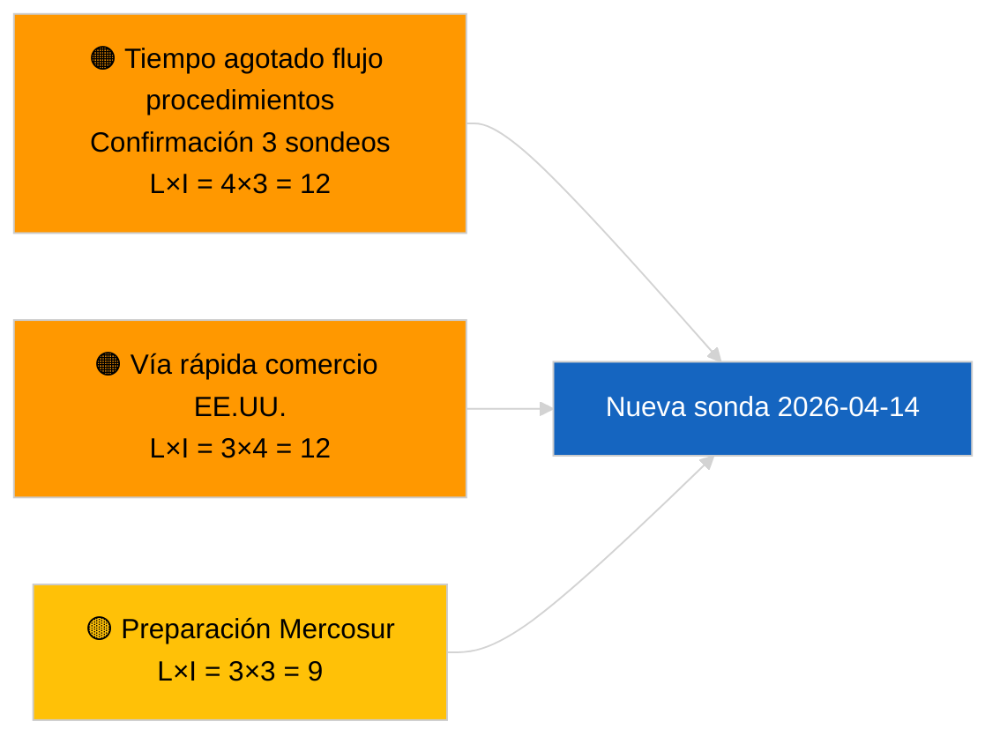
```mermaid
%%{init: {"theme":"dark"}}%%
graph LR
    R1["🟠 Tiempo agotado flujo procedimientos<br/>Confirmación 3 sondeos<br/>L×I = 4×3 = 12"] --> CONS["Nueva sonda 2026-04-14"]
    R2["🟠 Vía rápida comercio EE.UU.<br/>L×I = 3×4 = 12"] --> CONS
    R3["🟡 Preparación Mercosur<br/>L×I = 3×3 = 9"] --> CONS
    style R1 fill:#FF9800,color:#000000
    style R2 fill:#FF9800,color:#000000
    style R3 fill:#FFC107,color:#000000
    style CONS fill:#1565C0,color:#FFFFFF
```

| Riesgo | L | I | Puntuación | Desencadenante | Fuente | Admiraltazgo |
|--------|:-:|:-:|:----------:|---------------|--------|:------------:|
| Tiempo agotado flujo procedimientos | 4 | 3 | 12 | Persiste tras el 14 de abril | Hermana `breaking-2` | A1 |
| Vía rápida comercio EE. UU. | 3 | 4 | 12 | Acción de EE. UU. | TA-10-2026-0096 | A1 |
| Preparación dictamen Mercosur | 3 | 3 | 9 | Tribunal publica | TA-10-2026-0008 | A2 |

---

### 🔮 Top Forward Trigger

**Reunión del martes de la Comisión 7 de abril de 2026** — primera reunión del colegio post-Pascua.

---

### 🛡️ Source Quality Assessment

- **Fuentes primarias:** Ejecución `9be5bca6-de96-4303-80ff-33cb5f24b51b`; hermana `breaking-2`.
- **Confianza:** 🟢 ALTA en la clasificación impulsora.

---

### 📎 Links

| Enlace | Ruta |
|--------|------|
| Artículo | `./article.md` |
| Ejecuciones hermanas | Todas las ejecuciones del 2026-04-03 (ver carpeta) |
| Manifiesto | `./manifest.json` |

---

**Control documental**
- **Plantilla:** `/analysis/templates/executive-brief.md`
- **Ruta del artefacto:** `analysis/daily/2026-04-03/propositions/executive-brief.md`
- **Clasificación:** Público
- **Generación retroactiva:** Sesión de relleno histórico.

### Executive Brief Fi

### 🎯 BLUF

**Uusia komission esityksiä tai EP:n omia aloitemenettelyjä ei avattu 2026-04-03.** Ajo `9be5bca6-de96-4303-80ff-33cb5f24b51b` palautti **"Kvantitatiivinen riskiluokittelu 0 tunnistetun poliittisen ulottuvuuden yli"** — nolla luokiteltua toimijaa, RUTIINI-merkitys. `get_procedures_feed` kuuluu epäonnistuneisiin päätepisteisiin, jotka on vahvistettu rinnakkaisajolla `breaking-2` (HEIKENTYNYT API-tila, 5/8 pakollisesta syötteestä epäonnistuu). Huhtikuuhun siirtyvä merkittävä esitysportfolio on peritty putkilinja: korruptionvastaisen direktiivin täytäntöönpanosykli (TA-10-2026-0094), HDV-päästökehys (TA-10-2026-0084), EKP:n varapuheenjohtajamenettely (TA-10-2026-0060), Parempi lainsäädäntö -peruslinja (TA-10-2026-0063) ja vireillä oleva EU-Mercosur ECJ-ennakkoratkaisu (TA-10-2026-0008). **🟢 KORKEA luottamus** tyhjään tilaan johtuu kalenterista + HEIKENTYNEISTÄ syötteistä.

---

### 🧭 3 Decisions This Brief Supports

| # | Päätös | Kuka päättää | Määräaika | Näyttö |
|:-:|--------|-------------|:--------:|--------|
| 1 | **Toimituksellinen:** OHITA esitykset päivittäin | Toimittaja | +24t | Tyhjä ajo + HEIKENTYNEET syötteet |
| 2 | **Seuranta:** sisällytä 2026-04-14 palautuskoettimeen loman jälkeen | Dataputki | 2026-04-14 | Ensimmäinen pääsiäisen jälkeinen arkipäivä |
| 3 | **Eteenpäinkatsova:** Komission tiistaikokous 7. huhtikuuta 2026 — ensimmäinen pääsiäisen jälkeinen kollegion käsittely | Analyysivastaava | 2026-04-07 | Komission rytmi |

---

### 📰 60-Second Read

- 🔴 **Ei uusia menettelyjä** 2026-04-03; `get_procedures_feed` aikakatkaisu 3 koettimessa. (🟢 Korkea)
- 🟠 **0 toimijaa luokiteltu**; RUTIINI-merkitys. (🟢 Korkea)
- 🟢 **Putkilinja-siirto** ankkuroi seurantalistan. (🟢 Korkea)
- 🟡 **Riskin ulottuvuudet kaikki "ei mitään"** tänään. (🟢 Korkea)
- 🔵 **Taloudellinen asiayhteys:** odotetut Q2-esitykset tekoälylain täytäntöönpanosäännöistä, Puolustuksen teollisesta strategiasta, MFF-valmistelusta. (🟡 Keski)
- 🟣 **Ristiviite:** rinnakkaisajo `breaking-2` vahvistaa HEIKENTYNEEN API-tilan. (🟢 Korkea)
- 🩷 **Häiriövektori:** Yhdysvaltojen kauppapaine voi pakottaa nopeutetun komission esityksen huhtikuussa. (🟡 Keski)
- ⚪ **Siirto eteenpäin:** Mercosur ECJ -lausunto on edelleen korkeimman prioriteetin odottava laukaisin.

---

### 🗂️ Top Documents / Procedures — Propositions Watch

| Sija | EP-viite | Otsikko (lyhyt) | Merkittävyys | Luottamus | Tila |
|:----:|----------|----------------|:------------:|:---------:|------|
| 1 | — | Ei uusia esityksiä 2026-04-03 | 0.0 | 🟢 KORKEA | HEIKENTYNEET syötteet |
| 2 | TA-10-2026-0094 | Korruptionvastainen direktiivi (täytäntöönpanosykli) | 9.0 | 🟢 KORKEA | Hyväksytty 26. maaliskuuta |
| 3 | TA-10-2026-0008 | EU-Mercosur ECJ-ennakkoratkaisu (vireillä) | 8.0 | 🟡 KESKI | Tuomioistuimen lausunto odotetaan |

---

### ⚠️ Risk & Threat Snapshot

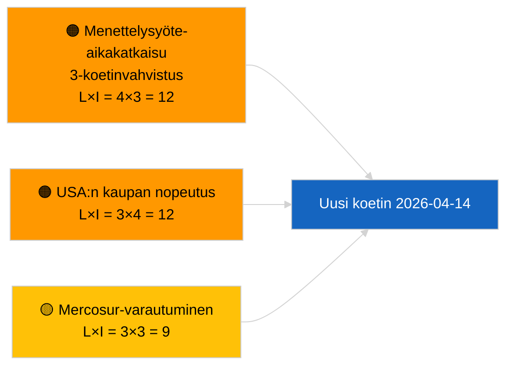
```mermaid
%%{init: {"theme":"dark"}}%%
graph LR
    R1["🟠 Menettelysyöte-aikakatkaisu<br/>3-koetinvahvistus<br/>L×I = 4×3 = 12"] --> CONS["Uusi koetin 2026-04-14"]
    R2["🟠 USA:n kaupan nopeutus<br/>L×I = 3×4 = 12"] --> CONS
    R3["🟡 Mercosur-varautuminen<br/>L×I = 3×3 = 9"] --> CONS
    style R1 fill:#FF9800,color:#000000
    style R2 fill:#FF9800,color:#000000
    style R3 fill:#FFC107,color:#000000
    style CONS fill:#1565C0,color:#FFFFFF
```

| Riski | L | I | Pisteet | Laukaisin | Lähde | Admiraliteetti |
|-------|:-:|:-:|:-------:|-----------|-------|:--------------:|
| Menettelysyöte-aikakatkaisu | 4 | 3 | 12 | Jatkuu 14. huhtikuun jälkeen | Rinnakkaisajo `breaking-2` | A1 |
| USA:n kaupan nopeutettu esitys | 3 | 4 | 12 | USA:n toiminta | TA-10-2026-0096 | A1 |
| Mercosur-lausuntovalmius | 3 | 3 | 9 | Tuomioistuin julkaisee | TA-10-2026-0008 | A2 |

---

### 🔮 Top Forward Trigger

**Komission tiistaikokous 7. huhtikuuta 2026** — ensimmäinen pääsiäisen jälkeinen kollegion käsittely.

---

### 🛡️ Source Quality Assessment

- **Ensisijaiset lähteet:** Ajo `9be5bca6-de96-4303-80ff-33cb5f24b51b`; rinnakkaisajo `breaking-2`.
- **Luottamus:** 🟢 KORKEA ajuriluokittelussa.

---

### 📎 Links

| Linkki | Polku |
|--------|-------|
| Artikkeli | `./article.md` |
| Rinnakkaisajot | Kaikki 2026-04-03-ajot (katso kansio) |
| Manifest | `./manifest.json` |

---

**Asiakirjavalvonta**
- **Malli:** `/analysis/templates/executive-brief.md`
- **Artefaktipolku:** `analysis/daily/2026-04-03/propositions/executive-brief.md`
- **Luokittelu:** Julkinen
- **Takautuva luonti:** Täydennysistunto.

### Executive Brief Fr

### 🎯 BLUF

**Aucune nouvelle proposition de la Commission ni procédure d'initiative propre du PE n'a été ouverte le 2026-04-03.** L'exécution `9be5bca6-de96-4303-80ff-33cb5f24b51b` a retourné **« Évaluation quantitative des risques sur 0 dimensions politiques identifiées »** — zéro acteur classifié, importance ROUTINIÈRE. `get_procedures_feed` fait partie des points de terminaison défaillants confirmés par l'exécution sœur `breaking-2` (MODE API DÉGRADÉ, 5/8 des flux obligatoires en échec). Le portefeuille substantiel de propositions reporté en avril est la chaîne héritée : cycle de transposition de la directive anticorruption (TA-10-2026-0094), cadre d'émissions des poids lourds (TA-10-2026-0084), procédure de vice-présidence de la BCE (TA-10-2026-0060), base de référence du programme « Mieux légiférer » (TA-10-2026-0063) et le renvoi en cours EU-Mercosur devant la CJUE (TA-10-2026-0008). **🟢 HAUTE fiabilité** de l'état vide est motivée par le calendrier + flux DÉGRADÉS.

---

### 🧭 3 Decisions This Brief Supports

| # | Décision | Qui décide | Échéance | Justification |
|:-:|---------|-----------|:--------:|--------------|
| 1 | **Éditorial :** IGNORER les propositions quotidiennement | Rédacteur | +24h | Exécution vide + flux DÉGRADÉS |
| 2 | **Surveillance :** inclure dans la sonde de rétablissement du 2026-04-14 après congé | Pipeline de données | 2026-04-14 | Premier jour ouvrable post-Pâques |
| 3 | **Veille prospective :** Réunion du mardi de la Commission 7 avril 2026 — première assemblée de collège post-Pâques | Responsable de l'analyse | 2026-04-07 | Rythme de la Commission |

---

### 📰 60-Second Read

- 🔴 **Aucune nouvelle procédure** le 2026-04-03 ; `get_procedures_feed` expiration au bout de 3 tentatives de sondage. (🟢 Haute)
- 🟠 **0 acteur classifié** ; importance ROUTINIÈRE. (🟢 Haute)
- 🟢 **Report de pipeline** ancre la liste de surveillance. (🟢 Haute)
- 🟡 **Dimensions de risque toutes « aucune »** aujourd'hui. (🟢 Haute)
- 🔵 **Contexte économique :** propositions Q2 attendues sur les règles d'exécution de la loi IA, stratégie industrielle de défense, préparation du CFP. (🟡 Moyen)
- 🟣 **Renvoi croisé :** l'exécution sœur `breaking-2` formalise le MODE API DÉGRADÉ. (🟢 Haute)
- 🩷 **Vecteur de perturbation :** la pression commerciale américaine pourrait forcer une proposition de la Commission en voie accélérée en avril. (🟡 Moyen)
- ⚪ **Report prospectif :** l'avis CJUE Mercosur reste le déclencheur en attente de plus haute priorité.

---

### 🗂️ Top Documents / Procedures — Propositions Watch

| Rang | Référence PE | Titre (abrégé) | Poids | Fiabilité | Statut |
|:----:|--------------|----------------|:-----:|:---------:|--------|
| 1 | — | Aucune nouvelle proposition le 2026-04-03 | 0,0 | 🟢 HAUTE | Flux DÉGRADÉS |
| 2 | TA-10-2026-0094 | Directive anticorruption (cycle de transposition) | 9,0 | 🟢 HAUTE | Adoptée le 26 mars |
| 3 | TA-10-2026-0008 | Renvoi EU-Mercosur CJUE (en cours) | 8,0 | 🟡 MOYEN | Avis CJUE attendu |

---

### ⚠️ Risk & Threat Snapshot

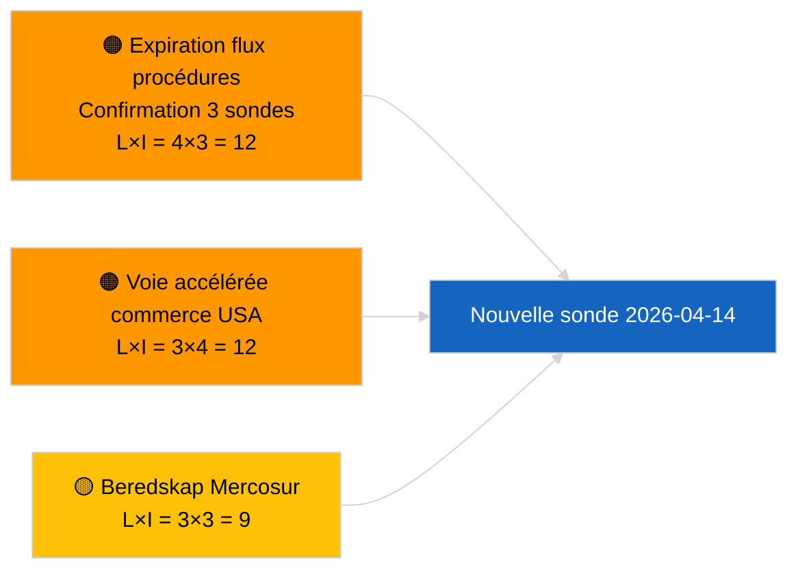
```mermaid
%%{init: {"theme":"dark"}}%%
graph LR
    R1["🟠 Expiration flux procédures<br/>Confirmation 3 sondes<br/>L×I = 4×3 = 12"] --> CONS["Nouvelle sonde 2026-04-14"]
    R2["🟠 Voie accélérée commerce USA<br/>L×I = 3×4 = 12"] --> CONS
    R3["🟡 Beredskap Mercosur<br/>L×I = 3×3 = 9"] --> CONS
    style R1 fill:#FF9800,color:#000000
    style R2 fill:#FF9800,color:#000000
    style R3 fill:#FFC107,color:#000000
    style CONS fill:#1565C0,color:#FFFFFF
```

| Risque | L | I | Score | Déclencheur | Source | Amirauté |
|--------|:-:|:-:|:-----:|------------|--------|:--------:|
| Expiration flux procédures | 4 | 3 | 12 | Persiste après le 14 avril | Sœur `breaking-2` | A1 |
| Voie accélérée commerce USA | 3 | 4 | 12 | Action américaine | TA-10-2026-0096 | A1 |
| Préparation avis Mercosur | 3 | 3 | 9 | Cour publie | TA-10-2026-0008 | A2 |

---

### 🔮 Top Forward Trigger

**Réunion du mardi de la Commission 7 avril 2026** — première assemblée de collège post-Pâques.

---

### 🛡️ Source Quality Assessment

- **Sources primaires :** Exécution `9be5bca6-de96-4303-80ff-33cb5f24b51b` ; sœur `breaking-2`.
- **Fiabilité :** 🟢 HAUTE sur la classification des facteurs.

---

### 📎 Links

| Lien | Chemin |
|------|--------|
| Article | `./article.md` |
| Exécutions sœurs | Toutes les exécutions du 2026-04-03 (voir dossier) |
| Manifeste | `./manifest.json` |

---

**Contrôle documentaire**
- **Modèle :** `/analysis/templates/executive-brief.md`
- **Chemin de l'artefact :** `analysis/daily/2026-04-03/propositions/executive-brief.md`
- **Classification :** Public
- **Génération rétroactive :** Session de remplissage rétrospectif.

### Executive Brief He

**סיווג:** OSINT | רשומה פרלמנטרית ציבורית
**אמינות:** 🟢 גבוהה (הערכה מבנית בהפסקה פרלמנטרית, מצב API מושפל)
**נוצר:** 2026-04-03T00:00:00Z (דוח רטרואקטיבי)
**סוג מאמר:** הצעות חוק
**מזהה הרצה:** `9be5bca6-de96-4303-80ff-33cb5f24b51b`
**מקור:** פורטל נתונים פתוחים של הפרלמנט האירופי

---

### 🎯 BLUF

**לא נפתחו הצעות נציבות חדשות או הליכי יוזמה עצמאית של הפרלמנט האירופי ב-2026-04-03.** הריצה `9be5bca6-de96-4303-80ff-33cb5f24b51b` החזירה **«הערכת סיכונים כמותית על פני 0 ממדים מדיניים מזוהים»** — אפס גורמים מסווגים, חשיבות שגרתית. `get_procedures_feed` נמנה עם נקודות הקצה הכושלות שאושרו בריצה האחות `breaking-2` (מצב API מושפל, 5/8 מהזנות החובה נכשלות). תיק ההצעות המהותי המועבר לאפריל הוא הצינור הירוש: מחזור הטרנספוזיציה של ההנחיה נגד שחיתות (TA-10-2026-0094), מסגרת פליטות רכבים כבדים (TA-10-2026-0084), הליך סגן נשיא ה-ECB (TA-10-2026-0060), קו הבסיס לחקיקה טובה יותר (TA-10-2026-0063) וההפניה התלויה EU-Mercosur לבית הדין האירופי (TA-10-2026-0008). **🟢 אמינות גבוהה** למצב הריק מונעת על ידי לוח שנה + הזנות מושפלות.

---

### 🧭 3 Decisions This Brief Supports

| # | החלטה | מי מחליט | מועד אחרון | ביסוס |
|:-:|--------|---------|:---------:|-------|
| 1 | **עריכתי:** דלג על הצעות יומית | עורך | +24ש | ריצה ריקה + הזנות מושפלות |
| 2 | **ניטור:** כלול בסונדה שיחזור לאחר חופשה 2026-04-14 | צינור נתונים | 2026-04-14 | יום עבודה ראשון לאחר הפסחא |
| 3 | **ניטור קדימה:** ישיבת ועדת הנציבות ביום שלישי 7 אפריל 2026 — הצגת קולג'יום ראשונה לאחר הפסחא | אחראי ניתוח | 2026-04-07 | קצב הנציבות |

---

### 📰 60-Second Read

- 🔴 **אין הליכים חדשים** ב-2026-04-03; `get_procedures_feed` פג תוקפו לאחר 3 ניסיונות בדיקה. (🟢 גבוהה)
- 🟠 **0 גורמים מסווגים**; חשיבות שגרתית. (🟢 גבוהה)
- 🟢 **העברת צינור** עוגנת את רשימת הניטור. (🟢 גבוהה)
- 🟡 **ממדי סיכון כולם «אין»** היום. (🟢 גבוהה)
- 🔵 **הקשר כלכלי:** הצעות Q2 צפויות בנושא כללי יישום חוק הבינה המלאכותית, אסטרטגיה תעשייתית ביטחונית, הכנת MFF. (🟡 בינוני)
- 🟣 **הפניה צולבת:** הריצה האחות `breaking-2` מרשמת את מצב ה-API המושפל. (🟢 גבוהה)
- 🩷 **וקטור שיבוש:** לחץ סחר אמריקאי עלול לכפות הצעת נציבות במסלול מהיר באפריל. (🟡 בינוני)
- ⚪ **העברה קדימה:** חוות דעת ECJ בנושא Mercosur נותרת הטריגר הממתין בעדיפות גבוהה ביותר.

---

### 🗂️ Top Documents / Procedures — Propositions Watch

| דירוג | מסמך PE | כותרת (קצרה) | משקל | אמינות | סטטוס |
|:-----:|---------|------------|:----:|:------:|-------|
| 1 | — | אין הצעות חדשות ב-2026-04-03 | 0.0 | 🟢 גבוהה | הזנות מושפלות |
| 2 | TA-10-2026-0094 | הנחיית אנטי-שחיתות (מחזור טרנספוזיציה) | 9.0 | 🟢 גבוהה | אומצה 26 מרץ |
| 3 | TA-10-2026-0008 | הפניית EU-Mercosur ל-ECJ (תלויה) | 8.0 | 🟡 בינונית | חוות דעת בית משפט צפויה |

---

### ⚠️ Risk & Threat Snapshot

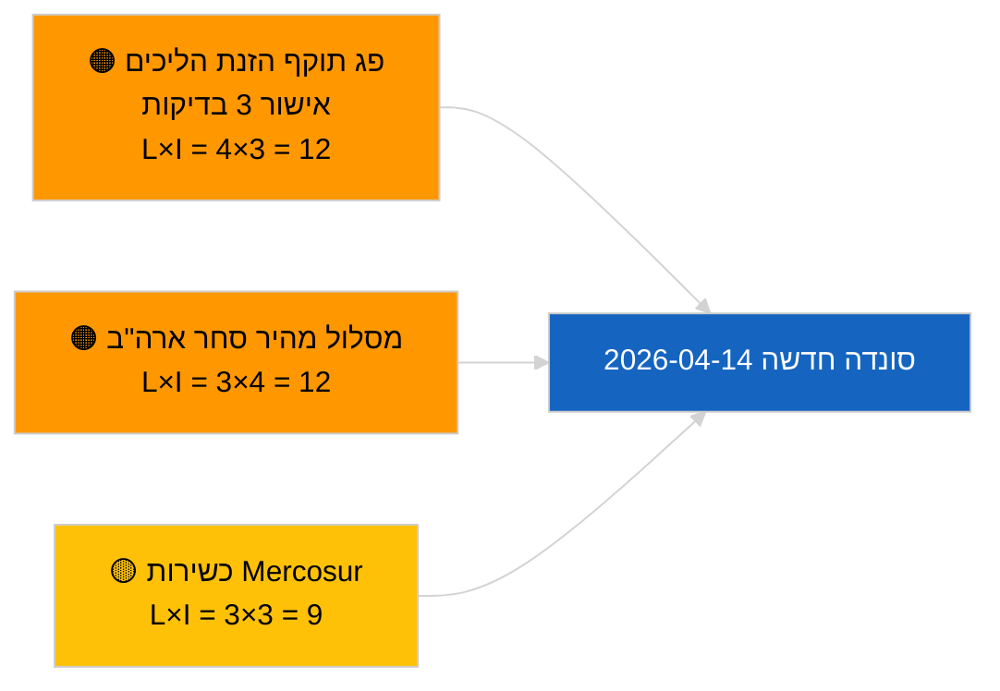
```mermaid
%%{init: {"theme":"dark"}}%%
graph LR
    R1["🟠 פג תוקף הזנת הליכים<br/>אישור 3 בדיקות<br/>L×I = 4×3 = 12"] --> CONS["סונדה חדשה 2026-04-14"]
    R2["🟠 מסלול מהיר סחר ארה&quot;ב<br/>L×I = 3×4 = 12"] --> CONS
    R3["🟡 כשירות Mercosur<br/>L×I = 3×3 = 9"] --> CONS
    style R1 fill:#FF9800,color:#000000
    style R2 fill:#FF9800,color:#000000
    style R3 fill:#FFC107,color:#000000
    style CONS fill:#1565C0,color:#FFFFFF
```

| סיכון | L | I | ציון | טריגר | מקור | אדמירלות |
|-------|:-:|:-:|:----:|-------|------|:--------:|
| פג תוקף הזנת הליכים | 4 | 3 | 12 | נמשך לאחר 14 אפריל | האחות `breaking-2` | A1 |
| מסלול מהיר סחר ארה"ב | 3 | 4 | 12 | פעולה אמריקאית | TA-10-2026-0096 | A1 |
| כשירות לחוות דעת Mercosur | 3 | 3 | 9 | בית משפט מפרסם | TA-10-2026-0008 | A2 |

---

### 🔮 Top Forward Trigger

**ישיבת ועדת הנציבות ביום שלישי 7 אפריל 2026** — הצגת קולג'יום ראשונה לאחר הפסחא.

---

### 🛡️ Source Quality Assessment

- **מקורות ראשיים:** ריצה `9be5bca6-de96-4303-80ff-33cb5f24b51b`; האחות `breaking-2`.
- **אמינות:** 🟢 גבוהה לסיווג מניע.

---

### 📎 Links

| קישור | נתיב |
|-------|------|
| מאמר | `./article.md` |
| ריצות אחיות | כל ריצות 2026-04-03 (ראה תיקייה) |
| מניפסט | `./manifest.json` |

---

**בקרת מסמכים**
- **תבנית:** `/analysis/templates/executive-brief.md`
- **נתיב יצירה:** `analysis/daily/2026-04-03/propositions/executive-brief.md`
- **סיווג:** ציבורי
- **יצירה רטרואקטיבית:** סשן מילוי לאחור.

### Executive Brief Ja

**分類:** OSINT | 公開議会記録
**信頼度:** 🟢 高（議会休暇中の構造評価、API機能低下モード）
**作成日:** 2026-04-03T00:00:00Z（遡及的レポート）
**記事種別:** 提案
**実行ID:** `9be5bca6-de96-4303-80ff-33cb5f24b51b`
**情報源:** 欧州議会オープンデータポータル

---

### 🎯 BLUF

**2026-04-03には欧州委員会の新たな提案もEP独自の提案手続きも開始されなかった。** 実行`9be5bca6-de96-4303-80ff-33cb5f24b51b`は **「0件の特定政策次元にわたる定量的リスク評価」** を返した — 分類された主体ゼロ、定例的な重要度。`get_procedures_feed`は、姉妹実行`breaking-2`により確認された障害エンドポイントの一つである（API機能低下モード、8件中5件の必須フィードが失敗）。4月に持ち越される実質的な提案ポートフォリオは継承されたパイプラインである：汚職防止指令の移行サイクル（TA-10-2026-0094）、重量車両排出規制枠組み（TA-10-2026-0084）、ECB副総裁手続き（TA-10-2026-0060）、規制改善ベースライン（TA-10-2026-0063）、EU-Mercosur欧州司法裁判所付託（TA-10-2026-0008）。空の状態への**🟢 高信頼度**はカレンダーおよび機能低下フィードにより支持されている。

---

### 🧭 3 Decisions This Brief Supports

| # | 決定事項 | 決定者 | 期限 | 根拠 |
|:-:|--------|--------|:----:|-----|
| 1 | **編集:** 提案を毎日スキップ | 編集長 | +24時間 | 空の実行 + 機能低下フィード |
| 2 | **監視:** 休暇後2026-04-14の復旧プローブに含める | データパイプライン | 2026-04-14 | 復活祭後初営業日 |
| 3 | **先行監視:** 欧州委員会火曜会議2026年4月7日 — 復活祭後初のコレジウム審議 | 分析責任者 | 2026-04-07 | 欧州委員会のリズム |

---

### 📰 60-Second Read

- 🔴 **2026-04-03に新手続きなし**；`get_procedures_feed`が3回のプローブ試行でタイムアウト。（🟢 高）
- 🟠 **分類された主体0件**；定例的な重要度。（🟢 高）
- 🟢 **パイプライン繰越**が監視リストを固定。（🟢 高）
- 🟡 **リスク次元すべて「なし」**（本日）。（🟢 高）
- 🔵 **経済的文脈:** AI法施行規則、防衛産業戦略、MFF準備に関するQ2提案が予想される。（🟡 中）
- 🟣 **相互参照:** 姉妹実行`breaking-2`がAPI機能低下モードを正式化。（🟢 高）
- 🩷 **混乱ベクター:** 米国の貿易圧力が4月に欧州委員会の緊急提案を強いる可能性。（🟡 中）
- ⚪ **先行繰越:** Mercosur欧州司法裁判所意見書が依然として最優先の未解決トリガー。

---

### 🗂️ Top Documents / Procedures — Propositions Watch

| 順位 | EP参照 | タイトル（略） | 重み | 信頼度 | ステータス |
|:----:|--------|------------|:----:|:------:|-----------|
| 1 | — | 2026-04-03に新提案なし | 0.0 | 🟢 高 | 機能低下フィード |
| 2 | TA-10-2026-0094 | 汚職防止指令（移行サイクル） | 9.0 | 🟢 高 | 3月26日採択 |
| 3 | TA-10-2026-0008 | EU-Mercosur欧州司法裁判所付託（係属中） | 8.0 | 🟡 中 | 裁判所意見書待ち |

---

### ⚠️ Risk & Threat Snapshot

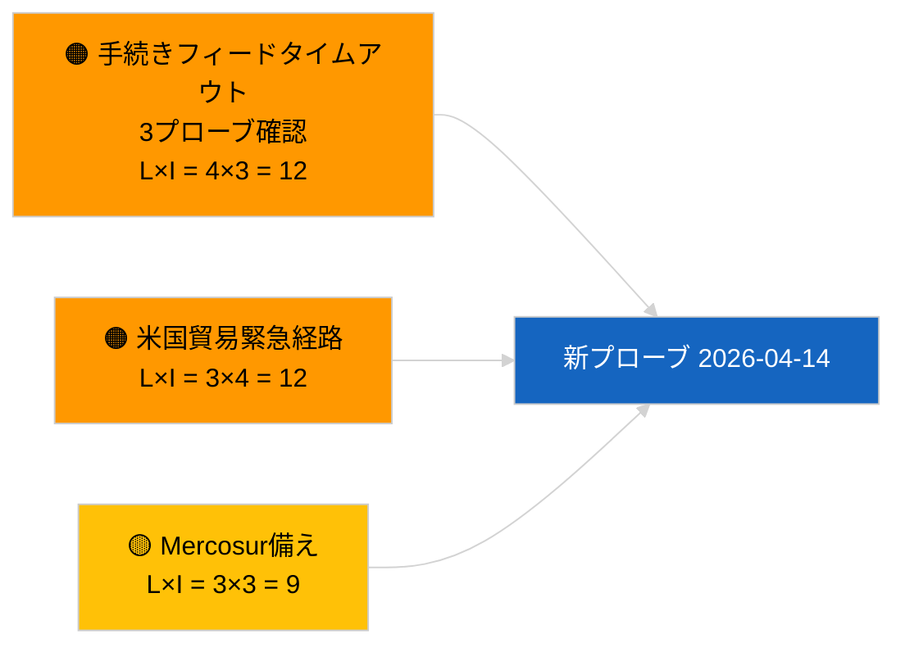
```mermaid
%%{init: {"theme":"dark"}}%%
graph LR
    R1["🟠 手続きフィードタイムアウト<br/>3プローブ確認<br/>L×I = 4×3 = 12"] --> CONS["新プローブ 2026-04-14"]
    R2["🟠 米国貿易緊急経路<br/>L×I = 3×4 = 12"] --> CONS
    R3["🟡 Mercosur備え<br/>L×I = 3×3 = 9"] --> CONS
    style R1 fill:#FF9800,color:#000000
    style R2 fill:#FF9800,color:#000000
    style R3 fill:#FFC107,color:#000000
    style CONS fill:#1565C0,color:#FFFFFF
```

| リスク | L | I | スコア | トリガー | 情報源 | 海軍省評価 |
|--------|:-:|:-:|:-----:|---------|--------|:---------:|
| 手続きフィードタイムアウト | 4 | 3 | 12 | 4月14日以降も継続 | 姉妹`breaking-2` | A1 |
| 米国貿易緊急経路 | 3 | 4 | 12 | 米国の行動 | TA-10-2026-0096 | A1 |
| Mercosur意見書備え | 3 | 3 | 9 | 裁判所公表 | TA-10-2026-0008 | A2 |

---

### 🔮 Top Forward Trigger

**欧州委員会火曜会議2026年4月7日** — 復活祭後初のコレジウム審議。

---

### 🛡️ Source Quality Assessment

- **主要情報源:** 実行`9be5bca6-de96-4303-80ff-33cb5f24b51b`；姉妹`breaking-2`。
- **信頼度:** 🟢 ドライバー分類において高。

---

### 📎 Links

| リンク | パス |
|--------|------|
| 記事 | `./article.md` |
| 姉妹実行 | 2026-04-03全実行（フォルダ参照） |
| マニフェスト | `./manifest.json` |

---

**文書管理**
- **テンプレート:** `/analysis/templates/executive-brief.md`
- **成果物パス:** `analysis/daily/2026-04-03/propositions/executive-brief.md`
- **分類:** 公開
- **遡及的生成:** バックフィルセッション。

### Executive Brief Ko

**분류:** OSINT | 공개 의회 기록
**신뢰도:** 🟢 높음 (의회 휴회 중 구조적 평가, API 기능 저하 모드)
**생성일:** 2026-04-03T00:00:00Z (소급 보고서)
**기사 유형:** 제안
**실행 ID:** `9be5bca6-de96-4303-80ff-33cb5f24b51b`
**출처:** 유럽의회 공개 데이터 포털

---

### 🎯 BLUF

**2026-04-03에는 새로운 집행위원회 제안이나 EP 자체 제안 절차가 개시되지 않았다.** 실행 `9be5bca6-de96-4303-80ff-33cb5f24b51b`은 **«0개의 식별된 정책 차원에 걸친 정량적 위험 평가»** 를 반환했다 — 분류된 행위자 없음, 일상적 중요도. `get_procedures_feed`는 자매 실행 `breaking-2`에 의해 확인된 실패 엔드포인트 중 하나다 (API 기능 저하 모드, 8개 필수 피드 중 5개 실패). 4월로 이월되는 실질적 제안 포트폴리오는 계승된 파이프라인이다: 부패방지 지침 이행 사이클 (TA-10-2026-0094), 중량 차량 배출 규제 프레임워크 (TA-10-2026-0084), ECB 부총재 절차 (TA-10-2026-0060), 더 나은 규제 기준선 (TA-10-2026-0063), 진행 중인 EU-Mercosur ECJ 회부 (TA-10-2026-0008). 빈 상태에 대한 **🟢 높은 신뢰도**는 일정 + 기능 저하 피드에 의해 뒷받침된다.

---

### 🧭 3 Decisions This Brief Supports

| # | 결정 사항 | 결정자 | 기한 | 근거 |
|:-:|---------|--------|:----:|-----|
| 1 | **편집:** 제안을 매일 건너뜀 | 편집장 | +24시간 | 빈 실행 + 기능 저하 피드 |
| 2 | **모니터링:** 휴가 후 2026-04-14 복구 프로브에 포함 | 데이터 파이프라인 | 2026-04-14 | 부활절 이후 첫 영업일 |
| 3 | **선행 모니터링:** 집행위원회 화요일 회의 2026년 4월 7일 — 부활절 이후 첫 집합체 심의 | 분석 책임자 | 2026-04-07 | 집행위원회 리듬 |

---

### 📰 60-Second Read

- 🔴 **2026-04-03에 새로운 절차 없음**; `get_procedures_feed`가 3번의 프로브 시도에서 시간 초과. (🟢 높음)
- 🟠 **분류된 행위자 0개**; 일상적 중요도. (🟢 높음)
- 🟢 **파이프라인 이월**이 모니터링 목록을 고정. (🟢 높음)
- 🟡 **위험 차원 모두 «없음»** (오늘). (🟢 높음)
- 🔵 **경제적 맥락:** AI법 시행 규칙, 방산 전략, MFF 준비에 관한 Q2 제안 예상. (🟡 중간)
- 🟣 **교차 참조:** 자매 실행 `breaking-2`가 API 기능 저하 모드를 공식화. (🟢 높음)
- 🩷 **혼란 벡터:** 미국의 무역 압력이 4월에 집행위원회 긴급 제안을 강제할 가능성. (🟡 중간)
- ⚪ **선행 이월:** Mercosur ECJ 의견서가 여전히 최우선 미결 트리거.

---

### 🗂️ Top Documents / Procedures — Propositions Watch

| 순위 | EP 참조 | 제목 (약칭) | 가중치 | 신뢰도 | 상태 |
|:----:|---------|-----------|:------:|:------:|-----|
| 1 | — | 2026-04-03에 새로운 제안 없음 | 0.0 | 🟢 높음 | 기능 저하 피드 |
| 2 | TA-10-2026-0094 | 부패방지 지침 (이행 사이클) | 9.0 | 🟢 높음 | 3월 26일 채택 |
| 3 | TA-10-2026-0008 | EU-Mercosur ECJ 회부 (계류 중) | 8.0 | 🟡 중간 | 재판소 의견서 대기 |

---

### ⚠️ Risk & Threat Snapshot

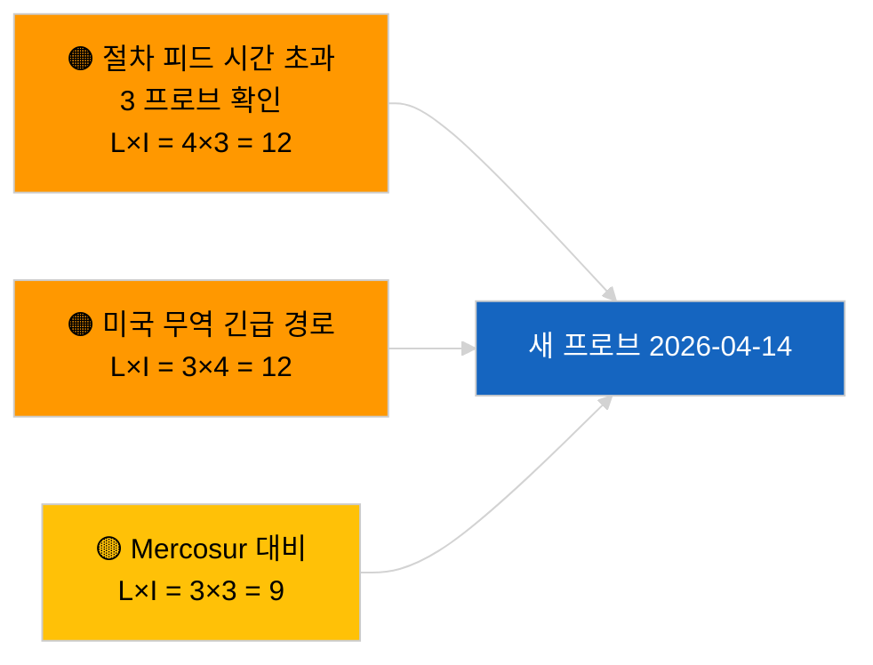
```mermaid
%%{init: {"theme":"dark"}}%%
graph LR
    R1["🟠 절차 피드 시간 초과<br/>3 프로브 확인<br/>L×I = 4×3 = 12"] --> CONS["새 프로브 2026-04-14"]
    R2["🟠 미국 무역 긴급 경로<br/>L×I = 3×4 = 12"] --> CONS
    R3["🟡 Mercosur 대비<br/>L×I = 3×3 = 9"] --> CONS
    style R1 fill:#FF9800,color:#000000
    style R2 fill:#FF9800,color:#000000
    style R3 fill:#FFC107,color:#000000
    style CONS fill:#1565C0,color:#FFFFFF
```

| 위험 | L | I | 점수 | 트리거 | 출처 | 해군성 등급 |
|------|:-:|:-:|:---:|-------|------|:---------:|
| 절차 피드 시간 초과 | 4 | 3 | 12 | 4월 14일 이후에도 지속 | 자매 `breaking-2` | A1 |
| 미국 무역 긴급 경로 | 3 | 4 | 12 | 미국의 행동 | TA-10-2026-0096 | A1 |
| Mercosur 의견서 대비 | 3 | 3 | 9 | 법원 공표 | TA-10-2026-0008 | A2 |

---

### 🔮 Top Forward Trigger

**집행위원회 화요일 회의 2026년 4월 7일** — 부활절 이후 첫 집합체 심의.

---

### 🛡️ Source Quality Assessment

- **주요 출처:** 실행 `9be5bca6-de96-4303-80ff-33cb5f24b51b`; 자매 `breaking-2`.
- **신뢰도:** 🟢 드라이버 분류에서 높음.

---

### 📎 Links

| 링크 | 경로 |
|------|------|
| 기사 | `./article.md` |
| 자매 실행 | 2026-04-03 모든 실행 (폴더 참조) |
| 매니페스트 | `./manifest.json` |

---

**문서 관리**
- **템플릿:** `/analysis/templates/executive-brief.md`
- **아티팩트 경로:** `analysis/daily/2026-04-03/propositions/executive-brief.md`
- **분류:** 공개
- **소급 생성:** 백필 세션.

### Executive Brief Nl

### 🎯 BLUF

**Op 2026-04-03 werden geen nieuwe Commissievoorstellen of EP-initiatiefprocedures geopend.** Uitvoering `9be5bca6-de96-4303-80ff-33cb5f24b51b` retourneerde **«Kwantitatieve risicobeoordeling over 0 geïdentificeerde beleidsdimensies»** — nul geclassificeerde actoren, ROUTINEUS belang. `get_procedures_feed` behoort tot de mislukte eindpunten bevestigd door de zusteruitvoering `breaking-2` (GEDEGRADEERDE API-modus, 5/8 verplichte feeds falen). De substantiële portefeuille van voorstellen die wordt meegenomen naar april is de geërvde pipeline: transposatiecyclus van de antikorruptierichtlijn (TA-10-2026-0094), HDV-emissiekader (TA-10-2026-0084), ECB-vicepresidentsprocedure (TA-10-2026-0060), Better Regulation-basislijn (TA-10-2026-0063) en de aanhangige EU-Mercosur HvJ-verwijzing (TA-10-2026-0008). **🟢 HOOG vertrouwen** in de lege status wordt aangestuurd door agenda + GEDEGRADEERDE feeds.

---

### 🧭 3 Decisions This Brief Supports

| # | Beslissing | Wie beslist | Termijn | Onderbouwing |
|:-:|-----------|------------|:-------:|-------------|
| 1 | **Redactioneel:** Voorstellen dagelijks OVERSLAAN | Redacteur | +24u | Lege uitvoering + GEDEGRADEERDE feeds |
| 2 | **Monitoring:** opnemen in 2026-04-14 herstellingssonde na vakantie | Datapipeline | 2026-04-14 | Eerste post-Pasen werkdag |
| 3 | **Vooruitkijkende monitoring:** Vergadering van de Commissie op dinsdag 7 april 2026 — eerste post-Pasen college-vergadering | Analysecoördinator | 2026-04-07 | Commissie-ritme |

---

### 📰 60-Second Read

- 🔴 **Geen nieuwe procedures** op 2026-04-03; `get_procedures_feed` timeout na 3 sondepogingen. (🟢 Hoog)
- 🟠 **0 actoren geclassificeerd**; ROUTINEUS belang. (🟢 Hoog)
- 🟢 **Pipeline-carryover** verankert de bewakingslijst. (🟢 Hoog)
- 🟡 **Risicoblokken alle «geen»** vandaag. (🟢 Hoog)
- 🔵 **Economische context:** verwachte Q2-voorstellen over uitvoeringsregels AI-verordening, Industriële Defensiestrategie, MFK-voorbereiding. (🟡 Gemiddeld)
- 🟣 **Kruisverwijzing:** zusteruitvoering `breaking-2` formaliseert GEDEGRADEERDE API-modus. (🟢 Hoog)
- 🩷 **Verstoringsvektor:** Amerikaanse handelsdruk kan een Commissievoorstel via sneltracé in april forceren. (🟡 Gemiddeld)
- ⚪ **Voorwaarts overdragen:** HvJ-advies Mercosur blijft de hoogst geprioriteerde afwachtende trigger.

---

### 🗂️ Top Documents / Procedures — Propositions Watch

| Rang | EP-referentie | Titel (kort) | Gewicht | Betrouwbaarheid | Status |
|:----:|---------------|-------------|:-------:|:---------------:|--------|
| 1 | — | Geen nieuwe voorstellen op 2026-04-03 | 0,0 | 🟢 HOOG | GEDEGRADEERDE feeds |
| 2 | TA-10-2026-0094 | Antikorruptierichtlijn (transposatiecyclus) | 9,0 | 🟢 HOOG | Aangenomen 26 maart |
| 3 | TA-10-2026-0008 | EU-Mercosur HvJ-verwijzing (aanhangig) | 8,0 | 🟡 GEMIDDELD | HvJ-advies verwacht |

---

### ⚠️ Risk & Threat Snapshot

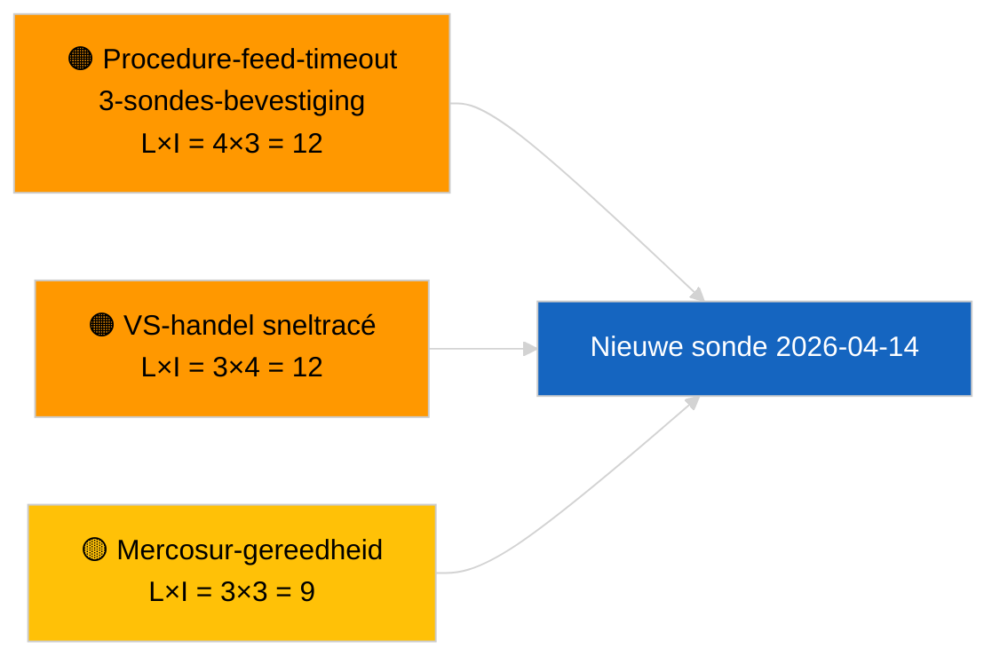
```mermaid
%%{init: {"theme":"dark"}}%%
graph LR
    R1["🟠 Procedure-feed-timeout<br/>3-sondes-bevestiging<br/>L×I = 4×3 = 12"] --> CONS["Nieuwe sonde 2026-04-14"]
    R2["🟠 VS-handel sneltracé<br/>L×I = 3×4 = 12"] --> CONS
    R3["🟡 Mercosur-gereedheid<br/>L×I = 3×3 = 9"] --> CONS
    style R1 fill:#FF9800,color:#000000
    style R2 fill:#FF9800,color:#000000
    style R3 fill:#FFC107,color:#000000
    style CONS fill:#1565C0,color:#FFFFFF
```

| Risico | L | I | Score | Trigger | Bron | Admiraliteit |
|--------|:-:|:-:|:-----:|---------|------|:------------:|
| Procedure-feed-timeout | 4 | 3 | 12 | Aanhoudend na 14 april | Zuster `breaking-2` | A1 |
| VS-handel sneltracé | 3 | 4 | 12 | VS-actie | TA-10-2026-0096 | A1 |
| Mercosur-advies gereedheid | 3 | 3 | 9 | HvJ publiceert | TA-10-2026-0008 | A2 |

---

### 🔮 Top Forward Trigger

**Vergadering van de Commissie op dinsdag 7 april 2026** — eerste post-Pasen college-vergadering.

---

### 🛡️ Source Quality Assessment

- **Primaire bronnen:** Uitvoering `9be5bca6-de96-4303-80ff-33cb5f24b51b`; zuster `breaking-2`.
- **Betrouwbaarheid:** 🟢 HOOG voor driverclassificatie.

---

### 📎 Links

| Link | Pad |
|------|-----|
| Artikel | `./article.md` |
| Zusteruitvoeringen | Alle uitvoeringen van 2026-04-03 (zie map) |
| Manifest | `./manifest.json` |

---

**Documentbeheer**
- **Sjabloon:** `/analysis/templates/executive-brief.md`
- **Artefactpad:** `analysis/daily/2026-04-03/propositions/executive-brief.md`
- **Classificatie:** Openbaar
- **Retroactieve generatie:** Back-fill sessie.

### Executive Brief No

### 🎯 BLUF

**Ingen nye Kommisjonspropositsjoner eller EP-eget-initiativ-prosedyrer ble åpnet den 2026-04-03.** Kjøring `9be5bca6-de96-4303-80ff-33cb5f24b51b` returnerte **"Kvantitativ risikovurdering over 0 identifiserte politiske dimensjoner"** — null klassifiserte aktører, RUTINE-betydning. `get_procedures_feed` er blant de mislykkede endepunktene bekreftet av søskenkjøringen `breaking-2` (DEGRADERT API-tilstand, 5/8 obligatoriske tilganger feiler). Den vesentlige proposisjonsporteføljen som bringes inn i april er den nedarvede rørledningen: antikorrupsjonsdirektivets transposisjonssyklus (TA-10-2026-0094), HDV-utslippsrammeverket (TA-10-2026-0084), ECBs visepresidentprosedyre (TA-10-2026-0060), Better Law-Making-basislinjen (TA-10-2026-0063) og den verserende EU-Mercosur ECJ-forelæggelsen (TA-10-2026-0008). **🟢 HØY tillit** til tomt tilstand er kalender + DEGRADERT tilgang drevet.

---

### 🧭 3 Decisions This Brief Supports

| # | Beslutning | Hvem bestemmer | Frist | Dokumentasjon |
|:-:|-----------|---------------|:-----:|---------------|
| 1 | **Redaksjonell:** HOPP OVER proposisjoner daglig | Redaktør | +24t | Tom kjøring + DEGRADERTE tilganger |
| 2 | **Overvåking:** inkluder i 2026-04-14 gjenopprettingssonde etter ferie | Datarørledning | 2026-04-14 | Første post-påske hverdag |
| 3 | **Fremovervåking:** Kommisjonens tirsdagsmøte 7. april 2026 — første post-påske kollegieoppstilling | Analyseansvarlig | 2026-04-07 | Kommisjonens kadense |

---

### 📰 60-Second Read

- 🔴 **Ingen nye prosedyrer** den 2026-04-03; `get_procedures_feed` tidsavbrudd ved 3 sondeprøver. (🟢 Høy)
- 🟠 **0 aktører klassifisert**; RUTINE-betydning. (🟢 Høy)
- 🟢 **Rørlednings-carryover** forankrer overvåkingslisten. (🟢 Høy)
- 🟡 **Risikodimensjoner alle "ingen"** i dag. (🟢 Høy)
- 🔵 **Økonomisk kontekst:** forventede Q2-proposisjoner om AI-lovens gjennomføringsregler, Forsvarsindustriel strategi, MFF-forberedelse. (🟡 Middel)
- 🟣 **Kryssreferanse:** søskenkjøringen `breaking-2` formaliserer DEGRADERT API-tilstand. (🟢 Høy)
- 🩷 **Forstyrelsesvektor:** USAs handelspress kan tvinge frem en hurtigspors-Kommisjonspropositjon i april. (🟡 Middel)
- ⚪ **Fremoverfører:** Mercosur ECJ-uttalelsen er fortsatt den høyest prioriterte ventende utløseren.

---

### 🗂️ Top Documents / Procedures — Propositions Watch

| Rang | EP-referanse | Tittel (kort) | Vekt | Tillit | Status |
|:----:|--------------|--------------|:----:|:------:|--------|
| 1 | — | Ingen nye proposisjoner den 2026-04-03 | 0.0 | 🟢 HØY | DEGRADERTE tilganger |
| 2 | TA-10-2026-0094 | Antikorrupsjonsdirektiv (transposisjonssyklus) | 9.0 | 🟢 HØY | Vedtatt 26. mars |
| 3 | TA-10-2026-0008 | EU-Mercosur ECJ-forelæggelse (verserende) | 8.0 | 🟡 MIDDEL | Domstolsuttalelse forventet |

---

### ⚠️ Risk & Threat Snapshot

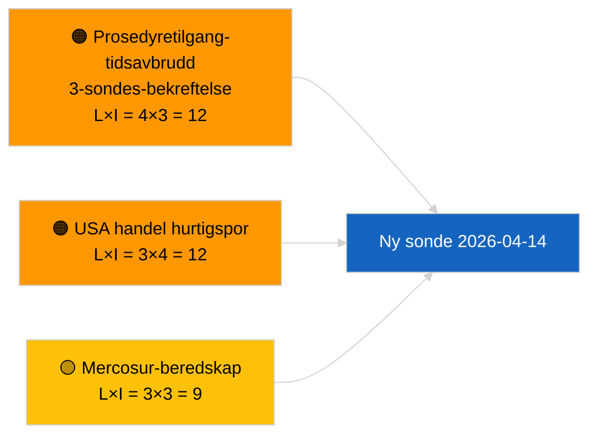
```mermaid
%%{init: {"theme":"dark"}}%%
graph LR
    R1["🟠 Prosedyretilgang-tidsavbrudd<br/>3-sondes-bekreftelse<br/>L×I = 4×3 = 12"] --> CONS["Ny sonde 2026-04-14"]
    R2["🟠 USA handel hurtigspor<br/>L×I = 3×4 = 12"] --> CONS
    R3["🟡 Mercosur-beredskap<br/>L×I = 3×3 = 9"] --> CONS
    style R1 fill:#FF9800,color:#000000
    style R2 fill:#FF9800,color:#000000
    style R3 fill:#FFC107,color:#000000
    style CONS fill:#1565C0,color:#FFFFFF
```

| Risiko | L | I | Poeng | Utløser | Kilde | Admiralitet |
|--------|:-:|:-:|:-----:|---------|-------|:-----------:|
| Prosedyretilgang-tidsavbrudd | 4 | 3 | 12 | Vedvarer etter 14. april | Søsken `breaking-2` | A1 |
| USA handel hurtigspor | 3 | 4 | 12 | USA-handling | TA-10-2026-0096 | A1 |
| Mercosur-uttalelse beredskap | 3 | 3 | 9 | Domstolen frigir | TA-10-2026-0008 | A2 |

---

### 🔮 Top Forward Trigger

**Kommisjonens tirsdagsmøte 7. april 2026** — første post-påske kollegieoppstilling.

---

### 🛡️ Source Quality Assessment

- **Primære kilder:** Kjøring `9be5bca6-de96-4303-80ff-33cb5f24b51b`; søsken `breaking-2`.
- **Tillit:** 🟢 HØY på drivklassifisering.

---

### 📎 Links

| Lenke | Sti |
|-------|-----|
| Artikkel | `./article.md` |
| Søskenkjøringer | Alle 2026-04-03-kjøringer (se mappe) |
| Manifest | `./manifest.json` |

---

**Dokumentkontroll**
- **Mal:** `/analysis/templates/executive-brief.md`
- **Artefaktsti:** `analysis/daily/2026-04-03/propositions/executive-brief.md`
- **Klassifisering:** Offentlig
- **Retroaktiv generering:** Back-fill session.

### Executive Brief Sv

### 🎯 BLUF

**Inga nya kommissionspropositioner eller EP-egeninitierade förfaranden öppnades den 2026-04-03.** Körning `9be5bca6-de96-4303-80ff-33cb5f24b51b` returnerade **"Kvantitativ riskvärdering för 0 identifierade politiska dimensioner"** — noll klassificerade aktörer, RUTINMÄSSIG betydelse. `get_procedures_feed` hör till de misslyckade slutpunkterna som bekräftats av syskonkörningen `breaking-2` (DEGRADERAT API-läge, 5/8 obligatoriska flöden misslyckas). Den substantiella propositionsportföljen som förs in i april är det nedärvda rörledningen: antikorruptionsdirektivets transponeringscykel (TA-10-2026-0094), utsläppsramen för tunga fordon (TA-10-2026-0084), ECB:s vice-ordförandeförfarande (TA-10-2026-0060), Better Law-Making-baslinjen (TA-10-2026-0063) och den pågående EU-Mercosur ECJ-hänskjutningen (TA-10-2026-0008). **🟢 HÖG tillförlitlighet** för det tomma tillståndet är drivs av kalender + DEGRADERADE flöden.

---

### 🧭 3 Decisions This Brief Supports

| # | Beslut | Vem beslutar | Tidsfrist | Underlag |
|:-:|--------|-------------|:--------:|---------|
| 1 | **Redaktionellt:** HOPPA ÖVER propositioner dagligen | Redaktör | +24h | Tom körning + DEGRADERADE flöden |
| 2 | **Övervakning:** inkludera i 2026-04-14 sond för återställning efter semester | Datapipeline | 2026-04-14 | Första vardagen efter påsk |
| 3 | **Framåtbevakning:** Kommissionens tisdagsmöte 7 april 2026 — första uppläggningen av college efter påsk | Analysansvarig | 2026-04-07 | Kommissionens rytm |

---

### 📰 60-Second Read

- 🔴 **Inga nya förfaranden** den 2026-04-03; `get_procedures_feed` timeout vid 3 sonder. (🟢 Hög)
- 🟠 **0 aktörer klassificerade**; RUTINMÄSSIG betydelse. (🟢 Hög)
- 🟢 **Rörlednings-carryover** förankrar bevakningslistan. (🟢 Hög)
- 🟡 **Riskdimensioner alla "ingen"** idag. (🟢 Hög)
- 🔵 **Ekonomiskt sammanhang:** förväntade propositioner för Q2 om AI-aktens genomföranderegler, Försvarsindustristrategin, MFF-förberedelser. (🟡 Medel)
- 🟣 **Korsreferens:** syskonkörningen `breaking-2` formaliserar DEGRADERAT API-läge. (🟢 Hög)
- 🩷 **Störningsvektor:** USA:s handelstryck kan tvinga fram en snabbspårad kommissionsproposition i april. (🟡 Medel)
- ⚪ **Carryforward:** Mercosur ECJ-yttrandet är fortfarande den högst prioriterade väntande utlösaren.

---

### 🗂️ Top Documents / Procedures — Propositions Watch

| Rang | EP-referens | Titel (kort) | Vikt | Tillförlitlighet | Status |
|:----:|-------------|-------------|:----:|:----------------:|--------|
| 1 | — | Inga nya propositioner den 2026-04-03 | 0.0 | 🟢 HÖG | DEGRADERADE flöden |
| 2 | TA-10-2026-0094 | Antikorruptionsdirektiv (transponeringscykel) | 9.0 | 🟢 HÖG | Antaget 26 mars |
| 3 | TA-10-2026-0008 | EU-Mercosur ECJ-hänskjutning (pågående) | 8.0 | 🟡 MEDEL | Domstolsyttrande väntas |

---

### ⚠️ Risk & Threat Snapshot

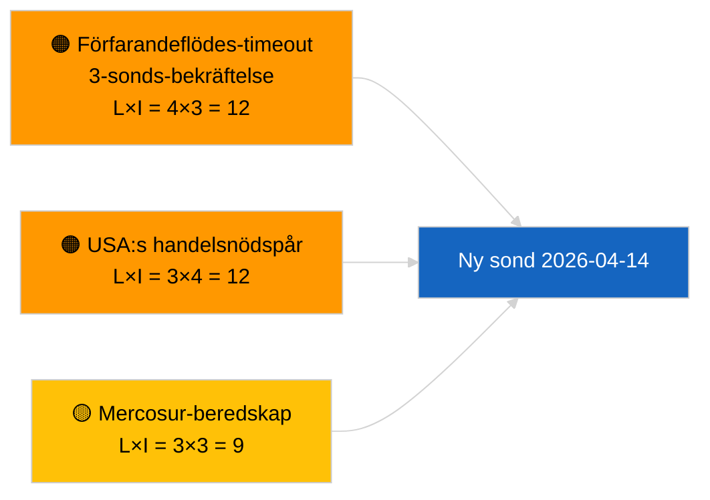
```mermaid
%%{init: {"theme":"dark"}}%%
graph LR
    R1["🟠 Förfarandeflödes-timeout<br/>3-sonds-bekräftelse<br/>L×I = 4×3 = 12"] --> CONS["Ny sond 2026-04-14"]
    R2["🟠 USA:s handelsnödspår<br/>L×I = 3×4 = 12"] --> CONS
    R3["🟡 Mercosur-beredskap<br/>L×I = 3×3 = 9"] --> CONS
    style R1 fill:#FF9800,color:#000000
    style R2 fill:#FF9800,color:#000000
    style R3 fill:#FFC107,color:#000000
    style CONS fill:#1565C0,color:#FFFFFF
```

| Risk | L | I | Poäng | Utlösare | Källa | Admiralitet |
|------|:-:|:-:|:-----:|---------|-------|:-----------:|
| Förfarandeflödes-timeout | 4 | 3 | 12 | Kvarstår efter 14 april | Syskon `breaking-2` | A1 |
| USA:s handelsnödspår | 3 | 4 | 12 | USA:s agerande | TA-10-2026-0096 | A1 |
| Mercosur-yttrande beredskap | 3 | 3 | 9 | Domstolen publicerar | TA-10-2026-0008 | A2 |

---

### 🔮 Top Forward Trigger

**Kommissionens tisdagsmöte 7 april 2026** — första uppläggningen av college efter påsk.

---

### 🛡️ Source Quality Assessment

- **Primära källor:** Körning `9be5bca6-de96-4303-80ff-33cb5f24b51b`; syskon `breaking-2`.
- **Tillförlitlighet:** 🟢 HÖG på drivrutinsklassificering.

---

### 📎 Links

| Länk | Sökväg |
|------|--------|
| Artikel | `./article.md` |
| Syskonkörningar | Alla 2026-04-03-körningar (se mapp) |
| Manifest | `./manifest.json` |

---

**Dokumentkontroll**
- **Mall:** `/analysis/templates/executive-brief.md`
- **Artefaktsökväg:** `analysis/daily/2026-04-03/propositions/executive-brief.md`
- **Klassificering:** Offentlig
- **Retroaktiv generering:** Backfill-session.

### Executive Brief Zh

**分类：** OSINT | 公开议会记录
**可信度：** 🟢 高（议会休会期间的结构性评估，API降级模式）
**生成日期：** 2026-04-03T00:00:00Z（追溯报告）
**文章类型：** 提案
**运行ID：** `9be5bca6-de96-4303-80ff-33cb5f24b51b`
**来源：** 欧洲议会开放数据门户

---

### 🎯 BLUF

**2026-04-03未开启任何新的欧盟委员会提案或欧洲议会自主程序。** 运行`9be5bca6-de96-4303-80ff-33cb5f24b51b`返回 **«对0个已识别政策维度的定量风险评估»** — 零分类行为体，常规重要性。`get_procedures_feed`属于经姊妹运行`breaking-2`确认的故障端点之一（API降级模式，8个必需feed中5个失败）。进入四月的实质性提案组合为继承管道：反腐败指令转置周期（TA-10-2026-0094）、重型车辆排放框架（TA-10-2026-0084）、欧洲央行副行长程序（TA-10-2026-0060）、更好立法基线（TA-10-2026-0063）以及待决EU-Mercosur欧洲法院预裁决（TA-10-2026-0008）。空置状态的**🟢 高可信度**由日历 + 降级feed支持。

---

### 🧭 3 Decisions This Brief Supports

| # | 决策 | 决策者 | 截止时间 | 依据 |
|:-:|------|--------|:-------:|------|
| 1 | **编辑：** 每日跳过提案 | 编辑 | +24小时 | 空运行 + 降级feed |
| 2 | **监控：** 纳入假期后2026-04-14恢复探测 | 数据管道 | 2026-04-14 | 复活节后首个工作日 |
| 3 | **前瞻监控：** 欧盟委员会周二会议2026年4月7日 — 复活节后首次学院审议 | 分析负责人 | 2026-04-07 | 委员会节奏 |

---

### 📰 60-Second Read

- 🔴 **2026-04-03无新程序**；`get_procedures_feed`在3次探测尝试后超时。（🟢 高）
- 🟠 **0个行为体分类**；常规重要性。（🟢 高）
- 🟢 **管道延续**锚定监控清单。（🟢 高）
- 🟡 **风险维度均为«无»**（今日）。（🟢 高）
- 🔵 **经济背景：** 预期Q2提案涵盖人工智能法实施细则、国防工业战略、MFF准备。（🟡 中等）
- 🟣 **交叉参考：** 姊妹运行`breaking-2`正式确定API降级模式。（🟢 高）
- 🩷 **扰动向量：** 美国贸易压力可能迫使欧盟委员会在四月提出快速通道提案。（🟡 中等）
- ⚪ **前向延续：** Mercosur欧洲法院意见仍为最高优先级待处理触发事项。

---

### 🗂️ Top Documents / Procedures — Propositions Watch

| 排名 | EP参考 | 标题（简） | 权重 | 可信度 | 状态 |
|:----:|--------|---------|:----:|:------:|------|
| 1 | — | 2026-04-03无新提案 | 0.0 | 🟢 高 | 降级feed |
| 2 | TA-10-2026-0094 | 反腐败指令（转置周期） | 9.0 | 🟢 高 | 3月26日通过 |
| 3 | TA-10-2026-0008 | EU-Mercosur欧洲法院预裁决（待决） | 8.0 | 🟡 中等 | 法院意见待定 |

---

### ⚠️ Risk & Threat Snapshot

```mermaid
%%{init: {"theme":"dark"}}%%
graph LR
    R1["🟠 程序feed超时<br/>3探测确认<br/>L×I = 4×3 = 12"] --> CONS["新探测 2026-04-14"]
    R2["🟠 美国贸易快速通道<br/>L×I = 3×4 = 12"] --> CONS
    R3["🟡 Mercosur应对准备<br/>L×I = 3×3 = 9"] --> CONS
    style R1 fill:#FF9800,color:#000000
    style R2 fill:#FF9800,color:#000000
    style R3 fill:#FFC107,color:#000000
    style CONS fill:#1565C0,color:#FFFFFF
```

| 风险 | L | I | 分数 | 触发因素 | 来源 | 海军部评级 |
|------|:-:|:-:|:---:|---------|------|:---------:|
| 程序feed超时 | 4 | 3 | 12 | 4月14日后持续 | 姊妹`breaking-2` | A1 |
| 美国贸易快速通道 | 3 | 4 | 12 | 美国行动 | TA-10-2026-0096 | A1 |
| Mercosur意见应对准备 | 3 | 3 | 9 | 法院发布 | TA-10-2026-0008 | A2 |

---

### 🔮 Top Forward Trigger

**欧盟委员会周二会议2026年4月7日** — 复活节后首次学院审议。

---

### 🛡️ Source Quality Assessment

- **主要来源：** 运行`9be5bca6-de96-4303-80ff-33cb5f24b51b`；姊妹`breaking-2`。
- **可信度：** 🟢 驱动分类高。

---

### 📎 Links

| 链接 | 路径 |
|------|------|
| 文章 | `./article.md` |
| 姊妹运行 | 所有2026-04-03运行（见文件夹） |
| 清单 | `./manifest.json` |

---

**文档管理**
- **模板：** `/analysis/templates/executive-brief.md`
- **制品路径：** `analysis/daily/2026-04-03/propositions/executive-brief.md`
- **分类：** 公开
- **追溯生成：** 回填会话。

### Coalition Analysis

### Computed Metrics (Script-Generated Context)
- **Overall Stability**: 0.0%
- **Forecast**: volatile
- **Patterns Analysed**: 0
- **Stable Groups**: No stable groups identified from voting data
- **Declining Groups**: No declining groups identified from voting data
- **Raw Patterns Evaluated**: 0

### AI Analysis Prompt

> **Instructions for AI Agent (Opus 4.6):** Using the political-risk-methodology.md coalition risk framework and the computed metrics above, produce a coalition intelligence analysis. Your analysis MUST:
>
> 1. **Assess the Grand Coalition** (EPP + S&D + Renew): Is it holding? What are the stress points?
> 2. **Identify emerging alliances**: Are ECR, PfE, or Greens/EFA forming tactical voting blocs?
> 3. **Analyse abstention patterns**: High abstention rates signal internal group conflicts — identify which groups and why
> 4. **Cross-party voting**: Identify any cases where MEPs voted against their group line on recent adopted texts
> 5. **Predict coalition evolution**: Based on current patterns, which coalitions will strengthen/weaken in the next month?
> 6. **Include a Mermaid diagram** showing group-to-group voting alignment strength
> 7. **Confidence levels**: Rate each coalition assessment as 🟢 High / 🟡 Medium / 🔴 Low
>
> If voting data is limited (patterns analysed = 0), use adopted texts and political landscape data to infer coalition dynamics from the policy positions embedded in recent legislation.

### AI-Produced Coalition Intelligence

[TO BE FILLED BY AI AGENT — Substantive coalition dynamics analysis with evidence citations, confidence levels, and forward-looking predictions. Quality gate: minimum 400 words.]

### Date: 2026-04-03

### Stakeholder Analysis

### Data Available for Stakeholder Assessment (Script-Generated Context)
| Stakeholder Group | Primary Data Sources | Data Points |
|-------------------|---------------------|-------------|
| Political Groups | Procedures, Adopted Texts, Voting Records, Coalitions | 114 |
| Civil Society | Documents, Questions, Events | 0 |
| Industry | Procedures, Adopted Texts | 114 |
| National Governments | Adopted Texts, Procedures, Coalitions | 114 |
| Citizens | Questions, MEP Updates, Events | 737 |
| EU Institutions | Events, Procedures, Adopted Texts, Voting Records | 114 |

### Data Source Summary
| Source | Count |
|--------|-------|
| patterns | 0 |
| votingRecords | 0 |
| events | 0 |
| documents | 0 |
| adoptedTexts | 114 |
| procedures | 0 |
| mepUpdates | 737 |
| plenaryDocuments | 0 |
| committeeDocuments | 0 |
| plenarySessionDocuments | 0 |
| externalDocuments | 0 |
| questions | 0 |
| declarations | 51 |
| corporateBodies | 0 |

### AI Analysis Prompt

> **Instructions for AI Agent (Opus 4.6):** Using the stakeholder-impact.md template and the data inventory above, produce a stakeholder impact analysis for each of the 6 stakeholder groups. For each group:
>
> 1. **Impact direction**: positive / negative / neutral / mixed
> 2. **Impact severity**: high / medium / low
> 3. **Specific evidence**: Cite ≥2 specific EP documents, votes, or procedures that affect this stakeholder
> 4. **Reasoning**: 2-3 sentences explaining WHY this stakeholder is affected and HOW
> 5. **Action items**: What should this stakeholder watch or do in response?
> 6. **Confidence level**: 🟢 High / 🟡 Medium / 🔴 Low
>
> Focus on the MOST RECENT adopted texts and procedures. Do not produce generic stakeholder descriptions — every assessment must be grounded in specific EP data from this date period.

### AI-Produced Stakeholder Assessment

[TO BE FILLED BY AI AGENT — Each stakeholder group must have impact direction, severity, evidence citations, and reasoning. Quality gate: minimum 300 words of original analytical prose.]

### Date: 2026-04-03

> **Provenance & Audit**
>
> - **Article type:** `propositions`
> - **Run date:** 2026-04-03
> - **Run id:** `9be5bca6-de96-4303-80ff-33cb5f24b51b`
> - **Gate result:** `PENDING`
> - **Analysis tree:** [analysis/daily/2026-04-03/propositions](https://github.com/Hack23/euparliamentmonitor/tree/main/analysis/daily/2026-04-03/propositions)
> - **Manifest:** [manifest.json](https://github.com/Hack23/euparliamentmonitor/blob/main/analysis/daily/2026-04-03/propositions/manifest.json)

<h2 id="aggregator-tradecraft-references">Tradecraft References</h2>

This article is produced under the [Hack23 AB](https://hack23.com) intelligence tradecraft library. Every methodology and artifact template applied to this run is linked below.

### Artifact templates

- [README](https://github.com/Hack23/euparliamentmonitor/blob/main/analysis/templates/README.md)
- [Actor Mapping](https://github.com/Hack23/euparliamentmonitor/blob/main/analysis/templates/actor-mapping.md)
- [Actor Threat Profiles](https://github.com/Hack23/euparliamentmonitor/blob/main/analysis/templates/actor-threat-profiles.md)
- [Analysis Index](https://github.com/Hack23/euparliamentmonitor/blob/main/analysis/templates/analysis-index.md)
- [Coalition Dynamics](https://github.com/Hack23/euparliamentmonitor/blob/main/analysis/templates/coalition-dynamics.md)
- [Coalition Mathematics](https://github.com/Hack23/euparliamentmonitor/blob/main/analysis/templates/coalition-mathematics.md)
- [Commission Wp Alignment](https://github.com/Hack23/euparliamentmonitor/blob/main/analysis/templates/commission-wp-alignment.md)
- [Comparative International](https://github.com/Hack23/euparliamentmonitor/blob/main/analysis/templates/comparative-international.md)
- [Consequence Trees](https://github.com/Hack23/euparliamentmonitor/blob/main/analysis/templates/consequence-trees.md)
- [Cross Reference Map](https://github.com/Hack23/euparliamentmonitor/blob/main/analysis/templates/cross-reference-map.md)
- [Cross Run Diff](https://github.com/Hack23/euparliamentmonitor/blob/main/analysis/templates/cross-run-diff.md)
- [Cross Session Intelligence](https://github.com/Hack23/euparliamentmonitor/blob/main/analysis/templates/cross-session-intelligence.md)
- [Data Availability Assessment](https://github.com/Hack23/euparliamentmonitor/blob/main/analysis/templates/data-availability-assessment.md)
- [Data Download Manifest](https://github.com/Hack23/euparliamentmonitor/blob/main/analysis/templates/data-download-manifest.md)
- [Deep Analysis](https://github.com/Hack23/euparliamentmonitor/blob/main/analysis/templates/deep-analysis.md)
- [Devils Advocate Analysis](https://github.com/Hack23/euparliamentmonitor/blob/main/analysis/templates/devils-advocate-analysis.md)
- [Economic Context](https://github.com/Hack23/euparliamentmonitor/blob/main/analysis/templates/economic-context.md)
- [Executive Brief](https://github.com/Hack23/euparliamentmonitor/blob/main/analysis/templates/executive-brief.md)
- [Forces Analysis](https://github.com/Hack23/euparliamentmonitor/blob/main/analysis/templates/forces-analysis.md)
- [Forward Indicators](https://github.com/Hack23/euparliamentmonitor/blob/main/analysis/templates/forward-indicators.md)
- [Forward Projection](https://github.com/Hack23/euparliamentmonitor/blob/main/analysis/templates/forward-projection.md)
- [Historical Baseline](https://github.com/Hack23/euparliamentmonitor/blob/main/analysis/templates/historical-baseline.md)
- [Historical Parallels](https://github.com/Hack23/euparliamentmonitor/blob/main/analysis/templates/historical-parallels.md)
- [Imf Vintage Audit](https://github.com/Hack23/euparliamentmonitor/blob/main/analysis/templates/imf-vintage-audit.md)
- [Impact Matrix](https://github.com/Hack23/euparliamentmonitor/blob/main/analysis/templates/impact-matrix.md)
- [Implementation Feasibility](https://github.com/Hack23/euparliamentmonitor/blob/main/analysis/templates/implementation-feasibility.md)
- [Intelligence Assessment](https://github.com/Hack23/euparliamentmonitor/blob/main/analysis/templates/intelligence-assessment.md)
- [Legislative Disruption](https://github.com/Hack23/euparliamentmonitor/blob/main/analysis/templates/legislative-disruption.md)
- [Legislative Pipeline Forecast](https://github.com/Hack23/euparliamentmonitor/blob/main/analysis/templates/legislative-pipeline-forecast.md)
- [Legislative Velocity Risk](https://github.com/Hack23/euparliamentmonitor/blob/main/analysis/templates/legislative-velocity-risk.md)
- [Mandate Fulfilment Scorecard](https://github.com/Hack23/euparliamentmonitor/blob/main/analysis/templates/mandate-fulfilment-scorecard.md)
- [Mcp Reliability Audit](https://github.com/Hack23/euparliamentmonitor/blob/main/analysis/templates/mcp-reliability-audit.md)
- [Media Framing Analysis](https://github.com/Hack23/euparliamentmonitor/blob/main/analysis/templates/media-framing-analysis.md)
- [Methodology Reflection](https://github.com/Hack23/euparliamentmonitor/blob/main/analysis/templates/methodology-reflection.md)
- [Parliamentary Calendar Projection](https://github.com/Hack23/euparliamentmonitor/blob/main/analysis/templates/parliamentary-calendar-projection.md)
- [Per File Political Intelligence](https://github.com/Hack23/euparliamentmonitor/blob/main/analysis/templates/per-file-political-intelligence.md)
- [Pestle Analysis](https://github.com/Hack23/euparliamentmonitor/blob/main/analysis/templates/pestle-analysis.md)
- [Political Capital Risk](https://github.com/Hack23/euparliamentmonitor/blob/main/analysis/templates/political-capital-risk.md)
- [Political Classification](https://github.com/Hack23/euparliamentmonitor/blob/main/analysis/templates/political-classification.md)
- [Political Threat Landscape](https://github.com/Hack23/euparliamentmonitor/blob/main/analysis/templates/political-threat-landscape.md)
- [Presidency Trio Context](https://github.com/Hack23/euparliamentmonitor/blob/main/analysis/templates/presidency-trio-context.md)
- [Quantitative Swot](https://github.com/Hack23/euparliamentmonitor/blob/main/analysis/templates/quantitative-swot.md)
- [Reference Analysis Quality](https://github.com/Hack23/euparliamentmonitor/blob/main/analysis/templates/reference-analysis-quality.md)
- [Risk Assessment](https://github.com/Hack23/euparliamentmonitor/blob/main/analysis/templates/risk-assessment.md)
- [Risk Matrix](https://github.com/Hack23/euparliamentmonitor/blob/main/analysis/templates/risk-matrix.md)
- [Scenario Forecast](https://github.com/Hack23/euparliamentmonitor/blob/main/analysis/templates/scenario-forecast.md)
- [Seat Projection](https://github.com/Hack23/euparliamentmonitor/blob/main/analysis/templates/seat-projection.md)
- [Session Baseline](https://github.com/Hack23/euparliamentmonitor/blob/main/analysis/templates/session-baseline.md)
- [Significance Classification](https://github.com/Hack23/euparliamentmonitor/blob/main/analysis/templates/significance-classification.md)
- [Significance Scoring](https://github.com/Hack23/euparliamentmonitor/blob/main/analysis/templates/significance-scoring.md)
- [Stakeholder Impact](https://github.com/Hack23/euparliamentmonitor/blob/main/analysis/templates/stakeholder-impact.md)
- [Stakeholder Map](https://github.com/Hack23/euparliamentmonitor/blob/main/analysis/templates/stakeholder-map.md)
- [Swot Analysis](https://github.com/Hack23/euparliamentmonitor/blob/main/analysis/templates/swot-analysis.md)
- [Synthesis Summary](https://github.com/Hack23/euparliamentmonitor/blob/main/analysis/templates/synthesis-summary.md)
- [Term Arc](https://github.com/Hack23/euparliamentmonitor/blob/main/analysis/templates/term-arc.md)
- [Threat Analysis](https://github.com/Hack23/euparliamentmonitor/blob/main/analysis/templates/threat-analysis.md)
- [Threat Model](https://github.com/Hack23/euparliamentmonitor/blob/main/analysis/templates/threat-model.md)
- [Voter Segmentation](https://github.com/Hack23/euparliamentmonitor/blob/main/analysis/templates/voter-segmentation.md)
- [Voting Patterns](https://github.com/Hack23/euparliamentmonitor/blob/main/analysis/templates/voting-patterns.md)
- [Wildcards Blackswans](https://github.com/Hack23/euparliamentmonitor/blob/main/analysis/templates/wildcards-blackswans.md)
- [Workflow Audit](https://github.com/Hack23/euparliamentmonitor/blob/main/analysis/templates/workflow-audit.md)

### Methodologies

- [README](https://github.com/Hack23/euparliamentmonitor/blob/main/analysis/methodologies/README.md)
- [Ai Driven Analysis Guide](https://github.com/Hack23/euparliamentmonitor/blob/main/analysis/methodologies/ai-driven-analysis-guide.md)
- [Analytical Supplementary Methodology](https://github.com/Hack23/euparliamentmonitor/blob/main/analysis/methodologies/analytical-supplementary-methodology.md)
- [Artifact Catalog](https://github.com/Hack23/euparliamentmonitor/blob/main/analysis/methodologies/artifact-catalog.md)
- [Confidence Calibration](https://github.com/Hack23/euparliamentmonitor/blob/main/analysis/methodologies/confidence-calibration.md)
- [Electoral Cycle Methodology](https://github.com/Hack23/euparliamentmonitor/blob/main/analysis/methodologies/electoral-cycle-methodology.md)
- [Electoral Domain Methodology](https://github.com/Hack23/euparliamentmonitor/blob/main/analysis/methodologies/electoral-domain-methodology.md)
- [Forward Projection Methodology](https://github.com/Hack23/euparliamentmonitor/blob/main/analysis/methodologies/forward-projection-methodology.md)
- [Imf Indicator Mapping](https://github.com/Hack23/euparliamentmonitor/blob/main/analysis/methodologies/imf-indicator-mapping.md)
- [Osint Tradecraft Standards](https://github.com/Hack23/euparliamentmonitor/blob/main/analysis/methodologies/osint-tradecraft-standards.md)
- [Per Artifact Methodologies](https://github.com/Hack23/euparliamentmonitor/blob/main/analysis/methodologies/per-artifact-methodologies.md)
- [Per Document Methodology](https://github.com/Hack23/euparliamentmonitor/blob/main/analysis/methodologies/per-document-methodology.md)
- [Political Classification Guide](https://github.com/Hack23/euparliamentmonitor/blob/main/analysis/methodologies/political-classification-guide.md)
- [Political Risk Methodology](https://github.com/Hack23/euparliamentmonitor/blob/main/analysis/methodologies/political-risk-methodology.md)
- [Political Style Guide](https://github.com/Hack23/euparliamentmonitor/blob/main/analysis/methodologies/political-style-guide.md)
- [Political Swot Framework](https://github.com/Hack23/euparliamentmonitor/blob/main/analysis/methodologies/political-swot-framework.md)
- [Political Threat Framework](https://github.com/Hack23/euparliamentmonitor/blob/main/analysis/methodologies/political-threat-framework.md)
- [Seo Headers Policy](https://github.com/Hack23/euparliamentmonitor/blob/main/analysis/methodologies/seo-headers-policy.md)
- [Source Triangulation](https://github.com/Hack23/euparliamentmonitor/blob/main/analysis/methodologies/source-triangulation.md)
- [Strategic Extensions Methodology](https://github.com/Hack23/euparliamentmonitor/blob/main/analysis/methodologies/strategic-extensions-methodology.md)
- [Structural Metadata Methodology](https://github.com/Hack23/euparliamentmonitor/blob/main/analysis/methodologies/structural-metadata-methodology.md)
- [Synthesis Methodology](https://github.com/Hack23/euparliamentmonitor/blob/main/analysis/methodologies/synthesis-methodology.md)
- [Voter Segmentation Methodology](https://github.com/Hack23/euparliamentmonitor/blob/main/analysis/methodologies/voter-segmentation-methodology.md)
- [Worldbank Indicator Mapping](https://github.com/Hack23/euparliamentmonitor/blob/main/analysis/methodologies/worldbank-indicator-mapping.md)

<h2 id="aggregator-analysis-index">Analysis Index</h2>

Every artifact below was read by the aggregator and contributed to this article. The raw [manifest.json](https://github.com/Hack23/euparliamentmonitor/blob/main/analysis/daily/2026-04-03/propositions/manifest.json) carries the full machine-readable list, including gate-result history.

| Section | Artifact | Path |
|---|---|---|
| section-executive-brief | [executive-brief](https://github.com/Hack23/euparliamentmonitor/blob/main/analysis/daily/2026-04-03/propositions/executive-brief.md) | `executive-brief.md` |
| section-actors-forces | [actor-mapping](https://github.com/Hack23/euparliamentmonitor/blob/main/analysis/daily/2026-04-03/propositions/classification/actor-mapping.md) | `classification/actor-mapping.md` |
| section-actors-forces | [forces-analysis](https://github.com/Hack23/euparliamentmonitor/blob/main/analysis/daily/2026-04-03/propositions/classification/forces-analysis.md) | `classification/forces-analysis.md` |
| section-actors-forces | [impact-matrix](https://github.com/Hack23/euparliamentmonitor/blob/main/analysis/daily/2026-04-03/propositions/classification/impact-matrix.md) | `classification/impact-matrix.md` |
| section-actors-forces | [significance-assessment](https://github.com/Hack23/euparliamentmonitor/blob/main/analysis/daily/2026-04-03/propositions/classification/significance-assessment.md) | `classification/significance-assessment.md` |
| section-coalitions-voting | [voting-patterns](https://github.com/Hack23/euparliamentmonitor/blob/main/analysis/daily/2026-04-03/propositions/existing/voting-patterns.md) | `existing/voting-patterns.md` |
| section-risk | [risk-matrix](https://github.com/Hack23/euparliamentmonitor/blob/main/analysis/daily/2026-04-03/propositions/risk-scoring/risk-matrix.md) | `risk-scoring/risk-matrix.md` |
| section-risk | [quantitative-swot](https://github.com/Hack23/euparliamentmonitor/blob/main/analysis/daily/2026-04-03/propositions/risk-scoring/quantitative-swot.md) | `risk-scoring/quantitative-swot.md` |
| section-risk | [political-capital-risk](https://github.com/Hack23/euparliamentmonitor/blob/main/analysis/daily/2026-04-03/propositions/risk-scoring/political-capital-risk.md) | `risk-scoring/political-capital-risk.md` |
| section-risk | [legislative-velocity-risk](https://github.com/Hack23/euparliamentmonitor/blob/main/analysis/daily/2026-04-03/propositions/risk-scoring/legislative-velocity-risk.md) | `risk-scoring/legislative-velocity-risk.md` |
| section-risk | [agent-risk-workflow](https://github.com/Hack23/euparliamentmonitor/blob/main/analysis/daily/2026-04-03/propositions/risk-scoring/agent-risk-workflow.md) | `risk-scoring/agent-risk-workflow.md` |
| section-threat | [actor-threat-profiles](https://github.com/Hack23/euparliamentmonitor/blob/main/analysis/daily/2026-04-03/propositions/threat-assessment/actor-threat-profiles.md) | `threat-assessment/actor-threat-profiles.md` |
| section-threat | [consequence-trees](https://github.com/Hack23/euparliamentmonitor/blob/main/analysis/daily/2026-04-03/propositions/threat-assessment/consequence-trees.md) | `threat-assessment/consequence-trees.md` |
| section-threat | [legislative-disruption](https://github.com/Hack23/euparliamentmonitor/blob/main/analysis/daily/2026-04-03/propositions/threat-assessment/legislative-disruption.md) | `threat-assessment/legislative-disruption.md` |
| section-threat | [political-threat-landscape](https://github.com/Hack23/euparliamentmonitor/blob/main/analysis/daily/2026-04-03/propositions/threat-assessment/political-threat-landscape.md) | `threat-assessment/political-threat-landscape.md` |
| section-continuity | [cross-session-intelligence](https://github.com/Hack23/euparliamentmonitor/blob/main/analysis/daily/2026-04-03/propositions/existing/cross-session-intelligence.md) | `existing/cross-session-intelligence.md` |
| section-deep-analysis | [deep-analysis](https://github.com/Hack23/euparliamentmonitor/blob/main/analysis/daily/2026-04-03/propositions/existing/deep-analysis.md) | `existing/deep-analysis.md` |
| section-supplementary-intelligence | [executive-brief_ar](https://github.com/Hack23/euparliamentmonitor/blob/main/analysis/daily/2026-04-03/propositions/executive-brief_ar.md) | `executive-brief_ar.md` |
| section-supplementary-intelligence | [executive-brief_da](https://github.com/Hack23/euparliamentmonitor/blob/main/analysis/daily/2026-04-03/propositions/executive-brief_da.md) | `executive-brief_da.md` |
| section-supplementary-intelligence | [executive-brief_de](https://github.com/Hack23/euparliamentmonitor/blob/main/analysis/daily/2026-04-03/propositions/executive-brief_de.md) | `executive-brief_de.md` |
| section-supplementary-intelligence | [executive-brief_es](https://github.com/Hack23/euparliamentmonitor/blob/main/analysis/daily/2026-04-03/propositions/executive-brief_es.md) | `executive-brief_es.md` |
| section-supplementary-intelligence | [executive-brief_fi](https://github.com/Hack23/euparliamentmonitor/blob/main/analysis/daily/2026-04-03/propositions/executive-brief_fi.md) | `executive-brief_fi.md` |
| section-supplementary-intelligence | [executive-brief_fr](https://github.com/Hack23/euparliamentmonitor/blob/main/analysis/daily/2026-04-03/propositions/executive-brief_fr.md) | `executive-brief_fr.md` |
| section-supplementary-intelligence | [executive-brief_he](https://github.com/Hack23/euparliamentmonitor/blob/main/analysis/daily/2026-04-03/propositions/executive-brief_he.md) | `executive-brief_he.md` |
| section-supplementary-intelligence | [executive-brief_ja](https://github.com/Hack23/euparliamentmonitor/blob/main/analysis/daily/2026-04-03/propositions/executive-brief_ja.md) | `executive-brief_ja.md` |
| section-supplementary-intelligence | [executive-brief_ko](https://github.com/Hack23/euparliamentmonitor/blob/main/analysis/daily/2026-04-03/propositions/executive-brief_ko.md) | `executive-brief_ko.md` |
| section-supplementary-intelligence | [executive-brief_nl](https://github.com/Hack23/euparliamentmonitor/blob/main/analysis/daily/2026-04-03/propositions/executive-brief_nl.md) | `executive-brief_nl.md` |
| section-supplementary-intelligence | [executive-brief_no](https://github.com/Hack23/euparliamentmonitor/blob/main/analysis/daily/2026-04-03/propositions/executive-brief_no.md) | `executive-brief_no.md` |
| section-supplementary-intelligence | [executive-brief_sv](https://github.com/Hack23/euparliamentmonitor/blob/main/analysis/daily/2026-04-03/propositions/executive-brief_sv.md) | `executive-brief_sv.md` |
| section-supplementary-intelligence | [executive-brief_zh](https://github.com/Hack23/euparliamentmonitor/blob/main/analysis/daily/2026-04-03/propositions/executive-brief_zh.md) | `executive-brief_zh.md` |
| section-supplementary-intelligence | [coalition-analysis](https://github.com/Hack23/euparliamentmonitor/blob/main/analysis/daily/2026-04-03/propositions/existing/coalition-analysis.md) | `existing/coalition-analysis.md` |
| section-supplementary-intelligence | [stakeholder-analysis](https://github.com/Hack23/euparliamentmonitor/blob/main/analysis/daily/2026-04-03/propositions/existing/stakeholder-analysis.md) | `existing/stakeholder-analysis.md` |

