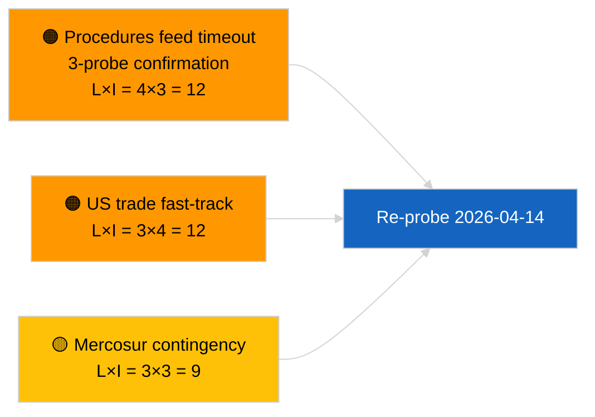

<!-- SPDX-FileCopyrightText: 2026 Hack23 AB -->
<!-- SPDX-License-Identifier: Apache-2.0 -->

# Executive Brief — Propositions | 2026-04-03

**Classification:** OSINT | Public Parliamentary Record
**Confidence:** 🟢 High (recess-period structural assessment, DEGRADED API state)
**Generated:** 2026-04-03T00:00:00Z (retrospective brief)
**Article Type:** Propositions
**Run ID:** `9be5bca6-de96-4303-80ff-33cb5f24b51b`
**Source:** European Parliament Open Data Portal

---

## 🎯 BLUF

**No new Commission propositions or EP own-initiative procedures opened on 2026-04-03.** Run `9be5bca6-de96-4303-80ff-33cb5f24b51b` returned **"Quantitative risk scoring across 0 identified political dimensions"** — zero classified actors, ROUTINE significance. `get_procedures_feed` is among the failed endpoints confirmed by sibling `breaking-2` (DEGRADED API state, 5/8 mandatory feeds failing). Substantive propositions inventory entering April is the inherited pipeline: anti-corruption directive transposition cycle (TA-10-2026-0094), HDV emissions framework (TA-10-2026-0084), ECB Vice-President procedure (TA-10-2026-0060), Better Law-Making baseline (TA-10-2026-0063), and the pending EU-Mercosur ECJ referral (TA-10-2026-0008). **🟢 HIGH confidence** empty state is calendar + DEGRADED feed driven.

---

## 🧭 3 Decisions This Brief Supports

| # | Decision | Who Decides | Deadline | Evidence |
|:-:|----------|-------------|:--------:|----------|
| 1 | **Editorial:** SKIP propositions daily | Editor | +24h | Empty run + DEGRADED feeds |
| 2 | **Monitoring:** include in 2026-04-14 post-recess restoration probe | Data pipeline | 2026-04-14 | First post-Easter weekday |
| 3 | **Forward-watch:** Commission Tuesday meeting 7 April 2026 — first post-Easter college tabling | Analysis lead | 2026-04-07 | Commission cadence |

---

## 📰 60-Second Read

- 🔴 **No new procedures** on 2026-04-03; `get_procedures_feed` timeout across 3 probes. (🟢 High)
- 🟠 **0 actors classified**; ROUTINE significance. (🟢 High)
- 🟢 **Pipeline carry-over** anchors watch list. (🟢 High)
- 🟡 **Risk dimensions all "none"** today. (🟢 High)
- 🔵 **Economic context:** anticipated Q2 propositions on AI Act implementing rules, Defence Industrial Strategy, MFF prep. (🟡 Medium)
- 🟣 **Cross-reference:** sibling `breaking-2` formalises DEGRADED API state. (🟢 High)
- 🩷 **Disruption vector:** US trade pressure may force a fast-track Commission proposition in April. (🟡 Medium)
- ⚪ **Carry-forward:** Mercosur ECJ opinion remains the highest-impact pending trigger.

---

## 🗂️ Top Documents / Procedures — Propositions Watch

| Rank | EP reference | Title (short) | Significance | Confidence | Status |
|:----:|--------------|---------------|:------------:|:----------:|--------|
| 1 | — | No new propositions on 2026-04-03 | 0.0 | 🟢 HIGH | DEGRADED feeds |
| 2 | TA-10-2026-0094 | Anti-corruption directive (transposition cycle) | 9.0 | 🟢 HIGH | Adopted 26 March |
| 3 | TA-10-2026-0008 | EU-Mercosur ECJ referral (pending) | 8.0 | 🟡 MEDIUM | Court opinion expected |

---

## ⚠️ Risk & Threat Snapshot

| Risk | L | I | Score | Trigger | Source | Admiralty |
|------|:-:|:-:|:-----:|---------|--------|:---------:|
| Procedures-feed timeout | 4 | 3 | 12 | Persistence past 14 April | Sibling `breaking-2` | A1 |
| US trade fast-track proposition | 3 | 4 | 12 | US action | TA-10-2026-0096 | A1 |
| Mercosur opinion contingency | 3 | 3 | 9 | Court releases | TA-10-2026-0008 | A2 |

---

## 🔮 Top Forward Trigger

**Commission Tuesday meeting 7 April 2026** — first post-Easter college tabling.

---

## 🛡️ Source Quality Assessment

- **Primary sources:** Run `9be5bca6-de96-4303-80ff-33cb5f24b51b`; sibling `breaking-2`.
- **Confidence:** 🟢 HIGH on driver classification.

---

## 📎 Links

| Link | Path |
|------|------|
| Article | `./article.md` |
| Sibling runs | All 2026-04-03 runs (see folder) |
| Manifest | `./manifest.json` |

---

**Document Control**
- **Template:** `/analysis/templates/executive-brief.md`
- **Artifact path:** `analysis/daily/2026-04-03/propositions/executive-brief.md`
- **Classification:** Public
- **Retrospective generation:** Back-fill session.
