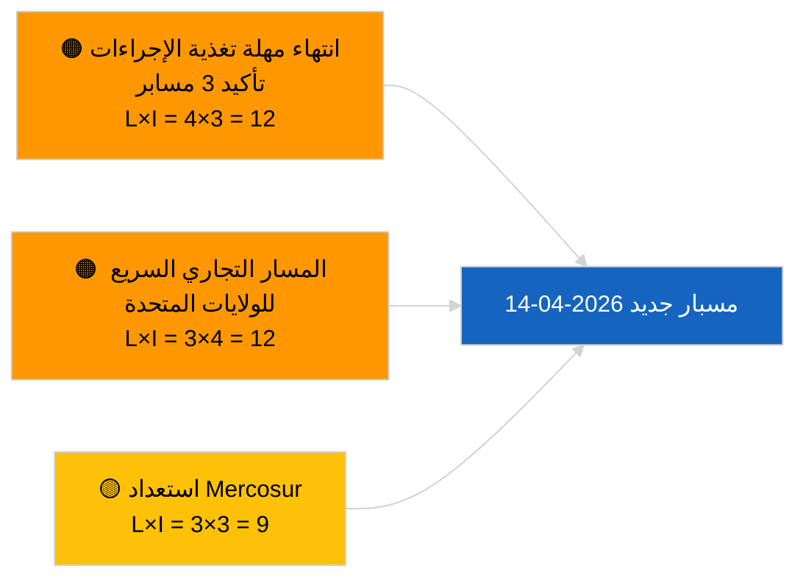

<!-- SPDX-FileCopyrightText: 2026 Hack23 AB -->
<!-- SPDX-License-Identifier: Apache-2.0 -->

# الملخص التنفيذي — المقترحات | 2026-04-03

**التصنيف:** OSINT | سجل برلماني عام
**الموثوقية:** 🟢 عالية (تقييم هيكلي خلال عطلة برلمانية، وضع API مُتدهور)
**التاريخ:** 2026-04-03T00:00:00Z (تقرير بأثر رجعي)
**نوع المقال:** مقترحات
**معرف التشغيل:** `9be5bca6-de96-4303-80ff-33cb5f24b51b`
**المصدر:** بوابة البيانات المفتوحة للبرلمان الأوروبي

---

## 🎯 BLUF

**لم تُفتتح أي مقترحات جديدة من المفوضية أو إجراءات مبادرة ذاتية للبرلمان الأوروبي في 2026-04-03.** أعادت عملية التشغيل `9be5bca6-de96-4303-80ff-33cb5f24b51b` **«تقييماً كمياً للمخاطر عبر 0 أبعاد سياسية محددة»** — صفر جهة فاعلة مُصنَّفة، أهمية روتينية. يُعدّ `get_procedures_feed` من نقاط النهاية الفاشلة التي أكدتها عملية التشغيل الشقيقة `breaking-2` (وضع API مُتدهور، 5/8 من التغذيات الإلزامية تفشل). محفظة المقترحات الجوهرية المُرحَّلة إلى أبريل هي خط الأنابيب الموروث: دورة نقل توجيه مكافحة الفساد (TA-10-2026-0094)، إطار انبعاثات المركبات الثقيلة (TA-10-2026-0084)، إجراء نائب رئيس البنك المركزي الأوروبي (TA-10-2026-0060)، خط الأساس لتحسين التشريعات (TA-10-2026-0063)، والإحالة المعلقة EU-Mercosur إلى محكمة العدل الأوروبية (TA-10-2026-0008). **🟢 ثقة عالية** في الحالة الفارغة مدفوعة بالتقويم والتغذيات المُتدهورة.

---

## 🧭 3 Decisions This Brief Supports

| # | القرار | من يقرر | الموعد النهائي | المبرر |
|:-:|--------|--------|:-------------:|--------|
| 1 | **تحريري:** تجاوز المقترحات يومياً | المحرر | +24 ساعة | تشغيل فارغ + تغذيات مُتدهورة |
| 2 | **المراقبة:** تضمينها في مسبار استعادة ما بعد الإجازة 2026-04-14 | خط بيانات | 2026-04-14 | أول يوم عمل بعد عيد الفصح |
| 3 | **المراقبة الاستشرافية:** اجتماع المفوضية يوم الثلاثاء 7 أبريل 2026 — أول تشكيل للهيئة بعد عيد الفصح | مسؤول التحليل | 2026-04-07 | إيقاع المفوضية |

---

## 📰 60-Second Read

- 🔴 **لا إجراءات جديدة** في 2026-04-03؛ `get_procedures_feed` انتهت مهلته بعد 3 محاولات تحقيق. (🟢 عالية)
- 🟠 **0 جهة فاعلة مُصنَّفة**؛ أهمية روتينية. (🟢 عالية)
- 🟢 **ترحيل خط الأنابيب** يُرسِّخ قائمة المراقبة. (🟢 عالية)
- 🟡 **أبعاد المخاطر جميعها «لا شيء»** اليوم. (🟢 عالية)
- 🔵 **السياق الاقتصادي:** مقترحات الربع الثاني المتوقعة بشأن قواعد تنفيذ قانون الذكاء الاصطناعي، الاستراتيجية الصناعية الدفاعية، إعداد الإطار المالي متعدد السنوات. (🟡 متوسط)
- 🟣 **مرجع متقاطع:** عملية التشغيل الشقيقة `breaking-2` تُرسِّم الوضع المُتدهور لواجهة برمجة التطبيقات. (🟢 عالية)
- 🩷 **ناقل الاضطراب:** الضغط التجاري الأمريكي قد يُرغم المفوضية على طرح مقترح في المسار السريع أبريل. (🟡 متوسط)
- ⚪ **الترحيل المستقبلي:** رأي محكمة العدل الأوروبية بشأن Mercosur لا يزال المُحفِّز ذا الأولوية الأعلى.

---

## 🗂️ Top Documents / Procedures — Propositions Watch

| الترتيب | مرجع البرلمان | العنوان (مختصر) | الوزن | الموثوقية | الحالة |
|:-------:|--------------|----------------|:-----:|:---------:|--------|
| 1 | — | لا مقترحات جديدة في 2026-04-03 | 0.0 | 🟢 عالية | تغذيات مُتدهورة |
| 2 | TA-10-2026-0094 | توجيه مكافحة الفساد (دورة النقل) | 9.0 | 🟢 عالية | مُعتمد 26 مارس |
| 3 | TA-10-2026-0008 | إحالة EU-Mercosur إلى محكمة العدل الأوروبية (معلقة) | 8.0 | 🟡 متوسطة | رأي المحكمة متوقع |

---

## ⚠️ Risk & Threat Snapshot

| المخاطر | L | I | الدرجة | المُحفِّز | المصدر | أدميرالية |
|---------|:-:|:-:|:------:|----------|--------|:---------:|
| انتهاء مهلة تغذية الإجراءات | 4 | 3 | 12 | يستمر بعد 14 أبريل | الشقيق `breaking-2` | A1 |
| المسار التجاري السريع للولايات المتحدة | 3 | 4 | 12 | إجراء أمريكي | TA-10-2026-0096 | A1 |
| استعداد لرأي Mercosur | 3 | 3 | 9 | نشر المحكمة | TA-10-2026-0008 | A2 |

---

## 🔮 Top Forward Trigger

**اجتماع المفوضية يوم الثلاثاء 7 أبريل 2026** — أول تشكيل للهيئة بعد عيد الفصح.

---

## 🛡️ Source Quality Assessment

- **المصادر الأولية:** عملية التشغيل `9be5bca6-de96-4303-80ff-33cb5f24b51b`؛ الشقيق `breaking-2`.
- **الموثوقية:** 🟢 عالية لتصنيف المحرك.

---

## 📎 Links

| الرابط | المسار |
|--------|--------|
| المقال | `./article.md` |
| عمليات التشغيل الشقيقة | جميع تشغيلات 2026-04-03 (انظر المجلد) |
| بيان المحتويات | `./manifest.json` |

---

**التحكم في الوثائق**
- **القالب:** `/analysis/templates/executive-brief.md`
- **مسار الأداة:** `analysis/daily/2026-04-03/propositions/executive-brief.md`
- **التصنيف:** عام
- **التوليد الرجعي:** جلسة التعبئة العكسية.
