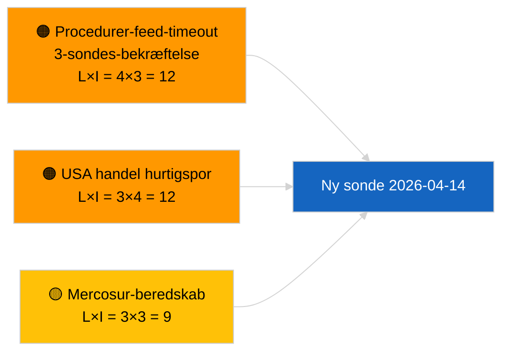

<!-- SPDX-FileCopyrightText: 2026 Hack23 AB -->
<!-- SPDX-License-Identifier: Apache-2.0 -->

# Ledelsesrapport — Propositioner | 2026-04-03

**Klassificering:** OSINT | Offentlig parlamentarisk rekord
**Tillid:** 🟢 Høj (strukturel vurdering i parlamentarisk ferie, DEGRADERET API-tilstand)
**Genereret:** 2026-04-03T00:00:00Z (retroaktiv rapport)
**Artikeltype:** Propositioner
**Kørsel-ID:** `9be5bca6-de96-4303-80ff-33cb5f24b51b`
**Kilde:** Europa-Parlamentets åbne dataportal

---

## 🎯 BLUF

**Ingen nye Kommissionspropositioner eller EP-eget-initiativprocedurer åbnede den 2026-04-03.** Kørsel `9be5bca6-de96-4303-80ff-33cb5f24b51b` returnerede **"Kvantitativ risikovurdering på tværs af 0 identificerede politiske dimensioner"** — nul klassificerede aktører, RUTINE-betydning. `get_procedures_feed` er blandt de mislykkede endepunkter bekræftet af søskendekørslen `breaking-2` (DEGRADERET API-tilstand, 5/8 obligatoriske feeds fejler). Den substantielle propositionsbeholdning der passerer ind i april er den nedarvede pipeline: antikorruptionsdirektivets transpositionscyklus (TA-10-2026-0094), HDV-emissionsrammen (TA-10-2026-0084), ECB's vicepræsidentprocedure (TA-10-2026-0060), Better Law-Making-basislinjen (TA-10-2026-0063), og den verserende EU-Mercosur ECJ-forelæggelse (TA-10-2026-0008). **🟢 HØJ tillid** til tomt tilstand er kalender + DEGRADERET feed drevet.

---

## 🧭 3 Decisions This Brief Supports

| # | Beslutning | Hvem beslutter | Frist | Dokumentation |
|:-:|-----------|---------------|:-----:|---------------|
| 1 | **Redaktionel:** SPRING OVER propositioner dagligt | Redaktør | +24h | Tom kørsel + DEGRADEREDE feeds |
| 2 | **Overvågning:** inkludér i 2026-04-14 gendannelsessonde efter ferie | Datapipeline | 2026-04-14 | Første post-påske hverdag |
| 3 | **Fremadrettet overvågning:** Kommissionens tirsdagsmøde 7. april 2026 — første post-påske kollegieopstilling | Analyseansvarlig | 2026-04-07 | Kommissionens kadence |

---

## 📰 60-Second Read

- 🔴 **Ingen nye procedurer** den 2026-04-03; `get_procedures_feed` timeout ved 3 sondeprøver. (🟢 Høj)
- 🟠 **0 aktører klassificeret**; RUTINE-betydning. (🟢 Høj)
- 🟢 **Pipeline-carry-over** forankrer bevakningslisten. (🟢 Høj)
- 🟡 **Risikodimensioner alle "ingen"** i dag. (🟢 Høj)
- 🔵 **Økonomisk kontekst:** forventede Q2-propositioner om AI-aktens gennemførelsesregler, Forsvarsindustriel strategi, MFF-forberedelse. (🟡 Middel)
- 🟣 **Krydsreference:** søskendekørslen `breaking-2` formaliserer DEGRADERET API-tilstand. (🟢 Høj)
- 🩷 **Forstyrelsesvektor:** USA's handelspres kan tvinge en hurtigspors-Kommissionsproposition i april. (🟡 Middel)
- ⚪ **Fremoverfører:** Mercosur ECJ-udtalelsen er stadig den højest prioriterede verserende udløser.

---

## 🗂️ Top Documents / Procedures — Propositions Watch

| Rang | EP-reference | Titel (kort) | Vigt | Tillid | Status |
|:----:|--------------|-------------|:----:|:------:|--------|
| 1 | — | Ingen nye propositioner den 2026-04-03 | 0.0 | 🟢 HØJ | DEGRADEREDE feeds |
| 2 | TA-10-2026-0094 | Antikorruptionsdirektiv (transpositionscyklus) | 9.0 | 🟢 HØJ | Vedtaget 26. marts |
| 3 | TA-10-2026-0008 | EU-Mercosur ECJ-forelæggelse (verserende) | 8.0 | 🟡 MIDDEL | Domstolsudtalelse forventet |

---

## ⚠️ Risk & Threat Snapshot

| Risiko | L | I | Score | Udløser | Kilde | Admiralitet |
|--------|:-:|:-:|:-----:|---------|-------|:-----------:|
| Procedurer-feed-timeout | 4 | 3 | 12 | Vedvarer efter 14. april | Søskende `breaking-2` | A1 |
| USA handel hurtigspor | 3 | 4 | 12 | USA-handling | TA-10-2026-0096 | A1 |
| Mercosur-udtalelse beredskab | 3 | 3 | 9 | Domstolen frigiver | TA-10-2026-0008 | A2 |

---

## 🔮 Top Forward Trigger

**Kommissionens tirsdagsmøde 7. april 2026** — første post-påske kollegieopstilling.

---

## 🛡️ Source Quality Assessment

- **Primære kilder:** Kørsel `9be5bca6-de96-4303-80ff-33cb5f24b51b`; søskende `breaking-2`.
- **Tillid:** 🟢 HØJ på drivklassificering.

---

## 📎 Links

| Link | Sti |
|------|-----|
| Artikel | `./article.md` |
| Søskendekørsler | Alle 2026-04-03-kørsler (se mappe) |
| Manifest | `./manifest.json` |

---

**Dokumentkontrol**
- **Skabelon:** `/analysis/templates/executive-brief.md`
- **Artefaktsti:** `analysis/daily/2026-04-03/propositions/executive-brief.md`
- **Klassificering:** Offentlig
- **Retroaktiv generering:** Back-fill session.
