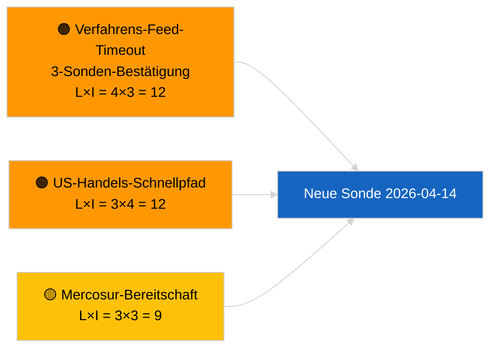

<!-- SPDX-FileCopyrightText: 2026 Hack23 AB -->
<!-- SPDX-License-Identifier: Apache-2.0 -->

# Führungsbericht — Vorschläge | 2026-04-03

**Einstufung:** OSINT | Öffentlicher parlamentarischer Nachweis
**Vertrauen:** 🟢 Hoch (strukturelle Beurteilung in parlamentarischer Pause, DEGRADIERTER API-Modus)
**Erstellt:** 2026-04-03T00:00:00Z (rückwirkender Bericht)
**Artikeltyp:** Vorschläge
**Ausführungs-ID:** `9be5bca6-de96-4303-80ff-33cb5f24b51b`
**Quelle:** Offenes Datenportal des Europäischen Parlaments

---

## 🎯 BLUF

**Am 2026-04-03 wurden keine neuen Kommissionsvorschläge oder EP-Eigeninitiativ-Verfahren eröffnet.** Lauf `9be5bca6-de96-4303-80ff-33cb5f24b51b` lieferte **„Quantitative Risikobewertung über 0 identifizierte politische Dimensionen"** — null klassifizierte Akteure, ROUTINE-Bedeutung. `get_procedures_feed` gehört zu den gescheiterten Endpunkten, die durch den Geschwisterlauf `breaking-2` bestätigt wurden (DEGRADIERTER API-Modus, 5/8 der obligatorischen Feeds schlagen fehl). Das erhebliche Vorschlagsportfolio, das in den April übertragen wird, ist die geerbte Pipeline: Transpositionszyklus der Antikorruptionsrichtlinie (TA-10-2026-0094), HDV-Emissionsrahmen (TA-10-2026-0084), EZB-Vizepräsidentenverfahren (TA-10-2026-0060), Better-Law-Making-Basislinie (TA-10-2026-0063) und die anhängige EU-Mercosur-EuGH-Vorlage (TA-10-2026-0008). **🟢 HOHES Vertrauen** in den Leerstand wird durch Kalender + DEGRADIERTE Feeds angetrieben.

---

## 🧭 3 Decisions This Brief Supports

| # | Entscheidung | Wer entscheidet | Frist | Nachweis |
|:-:|-------------|----------------|:-----:|---------|
| 1 | **Redaktionell:** Vorschläge täglich ÜBERSPRINGEN | Redakteur | +24h | Leerer Lauf + DEGRADIERTE Feeds |
| 2 | **Überwachung:** In 2026-04-14 Post-Urlaub-Wiederherstellungssonde einbeziehen | Datenpipeline | 2026-04-14 | Erster Post-Ostern-Werktag |
| 3 | **Vorausüberwachung:** Kommissions-Dienstagssitzung 7. April 2026 — erste Post-Ostern-Kollegiumsaufstellung | Analysebeauftragter | 2026-04-07 | Kommissionskadenz |

---

## 📰 60-Second Read

- 🔴 **Keine neuen Verfahren** am 2026-04-03; `get_procedures_feed` Timeout bei 3 Sondierungsversuchen. (🟢 Hoch)
- 🟠 **0 Akteure klassifiziert**; ROUTINE-Bedeutung. (🟢 Hoch)
- 🟢 **Pipeline-Carryover** verankert die Überwachungsliste. (🟢 Hoch)
- 🟡 **Risikodimensionen alle „keine"** heute. (🟢 Hoch)
- 🔵 **Wirtschaftlicher Kontext:** Erwartete Q2-Vorschläge zu KI-Gesetz-Durchführungsregeln, Verteidigungsindus­trielle Strategie, MFR-Vorbereitung. (🟡 Mittel)
- 🟣 **Querverweis:** Geschwisterlauf `breaking-2` formalisiert DEGRADIERTEN API-Modus. (🟢 Hoch)
- 🩷 **Störungsvektor:** US-Handelsdruck könnte einen Eilverfahrens-Kommissionsvorschlag im April erzwingen. (🟡 Mittel)
- ⚪ **Weiterführend:** EuGH-Stellungnahme zum Mercosur-Abkommen bleibt der priorisierte ausstehende Auslöser.

---

## 🗂️ Top Documents / Procedures — Propositions Watch

| Rang | EP-Referenz | Titel (kurz) | Gewicht | Vertrauen | Status |
|:----:|-------------|-------------|:-------:|:---------:|--------|
| 1 | — | Keine neuen Vorschläge am 2026-04-03 | 0.0 | 🟢 HOCH | DEGRADIERTE Feeds |
| 2 | TA-10-2026-0094 | Antikorruptionsrichtlinie (Transpositionszyklus) | 9.0 | 🟢 HOCH | Angenommen 26. März |
| 3 | TA-10-2026-0008 | EU-Mercosur EuGH-Vorlage (anhängig) | 8.0 | 🟡 MITTEL | EuGH-Stellungnahme erwartet |

---

## ⚠️ Risk & Threat Snapshot

| Risiko | L | I | Score | Auslöser | Quelle | Admiralität |
|--------|:-:|:-:|:-----:|----------|--------|:-----------:|
| Verfahrens-Feed-Timeout | 4 | 3 | 12 | Besteht nach 14. April | Geschwister `breaking-2` | A1 |
| US-Handels-Schnellpfad | 3 | 4 | 12 | US-Handeln | TA-10-2026-0096 | A1 |
| Mercosur-Stellungnahme-Bereitschaft | 3 | 3 | 9 | EuGH veröffentlicht | TA-10-2026-0008 | A2 |

---

## 🔮 Top Forward Trigger

**Kommissions-Dienstagssitzung 7. April 2026** — erste Post-Ostern-Kollegiumsaufstellung.

---

## 🛡️ Source Quality Assessment

- **Primärquellen:** Lauf `9be5bca6-de96-4303-80ff-33cb5f24b51b`; Geschwister `breaking-2`.
- **Vertrauen:** 🟢 HOCH bei Treiberklassifizierung.

---

## 📎 Links

| Link | Pfad |
|------|------|
| Artikel | `./article.md` |
| Geschwisterläufe | Alle 2026-04-03-Läufe (Ordner) |
| Manifest | `./manifest.json` |

---

**Dokumentkontrolle**
- **Vorlage:** `/analysis/templates/executive-brief.md`
- **Artefaktpfad:** `analysis/daily/2026-04-03/propositions/executive-brief.md`
- **Einstufung:** Öffentlich
- **Rückwirkende Erstellung:** Back-fill-Sitzung.
