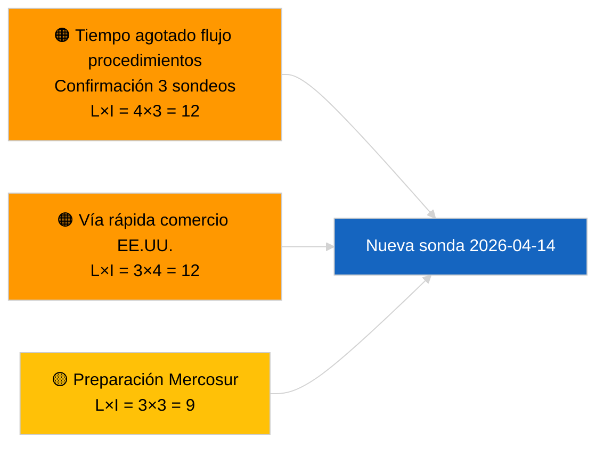

<!-- SPDX-FileCopyrightText: 2026 Hack23 AB -->
<!-- SPDX-License-Identifier: Apache-2.0 -->

# Nota Ejecutiva — Proposiciones | 2026-04-03

**Clasificación:** OSINT | Registro parlamentario público
**Confianza:** 🟢 Alta (evaluación estructural en receso parlamentario, MODO API DEGRADADO)
**Generada:** 2026-04-03T00:00:00Z (informe retroactivo)
**Tipo de artículo:** Proposiciones
**ID de ejecución:** `9be5bca6-de96-4303-80ff-33cb5f24b51b`
**Fuente:** Portal de datos abiertos del Parlamento Europeo

---

## 🎯 BLUF

**No se abrieron nuevas propuestas de la Comisión ni procedimientos de iniciativa propia del PE el 2026-04-03.** La ejecución `9be5bca6-de96-4303-80ff-33cb5f24b51b` devolvió **«Evaluación cuantitativa de riesgos sobre 0 dimensiones políticas identificadas»** — cero actores clasificados, importancia RUTINARIA. `get_procedures_feed` forma parte de los puntos de acceso fallidos confirmados por la ejecución hermana `breaking-2` (MODO API DEGRADADO, 5/8 de los flujos obligatorios fallan). La cartera sustancial de proposiciones que se traslada a abril es la canalización heredada: ciclo de transposición de la directiva anticorrupción (TA-10-2026-0094), marco de emisiones de vehículos pesados (TA-10-2026-0084), procedimiento de vicepresidencia del BCE (TA-10-2026-0060), línea base de Mejor Regulación (TA-10-2026-0063) y el reenvío pendiente EU-Mercosur al TJUE (TA-10-2026-0008). **🟢 ALTA confianza** en el estado vacío se debe al calendario + flujos DEGRADADOS.

---

## 🧭 3 Decisions This Brief Supports

| # | Decisión | Quién decide | Plazo | Justificación |
|:-:|---------|-------------|:-----:|--------------|
| 1 | **Editorial:** OMITIR proposiciones diariamente | Redactor | +24h | Ejecución vacía + flujos DEGRADADOS |
| 2 | **Supervisión:** incluir en la sonda de recuperación del 2026-04-14 tras el período vacacional | Canal de datos | 2026-04-14 | Primer día laborable post-Pascua |
| 3 | **Vigilancia prospectiva:** Reunión del martes de la Comisión 7 de abril de 2026 — primera reunión del colegio post-Pascua | Responsable de análisis | 2026-04-07 | Cadencia de la Comisión |

---

## 📰 60-Second Read

- 🔴 **Sin nuevos procedimientos** el 2026-04-03; `get_procedures_feed` se agotó tras 3 intentos de sondeo. (🟢 Alta)
- 🟠 **0 actores clasificados**; importancia RUTINARIA. (🟢 Alta)
- 🟢 **Arrastre de canalización** ancla la lista de vigilancia. (🟢 Alta)
- 🟡 **Dimensiones de riesgo todas «ninguna»** hoy. (🟢 Alta)
- 🔵 **Contexto económico:** proposiciones del T2 esperadas sobre reglas de ejecución del Reglamento de IA, Estrategia Industrial de Defensa, preparación del MFP. (🟡 Medio)
- 🟣 **Referencia cruzada:** la ejecución hermana `breaking-2` formaliza el MODO API DEGRADADO. (🟢 Alta)
- 🩷 **Vector de perturbación:** la presión comercial de EE. UU. podría forzar una propuesta de la Comisión por vía rápida en abril. (🟡 Medio)
- ⚪ **Traslado prospectivo:** el dictamen del TJUE sobre Mercosur sigue siendo el desencadenante pendiente de mayor prioridad.

---

## 🗂️ Top Documents / Procedures — Propositions Watch

| Rango | Referencia PE | Título (abreviado) | Peso | Confianza | Estado |
|:-----:|---------------|-------------------|:----:|:---------:|--------|
| 1 | — | Sin nuevas proposiciones el 2026-04-03 | 0,0 | 🟢 ALTA | Flujos DEGRADADOS |
| 2 | TA-10-2026-0094 | Directiva anticorrupción (ciclo de transposición) | 9,0 | 🟢 ALTA | Aprobada el 26 de marzo |
| 3 | TA-10-2026-0008 | Reenvío EU-Mercosur TJUE (pendiente) | 8,0 | 🟡 MEDIO | Dictamen del TJUE esperado |

---

## ⚠️ Risk & Threat Snapshot

| Riesgo | L | I | Puntuación | Desencadenante | Fuente | Admiraltazgo |
|--------|:-:|:-:|:----------:|---------------|--------|:------------:|
| Tiempo agotado flujo procedimientos | 4 | 3 | 12 | Persiste tras el 14 de abril | Hermana `breaking-2` | A1 |
| Vía rápida comercio EE. UU. | 3 | 4 | 12 | Acción de EE. UU. | TA-10-2026-0096 | A1 |
| Preparación dictamen Mercosur | 3 | 3 | 9 | Tribunal publica | TA-10-2026-0008 | A2 |

---

## 🔮 Top Forward Trigger

**Reunión del martes de la Comisión 7 de abril de 2026** — primera reunión del colegio post-Pascua.

---

## 🛡️ Source Quality Assessment

- **Fuentes primarias:** Ejecución `9be5bca6-de96-4303-80ff-33cb5f24b51b`; hermana `breaking-2`.
- **Confianza:** 🟢 ALTA en la clasificación impulsora.

---

## 📎 Links

| Enlace | Ruta |
|--------|------|
| Artículo | `./article.md` |
| Ejecuciones hermanas | Todas las ejecuciones del 2026-04-03 (ver carpeta) |
| Manifiesto | `./manifest.json` |

---

**Control documental**
- **Plantilla:** `/analysis/templates/executive-brief.md`
- **Ruta del artefacto:** `analysis/daily/2026-04-03/propositions/executive-brief.md`
- **Clasificación:** Público
- **Generación retroactiva:** Sesión de relleno histórico.
