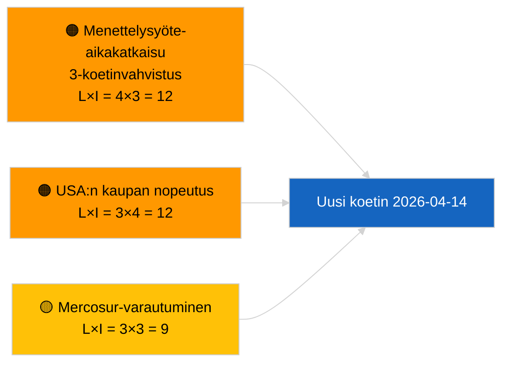

<!-- SPDX-FileCopyrightText: 2026 Hack23 AB -->
<!-- SPDX-License-Identifier: Apache-2.0 -->

# Johtoraportti — Esitykset | 2026-04-03

**Luokittelu:** OSINT | Julkinen parlamentaarinen asiakirja
**Luottamus:** 🟢 Korkea (rakenteellinen arviointi parlamentin loma-aikana, HEIKENTYNYT API-tila)
**Luotu:** 2026-04-03T00:00:00Z (takautuva raportti)
**Artikkelityyppi:** Esitykset
**Ajo-ID:** `9be5bca6-de96-4303-80ff-33cb5f24b51b`
**Lähde:** Euroopan parlamentin avoin dataportti

---

## 🎯 BLUF

**Uusia komission esityksiä tai EP:n omia aloitemenettelyjä ei avattu 2026-04-03.** Ajo `9be5bca6-de96-4303-80ff-33cb5f24b51b` palautti **"Kvantitatiivinen riskiluokittelu 0 tunnistetun poliittisen ulottuvuuden yli"** — nolla luokiteltua toimijaa, RUTIINI-merkitys. `get_procedures_feed` kuuluu epäonnistuneisiin päätepisteisiin, jotka on vahvistettu rinnakkaisajolla `breaking-2` (HEIKENTYNYT API-tila, 5/8 pakollisesta syötteestä epäonnistuu). Huhtikuuhun siirtyvä merkittävä esitysportfolio on peritty putkilinja: korruptionvastaisen direktiivin täytäntöönpanosykli (TA-10-2026-0094), HDV-päästökehys (TA-10-2026-0084), EKP:n varapuheenjohtajamenettely (TA-10-2026-0060), Parempi lainsäädäntö -peruslinja (TA-10-2026-0063) ja vireillä oleva EU-Mercosur ECJ-ennakkoratkaisu (TA-10-2026-0008). **🟢 KORKEA luottamus** tyhjään tilaan johtuu kalenterista + HEIKENTYNEISTÄ syötteistä.

---

## 🧭 3 Decisions This Brief Supports

| # | Päätös | Kuka päättää | Määräaika | Näyttö |
|:-:|--------|-------------|:--------:|--------|
| 1 | **Toimituksellinen:** OHITA esitykset päivittäin | Toimittaja | +24t | Tyhjä ajo + HEIKENTYNEET syötteet |
| 2 | **Seuranta:** sisällytä 2026-04-14 palautuskoettimeen loman jälkeen | Dataputki | 2026-04-14 | Ensimmäinen pääsiäisen jälkeinen arkipäivä |
| 3 | **Eteenpäinkatsova:** Komission tiistaikokous 7. huhtikuuta 2026 — ensimmäinen pääsiäisen jälkeinen kollegion käsittely | Analyysivastaava | 2026-04-07 | Komission rytmi |

---

## 📰 60-Second Read

- 🔴 **Ei uusia menettelyjä** 2026-04-03; `get_procedures_feed` aikakatkaisu 3 koettimessa. (🟢 Korkea)
- 🟠 **0 toimijaa luokiteltu**; RUTIINI-merkitys. (🟢 Korkea)
- 🟢 **Putkilinja-siirto** ankkuroi seurantalistan. (🟢 Korkea)
- 🟡 **Riskin ulottuvuudet kaikki "ei mitään"** tänään. (🟢 Korkea)
- 🔵 **Taloudellinen asiayhteys:** odotetut Q2-esitykset tekoälylain täytäntöönpanosäännöistä, Puolustuksen teollisesta strategiasta, MFF-valmistelusta. (🟡 Keski)
- 🟣 **Ristiviite:** rinnakkaisajo `breaking-2` vahvistaa HEIKENTYNEEN API-tilan. (🟢 Korkea)
- 🩷 **Häiriövektori:** Yhdysvaltojen kauppapaine voi pakottaa nopeutetun komission esityksen huhtikuussa. (🟡 Keski)
- ⚪ **Siirto eteenpäin:** Mercosur ECJ -lausunto on edelleen korkeimman prioriteetin odottava laukaisin.

---

## 🗂️ Top Documents / Procedures — Propositions Watch

| Sija | EP-viite | Otsikko (lyhyt) | Merkittävyys | Luottamus | Tila |
|:----:|----------|----------------|:------------:|:---------:|------|
| 1 | — | Ei uusia esityksiä 2026-04-03 | 0.0 | 🟢 KORKEA | HEIKENTYNEET syötteet |
| 2 | TA-10-2026-0094 | Korruptionvastainen direktiivi (täytäntöönpanosykli) | 9.0 | 🟢 KORKEA | Hyväksytty 26. maaliskuuta |
| 3 | TA-10-2026-0008 | EU-Mercosur ECJ-ennakkoratkaisu (vireillä) | 8.0 | 🟡 KESKI | Tuomioistuimen lausunto odotetaan |

---

## ⚠️ Risk & Threat Snapshot

| Riski | L | I | Pisteet | Laukaisin | Lähde | Admiraliteetti |
|-------|:-:|:-:|:-------:|-----------|-------|:--------------:|
| Menettelysyöte-aikakatkaisu | 4 | 3 | 12 | Jatkuu 14. huhtikuun jälkeen | Rinnakkaisajo `breaking-2` | A1 |
| USA:n kaupan nopeutettu esitys | 3 | 4 | 12 | USA:n toiminta | TA-10-2026-0096 | A1 |
| Mercosur-lausuntovalmius | 3 | 3 | 9 | Tuomioistuin julkaisee | TA-10-2026-0008 | A2 |

---

## 🔮 Top Forward Trigger

**Komission tiistaikokous 7. huhtikuuta 2026** — ensimmäinen pääsiäisen jälkeinen kollegion käsittely.

---

## 🛡️ Source Quality Assessment

- **Ensisijaiset lähteet:** Ajo `9be5bca6-de96-4303-80ff-33cb5f24b51b`; rinnakkaisajo `breaking-2`.
- **Luottamus:** 🟢 KORKEA ajuriluokittelussa.

---

## 📎 Links

| Linkki | Polku |
|--------|-------|
| Artikkeli | `./article.md` |
| Rinnakkaisajot | Kaikki 2026-04-03-ajot (katso kansio) |
| Manifest | `./manifest.json` |

---

**Asiakirjavalvonta**
- **Malli:** `/analysis/templates/executive-brief.md`
- **Artefaktipolku:** `analysis/daily/2026-04-03/propositions/executive-brief.md`
- **Luokittelu:** Julkinen
- **Takautuva luonti:** Täydennysistunto.
