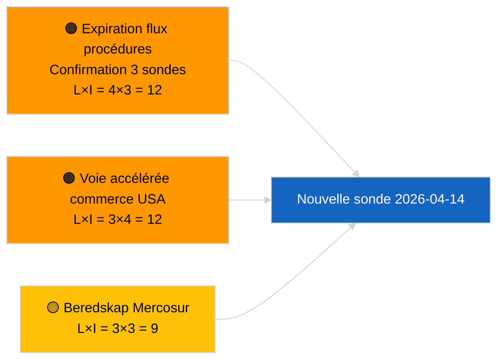

<!-- SPDX-FileCopyrightText: 2026 Hack23 AB -->
<!-- SPDX-License-Identifier: Apache-2.0 -->

# Note exécutive — Propositions | 2026-04-03

**Classification :** OSINT | Enregistrement parlementaire public
**Fiabilité :** 🟢 Haute (évaluation structurelle en période de vacances parlementaires, MODE API DÉGRADÉ)
**Générée :** 2026-04-03T00:00:00Z (rapport rétroactif)
**Type d'article :** Propositions
**ID d'exécution :** `9be5bca6-de96-4303-80ff-33cb5f24b51b`
**Source :** Portail de données ouvertes du Parlement européen

---

## 🎯 BLUF

**Aucune nouvelle proposition de la Commission ni procédure d'initiative propre du PE n'a été ouverte le 2026-04-03.** L'exécution `9be5bca6-de96-4303-80ff-33cb5f24b51b` a retourné **« Évaluation quantitative des risques sur 0 dimensions politiques identifiées »** — zéro acteur classifié, importance ROUTINIÈRE. `get_procedures_feed` fait partie des points de terminaison défaillants confirmés par l'exécution sœur `breaking-2` (MODE API DÉGRADÉ, 5/8 des flux obligatoires en échec). Le portefeuille substantiel de propositions reporté en avril est la chaîne héritée : cycle de transposition de la directive anticorruption (TA-10-2026-0094), cadre d'émissions des poids lourds (TA-10-2026-0084), procédure de vice-présidence de la BCE (TA-10-2026-0060), base de référence du programme « Mieux légiférer » (TA-10-2026-0063) et le renvoi en cours EU-Mercosur devant la CJUE (TA-10-2026-0008). **🟢 HAUTE fiabilité** de l'état vide est motivée par le calendrier + flux DÉGRADÉS.

---

## 🧭 3 Decisions This Brief Supports

| # | Décision | Qui décide | Échéance | Justification |
|:-:|---------|-----------|:--------:|--------------|
| 1 | **Éditorial :** IGNORER les propositions quotidiennement | Rédacteur | +24h | Exécution vide + flux DÉGRADÉS |
| 2 | **Surveillance :** inclure dans la sonde de rétablissement du 2026-04-14 après congé | Pipeline de données | 2026-04-14 | Premier jour ouvrable post-Pâques |
| 3 | **Veille prospective :** Réunion du mardi de la Commission 7 avril 2026 — première assemblée de collège post-Pâques | Responsable de l'analyse | 2026-04-07 | Rythme de la Commission |

---

## 📰 60-Second Read

- 🔴 **Aucune nouvelle procédure** le 2026-04-03 ; `get_procedures_feed` expiration au bout de 3 tentatives de sondage. (🟢 Haute)
- 🟠 **0 acteur classifié** ; importance ROUTINIÈRE. (🟢 Haute)
- 🟢 **Report de pipeline** ancre la liste de surveillance. (🟢 Haute)
- 🟡 **Dimensions de risque toutes « aucune »** aujourd'hui. (🟢 Haute)
- 🔵 **Contexte économique :** propositions Q2 attendues sur les règles d'exécution de la loi IA, stratégie industrielle de défense, préparation du CFP. (🟡 Moyen)
- 🟣 **Renvoi croisé :** l'exécution sœur `breaking-2` formalise le MODE API DÉGRADÉ. (🟢 Haute)
- 🩷 **Vecteur de perturbation :** la pression commerciale américaine pourrait forcer une proposition de la Commission en voie accélérée en avril. (🟡 Moyen)
- ⚪ **Report prospectif :** l'avis CJUE Mercosur reste le déclencheur en attente de plus haute priorité.

---

## 🗂️ Top Documents / Procedures — Propositions Watch

| Rang | Référence PE | Titre (abrégé) | Poids | Fiabilité | Statut |
|:----:|--------------|----------------|:-----:|:---------:|--------|
| 1 | — | Aucune nouvelle proposition le 2026-04-03 | 0,0 | 🟢 HAUTE | Flux DÉGRADÉS |
| 2 | TA-10-2026-0094 | Directive anticorruption (cycle de transposition) | 9,0 | 🟢 HAUTE | Adoptée le 26 mars |
| 3 | TA-10-2026-0008 | Renvoi EU-Mercosur CJUE (en cours) | 8,0 | 🟡 MOYEN | Avis CJUE attendu |

---

## ⚠️ Risk & Threat Snapshot

| Risque | L | I | Score | Déclencheur | Source | Amirauté |
|--------|:-:|:-:|:-----:|------------|--------|:--------:|
| Expiration flux procédures | 4 | 3 | 12 | Persiste après le 14 avril | Sœur `breaking-2` | A1 |
| Voie accélérée commerce USA | 3 | 4 | 12 | Action américaine | TA-10-2026-0096 | A1 |
| Préparation avis Mercosur | 3 | 3 | 9 | Cour publie | TA-10-2026-0008 | A2 |

---

## 🔮 Top Forward Trigger

**Réunion du mardi de la Commission 7 avril 2026** — première assemblée de collège post-Pâques.

---

## 🛡️ Source Quality Assessment

- **Sources primaires :** Exécution `9be5bca6-de96-4303-80ff-33cb5f24b51b` ; sœur `breaking-2`.
- **Fiabilité :** 🟢 HAUTE sur la classification des facteurs.

---

## 📎 Links

| Lien | Chemin |
|------|--------|
| Article | `./article.md` |
| Exécutions sœurs | Toutes les exécutions du 2026-04-03 (voir dossier) |
| Manifeste | `./manifest.json` |

---

**Contrôle documentaire**
- **Modèle :** `/analysis/templates/executive-brief.md`
- **Chemin de l'artefact :** `analysis/daily/2026-04-03/propositions/executive-brief.md`
- **Classification :** Public
- **Génération rétroactive :** Session de remplissage rétrospectif.
