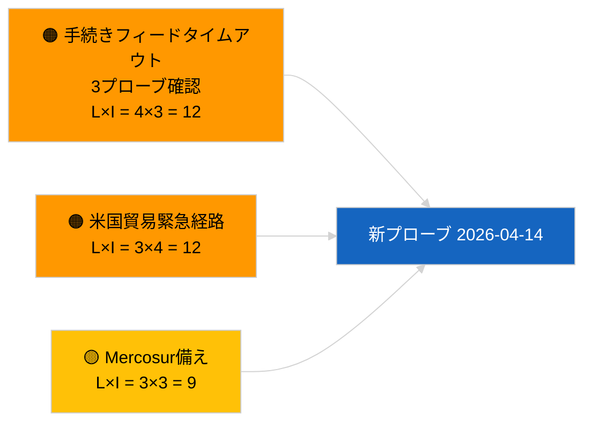

<!-- SPDX-FileCopyrightText: 2026 Hack23 AB -->
<!-- SPDX-License-Identifier: Apache-2.0 -->

# エグゼクティブ・ブリーフ — 提案 | 2026-04-03

**分類:** OSINT | 公開議会記録
**信頼度:** 🟢 高（議会休暇中の構造評価、API機能低下モード）
**作成日:** 2026-04-03T00:00:00Z（遡及的レポート）
**記事種別:** 提案
**実行ID:** `9be5bca6-de96-4303-80ff-33cb5f24b51b`
**情報源:** 欧州議会オープンデータポータル

---

## 🎯 BLUF

**2026-04-03には欧州委員会の新たな提案もEP独自の提案手続きも開始されなかった。** 実行`9be5bca6-de96-4303-80ff-33cb5f24b51b`は **「0件の特定政策次元にわたる定量的リスク評価」** を返した — 分類された主体ゼロ、定例的な重要度。`get_procedures_feed`は、姉妹実行`breaking-2`により確認された障害エンドポイントの一つである（API機能低下モード、8件中5件の必須フィードが失敗）。4月に持ち越される実質的な提案ポートフォリオは継承されたパイプラインである：汚職防止指令の移行サイクル（TA-10-2026-0094）、重量車両排出規制枠組み（TA-10-2026-0084）、ECB副総裁手続き（TA-10-2026-0060）、規制改善ベースライン（TA-10-2026-0063）、EU-Mercosur欧州司法裁判所付託（TA-10-2026-0008）。空の状態への**🟢 高信頼度**はカレンダーおよび機能低下フィードにより支持されている。

---

## 🧭 3 Decisions This Brief Supports

| # | 決定事項 | 決定者 | 期限 | 根拠 |
|:-:|--------|--------|:----:|-----|
| 1 | **編集:** 提案を毎日スキップ | 編集長 | +24時間 | 空の実行 + 機能低下フィード |
| 2 | **監視:** 休暇後2026-04-14の復旧プローブに含める | データパイプライン | 2026-04-14 | 復活祭後初営業日 |
| 3 | **先行監視:** 欧州委員会火曜会議2026年4月7日 — 復活祭後初のコレジウム審議 | 分析責任者 | 2026-04-07 | 欧州委員会のリズム |

---

## 📰 60-Second Read

- 🔴 **2026-04-03に新手続きなし**；`get_procedures_feed`が3回のプローブ試行でタイムアウト。（🟢 高）
- 🟠 **分類された主体0件**；定例的な重要度。（🟢 高）
- 🟢 **パイプライン繰越**が監視リストを固定。（🟢 高）
- 🟡 **リスク次元すべて「なし」**（本日）。（🟢 高）
- 🔵 **経済的文脈:** AI法施行規則、防衛産業戦略、MFF準備に関するQ2提案が予想される。（🟡 中）
- 🟣 **相互参照:** 姉妹実行`breaking-2`がAPI機能低下モードを正式化。（🟢 高）
- 🩷 **混乱ベクター:** 米国の貿易圧力が4月に欧州委員会の緊急提案を強いる可能性。（🟡 中）
- ⚪ **先行繰越:** Mercosur欧州司法裁判所意見書が依然として最優先の未解決トリガー。

---

## 🗂️ Top Documents / Procedures — Propositions Watch

| 順位 | EP参照 | タイトル（略） | 重み | 信頼度 | ステータス |
|:----:|--------|------------|:----:|:------:|-----------|
| 1 | — | 2026-04-03に新提案なし | 0.0 | 🟢 高 | 機能低下フィード |
| 2 | TA-10-2026-0094 | 汚職防止指令（移行サイクル） | 9.0 | 🟢 高 | 3月26日採択 |
| 3 | TA-10-2026-0008 | EU-Mercosur欧州司法裁判所付託（係属中） | 8.0 | 🟡 中 | 裁判所意見書待ち |

---

## ⚠️ Risk & Threat Snapshot

| リスク | L | I | スコア | トリガー | 情報源 | 海軍省評価 |
|--------|:-:|:-:|:-----:|---------|--------|:---------:|
| 手続きフィードタイムアウト | 4 | 3 | 12 | 4月14日以降も継続 | 姉妹`breaking-2` | A1 |
| 米国貿易緊急経路 | 3 | 4 | 12 | 米国の行動 | TA-10-2026-0096 | A1 |
| Mercosur意見書備え | 3 | 3 | 9 | 裁判所公表 | TA-10-2026-0008 | A2 |

---

## 🔮 Top Forward Trigger

**欧州委員会火曜会議2026年4月7日** — 復活祭後初のコレジウム審議。

---

## 🛡️ Source Quality Assessment

- **主要情報源:** 実行`9be5bca6-de96-4303-80ff-33cb5f24b51b`；姉妹`breaking-2`。
- **信頼度:** 🟢 ドライバー分類において高。

---

## 📎 Links

| リンク | パス |
|--------|------|
| 記事 | `./article.md` |
| 姉妹実行 | 2026-04-03全実行（フォルダ参照） |
| マニフェスト | `./manifest.json` |

---

**文書管理**
- **テンプレート:** `/analysis/templates/executive-brief.md`
- **成果物パス:** `analysis/daily/2026-04-03/propositions/executive-brief.md`
- **分類:** 公開
- **遡及的生成:** バックフィルセッション。
