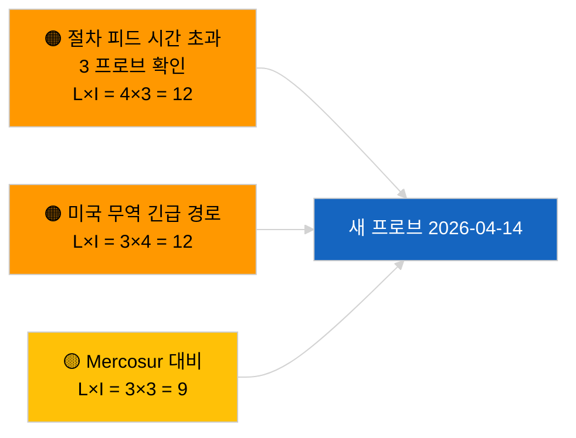

<!-- SPDX-FileCopyrightText: 2026 Hack23 AB -->
<!-- SPDX-License-Identifier: Apache-2.0 -->

# 경영진 브리핑 — 제안 | 2026-04-03

**분류:** OSINT | 공개 의회 기록
**신뢰도:** 🟢 높음 (의회 휴회 중 구조적 평가, API 기능 저하 모드)
**생성일:** 2026-04-03T00:00:00Z (소급 보고서)
**기사 유형:** 제안
**실행 ID:** `9be5bca6-de96-4303-80ff-33cb5f24b51b`
**출처:** 유럽의회 공개 데이터 포털

---

## 🎯 BLUF

**2026-04-03에는 새로운 집행위원회 제안이나 EP 자체 제안 절차가 개시되지 않았다.** 실행 `9be5bca6-de96-4303-80ff-33cb5f24b51b`은 **«0개의 식별된 정책 차원에 걸친 정량적 위험 평가»** 를 반환했다 — 분류된 행위자 없음, 일상적 중요도. `get_procedures_feed`는 자매 실행 `breaking-2`에 의해 확인된 실패 엔드포인트 중 하나다 (API 기능 저하 모드, 8개 필수 피드 중 5개 실패). 4월로 이월되는 실질적 제안 포트폴리오는 계승된 파이프라인이다: 부패방지 지침 이행 사이클 (TA-10-2026-0094), 중량 차량 배출 규제 프레임워크 (TA-10-2026-0084), ECB 부총재 절차 (TA-10-2026-0060), 더 나은 규제 기준선 (TA-10-2026-0063), 진행 중인 EU-Mercosur ECJ 회부 (TA-10-2026-0008). 빈 상태에 대한 **🟢 높은 신뢰도**는 일정 + 기능 저하 피드에 의해 뒷받침된다.

---

## 🧭 3 Decisions This Brief Supports

| # | 결정 사항 | 결정자 | 기한 | 근거 |
|:-:|---------|--------|:----:|-----|
| 1 | **편집:** 제안을 매일 건너뜀 | 편집장 | +24시간 | 빈 실행 + 기능 저하 피드 |
| 2 | **모니터링:** 휴가 후 2026-04-14 복구 프로브에 포함 | 데이터 파이프라인 | 2026-04-14 | 부활절 이후 첫 영업일 |
| 3 | **선행 모니터링:** 집행위원회 화요일 회의 2026년 4월 7일 — 부활절 이후 첫 집합체 심의 | 분석 책임자 | 2026-04-07 | 집행위원회 리듬 |

---

## 📰 60-Second Read

- 🔴 **2026-04-03에 새로운 절차 없음**; `get_procedures_feed`가 3번의 프로브 시도에서 시간 초과. (🟢 높음)
- 🟠 **분류된 행위자 0개**; 일상적 중요도. (🟢 높음)
- 🟢 **파이프라인 이월**이 모니터링 목록을 고정. (🟢 높음)
- 🟡 **위험 차원 모두 «없음»** (오늘). (🟢 높음)
- 🔵 **경제적 맥락:** AI법 시행 규칙, 방산 전략, MFF 준비에 관한 Q2 제안 예상. (🟡 중간)
- 🟣 **교차 참조:** 자매 실행 `breaking-2`가 API 기능 저하 모드를 공식화. (🟢 높음)
- 🩷 **혼란 벡터:** 미국의 무역 압력이 4월에 집행위원회 긴급 제안을 강제할 가능성. (🟡 중간)
- ⚪ **선행 이월:** Mercosur ECJ 의견서가 여전히 최우선 미결 트리거.

---

## 🗂️ Top Documents / Procedures — Propositions Watch

| 순위 | EP 참조 | 제목 (약칭) | 가중치 | 신뢰도 | 상태 |
|:----:|---------|-----------|:------:|:------:|-----|
| 1 | — | 2026-04-03에 새로운 제안 없음 | 0.0 | 🟢 높음 | 기능 저하 피드 |
| 2 | TA-10-2026-0094 | 부패방지 지침 (이행 사이클) | 9.0 | 🟢 높음 | 3월 26일 채택 |
| 3 | TA-10-2026-0008 | EU-Mercosur ECJ 회부 (계류 중) | 8.0 | 🟡 중간 | 재판소 의견서 대기 |

---

## ⚠️ Risk & Threat Snapshot

| 위험 | L | I | 점수 | 트리거 | 출처 | 해군성 등급 |
|------|:-:|:-:|:---:|-------|------|:---------:|
| 절차 피드 시간 초과 | 4 | 3 | 12 | 4월 14일 이후에도 지속 | 자매 `breaking-2` | A1 |
| 미국 무역 긴급 경로 | 3 | 4 | 12 | 미국의 행동 | TA-10-2026-0096 | A1 |
| Mercosur 의견서 대비 | 3 | 3 | 9 | 법원 공표 | TA-10-2026-0008 | A2 |

---

## 🔮 Top Forward Trigger

**집행위원회 화요일 회의 2026년 4월 7일** — 부활절 이후 첫 집합체 심의.

---

## 🛡️ Source Quality Assessment

- **주요 출처:** 실행 `9be5bca6-de96-4303-80ff-33cb5f24b51b`; 자매 `breaking-2`.
- **신뢰도:** 🟢 드라이버 분류에서 높음.

---

## 📎 Links

| 링크 | 경로 |
|------|------|
| 기사 | `./article.md` |
| 자매 실행 | 2026-04-03 모든 실행 (폴더 참조) |
| 매니페스트 | `./manifest.json` |

---

**문서 관리**
- **템플릿:** `/analysis/templates/executive-brief.md`
- **아티팩트 경로:** `analysis/daily/2026-04-03/propositions/executive-brief.md`
- **분류:** 공개
- **소급 생성:** 백필 세션.
