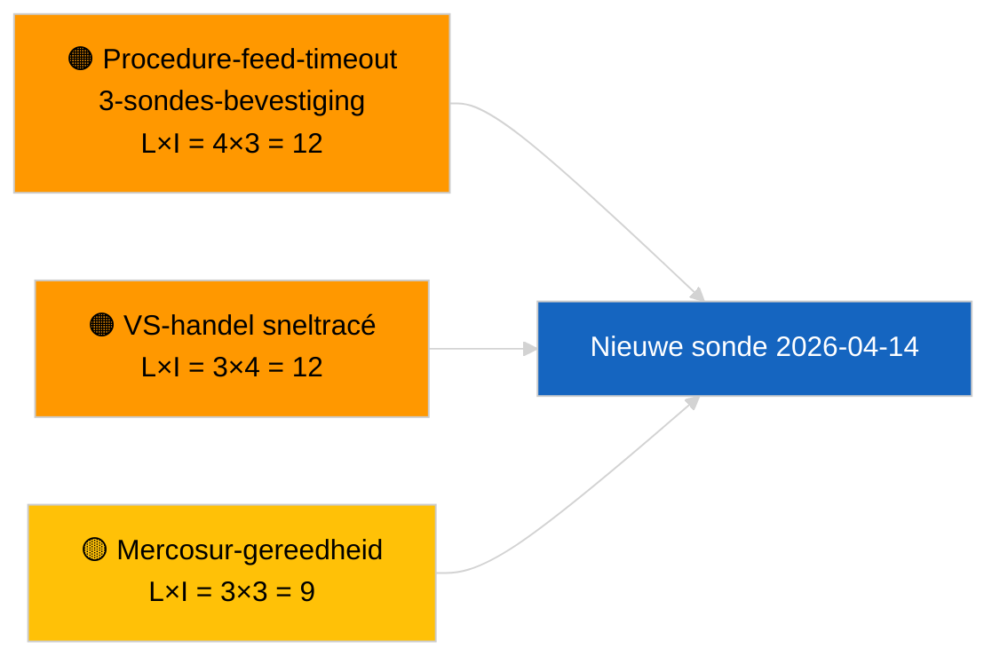

<!-- SPDX-FileCopyrightText: 2026 Hack23 AB -->
<!-- SPDX-License-Identifier: Apache-2.0 -->

# Bestuurssamenvatting — Voorstellen | 2026-04-03

**Classificatie:** OSINT | Openbaar parlementair dossier
**Betrouwbaarheid:** 🟢 Hoog (structurele beoordeling tijdens parlementaire vakantie, GEDEGRADEERDE API-modus)
**Gegenereerd:** 2026-04-03T00:00:00Z (retroactief rapport)
**Artikeltype:** Voorstellen
**Uitvoerings-ID:** `9be5bca6-de96-4303-80ff-33cb5f24b51b`
**Bron:** Open dataportal van het Europees Parlement

---

## 🎯 BLUF

**Op 2026-04-03 werden geen nieuwe Commissievoorstellen of EP-initiatiefprocedures geopend.** Uitvoering `9be5bca6-de96-4303-80ff-33cb5f24b51b` retourneerde **«Kwantitatieve risicobeoordeling over 0 geïdentificeerde beleidsdimensies»** — nul geclassificeerde actoren, ROUTINEUS belang. `get_procedures_feed` behoort tot de mislukte eindpunten bevestigd door de zusteruitvoering `breaking-2` (GEDEGRADEERDE API-modus, 5/8 verplichte feeds falen). De substantiële portefeuille van voorstellen die wordt meegenomen naar april is de geërvde pipeline: transposatiecyclus van de antikorruptierichtlijn (TA-10-2026-0094), HDV-emissiekader (TA-10-2026-0084), ECB-vicepresidentsprocedure (TA-10-2026-0060), Better Regulation-basislijn (TA-10-2026-0063) en de aanhangige EU-Mercosur HvJ-verwijzing (TA-10-2026-0008). **🟢 HOOG vertrouwen** in de lege status wordt aangestuurd door agenda + GEDEGRADEERDE feeds.

---

## 🧭 3 Decisions This Brief Supports

| # | Beslissing | Wie beslist | Termijn | Onderbouwing |
|:-:|-----------|------------|:-------:|-------------|
| 1 | **Redactioneel:** Voorstellen dagelijks OVERSLAAN | Redacteur | +24u | Lege uitvoering + GEDEGRADEERDE feeds |
| 2 | **Monitoring:** opnemen in 2026-04-14 herstellingssonde na vakantie | Datapipeline | 2026-04-14 | Eerste post-Pasen werkdag |
| 3 | **Vooruitkijkende monitoring:** Vergadering van de Commissie op dinsdag 7 april 2026 — eerste post-Pasen college-vergadering | Analysecoördinator | 2026-04-07 | Commissie-ritme |

---

## 📰 60-Second Read

- 🔴 **Geen nieuwe procedures** op 2026-04-03; `get_procedures_feed` timeout na 3 sondepogingen. (🟢 Hoog)
- 🟠 **0 actoren geclassificeerd**; ROUTINEUS belang. (🟢 Hoog)
- 🟢 **Pipeline-carryover** verankert de bewakingslijst. (🟢 Hoog)
- 🟡 **Risicoblokken alle «geen»** vandaag. (🟢 Hoog)
- 🔵 **Economische context:** verwachte Q2-voorstellen over uitvoeringsregels AI-verordening, Industriële Defensiestrategie, MFK-voorbereiding. (🟡 Gemiddeld)
- 🟣 **Kruisverwijzing:** zusteruitvoering `breaking-2` formaliseert GEDEGRADEERDE API-modus. (🟢 Hoog)
- 🩷 **Verstoringsvektor:** Amerikaanse handelsdruk kan een Commissievoorstel via sneltracé in april forceren. (🟡 Gemiddeld)
- ⚪ **Voorwaarts overdragen:** HvJ-advies Mercosur blijft de hoogst geprioriteerde afwachtende trigger.

---

## 🗂️ Top Documents / Procedures — Propositions Watch

| Rang | EP-referentie | Titel (kort) | Gewicht | Betrouwbaarheid | Status |
|:----:|---------------|-------------|:-------:|:---------------:|--------|
| 1 | — | Geen nieuwe voorstellen op 2026-04-03 | 0,0 | 🟢 HOOG | GEDEGRADEERDE feeds |
| 2 | TA-10-2026-0094 | Antikorruptierichtlijn (transposatiecyclus) | 9,0 | 🟢 HOOG | Aangenomen 26 maart |
| 3 | TA-10-2026-0008 | EU-Mercosur HvJ-verwijzing (aanhangig) | 8,0 | 🟡 GEMIDDELD | HvJ-advies verwacht |

---

## ⚠️ Risk & Threat Snapshot

| Risico | L | I | Score | Trigger | Bron | Admiraliteit |
|--------|:-:|:-:|:-----:|---------|------|:------------:|
| Procedure-feed-timeout | 4 | 3 | 12 | Aanhoudend na 14 april | Zuster `breaking-2` | A1 |
| VS-handel sneltracé | 3 | 4 | 12 | VS-actie | TA-10-2026-0096 | A1 |
| Mercosur-advies gereedheid | 3 | 3 | 9 | HvJ publiceert | TA-10-2026-0008 | A2 |

---

## 🔮 Top Forward Trigger

**Vergadering van de Commissie op dinsdag 7 april 2026** — eerste post-Pasen college-vergadering.

---

## 🛡️ Source Quality Assessment

- **Primaire bronnen:** Uitvoering `9be5bca6-de96-4303-80ff-33cb5f24b51b`; zuster `breaking-2`.
- **Betrouwbaarheid:** 🟢 HOOG voor driverclassificatie.

---

## 📎 Links

| Link | Pad |
|------|-----|
| Artikel | `./article.md` |
| Zusteruitvoeringen | Alle uitvoeringen van 2026-04-03 (zie map) |
| Manifest | `./manifest.json` |

---

**Documentbeheer**
- **Sjabloon:** `/analysis/templates/executive-brief.md`
- **Artefactpad:** `analysis/daily/2026-04-03/propositions/executive-brief.md`
- **Classificatie:** Openbaar
- **Retroactieve generatie:** Back-fill sessie.
