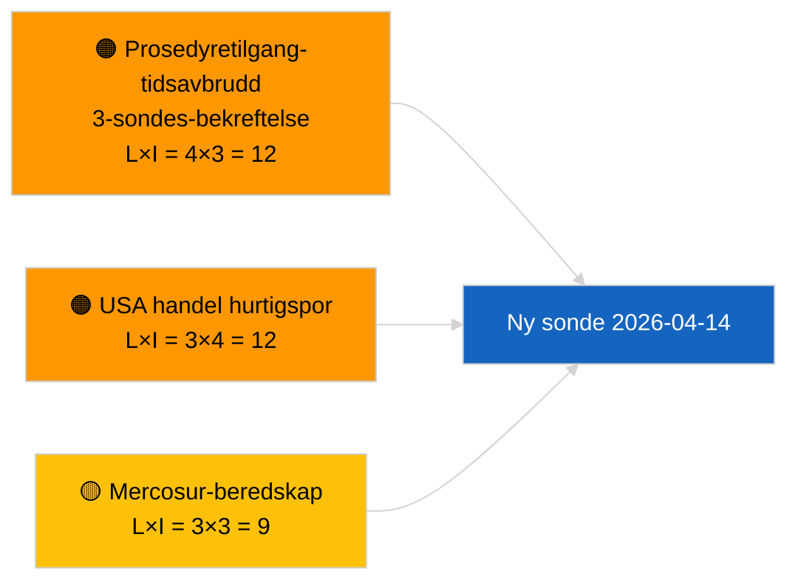

<!-- SPDX-FileCopyrightText: 2026 Hack23 AB -->
<!-- SPDX-License-Identifier: Apache-2.0 -->

# Lederrapport — Proposisjoner | 2026-04-03

**Klassifisering:** OSINT | Offentlig parlamentarisk rekord
**Tillit:** 🟢 Høy (strukturell vurdering i parlamentarisk ferie, DEGRADERT API-tilstand)
**Generert:** 2026-04-03T00:00:00Z (retroaktiv rapport)
**Artikkeltype:** Proposisjoner
**Kjøre-ID:** `9be5bca6-de96-4303-80ff-33cb5f24b51b`
**Kilde:** Europaparlamentets åpne dataportal

---

## 🎯 BLUF

**Ingen nye Kommisjonspropositsjoner eller EP-eget-initiativ-prosedyrer ble åpnet den 2026-04-03.** Kjøring `9be5bca6-de96-4303-80ff-33cb5f24b51b` returnerte **"Kvantitativ risikovurdering over 0 identifiserte politiske dimensjoner"** — null klassifiserte aktører, RUTINE-betydning. `get_procedures_feed` er blant de mislykkede endepunktene bekreftet av søskenkjøringen `breaking-2` (DEGRADERT API-tilstand, 5/8 obligatoriske tilganger feiler). Den vesentlige proposisjonsporteføljen som bringes inn i april er den nedarvede rørledningen: antikorrupsjonsdirektivets transposisjonssyklus (TA-10-2026-0094), HDV-utslippsrammeverket (TA-10-2026-0084), ECBs visepresidentprosedyre (TA-10-2026-0060), Better Law-Making-basislinjen (TA-10-2026-0063) og den verserende EU-Mercosur ECJ-forelæggelsen (TA-10-2026-0008). **🟢 HØY tillit** til tomt tilstand er kalender + DEGRADERT tilgang drevet.

---

## 🧭 3 Decisions This Brief Supports

| # | Beslutning | Hvem bestemmer | Frist | Dokumentasjon |
|:-:|-----------|---------------|:-----:|---------------|
| 1 | **Redaksjonell:** HOPP OVER proposisjoner daglig | Redaktør | +24t | Tom kjøring + DEGRADERTE tilganger |
| 2 | **Overvåking:** inkluder i 2026-04-14 gjenopprettingssonde etter ferie | Datarørledning | 2026-04-14 | Første post-påske hverdag |
| 3 | **Fremovervåking:** Kommisjonens tirsdagsmøte 7. april 2026 — første post-påske kollegieoppstilling | Analyseansvarlig | 2026-04-07 | Kommisjonens kadense |

---

## 📰 60-Second Read

- 🔴 **Ingen nye prosedyrer** den 2026-04-03; `get_procedures_feed` tidsavbrudd ved 3 sondeprøver. (🟢 Høy)
- 🟠 **0 aktører klassifisert**; RUTINE-betydning. (🟢 Høy)
- 🟢 **Rørlednings-carryover** forankrer overvåkingslisten. (🟢 Høy)
- 🟡 **Risikodimensjoner alle "ingen"** i dag. (🟢 Høy)
- 🔵 **Økonomisk kontekst:** forventede Q2-proposisjoner om AI-lovens gjennomføringsregler, Forsvarsindustriel strategi, MFF-forberedelse. (🟡 Middel)
- 🟣 **Kryssreferanse:** søskenkjøringen `breaking-2` formaliserer DEGRADERT API-tilstand. (🟢 Høy)
- 🩷 **Forstyrelsesvektor:** USAs handelspress kan tvinge frem en hurtigspors-Kommisjonspropositjon i april. (🟡 Middel)
- ⚪ **Fremoverfører:** Mercosur ECJ-uttalelsen er fortsatt den høyest prioriterte ventende utløseren.

---

## 🗂️ Top Documents / Procedures — Propositions Watch

| Rang | EP-referanse | Tittel (kort) | Vekt | Tillit | Status |
|:----:|--------------|--------------|:----:|:------:|--------|
| 1 | — | Ingen nye proposisjoner den 2026-04-03 | 0.0 | 🟢 HØY | DEGRADERTE tilganger |
| 2 | TA-10-2026-0094 | Antikorrupsjonsdirektiv (transposisjonssyklus) | 9.0 | 🟢 HØY | Vedtatt 26. mars |
| 3 | TA-10-2026-0008 | EU-Mercosur ECJ-forelæggelse (verserende) | 8.0 | 🟡 MIDDEL | Domstolsuttalelse forventet |

---

## ⚠️ Risk & Threat Snapshot

| Risiko | L | I | Poeng | Utløser | Kilde | Admiralitet |
|--------|:-:|:-:|:-----:|---------|-------|:-----------:|
| Prosedyretilgang-tidsavbrudd | 4 | 3 | 12 | Vedvarer etter 14. april | Søsken `breaking-2` | A1 |
| USA handel hurtigspor | 3 | 4 | 12 | USA-handling | TA-10-2026-0096 | A1 |
| Mercosur-uttalelse beredskap | 3 | 3 | 9 | Domstolen frigir | TA-10-2026-0008 | A2 |

---

## 🔮 Top Forward Trigger

**Kommisjonens tirsdagsmøte 7. april 2026** — første post-påske kollegieoppstilling.

---

## 🛡️ Source Quality Assessment

- **Primære kilder:** Kjøring `9be5bca6-de96-4303-80ff-33cb5f24b51b`; søsken `breaking-2`.
- **Tillit:** 🟢 HØY på drivklassifisering.

---

## 📎 Links

| Lenke | Sti |
|-------|-----|
| Artikkel | `./article.md` |
| Søskenkjøringer | Alle 2026-04-03-kjøringer (se mappe) |
| Manifest | `./manifest.json` |

---

**Dokumentkontroll**
- **Mal:** `/analysis/templates/executive-brief.md`
- **Artefaktsti:** `analysis/daily/2026-04-03/propositions/executive-brief.md`
- **Klassifisering:** Offentlig
- **Retroaktiv generering:** Back-fill session.
