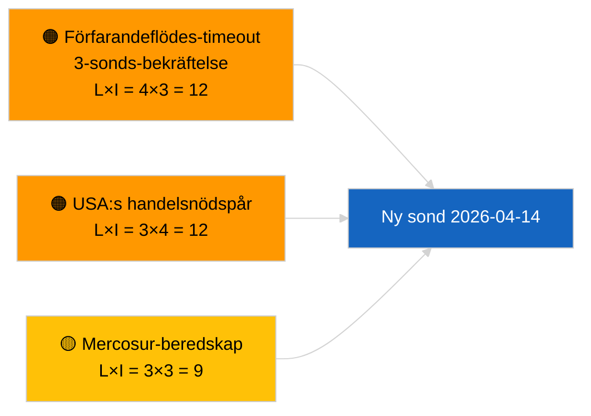

<!-- SPDX-FileCopyrightText: 2026 Hack23 AB -->
<!-- SPDX-License-Identifier: Apache-2.0 -->

# Verkställande rapport — Propositioner | 2026-04-03

**Klassificering:** OSINT | Offentligt parlamentariskt protokoll
**Tillförlitlighet:** 🟢 Hög (strukturell bedömning under riksdagsuppehåll, DEGRADERAT API-läge)
**Genererad:** 2026-04-03T00:00:00Z (retroaktiv rapport)
**Artikeltyp:** Propositioner
**Körnings-ID:** `9be5bca6-de96-4303-80ff-33cb5f24b51b`
**Källa:** Europaparlamentets öppna dataportal

---

## 🎯 BLUF

**Inga nya kommissionspropositioner eller EP-egeninitierade förfaranden öppnades den 2026-04-03.** Körning `9be5bca6-de96-4303-80ff-33cb5f24b51b` returnerade **"Kvantitativ riskvärdering för 0 identifierade politiska dimensioner"** — noll klassificerade aktörer, RUTINMÄSSIG betydelse. `get_procedures_feed` hör till de misslyckade slutpunkterna som bekräftats av syskonkörningen `breaking-2` (DEGRADERAT API-läge, 5/8 obligatoriska flöden misslyckas). Den substantiella propositionsportföljen som förs in i april är det nedärvda rörledningen: antikorruptionsdirektivets transponeringscykel (TA-10-2026-0094), utsläppsramen för tunga fordon (TA-10-2026-0084), ECB:s vice-ordförandeförfarande (TA-10-2026-0060), Better Law-Making-baslinjen (TA-10-2026-0063) och den pågående EU-Mercosur ECJ-hänskjutningen (TA-10-2026-0008). **🟢 HÖG tillförlitlighet** för det tomma tillståndet är drivs av kalender + DEGRADERADE flöden.

---

## 🧭 3 Decisions This Brief Supports

| # | Beslut | Vem beslutar | Tidsfrist | Underlag |
|:-:|--------|-------------|:--------:|---------|
| 1 | **Redaktionellt:** HOPPA ÖVER propositioner dagligen | Redaktör | +24h | Tom körning + DEGRADERADE flöden |
| 2 | **Övervakning:** inkludera i 2026-04-14 sond för återställning efter semester | Datapipeline | 2026-04-14 | Första vardagen efter påsk |
| 3 | **Framåtbevakning:** Kommissionens tisdagsmöte 7 april 2026 — första uppläggningen av college efter påsk | Analysansvarig | 2026-04-07 | Kommissionens rytm |

---

## 📰 60-Second Read

- 🔴 **Inga nya förfaranden** den 2026-04-03; `get_procedures_feed` timeout vid 3 sonder. (🟢 Hög)
- 🟠 **0 aktörer klassificerade**; RUTINMÄSSIG betydelse. (🟢 Hög)
- 🟢 **Rörlednings-carryover** förankrar bevakningslistan. (🟢 Hög)
- 🟡 **Riskdimensioner alla "ingen"** idag. (🟢 Hög)
- 🔵 **Ekonomiskt sammanhang:** förväntade propositioner för Q2 om AI-aktens genomföranderegler, Försvarsindustristrategin, MFF-förberedelser. (🟡 Medel)
- 🟣 **Korsreferens:** syskonkörningen `breaking-2` formaliserar DEGRADERAT API-läge. (🟢 Hög)
- 🩷 **Störningsvektor:** USA:s handelstryck kan tvinga fram en snabbspårad kommissionsproposition i april. (🟡 Medel)
- ⚪ **Carryforward:** Mercosur ECJ-yttrandet är fortfarande den högst prioriterade väntande utlösaren.

---

## 🗂️ Top Documents / Procedures — Propositions Watch

| Rang | EP-referens | Titel (kort) | Vikt | Tillförlitlighet | Status |
|:----:|-------------|-------------|:----:|:----------------:|--------|
| 1 | — | Inga nya propositioner den 2026-04-03 | 0.0 | 🟢 HÖG | DEGRADERADE flöden |
| 2 | TA-10-2026-0094 | Antikorruptionsdirektiv (transponeringscykel) | 9.0 | 🟢 HÖG | Antaget 26 mars |
| 3 | TA-10-2026-0008 | EU-Mercosur ECJ-hänskjutning (pågående) | 8.0 | 🟡 MEDEL | Domstolsyttrande väntas |

---

## ⚠️ Risk & Threat Snapshot

| Risk | L | I | Poäng | Utlösare | Källa | Admiralitet |
|------|:-:|:-:|:-----:|---------|-------|:-----------:|
| Förfarandeflödes-timeout | 4 | 3 | 12 | Kvarstår efter 14 april | Syskon `breaking-2` | A1 |
| USA:s handelsnödspår | 3 | 4 | 12 | USA:s agerande | TA-10-2026-0096 | A1 |
| Mercosur-yttrande beredskap | 3 | 3 | 9 | Domstolen publicerar | TA-10-2026-0008 | A2 |

---

## 🔮 Top Forward Trigger

**Kommissionens tisdagsmöte 7 april 2026** — första uppläggningen av college efter påsk.

---

## 🛡️ Source Quality Assessment

- **Primära källor:** Körning `9be5bca6-de96-4303-80ff-33cb5f24b51b`; syskon `breaking-2`.
- **Tillförlitlighet:** 🟢 HÖG på drivrutinsklassificering.

---

## 📎 Links

| Länk | Sökväg |
|------|--------|
| Artikel | `./article.md` |
| Syskonkörningar | Alla 2026-04-03-körningar (se mapp) |
| Manifest | `./manifest.json` |

---

**Dokumentkontroll**
- **Mall:** `/analysis/templates/executive-brief.md`
- **Artefaktsökväg:** `analysis/daily/2026-04-03/propositions/executive-brief.md`
- **Klassificering:** Offentlig
- **Retroaktiv generering:** Backfill-session.
