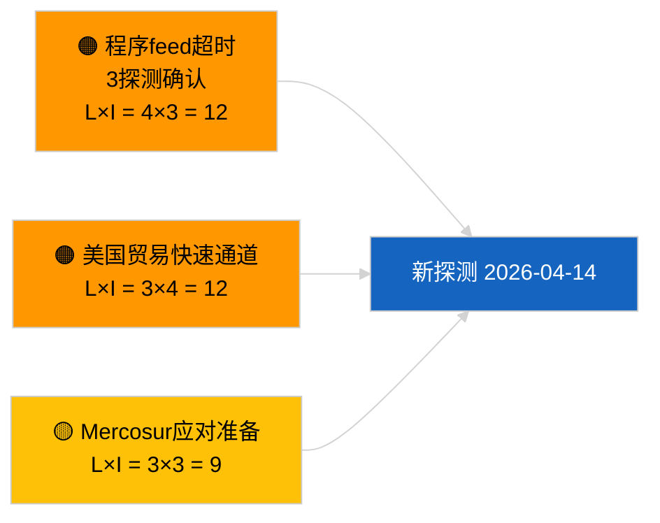

<!-- SPDX-FileCopyrightText: 2026 Hack23 AB -->
<!-- SPDX-License-Identifier: Apache-2.0 -->

# 执行简报 — 提案 | 2026-04-03

**分类：** OSINT | 公开议会记录
**可信度：** 🟢 高（议会休会期间的结构性评估，API降级模式）
**生成日期：** 2026-04-03T00:00:00Z（追溯报告）
**文章类型：** 提案
**运行ID：** `9be5bca6-de96-4303-80ff-33cb5f24b51b`
**来源：** 欧洲议会开放数据门户

---

## 🎯 BLUF

**2026-04-03未开启任何新的欧盟委员会提案或欧洲议会自主程序。** 运行`9be5bca6-de96-4303-80ff-33cb5f24b51b`返回 **«对0个已识别政策维度的定量风险评估»** — 零分类行为体，常规重要性。`get_procedures_feed`属于经姊妹运行`breaking-2`确认的故障端点之一（API降级模式，8个必需feed中5个失败）。进入四月的实质性提案组合为继承管道：反腐败指令转置周期（TA-10-2026-0094）、重型车辆排放框架（TA-10-2026-0084）、欧洲央行副行长程序（TA-10-2026-0060）、更好立法基线（TA-10-2026-0063）以及待决EU-Mercosur欧洲法院预裁决（TA-10-2026-0008）。空置状态的**🟢 高可信度**由日历 + 降级feed支持。

---

## 🧭 3 Decisions This Brief Supports

| # | 决策 | 决策者 | 截止时间 | 依据 |
|:-:|------|--------|:-------:|------|
| 1 | **编辑：** 每日跳过提案 | 编辑 | +24小时 | 空运行 + 降级feed |
| 2 | **监控：** 纳入假期后2026-04-14恢复探测 | 数据管道 | 2026-04-14 | 复活节后首个工作日 |
| 3 | **前瞻监控：** 欧盟委员会周二会议2026年4月7日 — 复活节后首次学院审议 | 分析负责人 | 2026-04-07 | 委员会节奏 |

---

## 📰 60-Second Read

- 🔴 **2026-04-03无新程序**；`get_procedures_feed`在3次探测尝试后超时。（🟢 高）
- 🟠 **0个行为体分类**；常规重要性。（🟢 高）
- 🟢 **管道延续**锚定监控清单。（🟢 高）
- 🟡 **风险维度均为«无»**（今日）。（🟢 高）
- 🔵 **经济背景：** 预期Q2提案涵盖人工智能法实施细则、国防工业战略、MFF准备。（🟡 中等）
- 🟣 **交叉参考：** 姊妹运行`breaking-2`正式确定API降级模式。（🟢 高）
- 🩷 **扰动向量：** 美国贸易压力可能迫使欧盟委员会在四月提出快速通道提案。（🟡 中等）
- ⚪ **前向延续：** Mercosur欧洲法院意见仍为最高优先级待处理触发事项。

---

## 🗂️ Top Documents / Procedures — Propositions Watch

| 排名 | EP参考 | 标题（简） | 权重 | 可信度 | 状态 |
|:----:|--------|---------|:----:|:------:|------|
| 1 | — | 2026-04-03无新提案 | 0.0 | 🟢 高 | 降级feed |
| 2 | TA-10-2026-0094 | 反腐败指令（转置周期） | 9.0 | 🟢 高 | 3月26日通过 |
| 3 | TA-10-2026-0008 | EU-Mercosur欧洲法院预裁决（待决） | 8.0 | 🟡 中等 | 法院意见待定 |

---

## ⚠️ Risk & Threat Snapshot

| 风险 | L | I | 分数 | 触发因素 | 来源 | 海军部评级 |
|------|:-:|:-:|:---:|---------|------|:---------:|
| 程序feed超时 | 4 | 3 | 12 | 4月14日后持续 | 姊妹`breaking-2` | A1 |
| 美国贸易快速通道 | 3 | 4 | 12 | 美国行动 | TA-10-2026-0096 | A1 |
| Mercosur意见应对准备 | 3 | 3 | 9 | 法院发布 | TA-10-2026-0008 | A2 |

---

## 🔮 Top Forward Trigger

**欧盟委员会周二会议2026年4月7日** — 复活节后首次学院审议。

---

## 🛡️ Source Quality Assessment

- **主要来源：** 运行`9be5bca6-de96-4303-80ff-33cb5f24b51b`；姊妹`breaking-2`。
- **可信度：** 🟢 驱动分类高。

---

## 📎 Links

| 链接 | 路径 |
|------|------|
| 文章 | `./article.md` |
| 姊妹运行 | 所有2026-04-03运行（见文件夹） |
| 清单 | `./manifest.json` |

---

**文档管理**
- **模板：** `/analysis/templates/executive-brief.md`
- **制品路径：** `analysis/daily/2026-04-03/propositions/executive-brief.md`
- **分类：** 公开
- **追溯生成：** 回填会话。
