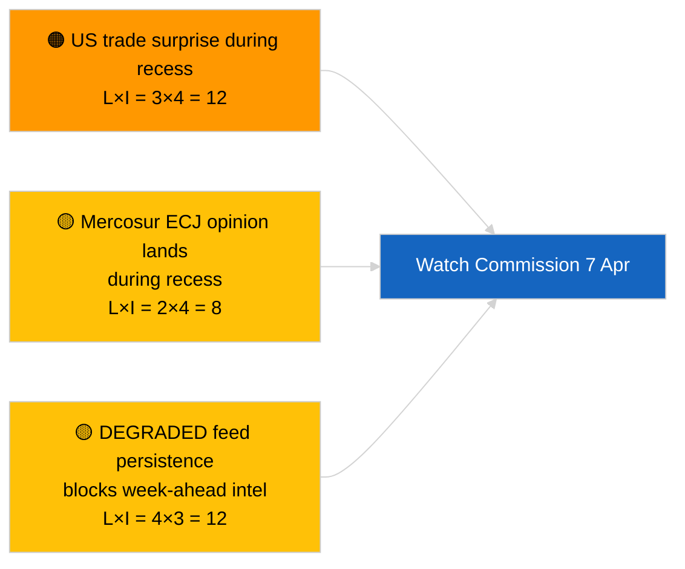
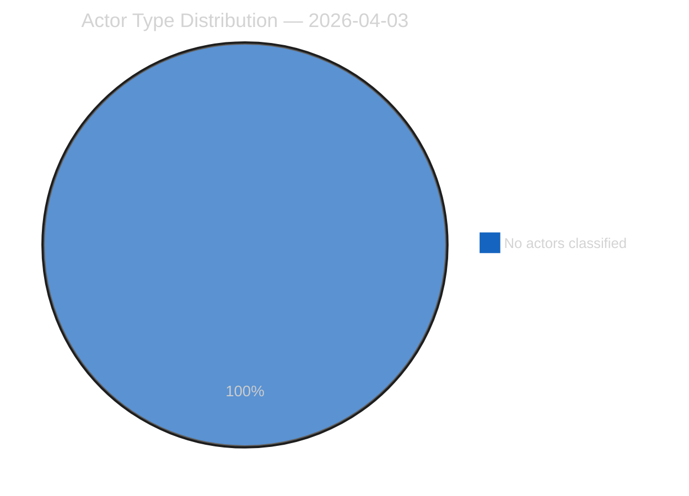
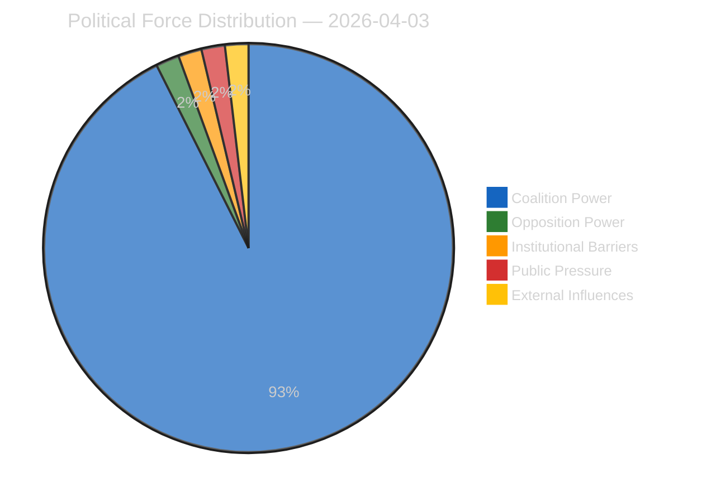
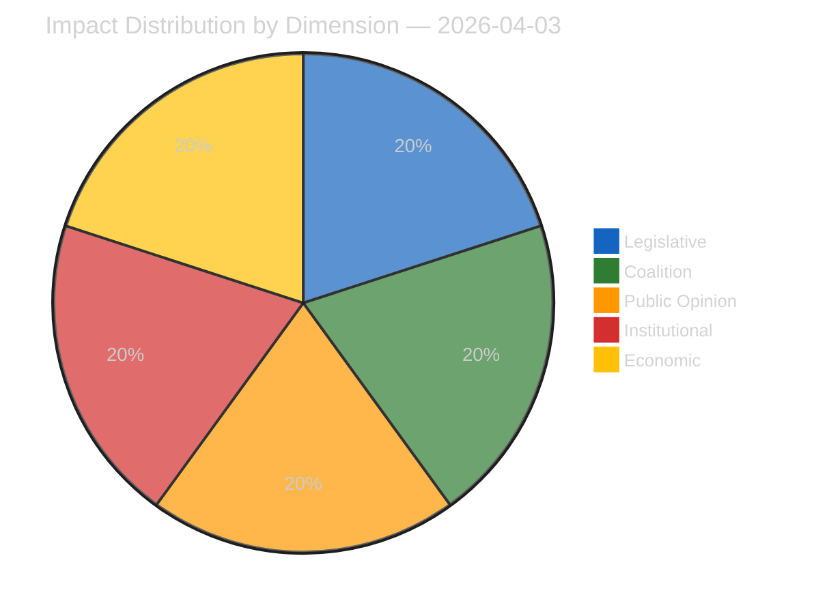
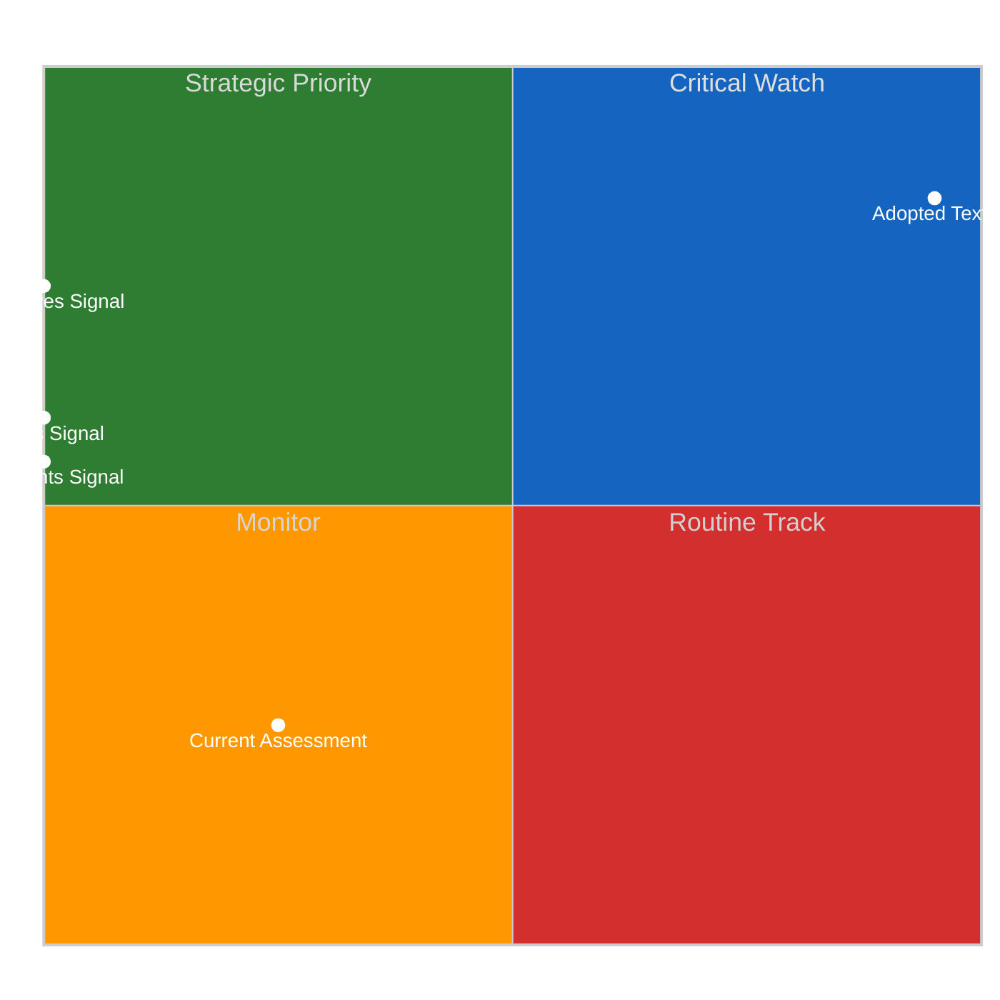
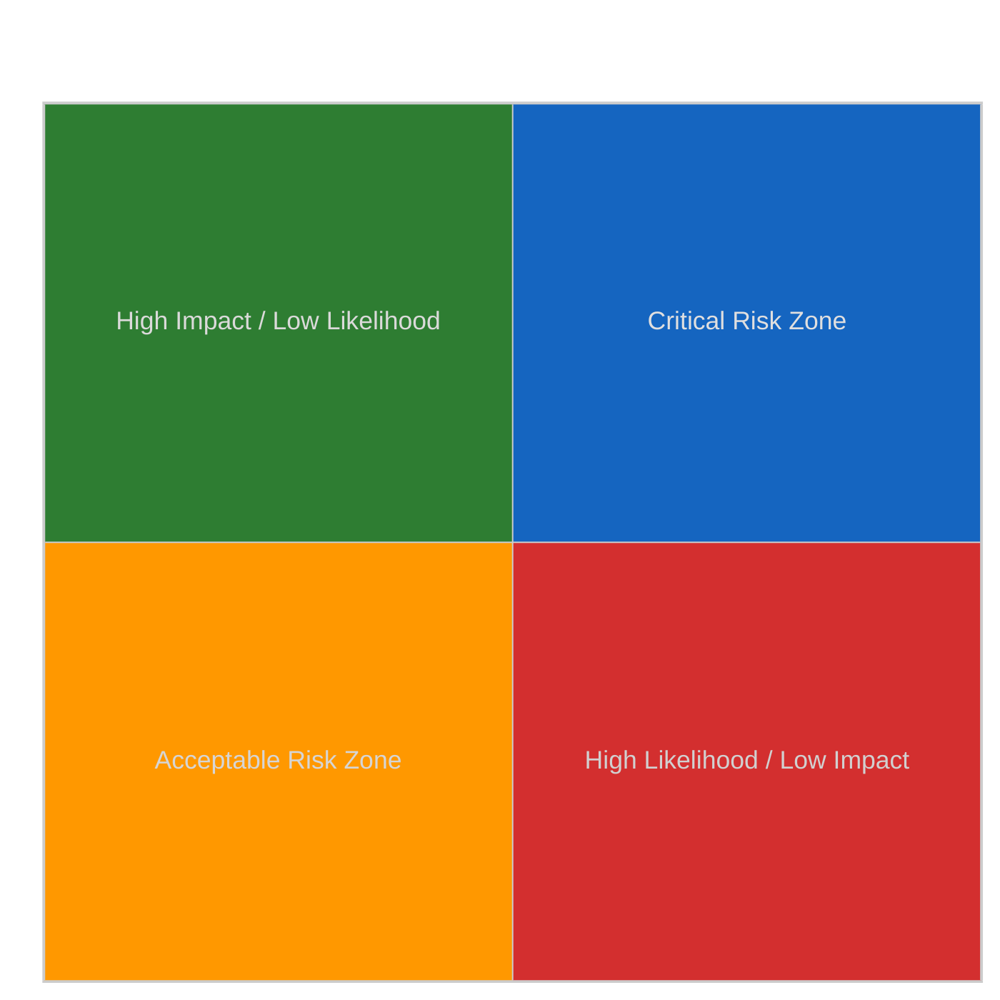
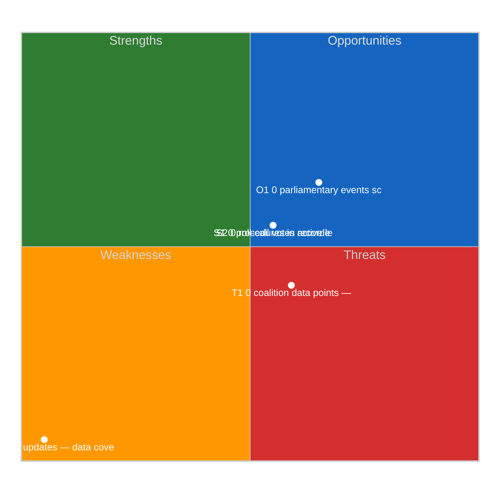
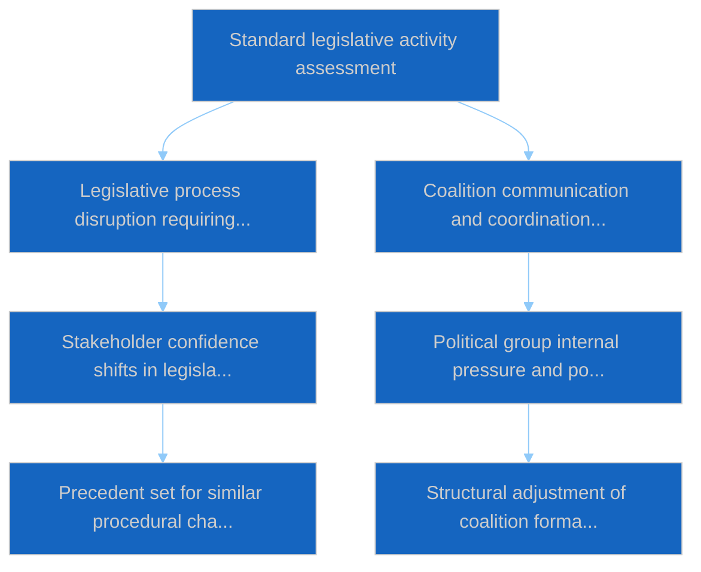

# Week Ahead — 2026-04-03

<h2 id="section-executive-brief">Executive Brief</h2>

### 🎯 BLUF

**Week of 6-12 April 2026 will be a quiet Easter-recess week — no plenary, no formal committee sittings, limited Commission Tuesday activity.** Run `d2e395b4-2fc9-4924-8b79-554b0453c034` returned **"Quantitative risk scoring across 0 identified political dimensions"** with zero classified actors. The week's most notable institutional event is the Commission Tuesday meeting (7 April), the first post-Easter college tabling, which may yield new propositions or trade-response communications. EP committee work nominally resumes the following week (13-17 April). **🟡 MEDIUM confidence** on the "quiet week" projection given the DEGRADED EP-API state limits forward signal; **🟢 HIGH confidence** that no plenary or formal committee voting is scheduled.

---

### 🧭 3 Decisions This Brief Supports

| # | Decision | Who Decides | Deadline | Evidence |
|:-:|----------|-------------|:--------:|----------|
| 1 | **Editorial:** publish quiet-week outlook with Commission 7 April emphasis | Editor | +24h | Calendar + Commission cadence |
| 2 | **Monitoring:** capture Commission 7 April outputs in a dedicated probe | Analyst | 2026-04-07 | First post-Easter college tabling |
| 3 | **Forward-watch:** pre-plenary intelligence cycle begins 13 April | Analysis lead | 2026-04-13 | Committee work-week |

---

### 📰 60-Second Read

- 🔴 **No EP plenary** scheduled 6-12 April 2026; Easter Sunday 12 April. (🟢 High)
- 🟠 **Commission Tuesday 7 April 2026** is the only confirmed inter-institutional event with intelligence value. (🟢 High)
- 🟢 **0 actors classified** in this run — week-ahead synthesis is structurally underpowered. (🟢 High)
- 🟡 **DEGRADED API state** continues from 2026-04-03/breaking-2 — week-ahead probes will likely also suffer. (🟢 High)
- 🔵 **Economic context:** IMF April WEO release window aligns with the following week; fiscal-stress data may colour MFF debate during plenary. (🟢 High)
- 🟣 **Cross-reference:** see 2026-04-03/breaking, breaking-2, breaking-3 for substantive Friday content. (🟢 High)
- 🩷 **Disruption vector:** US trade announcement during Easter week could force fast-track Commission proposition. (🟡 Medium)
- ⚪ **Carry-forward:** track Polish-judiciary developments for Braun-precedent follow-on cases.

---

### 🗂️ Top Events / Triggers — Week of 6-12 April 2026

| Rank | Event | Date | Significance | Confidence |
|:----:|-------|------|:------------:|:----------:|
| 1 | Commission Tuesday meeting | 7 April | 7.0 | 🟢 HIGH |
| 2 | Easter Sunday (calendar marker) | 12 April | 3.0 | 🟢 HIGH |
| 3 | Easter Monday (recess end T-1) | 13 April | 5.0 | 🟢 HIGH |
| 4 | No EP committee sittings | week | 0.0 | 🟢 HIGH |
| 5 | No EP plenary | week | 0.0 | 🟢 HIGH |

---

### ⚠️ Risk & Threat Snapshot

| Risk | L | I | Score | Trigger | Source | Admiralty |
|------|:-:|:-:|:-----:|---------|--------|:---------:|
| US trade surprise during recess | 3 | 4 | 12 | US announcement | TA-10-2026-0096 | A1 |
| Mercosur ECJ opinion during recess | 2 | 4 | 8 | Court releases | TA-10-2026-0008 | A2 |
| DEGRADED feed persistence | 4 | 3 | 12 | Past 14 April | Sibling `breaking-2` | A1 |
| Polish-judiciary follow-on case | 3 | 3 | 9 | New investigation | TA-10-2026-0088 | A2 |

---

### 🔮 Top Forward Trigger

**Commission Tuesday meeting 7 April 2026.** First post-Easter college tabling will set the topical mix for the 27-30 April Strasbourg plenary; absence of trade or institutional-reform tabling would signal a deliberate scenario-C (economic/industrial) weighting.

---

### 🛡️ Source Quality Assessment

- **Primary sources:** Run `d2e395b4-2fc9-4924-8b79-554b0453c034`; EP calendar; Commission cadence.
- **Data limitations:** Forward inference under DEGRADED feed state; week-ahead probes will be unreliable.
- **Confidence:** 🟢 HIGH on calendar facts; 🟡 MEDIUM on event-density projection.

---

### 📎 Links

| Link | Path |
|------|------|
| Article | `./article.md` |
| Sibling runs | `analysis/daily/2026-04-03/breaking/`, `breaking-2/`, `breaking-3/`, `committee-reports/`, `motions/`, `propositions/` |
| Manifest | `./manifest.json` |

---

**Document Control**
- **Template:** `/analysis/templates/executive-brief.md`
- **Artifact path:** `analysis/daily/2026-04-03/week-ahead/executive-brief.md`
- **Classification:** Public
- **Retrospective generation:** Back-fill session.

<h2 id="reader-intelligence-guide">Reader Intelligence Guide</h2>

Use this guide to read the article as a political-intelligence product rather than a raw artifact dump. High-value reader lenses appear first; technical provenance remains available in the audit appendices.

| Reader need | What you'll get | Source artifact |
|---|---|---|
| [BLUF and editorial decisions](#section-executive-brief) | fast answer to what happened, why it matters, who is accountable, and the next dated trigger | `executive-brief.md` |
| [Actors and forces](#section-actors-forces) | who is driving the story, what political forces line up behind them, and which institutional levers they can pull | `classification/actor-mapping.md` |
| [Coalitions and voting](#section-coalitions-voting) | political group alignment, voting evidence, and coalition pressure points | `existing/voting-patterns.md` |
| [Risk assessment](#section-risk) | policy, institutional, coalition, communications, and implementation risk register | `risk-scoring/risk-matrix.md` |
| [Threat landscape](#section-threat) | hostile actors, attack vectors, consequence trees, and legislative-disruption pathways | `threat-assessment/actor-threat-profiles.md` |
| [Cross-run continuity](#section-continuity) | what changed since prior sessions and how confidence shifted between runs | `existing/cross-session-intelligence.md` |
| [Deep analysis](#section-deep-analysis) | long-form Economist-style explanation for readers who want the full argument | `existing/deep-analysis.md` |
| [Supplementary intelligence](#section-supplementary-intelligence) | additional markdown discovered in the run that has not yet been assigned to a canonical section | `executive-brief_ar.md` |

<h2 id="section-actors-forces">Actors & Forces</h2>

### Actor Mapping

### Actors Identified: 0

### Actor Classification

| Actor | Type | Influence | Position | Role |
|-------|------|-----------|----------|------|
| — | — | — | — | — |

### Type Counts

| Type | Count |
|------|-------|
| — | 0 |

### Date: 2026-04-03

### Forces Analysis

### Forces Data

| Force | Trend | Strength | Key Actors | Confidence |
|-------|-------|----------|------------|------------|
| Coalition Power | stable | 50% | — | low |
| Opposition Power | stable | 0% | — | low |
| Institutional Barriers | stable | 0% | — | low |
| Public Pressure | stable | 0% | — | low |
| External Influences | stable | 0% | — | low |

### Balance

| Metric | Value |
|--------|-------|
| Coalition vs Opposition | 50% vs 1% |
| Dominant force | Coalition |
| Date | 2026-04-03 |

### Date: 2026-04-03

### Impact Matrix

### Overall Significance: **ROUTINE**

### Impact Dimensions

| Dimension | Level | Indicator | Numeric |
|-----------|-------|-----------|---------|
| Legislative | none | 🟢 | 5 |
| Coalition | none | 🟢 | 5 |
| Public Opinion | none | 🟢 | 5 |
| Institutional | none | 🟢 | 5 |
| Economic | none | 🟢 | 5 |

### Summary

| Metric | Value |
|--------|-------|
| Overall significance | ROUTINE |
| Highest impact | Legislative |
| Date | 2026-04-03 |

### Date: 2026-04-03

### Significance Assessment

### Overall Significance: **ROUTINE**

### 5-Signal Model Scores

| Signal | Raw Data | Score |
|--------|----------|-------|
| Volume | 0 events, 0 documents | 0.0/5 |
| Pipeline | 0 procedures | 0.0/5 |
| Output | 17 adopted texts | 3.4/5 |
| Anomalies | Pattern deviation detection | — |
| Coalition | Group alignment analysis | — |

### Data Summary

| Metric | Value |
|--------|-------|
| Computed significance | ROUTINE |
| Total data points | 17 |
| Events | 0 |
| Documents | 0 |
| Procedures | 0 |
| Adopted texts | 17 |
| Date | 2026-04-03 |

### Date: 2026-04-03

<h2 id="section-coalitions-voting">Coalitions & Voting</h2>

### Voting Patterns

### Detected Trends (Script-Generated Context)
| Trend ID | Direction | Confidence | Data Points |
|----------|-----------|------------|-------------|
| No trend data available from voting records | — | — | — |

### Computed Summary
- **Trends identified**: 0
- **Records analysed**: 0

### AI Analysis Prompt

> **Instructions for AI Agent (Opus 4.6):** Using the voting pattern data above and the adopted texts from EP MCP feeds, produce a voting pattern intelligence analysis. Your analysis MUST:
>
> 1. **Identify voting blocs**: Which groups consistently vote together on recent adopted texts?
> 2. **Detect anomalies**: Any unexpected votes, close margins (<50 vote difference), or high abstention rates?
> 3. **Analyse by policy domain**: Do voting patterns differ between economic, environmental, and social legislation?
> 4. **Group discipline assessment**: Rate each major group's internal cohesion (high/medium/low) with evidence
> 5. **Trend detection**: Compare recent voting patterns to historical trends — is the Parliament becoming more/less fragmented?
> 6. **Forward-looking**: Which upcoming votes are likely to be contested based on current alignment patterns?
>
> If voting records are limited, analyse the adopted texts' policy positions to infer likely voting alignments and coalition patterns.

### AI-Produced Voting Intelligence

[TO BE FILLED BY AI AGENT — Substantive voting pattern analysis with specific vote references, group cohesion ratings, and anomaly detection. Quality gate: minimum 300 words.]

### Date: 2026-04-03

<h2 id="section-risk">Risk Assessment</h2>

### Risk Matrix

### Overview

Quantitative risk scoring across 0 identified political dimensions.
This matrix uses a standardized likelihood × impact framework to quantify and
prioritize political risks affecting the European Parliament legislative process.

### Risk Heat Map

### Risk Matrix

| Risk ID | Description | Likelihood | Impact | Score | Level |
|---------|-------------|------------|--------|-------|-------|
| — | — | — | — | — | — |

> **Risk Score** = Likelihood × Impact. **Levels**: 🟢 LOW (≤1.0), 🟡 MEDIUM (≤2.0), 🟠 HIGH (≤3.5), 🔴 CRITICAL (>3.5)

### Risk Assessment Details

| — | — | — | — | — | — |

### Risk Mitigation Framework

| Risk Level | Count | Tolerance | Action Required |
|------------|-------|-----------|-----------------|
| 🔴 CRITICAL | 0 | Zero tolerance | Immediate escalation |
| 🟠 HIGH | 0 | Low tolerance | Active mitigation |
| 🟡 MEDIUM | 0 | Moderate | Enhanced monitoring |
| 🟢 LOW | 0 | Acceptable | Routine tracking |

### Date: 2026-04-03

### Quantitative Swot

### Executive Summary

**Strategic Position Score**: 2.0/10
**Overall Assessment**: Weak strategic position: weaknesses and threats dominate — urgent mitigation needed.
**Analysis Date**: 2026-04-03

> This SWOT analysis is derived from 0 procedures, 0 events, 17 adopted texts, 0 documents, 0 voting records, and 0 coalition data points fetched from the European Parliament.

### SWOT Quadrant Chart

### SWOT Overview

| Category | Items | Avg Score | Trend |
|----------|-------|-----------|-------|
| 🟢 Strengths | 2 | 0.0 | stable |
| 🔴 Weaknesses | 1 | 5.0 | stable |
| 🔵 Opportunities | 1 | 1.5 | stable |
| 🟠 Threats | 1 | 0.9 | stable |

### 🟢 Strengths

#### S1: 0 procedures in active legislative pipeline
- **Score**: 0.0/5
- **Confidence**: low
- **Trend**: stable
- **Evidence**:
  - 0 procedures tracked in current period
  - 17 texts adopted
  - 0 documents published

#### S2: 0 roll-call votes recorded with 0 questions
- **Score**: 0.0/5
- **Confidence**: low
- **Trend**: stable
- **Evidence**:
  - 0 voting records available
  - 0 parliamentary questions filed
  - 0 MEP activity updates

### 🔴 Weaknesses

#### W1: 0 MEP updates — data coverage gap assessment
- **Score**: 5.0/5
- **Confidence**: medium
- **Trend**: stable
- **Evidence**:
  - 0 MEP updates in current period
  - 0 documents vs 0 procedures ratio
  - Data freshness depends on EP feed update frequency

### 🔵 Opportunities

#### O1: 0 parliamentary events scheduled
- **Score**: 1.5/5
- **Confidence**: medium
- **Trend**: stable
- **Evidence**:
  - 0 events in analysis period
  - 17 texts adopted indicates legislative throughput
  - 0 procedures in various stages

### 🟠 Threats

#### T1: 0 coalition data points — cohesion monitoring
- **Score**: 0.9/5
- **Confidence**: low
- **Trend**: stable
- **Evidence**:
  - 0 coalition observations recorded
  - Cross-reference with 0 voting records
  - 0 procedures may be affected by coalition shifts

### Cross-Impact Matrix

| Interaction | Net Effect | Rationale |
|-------------|-----------|----------|
| strength #1 × threat #1 | 0.00 | Strength "0 procedures in active legislative pipeline" partially mitigates threat "0 coalition data points — cohesion monitoring" |
| strength #2 × threat #1 | 0.00 | Strength "0 roll-call votes recorded with 0 questions" partially mitigates threat "0 coalition data points — cohesion monitoring" |
| weakness #1 × threat #1 | 0.75 | Weakness "0 MEP updates — data coverage gap assessment" amplifies threat "0 coalition data points — cohesion monitoring" |

### Strategic Priorities Matrix

### Data Summary

| Data Source | Count |
|-------------|-------|
| Procedures | 0 |
| Events | 0 |
| Documents | 0 |
| Voting Records | 0 |
| Adopted Texts | 17 |
| Coalitions | 0 |
| Questions | 0 |
| MEP Updates | 0 |
| **Total Data Points** | **17** |

### Date: 2026-04-03

### Political Capital Risk

### Data Inventory for Capital Risk Assessment
| Data Source | Count | Relevance |
|-------------|-------|-----------|
| Coalition data points | 0 | Group cohesion indicators |
| Voting records | 0 | Voting alignment metrics |
| Voting patterns | 0 | Trend and anomaly data |
| Active procedures | 0 | Legislative engagement |

### Date: 2026-04-03

### Legislative Velocity Risk

### Overview
Risk assessment based on legislative processing speed for 0 procedures.

### Top Velocity Risks
| Procedure | Title | Stage | Days (actual/expected) | Risk Score | Level |
|-----------|-------|-------|----------------------|------------|-------|
| — | — | — | — | — | — |

### Summary
- **Procedures analysed**: 0
- **High/Critical risks**: 0
- **Date**: 2026-04-03

### Agent Risk Workflow

### Risk Heat Map

| Impact ↓ / Likelihood → | Rare | Unlikely | Possible | Likely | Almost Certain |
|--------------------------|------|----------|----------|--------|----------------|
| **Severe** | 🟢 | 🟡 | 🟠 | 🟠 | 🔴 |
| **Major** | 🟢 | 🟡 | 🟡 | 🟠 | 🔴 |
| **Moderate** | 🟢 | 🟢 | 🟡 | 🟠 | 🟠 |
| **Minor** | 🟢 | 🟢 | 🟢 | 🟡 | 🟡 |
| **Negligible** | 🟢 | 🟢 | 🟢 | 🟢 | 🟢 |

### Identified Risks

#### RISK-W00: Baseline political risk
- **Likelihood**: rare (0.1) | **Impact**: minor (2) | **Score**: 0.2 (LOW) | **Confidence**: low
- **Evidence**: Routine parliamentary activity
- **Mitigating Factors**: Stable institutional framework

### Risk Evaluation Matrix

| Rank | Risk ID | Description | Score | Level | Confidence |
|------|---------|-------------|-------|-------|------------|
| 1 | RISK-W00 | Baseline political risk | 0.2 | LOW | low |

### Risk Treatment Plan

- Monitor legislative velocity indicators
- Track coalition voting patterns

### Recommendations

- Monitor legislative velocity indicators
- Track coalition voting patterns

<h2 id="section-threat">Threat Landscape</h2>

### Actor Threat Profiles

### Overview
Individual threat profiles for 0 political actors.

### Actor Threat Matrix
| Actor | Type | Capability | Motivation | Opportunity | Threat Level |
|-------|------|------------|------------|-------------|--------------|
| — | — | — | — | — | — |

### Date: 2026-04-03

### Consequence Trees

### Overview
Structured analysis of action-consequence chains for 0 legislative procedures.

### No procedures available for consequence analysis

### Date: 2026-04-03

### Legislative Disruption

### Overview
Identification of factors disrupting the normal legislative process.

### Disruption Assessment
| Procedure ID | Title | Stage | Resilience | Disruption Points |
|-------------|-------|-------|-----------|-------------------|
| — | — | — | — | — |

### Date: 2026-04-03

### Political Threat Landscape

### Political Threat Landscape Analysis

#### Coalition Shifts
**Threat Level**: 🟢 Low

Coalition stability appears maintained. No significant realignment signals.

**Evidence:**
- No coalition shift signals detected in available data

#### Transparency Deficit
**Threat Level**: ⚠️ Moderate

Transparency concerns at moderate level. Review committee meeting records and public documentation.

**Evidence:**
- No committee activity data available — potential information gap

#### Policy Reversal
**Threat Level**: 🟢 Low

Legislative trajectory appears stable. No major reversal signals.

**Evidence:**
- No significant policy reversal signals detected

#### Institutional Pressure
**Threat Level**: 🟢 Low

Institutional balance appears maintained. Power distribution within normal parameters.

**Evidence:**
- No institutional threat signals detected

#### Legislative Obstruction
**Threat Level**: 🟢 Low

Legislative pace within normal parameters. No obstruction signals.

**Evidence:**
- No significant legislative delay signals detected

#### Democratic Erosion
**Threat Level**: 🟢 Low

Democratic norms appear stable. Institutional processes functioning within expected parameters.

**Evidence:**
- Democratic norms appear stable. No systematic erosion signals.

### Actor Threat Profiles

*No actor threat profiles generated from available data.*

### Consequence Trees

#### Consequence Tree: Standard legislative activity assessment

**Mitigating Factors:**
- Institutional resilience mechanisms
- Cross-party dialogue channels

**Amplifying Factors:**
- No significant amplifying factors identified

### Legislative Disruption Analysis

#### Procedure: General legislative pipeline

**Current Stage**: proposal | **Resilience**: high

| Stage | Threat Category | Likelihood | Risk Level |
|-------|----------------|------------|------------|
| proposal | delay | 8% | 🟢 Low |
| committee | transparency | 18% | 🟢 Low |
| plenary first reading | shift | 22% | 🟢 Low |
| council position | delay | 12% | 🟢 Low |
| plenary second reading | shift | 21% | 🟢 Low |
| conciliation | reversal | 17% | 🟢 Low |
| adoption | delay | 5% | 🟢 Low |

**Alternative Pathways:**
- Commission resubmission with revised proposal
- Enhanced informal trilogue engagement
- Interim resolution as procedural bridge

### Key Findings

- No high-priority threats detected across threat landscape dimensions

### Recommendations

- Continue routine monitoring of parliamentary activity

---
*Assessment generated by EU Parliament Monitor Political Threat Assessment Pipeline.*  
*Based on public European Parliament data. GDPR-compliant.*

<h2 id="section-continuity">Cross-Run Continuity</h2>

### Cross Session Intelligence

### Computed Stability Metrics (Script-Generated Context)
- **Overall Stability**: 0.0%
- **Forecast**: volatile
- **Patterns Analysed**: 0
- **Stable Groups**: None identified from voting data
- **Declining Groups**: None identified from voting data

### AI Analysis Prompt

> **Instructions for AI Agent (Opus 4.6):** Using the cross-session stability metrics above and the adopted texts/voting records from recent plenary sessions, produce a cross-session intelligence synthesis. Your analysis MUST:
>
> 1. **Compare coalition patterns** across the last 3-5 plenary sessions — are alliances strengthening or fragmenting?
> 2. **Identify session-over-session trends**: Which policy areas show increasing/decreasing consensus?
> 3. **Detect coalition realignment signals**: Are new voting blocs forming? Is the Grand Coalition showing stress?
> 4. **Institutional dynamics**: How are EP-Council-Commission dynamics evolving based on recent legislative outcomes?
> 5. **Predictive assessment**: Based on cross-session patterns, forecast likely coalition behavior for upcoming votes
> 6. **Confidence levels**: Rate each finding as 🟢 High / 🟡 Medium / 🔴 Low
>
> Cross-reference with adopted texts from the most recent plenary session to ground the analysis in specific legislative outcomes.

### AI-Produced Cross-Session Intelligence

[TO BE FILLED BY AI AGENT — Cross-session trend analysis with specific plenary session references, coalition evolution assessment, and predictive indicators. Quality gate: minimum 400 words.]

### Date: 2026-04-03

<h2 id="section-deep-analysis">Deep Analysis</h2>

### Raw Data Inventory (Script-Generated Context for AI)
| Data Source | Count |
|-------------|-------|
| Events | 0 |
| Procedures | 0 |
| Documents | 0 |
| Adopted Texts | 17 |
| Questions | 0 |
| MEP Updates | 0 |
| **Total** | **17** |

### Stakeholder Groups — Data Points Available
| Stakeholder Group | Data Points Available |
|-------------------|---------------------|
| Political Groups | 17 (procedures + adopted texts) |
| Civil Society | 0 (documents + questions) |
| Industry | 0 (procedures) |
| National Governments | 17 (adopted texts) |
| Citizens | 0 (questions + MEP updates) |
| EU Institutions | 0 (events + procedures) |

### AI Analysis Prompt

> **Instructions for AI Agent (Opus 4.6):** Using the data inventory above and the raw EP MCP data files, produce a deep multi-perspective analysis following the political-style-guide.md depth Level 3 format. Your analysis MUST:
>
> 1. **Identify the 3-5 most politically significant items** from the available data, citing specific document IDs
> 2. **Analyse each from ≥3 stakeholder perspectives** (Political Groups, Civil Society, Industry, National Governments, Citizens, EU Institutions)
> 3. **Apply the SWOT framework** to the overall parliamentary activity pattern for this date
> 4. **Assess coalition dynamics** — which groups are aligning/diverging based on the adopted texts?
> 5. **Rate confidence** for each analytical claim: 🟢 High / 🟡 Medium / 🔴 Low
> 6. **Provide forward-looking indicators** — what should be monitored in the next 7-14 days?
> 7. **Include a Mermaid diagram** showing key actor relationships or policy connection mapping
>
> Evidence requirement: ≥3 citations per section from EP MCP data (document IDs, vote references, procedure numbers).

### AI-Produced Analysis

[TO BE FILLED BY AI AGENT — This section must contain substantive political intelligence analysis, not data summaries. Quality gate: minimum 500 words of original analytical prose with evidence citations.]

### Date: 2026-04-03

<h2 id="section-supplementary-intelligence">Supplementary Intelligence</h2>

### Executive Brief Ar

**التصنيف:** OSINT | سجل برلماني عام
**مستوى الثقة:** 🟡 متوسط (مستقبلي؛ مخرجات التصنيف الفارغة تحدّ من العمق)
**تاريخ الإنشاء:** 2026-04-03T00:00:00Z (إحاطة بأثر رجعي)
**نوع المقال:** الأسبوع المقبل
**معرّف التشغيل:** `d2e395b4-2fc9-4924-8b79-554b0453c034`
**المصدر:** بوابة البيانات المفتوحة للبرلمان الأوروبي

---

### 🎯 BLUF

**ستكون الفترة من 6 إلى 12 أبريل 2026 أسبوع إجازة عيد الفصح الهادئ — لا جلسة عامة، ولا اجتماعات رسمية للجان، ونشاط محدود لاجتماع المفوضية الثلاثاء.** أسفر التشغيل `d2e395b4-2fc9-4924-8b79-554b0453c034` عن **«تقييم مخاطر كمّي عبر 0 بُعد سياسي محدّد»** دون أي جهات فاعلة مصنّفة. أبرز حدث مؤسسي للأسبوع هو اجتماع المفوضية الثلاثاء (7 أبريل)، أول عرض جماعي بعد عيد الفصح، والذي قد ينتج مقترحات جديدة أو بيانات للسياسة التجارية. يستأنف عمل لجان البرلمان الأوروبي رسمياً الأسبوع التالي (13–17 أبريل). **🟡 ثقة متوسطة** في توقع «الأسبوع الهادئ» نظراً للحالة المتدهورة لواجهة برمجة تطبيقات البرلمان الأوروبي التي تحدّ من الإشارة المستقبلية؛ **🟢 ثقة عالية** بأنه لم تُجدول أي جلسة عامة أو تصويت رسمي للجنة.

---

### 🧭 3 قرارات تدعمها هذه الإحاطة

| # | القرار | صاحب القرار | الموعد النهائي | الدليل |
|:-:|--------|------------|:-------------:|--------|
| 1 | **تحريري:** نشر منظور الأسبوع الهادئ مع التركيز على المفوضية في 7 أبريل | المحرر | +24 ساعة | التقويم + إيقاع المفوضية |
| 2 | **رصد:** التقاط مخرجات المفوضية في 7 أبريل في مسبار مخصص | المحلل | 2026-04-07 | أول عرض جماعي بعد عيد الفصح |
| 3 | **نظرة مستقبلية:** تبدأ دورة الاستخبارات قبل الجلسة العامة في 13 أبريل | رئيس التحليل | 2026-04-13 | أسبوع عمل اللجان |

---

### 📰 قراءة 60 ثانية

- 🔴 **لا جلسة عامة للبرلمان الأوروبي** مجدولة من 6 إلى 12 أبريل 2026؛ عيد الفصح 12 أبريل. (🟢 عالٍ)
- 🟠 **ثلاثاء المفوضية 7 أبريل 2026** هو الحدث المشترك بين المؤسسات الوحيد المؤكد ذو قيمة استخباراتية. (🟢 عالٍ)
- 🟢 **0 جهة فاعلة مصنّفة** في هذا التشغيل — تحليل الأسبوع المقبل متقصّر بنيوياً. (🟢 عالٍ)
- 🟡 **حالة واجهة برمجة التطبيقات المتدهورة** مستمرة من 2026-04-03/breaking-2 — من المرجح تأثّر مسابر الأسبوع المقبل أيضاً. (🟢 عالٍ)
- 🔵 **السياق الاقتصادي:** يتزامن نافذة نشر IMF أبريل WEO مع الأسبوع التالي؛ بيانات الضغط المالي قد تلوّن نقاش الإطار المالي متعدد السنوات خلال الجلسة العامة. (🟢 عالٍ)
- 🟣 **إسناد ترافقي:** راجع 2026-04-03/breaking وbreaking-2 وbreaking-3 للمحتوى الجوهري الجمعة. (🟢 عالٍ)
- 🩷 **متجه اضطراب:** إعلان تجاري أمريكي خلال أسبوع الفصح قد يفرض مساراً سريعاً لمقترح المفوضية. (🟡 متوسط)
- ⚪ **إحالة:** متابعة التطورات القضائية البولندية للقضايا التالية لسابقة براون.

---

### 🗂️ أبرز الأحداث / المحفّزات — أسبوع 6–12 أبريل 2026

| الترتيب | الحدث | التاريخ | الأهمية | مستوى الثقة |
|:-------:|-------|---------|:-------:|:-----------:|
| 1 | اجتماع المفوضية الثلاثاء | 7 أبريل | 7,0 | 🟢 HIGH |
| 2 | عيد الفصح (علامة تقويمية) | 12 أبريل | 3,0 | 🟢 HIGH |
| 3 | الاثنين التالي لعيد الفصح (نهاية الاستراحة ت-1) | 13 أبريل | 5,0 | 🟢 HIGH |
| 4 | لا اجتماعات للجان البرلمان الأوروبي | الأسبوع | 0,0 | 🟢 HIGH |
| 5 | لا جلسة عامة للبرلمان الأوروبي | الأسبوع | 0,0 | 🟢 HIGH |

---

### ⚠️ لمحة عن المخاطر والتهديدات

<!-- mermaid block deduplicated: identical to earlier occurrence (hash=23027b28) -->

| الخطر | أ | ت | الدرجة | المحفّز | المصدر | الإدميرالية |
|-------|:-:|:-:|:------:|---------|--------|:-----------:|
| مفاجأة تجارية أمريكية أثناء الاستراحة | 3 | 4 | 12 | إعلان أمريكي | TA-10-2026-0096 | A1 |
| رأي محكمة العدل الأوروبية بشأن ميركوسور أثناء الاستراحة | 2 | 4 | 8 | منشورات قضائية | TA-10-2026-0008 | A2 |
| استمرار تدهور التغذية | 4 | 3 | 12 | بعد 14 أبريل | التشغيل الشقيق `breaking-2` | A1 |
| قضية متابعة قضائية بولندية | 3 | 3 | 9 | تحقيق جديد | TA-10-2026-0088 | A2 |

---

### 🔮 أبرز المحفّزات المستقبلية

**اجتماع المفوضية الثلاثاء 7 أبريل 2026.** سيحدد أول عرض جماعي بعد عيد الفصح التوليفة الموضوعية للجلسة العامة في ستراسبورغ في الفترة 27–30 أبريل؛ غياب عرض التجارة أو الإصلاح المؤسسي سيُشير إلى ترجيح متعمّد للسيناريو ج (الاقتصادي/الصناعي).

---

### 🛡️ تقييم جودة المصادر

- **المصادر الأولية:** التشغيل `d2e395b4-2fc9-4924-8b79-554b0453c034`؛ تقويم البرلمان الأوروبي؛ إيقاع المفوضية.
- **قيود البيانات:** استدلال مستقبلي في ظل حالة التغذية المتدهورة؛ مسابر الأسبوع المقبل ستكون غير موثوقة.
- **مستوى الثقة:** 🟢 عالٍ للحقائق التقويمية؛ 🟡 متوسط لتوقعات كثافة الأحداث.

---

### 📎 روابط

| الرابط | المسار |
|--------|--------|
| المقال | `./article.md` |
| التشغيلات الشقيقة | `analysis/daily/2026-04-03/breaking/`، `breaking-2/`، `breaking-3/`، `committee-reports/`، `motions/`، `propositions/` |
| البيان | `./manifest.json` |

---

**إدارة الوثيقة**
- **القالب:** `/analysis/templates/executive-brief.md`
- **مسار الأثر:** `analysis/daily/2026-04-03/week-ahead/executive-brief.md`
- **التصنيف:** عام
- **الإنشاء بأثر رجعي:** جلسة إعادة التعبئة.

### Executive Brief Da

### 🎯 BLUF

**Ugen 6.–12. april 2026 vil være en rolig påskeuge — ingen plenarsession, ingen formelle udvalgssamlinger, begrænset Kommissions tirsdagsaktivitet.** Kørsel `d2e395b4-2fc9-4924-8b79-554b0453c034` returnerede **«Kvantitativ risikoscoring over 0 identificerede politiske dimensioner»** uden klassificerede aktører. Ugens mest bemærkelsesværdige institutionelle begivenhed er Kommissionens tirsdagsmøde (7. april), den første kollegiepræsentation efter påske, som kan give nye forslag eller handelspolitiske kommunikéer. EP's udvalgsarbejde genoptages nominelt i den følgende uge (13.–17. april). **🟡 MEDIUM troværdighed** i prognosen om «rolig uge» grundet den DEGRADEREDE EP-API-tilstand der begrænser fremadrettet signal; **🟢 HØJ troværdighed** om, at ingen plenarsession eller formel udvalgsafstemning er planlagt.

---

### 🧭 3 Beslutninger som denne briefing understøtter

| # | Beslutning | Hvem beslutter | Deadline | Bevis |
|:-:|-----------|---------------|:--------:|-------|
| 1 | **Redaktionelt:** offentliggør rolig-uge-perspektiv med fokus på Kommissionen 7. april | Redaktør | +24h | Kalender + Kommissionens kadence |
| 2 | **Overvågning:** registrer Kommissionens 7. april-output i en dedikeret sonde | Analytiker | 2026-04-07 | Første post-påske kollegiepræsentation |
| 3 | **Fremadrettet:** pre-plenar efterretningscyklus begynder 13. april | Analyseleder | 2026-04-13 | Udvalgsarbejdsuge |

---

### 📰 60-Second Read

- 🔴 **Ingen EP-plenarsession** planlagt 6.–12. april 2026; Påskedag 12. april. (🟢 Høj)
- 🟠 **Kommissionens tirsdag 7. april 2026** er den eneste bekræftede inter-institutionelle begivenhed med efterretningsværdi. (🟢 Høj)
- 🟢 **0 aktører klassificeret** i denne kørsel — uge-fremad-syntese er strukturelt underforsynet. (🟢 Høj)
- 🟡 **DEGRADERET API-tilstand** fortsætter fra 2026-04-03/breaking-2 — uge-fremad-sonder vil sandsynligvis også blive påvirket. (🟢 Høj)
- 🔵 **Økonomisk kontekst:** IMF april WEO-publikationsvindue overlapper næste uge; finansielle stressdata kan farve MFF-debatten under plenarsessionen. (🟢 Høj)
- 🟣 **Krydsreference:** se 2026-04-03/breaking, breaking-2, breaking-3 for substantielt fredagsindhold. (🟢 Høj)
- 🩷 **Forstyrrelsesvektор:** en amerikansk handelsmeddelelse i påskeugen kan tvinge et hasteraceproces Kommissionsforslag. (🟡 Medium)
- ⚪ **Videregivelse:** følg polske retsudviklinger for opfølgningssager i Braun-præcedensretssagen.

---

### 🗂️ Topbegivenheder / Triggers — Ugen 6.–12. april 2026

| Rang | Begivenhed | Dato | Vigtighed | Troværdighed |
|:----:|-----------|------|:---------:|:------------:|
| 1 | Kommissionens tirsdagsmøde | 7. april | 7,0 | 🟢 HIGH |
| 2 | Påskedag (kalendermarkering) | 12. april | 3,0 | 🟢 HIGH |
| 3 | 2. påskedag (recesseslut T-1) | 13. april | 5,0 | 🟢 HIGH |
| 4 | Ingen EP-udvalgssamlinger | uge | 0,0 | 🟢 HIGH |
| 5 | Ingen EP-plenarsession | uge | 0,0 | 🟢 HIGH |

---

### ⚠️ Risiko- og Truseloveroversigt

<!-- mermaid block deduplicated: identical to earlier occurrence (hash=23027b28) -->

| Risiko | S | I | Score | Trigger | Kilde | Admiralitet |
|--------|:-:|:-:|:-----:|---------|-------|:-----------:|
| Amerikansk handelsoverraskelse under recess | 3 | 4 | 12 | Amerikansk annonce | TA-10-2026-0096 | A1 |
| Mercosur EU-Domstolsudtalelse under recess | 2 | 4 | 8 | Retslige publikationer | TA-10-2026-0008 | A2 |
| DEGRADERET feedpersistens | 4 | 3 | 12 | Efter 14. april | Søskenkørsel `breaking-2` | A1 |
| Polsk retslig opfølgningssag | 3 | 3 | 9 | Ny undersøgelse | TA-10-2026-0088 | A2 |

---

### 🔮 Vigtigste Fremadrettede Trigger

**Kommissionens tirsdagsmøde 7. april 2026.** Den første post-påske kollegiepræsentation sætter den tematiske sammensætning for Strasbourg-plenarsessionen 27.–30. april; fraværet af handels- eller institutionel reformpræsentation ville signalere en bevidst scenarie C-vægtning (økonomisk/industriel).

---

### 🛡️ Vurdering af Kildekvalitet

- **Primærkilder:** Kørsel `d2e395b4-2fc9-4924-8b79-554b0453c034`; EP-kalender; Kommissionens kadence.
- **Databegrænsninger:** Fremadrettet slutning under DEGRADERET feedtilstand; uge-fremad-sonder vil være upålidelige.
- **Troværdighed:** 🟢 HØJ for kalenderfakta; 🟡 MEDIUM for begivenhedstætheds-prognose.

---

### 📎 Links

| Link | Sti |
|------|-----|
| Artikel | `./article.md` |
| Søskenkørsler | `analysis/daily/2026-04-03/breaking/`, `breaking-2/`, `breaking-3/`, `committee-reports/`, `motions/`, `propositions/` |
| Manifest | `./manifest.json` |

---

**Dokumentkontrol**
- **Skabelon:** `/analysis/templates/executive-brief.md`
- **Artefaktsti:** `analysis/daily/2026-04-03/week-ahead/executive-brief.md`
- **Klassifikation:** Offentlig
- **Retrospektiv generering:** Back-fill-session.

### Executive Brief De

### 🎯 BLUF

**Die Woche vom 6.–12. April 2026 wird eine ruhige Osterferienwochen sein — kein Plenum, keine formellen Ausschusssitzungen, begrenzte Kommissionsdienstag-Aktivität.** Lauf `d2e395b4-2fc9-4924-8b79-554b0453c034` lieferte **„Quantitative Risikobewertung über 0 identifizierte politische Dimensionen"** ohne klassifizierte Akteure. Das bemerkenswerteste institutionelle Ereignis der Woche ist die Kommissionsdienstag-Sitzung (7. April), die erste Kollegiumstagesordnung nach Ostern, die neue Vorschläge oder handelspolitische Kommuniqués ergeben kann. Die EP-Ausschussarbeit nimmt nominell in der folgenden Woche (13.–17. April) wieder auf. **🟡 MITTLERES Vertrauen** in die „ruhige Woche"-Projektion aufgrund des DEGRADIERTEN EP-API-Zustands, der das Vorwärtssignal begrenzt; **🟢 HOHES Vertrauen**, dass kein Plenum oder formelle Ausschussabstimmung geplant ist.

---

### 🧭 3 Entscheidungen, die dieses Briefing unterstützt

| # | Entscheidung | Wer entscheidet | Frist | Nachweise |
|:-:|--------------|-----------------|:-----:|-----------|
| 1 | **Redaktionell:** ruhige Wochenprognose mit Schwerpunkt Kommission 7. April veröffentlichen | Redakteur | +24h | Kalender + Kommissionskadenz |
| 2 | **Monitoring:** Kommissionsausgaben vom 7. April in einem dedizierten Probe erfassen | Analyst | 2026-04-07 | Erste Kollegiumstagesordnung nach Ostern |
| 3 | **Vorwärtsbeobachtung:** Pre-Plenum-Geheimdienstzyklus beginnt 13. April | Analyseleiter | 2026-04-13 | Ausschussarbeitswoche |

---

### 📰 60-Second Read

- 🔴 **Kein EP-Plenum** geplant für 6.–12. April 2026; Ostersonntag 12. April. (🟢 Hoch)
- 🟠 **Kommissionsdienstag 7. April 2026** ist das einzige bestätigte interinstitutionelle Ereignis mit Geheimdienstwert. (🟢 Hoch)
- 🟢 **0 Akteure klassifiziert** in diesem Lauf — Woche-voraus-Synthese ist strukturell unterversorgt. (🟢 Hoch)
- 🟡 **DEGRADIERTER API-Zustand** setzt sich fort von 2026-04-03/breaking-2 — Woche-voraus-Probes werden wahrscheinlich ebenfalls leiden. (🟢 Hoch)
- 🔵 **Wirtschaftlicher Kontext:** IMF April WEO-Veröffentlichungsfenster deckt sich mit der folgenden Woche; fiskalische Stressdaten könnten die MHR-Debatte während des Plenums beeinflussen. (🟢 Hoch)
- 🟣 **Querverweis:** Siehe 2026-04-03/breaking, breaking-2, breaking-3 für substantiellen Freitagsinhalt. (🟢 Hoch)
- 🩷 **Störungsvektor:** US-Handelsankündigung während der Osterwoche könnte eine schnelle Kommissionsinitiative erzwingen. (🟡 Mittel)
- ⚪ **Weiterführend:** Polnische Justizentwicklungen für Braun-Präzedenzfall-Folgefälle verfolgen.

---

### 🗂️ Top-Ereignisse / Auslöser — Woche vom 6.–12. April 2026

| Rang | Ereignis | Datum | Bedeutung | Vertrauen |
|:----:|----------|-------|:---------:|:---------:|
| 1 | Kommissionsdienstag-Sitzung | 7. April | 7,0 | 🟢 HIGH |
| 2 | Ostersonntag (Kalendermarkierung) | 12. April | 3,0 | 🟢 HIGH |
| 3 | Ostermontag (Recessende T-1) | 13. April | 5,0 | 🟢 HIGH |
| 4 | Keine EP-Ausschusssitzungen | Woche | 0,0 | 🟢 HIGH |
| 5 | Kein EP-Plenum | Woche | 0,0 | 🟢 HIGH |

---

### ⚠️ Risiko- und Bedrohungsüberblick

<!-- mermaid block deduplicated: identical to earlier occurrence (hash=23027b28) -->

| Risiko | W | A | Wert | Auslöser | Quelle | Admiralität |
|--------|:-:|:-:|:----:|---------|--------|:-----------:|
| US-Handelsüberraschung während Recess | 3 | 4 | 12 | US-Ankündigung | TA-10-2026-0096 | A1 |
| Mercosur-EuGH-Gutachten während Recess | 2 | 4 | 8 | Gerichtsveröffentlichungen | TA-10-2026-0008 | A2 |
| DEGRADIERTER Feed-Fortbestand | 4 | 3 | 12 | Vergangenheit 14. April | Geschwister `breaking-2` | A1 |
| Polnischer Justiz-Folgefall | 3 | 3 | 9 | Neue Untersuchung | TA-10-2026-0088 | A2 |

---

### 🔮 Wichtigster Vorwärtsauslöser

**Kommissionsdienstag-Sitzung 7. April 2026.** Die erste Kollegiumstagesordnung nach Ostern wird die thematische Mischung für das Straßburger Plenum vom 27.–30. April festlegen; das Ausbleiben von Handels- oder institutionellen Reformtagesordnungspunkten würde eine bewusste Szenario-C-Gewichtung (wirtschaftlich/industriell) signalisieren.

---

### 🛡️ Quellenqualitätsbewertung

- **Primärquellen:** Lauf `d2e395b4-2fc9-4924-8b79-554b0453c034`; EP-Kalender; Kommissionskadenz.
- **Datenbeschränkungen:** Vorwärtsschlussfolgerung bei DEGRADIERTEM Feed-Zustand; Woche-voraus-Probes werden unzuverlässig sein.
- **Vertrauen:** 🟢 HOCH bei Kalenderangaben; 🟡 MITTEL bei Ereignisdichte-Projektion.

---

### 📎 Links

| Link | Pfad |
|------|------|
| Artikel | `./article.md` |
| Geschwisterläufe | `analysis/daily/2026-04-03/breaking/`, `breaking-2/`, `breaking-3/`, `committee-reports/`, `motions/`, `propositions/` |
| Manifest | `./manifest.json` |

---

**Dokumentenkontrolle**
- **Vorlage:** `/analysis/templates/executive-brief.md`
- **Artefaktpfad:** `analysis/daily/2026-04-03/week-ahead/executive-brief.md`
- **Klassifizierung:** Öffentlich
- **Retrospektive Erstellung:** Back-fill-Sitzung.

### Executive Brief Es

### 🎯 BLUF

**La semana del 6 al 12 de abril de 2026 será una semana tranquila de vacaciones de Semana Santa — sin sesión plenaria, sin reuniones formales de comité, actividad limitada del martes de la Comisión.** La ejecución `d2e395b4-2fc9-4924-8b79-554b0453c034` devolvió **«Puntuación cuantitativa de riesgo en 0 dimensiones políticas identificadas»** con cero actores clasificados. El evento institucional más notable de la semana es la reunión del martes de la Comisión (7 de abril), la primera presentación del colegio tras Semana Santa, que puede producir nuevas propuestas o comunicaciones de respuesta comercial. El trabajo de las comisiones del PE se reanuda nominalmente la semana siguiente (13–17 de abril). **🟡 CONFIANZA MEDIA** en la proyección de «semana tranquila» dado que el estado DEGRADADO de la API del PE limita la señal prospectiva; **🟢 ALTA CONFIANZA** en que no hay sesión plenaria ni votación formal de comité programada.

---

### 🧭 3 Decisiones que apoya este resumen

| # | Decisión | Quién decide | Plazo | Evidencia |
|:-:|----------|--------------|:-----:|-----------|
| 1 | **Editorial:** publicar perspectiva semana tranquila con énfasis en la Comisión del 7 de abril | Editor | +24h | Calendario + cadencia de la Comisión |
| 2 | **Monitoreo:** capturar las salidas de la Comisión del 7 de abril en una sonda dedicada | Analista | 2026-04-07 | Primera presentación del colegio post-Semana Santa |
| 3 | **Vigilancia prospectiva:** el ciclo de inteligencia pre-plenaria comienza el 13 de abril | Responsable de análisis | 2026-04-13 | Semana de trabajo de comités |

---

### 📰 60-Second Read

- 🔴 **Sin sesión plenaria del PE** programada del 6 al 12 de abril de 2026; Domingo de Pascua el 12 de abril. (🟢 Alta)
- 🟠 **Martes de la Comisión 7 de abril de 2026** es el único evento interinstitucional confirmado con valor de inteligencia. (🟢 Alta)
- 🟢 **0 actores clasificados** en esta ejecución — la síntesis semana por delante está estructuralmente subabastecida. (🟢 Alta)
- 🟡 **Estado DEGRADADO de la API** continúa desde 2026-04-03/breaking-2 — las sondas de semana por delante también sufrirán probablemente. (🟢 Alta)
- 🔵 **Contexto económico:** la ventana de publicación IMF April WEO se alinea con la semana siguiente; los datos de tensión fiscal podrían influir en el debate del MFF durante el plenario. (🟢 Alta)
- 🟣 **Referencia cruzada:** ver 2026-04-03/breaking, breaking-2, breaking-3 para contenido sustancial del viernes. (🟢 Alta)
- 🩷 **Vector de disrupción:** un anuncio comercial de EE. UU. durante la semana de Semana Santa podría forzar una propuesta de la Comisión en tramitación acelerada. (🟡 Media)
- ⚪ **Traslado:** seguir los desarrollos de la justicia polaca para casos de seguimiento del precedente Braun.

---

### 🗂️ Principales Eventos / Desencadenantes — Semana del 6–12 de abril de 2026

| Rango | Evento | Fecha | Importancia | Confianza |
|:-----:|--------|-------|:-----------:|:---------:|
| 1 | Reunión del martes de la Comisión | 7 de abril | 7,0 | 🟢 HIGH |
| 2 | Domingo de Pascua (marcador de calendario) | 12 de abril | 3,0 | 🟢 HIGH |
| 3 | Lunes de Pascua (fin del receso T-1) | 13 de abril | 5,0 | 🟢 HIGH |
| 4 | Sin reuniones de comités del PE | semana | 0,0 | 🟢 HIGH |
| 5 | Sin sesión plenaria del PE | semana | 0,0 | 🟢 HIGH |

---

### ⚠️ Instantánea de Riesgos y Amenazas

<!-- mermaid block deduplicated: identical to earlier occurrence (hash=23027b28) -->

| Riesgo | V | I | Puntuación | Desencadenante | Fuente | Almirantazgo |
|--------|:-:|:-:|:----------:|----------------|--------|:------------:|
| Sorpresa comercial de EE. UU. durante el receso | 3 | 4 | 12 | Anuncio de EE. UU. | TA-10-2026-0096 | A1 |
| Opinión del TJUE sobre Mercosur durante el receso | 2 | 4 | 8 | Publicaciones del tribunal | TA-10-2026-0008 | A2 |
| Persistencia del feed DEGRADADO | 4 | 3 | 12 | Pasado el 14 de abril | Hermano `breaking-2` | A1 |
| Caso de seguimiento judicial polaco | 3 | 3 | 9 | Nueva investigación | TA-10-2026-0088 | A2 |

---

### 🔮 Principal Desencadenante Prospectivo

**Reunión del martes de la Comisión el 7 de abril de 2026.** La primera presentación del colegio tras la Semana Santa establecerá la combinación temática del plenario de Estrasburgo del 27–30 de abril; la ausencia de una presentación de reforma comercial o institucional señalaría una ponderación deliberada de escenario C (económico/industrial).

---

### 🛡️ Evaluación de la Calidad de las Fuentes

- **Fuentes primarias:** Ejecución `d2e395b4-2fc9-4924-8b79-554b0453c034`; calendario del PE; cadencia de la Comisión.
- **Limitaciones de datos:** Inferencia prospectiva bajo estado DEGRADADO del feed; las sondas de semana por delante serán poco fiables.
- **Confianza:** 🟢 ALTA en los hechos del calendario; 🟡 MEDIA en la proyección de densidad de eventos.

---

### 📎 Enlaces

| Enlace | Ruta |
|--------|------|
| Artículo | `./article.md` |
| Ejecuciones hermanas | `analysis/daily/2026-04-03/breaking/`, `breaking-2/`, `breaking-3/`, `committee-reports/`, `motions/`, `propositions/` |
| Manifiesto | `./manifest.json` |

---

**Control del documento**
- **Plantilla:** `/analysis/templates/executive-brief.md`
- **Ruta del artefacto:** `analysis/daily/2026-04-03/week-ahead/executive-brief.md`
- **Clasificación:** Público
- **Generación retrospectiva:** Sesión de relleno.

### Executive Brief Fi

### 🎯 BLUF

**Viikko 6.–12. huhtikuuta 2026 on rauhallinen pääsiäistauko — ei täysistuntoa, ei virallisia valiokuntaistuntoja, rajallinen komission tiistaitoiminta.** Ajo `d2e395b4-2fc9-4924-8b79-554b0453c034` palautti **«Kvantitatiivinen riskipisteytys 0 tunnistetun poliittisen dimension yli»** ilman luokiteltuja toimijoita. Viikon merkittävin institutionaalinen tapahtuma on komission tiistaikokous (7. huhtikuuta), ensimmäinen pääsiäisen jälkeinen kollegioesittely, joka voi tuottaa uusia ehdotuksia tai kauppapolitiikan tiedonantoja. EP:n valiokuntatyö palaa nimellisesti seuraavalla viikolla (13.–17. huhtikuuta). **🟡 KESKITASO luotettavuus** «rauhallinen viikko» -ennusteessa huomioiden HEIKENTYNYT EP-API-tila, joka rajoittaa eteenpäin suuntautuvaa signaalia; **🟢 KORKEA luotettavuus** siitä, ettei täysistuntoa tai virallista valiokuntaäänestystä ole suunniteltu.

---

### 🧭 3 Päätöstä, joita tämä tiedote tukee

| # | Päätös | Kuka päättää | Määräaika | Todisteet |
|:-:|--------|-------------|:---------:|-----------|
| 1 | **Toimituksellinen:** julkaise rauhallinen-viikko-näkökulma painottaen komissiota 7. huhtikuuta | Toimittaja | +24h | Kalenteri + komission kadenssi |
| 2 | **Seuranta:** tallenna komission 7. huhtikuuta -tuloste omistettuun koettimeen | Analyytikko | 2026-04-07 | Ensimmäinen pääsiäisen jälkeinen kollegioesittely |
| 3 | **Tulevaisuuteen:** täysistuntoa edeltävä tiedustelukierto alkaa 13. huhtikuuta | Analyysipäällikkö | 2026-04-13 | Valiokuntatyöviikko |

---

### 📰 60-Second Read

- 🔴 **Ei EP-täysistuntoa** 6.–12. huhtikuuta 2026; Pääsiäispäivä 12. huhtikuuta. (🟢 Korkea)
- 🟠 **Komission tiistai 7. huhtikuuta 2026** on ainoa vahvistettu toimielinten välinen tapahtuma, jolla on tiedusteluarvoa. (🟢 Korkea)
- 🟢 **0 toimijaa luokiteltu** tässä ajossa — tulevaa-viikkoa-synteesi on rakenteellisesti alitarjottu. (🟢 Korkea)
- 🟡 **HEIKENTYNYT API-tila** jatkuu 2026-04-03/breaking-2:sta — tulevaa-viikkoa-koettimet todennäköisesti kärsivät myös. (🟢 Korkea)
- 🔵 **Taloudellinen konteksti:** IMF huhtikuun WEO-julkaisuikkuna osuu ensi viikkoon; finanssiset stressitiedot voivat värittää MKK-debattia täysistunnossa. (🟢 Korkea)
- 🟣 **Ristiriittaviittaus:** katso 2026-04-03/breaking, breaking-2, breaking-3 substantiiviselle perjantaisisällölle. (🟢 Korkea)
- 🩷 **Häirintävektori:** amerikkalainen kauppailmoitus pääsiäisviikolla voi pakottaa nopeutettun komission ehdotuksen. (🟡 Keskitaso)
- ⚪ **Siirto:** seuraa puolalaisia oikeudellisia kehityksiä Braun-ennakkotapauksen jatkosyytteiden varalta.

---

### 🗂️ Tärkeimmät tapahtumat / Liipaisimet — Viikko 6.–12. huhtikuuta 2026

| Sija | Tapahtuma | Päivämäärä | Tärkeys | Luotettavuus |
|:----:|----------|-----------|:-------:|:------------:|
| 1 | Komission tiistaikokous | 7. huhtikuuta | 7,0 | 🟢 HIGH |
| 2 | Pääsiäispäivä (kalenterimerkintä) | 12. huhtikuuta | 3,0 | 🟢 HIGH |
| 3 | 2. pääsiäispäivä (taukon loppu T-1) | 13. huhtikuuta | 5,0 | 🟢 HIGH |
| 4 | Ei EP-valiokuntaistuntoja | viikko | 0,0 | 🟢 HIGH |
| 5 | Ei EP-täysistuntoa | viikko | 0,0 | 🟢 HIGH |

---

### ⚠️ Riski- ja Uhkakatsaus

<!-- mermaid block deduplicated: identical to earlier occurrence (hash=23027b28) -->

| Riski | T | V | Pisteet | Liipaisu | Lähde | Amiraliteetti |
|-------|:-:|:-:|:-------:|---------|-------|:-------------:|
| Amerikkalainen kauppayllätys tauon aikana | 3 | 4 | 12 | Amerikkalainen ilmoitus | TA-10-2026-0096 | A1 |
| Mercosur EU-tuomioistuimen lausunto tauon aikana | 2 | 4 | 8 | Oikeudelliset julkaisut | TA-10-2026-0008 | A2 |
| HEIKENTYNYT syöttö-jatkuvuus | 4 | 3 | 12 | 14. huhtikuuta jälkeen | Sisarusajo `breaking-2` | A1 |
| Puolalainen oikeudellinen jatkosyyte | 3 | 3 | 9 | Uusi tutkinta | TA-10-2026-0088 | A2 |

---

### 🔮 Tärkein Tulevaisuuteen Suuntautuva Liipaisu

**Komission tiistaikokous 7. huhtikuuta 2026.** Ensimmäinen pääsiäisen jälkeinen kollegioesittely asettaa temaattisen seoksen Strasbourgin täysistunnolle 27.–30. huhtikuuta; kaupan tai institutionaalisen uudistuksen esittelyn puuttuminen signaloisi tarkoituksellista skenaario C -painotusta (taloudellinen/teollinen).

---

### 🛡️ Lähdekvaliteetin Arviointi

- **Ensisijaiset lähteet:** Ajo `d2e395b4-2fc9-4924-8b79-554b0453c034`; EP:n kalenteri; komission kadenssi.
- **Tietorajoitukset:** Eteenpäin suuntautuva päättely HEIKENTYNEESSÄ syöttötilassa; tulevaa-viikkoa-koettimet ovat epäluotettavia.
- **Luotettavuus:** 🟢 KORKEA kalenterifaktojen osalta; 🟡 KESKITASO tapahtumatiheyden ennusteessa.

---

### 📎 Linkit

| Linkki | Polku |
|--------|-------|
| Artikkeli | `./article.md` |
| Sisarusajot | `analysis/daily/2026-04-03/breaking/`, `breaking-2/`, `breaking-3/`, `committee-reports/`, `motions/`, `propositions/` |
| Manifesti | `./manifest.json` |

---

**Asiakirjahallinta**
- **Malli:** `/analysis/templates/executive-brief.md`
- **Artefaktipolku:** `analysis/daily/2026-04-03/week-ahead/executive-brief.md`
- **Luokittelu:** Julkinen
- **Takautuva luonti:** Takautuvantäytön istunto.

### Executive Brief Fr

### 🎯 BLUF

**La semaine du 6 au 12 avril 2026 sera une semaine calme de vacances de Pâques — aucune session plénière, aucune réunion formelle de commission, activité limitée de la Commission mardi.** L'exécution `d2e395b4-2fc9-4924-8b79-554b0453c034` a retourné **« Notation quantitative des risques sur 0 dimensions politiques identifiées »** sans acteurs classifiés. L'événement institutionnel le plus notable de la semaine est la réunion de la Commission mardi (7 avril), le premier collège tabulé après Pâques, susceptible de produire de nouvelles propositions ou communications commerciales. Les travaux des commissions du PE reprennent nominalement la semaine suivante (13–17 avril). **🟡 CONFIANCE MOYENNE** dans la projection « semaine calme » étant donné que l'état DÉGRADÉ de l'API du PE limite le signal prospectif ; **🟢 HAUTE CONFIANCE** qu'aucune session plénière ni vote formel de commission n'est planifié.

---

### 🧭 3 Décisions que cette note soutient

| # | Décision | Qui décide | Échéance | Éléments de preuve |
|:-:|----------|------------|:--------:|-------------------|
| 1 | **Éditorial :** publier la perspective semaine calme en soulignant la Commission du 7 avril | Rédacteur | +24h | Calendrier + cadence Commission |
| 2 | **Surveillance :** capturer les productions de la Commission du 7 avril dans une sonde dédiée | Analyste | 2026-04-07 | Premier collège tabulé post-Pâques |
| 3 | **Veille prospective :** le cycle de renseignement pré-plénière commence le 13 avril | Responsable analyse | 2026-04-13 | Semaine de travail des commissions |

---

### 📰 60-Second Read

- 🔴 **Aucune session plénière du PE** prévue du 6 au 12 avril 2026 ; dimanche de Pâques le 12 avril. (🟢 Élevée)
- 🟠 **Commission mardi 7 avril 2026** est le seul événement inter-institutionnel confirmé avec valeur de renseignement. (🟢 Élevée)
- 🟢 **0 acteurs classifiés** dans cette exécution — la synthèse semaine à venir est structurellement sous-alimentée. (🟢 Élevée)
- 🟡 **État DÉGRADÉ de l'API** se poursuit depuis 2026-04-03/breaking-2 — les sondes semaine à venir souffriront probablement aussi. (🟢 Élevée)
- 🔵 **Contexte économique :** la fenêtre de publication IMF April WEO s'aligne sur la semaine suivante ; les données de tension budgétaire pourraient influencer le débat sur le MFF lors de la session plénière. (🟢 Élevée)
- 🟣 **Référence croisée :** voir 2026-04-03/breaking, breaking-2, breaking-3 pour le contenu substantiel du vendredi. (🟢 Élevée)
- 🩷 **Vecteur de perturbation :** une annonce commerciale américaine pendant la semaine de Pâques pourrait forcer une proposition en procédure accélérée de la Commission. (🟡 Moyenne)
- ⚪ **Report :** suivre les développements de la justice polonaise pour les affaires de suivi du précédent Braun.

---

### 🗂️ Principaux événements / déclencheurs — Semaine du 6–12 avril 2026

| Rang | Événement | Date | Importance | Confiance |
|:----:|-----------|------|:----------:|:---------:|
| 1 | Réunion de la Commission mardi | 7 avril | 7,0 | 🟢 HIGH |
| 2 | Dimanche de Pâques (marqueur calendaire) | 12 avril | 3,0 | 🟢 HIGH |
| 3 | Lundi de Pâques (fin de la pause T-1) | 13 avril | 5,0 | 🟢 HIGH |
| 4 | Aucune réunion de commission du PE | semaine | 0,0 | 🟢 HIGH |
| 5 | Aucune session plénière du PE | semaine | 0,0 | 🟢 HIGH |

---

### ⚠️ Aperçu des risques et menaces

<!-- mermaid block deduplicated: identical to earlier occurrence (hash=23027b28) -->

| Risque | V | I | Score | Déclencheur | Source | Admirauté |
|--------|:-:|:-:|:-----:|-------------|--------|:---------:|
| Surprise commerciale américaine pendant la pause | 3 | 4 | 12 | Annonce américaine | TA-10-2026-0096 | A1 |
| Avis CJE sur le Mercosur pendant la pause | 2 | 4 | 8 | Publications judiciaires | TA-10-2026-0008 | A2 |
| Persistance du flux DÉGRADÉ | 4 | 3 | 12 | Après le 14 avril | Sibling `breaking-2` | A1 |
| Affaire de suivi judiciaire polonaise | 3 | 3 | 9 | Nouvelle enquête | TA-10-2026-0088 | A2 |

---

### 🔮 Principal déclencheur prospectif

**Réunion de la Commission mardi 7 avril 2026.** Le premier collège tabulé après Pâques définira la composition thématique de la session plénière de Strasbourg du 27–30 avril ; l'absence de propositions commerciales ou de réforme institutionnelle à l'ordre du jour signalerait une pondération délibérée en scénario C (économique/industriel).

---

### 🛡️ Évaluation de la qualité des sources

- **Sources primaires :** Exécution `d2e395b4-2fc9-4924-8b79-554b0453c034` ; calendrier du PE ; cadence Commission.
- **Limites des données :** Inférence prospective sous état DÉGRADÉ du flux ; les sondes semaine à venir seront peu fiables.
- **Confiance :** 🟢 ÉLEVÉE sur les faits calendaires ; 🟡 MOYENNE sur la projection de densité d'événements.

---

### 📎 Liens

| Lien | Chemin |
|------|--------|
| Article | `./article.md` |
| Exécutions sœurs | `analysis/daily/2026-04-03/breaking/`, `breaking-2/`, `breaking-3/`, `committee-reports/`, `motions/`, `propositions/` |
| Manifeste | `./manifest.json` |

---

**Contrôle du document**
- **Modèle :** `/analysis/templates/executive-brief.md`
- **Chemin de l'artefact :** `analysis/daily/2026-04-03/week-ahead/executive-brief.md`
- **Classification :** Public
- **Génération rétrospective :** Session de remplissage.

### Executive Brief He

**סיווג:** OSINT | רשומה פרלמנטרית ציבורית
**מהימנות:** 🟡 בינוני (מכוון לעתיד; פלט סיווג ריק מגביל עומק)
**נוצר:** 2026-04-03T00:00:00Z (תדריך רטרוספקטיבי)
**סוג מאמר:** השבוע הבא
**מזהה ריצה:** `d2e395b4-2fc9-4924-8b79-554b0453c034`
**מקור:** פורטל הנתונים הפתוח של הפרלמנט האירופי

---

### 🎯 BLUF

**השבוע 6–12 באפריל 2026 יהיה שבוע חופשת פסחא שקט — ללא מליאה, ללא ישיבות ועדה רשמיות, פעילות מוגבלת של ישיבת יום שלישי של הנציבות.** ריצה `d2e395b4-2fc9-4924-8b79-554b0453c034` החזירה **«דירוג סיכונים כמותי על פני 0 ממדים פוליטיים שזוהו»** ללא גורמים מסווגים. האירוע המוסדי הבולט ביותר בשבוע הוא ישיבת יום שלישי של הנציבות (7 באפריל), ההצגה הקולגיאלית הראשונה לאחר הפסחא, אשר עשויה להניב הצעות חדשות או הודעות מדיניות מסחר. עבודת הוועדות של הפרלמנט האירופי תתחדש נומינלית בשבוע שלאחריו (13–17 באפריל). **🟡 מהימנות בינונית** בתחזית «שבוע שקט» לאור מצב ה-API של הפרלמנט האירופי המדורדר המגביל אות עתידי; **🟢 מהימנות גבוהה** שלא תוכנן מליאה או הצבעת ועדה רשמית.

---

### 🧭 3 החלטות שתדריך זה תומך בהן

| # | החלטה | מי מחליט | מועד אחרון | ראיה |
|:-:|--------|----------|:----------:|------|
| 1 | **עריכתי:** פרסם נקודת מבט שבוע שקט עם דגש על הנציבות ב-7 באפריל | עורך | +24 שעות | לוח שנה + קצב הנציבות |
| 2 | **ניטור:** לכוד פלט הנציבות ב-7 באפריל במסדה ייעודי | אנליסט | 2026-04-07 | הצגה קולגיאלית ראשונה לאחר פסחא |
| 3 | **מבט קדימה:** מחזור מודיעין קדם-מליאה מתחיל 13 באפריל | ראש ניתוח | 2026-04-13 | שבוע עבודת ועדות |

---

### 📰 קריאה של 60 שניות

- 🔴 **אין מליאה של הפרלמנט האירופי** מתוכנן 6–12 באפריל 2026; חג הפסחא 12 באפריל. (🟢 גבוה)
- 🟠 **יום שלישי של הנציבות 7 באפריל 2026** הוא האירוע הבין-מוסדי הבודד המאושר בעל ערך מודיעיני. (🟢 גבוה)
- 🟢 **0 גורמים מסווגים** בריצה זו — סינתזת השבוע הבא בחסר מבני. (🟢 גבוה)
- 🟡 **מצב API מדורדר** נמשך מ-2026-04-03/breaking-2 — מסדי השבוע הבא ייפגעו כנראה גם הם. (🟢 גבוה)
- 🔵 **הקשר כלכלי:** חלון פרסום IMF אפריל WEO חופף לשבוע הבא; נתוני לחץ פיסקלי עשויים לצבוע את דיון ה-MFF במהלך המליאה. (🟢 גבוה)
- 🟣 **הפניה צולבת:** ראה 2026-04-03/breaking, breaking-2, breaking-3 לתוכן יום שישי מהותי. (🟢 גבוה)
- 🩷 **וקטור שיבוש:** הכרזה מסחרית אמריקנית בשבוע הפסחא עשויה לאלץ הצעת נציבות בנתיב מהיר. (🟡 בינוני)
- ⚪ **העברה:** עקוב אחר התפתחויות משפטיות פולניות למקרי המשך בתקדים בראון.

---

### 🗂️ אירועים / טריגרים מובילים — שבוע 6–12 באפריל 2026

| דירוג | אירוע | תאריך | חשיבות | מהימנות |
|:-----:|-------|--------|:------:|:-------:|
| 1 | ישיבת יום שלישי של הנציבות | 7 באפריל | 7.0 | 🟢 HIGH |
| 2 | חג הפסחא (סימון לוח שנה) | 12 באפריל | 3.0 | 🟢 HIGH |
| 3 | שני שאחרי פסחא (סיום הפסקה ת-1) | 13 באפריל | 5.0 | 🟢 HIGH |
| 4 | אין ישיבות ועדה של הפרלמנט האירופי | שבוע | 0.0 | 🟢 HIGH |
| 5 | אין מליאה של הפרלמנט האירופי | שבוע | 0.0 | 🟢 HIGH |

---

### ⚠️ סקירת סיכונים ואיומים

<!-- mermaid block deduplicated: identical to earlier occurrence (hash=23027b28) -->

| סיכון | ס | ח | ניקוד | טריגר | מקור | אדמירליות |
|-------|:-:|:-:|:-----:|-------|------|:---------:|
| הפתעה מסחרית אמריקנית בהפסקה | 3 | 4 | 12 | הכרזה אמריקנית | TA-10-2026-0096 | A1 |
| חוות דעת ECJ על מרקוסור בהפסקה | 2 | 4 | 8 | פרסומים משפטיים | TA-10-2026-0008 | A2 |
| התמדת הזנה מדורדרת | 4 | 3 | 12 | אחרי 14 באפריל | ריצה אחות `breaking-2` | A1 |
| תיק מעקב פולני | 3 | 3 | 9 | חקירה חדשה | TA-10-2026-0088 | A2 |

---

### 🔮 הטריגר המוביל לעתיד

**ישיבת יום שלישי של הנציבות 7 באפריל 2026.** ההצגה הקולגיאלית הראשונה לאחר הפסחא תקבע את התמהיל הנושאי למליאת סטרסבורג 27–30 באפריל; היעדר הצגת מסחר או רפורמה מוסדית יאותת על הטיית תרחיש ג מכוונת (כלכלית/תעשייתית).

---

### 🛡️ הערכת איכות מקורות

- **מקורות ראשוניים:** ריצה `d2e395b4-2fc9-4924-8b79-554b0453c034`; לוח שנה של הפרלמנט האירופי; קצב הנציבות.
- **מגבלות נתונים:** הסקה עתידית במצב הזנה מדורדר; מסדי השבוע הבא יהיו לא אמינים.
- **מהימנות:** 🟢 גבוה לעובדות לוח שנה; 🟡 בינוני לתחזית צפיפות אירועים.

---

### 📎 קישורים

| קישור | נתיב |
|-------|------|
| מאמר | `./article.md` |
| ריצות אחיות | `analysis/daily/2026-04-03/breaking/`، `breaking-2/`، `breaking-3/`، `committee-reports/`، `motions/`، `propositions/` |
| מניפסט | `./manifest.json` |

---

**ניהול מסמכים**
- **תבנית:** `/analysis/templates/executive-brief.md`
- **נתיב ארטיפקט:** `analysis/daily/2026-04-03/week-ahead/executive-brief.md`
- **סיווג:** ציבורי
- **יצירה רטרוספקטיבית:** סשן מילוי-לאחור.

### Executive Brief Ja

**分類:** OSINT | 公開議会記録
**信頼度:** 🟡 中程度（将来予測型；分類出力が空のため深度が限定）
**作成日:** 2026-04-03T00:00:00Z（遡及ブリーフィング）
**記事タイプ:** 来週の展望
**実行ID:** `d2e395b4-2fc9-4924-8b79-554b0453c034`
**出典:** 欧州議会オープンデータポータル

---

### 🎯 BLUF

**2026年4月6日〜12日の週は静かなイースター休暇週となる見込み — 本会議なし、正式な委員会会議なし、委員会の火曜活動も限定的。** 実行 `d2e395b4-2fc9-4924-8b79-554b0453c034` は **「0の政治的次元に対する定量的リスク評価」** を返し、分類された行為者なし。今週最も注目すべき制度的イベントは委員会の火曜会議（4月7日）であり、イースター後初の大学院発表会として、新しい提案や貿易政策コミュニケーションが生まれる可能性がある。欧州議会の委員会作業は翌週（4月13日〜17日）から名目上再開される。**🟡 中程度の信頼度**（「静かな週」予測はEP APIの劣化状態により将来シグナルが制限される）；**🟢 高い信頼度**（本会議も正式な委員会投票も予定されていない）。

---

### 🧭 このブリーフィングが支援する3つの決定

| # | 決定 | 決定者 | 期限 | 根拠 |
|:-:|------|--------|:----:|------|
| 1 | **編集:** 4月7日の委員会に重点を置いた「静かな週」の視点を公開 | 編集長 | +24時間 | カレンダー＋委員会のリズム |
| 2 | **モニタリング:** 4月7日の委員会出力を専用プローブで捕捉 | アナリスト | 2026-04-07 | イースター後初の大学院発表会 |
| 3 | **先読み:** 本会議前の情報収集サイクルが4月13日から開始 | 分析リード | 2026-04-13 | 委員会作業週 |

---

### 📰 60秒で読む

- 🔴 **欧州議会本会議なし**（2026年4月6日〜12日）；イースター 4月12日。(🟢 高)
- 🟠 **委員会の火曜日 2026年4月7日** が情報価値のある唯一確認済み府際イベント。(🟢 高)
- 🟢 **今回の実行では0行為者が分類済み** — 来週分析は構造的に不足している。(🟢 高)
- 🟡 **APIの劣化状態** が2026-04-03/breaking-2から継続 — 来週プローブも影響を受ける可能性が高い。(🟢 高)
- 🔵 **経済的文脈:** IMF 4月WEO公開ウィンドウが翌週と重なり、財政ストレスデータが本会議でのMFF議論に影響する可能性。(🟢 高)
- 🟣 **相互参照:** 2026-04-03/breaking、breaking-2、breaking-3の金曜日の実質的内容を参照。(🟢 高)
- 🩷 **混乱ベクター:** イースター週の米国貿易発表が委員会提案の迅速手続きを強いる可能性。(🟡 中)
- ⚪ **引き継ぎ:** ブラウン先例事件の後続訴訟のためポーランドの司法動向を追跡。

---

### 🗂️ 主要イベント / トリガー — 2026年4月6日〜12日

| 順位 | イベント | 日付 | 重要性 | 信頼度 |
|:----:|---------|------|:------:|:------:|
| 1 | 委員会火曜会議 | 4月7日 | 7.0 | 🟢 HIGH |
| 2 | イースター（カレンダー目印） | 4月12日 | 3.0 | 🟢 HIGH |
| 3 | イースターマンデー（休暇終了T-1） | 4月13日 | 5.0 | 🟢 HIGH |
| 4 | EP委員会会議なし | 週全体 | 0.0 | 🟢 HIGH |
| 5 | EP本会議なし | 週全体 | 0.0 | 🟢 HIGH |

---

### ⚠️ リスク・脅威スナップショット

<!-- mermaid block deduplicated: identical to earlier occurrence (hash=23027b28) -->

| リスク | 可 | 影 | スコア | トリガー | 出典 | 海軍式評価 |
|--------|:-:|:-:|:------:|---------|------|:---------:|
| 休会中の米国貿易サプライズ | 3 | 4 | 12 | 米国発表 | TA-10-2026-0096 | A1 |
| 休会中のメルコスールECJ意見 | 2 | 4 | 8 | 司法公表 | TA-10-2026-0008 | A2 |
| フィード劣化の継続 | 4 | 3 | 12 | 4月14日以降 | 姉妹実行 `breaking-2` | A1 |
| ポーランド司法後続訴訟 | 3 | 3 | 9 | 新捜査 | TA-10-2026-0088 | A2 |

---

### 🔮 最重要先行トリガー

**委員会火曜会議 2026年4月7日。** イースター後初の大学院プレゼンテーションが4月27日〜30日のストラスブール本会議のテーマ構成を決定する；貿易または制度改革のプレゼンテーションがなければ、シナリオC（経済/産業）への意図的な重み付けを示すシグナルとなる。

---

### 🛡️ 情報源品質評価

- **一次情報源:** 実行 `d2e395b4-2fc9-4924-8b79-554b0453c034`；EP カレンダー；委員会リズム。
- **データ制限:** フィード劣化状態での将来推測；来週プローブは信頼性が低い。
- **信頼度:** 🟢 高（カレンダーの事実）；🟡 中（イベント密度予測）。

---

### 📎 リンク

| リンク | パス |
|-------|------|
| 記事 | `./article.md` |
| 姉妹実行 | `analysis/daily/2026-04-03/breaking/`、`breaking-2/`、`breaking-3/`、`committee-reports/`、`motions/`、`propositions/` |
| マニフェスト | `./manifest.json` |

---

**ドキュメント管理**
- **テンプレート:** `/analysis/templates/executive-brief.md`
- **アーティファクトパス:** `analysis/daily/2026-04-03/week-ahead/executive-brief.md`
- **分類:** 公開
- **遡及生成:** バックフィルセッション。

### Executive Brief Ko

**분류:** OSINT | 공개 의회 기록
**신뢰도:** 🟡 중간 (미래 지향적; 빈 분류 출력으로 깊이 제한)
**생성일:** 2026-04-03T00:00:00Z (소급 브리핑)
**기사 유형:** 다음 주 전망
**실행 ID:** `d2e395b4-2fc9-4924-8b79-554b0453c034`
**출처:** 유럽 의회 공개 데이터 포털

---

### 🎯 BLUF

**2026년 4월 6일~12일 주는 조용한 부활절 휴가 주 — 본회의 없음, 공식 위원회 회의 없음, 집행위원회 화요일 활동 제한.** 실행 `d2e395b4-2fc9-4924-8b79-554b0453c034`은 **«0개 식별된 정치적 차원에 대한 정량적 위험 점수»** 를 반환하였고 분류된 행위자가 없었다. 이번 주 가장 주목할 만한 제도적 이벤트는 집행위원회 화요일 회의 (4월 7일)이며, 부활절 이후 첫 번째 대학원 발표로 새로운 제안이나 무역 정책 통보가 나올 수 있다. 유럽 의회 위원회 작업은 다음 주 (4월 13일~17일)부터 명목상 재개된다. **🟡 중간 신뢰도** ("조용한 주" 예측, EP API 저하 상태로 미래 신호 제한); **🟢 높은 신뢰도** (본회의나 공식 위원회 투표 미예정).

---

### 🧭 이 브리핑이 지원하는 3가지 결정

| # | 결정 | 결정자 | 마감일 | 근거 |
|:-:|------|--------|:------:|------|
| 1 | **편집:** 4월 7일 집행위원회에 중점을 둔 「조용한 주」 관점 발표 | 편집장 | +24시간 | 일정표 + 집행위원회 리듬 |
| 2 | **모니터링:** 4월 7일 집행위원회 출력을 전용 프로브에서 포착 | 분석가 | 2026-04-07 | 부활절 이후 첫 번째 대학원 발표 |
| 3 | **미래 전망:** 본회의 전 정보 수집 주기가 4월 13일 시작 | 분석 팀장 | 2026-04-13 | 위원회 작업 주 |

---

### 📰 60초 요약

- 🔴 **유럽 의회 본회의 없음** (2026년 4월 6일~12일); 부활절 4월 12일. (🟢 높음)
- 🟠 **집행위원회 화요일 2026년 4월 7일** 이 정보 가치 있는 유일한 확인된 기관 간 이벤트. (🟢 높음)
- 🟢 **이번 실행에서 0명 행위자 분류됨** — 다음 주 종합은 구조적으로 부족. (🟢 높음)
- 🟡 **API 저하 상태** 가 2026-04-03/breaking-2에서 계속 — 다음 주 프로브도 영향받을 가능성 높음. (🟢 높음)
- 🔵 **경제적 맥락:** IMF 4월 WEO 공개 기간이 다음 주와 겹쳐 재정 스트레스 데이터가 본회의 중 MFF 토론에 영향 줄 수 있음. (🟢 높음)
- 🟣 **교차 참조:** 2026-04-03/breaking, breaking-2, breaking-3의 실질적인 금요일 내용 참조. (🟢 높음)
- 🩷 **혼란 벡터:** 부활절 주 미국 무역 발표가 집행위원회 제안 신속 처리를 강요할 수 있음. (🟡 중간)
- ⚪ **인계:** 브라운 선례 후속 사건을 위해 폴란드 사법 동향 추적.

---

### 🗂️ 주요 이벤트 / 트리거 — 2026년 4월 6일~12일 주

| 순위 | 이벤트 | 날짜 | 중요도 | 신뢰도 |
|:----:|-------|------|:------:|:------:|
| 1 | 집행위원회 화요일 회의 | 4월 7일 | 7.0 | 🟢 HIGH |
| 2 | 부활절 (일정 표시) | 4월 12일 | 3.0 | 🟢 HIGH |
| 3 | 부활절 월요일 (휴가 종료 T-1) | 4월 13일 | 5.0 | 🟢 HIGH |
| 4 | EP 위원회 회의 없음 | 주 | 0.0 | 🟢 HIGH |
| 5 | EP 본회의 없음 | 주 | 0.0 | 🟢 HIGH |

---

### ⚠️ 위험 및 위협 스냅샷

<!-- mermaid block deduplicated: identical to earlier occurrence (hash=23027b28) -->

| 위험 | 가 | 영 | 점수 | 트리거 | 출처 | 해군식 평가 |
|------|:-:|:-:|:----:|-------|------|:---------:|
| 휴회 중 미국 무역 서프라이즈 | 3 | 4 | 12 | 미국 발표 | TA-10-2026-0096 | A1 |
| 휴회 중 메르코수르 ECJ 의견 | 2 | 4 | 8 | 사법 공표 | TA-10-2026-0008 | A2 |
| 피드 저하 지속 | 4 | 3 | 12 | 4월 14일 이후 | 자매 실행 `breaking-2` | A1 |
| 폴란드 사법 후속 사건 | 3 | 3 | 9 | 신규 수사 | TA-10-2026-0088 | A2 |

---

### 🔮 가장 중요한 미래 트리거

**집행위원회 화요일 회의 2026년 4월 7일.** 부활절 이후 첫 번째 대학원 프레젠테이션이 4월 27일~30일 스트라스부르 본회의의 주제 구성을 결정; 무역 또는 제도 개혁 발표 부재는 의도적인 시나리오 C (경제/산업) 가중치를 의미.

---

### 🛡️ 출처 품질 평가

- **1차 출처:** 실행 `d2e395b4-2fc9-4924-8b79-554b0453c034`; EP 일정표; 집행위원회 리듬.
- **데이터 제한:** 피드 저하 상태에서의 미래 추론; 다음 주 프로브는 신뢰할 수 없음.
- **신뢰도:** 🟢 높음 (일정 사실); 🟡 중간 (이벤트 밀도 예측).

---

### 📎 링크

| 링크 | 경로 |
|------|------|
| 기사 | `./article.md` |
| 자매 실행 | `analysis/daily/2026-04-03/breaking/`, `breaking-2/`, `breaking-3/`, `committee-reports/`, `motions/`, `propositions/` |
| 매니페스트 | `./manifest.json` |

---

**문서 관리**
- **템플릿:** `/analysis/templates/executive-brief.md`
- **아티팩트 경로:** `analysis/daily/2026-04-03/week-ahead/executive-brief.md`
- **분류:** 공개
- **소급 생성:** 백필 세션.

### Executive Brief Nl

### 🎯 BLUF

**De week van 6–12 april 2026 zal een rustige Paasrecessweek zijn — geen plenaire vergadering, geen formele commissievergaderingen, beperkte Commissie dinsdag-activiteit.** Uitvoering `d2e395b4-2fc9-4924-8b79-554b0453c034` leverde **«Kwantitatieve risicoscoring over 0 geïdentificeerde politieke dimensies»** op zonder geclassificeerde actoren. Het meest opmerkelijke institutionele evenement van de week is de Commissie dinsdagvergadering (7 april), de eerste collegeagenda na Pasen, die nieuwe voorstellen of handelspolitieke communicaties kan opleveren. Het EP-commissiewerk hervat nominaal de volgende week (13–17 april). **🟡 GEMIDDELD vertrouwen** in de «rustige week»-prognose gezien de GEDEGRADEERDE EP-API-staat die het voorwaartse signaal beperkt; **🟢 HOOG vertrouwen** dat er geen plenaire vergadering of formele commissiestemming is gepland.

---

### 🧭 3 Beslissingen die deze briefing ondersteunt

| # | Beslissing | Wie beslist | Deadline | Bewijs |
|:-:|-----------|-------------|:--------:|--------|
| 1 | **Redactioneel:** rustige week-perspectief publiceren met nadruk op Commissie 7 april | Redacteur | +24u | Kalender + Commissie-cadans |
| 2 | **Monitoring:** Commissie 7 april-uitvoer vastleggen in een speciale sonde | Analist | 2026-04-07 | Eerste post-Pasen collegepresentatie |
| 3 | **Vooruitkijken:** pre-plenaire inlichtingencyclus begint 13 april | Analyselead | 2026-04-13 | Commissiewerk-week |

---

### 📰 60-Second Read

- 🔴 **Geen EP-plenaire vergadering** gepland 6–12 april 2026; Eerste Paasdag 12 april. (🟢 Hoog)
- 🟠 **Commissie dinsdag 7 april 2026** is het enige bevestigde inter-institutionele evenement met inlichtingenwaarde. (🟢 Hoog)
- 🟢 **0 actoren geclassificeerd** in deze uitvoering — week-vooruit-synthese is structureel onderbedeeld. (🟢 Hoog)
- 🟡 **GEDEGRADEERDE API-staat** gaat door vanuit 2026-04-03/breaking-2 — week-vooruit-sondes zullen waarschijnlijk ook last hebben. (🟢 Hoog)
- 🔵 **Economische context:** IMF April WEO-publicatievenster sluit aan bij de volgende week; fiscale stressdata kunnen het MFF-debat tijdens de plenaire vergadering beïnvloeden. (🟢 Hoog)
- 🟣 **Kruisverwijzing:** zie 2026-04-03/breaking, breaking-2, breaking-3 voor substantiële vrijdagsinhoud. (🟢 Hoog)
- 🩷 **Verstoringsvektor:** een Amerikaanse handelsaankondiging tijdens Paasweek kan een spoedprocedure Commissievoorstel dwingen. (🟡 Gemiddeld)
- ⚪ **Overdracht:** Poolse rechtbank-ontwikkelingen volgen voor Braun-precedent-vervolgzaken.

---

### 🗂️ Topgebeurtenissen / Triggers — Week van 6–12 april 2026

| Rang | Gebeurtenis | Datum | Belang | Betrouwbaarheid |
|:----:|-------------|-------|:------:|:---------------:|
| 1 | Commissie dinsdagvergadering | 7 april | 7,0 | 🟢 HIGH |
| 2 | Eerste Paasdag (kalendermarkering) | 12 april | 3,0 | 🟢 HIGH |
| 3 | Tweede Paasdag (recesseinde T-1) | 13 april | 5,0 | 🟢 HIGH |
| 4 | Geen EP-commissievergaderingen | week | 0,0 | 🟢 HIGH |
| 5 | Geen EP-plenaire vergadering | week | 0,0 | 🟢 HIGH |

---

### ⚠️ Risico- en Dreigingsoverzicht

<!-- mermaid block deduplicated: identical to earlier occurrence (hash=23027b28) -->

| Risico | W | I | Score | Trigger | Bron | Admiraliteit |
|--------|:-:|:-:|:-----:|---------|------|:------------:|
| Amerikaanse handelsverrassing tijdens reces | 3 | 4 | 12 | Amerikaanse aankondiging | TA-10-2026-0096 | A1 |
| Mercosur HvJ EU-advies tijdens reces | 2 | 4 | 8 | Gerechtelijke publicaties | TA-10-2026-0008 | A2 |
| GEDEGRADEERDE feed-persistentie | 4 | 3 | 12 | Voorbij 14 april | Zuster `breaking-2` | A1 |
| Pools rechtbank-vervolgzaak | 3 | 3 | 9 | Nieuw onderzoek | TA-10-2026-0088 | A2 |

---

### 🔮 Belangrijkste Voorwaartse Trigger

**Commissie dinsdagvergadering 7 april 2026.** De eerste post-Pasen collegepresentatie zal de thematische mix voor de Straatsburg plenaire vergadering van 27–30 april bepalen; het uitblijven van handels- of institutionele hervormingspresentatie zou een bewuste scenario-C-weging (economisch/industrieel) signaleren.

---

### 🛡️ Beoordeling van Bronkwaliteit

- **Primaire bronnen:** Uitvoering `d2e395b4-2fc9-4924-8b79-554b0453c034`; EP-kalender; Commissie-cadans.
- **Databeperkingen:** Voorwaartse gevolgtrekking onder GEDEGRADEERDE feedstatus; week-vooruit-sondes zullen onbetrouwbaar zijn.
- **Betrouwbaarheid:** 🟢 HOOG bij kalenderfeitelijkheden; 🟡 GEMIDDELD bij evenementendichtheids-projectie.

---

### 📎 Links

| Link | Pad |
|------|-----|
| Artikel | `./article.md` |
| Zusteruitvoeringen | `analysis/daily/2026-04-03/breaking/`, `breaking-2/`, `breaking-3/`, `committee-reports/`, `motions/`, `propositions/` |
| Manifest | `./manifest.json` |

---

**Documentbeheer**
- **Sjabloon:** `/analysis/templates/executive-brief.md`
- **Artefactpad:** `analysis/daily/2026-04-03/week-ahead/executive-brief.md`
- **Classificatie:** Openbaar
- **Retrospectieve generatie:** Back-fill sessie.

### Executive Brief No

### 🎯 BLUF

**Uken 6.–12. april 2026 vil være en rolig påskeuke — ingen plenarsesjon, ingen formelle utvalgssesjoner, begrenset Kommisjonens tirsdagsaktivitet.** Kjøring `d2e395b4-2fc9-4924-8b79-554b0453c034` returnerte **«Kvantitativ risikoscoring over 0 identifiserte politiske dimensjoner»** uten klassifiserte aktører. Ugens mest bemerkelsesverdige institusjonelle begivenhet er Kommisjonens tirsdagsmøte (7. april), den første kollegiepresentasjonen etter påske, som kan gi nye forslag eller handelspolitiske kommunikéer. EP-utvalgsarbeidet gjenopptas nominelt den følgende uken (13.–17. april). **🟡 MIDDELS konfidensgrad** for prognosen om «rolig uke» gitt den DEGRADERTE EP-API-tilstanden som begrenser fremadrettet signal; **🟢 HØY konfidensgrad** om at ingen plenarsesjon eller formell utvalgsavstemning er planlagt.

---

### 🧭 3 Beslutninger som denne briefingen støtter

| # | Beslutning | Hvem bestemmer | Frist | Bevis |
|:-:|-----------|---------------|:-----:|-------|
| 1 | **Redaksjonelt:** publiser rolig-uke-perspektiv med fokus på Kommisjonen 7. april | Redaktør | +24t | Kalender + Kommisjonens kadanse |
| 2 | **Overvåkning:** fang Kommisjonens 7. april-utdata i en dedikert sonde | Analytiker | 2026-04-07 | Første post-påske kollegiepresentasjon |
| 3 | **Fremadrettet:** pre-plenar etterretningssyklus begynner 13. april | Analyseleder | 2026-04-13 | Utvalgsarbeidsuke |

---

### 📰 60-Second Read

- 🔴 **Ingen EP-plenarsesjon** planlagt 6.–12. april 2026; Påskedag 12. april. (🟢 Høy)
- 🟠 **Kommisjonens tirsdag 7. april 2026** er den eneste bekreftede inter-institusjonelle begivenheten med etterretningsverdi. (🟢 Høy)
- 🟢 **0 aktører klassifisert** i denne kjøringen — uke-fremover-syntese er strukturelt underforsynt. (🟢 Høy)
- 🟡 **DEGRADERT API-tilstand** fortsetter fra 2026-04-03/breaking-2 — uke-fremover-sonder vil sannsynligvis også bli påvirket. (🟢 Høy)
- 🔵 **Økonomisk kontekst:** IMF april WEO-publikasjonsvindu overlapper neste uke; finansielle stressdata kan farge MFF-debatten under plenarsesjon. (🟢 Høy)
- 🟣 **Kryssreferanse:** se 2026-04-03/breaking, breaking-2, breaking-3 for substansielt fredagsinnhold. (🟢 Høy)
- 🩷 **Forstyrelsesvektor:** en amerikansk handelsannonsering i påskeuken kan tvinge et hastekspors-Kommisjonsforslag. (🟡 Middels)
- ⚪ **Overføring:** følg polske rettsutviklinger for oppfølgingssaker i Braun-presedensrettssaken.

---

### 🗂️ Topphendelser / Triggere — Uken 6.–12. april 2026

| Rang | Hendelse | Dato | Viktighet | Konfidensgrad |
|:----:|---------|------|:---------:|:-------------:|
| 1 | Kommisjonens tirsdagsmøte | 7. april | 7,0 | 🟢 HIGH |
| 2 | Påskedag (kalendermarkering) | 12. april | 3,0 | 🟢 HIGH |
| 3 | 2. påskedag (recesseslutt T-1) | 13. april | 5,0 | 🟢 HIGH |
| 4 | Ingen EP-utvalgssesjoner | uke | 0,0 | 🟢 HIGH |
| 5 | Ingen EP-plenarsesjon | uke | 0,0 | 🟢 HIGH |

---

### ⚠️ Risiko- og Trusselvurdering

<!-- mermaid block deduplicated: identical to earlier occurrence (hash=23027b28) -->

| Risiko | S | I | Score | Trigger | Kilde | Admiralitet |
|--------|:-:|:-:|:-----:|---------|-------|:-----------:|
| Amerikansk handelsoverraskelse under recess | 3 | 4 | 12 | Amerikansk annonsering | TA-10-2026-0096 | A1 |
| Mercosur EU-domstolsuttalelse under recess | 2 | 4 | 8 | Rettspublikasjoner | TA-10-2026-0008 | A2 |
| DEGRADERT feedpersistens | 4 | 3 | 12 | Etter 14. april | Søskenkjøring `breaking-2` | A1 |
| Polsk rettssak-oppfølgingssak | 3 | 3 | 9 | Ny undersøkelse | TA-10-2026-0088 | A2 |

---

### 🔮 Viktigste Fremadrettede Trigger

**Kommisjonens tirsdagsmøte 7. april 2026.** Den første post-påske kollegiepresentasjonen setter den tematiske sammensetningen for Strasbourg-plenarsesjon 27.–30. april; fraværet av handels- eller institusjonell reformpresentasjon ville signalere en bevisst scenario C-vekting (økonomisk/industriell).

---

### 🛡️ Vurdering av Kildekvalitet

- **Primærkilder:** Kjøring `d2e395b4-2fc9-4924-8b79-554b0453c034`; EP-kalender; Kommisjonens kadanse.
- **Databegrensninger:** Fremadrettet slutning under DEGRADERT feedtilstand; uke-fremover-sonder vil være upålitelige.
- **Konfidensgrad:** 🟢 HØY for kalenderfakta; 🟡 MIDDELS for begivenhetstetthetsprognose.

---

### 📎 Lenker

| Lenke | Sti |
|-------|-----|
| Artikkel | `./article.md` |
| Søskenkjøringer | `analysis/daily/2026-04-03/breaking/`, `breaking-2/`, `breaking-3/`, `committee-reports/`, `motions/`, `propositions/` |
| Manifest | `./manifest.json` |

---

**Dokumentkontroll**
- **Mal:** `/analysis/templates/executive-brief.md`
- **Artefaktsti:** `analysis/daily/2026-04-03/week-ahead/executive-brief.md`
- **Klassifisering:** Offentlig
- **Retrospektiv generering:** Back-fill-sesjon.

### Executive Brief Sv

### 🎯 BLUF

**Veckan 6–12 april 2026 blir en lugn påskuppehlsvecka — inget plenum, inga formella utskottssessioner, begränsad Kommissionens tisdagsaktivitet.** Körning `d2e395b4-2fc9-4924-8b79-554b0453c034` returnerade **«Kvantitativ riskbedömning över 0 identifierade politiska dimensioner»** utan klassificerade aktörer. Veckans mest anmärkningsvärda institutionella händelse är Kommissionens tisdagsmöte (7 april), den första kollegiepresentationen efter påsk, som kan ge upphov till nya förslag eller handelspolitiska kommunikéer. EP:s utskottsarbete återupptas nominellt under följande vecka (13–17 april). **🟡 MEDEL konfidensgrad** för prognosen om «lugn vecka» med hänsyn till det DEGRADERADE EP-API-tillståndet som begränsar framåtriktat signal; **🟢 HÖG konfidensgrad** att inget plenum eller formell utskottsomröstning är planerad.

---

### 🧭 3 Beslut som detta briefing stödjer

| # | Beslut | Vem beslutar | Deadline | Bevis |
|:-:|--------|-------------|:--------:|-------|
| 1 | **Redaktionellt:** publicera lugn-vecka-perspektiv med betoning på Kommissionen 7 april | Redaktör | +24h | Kalender + Kommissionens kadans |
| 2 | **Bevakning:** fånga Kommissionens 7 april-utdata i en dedikerad sond | Analytiker | 2026-04-07 | Första post-påsk kollegiepresentation |
| 3 | **Framåtblick:** pre-plenär underrättelsecy kel börjar 13 april | Analysledare | 2026-04-13 | Utskottsarbetsvecka |

---

### 📰 60-Second Read

- 🔴 **Inget EP-plenum** planerat 6–12 april 2026; Påskdagen 12 april. (🟢 Hög)
- 🟠 **Kommissionens tisdag 7 april 2026** är den enda bekräftade inter-institutionella händelsen med underrättelsevärde. (🟢 Hög)
- 🟢 **0 aktörer klassificerade** i denna körning — vecka-framåt-syntes är strukturellt underförsedd. (🟢 Hög)
- 🟡 **DEGRADERAT API-tillstånd** fortsätter från 2026-04-03/breaking-2 — vecka-framåt-sonder kommer sannolikt också att drabbas. (🟢 Hög)
- 🔵 **Ekonomiskt sammanhang:** IMF April WEO-publiceringsfönster sammanfaller med följande vecka; finansiella stressdata kan färga MFF-debatten under plenarsessionen. (🟢 Hög)
- 🟣 **Korsreferens:** se 2026-04-03/breaking, breaking-2, breaking-3 för substantiellt fredagsinnehåll. (🟢 Hög)
- 🩷 **Störningsvektor:** ett amerikanskt handelsmeddelande under påskveckan kan tvinga fram ett snabbspårs-Kommissionsförslag. (🟡 Medel)
- ⚪ **Vidarebefordran:** följ polska rättsutvecklingar för uppföljningsärenden i Braun-prejudikatet.

---

### 🗂️ Toppshändelser / Triggers — Veckan 6–12 april 2026

| Rang | Händelse | Datum | Betydelse | Konfidensgrad |
|:----:|----------|-------|:---------:|:-------------:|
| 1 | Kommissionens tisdagsmöte | 7 april | 7,0 | 🟢 HIGH |
| 2 | Påskdagen (kalendermarkering) | 12 april | 3,0 | 🟢 HIGH |
| 3 | Annandag påsk (recesslut T-1) | 13 april | 5,0 | 🟢 HIGH |
| 4 | Inga EP-utskottssessioner | vecka | 0,0 | 🟢 HIGH |
| 5 | Inget EP-plenum | vecka | 0,0 | 🟢 HIGH |

---

### ⚠️ Risk- och Hotöversikt

<!-- mermaid block deduplicated: identical to earlier occurrence (hash=23027b28) -->

| Risk | S | I | Poäng | Trigger | Källa | Amiralitet |
|------|:-:|:-:|:-----:|---------|-------|:----------:|
| Amerikansk handelsöverraskning under recess | 3 | 4 | 12 | Amerikansk annons | TA-10-2026-0096 | A1 |
| Mercosur EU-domstolsyttrande under recess | 2 | 4 | 8 | Domstolspublikationer | TA-10-2026-0008 | A2 |
| DEGRADERAD feedpersistens | 4 | 3 | 12 | Efter 14 april | Syskon `breaking-2` | A1 |
| Polsk rättslig uppföljningsfallär | 3 | 3 | 9 | Ny utredning | TA-10-2026-0088 | A2 |

---

### 🔮 Viktigaste Framåtriktade Trigger

**Kommissionens tisdagsmöte 7 april 2026.** Den första post-påsk kollegiepresentationen sätter den tematiska mixen för Strasbourg-plenariet 27–30 april; frånvaro av handels- eller institutionell reformpresentation skulle signalera en avsiktlig scenario C-viktning (ekonomisk/industriell).

---

### 🛡️ Bedömning av Källkvalitet

- **Primärskällor:** Körning `d2e395b4-2fc9-4924-8b79-554b0453c034`; EP:s kalender; Kommissionens kadans.
- **Databegränsningar:** Framåtinferens under DEGRADERAT feedtillstånd; vecka-framåt-sonder kommer att vara opålitliga.
- **Konfidensgrad:** 🟢 HÖG för kalenderfakta; 🟡 MEDEL för händelsedensitetsprognos.

---

### 📎 Länkar

| Länk | Sökväg |
|------|--------|
| Artikel | `./article.md` |
| Syskorkörningar | `analysis/daily/2026-04-03/breaking/`, `breaking-2/`, `breaking-3/`, `committee-reports/`, `motions/`, `propositions/` |
| Manifest | `./manifest.json` |

---

**Dokumentkontroll**
- **Mall:** `/analysis/templates/executive-brief.md`
- **Artefaktsökväg:** `analysis/daily/2026-04-03/week-ahead/executive-brief.md`
- **Klassificering:** Offentlig
- **Retrospektiv generering:** Back-fill-session.

### Executive Brief Zh

**分类：** OSINT | 公开议会记录
**可信度：** 🟡 中等（面向未来；空分类输出限制了深度）
**生成时间：** 2026-04-03T00:00:00Z（回溯简报）
**文章类型：** 下周展望
**运行ID：** `d2e395b4-2fc9-4924-8b79-554b0453c034`
**来源：** 欧洲议会开放数据门户

---

### 🎯 BLUF

**2026年4月6日至12日将是一个安静的复活节休假周 — 无全体会议，无正式委员会会议，委员会周二活动有限。** 运行 `d2e395b4-2fc9-4924-8b79-554b0453c034` 返回了**«在0个已识别政治维度上的定量风险评分»**，无分类行为者。本周最值得关注的机构性事件是委员会周二会议（4月7日），这是复活节后的首次合议庭展示，可能产生新提案或贸易政策通报。欧洲议会委员会工作将于下周（4月13日至17日）名义上恢复。**🟡 中等可信度**（「安静周」预测因EP API降级状态限制了前瞻信号）；**🟢 高可信度**（未安排全体会议或正式委员会投票）。

---

### 🧭 本简报支持的3项决策

| # | 决策 | 决策者 | 截止日期 | 依据 |
|:-:|------|--------|:--------:|------|
| 1 | **编辑：** 以4月7日委员会为重点发布「安静周」视角 | 编辑 | +24小时 | 日程表 + 委员会节奏 |
| 2 | **监测：** 在专用探测器中捕获委员会4月7日输出 | 分析员 | 2026-04-07 | 复活节后首次合议庭展示 |
| 3 | **前瞻：** 全体会议前情报周期于4月13日启动 | 分析主管 | 2026-04-13 | 委员会工作周 |

---

### 📰 60秒速读

- 🔴 **无欧洲议会全体会议**（2026年4月6日至12日）；复活节4月12日。(🟢 高)
- 🟠 **委员会周二2026年4月7日**是唯一确认的具有情报价值的机构间事件。(🟢 高)
- 🟢 **本次运行中0个行为者被分类** — 下周综合分析在结构上不足。(🟢 高)
- 🟡 **API降级状态**从2026-04-03/breaking-2持续 — 下周探测器也可能受到影响。(🟢 高)
- 🔵 **经济背景：** IMF四月WEO发布窗口与下周重叠；财政压力数据可能影响全体会议期间的MFF辩论。(🟢 高)
- 🟣 **交叉参考：** 参见2026-04-03/breaking、breaking-2、breaking-3的实质性周五内容。(🟢 高)
- 🩷 **干扰向量：** 复活节周的美国贸易公告可能迫使委员会快速程序提案。(🟡 中等)
- ⚪ **移交：** 跟踪波兰司法动态，关注布劳恩先例的后续案件。

---

### 🗂️ 主要事件/触发因素 — 2026年4月6日至12日

| 排名 | 事件 | 日期 | 重要性 | 可信度 |
|:----:|------|------|:------:|:------:|
| 1 | 委员会周二会议 | 4月7日 | 7.0 | 🟢 HIGH |
| 2 | 复活节（日程标记） | 4月12日 | 3.0 | 🟢 HIGH |
| 3 | 复活节星期一（休假结束T-1） | 4月13日 | 5.0 | 🟢 HIGH |
| 4 | 无EP委员会会议 | 全周 | 0.0 | 🟢 HIGH |
| 5 | 无EP全体会议 | 全周 | 0.0 | 🟢 HIGH |

---

### ⚠️ 风险与威胁快照

<!-- mermaid block deduplicated: identical to earlier occurrence (hash=23027b28) -->

| 风险 | 可 | 影 | 得分 | 触发因素 | 来源 | 海军式评估 |
|------|:-:|:-:|:----:|---------|------|:---------:|
| 休会期间美国贸易意外 | 3 | 4 | 12 | 美国公告 | TA-10-2026-0096 | A1 |
| 休会期间南方共同市场欧盟法院意见 | 2 | 4 | 8 | 司法公告 | TA-10-2026-0008 | A2 |
| 数据源降级持续 | 4 | 3 | 12 | 4月14日后 | 姐妹运行 `breaking-2` | A1 |
| 波兰司法后续案件 | 3 | 3 | 9 | 新调查 | TA-10-2026-0088 | A2 |

---

### 🔮 最重要的前瞻触发因素

**委员会周二会议2026年4月7日。** 复活节后首次合议庭展示将设定4月27日至30日斯特拉斯堡全体会议的主题结构；缺乏贸易或机构改革展示将意味着刻意的场景C权重（经济/工业）。

---

### 🛡️ 信息来源质量评估

- **主要来源：** 运行 `d2e395b4-2fc9-4924-8b79-554b0453c034`；EP日程表；委员会节奏。
- **数据限制：** 在数据源降级状态下的前瞻推断；下周探测器将不可靠。
- **可信度：** 🟢 高（日程事实）；🟡 中等（事件密度预测）。

---

### 📎 链接

| 链接 | 路径 |
|------|------|
| 文章 | `./article.md` |
| 姐妹运行 | `analysis/daily/2026-04-03/breaking/`、`breaking-2/`、`breaking-3/`、`committee-reports/`、`motions/`、`propositions/` |
| 清单 | `./manifest.json` |

---

**文档管理**
- **模板：** `/analysis/templates/executive-brief.md`
- **工件路径：** `analysis/daily/2026-04-03/week-ahead/executive-brief.md`
- **分类：** 公开
- **回溯生成：** 回填会话。

### Coalition Analysis

### Computed Metrics (Script-Generated Context)
- **Overall Stability**: 0.0%
- **Forecast**: volatile
- **Patterns Analysed**: 0
- **Stable Groups**: No stable groups identified from voting data
- **Declining Groups**: No declining groups identified from voting data
- **Raw Patterns Evaluated**: 0

### AI Analysis Prompt

> **Instructions for AI Agent (Opus 4.6):** Using the political-risk-methodology.md coalition risk framework and the computed metrics above, produce a coalition intelligence analysis. Your analysis MUST:
>
> 1. **Assess the Grand Coalition** (EPP + S&D + Renew): Is it holding? What are the stress points?
> 2. **Identify emerging alliances**: Are ECR, PfE, or Greens/EFA forming tactical voting blocs?
> 3. **Analyse abstention patterns**: High abstention rates signal internal group conflicts — identify which groups and why
> 4. **Cross-party voting**: Identify any cases where MEPs voted against their group line on recent adopted texts
> 5. **Predict coalition evolution**: Based on current patterns, which coalitions will strengthen/weaken in the next month?
> 6. **Include a Mermaid diagram** showing group-to-group voting alignment strength
> 7. **Confidence levels**: Rate each coalition assessment as 🟢 High / 🟡 Medium / 🔴 Low
>
> If voting data is limited (patterns analysed = 0), use adopted texts and political landscape data to infer coalition dynamics from the policy positions embedded in recent legislation.

### AI-Produced Coalition Intelligence

[TO BE FILLED BY AI AGENT — Substantive coalition dynamics analysis with evidence citations, confidence levels, and forward-looking predictions. Quality gate: minimum 400 words.]

### Date: 2026-04-03

### Stakeholder Analysis

### Data Available for Stakeholder Assessment (Script-Generated Context)
| Stakeholder Group | Primary Data Sources | Data Points |
|-------------------|---------------------|-------------|
| Political Groups | Procedures, Adopted Texts, Voting Records, Coalitions | 17 |
| Civil Society | Documents, Questions, Events | 0 |
| Industry | Procedures, Adopted Texts | 17 |
| National Governments | Adopted Texts, Procedures, Coalitions | 17 |
| Citizens | Questions, MEP Updates, Events | 0 |
| EU Institutions | Events, Procedures, Adopted Texts, Voting Records | 17 |

### Data Source Summary
| Source | Count |
|--------|-------|
| patterns | 0 |
| votingRecords | 0 |
| events | 0 |
| documents | 0 |
| adoptedTexts | 17 |
| procedures | 0 |
| mepUpdates | 0 |
| plenaryDocuments | 0 |
| committeeDocuments | 0 |
| plenarySessionDocuments | 0 |
| externalDocuments | 0 |
| questions | 0 |
| declarations | 0 |
| corporateBodies | 0 |

### AI Analysis Prompt

> **Instructions for AI Agent (Opus 4.6):** Using the stakeholder-impact.md template and the data inventory above, produce a stakeholder impact analysis for each of the 6 stakeholder groups. For each group:
>
> 1. **Impact direction**: positive / negative / neutral / mixed
> 2. **Impact severity**: high / medium / low
> 3. **Specific evidence**: Cite ≥2 specific EP documents, votes, or procedures that affect this stakeholder
> 4. **Reasoning**: 2-3 sentences explaining WHY this stakeholder is affected and HOW
> 5. **Action items**: What should this stakeholder watch or do in response?
> 6. **Confidence level**: 🟢 High / 🟡 Medium / 🔴 Low
>
> Focus on the MOST RECENT adopted texts and procedures. Do not produce generic stakeholder descriptions — every assessment must be grounded in specific EP data from this date period.

### AI-Produced Stakeholder Assessment

[TO BE FILLED BY AI AGENT — Each stakeholder group must have impact direction, severity, evidence citations, and reasoning. Quality gate: minimum 300 words of original analytical prose.]

### Date: 2026-04-03

> **Provenance & Audit**
>
> - **Article type:** `week-ahead`
> - **Run date:** 2026-04-03
> - **Run id:** `d2e395b4-2fc9-4924-8b79-554b0453c034`
> - **Gate result:** `PENDING`
> - **Analysis tree:** [analysis/daily/2026-04-03/week-ahead](https://github.com/Hack23/euparliamentmonitor/tree/main/analysis/daily/2026-04-03/week-ahead)
> - **Manifest:** [manifest.json](https://github.com/Hack23/euparliamentmonitor/blob/main/analysis/daily/2026-04-03/week-ahead/manifest.json)

<h2 id="aggregator-tradecraft-references">Tradecraft References</h2>

This article is produced under the [Hack23 AB](https://hack23.com) intelligence tradecraft library. Every methodology and artifact template applied to this run is linked below.

### Artifact templates

- [README](https://github.com/Hack23/euparliamentmonitor/blob/main/analysis/templates/README.md)
- [Actor Mapping](https://github.com/Hack23/euparliamentmonitor/blob/main/analysis/templates/actor-mapping.md)
- [Actor Threat Profiles](https://github.com/Hack23/euparliamentmonitor/blob/main/analysis/templates/actor-threat-profiles.md)
- [Analysis Index](https://github.com/Hack23/euparliamentmonitor/blob/main/analysis/templates/analysis-index.md)
- [Coalition Dynamics](https://github.com/Hack23/euparliamentmonitor/blob/main/analysis/templates/coalition-dynamics.md)
- [Coalition Mathematics](https://github.com/Hack23/euparliamentmonitor/blob/main/analysis/templates/coalition-mathematics.md)
- [Commission Wp Alignment](https://github.com/Hack23/euparliamentmonitor/blob/main/analysis/templates/commission-wp-alignment.md)
- [Comparative International](https://github.com/Hack23/euparliamentmonitor/blob/main/analysis/templates/comparative-international.md)
- [Consequence Trees](https://github.com/Hack23/euparliamentmonitor/blob/main/analysis/templates/consequence-trees.md)
- [Cross Reference Map](https://github.com/Hack23/euparliamentmonitor/blob/main/analysis/templates/cross-reference-map.md)
- [Cross Run Diff](https://github.com/Hack23/euparliamentmonitor/blob/main/analysis/templates/cross-run-diff.md)
- [Cross Session Intelligence](https://github.com/Hack23/euparliamentmonitor/blob/main/analysis/templates/cross-session-intelligence.md)
- [Data Availability Assessment](https://github.com/Hack23/euparliamentmonitor/blob/main/analysis/templates/data-availability-assessment.md)
- [Data Download Manifest](https://github.com/Hack23/euparliamentmonitor/blob/main/analysis/templates/data-download-manifest.md)
- [Deep Analysis](https://github.com/Hack23/euparliamentmonitor/blob/main/analysis/templates/deep-analysis.md)
- [Devils Advocate Analysis](https://github.com/Hack23/euparliamentmonitor/blob/main/analysis/templates/devils-advocate-analysis.md)
- [Economic Context](https://github.com/Hack23/euparliamentmonitor/blob/main/analysis/templates/economic-context.md)
- [Executive Brief](https://github.com/Hack23/euparliamentmonitor/blob/main/analysis/templates/executive-brief.md)
- [Forces Analysis](https://github.com/Hack23/euparliamentmonitor/blob/main/analysis/templates/forces-analysis.md)
- [Forward Indicators](https://github.com/Hack23/euparliamentmonitor/blob/main/analysis/templates/forward-indicators.md)
- [Forward Projection](https://github.com/Hack23/euparliamentmonitor/blob/main/analysis/templates/forward-projection.md)
- [Historical Baseline](https://github.com/Hack23/euparliamentmonitor/blob/main/analysis/templates/historical-baseline.md)
- [Historical Parallels](https://github.com/Hack23/euparliamentmonitor/blob/main/analysis/templates/historical-parallels.md)
- [Imf Vintage Audit](https://github.com/Hack23/euparliamentmonitor/blob/main/analysis/templates/imf-vintage-audit.md)
- [Impact Matrix](https://github.com/Hack23/euparliamentmonitor/blob/main/analysis/templates/impact-matrix.md)
- [Implementation Feasibility](https://github.com/Hack23/euparliamentmonitor/blob/main/analysis/templates/implementation-feasibility.md)
- [Intelligence Assessment](https://github.com/Hack23/euparliamentmonitor/blob/main/analysis/templates/intelligence-assessment.md)
- [Legislative Disruption](https://github.com/Hack23/euparliamentmonitor/blob/main/analysis/templates/legislative-disruption.md)
- [Legislative Pipeline Forecast](https://github.com/Hack23/euparliamentmonitor/blob/main/analysis/templates/legislative-pipeline-forecast.md)
- [Legislative Velocity Risk](https://github.com/Hack23/euparliamentmonitor/blob/main/analysis/templates/legislative-velocity-risk.md)
- [Mandate Fulfilment Scorecard](https://github.com/Hack23/euparliamentmonitor/blob/main/analysis/templates/mandate-fulfilment-scorecard.md)
- [Mcp Reliability Audit](https://github.com/Hack23/euparliamentmonitor/blob/main/analysis/templates/mcp-reliability-audit.md)
- [Media Framing Analysis](https://github.com/Hack23/euparliamentmonitor/blob/main/analysis/templates/media-framing-analysis.md)
- [Methodology Reflection](https://github.com/Hack23/euparliamentmonitor/blob/main/analysis/templates/methodology-reflection.md)
- [Parliamentary Calendar Projection](https://github.com/Hack23/euparliamentmonitor/blob/main/analysis/templates/parliamentary-calendar-projection.md)
- [Per File Political Intelligence](https://github.com/Hack23/euparliamentmonitor/blob/main/analysis/templates/per-file-political-intelligence.md)
- [Pestle Analysis](https://github.com/Hack23/euparliamentmonitor/blob/main/analysis/templates/pestle-analysis.md)
- [Political Capital Risk](https://github.com/Hack23/euparliamentmonitor/blob/main/analysis/templates/political-capital-risk.md)
- [Political Classification](https://github.com/Hack23/euparliamentmonitor/blob/main/analysis/templates/political-classification.md)
- [Political Threat Landscape](https://github.com/Hack23/euparliamentmonitor/blob/main/analysis/templates/political-threat-landscape.md)
- [Presidency Trio Context](https://github.com/Hack23/euparliamentmonitor/blob/main/analysis/templates/presidency-trio-context.md)
- [Quantitative Swot](https://github.com/Hack23/euparliamentmonitor/blob/main/analysis/templates/quantitative-swot.md)
- [Reference Analysis Quality](https://github.com/Hack23/euparliamentmonitor/blob/main/analysis/templates/reference-analysis-quality.md)
- [Risk Assessment](https://github.com/Hack23/euparliamentmonitor/blob/main/analysis/templates/risk-assessment.md)
- [Risk Matrix](https://github.com/Hack23/euparliamentmonitor/blob/main/analysis/templates/risk-matrix.md)
- [Scenario Forecast](https://github.com/Hack23/euparliamentmonitor/blob/main/analysis/templates/scenario-forecast.md)
- [Seat Projection](https://github.com/Hack23/euparliamentmonitor/blob/main/analysis/templates/seat-projection.md)
- [Session Baseline](https://github.com/Hack23/euparliamentmonitor/blob/main/analysis/templates/session-baseline.md)
- [Significance Classification](https://github.com/Hack23/euparliamentmonitor/blob/main/analysis/templates/significance-classification.md)
- [Significance Scoring](https://github.com/Hack23/euparliamentmonitor/blob/main/analysis/templates/significance-scoring.md)
- [Stakeholder Impact](https://github.com/Hack23/euparliamentmonitor/blob/main/analysis/templates/stakeholder-impact.md)
- [Stakeholder Map](https://github.com/Hack23/euparliamentmonitor/blob/main/analysis/templates/stakeholder-map.md)
- [Swot Analysis](https://github.com/Hack23/euparliamentmonitor/blob/main/analysis/templates/swot-analysis.md)
- [Synthesis Summary](https://github.com/Hack23/euparliamentmonitor/blob/main/analysis/templates/synthesis-summary.md)
- [Term Arc](https://github.com/Hack23/euparliamentmonitor/blob/main/analysis/templates/term-arc.md)
- [Threat Analysis](https://github.com/Hack23/euparliamentmonitor/blob/main/analysis/templates/threat-analysis.md)
- [Threat Model](https://github.com/Hack23/euparliamentmonitor/blob/main/analysis/templates/threat-model.md)
- [Voter Segmentation](https://github.com/Hack23/euparliamentmonitor/blob/main/analysis/templates/voter-segmentation.md)
- [Voting Patterns](https://github.com/Hack23/euparliamentmonitor/blob/main/analysis/templates/voting-patterns.md)
- [Wildcards Blackswans](https://github.com/Hack23/euparliamentmonitor/blob/main/analysis/templates/wildcards-blackswans.md)
- [Workflow Audit](https://github.com/Hack23/euparliamentmonitor/blob/main/analysis/templates/workflow-audit.md)

### Methodologies

- [README](https://github.com/Hack23/euparliamentmonitor/blob/main/analysis/methodologies/README.md)
- [Ai Driven Analysis Guide](https://github.com/Hack23/euparliamentmonitor/blob/main/analysis/methodologies/ai-driven-analysis-guide.md)
- [Analytical Supplementary Methodology](https://github.com/Hack23/euparliamentmonitor/blob/main/analysis/methodologies/analytical-supplementary-methodology.md)
- [Artifact Catalog](https://github.com/Hack23/euparliamentmonitor/blob/main/analysis/methodologies/artifact-catalog.md)
- [Confidence Calibration](https://github.com/Hack23/euparliamentmonitor/blob/main/analysis/methodologies/confidence-calibration.md)
- [Electoral Cycle Methodology](https://github.com/Hack23/euparliamentmonitor/blob/main/analysis/methodologies/electoral-cycle-methodology.md)
- [Electoral Domain Methodology](https://github.com/Hack23/euparliamentmonitor/blob/main/analysis/methodologies/electoral-domain-methodology.md)
- [Forward Projection Methodology](https://github.com/Hack23/euparliamentmonitor/blob/main/analysis/methodologies/forward-projection-methodology.md)
- [Imf Indicator Mapping](https://github.com/Hack23/euparliamentmonitor/blob/main/analysis/methodologies/imf-indicator-mapping.md)
- [Osint Tradecraft Standards](https://github.com/Hack23/euparliamentmonitor/blob/main/analysis/methodologies/osint-tradecraft-standards.md)
- [Per Artifact Methodologies](https://github.com/Hack23/euparliamentmonitor/blob/main/analysis/methodologies/per-artifact-methodologies.md)
- [Per Document Methodology](https://github.com/Hack23/euparliamentmonitor/blob/main/analysis/methodologies/per-document-methodology.md)
- [Political Classification Guide](https://github.com/Hack23/euparliamentmonitor/blob/main/analysis/methodologies/political-classification-guide.md)
- [Political Risk Methodology](https://github.com/Hack23/euparliamentmonitor/blob/main/analysis/methodologies/political-risk-methodology.md)
- [Political Style Guide](https://github.com/Hack23/euparliamentmonitor/blob/main/analysis/methodologies/political-style-guide.md)
- [Political Swot Framework](https://github.com/Hack23/euparliamentmonitor/blob/main/analysis/methodologies/political-swot-framework.md)
- [Political Threat Framework](https://github.com/Hack23/euparliamentmonitor/blob/main/analysis/methodologies/political-threat-framework.md)
- [Seo Headers Policy](https://github.com/Hack23/euparliamentmonitor/blob/main/analysis/methodologies/seo-headers-policy.md)
- [Source Triangulation](https://github.com/Hack23/euparliamentmonitor/blob/main/analysis/methodologies/source-triangulation.md)
- [Strategic Extensions Methodology](https://github.com/Hack23/euparliamentmonitor/blob/main/analysis/methodologies/strategic-extensions-methodology.md)
- [Structural Metadata Methodology](https://github.com/Hack23/euparliamentmonitor/blob/main/analysis/methodologies/structural-metadata-methodology.md)
- [Synthesis Methodology](https://github.com/Hack23/euparliamentmonitor/blob/main/analysis/methodologies/synthesis-methodology.md)
- [Voter Segmentation Methodology](https://github.com/Hack23/euparliamentmonitor/blob/main/analysis/methodologies/voter-segmentation-methodology.md)
- [Worldbank Indicator Mapping](https://github.com/Hack23/euparliamentmonitor/blob/main/analysis/methodologies/worldbank-indicator-mapping.md)

<h2 id="aggregator-analysis-index">Analysis Index</h2>

Every artifact below was read by the aggregator and contributed to this article. The raw [manifest.json](https://github.com/Hack23/euparliamentmonitor/blob/main/analysis/daily/2026-04-03/week-ahead/manifest.json) carries the full machine-readable list, including gate-result history.

| Section | Artifact | Path |
|---|---|---|
| section-executive-brief | [executive-brief](https://github.com/Hack23/euparliamentmonitor/blob/main/analysis/daily/2026-04-03/week-ahead/executive-brief.md) | `executive-brief.md` |
| section-actors-forces | [actor-mapping](https://github.com/Hack23/euparliamentmonitor/blob/main/analysis/daily/2026-04-03/week-ahead/classification/actor-mapping.md) | `classification/actor-mapping.md` |
| section-actors-forces | [forces-analysis](https://github.com/Hack23/euparliamentmonitor/blob/main/analysis/daily/2026-04-03/week-ahead/classification/forces-analysis.md) | `classification/forces-analysis.md` |
| section-actors-forces | [impact-matrix](https://github.com/Hack23/euparliamentmonitor/blob/main/analysis/daily/2026-04-03/week-ahead/classification/impact-matrix.md) | `classification/impact-matrix.md` |
| section-actors-forces | [significance-assessment](https://github.com/Hack23/euparliamentmonitor/blob/main/analysis/daily/2026-04-03/week-ahead/classification/significance-assessment.md) | `classification/significance-assessment.md` |
| section-coalitions-voting | [voting-patterns](https://github.com/Hack23/euparliamentmonitor/blob/main/analysis/daily/2026-04-03/week-ahead/existing/voting-patterns.md) | `existing/voting-patterns.md` |
| section-risk | [risk-matrix](https://github.com/Hack23/euparliamentmonitor/blob/main/analysis/daily/2026-04-03/week-ahead/risk-scoring/risk-matrix.md) | `risk-scoring/risk-matrix.md` |
| section-risk | [quantitative-swot](https://github.com/Hack23/euparliamentmonitor/blob/main/analysis/daily/2026-04-03/week-ahead/risk-scoring/quantitative-swot.md) | `risk-scoring/quantitative-swot.md` |
| section-risk | [political-capital-risk](https://github.com/Hack23/euparliamentmonitor/blob/main/analysis/daily/2026-04-03/week-ahead/risk-scoring/political-capital-risk.md) | `risk-scoring/political-capital-risk.md` |
| section-risk | [legislative-velocity-risk](https://github.com/Hack23/euparliamentmonitor/blob/main/analysis/daily/2026-04-03/week-ahead/risk-scoring/legislative-velocity-risk.md) | `risk-scoring/legislative-velocity-risk.md` |
| section-risk | [agent-risk-workflow](https://github.com/Hack23/euparliamentmonitor/blob/main/analysis/daily/2026-04-03/week-ahead/risk-scoring/agent-risk-workflow.md) | `risk-scoring/agent-risk-workflow.md` |
| section-threat | [actor-threat-profiles](https://github.com/Hack23/euparliamentmonitor/blob/main/analysis/daily/2026-04-03/week-ahead/threat-assessment/actor-threat-profiles.md) | `threat-assessment/actor-threat-profiles.md` |
| section-threat | [consequence-trees](https://github.com/Hack23/euparliamentmonitor/blob/main/analysis/daily/2026-04-03/week-ahead/threat-assessment/consequence-trees.md) | `threat-assessment/consequence-trees.md` |
| section-threat | [legislative-disruption](https://github.com/Hack23/euparliamentmonitor/blob/main/analysis/daily/2026-04-03/week-ahead/threat-assessment/legislative-disruption.md) | `threat-assessment/legislative-disruption.md` |
| section-threat | [political-threat-landscape](https://github.com/Hack23/euparliamentmonitor/blob/main/analysis/daily/2026-04-03/week-ahead/threat-assessment/political-threat-landscape.md) | `threat-assessment/political-threat-landscape.md` |
| section-continuity | [cross-session-intelligence](https://github.com/Hack23/euparliamentmonitor/blob/main/analysis/daily/2026-04-03/week-ahead/existing/cross-session-intelligence.md) | `existing/cross-session-intelligence.md` |
| section-deep-analysis | [deep-analysis](https://github.com/Hack23/euparliamentmonitor/blob/main/analysis/daily/2026-04-03/week-ahead/existing/deep-analysis.md) | `existing/deep-analysis.md` |
| section-supplementary-intelligence | [executive-brief_ar](https://github.com/Hack23/euparliamentmonitor/blob/main/analysis/daily/2026-04-03/week-ahead/executive-brief_ar.md) | `executive-brief_ar.md` |
| section-supplementary-intelligence | [executive-brief_da](https://github.com/Hack23/euparliamentmonitor/blob/main/analysis/daily/2026-04-03/week-ahead/executive-brief_da.md) | `executive-brief_da.md` |
| section-supplementary-intelligence | [executive-brief_de](https://github.com/Hack23/euparliamentmonitor/blob/main/analysis/daily/2026-04-03/week-ahead/executive-brief_de.md) | `executive-brief_de.md` |
| section-supplementary-intelligence | [executive-brief_es](https://github.com/Hack23/euparliamentmonitor/blob/main/analysis/daily/2026-04-03/week-ahead/executive-brief_es.md) | `executive-brief_es.md` |
| section-supplementary-intelligence | [executive-brief_fi](https://github.com/Hack23/euparliamentmonitor/blob/main/analysis/daily/2026-04-03/week-ahead/executive-brief_fi.md) | `executive-brief_fi.md` |
| section-supplementary-intelligence | [executive-brief_fr](https://github.com/Hack23/euparliamentmonitor/blob/main/analysis/daily/2026-04-03/week-ahead/executive-brief_fr.md) | `executive-brief_fr.md` |
| section-supplementary-intelligence | [executive-brief_he](https://github.com/Hack23/euparliamentmonitor/blob/main/analysis/daily/2026-04-03/week-ahead/executive-brief_he.md) | `executive-brief_he.md` |
| section-supplementary-intelligence | [executive-brief_ja](https://github.com/Hack23/euparliamentmonitor/blob/main/analysis/daily/2026-04-03/week-ahead/executive-brief_ja.md) | `executive-brief_ja.md` |
| section-supplementary-intelligence | [executive-brief_ko](https://github.com/Hack23/euparliamentmonitor/blob/main/analysis/daily/2026-04-03/week-ahead/executive-brief_ko.md) | `executive-brief_ko.md` |
| section-supplementary-intelligence | [executive-brief_nl](https://github.com/Hack23/euparliamentmonitor/blob/main/analysis/daily/2026-04-03/week-ahead/executive-brief_nl.md) | `executive-brief_nl.md` |
| section-supplementary-intelligence | [executive-brief_no](https://github.com/Hack23/euparliamentmonitor/blob/main/analysis/daily/2026-04-03/week-ahead/executive-brief_no.md) | `executive-brief_no.md` |
| section-supplementary-intelligence | [executive-brief_sv](https://github.com/Hack23/euparliamentmonitor/blob/main/analysis/daily/2026-04-03/week-ahead/executive-brief_sv.md) | `executive-brief_sv.md` |
| section-supplementary-intelligence | [executive-brief_zh](https://github.com/Hack23/euparliamentmonitor/blob/main/analysis/daily/2026-04-03/week-ahead/executive-brief_zh.md) | `executive-brief_zh.md` |
| section-supplementary-intelligence | [coalition-analysis](https://github.com/Hack23/euparliamentmonitor/blob/main/analysis/daily/2026-04-03/week-ahead/existing/coalition-analysis.md) | `existing/coalition-analysis.md` |
| section-supplementary-intelligence | [stakeholder-analysis](https://github.com/Hack23/euparliamentmonitor/blob/main/analysis/daily/2026-04-03/week-ahead/existing/stakeholder-analysis.md) | `existing/stakeholder-analysis.md` |

