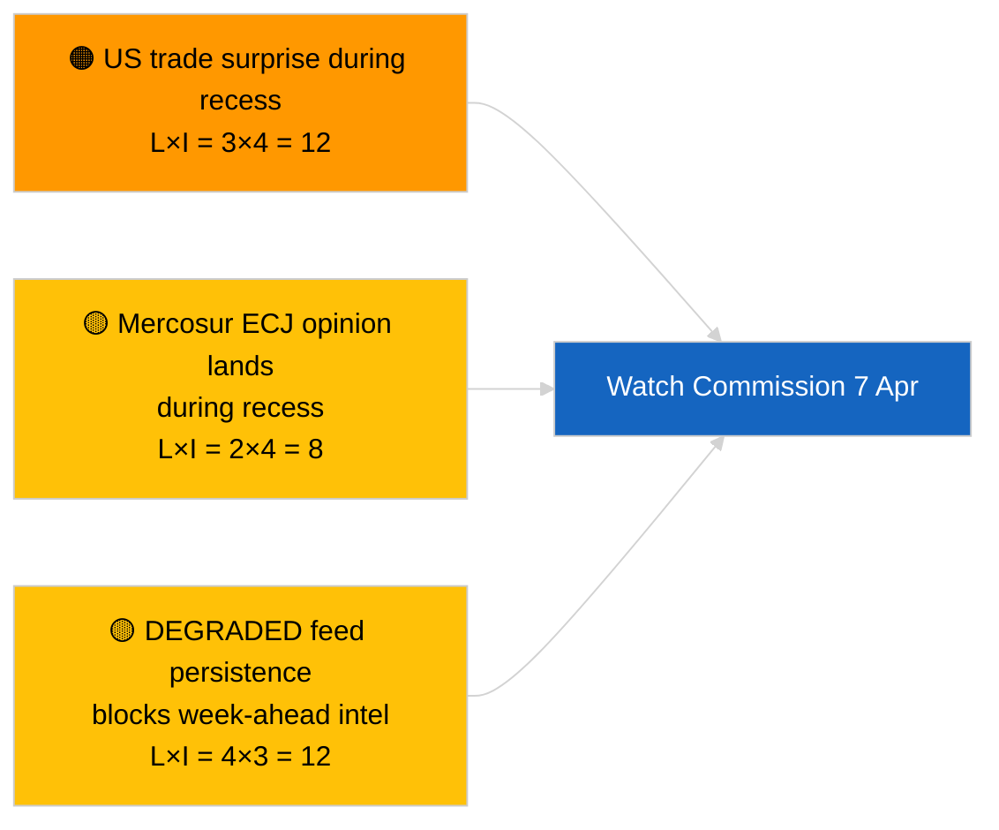

<!-- SPDX-FileCopyrightText: 2026 Hack23 AB -->
<!-- SPDX-License-Identifier: Apache-2.0 -->

# Executive Brief — Week Ahead | 2026-04-03

**Classification:** OSINT | Public Parliamentary Record
**Confidence:** 🟡 Medium (forward-looking; empty classification output limits depth)
**Generated:** 2026-04-03T00:00:00Z (retrospective brief)
**Article Type:** Week Ahead
**Run ID:** `d2e395b4-2fc9-4924-8b79-554b0453c034`
**Source:** European Parliament Open Data Portal

---

## 🎯 BLUF

**Week of 6-12 April 2026 will be a quiet Easter-recess week — no plenary, no formal committee sittings, limited Commission Tuesday activity.** Run `d2e395b4-2fc9-4924-8b79-554b0453c034` returned **"Quantitative risk scoring across 0 identified political dimensions"** with zero classified actors. The week's most notable institutional event is the Commission Tuesday meeting (7 April), the first post-Easter college tabling, which may yield new propositions or trade-response communications. EP committee work nominally resumes the following week (13-17 April). **🟡 MEDIUM confidence** on the "quiet week" projection given the DEGRADED EP-API state limits forward signal; **🟢 HIGH confidence** that no plenary or formal committee voting is scheduled.

---

## 🧭 3 Decisions This Brief Supports

| # | Decision | Who Decides | Deadline | Evidence |
|:-:|----------|-------------|:--------:|----------|
| 1 | **Editorial:** publish quiet-week outlook with Commission 7 April emphasis | Editor | +24h | Calendar + Commission cadence |
| 2 | **Monitoring:** capture Commission 7 April outputs in a dedicated probe | Analyst | 2026-04-07 | First post-Easter college tabling |
| 3 | **Forward-watch:** pre-plenary intelligence cycle begins 13 April | Analysis lead | 2026-04-13 | Committee work-week |

---

## 📰 60-Second Read

- 🔴 **No EP plenary** scheduled 6-12 April 2026; Easter Sunday 12 April. (🟢 High)
- 🟠 **Commission Tuesday 7 April 2026** is the only confirmed inter-institutional event with intelligence value. (🟢 High)
- 🟢 **0 actors classified** in this run — week-ahead synthesis is structurally underpowered. (🟢 High)
- 🟡 **DEGRADED API state** continues from 2026-04-03/breaking-2 — week-ahead probes will likely also suffer. (🟢 High)
- 🔵 **Economic context:** IMF April WEO release window aligns with the following week; fiscal-stress data may colour MFF debate during plenary. (🟢 High)
- 🟣 **Cross-reference:** see 2026-04-03/breaking, breaking-2, breaking-3 for substantive Friday content. (🟢 High)
- 🩷 **Disruption vector:** US trade announcement during Easter week could force fast-track Commission proposition. (🟡 Medium)
- ⚪ **Carry-forward:** track Polish-judiciary developments for Braun-precedent follow-on cases.

---

## 🗂️ Top Events / Triggers — Week of 6-12 April 2026

| Rank | Event | Date | Significance | Confidence |
|:----:|-------|------|:------------:|:----------:|
| 1 | Commission Tuesday meeting | 7 April | 7.0 | 🟢 HIGH |
| 2 | Easter Sunday (calendar marker) | 12 April | 3.0 | 🟢 HIGH |
| 3 | Easter Monday (recess end T-1) | 13 April | 5.0 | 🟢 HIGH |
| 4 | No EP committee sittings | week | 0.0 | 🟢 HIGH |
| 5 | No EP plenary | week | 0.0 | 🟢 HIGH |

---

## ⚠️ Risk & Threat Snapshot

| Risk | L | I | Score | Trigger | Source | Admiralty |
|------|:-:|:-:|:-----:|---------|--------|:---------:|
| US trade surprise during recess | 3 | 4 | 12 | US announcement | TA-10-2026-0096 | A1 |
| Mercosur ECJ opinion during recess | 2 | 4 | 8 | Court releases | TA-10-2026-0008 | A2 |
| DEGRADED feed persistence | 4 | 3 | 12 | Past 14 April | Sibling `breaking-2` | A1 |
| Polish-judiciary follow-on case | 3 | 3 | 9 | New investigation | TA-10-2026-0088 | A2 |

---

## 🔮 Top Forward Trigger

**Commission Tuesday meeting 7 April 2026.** First post-Easter college tabling will set the topical mix for the 27-30 April Strasbourg plenary; absence of trade or institutional-reform tabling would signal a deliberate scenario-C (economic/industrial) weighting.

---

## 🛡️ Source Quality Assessment

- **Primary sources:** Run `d2e395b4-2fc9-4924-8b79-554b0453c034`; EP calendar; Commission cadence.
- **Data limitations:** Forward inference under DEGRADED feed state; week-ahead probes will be unreliable.
- **Confidence:** 🟢 HIGH on calendar facts; 🟡 MEDIUM on event-density projection.

---

## 📎 Links

| Link | Path |
|------|------|
| Article | `./article.md` |
| Sibling runs | `analysis/daily/2026-04-03/breaking/`, `breaking-2/`, `breaking-3/`, `committee-reports/`, `motions/`, `propositions/` |
| Manifest | `./manifest.json` |

---

**Document Control**
- **Template:** `/analysis/templates/executive-brief.md`
- **Artifact path:** `analysis/daily/2026-04-03/week-ahead/executive-brief.md`
- **Classification:** Public
- **Retrospective generation:** Back-fill session.
