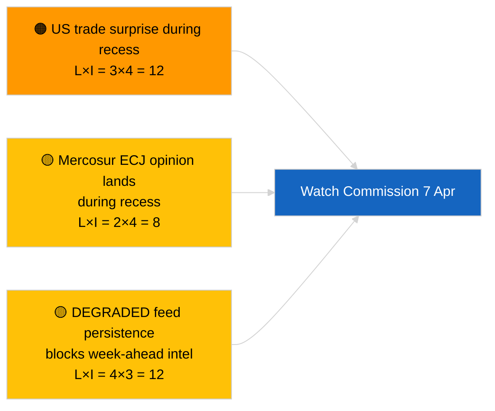

<!-- SPDX-FileCopyrightText: 2026 Hack23 AB -->
<!-- SPDX-License-Identifier: Apache-2.0 -->

# موجز تنفيذي — الأسبوع المقبل | 2026-04-03

**التصنيف:** OSINT | سجل برلماني عام
**مستوى الثقة:** 🟡 متوسط (مستقبلي؛ مخرجات التصنيف الفارغة تحدّ من العمق)
**تاريخ الإنشاء:** 2026-04-03T00:00:00Z (إحاطة بأثر رجعي)
**نوع المقال:** الأسبوع المقبل
**معرّف التشغيل:** `d2e395b4-2fc9-4924-8b79-554b0453c034`
**المصدر:** بوابة البيانات المفتوحة للبرلمان الأوروبي

---

## 🎯 BLUF

**ستكون الفترة من 6 إلى 12 أبريل 2026 أسبوع إجازة عيد الفصح الهادئ — لا جلسة عامة، ولا اجتماعات رسمية للجان، ونشاط محدود لاجتماع المفوضية الثلاثاء.** أسفر التشغيل `d2e395b4-2fc9-4924-8b79-554b0453c034` عن **«تقييم مخاطر كمّي عبر 0 بُعد سياسي محدّد»** دون أي جهات فاعلة مصنّفة. أبرز حدث مؤسسي للأسبوع هو اجتماع المفوضية الثلاثاء (7 أبريل)، أول عرض جماعي بعد عيد الفصح، والذي قد ينتج مقترحات جديدة أو بيانات للسياسة التجارية. يستأنف عمل لجان البرلمان الأوروبي رسمياً الأسبوع التالي (13–17 أبريل). **🟡 ثقة متوسطة** في توقع «الأسبوع الهادئ» نظراً للحالة المتدهورة لواجهة برمجة تطبيقات البرلمان الأوروبي التي تحدّ من الإشارة المستقبلية؛ **🟢 ثقة عالية** بأنه لم تُجدول أي جلسة عامة أو تصويت رسمي للجنة.

---

## 🧭 3 قرارات تدعمها هذه الإحاطة

| # | القرار | صاحب القرار | الموعد النهائي | الدليل |
|:-:|--------|------------|:-------------:|--------|
| 1 | **تحريري:** نشر منظور الأسبوع الهادئ مع التركيز على المفوضية في 7 أبريل | المحرر | +24 ساعة | التقويم + إيقاع المفوضية |
| 2 | **رصد:** التقاط مخرجات المفوضية في 7 أبريل في مسبار مخصص | المحلل | 2026-04-07 | أول عرض جماعي بعد عيد الفصح |
| 3 | **نظرة مستقبلية:** تبدأ دورة الاستخبارات قبل الجلسة العامة في 13 أبريل | رئيس التحليل | 2026-04-13 | أسبوع عمل اللجان |

---

## 📰 قراءة 60 ثانية

- 🔴 **لا جلسة عامة للبرلمان الأوروبي** مجدولة من 6 إلى 12 أبريل 2026؛ عيد الفصح 12 أبريل. (🟢 عالٍ)
- 🟠 **ثلاثاء المفوضية 7 أبريل 2026** هو الحدث المشترك بين المؤسسات الوحيد المؤكد ذو قيمة استخباراتية. (🟢 عالٍ)
- 🟢 **0 جهة فاعلة مصنّفة** في هذا التشغيل — تحليل الأسبوع المقبل متقصّر بنيوياً. (🟢 عالٍ)
- 🟡 **حالة واجهة برمجة التطبيقات المتدهورة** مستمرة من 2026-04-03/breaking-2 — من المرجح تأثّر مسابر الأسبوع المقبل أيضاً. (🟢 عالٍ)
- 🔵 **السياق الاقتصادي:** يتزامن نافذة نشر IMF أبريل WEO مع الأسبوع التالي؛ بيانات الضغط المالي قد تلوّن نقاش الإطار المالي متعدد السنوات خلال الجلسة العامة. (🟢 عالٍ)
- 🟣 **إسناد ترافقي:** راجع 2026-04-03/breaking وbreaking-2 وbreaking-3 للمحتوى الجوهري الجمعة. (🟢 عالٍ)
- 🩷 **متجه اضطراب:** إعلان تجاري أمريكي خلال أسبوع الفصح قد يفرض مساراً سريعاً لمقترح المفوضية. (🟡 متوسط)
- ⚪ **إحالة:** متابعة التطورات القضائية البولندية للقضايا التالية لسابقة براون.

---

## 🗂️ أبرز الأحداث / المحفّزات — أسبوع 6–12 أبريل 2026

| الترتيب | الحدث | التاريخ | الأهمية | مستوى الثقة |
|:-------:|-------|---------|:-------:|:-----------:|
| 1 | اجتماع المفوضية الثلاثاء | 7 أبريل | 7,0 | 🟢 HIGH |
| 2 | عيد الفصح (علامة تقويمية) | 12 أبريل | 3,0 | 🟢 HIGH |
| 3 | الاثنين التالي لعيد الفصح (نهاية الاستراحة ت-1) | 13 أبريل | 5,0 | 🟢 HIGH |
| 4 | لا اجتماعات للجان البرلمان الأوروبي | الأسبوع | 0,0 | 🟢 HIGH |
| 5 | لا جلسة عامة للبرلمان الأوروبي | الأسبوع | 0,0 | 🟢 HIGH |

---

## ⚠️ لمحة عن المخاطر والتهديدات

| الخطر | أ | ت | الدرجة | المحفّز | المصدر | الإدميرالية |
|-------|:-:|:-:|:------:|---------|--------|:-----------:|
| مفاجأة تجارية أمريكية أثناء الاستراحة | 3 | 4 | 12 | إعلان أمريكي | TA-10-2026-0096 | A1 |
| رأي محكمة العدل الأوروبية بشأن ميركوسور أثناء الاستراحة | 2 | 4 | 8 | منشورات قضائية | TA-10-2026-0008 | A2 |
| استمرار تدهور التغذية | 4 | 3 | 12 | بعد 14 أبريل | التشغيل الشقيق `breaking-2` | A1 |
| قضية متابعة قضائية بولندية | 3 | 3 | 9 | تحقيق جديد | TA-10-2026-0088 | A2 |

---

## 🔮 أبرز المحفّزات المستقبلية

**اجتماع المفوضية الثلاثاء 7 أبريل 2026.** سيحدد أول عرض جماعي بعد عيد الفصح التوليفة الموضوعية للجلسة العامة في ستراسبورغ في الفترة 27–30 أبريل؛ غياب عرض التجارة أو الإصلاح المؤسسي سيُشير إلى ترجيح متعمّد للسيناريو ج (الاقتصادي/الصناعي).

---

## 🛡️ تقييم جودة المصادر

- **المصادر الأولية:** التشغيل `d2e395b4-2fc9-4924-8b79-554b0453c034`؛ تقويم البرلمان الأوروبي؛ إيقاع المفوضية.
- **قيود البيانات:** استدلال مستقبلي في ظل حالة التغذية المتدهورة؛ مسابر الأسبوع المقبل ستكون غير موثوقة.
- **مستوى الثقة:** 🟢 عالٍ للحقائق التقويمية؛ 🟡 متوسط لتوقعات كثافة الأحداث.

---

## 📎 روابط

| الرابط | المسار |
|--------|--------|
| المقال | `./article.md` |
| التشغيلات الشقيقة | `analysis/daily/2026-04-03/breaking/`، `breaking-2/`، `breaking-3/`، `committee-reports/`، `motions/`، `propositions/` |
| البيان | `./manifest.json` |

---

**إدارة الوثيقة**
- **القالب:** `/analysis/templates/executive-brief.md`
- **مسار الأثر:** `analysis/daily/2026-04-03/week-ahead/executive-brief.md`
- **التصنيف:** عام
- **الإنشاء بأثر رجعي:** جلسة إعادة التعبئة.
