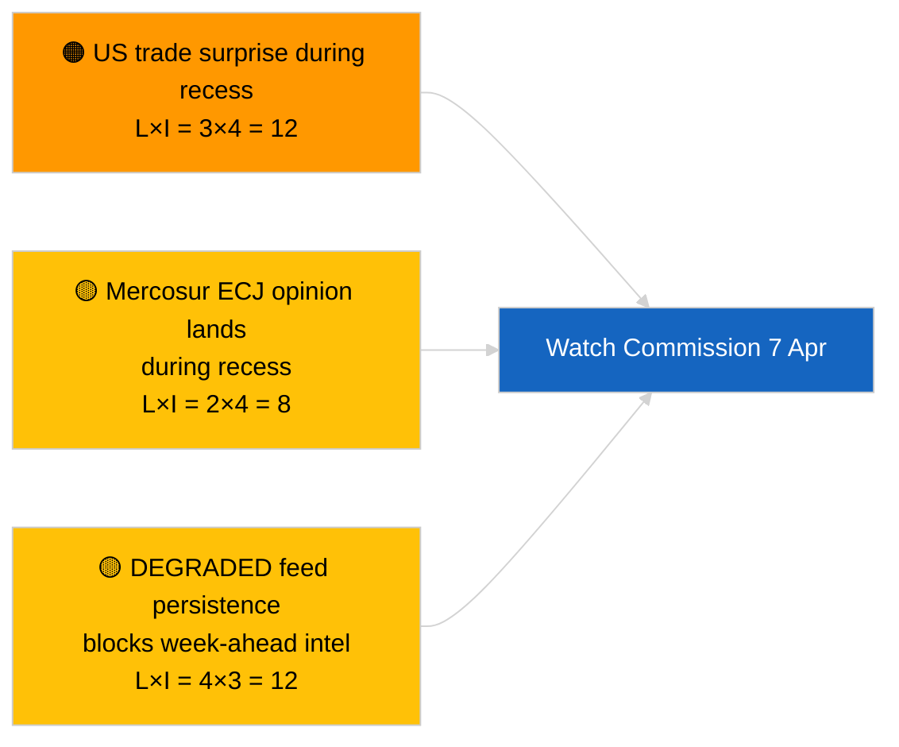

<!-- SPDX-FileCopyrightText: 2026 Hack23 AB -->
<!-- SPDX-License-Identifier: Apache-2.0 -->

# Executive Briefing — Ugen Fremad | 2026-04-03

**Klassifikation:** OSINT | Offentligt parlamentarisk register
**Troværdighed:** 🟡 Medium (fremadrettet; tom klassifikationsoutput begrænser dybden)
**Genereret:** 2026-04-03T00:00:00Z (retrospektiv briefing)
**Artikeltype:** Ugen Fremad
**Kørsel-ID:** `d2e395b4-2fc9-4924-8b79-554b0453c034`
**Kilde:** Europa-Parlamentets Åbne Dataportal

---

## 🎯 BLUF

**Ugen 6.–12. april 2026 vil være en rolig påskeuge — ingen plenarsession, ingen formelle udvalgssamlinger, begrænset Kommissions tirsdagsaktivitet.** Kørsel `d2e395b4-2fc9-4924-8b79-554b0453c034` returnerede **«Kvantitativ risikoscoring over 0 identificerede politiske dimensioner»** uden klassificerede aktører. Ugens mest bemærkelsesværdige institutionelle begivenhed er Kommissionens tirsdagsmøde (7. april), den første kollegiepræsentation efter påske, som kan give nye forslag eller handelspolitiske kommunikéer. EP's udvalgsarbejde genoptages nominelt i den følgende uge (13.–17. april). **🟡 MEDIUM troværdighed** i prognosen om «rolig uge» grundet den DEGRADEREDE EP-API-tilstand der begrænser fremadrettet signal; **🟢 HØJ troværdighed** om, at ingen plenarsession eller formel udvalgsafstemning er planlagt.

---

## 🧭 3 Beslutninger som denne briefing understøtter

| # | Beslutning | Hvem beslutter | Deadline | Bevis |
|:-:|-----------|---------------|:--------:|-------|
| 1 | **Redaktionelt:** offentliggør rolig-uge-perspektiv med fokus på Kommissionen 7. april | Redaktør | +24h | Kalender + Kommissionens kadence |
| 2 | **Overvågning:** registrer Kommissionens 7. april-output i en dedikeret sonde | Analytiker | 2026-04-07 | Første post-påske kollegiepræsentation |
| 3 | **Fremadrettet:** pre-plenar efterretningscyklus begynder 13. april | Analyseleder | 2026-04-13 | Udvalgsarbejdsuge |

---

## 📰 60-Second Read

- 🔴 **Ingen EP-plenarsession** planlagt 6.–12. april 2026; Påskedag 12. april. (🟢 Høj)
- 🟠 **Kommissionens tirsdag 7. april 2026** er den eneste bekræftede inter-institutionelle begivenhed med efterretningsværdi. (🟢 Høj)
- 🟢 **0 aktører klassificeret** i denne kørsel — uge-fremad-syntese er strukturelt underforsynet. (🟢 Høj)
- 🟡 **DEGRADERET API-tilstand** fortsætter fra 2026-04-03/breaking-2 — uge-fremad-sonder vil sandsynligvis også blive påvirket. (🟢 Høj)
- 🔵 **Økonomisk kontekst:** IMF april WEO-publikationsvindue overlapper næste uge; finansielle stressdata kan farve MFF-debatten under plenarsessionen. (🟢 Høj)
- 🟣 **Krydsreference:** se 2026-04-03/breaking, breaking-2, breaking-3 for substantielt fredagsindhold. (🟢 Høj)
- 🩷 **Forstyrrelsesvektор:** en amerikansk handelsmeddelelse i påskeugen kan tvinge et hasteraceproces Kommissionsforslag. (🟡 Medium)
- ⚪ **Videregivelse:** følg polske retsudviklinger for opfølgningssager i Braun-præcedensretssagen.

---

## 🗂️ Topbegivenheder / Triggers — Ugen 6.–12. april 2026

| Rang | Begivenhed | Dato | Vigtighed | Troværdighed |
|:----:|-----------|------|:---------:|:------------:|
| 1 | Kommissionens tirsdagsmøde | 7. april | 7,0 | 🟢 HIGH |
| 2 | Påskedag (kalendermarkering) | 12. april | 3,0 | 🟢 HIGH |
| 3 | 2. påskedag (recesseslut T-1) | 13. april | 5,0 | 🟢 HIGH |
| 4 | Ingen EP-udvalgssamlinger | uge | 0,0 | 🟢 HIGH |
| 5 | Ingen EP-plenarsession | uge | 0,0 | 🟢 HIGH |

---

## ⚠️ Risiko- og Truseloveroversigt

| Risiko | S | I | Score | Trigger | Kilde | Admiralitet |
|--------|:-:|:-:|:-----:|---------|-------|:-----------:|
| Amerikansk handelsoverraskelse under recess | 3 | 4 | 12 | Amerikansk annonce | TA-10-2026-0096 | A1 |
| Mercosur EU-Domstolsudtalelse under recess | 2 | 4 | 8 | Retslige publikationer | TA-10-2026-0008 | A2 |
| DEGRADERET feedpersistens | 4 | 3 | 12 | Efter 14. april | Søskenkørsel `breaking-2` | A1 |
| Polsk retslig opfølgningssag | 3 | 3 | 9 | Ny undersøgelse | TA-10-2026-0088 | A2 |

---

## 🔮 Vigtigste Fremadrettede Trigger

**Kommissionens tirsdagsmøde 7. april 2026.** Den første post-påske kollegiepræsentation sætter den tematiske sammensætning for Strasbourg-plenarsessionen 27.–30. april; fraværet af handels- eller institutionel reformpræsentation ville signalere en bevidst scenarie C-vægtning (økonomisk/industriel).

---

## 🛡️ Vurdering af Kildekvalitet

- **Primærkilder:** Kørsel `d2e395b4-2fc9-4924-8b79-554b0453c034`; EP-kalender; Kommissionens kadence.
- **Databegrænsninger:** Fremadrettet slutning under DEGRADERET feedtilstand; uge-fremad-sonder vil være upålidelige.
- **Troværdighed:** 🟢 HØJ for kalenderfakta; 🟡 MEDIUM for begivenhedstætheds-prognose.

---

## 📎 Links

| Link | Sti |
|------|-----|
| Artikel | `./article.md` |
| Søskenkørsler | `analysis/daily/2026-04-03/breaking/`, `breaking-2/`, `breaking-3/`, `committee-reports/`, `motions/`, `propositions/` |
| Manifest | `./manifest.json` |

---

**Dokumentkontrol**
- **Skabelon:** `/analysis/templates/executive-brief.md`
- **Artefaktsti:** `analysis/daily/2026-04-03/week-ahead/executive-brief.md`
- **Klassifikation:** Offentlig
- **Retrospektiv generering:** Back-fill-session.
