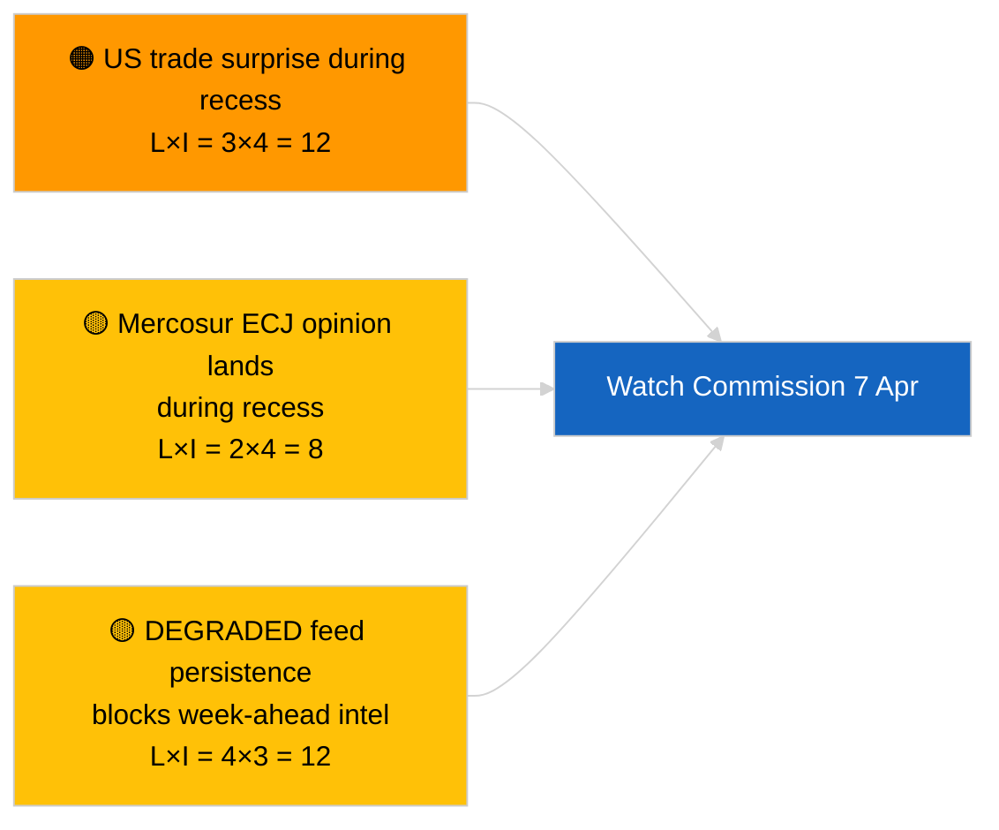

<!-- SPDX-FileCopyrightText: 2026 Hack23 AB -->
<!-- SPDX-License-Identifier: Apache-2.0 -->

# Führungsbriefing — Woche voraus | 2026-04-03

**Klassifizierung:** OSINT | Öffentlicher parlamentarischer Bericht
**Vertrauen:** 🟡 Mittel (zukunftsgerichtet; leere Klassifizierungsausgabe begrenzt die Tiefe)
**Erstellt:** 2026-04-03T00:00:00Z (retrospektives Briefing)
**Artikeltyp:** Woche voraus
**Lauf-ID:** `d2e395b4-2fc9-4924-8b79-554b0453c034`
**Quelle:** Europäisches Parlament — Offenes Datenportal

---

## 🎯 BLUF

**Die Woche vom 6.–12. April 2026 wird eine ruhige Osterferienwochen sein — kein Plenum, keine formellen Ausschusssitzungen, begrenzte Kommissionsdienstag-Aktivität.** Lauf `d2e395b4-2fc9-4924-8b79-554b0453c034` lieferte **„Quantitative Risikobewertung über 0 identifizierte politische Dimensionen"** ohne klassifizierte Akteure. Das bemerkenswerteste institutionelle Ereignis der Woche ist die Kommissionsdienstag-Sitzung (7. April), die erste Kollegiumstagesordnung nach Ostern, die neue Vorschläge oder handelspolitische Kommuniqués ergeben kann. Die EP-Ausschussarbeit nimmt nominell in der folgenden Woche (13.–17. April) wieder auf. **🟡 MITTLERES Vertrauen** in die „ruhige Woche"-Projektion aufgrund des DEGRADIERTEN EP-API-Zustands, der das Vorwärtssignal begrenzt; **🟢 HOHES Vertrauen**, dass kein Plenum oder formelle Ausschussabstimmung geplant ist.

---

## 🧭 3 Entscheidungen, die dieses Briefing unterstützt

| # | Entscheidung | Wer entscheidet | Frist | Nachweise |
|:-:|--------------|-----------------|:-----:|-----------|
| 1 | **Redaktionell:** ruhige Wochenprognose mit Schwerpunkt Kommission 7. April veröffentlichen | Redakteur | +24h | Kalender + Kommissionskadenz |
| 2 | **Monitoring:** Kommissionsausgaben vom 7. April in einem dedizierten Probe erfassen | Analyst | 2026-04-07 | Erste Kollegiumstagesordnung nach Ostern |
| 3 | **Vorwärtsbeobachtung:** Pre-Plenum-Geheimdienstzyklus beginnt 13. April | Analyseleiter | 2026-04-13 | Ausschussarbeitswoche |

---

## 📰 60-Second Read

- 🔴 **Kein EP-Plenum** geplant für 6.–12. April 2026; Ostersonntag 12. April. (🟢 Hoch)
- 🟠 **Kommissionsdienstag 7. April 2026** ist das einzige bestätigte interinstitutionelle Ereignis mit Geheimdienstwert. (🟢 Hoch)
- 🟢 **0 Akteure klassifiziert** in diesem Lauf — Woche-voraus-Synthese ist strukturell unterversorgt. (🟢 Hoch)
- 🟡 **DEGRADIERTER API-Zustand** setzt sich fort von 2026-04-03/breaking-2 — Woche-voraus-Probes werden wahrscheinlich ebenfalls leiden. (🟢 Hoch)
- 🔵 **Wirtschaftlicher Kontext:** IMF April WEO-Veröffentlichungsfenster deckt sich mit der folgenden Woche; fiskalische Stressdaten könnten die MHR-Debatte während des Plenums beeinflussen. (🟢 Hoch)
- 🟣 **Querverweis:** Siehe 2026-04-03/breaking, breaking-2, breaking-3 für substantiellen Freitagsinhalt. (🟢 Hoch)
- 🩷 **Störungsvektor:** US-Handelsankündigung während der Osterwoche könnte eine schnelle Kommissionsinitiative erzwingen. (🟡 Mittel)
- ⚪ **Weiterführend:** Polnische Justizentwicklungen für Braun-Präzedenzfall-Folgefälle verfolgen.

---

## 🗂️ Top-Ereignisse / Auslöser — Woche vom 6.–12. April 2026

| Rang | Ereignis | Datum | Bedeutung | Vertrauen |
|:----:|----------|-------|:---------:|:---------:|
| 1 | Kommissionsdienstag-Sitzung | 7. April | 7,0 | 🟢 HIGH |
| 2 | Ostersonntag (Kalendermarkierung) | 12. April | 3,0 | 🟢 HIGH |
| 3 | Ostermontag (Recessende T-1) | 13. April | 5,0 | 🟢 HIGH |
| 4 | Keine EP-Ausschusssitzungen | Woche | 0,0 | 🟢 HIGH |
| 5 | Kein EP-Plenum | Woche | 0,0 | 🟢 HIGH |

---

## ⚠️ Risiko- und Bedrohungsüberblick

| Risiko | W | A | Wert | Auslöser | Quelle | Admiralität |
|--------|:-:|:-:|:----:|---------|--------|:-----------:|
| US-Handelsüberraschung während Recess | 3 | 4 | 12 | US-Ankündigung | TA-10-2026-0096 | A1 |
| Mercosur-EuGH-Gutachten während Recess | 2 | 4 | 8 | Gerichtsveröffentlichungen | TA-10-2026-0008 | A2 |
| DEGRADIERTER Feed-Fortbestand | 4 | 3 | 12 | Vergangenheit 14. April | Geschwister `breaking-2` | A1 |
| Polnischer Justiz-Folgefall | 3 | 3 | 9 | Neue Untersuchung | TA-10-2026-0088 | A2 |

---

## 🔮 Wichtigster Vorwärtsauslöser

**Kommissionsdienstag-Sitzung 7. April 2026.** Die erste Kollegiumstagesordnung nach Ostern wird die thematische Mischung für das Straßburger Plenum vom 27.–30. April festlegen; das Ausbleiben von Handels- oder institutionellen Reformtagesordnungspunkten würde eine bewusste Szenario-C-Gewichtung (wirtschaftlich/industriell) signalisieren.

---

## 🛡️ Quellenqualitätsbewertung

- **Primärquellen:** Lauf `d2e395b4-2fc9-4924-8b79-554b0453c034`; EP-Kalender; Kommissionskadenz.
- **Datenbeschränkungen:** Vorwärtsschlussfolgerung bei DEGRADIERTEM Feed-Zustand; Woche-voraus-Probes werden unzuverlässig sein.
- **Vertrauen:** 🟢 HOCH bei Kalenderangaben; 🟡 MITTEL bei Ereignisdichte-Projektion.

---

## 📎 Links

| Link | Pfad |
|------|------|
| Artikel | `./article.md` |
| Geschwisterläufe | `analysis/daily/2026-04-03/breaking/`, `breaking-2/`, `breaking-3/`, `committee-reports/`, `motions/`, `propositions/` |
| Manifest | `./manifest.json` |

---

**Dokumentenkontrolle**
- **Vorlage:** `/analysis/templates/executive-brief.md`
- **Artefaktpfad:** `analysis/daily/2026-04-03/week-ahead/executive-brief.md`
- **Klassifizierung:** Öffentlich
- **Retrospektive Erstellung:** Back-fill-Sitzung.
