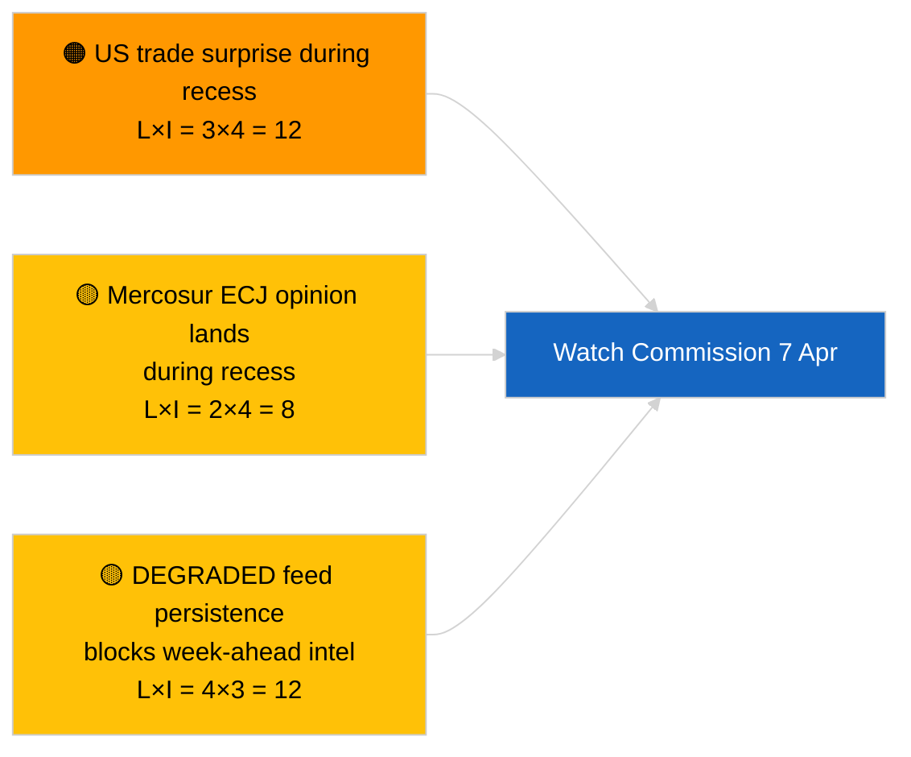

<!-- SPDX-FileCopyrightText: 2026 Hack23 AB -->
<!-- SPDX-License-Identifier: Apache-2.0 -->

# Resumen Ejecutivo — Semana por Delante | 2026-04-03

**Clasificación:** OSINT | Registro parlamentario público
**Confianza:** 🟡 Media (prospectivo; la salida de clasificación vacía limita la profundidad)
**Generado:** 2026-04-03T00:00:00Z (resumen retrospectivo)
**Tipo de artículo:** Semana por Delante
**ID de ejecución:** `d2e395b4-2fc9-4924-8b79-554b0453c034`
**Fuente:** Portal de Datos Abiertos del Parlamento Europeo

---

## 🎯 BLUF

**La semana del 6 al 12 de abril de 2026 será una semana tranquila de vacaciones de Semana Santa — sin sesión plenaria, sin reuniones formales de comité, actividad limitada del martes de la Comisión.** La ejecución `d2e395b4-2fc9-4924-8b79-554b0453c034` devolvió **«Puntuación cuantitativa de riesgo en 0 dimensiones políticas identificadas»** con cero actores clasificados. El evento institucional más notable de la semana es la reunión del martes de la Comisión (7 de abril), la primera presentación del colegio tras Semana Santa, que puede producir nuevas propuestas o comunicaciones de respuesta comercial. El trabajo de las comisiones del PE se reanuda nominalmente la semana siguiente (13–17 de abril). **🟡 CONFIANZA MEDIA** en la proyección de «semana tranquila» dado que el estado DEGRADADO de la API del PE limita la señal prospectiva; **🟢 ALTA CONFIANZA** en que no hay sesión plenaria ni votación formal de comité programada.

---

## 🧭 3 Decisiones que apoya este resumen

| # | Decisión | Quién decide | Plazo | Evidencia |
|:-:|----------|--------------|:-----:|-----------|
| 1 | **Editorial:** publicar perspectiva semana tranquila con énfasis en la Comisión del 7 de abril | Editor | +24h | Calendario + cadencia de la Comisión |
| 2 | **Monitoreo:** capturar las salidas de la Comisión del 7 de abril en una sonda dedicada | Analista | 2026-04-07 | Primera presentación del colegio post-Semana Santa |
| 3 | **Vigilancia prospectiva:** el ciclo de inteligencia pre-plenaria comienza el 13 de abril | Responsable de análisis | 2026-04-13 | Semana de trabajo de comités |

---

## 📰 60-Second Read

- 🔴 **Sin sesión plenaria del PE** programada del 6 al 12 de abril de 2026; Domingo de Pascua el 12 de abril. (🟢 Alta)
- 🟠 **Martes de la Comisión 7 de abril de 2026** es el único evento interinstitucional confirmado con valor de inteligencia. (🟢 Alta)
- 🟢 **0 actores clasificados** en esta ejecución — la síntesis semana por delante está estructuralmente subabastecida. (🟢 Alta)
- 🟡 **Estado DEGRADADO de la API** continúa desde 2026-04-03/breaking-2 — las sondas de semana por delante también sufrirán probablemente. (🟢 Alta)
- 🔵 **Contexto económico:** la ventana de publicación IMF April WEO se alinea con la semana siguiente; los datos de tensión fiscal podrían influir en el debate del MFF durante el plenario. (🟢 Alta)
- 🟣 **Referencia cruzada:** ver 2026-04-03/breaking, breaking-2, breaking-3 para contenido sustancial del viernes. (🟢 Alta)
- 🩷 **Vector de disrupción:** un anuncio comercial de EE. UU. durante la semana de Semana Santa podría forzar una propuesta de la Comisión en tramitación acelerada. (🟡 Media)
- ⚪ **Traslado:** seguir los desarrollos de la justicia polaca para casos de seguimiento del precedente Braun.

---

## 🗂️ Principales Eventos / Desencadenantes — Semana del 6–12 de abril de 2026

| Rango | Evento | Fecha | Importancia | Confianza |
|:-----:|--------|-------|:-----------:|:---------:|
| 1 | Reunión del martes de la Comisión | 7 de abril | 7,0 | 🟢 HIGH |
| 2 | Domingo de Pascua (marcador de calendario) | 12 de abril | 3,0 | 🟢 HIGH |
| 3 | Lunes de Pascua (fin del receso T-1) | 13 de abril | 5,0 | 🟢 HIGH |
| 4 | Sin reuniones de comités del PE | semana | 0,0 | 🟢 HIGH |
| 5 | Sin sesión plenaria del PE | semana | 0,0 | 🟢 HIGH |

---

## ⚠️ Instantánea de Riesgos y Amenazas

| Riesgo | V | I | Puntuación | Desencadenante | Fuente | Almirantazgo |
|--------|:-:|:-:|:----------:|----------------|--------|:------------:|
| Sorpresa comercial de EE. UU. durante el receso | 3 | 4 | 12 | Anuncio de EE. UU. | TA-10-2026-0096 | A1 |
| Opinión del TJUE sobre Mercosur durante el receso | 2 | 4 | 8 | Publicaciones del tribunal | TA-10-2026-0008 | A2 |
| Persistencia del feed DEGRADADO | 4 | 3 | 12 | Pasado el 14 de abril | Hermano `breaking-2` | A1 |
| Caso de seguimiento judicial polaco | 3 | 3 | 9 | Nueva investigación | TA-10-2026-0088 | A2 |

---

## 🔮 Principal Desencadenante Prospectivo

**Reunión del martes de la Comisión el 7 de abril de 2026.** La primera presentación del colegio tras la Semana Santa establecerá la combinación temática del plenario de Estrasburgo del 27–30 de abril; la ausencia de una presentación de reforma comercial o institucional señalaría una ponderación deliberada de escenario C (económico/industrial).

---

## 🛡️ Evaluación de la Calidad de las Fuentes

- **Fuentes primarias:** Ejecución `d2e395b4-2fc9-4924-8b79-554b0453c034`; calendario del PE; cadencia de la Comisión.
- **Limitaciones de datos:** Inferencia prospectiva bajo estado DEGRADADO del feed; las sondas de semana por delante serán poco fiables.
- **Confianza:** 🟢 ALTA en los hechos del calendario; 🟡 MEDIA en la proyección de densidad de eventos.

---

## 📎 Enlaces

| Enlace | Ruta |
|--------|------|
| Artículo | `./article.md` |
| Ejecuciones hermanas | `analysis/daily/2026-04-03/breaking/`, `breaking-2/`, `breaking-3/`, `committee-reports/`, `motions/`, `propositions/` |
| Manifiesto | `./manifest.json` |

---

**Control del documento**
- **Plantilla:** `/analysis/templates/executive-brief.md`
- **Ruta del artefacto:** `analysis/daily/2026-04-03/week-ahead/executive-brief.md`
- **Clasificación:** Público
- **Generación retrospectiva:** Sesión de relleno.
