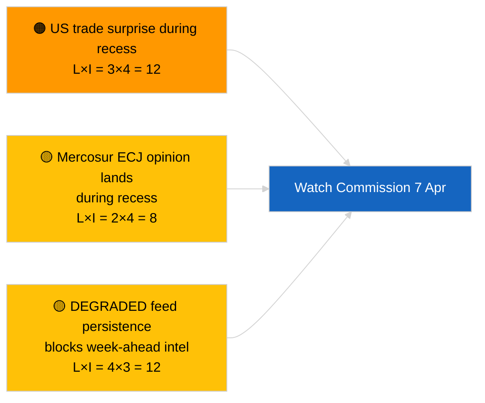

<!-- SPDX-FileCopyrightText: 2026 Hack23 AB -->
<!-- SPDX-License-Identifier: Apache-2.0 -->

# Toimeenpaneva Tiedote — Tuleva Viikko | 2026-04-03

**Luokittelu:** OSINT | Julkinen parlamentaarinen rekisteri
**Luotettavuus:** 🟡 Keskitaso (tulevaisuuteen suuntautuva; tyhjä luokittelutuloste rajoittaa syvyyttä)
**Luotu:** 2026-04-03T00:00:00Z (takautuva tiedote)
**Artikkelityyppi:** Tuleva Viikko
**Ajoajon tunnus:** `d2e395b4-2fc9-4924-8b79-554b0453c034`
**Lähde:** Euroopan parlamentin avoin dataporttaali

---

## 🎯 BLUF

**Viikko 6.–12. huhtikuuta 2026 on rauhallinen pääsiäistauko — ei täysistuntoa, ei virallisia valiokuntaistuntoja, rajallinen komission tiistaitoiminta.** Ajo `d2e395b4-2fc9-4924-8b79-554b0453c034` palautti **«Kvantitatiivinen riskipisteytys 0 tunnistetun poliittisen dimension yli»** ilman luokiteltuja toimijoita. Viikon merkittävin institutionaalinen tapahtuma on komission tiistaikokous (7. huhtikuuta), ensimmäinen pääsiäisen jälkeinen kollegioesittely, joka voi tuottaa uusia ehdotuksia tai kauppapolitiikan tiedonantoja. EP:n valiokuntatyö palaa nimellisesti seuraavalla viikolla (13.–17. huhtikuuta). **🟡 KESKITASO luotettavuus** «rauhallinen viikko» -ennusteessa huomioiden HEIKENTYNYT EP-API-tila, joka rajoittaa eteenpäin suuntautuvaa signaalia; **🟢 KORKEA luotettavuus** siitä, ettei täysistuntoa tai virallista valiokuntaäänestystä ole suunniteltu.

---

## 🧭 3 Päätöstä, joita tämä tiedote tukee

| # | Päätös | Kuka päättää | Määräaika | Todisteet |
|:-:|--------|-------------|:---------:|-----------|
| 1 | **Toimituksellinen:** julkaise rauhallinen-viikko-näkökulma painottaen komissiota 7. huhtikuuta | Toimittaja | +24h | Kalenteri + komission kadenssi |
| 2 | **Seuranta:** tallenna komission 7. huhtikuuta -tuloste omistettuun koettimeen | Analyytikko | 2026-04-07 | Ensimmäinen pääsiäisen jälkeinen kollegioesittely |
| 3 | **Tulevaisuuteen:** täysistuntoa edeltävä tiedustelukierto alkaa 13. huhtikuuta | Analyysipäällikkö | 2026-04-13 | Valiokuntatyöviikko |

---

## 📰 60-Second Read

- 🔴 **Ei EP-täysistuntoa** 6.–12. huhtikuuta 2026; Pääsiäispäivä 12. huhtikuuta. (🟢 Korkea)
- 🟠 **Komission tiistai 7. huhtikuuta 2026** on ainoa vahvistettu toimielinten välinen tapahtuma, jolla on tiedusteluarvoa. (🟢 Korkea)
- 🟢 **0 toimijaa luokiteltu** tässä ajossa — tulevaa-viikkoa-synteesi on rakenteellisesti alitarjottu. (🟢 Korkea)
- 🟡 **HEIKENTYNYT API-tila** jatkuu 2026-04-03/breaking-2:sta — tulevaa-viikkoa-koettimet todennäköisesti kärsivät myös. (🟢 Korkea)
- 🔵 **Taloudellinen konteksti:** IMF huhtikuun WEO-julkaisuikkuna osuu ensi viikkoon; finanssiset stressitiedot voivat värittää MKK-debattia täysistunnossa. (🟢 Korkea)
- 🟣 **Ristiriittaviittaus:** katso 2026-04-03/breaking, breaking-2, breaking-3 substantiiviselle perjantaisisällölle. (🟢 Korkea)
- 🩷 **Häirintävektori:** amerikkalainen kauppailmoitus pääsiäisviikolla voi pakottaa nopeutettun komission ehdotuksen. (🟡 Keskitaso)
- ⚪ **Siirto:** seuraa puolalaisia oikeudellisia kehityksiä Braun-ennakkotapauksen jatkosyytteiden varalta.

---

## 🗂️ Tärkeimmät tapahtumat / Liipaisimet — Viikko 6.–12. huhtikuuta 2026

| Sija | Tapahtuma | Päivämäärä | Tärkeys | Luotettavuus |
|:----:|----------|-----------|:-------:|:------------:|
| 1 | Komission tiistaikokous | 7. huhtikuuta | 7,0 | 🟢 HIGH |
| 2 | Pääsiäispäivä (kalenterimerkintä) | 12. huhtikuuta | 3,0 | 🟢 HIGH |
| 3 | 2. pääsiäispäivä (taukon loppu T-1) | 13. huhtikuuta | 5,0 | 🟢 HIGH |
| 4 | Ei EP-valiokuntaistuntoja | viikko | 0,0 | 🟢 HIGH |
| 5 | Ei EP-täysistuntoa | viikko | 0,0 | 🟢 HIGH |

---

## ⚠️ Riski- ja Uhkakatsaus

| Riski | T | V | Pisteet | Liipaisu | Lähde | Amiraliteetti |
|-------|:-:|:-:|:-------:|---------|-------|:-------------:|
| Amerikkalainen kauppayllätys tauon aikana | 3 | 4 | 12 | Amerikkalainen ilmoitus | TA-10-2026-0096 | A1 |
| Mercosur EU-tuomioistuimen lausunto tauon aikana | 2 | 4 | 8 | Oikeudelliset julkaisut | TA-10-2026-0008 | A2 |
| HEIKENTYNYT syöttö-jatkuvuus | 4 | 3 | 12 | 14. huhtikuuta jälkeen | Sisarusajo `breaking-2` | A1 |
| Puolalainen oikeudellinen jatkosyyte | 3 | 3 | 9 | Uusi tutkinta | TA-10-2026-0088 | A2 |

---

## 🔮 Tärkein Tulevaisuuteen Suuntautuva Liipaisu

**Komission tiistaikokous 7. huhtikuuta 2026.** Ensimmäinen pääsiäisen jälkeinen kollegioesittely asettaa temaattisen seoksen Strasbourgin täysistunnolle 27.–30. huhtikuuta; kaupan tai institutionaalisen uudistuksen esittelyn puuttuminen signaloisi tarkoituksellista skenaario C -painotusta (taloudellinen/teollinen).

---

## 🛡️ Lähdekvaliteetin Arviointi

- **Ensisijaiset lähteet:** Ajo `d2e395b4-2fc9-4924-8b79-554b0453c034`; EP:n kalenteri; komission kadenssi.
- **Tietorajoitukset:** Eteenpäin suuntautuva päättely HEIKENTYNEESSÄ syöttötilassa; tulevaa-viikkoa-koettimet ovat epäluotettavia.
- **Luotettavuus:** 🟢 KORKEA kalenterifaktojen osalta; 🟡 KESKITASO tapahtumatiheyden ennusteessa.

---

## 📎 Linkit

| Linkki | Polku |
|--------|-------|
| Artikkeli | `./article.md` |
| Sisarusajot | `analysis/daily/2026-04-03/breaking/`, `breaking-2/`, `breaking-3/`, `committee-reports/`, `motions/`, `propositions/` |
| Manifesti | `./manifest.json` |

---

**Asiakirjahallinta**
- **Malli:** `/analysis/templates/executive-brief.md`
- **Artefaktipolku:** `analysis/daily/2026-04-03/week-ahead/executive-brief.md`
- **Luokittelu:** Julkinen
- **Takautuva luonti:** Takautuvantäytön istunto.
