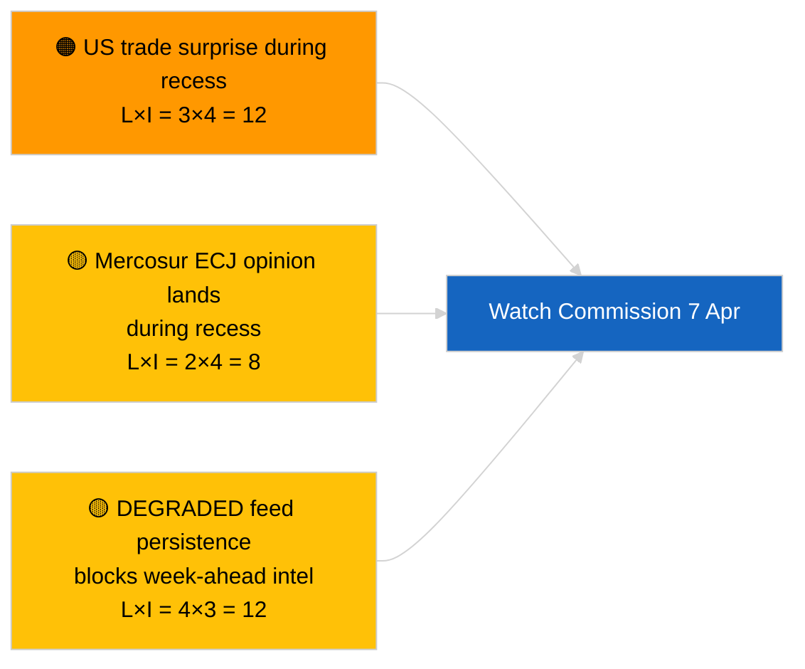

<!-- SPDX-FileCopyrightText: 2026 Hack23 AB -->
<!-- SPDX-License-Identifier: Apache-2.0 -->

# Note de synthèse — Semaine à venir | 2026-04-03

**Classification :** OSINT | Document parlementaire public
**Confiance :** 🟡 Moyenne (prospectif ; résultats de classification vides limitent la profondeur)
**Générée :** 2026-04-03T00:00:00Z (note rétrospective)
**Type d'article :** Semaine à venir
**ID d'exécution :** `d2e395b4-2fc9-4924-8b79-554b0453c034`
**Source :** Portail de données ouvertes du Parlement européen

---

## 🎯 BLUF

**La semaine du 6 au 12 avril 2026 sera une semaine calme de vacances de Pâques — aucune session plénière, aucune réunion formelle de commission, activité limitée de la Commission mardi.** L'exécution `d2e395b4-2fc9-4924-8b79-554b0453c034` a retourné **« Notation quantitative des risques sur 0 dimensions politiques identifiées »** sans acteurs classifiés. L'événement institutionnel le plus notable de la semaine est la réunion de la Commission mardi (7 avril), le premier collège tabulé après Pâques, susceptible de produire de nouvelles propositions ou communications commerciales. Les travaux des commissions du PE reprennent nominalement la semaine suivante (13–17 avril). **🟡 CONFIANCE MOYENNE** dans la projection « semaine calme » étant donné que l'état DÉGRADÉ de l'API du PE limite le signal prospectif ; **🟢 HAUTE CONFIANCE** qu'aucune session plénière ni vote formel de commission n'est planifié.

---

## 🧭 3 Décisions que cette note soutient

| # | Décision | Qui décide | Échéance | Éléments de preuve |
|:-:|----------|------------|:--------:|-------------------|
| 1 | **Éditorial :** publier la perspective semaine calme en soulignant la Commission du 7 avril | Rédacteur | +24h | Calendrier + cadence Commission |
| 2 | **Surveillance :** capturer les productions de la Commission du 7 avril dans une sonde dédiée | Analyste | 2026-04-07 | Premier collège tabulé post-Pâques |
| 3 | **Veille prospective :** le cycle de renseignement pré-plénière commence le 13 avril | Responsable analyse | 2026-04-13 | Semaine de travail des commissions |

---

## 📰 60-Second Read

- 🔴 **Aucune session plénière du PE** prévue du 6 au 12 avril 2026 ; dimanche de Pâques le 12 avril. (🟢 Élevée)
- 🟠 **Commission mardi 7 avril 2026** est le seul événement inter-institutionnel confirmé avec valeur de renseignement. (🟢 Élevée)
- 🟢 **0 acteurs classifiés** dans cette exécution — la synthèse semaine à venir est structurellement sous-alimentée. (🟢 Élevée)
- 🟡 **État DÉGRADÉ de l'API** se poursuit depuis 2026-04-03/breaking-2 — les sondes semaine à venir souffriront probablement aussi. (🟢 Élevée)
- 🔵 **Contexte économique :** la fenêtre de publication IMF April WEO s'aligne sur la semaine suivante ; les données de tension budgétaire pourraient influencer le débat sur le MFF lors de la session plénière. (🟢 Élevée)
- 🟣 **Référence croisée :** voir 2026-04-03/breaking, breaking-2, breaking-3 pour le contenu substantiel du vendredi. (🟢 Élevée)
- 🩷 **Vecteur de perturbation :** une annonce commerciale américaine pendant la semaine de Pâques pourrait forcer une proposition en procédure accélérée de la Commission. (🟡 Moyenne)
- ⚪ **Report :** suivre les développements de la justice polonaise pour les affaires de suivi du précédent Braun.

---

## 🗂️ Principaux événements / déclencheurs — Semaine du 6–12 avril 2026

| Rang | Événement | Date | Importance | Confiance |
|:----:|-----------|------|:----------:|:---------:|
| 1 | Réunion de la Commission mardi | 7 avril | 7,0 | 🟢 HIGH |
| 2 | Dimanche de Pâques (marqueur calendaire) | 12 avril | 3,0 | 🟢 HIGH |
| 3 | Lundi de Pâques (fin de la pause T-1) | 13 avril | 5,0 | 🟢 HIGH |
| 4 | Aucune réunion de commission du PE | semaine | 0,0 | 🟢 HIGH |
| 5 | Aucune session plénière du PE | semaine | 0,0 | 🟢 HIGH |

---

## ⚠️ Aperçu des risques et menaces

| Risque | V | I | Score | Déclencheur | Source | Admirauté |
|--------|:-:|:-:|:-----:|-------------|--------|:---------:|
| Surprise commerciale américaine pendant la pause | 3 | 4 | 12 | Annonce américaine | TA-10-2026-0096 | A1 |
| Avis CJE sur le Mercosur pendant la pause | 2 | 4 | 8 | Publications judiciaires | TA-10-2026-0008 | A2 |
| Persistance du flux DÉGRADÉ | 4 | 3 | 12 | Après le 14 avril | Sibling `breaking-2` | A1 |
| Affaire de suivi judiciaire polonaise | 3 | 3 | 9 | Nouvelle enquête | TA-10-2026-0088 | A2 |

---

## 🔮 Principal déclencheur prospectif

**Réunion de la Commission mardi 7 avril 2026.** Le premier collège tabulé après Pâques définira la composition thématique de la session plénière de Strasbourg du 27–30 avril ; l'absence de propositions commerciales ou de réforme institutionnelle à l'ordre du jour signalerait une pondération délibérée en scénario C (économique/industriel).

---

## 🛡️ Évaluation de la qualité des sources

- **Sources primaires :** Exécution `d2e395b4-2fc9-4924-8b79-554b0453c034` ; calendrier du PE ; cadence Commission.
- **Limites des données :** Inférence prospective sous état DÉGRADÉ du flux ; les sondes semaine à venir seront peu fiables.
- **Confiance :** 🟢 ÉLEVÉE sur les faits calendaires ; 🟡 MOYENNE sur la projection de densité d'événements.

---

## 📎 Liens

| Lien | Chemin |
|------|--------|
| Article | `./article.md` |
| Exécutions sœurs | `analysis/daily/2026-04-03/breaking/`, `breaking-2/`, `breaking-3/`, `committee-reports/`, `motions/`, `propositions/` |
| Manifeste | `./manifest.json` |

---

**Contrôle du document**
- **Modèle :** `/analysis/templates/executive-brief.md`
- **Chemin de l'artefact :** `analysis/daily/2026-04-03/week-ahead/executive-brief.md`
- **Classification :** Public
- **Génération rétrospective :** Session de remplissage.
