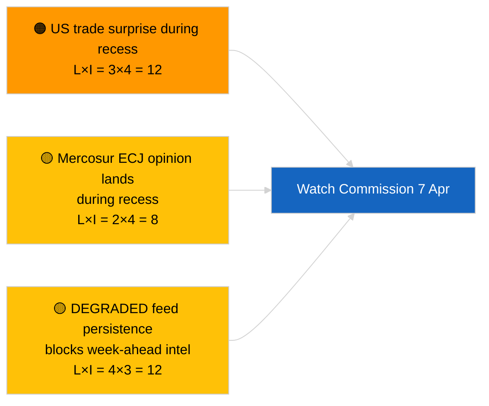

<!-- SPDX-FileCopyrightText: 2026 Hack23 AB -->
<!-- SPDX-License-Identifier: Apache-2.0 -->

# תדריך מנהלים — השבוע הבא | 2026-04-03

**סיווג:** OSINT | רשומה פרלמנטרית ציבורית
**מהימנות:** 🟡 בינוני (מכוון לעתיד; פלט סיווג ריק מגביל עומק)
**נוצר:** 2026-04-03T00:00:00Z (תדריך רטרוספקטיבי)
**סוג מאמר:** השבוע הבא
**מזהה ריצה:** `d2e395b4-2fc9-4924-8b79-554b0453c034`
**מקור:** פורטל הנתונים הפתוח של הפרלמנט האירופי

---

## 🎯 BLUF

**השבוע 6–12 באפריל 2026 יהיה שבוע חופשת פסחא שקט — ללא מליאה, ללא ישיבות ועדה רשמיות, פעילות מוגבלת של ישיבת יום שלישי של הנציבות.** ריצה `d2e395b4-2fc9-4924-8b79-554b0453c034` החזירה **«דירוג סיכונים כמותי על פני 0 ממדים פוליטיים שזוהו»** ללא גורמים מסווגים. האירוע המוסדי הבולט ביותר בשבוע הוא ישיבת יום שלישי של הנציבות (7 באפריל), ההצגה הקולגיאלית הראשונה לאחר הפסחא, אשר עשויה להניב הצעות חדשות או הודעות מדיניות מסחר. עבודת הוועדות של הפרלמנט האירופי תתחדש נומינלית בשבוע שלאחריו (13–17 באפריל). **🟡 מהימנות בינונית** בתחזית «שבוע שקט» לאור מצב ה-API של הפרלמנט האירופי המדורדר המגביל אות עתידי; **🟢 מהימנות גבוהה** שלא תוכנן מליאה או הצבעת ועדה רשמית.

---

## 🧭 3 החלטות שתדריך זה תומך בהן

| # | החלטה | מי מחליט | מועד אחרון | ראיה |
|:-:|--------|----------|:----------:|------|
| 1 | **עריכתי:** פרסם נקודת מבט שבוע שקט עם דגש על הנציבות ב-7 באפריל | עורך | +24 שעות | לוח שנה + קצב הנציבות |
| 2 | **ניטור:** לכוד פלט הנציבות ב-7 באפריל במסדה ייעודי | אנליסט | 2026-04-07 | הצגה קולגיאלית ראשונה לאחר פסחא |
| 3 | **מבט קדימה:** מחזור מודיעין קדם-מליאה מתחיל 13 באפריל | ראש ניתוח | 2026-04-13 | שבוע עבודת ועדות |

---

## 📰 קריאה של 60 שניות

- 🔴 **אין מליאה של הפרלמנט האירופי** מתוכנן 6–12 באפריל 2026; חג הפסחא 12 באפריל. (🟢 גבוה)
- 🟠 **יום שלישי של הנציבות 7 באפריל 2026** הוא האירוע הבין-מוסדי הבודד המאושר בעל ערך מודיעיני. (🟢 גבוה)
- 🟢 **0 גורמים מסווגים** בריצה זו — סינתזת השבוע הבא בחסר מבני. (🟢 גבוה)
- 🟡 **מצב API מדורדר** נמשך מ-2026-04-03/breaking-2 — מסדי השבוע הבא ייפגעו כנראה גם הם. (🟢 גבוה)
- 🔵 **הקשר כלכלי:** חלון פרסום IMF אפריל WEO חופף לשבוע הבא; נתוני לחץ פיסקלי עשויים לצבוע את דיון ה-MFF במהלך המליאה. (🟢 גבוה)
- 🟣 **הפניה צולבת:** ראה 2026-04-03/breaking, breaking-2, breaking-3 לתוכן יום שישי מהותי. (🟢 גבוה)
- 🩷 **וקטור שיבוש:** הכרזה מסחרית אמריקנית בשבוע הפסחא עשויה לאלץ הצעת נציבות בנתיב מהיר. (🟡 בינוני)
- ⚪ **העברה:** עקוב אחר התפתחויות משפטיות פולניות למקרי המשך בתקדים בראון.

---

## 🗂️ אירועים / טריגרים מובילים — שבוע 6–12 באפריל 2026

| דירוג | אירוע | תאריך | חשיבות | מהימנות |
|:-----:|-------|--------|:------:|:-------:|
| 1 | ישיבת יום שלישי של הנציבות | 7 באפריל | 7.0 | 🟢 HIGH |
| 2 | חג הפסחא (סימון לוח שנה) | 12 באפריל | 3.0 | 🟢 HIGH |
| 3 | שני שאחרי פסחא (סיום הפסקה ת-1) | 13 באפריל | 5.0 | 🟢 HIGH |
| 4 | אין ישיבות ועדה של הפרלמנט האירופי | שבוע | 0.0 | 🟢 HIGH |
| 5 | אין מליאה של הפרלמנט האירופי | שבוע | 0.0 | 🟢 HIGH |

---

## ⚠️ סקירת סיכונים ואיומים

| סיכון | ס | ח | ניקוד | טריגר | מקור | אדמירליות |
|-------|:-:|:-:|:-----:|-------|------|:---------:|
| הפתעה מסחרית אמריקנית בהפסקה | 3 | 4 | 12 | הכרזה אמריקנית | TA-10-2026-0096 | A1 |
| חוות דעת ECJ על מרקוסור בהפסקה | 2 | 4 | 8 | פרסומים משפטיים | TA-10-2026-0008 | A2 |
| התמדת הזנה מדורדרת | 4 | 3 | 12 | אחרי 14 באפריל | ריצה אחות `breaking-2` | A1 |
| תיק מעקב פולני | 3 | 3 | 9 | חקירה חדשה | TA-10-2026-0088 | A2 |

---

## 🔮 הטריגר המוביל לעתיד

**ישיבת יום שלישי של הנציבות 7 באפריל 2026.** ההצגה הקולגיאלית הראשונה לאחר הפסחא תקבע את התמהיל הנושאי למליאת סטרסבורג 27–30 באפריל; היעדר הצגת מסחר או רפורמה מוסדית יאותת על הטיית תרחיש ג מכוונת (כלכלית/תעשייתית).

---

## 🛡️ הערכת איכות מקורות

- **מקורות ראשוניים:** ריצה `d2e395b4-2fc9-4924-8b79-554b0453c034`; לוח שנה של הפרלמנט האירופי; קצב הנציבות.
- **מגבלות נתונים:** הסקה עתידית במצב הזנה מדורדר; מסדי השבוע הבא יהיו לא אמינים.
- **מהימנות:** 🟢 גבוה לעובדות לוח שנה; 🟡 בינוני לתחזית צפיפות אירועים.

---

## 📎 קישורים

| קישור | נתיב |
|-------|------|
| מאמר | `./article.md` |
| ריצות אחיות | `analysis/daily/2026-04-03/breaking/`، `breaking-2/`، `breaking-3/`، `committee-reports/`، `motions/`، `propositions/` |
| מניפסט | `./manifest.json` |

---

**ניהול מסמכים**
- **תבנית:** `/analysis/templates/executive-brief.md`
- **נתיב ארטיפקט:** `analysis/daily/2026-04-03/week-ahead/executive-brief.md`
- **סיווג:** ציבורי
- **יצירה רטרוספקטיבית:** סשן מילוי-לאחור.
