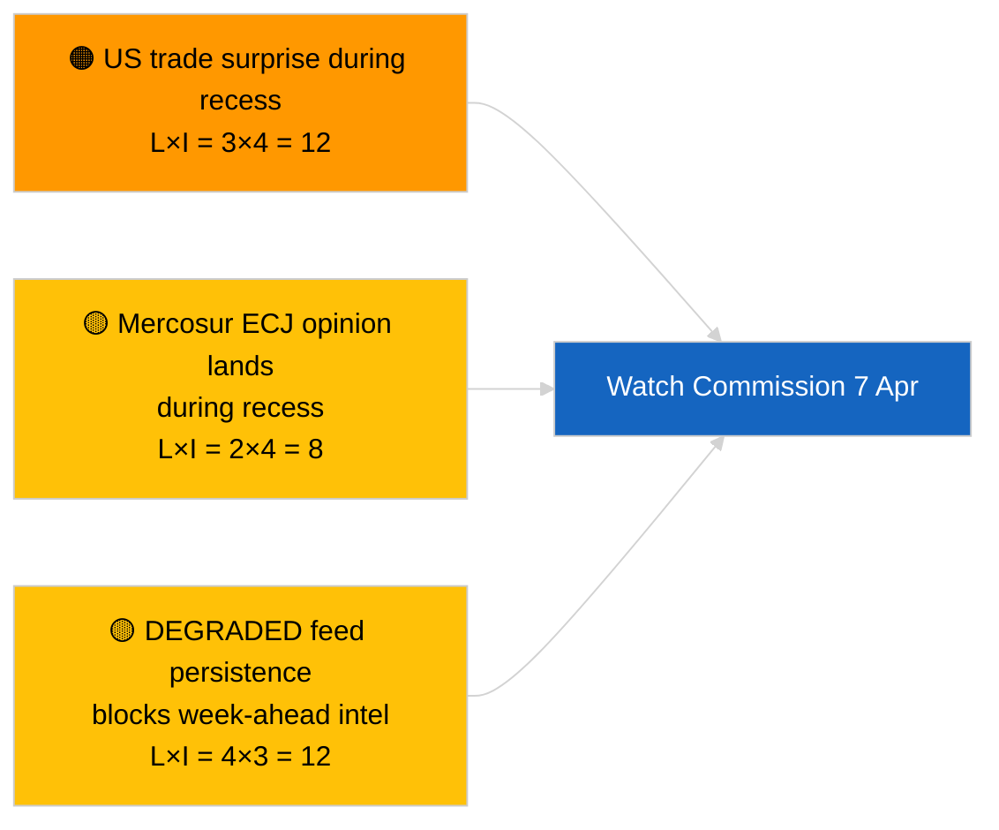

<!-- SPDX-FileCopyrightText: 2026 Hack23 AB -->
<!-- SPDX-License-Identifier: Apache-2.0 -->

# エグゼクティブブリーフィング — 来週の展望 | 2026-04-03

**分類:** OSINT | 公開議会記録
**信頼度:** 🟡 中程度（将来予測型；分類出力が空のため深度が限定）
**作成日:** 2026-04-03T00:00:00Z（遡及ブリーフィング）
**記事タイプ:** 来週の展望
**実行ID:** `d2e395b4-2fc9-4924-8b79-554b0453c034`
**出典:** 欧州議会オープンデータポータル

---

## 🎯 BLUF

**2026年4月6日〜12日の週は静かなイースター休暇週となる見込み — 本会議なし、正式な委員会会議なし、委員会の火曜活動も限定的。** 実行 `d2e395b4-2fc9-4924-8b79-554b0453c034` は **「0の政治的次元に対する定量的リスク評価」** を返し、分類された行為者なし。今週最も注目すべき制度的イベントは委員会の火曜会議（4月7日）であり、イースター後初の大学院発表会として、新しい提案や貿易政策コミュニケーションが生まれる可能性がある。欧州議会の委員会作業は翌週（4月13日〜17日）から名目上再開される。**🟡 中程度の信頼度**（「静かな週」予測はEP APIの劣化状態により将来シグナルが制限される）；**🟢 高い信頼度**（本会議も正式な委員会投票も予定されていない）。

---

## 🧭 このブリーフィングが支援する3つの決定

| # | 決定 | 決定者 | 期限 | 根拠 |
|:-:|------|--------|:----:|------|
| 1 | **編集:** 4月7日の委員会に重点を置いた「静かな週」の視点を公開 | 編集長 | +24時間 | カレンダー＋委員会のリズム |
| 2 | **モニタリング:** 4月7日の委員会出力を専用プローブで捕捉 | アナリスト | 2026-04-07 | イースター後初の大学院発表会 |
| 3 | **先読み:** 本会議前の情報収集サイクルが4月13日から開始 | 分析リード | 2026-04-13 | 委員会作業週 |

---

## 📰 60秒で読む

- 🔴 **欧州議会本会議なし**（2026年4月6日〜12日）；イースター 4月12日。(🟢 高)
- 🟠 **委員会の火曜日 2026年4月7日** が情報価値のある唯一確認済み府際イベント。(🟢 高)
- 🟢 **今回の実行では0行為者が分類済み** — 来週分析は構造的に不足している。(🟢 高)
- 🟡 **APIの劣化状態** が2026-04-03/breaking-2から継続 — 来週プローブも影響を受ける可能性が高い。(🟢 高)
- 🔵 **経済的文脈:** IMF 4月WEO公開ウィンドウが翌週と重なり、財政ストレスデータが本会議でのMFF議論に影響する可能性。(🟢 高)
- 🟣 **相互参照:** 2026-04-03/breaking、breaking-2、breaking-3の金曜日の実質的内容を参照。(🟢 高)
- 🩷 **混乱ベクター:** イースター週の米国貿易発表が委員会提案の迅速手続きを強いる可能性。(🟡 中)
- ⚪ **引き継ぎ:** ブラウン先例事件の後続訴訟のためポーランドの司法動向を追跡。

---

## 🗂️ 主要イベント / トリガー — 2026年4月6日〜12日

| 順位 | イベント | 日付 | 重要性 | 信頼度 |
|:----:|---------|------|:------:|:------:|
| 1 | 委員会火曜会議 | 4月7日 | 7.0 | 🟢 HIGH |
| 2 | イースター（カレンダー目印） | 4月12日 | 3.0 | 🟢 HIGH |
| 3 | イースターマンデー（休暇終了T-1） | 4月13日 | 5.0 | 🟢 HIGH |
| 4 | EP委員会会議なし | 週全体 | 0.0 | 🟢 HIGH |
| 5 | EP本会議なし | 週全体 | 0.0 | 🟢 HIGH |

---

## ⚠️ リスク・脅威スナップショット

| リスク | 可 | 影 | スコア | トリガー | 出典 | 海軍式評価 |
|--------|:-:|:-:|:------:|---------|------|:---------:|
| 休会中の米国貿易サプライズ | 3 | 4 | 12 | 米国発表 | TA-10-2026-0096 | A1 |
| 休会中のメルコスールECJ意見 | 2 | 4 | 8 | 司法公表 | TA-10-2026-0008 | A2 |
| フィード劣化の継続 | 4 | 3 | 12 | 4月14日以降 | 姉妹実行 `breaking-2` | A1 |
| ポーランド司法後続訴訟 | 3 | 3 | 9 | 新捜査 | TA-10-2026-0088 | A2 |

---

## 🔮 最重要先行トリガー

**委員会火曜会議 2026年4月7日。** イースター後初の大学院プレゼンテーションが4月27日〜30日のストラスブール本会議のテーマ構成を決定する；貿易または制度改革のプレゼンテーションがなければ、シナリオC（経済/産業）への意図的な重み付けを示すシグナルとなる。

---

## 🛡️ 情報源品質評価

- **一次情報源:** 実行 `d2e395b4-2fc9-4924-8b79-554b0453c034`；EP カレンダー；委員会リズム。
- **データ制限:** フィード劣化状態での将来推測；来週プローブは信頼性が低い。
- **信頼度:** 🟢 高（カレンダーの事実）；🟡 中（イベント密度予測）。

---

## 📎 リンク

| リンク | パス |
|-------|------|
| 記事 | `./article.md` |
| 姉妹実行 | `analysis/daily/2026-04-03/breaking/`、`breaking-2/`、`breaking-3/`、`committee-reports/`、`motions/`、`propositions/` |
| マニフェスト | `./manifest.json` |

---

**ドキュメント管理**
- **テンプレート:** `/analysis/templates/executive-brief.md`
- **アーティファクトパス:** `analysis/daily/2026-04-03/week-ahead/executive-brief.md`
- **分類:** 公開
- **遡及生成:** バックフィルセッション。
