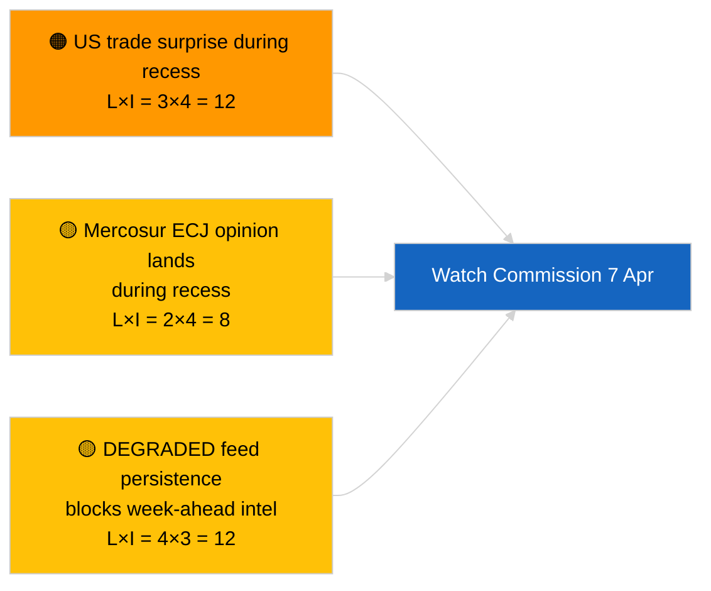

<!-- SPDX-FileCopyrightText: 2026 Hack23 AB -->
<!-- SPDX-License-Identifier: Apache-2.0 -->

# 집행 브리핑 — 다음 주 전망 | 2026-04-03

**분류:** OSINT | 공개 의회 기록
**신뢰도:** 🟡 중간 (미래 지향적; 빈 분류 출력으로 깊이 제한)
**생성일:** 2026-04-03T00:00:00Z (소급 브리핑)
**기사 유형:** 다음 주 전망
**실행 ID:** `d2e395b4-2fc9-4924-8b79-554b0453c034`
**출처:** 유럽 의회 공개 데이터 포털

---

## 🎯 BLUF

**2026년 4월 6일~12일 주는 조용한 부활절 휴가 주 — 본회의 없음, 공식 위원회 회의 없음, 집행위원회 화요일 활동 제한.** 실행 `d2e395b4-2fc9-4924-8b79-554b0453c034`은 **«0개 식별된 정치적 차원에 대한 정량적 위험 점수»** 를 반환하였고 분류된 행위자가 없었다. 이번 주 가장 주목할 만한 제도적 이벤트는 집행위원회 화요일 회의 (4월 7일)이며, 부활절 이후 첫 번째 대학원 발표로 새로운 제안이나 무역 정책 통보가 나올 수 있다. 유럽 의회 위원회 작업은 다음 주 (4월 13일~17일)부터 명목상 재개된다. **🟡 중간 신뢰도** ("조용한 주" 예측, EP API 저하 상태로 미래 신호 제한); **🟢 높은 신뢰도** (본회의나 공식 위원회 투표 미예정).

---

## 🧭 이 브리핑이 지원하는 3가지 결정

| # | 결정 | 결정자 | 마감일 | 근거 |
|:-:|------|--------|:------:|------|
| 1 | **편집:** 4월 7일 집행위원회에 중점을 둔 「조용한 주」 관점 발표 | 편집장 | +24시간 | 일정표 + 집행위원회 리듬 |
| 2 | **모니터링:** 4월 7일 집행위원회 출력을 전용 프로브에서 포착 | 분석가 | 2026-04-07 | 부활절 이후 첫 번째 대학원 발표 |
| 3 | **미래 전망:** 본회의 전 정보 수집 주기가 4월 13일 시작 | 분석 팀장 | 2026-04-13 | 위원회 작업 주 |

---

## 📰 60초 요약

- 🔴 **유럽 의회 본회의 없음** (2026년 4월 6일~12일); 부활절 4월 12일. (🟢 높음)
- 🟠 **집행위원회 화요일 2026년 4월 7일** 이 정보 가치 있는 유일한 확인된 기관 간 이벤트. (🟢 높음)
- 🟢 **이번 실행에서 0명 행위자 분류됨** — 다음 주 종합은 구조적으로 부족. (🟢 높음)
- 🟡 **API 저하 상태** 가 2026-04-03/breaking-2에서 계속 — 다음 주 프로브도 영향받을 가능성 높음. (🟢 높음)
- 🔵 **경제적 맥락:** IMF 4월 WEO 공개 기간이 다음 주와 겹쳐 재정 스트레스 데이터가 본회의 중 MFF 토론에 영향 줄 수 있음. (🟢 높음)
- 🟣 **교차 참조:** 2026-04-03/breaking, breaking-2, breaking-3의 실질적인 금요일 내용 참조. (🟢 높음)
- 🩷 **혼란 벡터:** 부활절 주 미국 무역 발표가 집행위원회 제안 신속 처리를 강요할 수 있음. (🟡 중간)
- ⚪ **인계:** 브라운 선례 후속 사건을 위해 폴란드 사법 동향 추적.

---

## 🗂️ 주요 이벤트 / 트리거 — 2026년 4월 6일~12일 주

| 순위 | 이벤트 | 날짜 | 중요도 | 신뢰도 |
|:----:|-------|------|:------:|:------:|
| 1 | 집행위원회 화요일 회의 | 4월 7일 | 7.0 | 🟢 HIGH |
| 2 | 부활절 (일정 표시) | 4월 12일 | 3.0 | 🟢 HIGH |
| 3 | 부활절 월요일 (휴가 종료 T-1) | 4월 13일 | 5.0 | 🟢 HIGH |
| 4 | EP 위원회 회의 없음 | 주 | 0.0 | 🟢 HIGH |
| 5 | EP 본회의 없음 | 주 | 0.0 | 🟢 HIGH |

---

## ⚠️ 위험 및 위협 스냅샷

| 위험 | 가 | 영 | 점수 | 트리거 | 출처 | 해군식 평가 |
|------|:-:|:-:|:----:|-------|------|:---------:|
| 휴회 중 미국 무역 서프라이즈 | 3 | 4 | 12 | 미국 발표 | TA-10-2026-0096 | A1 |
| 휴회 중 메르코수르 ECJ 의견 | 2 | 4 | 8 | 사법 공표 | TA-10-2026-0008 | A2 |
| 피드 저하 지속 | 4 | 3 | 12 | 4월 14일 이후 | 자매 실행 `breaking-2` | A1 |
| 폴란드 사법 후속 사건 | 3 | 3 | 9 | 신규 수사 | TA-10-2026-0088 | A2 |

---

## 🔮 가장 중요한 미래 트리거

**집행위원회 화요일 회의 2026년 4월 7일.** 부활절 이후 첫 번째 대학원 프레젠테이션이 4월 27일~30일 스트라스부르 본회의의 주제 구성을 결정; 무역 또는 제도 개혁 발표 부재는 의도적인 시나리오 C (경제/산업) 가중치를 의미.

---

## 🛡️ 출처 품질 평가

- **1차 출처:** 실행 `d2e395b4-2fc9-4924-8b79-554b0453c034`; EP 일정표; 집행위원회 리듬.
- **데이터 제한:** 피드 저하 상태에서의 미래 추론; 다음 주 프로브는 신뢰할 수 없음.
- **신뢰도:** 🟢 높음 (일정 사실); 🟡 중간 (이벤트 밀도 예측).

---

## 📎 링크

| 링크 | 경로 |
|------|------|
| 기사 | `./article.md` |
| 자매 실행 | `analysis/daily/2026-04-03/breaking/`, `breaking-2/`, `breaking-3/`, `committee-reports/`, `motions/`, `propositions/` |
| 매니페스트 | `./manifest.json` |

---

**문서 관리**
- **템플릿:** `/analysis/templates/executive-brief.md`
- **아티팩트 경로:** `analysis/daily/2026-04-03/week-ahead/executive-brief.md`
- **분류:** 공개
- **소급 생성:** 백필 세션.
