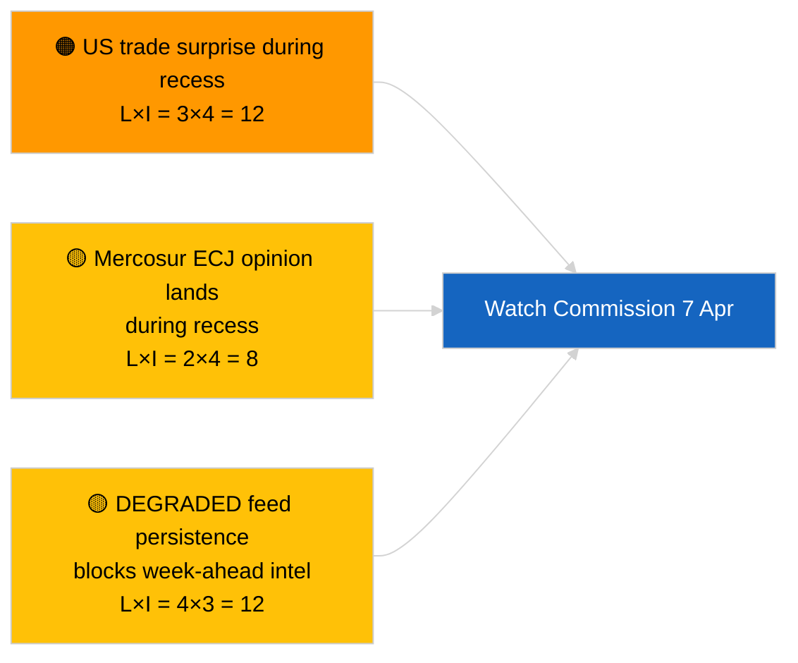

<!-- SPDX-FileCopyrightText: 2026 Hack23 AB -->
<!-- SPDX-License-Identifier: Apache-2.0 -->

# Uitvoerende Briefing — Week Vooruit | 2026-04-03

**Classificatie:** OSINT | Openbaar parlementair record
**Betrouwbaarheid:** 🟡 Gemiddeld (toekomstgericht; lege classificatie-uitvoer beperkt de diepte)
**Gegenereerd:** 2026-04-03T00:00:00Z (retrospectieve briefing)
**Artikeltype:** Week Vooruit
**Uitvoerings-ID:** `d2e395b4-2fc9-4924-8b79-554b0453c034`
**Bron:** Europees Parlement — Open Dataportaal

---

## 🎯 BLUF

**De week van 6–12 april 2026 zal een rustige Paasrecessweek zijn — geen plenaire vergadering, geen formele commissievergaderingen, beperkte Commissie dinsdag-activiteit.** Uitvoering `d2e395b4-2fc9-4924-8b79-554b0453c034` leverde **«Kwantitatieve risicoscoring over 0 geïdentificeerde politieke dimensies»** op zonder geclassificeerde actoren. Het meest opmerkelijke institutionele evenement van de week is de Commissie dinsdagvergadering (7 april), de eerste collegeagenda na Pasen, die nieuwe voorstellen of handelspolitieke communicaties kan opleveren. Het EP-commissiewerk hervat nominaal de volgende week (13–17 april). **🟡 GEMIDDELD vertrouwen** in de «rustige week»-prognose gezien de GEDEGRADEERDE EP-API-staat die het voorwaartse signaal beperkt; **🟢 HOOG vertrouwen** dat er geen plenaire vergadering of formele commissiestemming is gepland.

---

## 🧭 3 Beslissingen die deze briefing ondersteunt

| # | Beslissing | Wie beslist | Deadline | Bewijs |
|:-:|-----------|-------------|:--------:|--------|
| 1 | **Redactioneel:** rustige week-perspectief publiceren met nadruk op Commissie 7 april | Redacteur | +24u | Kalender + Commissie-cadans |
| 2 | **Monitoring:** Commissie 7 april-uitvoer vastleggen in een speciale sonde | Analist | 2026-04-07 | Eerste post-Pasen collegepresentatie |
| 3 | **Vooruitkijken:** pre-plenaire inlichtingencyclus begint 13 april | Analyselead | 2026-04-13 | Commissiewerk-week |

---

## 📰 60-Second Read

- 🔴 **Geen EP-plenaire vergadering** gepland 6–12 april 2026; Eerste Paasdag 12 april. (🟢 Hoog)
- 🟠 **Commissie dinsdag 7 april 2026** is het enige bevestigde inter-institutionele evenement met inlichtingenwaarde. (🟢 Hoog)
- 🟢 **0 actoren geclassificeerd** in deze uitvoering — week-vooruit-synthese is structureel onderbedeeld. (🟢 Hoog)
- 🟡 **GEDEGRADEERDE API-staat** gaat door vanuit 2026-04-03/breaking-2 — week-vooruit-sondes zullen waarschijnlijk ook last hebben. (🟢 Hoog)
- 🔵 **Economische context:** IMF April WEO-publicatievenster sluit aan bij de volgende week; fiscale stressdata kunnen het MFF-debat tijdens de plenaire vergadering beïnvloeden. (🟢 Hoog)
- 🟣 **Kruisverwijzing:** zie 2026-04-03/breaking, breaking-2, breaking-3 voor substantiële vrijdagsinhoud. (🟢 Hoog)
- 🩷 **Verstoringsvektor:** een Amerikaanse handelsaankondiging tijdens Paasweek kan een spoedprocedure Commissievoorstel dwingen. (🟡 Gemiddeld)
- ⚪ **Overdracht:** Poolse rechtbank-ontwikkelingen volgen voor Braun-precedent-vervolgzaken.

---

## 🗂️ Topgebeurtenissen / Triggers — Week van 6–12 april 2026

| Rang | Gebeurtenis | Datum | Belang | Betrouwbaarheid |
|:----:|-------------|-------|:------:|:---------------:|
| 1 | Commissie dinsdagvergadering | 7 april | 7,0 | 🟢 HIGH |
| 2 | Eerste Paasdag (kalendermarkering) | 12 april | 3,0 | 🟢 HIGH |
| 3 | Tweede Paasdag (recesseinde T-1) | 13 april | 5,0 | 🟢 HIGH |
| 4 | Geen EP-commissievergaderingen | week | 0,0 | 🟢 HIGH |
| 5 | Geen EP-plenaire vergadering | week | 0,0 | 🟢 HIGH |

---

## ⚠️ Risico- en Dreigingsoverzicht

| Risico | W | I | Score | Trigger | Bron | Admiraliteit |
|--------|:-:|:-:|:-----:|---------|------|:------------:|
| Amerikaanse handelsverrassing tijdens reces | 3 | 4 | 12 | Amerikaanse aankondiging | TA-10-2026-0096 | A1 |
| Mercosur HvJ EU-advies tijdens reces | 2 | 4 | 8 | Gerechtelijke publicaties | TA-10-2026-0008 | A2 |
| GEDEGRADEERDE feed-persistentie | 4 | 3 | 12 | Voorbij 14 april | Zuster `breaking-2` | A1 |
| Pools rechtbank-vervolgzaak | 3 | 3 | 9 | Nieuw onderzoek | TA-10-2026-0088 | A2 |

---

## 🔮 Belangrijkste Voorwaartse Trigger

**Commissie dinsdagvergadering 7 april 2026.** De eerste post-Pasen collegepresentatie zal de thematische mix voor de Straatsburg plenaire vergadering van 27–30 april bepalen; het uitblijven van handels- of institutionele hervormingspresentatie zou een bewuste scenario-C-weging (economisch/industrieel) signaleren.

---

## 🛡️ Beoordeling van Bronkwaliteit

- **Primaire bronnen:** Uitvoering `d2e395b4-2fc9-4924-8b79-554b0453c034`; EP-kalender; Commissie-cadans.
- **Databeperkingen:** Voorwaartse gevolgtrekking onder GEDEGRADEERDE feedstatus; week-vooruit-sondes zullen onbetrouwbaar zijn.
- **Betrouwbaarheid:** 🟢 HOOG bij kalenderfeitelijkheden; 🟡 GEMIDDELD bij evenementendichtheids-projectie.

---

## 📎 Links

| Link | Pad |
|------|-----|
| Artikel | `./article.md` |
| Zusteruitvoeringen | `analysis/daily/2026-04-03/breaking/`, `breaking-2/`, `breaking-3/`, `committee-reports/`, `motions/`, `propositions/` |
| Manifest | `./manifest.json` |

---

**Documentbeheer**
- **Sjabloon:** `/analysis/templates/executive-brief.md`
- **Artefactpad:** `analysis/daily/2026-04-03/week-ahead/executive-brief.md`
- **Classificatie:** Openbaar
- **Retrospectieve generatie:** Back-fill sessie.
