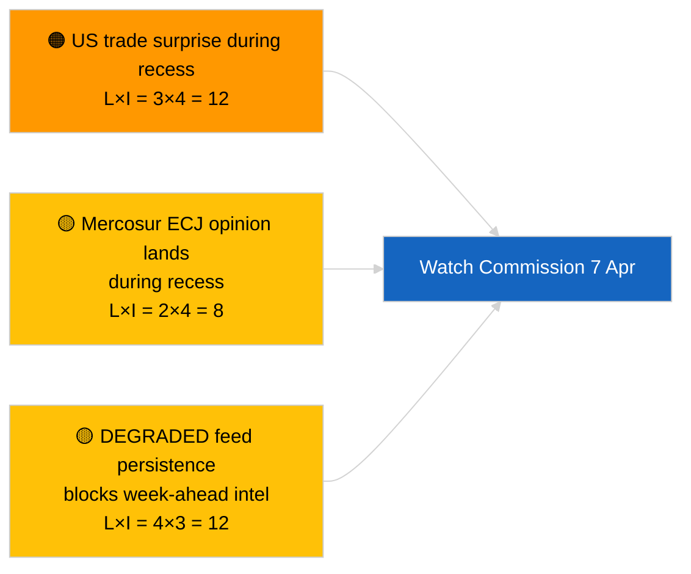

<!-- SPDX-FileCopyrightText: 2026 Hack23 AB -->
<!-- SPDX-License-Identifier: Apache-2.0 -->

# Utøvende Briefing — Uken Fremover | 2026-04-03

**Klassifisering:** OSINT | Offentlig parlamentarisk protokoll
**Konfidensgrad:** 🟡 Middels (fremadrettet; tom klassifiseringsutdata begrenser dybden)
**Generert:** 2026-04-03T00:00:00Z (retrospektiv briefing)
**Artikkeltype:** Uken Fremover
**Kjørings-ID:** `d2e395b4-2fc9-4924-8b79-554b0453c034`
**Kilde:** Europaparlamentets Åpne Dataportal

---

## 🎯 BLUF

**Uken 6.–12. april 2026 vil være en rolig påskeuke — ingen plenarsesjon, ingen formelle utvalgssesjoner, begrenset Kommisjonens tirsdagsaktivitet.** Kjøring `d2e395b4-2fc9-4924-8b79-554b0453c034` returnerte **«Kvantitativ risikoscoring over 0 identifiserte politiske dimensjoner»** uten klassifiserte aktører. Ugens mest bemerkelsesverdige institusjonelle begivenhet er Kommisjonens tirsdagsmøte (7. april), den første kollegiepresentasjonen etter påske, som kan gi nye forslag eller handelspolitiske kommunikéer. EP-utvalgsarbeidet gjenopptas nominelt den følgende uken (13.–17. april). **🟡 MIDDELS konfidensgrad** for prognosen om «rolig uke» gitt den DEGRADERTE EP-API-tilstanden som begrenser fremadrettet signal; **🟢 HØY konfidensgrad** om at ingen plenarsesjon eller formell utvalgsavstemning er planlagt.

---

## 🧭 3 Beslutninger som denne briefingen støtter

| # | Beslutning | Hvem bestemmer | Frist | Bevis |
|:-:|-----------|---------------|:-----:|-------|
| 1 | **Redaksjonelt:** publiser rolig-uke-perspektiv med fokus på Kommisjonen 7. april | Redaktør | +24t | Kalender + Kommisjonens kadanse |
| 2 | **Overvåkning:** fang Kommisjonens 7. april-utdata i en dedikert sonde | Analytiker | 2026-04-07 | Første post-påske kollegiepresentasjon |
| 3 | **Fremadrettet:** pre-plenar etterretningssyklus begynner 13. april | Analyseleder | 2026-04-13 | Utvalgsarbeidsuke |

---

## 📰 60-Second Read

- 🔴 **Ingen EP-plenarsesjon** planlagt 6.–12. april 2026; Påskedag 12. april. (🟢 Høy)
- 🟠 **Kommisjonens tirsdag 7. april 2026** er den eneste bekreftede inter-institusjonelle begivenheten med etterretningsverdi. (🟢 Høy)
- 🟢 **0 aktører klassifisert** i denne kjøringen — uke-fremover-syntese er strukturelt underforsynt. (🟢 Høy)
- 🟡 **DEGRADERT API-tilstand** fortsetter fra 2026-04-03/breaking-2 — uke-fremover-sonder vil sannsynligvis også bli påvirket. (🟢 Høy)
- 🔵 **Økonomisk kontekst:** IMF april WEO-publikasjonsvindu overlapper neste uke; finansielle stressdata kan farge MFF-debatten under plenarsesjon. (🟢 Høy)
- 🟣 **Kryssreferanse:** se 2026-04-03/breaking, breaking-2, breaking-3 for substansielt fredagsinnhold. (🟢 Høy)
- 🩷 **Forstyrelsesvektor:** en amerikansk handelsannonsering i påskeuken kan tvinge et hastekspors-Kommisjonsforslag. (🟡 Middels)
- ⚪ **Overføring:** følg polske rettsutviklinger for oppfølgingssaker i Braun-presedensrettssaken.

---

## 🗂️ Topphendelser / Triggere — Uken 6.–12. april 2026

| Rang | Hendelse | Dato | Viktighet | Konfidensgrad |
|:----:|---------|------|:---------:|:-------------:|
| 1 | Kommisjonens tirsdagsmøte | 7. april | 7,0 | 🟢 HIGH |
| 2 | Påskedag (kalendermarkering) | 12. april | 3,0 | 🟢 HIGH |
| 3 | 2. påskedag (recesseslutt T-1) | 13. april | 5,0 | 🟢 HIGH |
| 4 | Ingen EP-utvalgssesjoner | uke | 0,0 | 🟢 HIGH |
| 5 | Ingen EP-plenarsesjon | uke | 0,0 | 🟢 HIGH |

---

## ⚠️ Risiko- og Trusselvurdering

| Risiko | S | I | Score | Trigger | Kilde | Admiralitet |
|--------|:-:|:-:|:-----:|---------|-------|:-----------:|
| Amerikansk handelsoverraskelse under recess | 3 | 4 | 12 | Amerikansk annonsering | TA-10-2026-0096 | A1 |
| Mercosur EU-domstolsuttalelse under recess | 2 | 4 | 8 | Rettspublikasjoner | TA-10-2026-0008 | A2 |
| DEGRADERT feedpersistens | 4 | 3 | 12 | Etter 14. april | Søskenkjøring `breaking-2` | A1 |
| Polsk rettssak-oppfølgingssak | 3 | 3 | 9 | Ny undersøkelse | TA-10-2026-0088 | A2 |

---

## 🔮 Viktigste Fremadrettede Trigger

**Kommisjonens tirsdagsmøte 7. april 2026.** Den første post-påske kollegiepresentasjonen setter den tematiske sammensetningen for Strasbourg-plenarsesjon 27.–30. april; fraværet av handels- eller institusjonell reformpresentasjon ville signalere en bevisst scenario C-vekting (økonomisk/industriell).

---

## 🛡️ Vurdering av Kildekvalitet

- **Primærkilder:** Kjøring `d2e395b4-2fc9-4924-8b79-554b0453c034`; EP-kalender; Kommisjonens kadanse.
- **Databegrensninger:** Fremadrettet slutning under DEGRADERT feedtilstand; uke-fremover-sonder vil være upålitelige.
- **Konfidensgrad:** 🟢 HØY for kalenderfakta; 🟡 MIDDELS for begivenhetstetthetsprognose.

---

## 📎 Lenker

| Lenke | Sti |
|-------|-----|
| Artikkel | `./article.md` |
| Søskenkjøringer | `analysis/daily/2026-04-03/breaking/`, `breaking-2/`, `breaking-3/`, `committee-reports/`, `motions/`, `propositions/` |
| Manifest | `./manifest.json` |

---

**Dokumentkontroll**
- **Mal:** `/analysis/templates/executive-brief.md`
- **Artefaktsti:** `analysis/daily/2026-04-03/week-ahead/executive-brief.md`
- **Klassifisering:** Offentlig
- **Retrospektiv generering:** Back-fill-sesjon.
