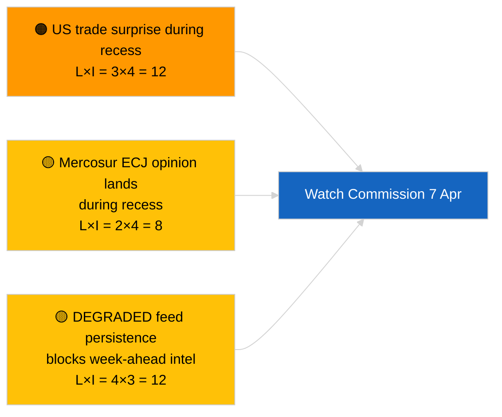

<!-- SPDX-FileCopyrightText: 2026 Hack23 AB -->
<!-- SPDX-License-Identifier: Apache-2.0 -->

# Exekutivbriefing — Veckan Framåt | 2026-04-03

**Klassificering:** OSINT | Offentligt parlamentariskt register
**Konfidensgrad:** 🟡 Medel (framåtblickande; tom klassificeringsutdata begränsar djupet)
**Genererad:** 2026-04-03T00:00:00Z (retrospektivt briefing)
**Artikeltyp:** Veckan Framåt
**Körnings-ID:** `d2e395b4-2fc9-4924-8b79-554b0453c034`
**Källa:** Europaparlamentets Öppna Dataportal

---

## 🎯 BLUF

**Veckan 6–12 april 2026 blir en lugn påskuppehlsvecka — inget plenum, inga formella utskottssessioner, begränsad Kommissionens tisdagsaktivitet.** Körning `d2e395b4-2fc9-4924-8b79-554b0453c034` returnerade **«Kvantitativ riskbedömning över 0 identifierade politiska dimensioner»** utan klassificerade aktörer. Veckans mest anmärkningsvärda institutionella händelse är Kommissionens tisdagsmöte (7 april), den första kollegiepresentationen efter påsk, som kan ge upphov till nya förslag eller handelspolitiska kommunikéer. EP:s utskottsarbete återupptas nominellt under följande vecka (13–17 april). **🟡 MEDEL konfidensgrad** för prognosen om «lugn vecka» med hänsyn till det DEGRADERADE EP-API-tillståndet som begränsar framåtriktat signal; **🟢 HÖG konfidensgrad** att inget plenum eller formell utskottsomröstning är planerad.

---

## 🧭 3 Beslut som detta briefing stödjer

| # | Beslut | Vem beslutar | Deadline | Bevis |
|:-:|--------|-------------|:--------:|-------|
| 1 | **Redaktionellt:** publicera lugn-vecka-perspektiv med betoning på Kommissionen 7 april | Redaktör | +24h | Kalender + Kommissionens kadans |
| 2 | **Bevakning:** fånga Kommissionens 7 april-utdata i en dedikerad sond | Analytiker | 2026-04-07 | Första post-påsk kollegiepresentation |
| 3 | **Framåtblick:** pre-plenär underrättelsecy kel börjar 13 april | Analysledare | 2026-04-13 | Utskottsarbetsvecka |

---

## 📰 60-Second Read

- 🔴 **Inget EP-plenum** planerat 6–12 april 2026; Påskdagen 12 april. (🟢 Hög)
- 🟠 **Kommissionens tisdag 7 april 2026** är den enda bekräftade inter-institutionella händelsen med underrättelsevärde. (🟢 Hög)
- 🟢 **0 aktörer klassificerade** i denna körning — vecka-framåt-syntes är strukturellt underförsedd. (🟢 Hög)
- 🟡 **DEGRADERAT API-tillstånd** fortsätter från 2026-04-03/breaking-2 — vecka-framåt-sonder kommer sannolikt också att drabbas. (🟢 Hög)
- 🔵 **Ekonomiskt sammanhang:** IMF April WEO-publiceringsfönster sammanfaller med följande vecka; finansiella stressdata kan färga MFF-debatten under plenarsessionen. (🟢 Hög)
- 🟣 **Korsreferens:** se 2026-04-03/breaking, breaking-2, breaking-3 för substantiellt fredagsinnehåll. (🟢 Hög)
- 🩷 **Störningsvektor:** ett amerikanskt handelsmeddelande under påskveckan kan tvinga fram ett snabbspårs-Kommissionsförslag. (🟡 Medel)
- ⚪ **Vidarebefordran:** följ polska rättsutvecklingar för uppföljningsärenden i Braun-prejudikatet.

---

## 🗂️ Toppshändelser / Triggers — Veckan 6–12 april 2026

| Rang | Händelse | Datum | Betydelse | Konfidensgrad |
|:----:|----------|-------|:---------:|:-------------:|
| 1 | Kommissionens tisdagsmöte | 7 april | 7,0 | 🟢 HIGH |
| 2 | Påskdagen (kalendermarkering) | 12 april | 3,0 | 🟢 HIGH |
| 3 | Annandag påsk (recesslut T-1) | 13 april | 5,0 | 🟢 HIGH |
| 4 | Inga EP-utskottssessioner | vecka | 0,0 | 🟢 HIGH |
| 5 | Inget EP-plenum | vecka | 0,0 | 🟢 HIGH |

---

## ⚠️ Risk- och Hotöversikt

| Risk | S | I | Poäng | Trigger | Källa | Amiralitet |
|------|:-:|:-:|:-----:|---------|-------|:----------:|
| Amerikansk handelsöverraskning under recess | 3 | 4 | 12 | Amerikansk annons | TA-10-2026-0096 | A1 |
| Mercosur EU-domstolsyttrande under recess | 2 | 4 | 8 | Domstolspublikationer | TA-10-2026-0008 | A2 |
| DEGRADERAD feedpersistens | 4 | 3 | 12 | Efter 14 april | Syskon `breaking-2` | A1 |
| Polsk rättslig uppföljningsfallär | 3 | 3 | 9 | Ny utredning | TA-10-2026-0088 | A2 |

---

## 🔮 Viktigaste Framåtriktade Trigger

**Kommissionens tisdagsmöte 7 april 2026.** Den första post-påsk kollegiepresentationen sätter den tematiska mixen för Strasbourg-plenariet 27–30 april; frånvaro av handels- eller institutionell reformpresentation skulle signalera en avsiktlig scenario C-viktning (ekonomisk/industriell).

---

## 🛡️ Bedömning av Källkvalitet

- **Primärskällor:** Körning `d2e395b4-2fc9-4924-8b79-554b0453c034`; EP:s kalender; Kommissionens kadans.
- **Databegränsningar:** Framåtinferens under DEGRADERAT feedtillstånd; vecka-framåt-sonder kommer att vara opålitliga.
- **Konfidensgrad:** 🟢 HÖG för kalenderfakta; 🟡 MEDEL för händelsedensitetsprognos.

---

## 📎 Länkar

| Länk | Sökväg |
|------|--------|
| Artikel | `./article.md` |
| Syskorkörningar | `analysis/daily/2026-04-03/breaking/`, `breaking-2/`, `breaking-3/`, `committee-reports/`, `motions/`, `propositions/` |
| Manifest | `./manifest.json` |

---

**Dokumentkontroll**
- **Mall:** `/analysis/templates/executive-brief.md`
- **Artefaktsökväg:** `analysis/daily/2026-04-03/week-ahead/executive-brief.md`
- **Klassificering:** Offentlig
- **Retrospektiv generering:** Back-fill-session.
